# Opinion Poll by Delo Stik for Delo, 1–8 March 2018

<a href="#voting-intentions">Voting Intentions</a> | <a href="#seats">Seats</a> | <a href="#coalitions">Coalitions</a> | <a href="#technical-information">Technical Information</a>

## Voting Intentions

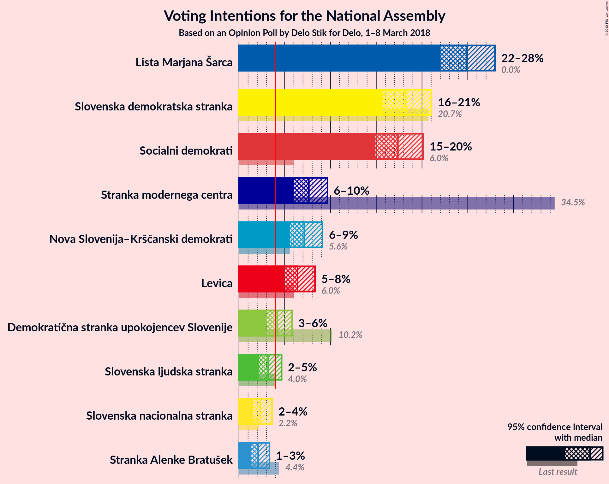

### Confidence Intervals

| Party | Last Result | Poll Result | 80% Confidence Interval | 90% Confidence Interval | 95% Confidence Interval | 99% Confidence Interval |
|:-----:|:-----------:|:-----------:|:-----------------------:|:-----------------------:|:-----------------------:|:-----------------------:|
| Lista Marjana Šarca | 0.0% | 24.9% | 23.0–26.9% |22.5–27.5% |22.0–28.0% |21.2–29.0% |
| Slovenska demokratska stranka | 20.7% | 18.2% | 16.6–20.1% |16.1–20.6% |15.7–21.0% |15.0–21.9% |
| Socialni demokrati | 6.0% | 17.4% | 15.7–19.2% |15.3–19.7% |14.9–20.1% |14.2–21.0% |
| Stranka modernega centra | 34.5% | 7.6% | 6.6–9.0% |6.2–9.3% |6.0–9.7% |5.5–10.3% |
| Nova Slovenija–Krščanski demokrati | 5.6% | 7.1% | 6.1–8.4% |5.8–8.8% |5.6–9.1% |5.1–9.8% |
| Levica | 6.0% | 6.4% | 5.4–7.7% |5.2–8.0% |4.9–8.3% |4.5–8.9% |
| Demokratična stranka upokojencev Slovenije | 10.2% | 4.2% | 3.4–5.2% |3.2–5.5% |3.0–5.8% |2.7–6.3% |
| Slovenska ljudska stranka | 4.0% | 3.2% | 2.5–4.1% |2.3–4.4% |2.2–4.7% |1.9–5.2% |
| Slovenska nacionalna stranka | 2.2% | 2.3% | 1.8–3.2% |1.6–3.4% |1.5–3.6% |1.3–4.1% |
| Stranka Alenke Bratušek | 4.4% | 2.1% | 1.6–2.9% |1.4–3.1% |1.3–3.3% |1.1–3.8% |

*Note:* The poll result column reflects the actual value used in the calculations. Published results may vary slightly, and in addition be rounded to fewer digits.

## Seats

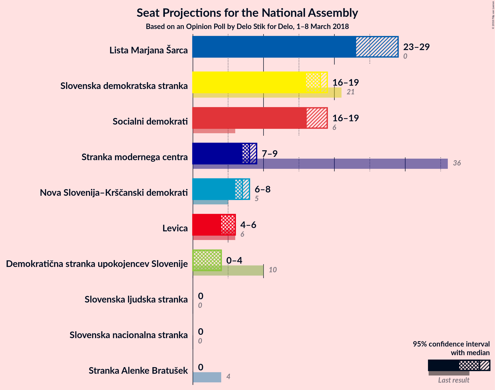

### Confidence Intervals

| Party | Last Result | Median | 80% Confidence Interval | 90% Confidence Interval | 95% Confidence Interval | 99% Confidence Interval |
|:-----:|:-----------:|:------:|:-----------------------:|:-----------------------:|:-----------------------:|:-----------------------:|
| <a href="#lista-marjana-Šarca">Lista Marjana Šarca</a> | 0 | 24 | 22–26 |22–27 |21–27 |20–28 |
| <a href="#slovenska-demokratska-stranka">Slovenska demokratska stranka</a> | 21 | 18 | 16–19 |15–20 |15–20 |14–21 |
| <a href="#socialni-demokrati">Socialni demokrati</a> | 6 | 17 | 15–19 |15–19 |14–19 |13–21 |
| <a href="#stranka-modernega-centra">Stranka modernega centra</a> | 36 | 7 | 6–8 |6–9 |5–9 |5–10 |
| <a href="#nova-slovenija–krščanski-demokrati">Nova Slovenija–Krščanski demokrati</a> | 5 | 7 | 6–8 |5–8 |5–9 |5–9 |
| <a href="#levica">Levica</a> | 6 | 6 | 5–7 |4–7 |4–8 |4–9 |
| <a href="#demokratična-stranka-upokojencev-slovenije">Demokratična stranka upokojencev Slovenije</a> | 10 | 4 | 0–5 |0–5 |0–5 |0–6 |
| <a href="#slovenska-ljudska-stranka">Slovenska ljudska stranka</a> | 0 | 0 | 0–3 |0–4 |0–4 |0–5 |
| <a href="#slovenska-nacionalna-stranka">Slovenska nacionalna stranka</a> | 0 | 0 | 0 |0 |0 |0 |
| <a href="#stranka-alenke-bratušek">Stranka Alenke Bratušek</a> | 4 | 0 | 0 |0 |0 |0 |

### Lista Marjana Šarca

*For a full overview of the results for this party, see the [Lista Marjana Šarca](party-listamarjanaŠarca.html) page.*

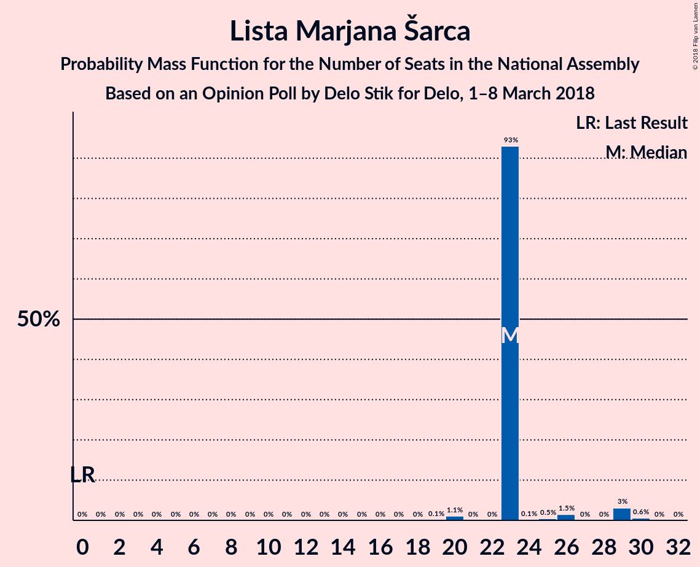

| Number of Seats | Probability | Accumulated | Special Marks |
|:---------------:|:-----------:|:-----------:|:-------------:|
| 0 | 0% | 100% | Last Result |
| 1 | 0% | 100% |  |
| 2 | 0% | 100% |  |
| 3 | 0% | 100% |  |
| 4 | 0% | 100% |  |
| 5 | 0% | 100% |  |
| 6 | 0% | 100% |  |
| 7 | 0% | 100% |  |
| 8 | 0% | 100% |  |
| 9 | 0% | 100% |  |
| 10 | 0% | 100% |  |
| 11 | 0% | 100% |  |
| 12 | 0% | 100% |  |
| 13 | 0% | 100% |  |
| 14 | 0% | 100% |  |
| 15 | 0% | 100% |  |
| 16 | 0% | 100% |  |
| 17 | 0% | 100% |  |
| 18 | 0% | 100% |  |
| 19 | 0.1% | 100% |  |
| 20 | 0.9% | 99.9% |  |
| 21 | 3% | 99.0% |  |
| 22 | 7% | 96% |  |
| 23 | 12% | 90% |  |
| 24 | 40% | 78% | Median |
| 25 | 16% | 38% |  |
| 26 | 16% | 22% |  |
| 27 | 4% | 6% |  |
| 28 | 2% | 2% |  |
| 29 | 0.4% | 0.5% |  |
| 30 | 0% | 0% |  |

### Slovenska demokratska stranka

*For a full overview of the results for this party, see the [Slovenska demokratska stranka](party-slovenskademokratskastranka.html) page.*

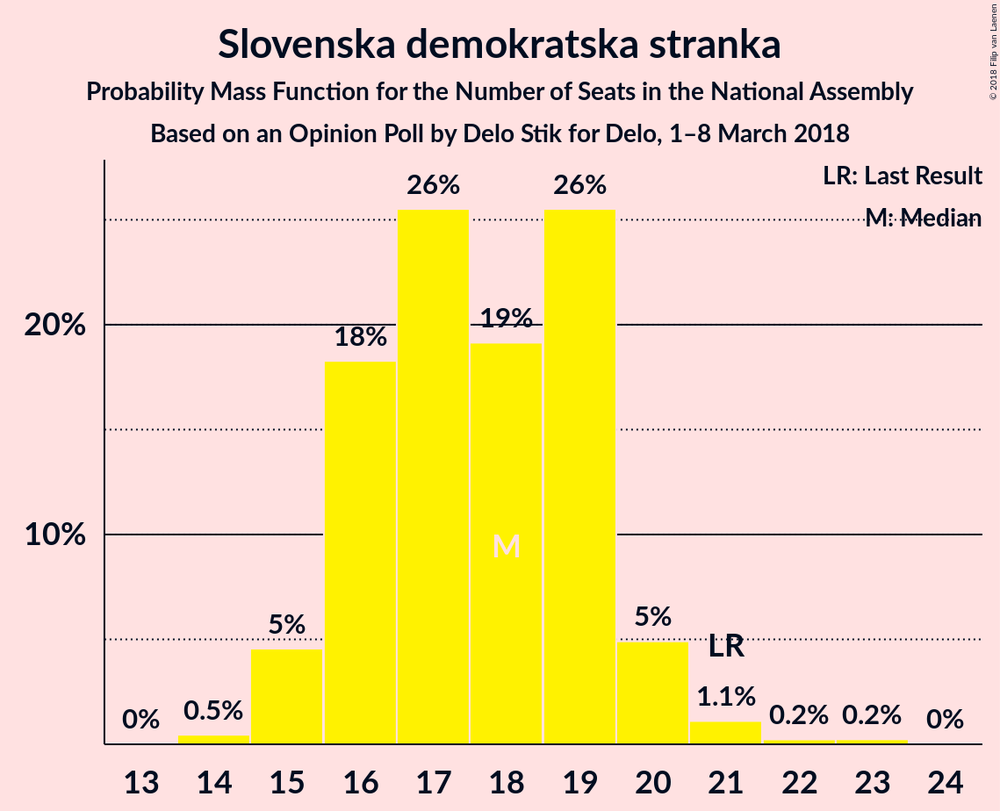

| Number of Seats | Probability | Accumulated | Special Marks |
|:---------------:|:-----------:|:-----------:|:-------------:|
| 13 | 0.1% | 100% |  |
| 14 | 0.9% | 99.9% |  |
| 15 | 5% | 99.0% |  |
| 16 | 14% | 94% |  |
| 17 | 26% | 80% |  |
| 18 | 24% | 53% | Median |
| 19 | 20% | 29% |  |
| 20 | 7% | 9% |  |
| 21 | 2% | 2% | Last Result |
| 22 | 0.3% | 0.4% |  |
| 23 | 0.1% | 0.1% |  |
| 24 | 0% | 0% |  |

### Socialni demokrati

*For a full overview of the results for this party, see the [Socialni demokrati](party-socialnidemokrati.html) page.*

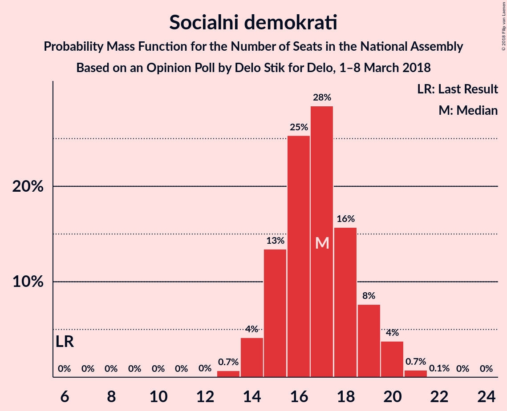

| Number of Seats | Probability | Accumulated | Special Marks |
|:---------------:|:-----------:|:-----------:|:-------------:|
| 6 | 0% | 100% | Last Result |
| 7 | 0% | 100% |  |
| 8 | 0% | 100% |  |
| 9 | 0% | 100% |  |
| 10 | 0% | 100% |  |
| 11 | 0% | 100% |  |
| 12 | 0% | 100% |  |
| 13 | 0.8% | 100% |  |
| 14 | 3% | 99.2% |  |
| 15 | 12% | 96% |  |
| 16 | 14% | 83% |  |
| 17 | 37% | 69% | Median |
| 18 | 20% | 32% |  |
| 19 | 9% | 11% |  |
| 20 | 1.3% | 2% |  |
| 21 | 0.6% | 0.7% |  |
| 22 | 0.1% | 0.1% |  |
| 23 | 0% | 0% |  |

### Stranka modernega centra

*For a full overview of the results for this party, see the [Stranka modernega centra](party-strankamodernegacentra.html) page.*

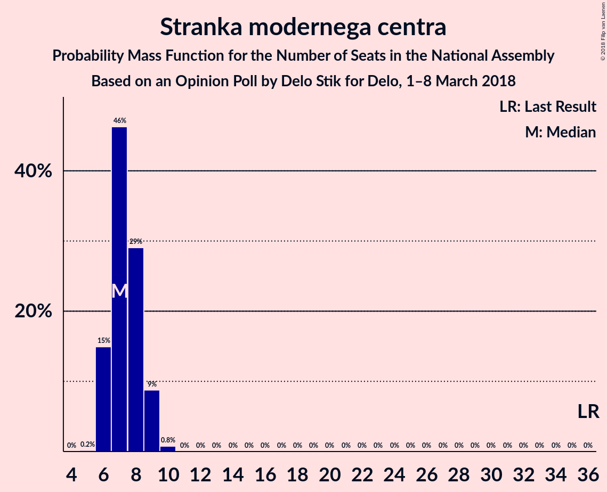

| Number of Seats | Probability | Accumulated | Special Marks |
|:---------------:|:-----------:|:-----------:|:-------------:|
| 4 | 0.1% | 100% |  |
| 5 | 4% | 99.9% |  |
| 6 | 29% | 96% |  |
| 7 | 39% | 67% | Median |
| 8 | 22% | 28% |  |
| 9 | 6% | 6% |  |
| 10 | 0.6% | 0.7% |  |
| 11 | 0% | 0% |  |
| 12 | 0% | 0% |  |
| 13 | 0% | 0% |  |
| 14 | 0% | 0% |  |
| 15 | 0% | 0% |  |
| 16 | 0% | 0% |  |
| 17 | 0% | 0% |  |
| 18 | 0% | 0% |  |
| 19 | 0% | 0% |  |
| 20 | 0% | 0% |  |
| 21 | 0% | 0% |  |
| 22 | 0% | 0% |  |
| 23 | 0% | 0% |  |
| 24 | 0% | 0% |  |
| 25 | 0% | 0% |  |
| 26 | 0% | 0% |  |
| 27 | 0% | 0% |  |
| 28 | 0% | 0% |  |
| 29 | 0% | 0% |  |
| 30 | 0% | 0% |  |
| 31 | 0% | 0% |  |
| 32 | 0% | 0% |  |
| 33 | 0% | 0% |  |
| 34 | 0% | 0% |  |
| 35 | 0% | 0% |  |
| 36 | 0% | 0% | Last Result |

### Nova Slovenija–Krščanski demokrati

*For a full overview of the results for this party, see the [Nova Slovenija–Krščanski demokrati](party-novaslovenija–krščanskidemokrati.html) page.*

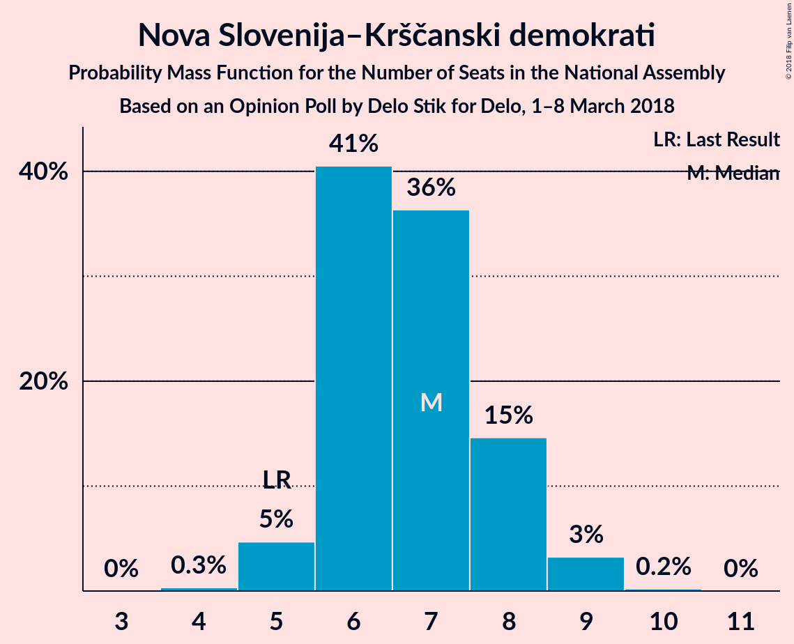

| Number of Seats | Probability | Accumulated | Special Marks |
|:---------------:|:-----------:|:-----------:|:-------------:|
| 4 | 0.3% | 100% |  |
| 5 | 6% | 99.7% | Last Result |
| 6 | 41% | 94% |  |
| 7 | 34% | 53% | Median |
| 8 | 15% | 18% |  |
| 9 | 3% | 3% |  |
| 10 | 0.3% | 0.3% |  |
| 11 | 0% | 0% |  |

### Levica

*For a full overview of the results for this party, see the [Levica](party-levica.html) page.*

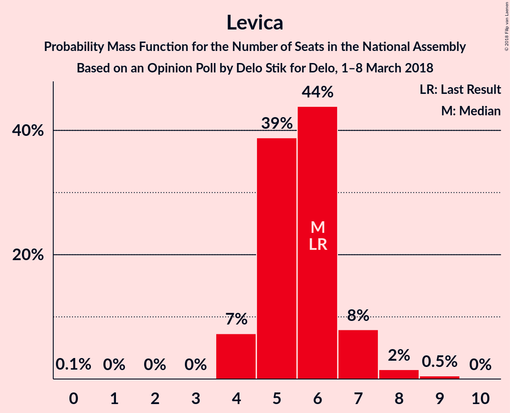

| Number of Seats | Probability | Accumulated | Special Marks |
|:---------------:|:-----------:|:-----------:|:-------------:|
| 3 | 0% | 100% |  |
| 4 | 6% | 99.9% |  |
| 5 | 28% | 94% |  |
| 6 | 42% | 66% | Last Result, Median |
| 7 | 19% | 24% |  |
| 8 | 4% | 5% |  |
| 9 | 0.5% | 0.5% |  |
| 10 | 0% | 0% |  |

### Demokratična stranka upokojencev Slovenije

*For a full overview of the results for this party, see the [Demokratična stranka upokojencev Slovenije](party-demokratičnastrankaupokojencevslovenije.html) page.*

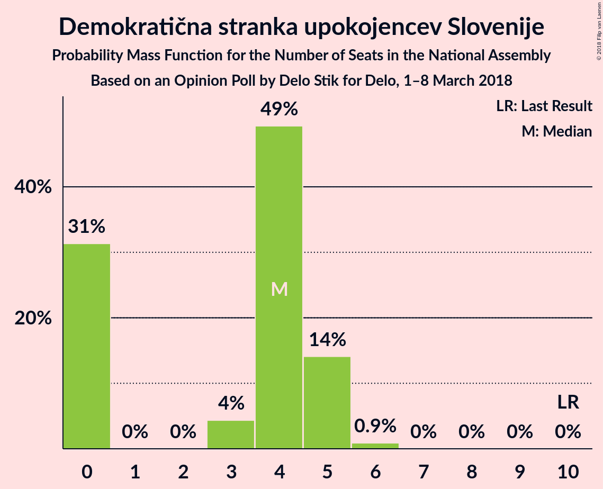

| Number of Seats | Probability | Accumulated | Special Marks |
|:---------------:|:-----------:|:-----------:|:-------------:|
| 0 | 30% | 100% |  |
| 1 | 0% | 70% |  |
| 2 | 0% | 70% |  |
| 3 | 8% | 70% |  |
| 4 | 45% | 62% | Median |
| 5 | 16% | 16% |  |
| 6 | 0.7% | 0.7% |  |
| 7 | 0% | 0% |  |
| 8 | 0% | 0% |  |
| 9 | 0% | 0% |  |
| 10 | 0% | 0% | Last Result |

### Slovenska ljudska stranka

*For a full overview of the results for this party, see the [Slovenska ljudska stranka](party-slovenskaljudskastranka.html) page.*

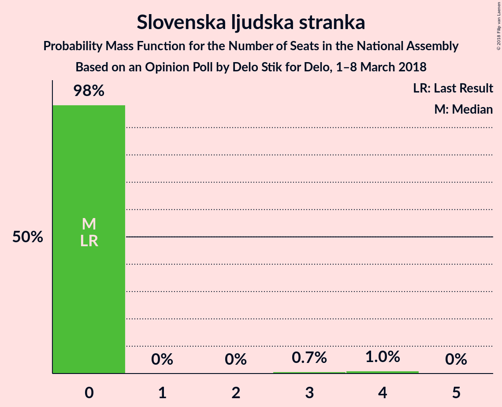

| Number of Seats | Probability | Accumulated | Special Marks |
|:---------------:|:-----------:|:-----------:|:-------------:|
| 0 | 90% | 100% | Last Result, Median |
| 1 | 0% | 10% |  |
| 2 | 0% | 10% |  |
| 3 | 1.4% | 10% |  |
| 4 | 8% | 9% |  |
| 5 | 0.6% | 0.6% |  |
| 6 | 0% | 0% |  |

### Slovenska nacionalna stranka

*For a full overview of the results for this party, see the [Slovenska nacionalna stranka](party-slovenskanacionalnastranka.html) page.*

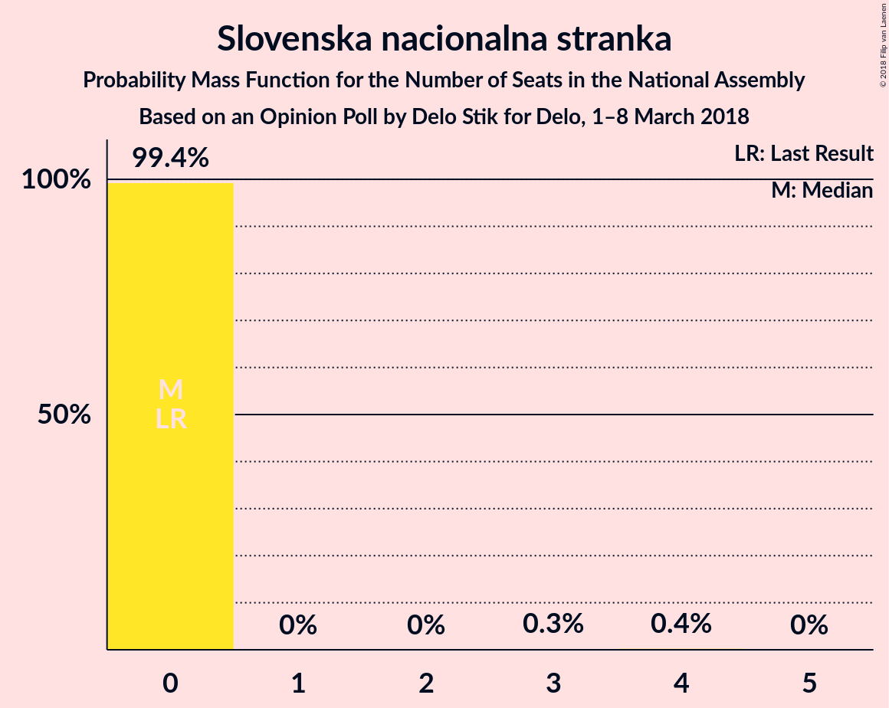

| Number of Seats | Probability | Accumulated | Special Marks |
|:---------------:|:-----------:|:-----------:|:-------------:|
| 0 | 99.5% | 100% | Last Result, Median |
| 1 | 0% | 0.5% |  |
| 2 | 0% | 0.5% |  |
| 3 | 0.1% | 0.5% |  |
| 4 | 0.4% | 0.4% |  |
| 5 | 0% | 0% |  |

### Stranka Alenke Bratušek

*For a full overview of the results for this party, see the [Stranka Alenke Bratušek](party-strankaalenkebratušek.html) page.*

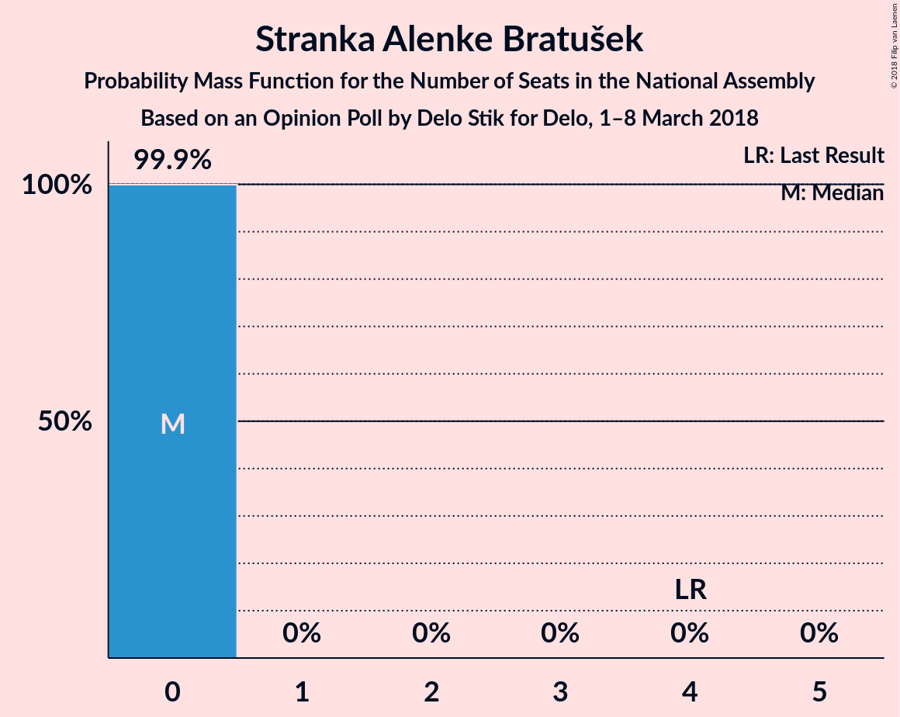

| Number of Seats | Probability | Accumulated | Special Marks |
|:---------------:|:-----------:|:-----------:|:-------------:|
| 0 | 99.8% | 100% | Median |
| 1 | 0% | 0.2% |  |
| 2 | 0% | 0.2% |  |
| 3 | 0.1% | 0.2% |  |
| 4 | 0.1% | 0.1% | Last Result |
| 5 | 0% | 0% |  |

## Coalitions

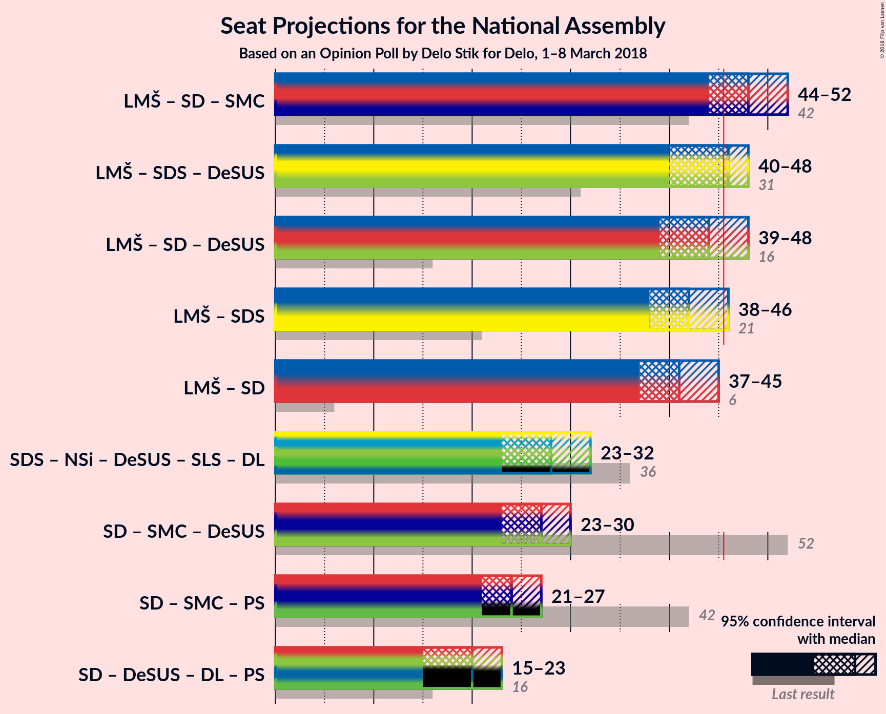

### Confidence Intervals

| Coalition | Last Result | Median | Majority? | 80% Confidence Interval | 90% Confidence Interval | 95% Confidence Interval | 99% Confidence Interval |
|:---------:|:-----------:|:------:|:---------:|:-----------------------:|:-----------------------:|:-----------------------:|:-----------------------:|
| Lista Marjana Šarca – Socialni demokrati – Nova Slovenija–Krščanski demokrati | 11 | 48 | 88% | 45–51 | 44–51 | 44–52 | 43–53 |
| Lista Marjana Šarca – Socialni demokrati – Stranka modernega centra | 42 | 48 | 92% | 46–51 | 45–51 | 44–52 | 43–54 |
| Lista Marjana Šarca – Slovenska demokratska stranka – Demokratična stranka upokojencev Slovenije | 31 | 46 | 55% | 42–47 | 41–48 | 40–48 | 39–50 |
| Lista Marjana Šarca – Socialni demokrati – Demokratična stranka upokojencev Slovenije | 16 | 45 | 34% | 41–47 | 40–48 | 39–48 | 39–49 |
| Lista Marjana Šarca – Slovenska demokratska stranka | 21 | 42 | 5% | 40–44 | 39–45 | 38–46 | 37–47 |
| Lista Marjana Šarca – Socialni demokrati | 6 | 41 | 2% | 39–43 | 38–44 | 37–45 | 36–46 |
| Socialni demokrati – Stranka modernega centra – Demokratična stranka upokojencev Slovenije | 52 | 27 | 0% | 24–29 | 23–30 | 23–30 | 21–32 |

### Lista Marjana Šarca – Socialni demokrati – Nova Slovenija–Krščanski demokrati

| Number of Seats | Probability | Accumulated | Special Marks |
|:---------------:|:-----------:|:-----------:|:-------------:|
| 11 | 0% | 100% | Last Result |
| 12 | 0% | 100% |  |
| 13 | 0% | 100% |  |
| 14 | 0% | 100% |  |
| 15 | 0% | 100% |  |
| 16 | 0% | 100% |  |
| 17 | 0% | 100% |  |
| 18 | 0% | 100% |  |
| 19 | 0% | 100% |  |
| 20 | 0% | 100% |  |
| 21 | 0% | 100% |  |
| 22 | 0% | 100% |  |
| 23 | 0% | 100% |  |
| 24 | 0% | 100% |  |
| 25 | 0% | 100% |  |
| 26 | 0% | 100% |  |
| 27 | 0% | 100% |  |
| 28 | 0% | 100% |  |
| 29 | 0% | 100% |  |
| 30 | 0% | 100% |  |
| 31 | 0% | 100% |  |
| 32 | 0% | 100% |  |
| 33 | 0% | 100% |  |
| 34 | 0% | 100% |  |
| 35 | 0% | 100% |  |
| 36 | 0% | 100% |  |
| 37 | 0% | 100% |  |
| 38 | 0% | 100% |  |
| 39 | 0% | 100% |  |
| 40 | 0% | 100% |  |
| 41 | 0.2% | 100% |  |
| 42 | 0.3% | 99.8% |  |
| 43 | 0.9% | 99.5% |  |
| 44 | 5% | 98.6% |  |
| 45 | 6% | 94% |  |
| 46 | 11% | 88% | Majority |
| 47 | 18% | 77% |  |
| 48 | 21% | 59% | Median |
| 49 | 18% | 39% |  |
| 50 | 8% | 21% |  |
| 51 | 11% | 13% |  |
| 52 | 2% | 3% |  |
| 53 | 0.5% | 0.9% |  |
| 54 | 0.3% | 0.4% |  |
| 55 | 0% | 0.1% |  |
| 56 | 0% | 0% |  |

### Lista Marjana Šarca – Socialni demokrati – Stranka modernega centra

| Number of Seats | Probability | Accumulated | Special Marks |
|:---------------:|:-----------:|:-----------:|:-------------:|
| 42 | 0.3% | 100% | Last Result |
| 43 | 0.7% | 99.6% |  |
| 44 | 3% | 99.0% |  |
| 45 | 3% | 96% |  |
| 46 | 13% | 92% | Majority |
| 47 | 19% | 79% |  |
| 48 | 12% | 60% | Median |
| 49 | 17% | 48% |  |
| 50 | 20% | 31% |  |
| 51 | 6% | 11% |  |
| 52 | 2% | 4% |  |
| 53 | 1.2% | 2% |  |
| 54 | 0.4% | 0.7% |  |
| 55 | 0.3% | 0.3% |  |
| 56 | 0% | 0% |  |

### Lista Marjana Šarca – Slovenska demokratska stranka – Demokratična stranka upokojencev Slovenije

| Number of Seats | Probability | Accumulated | Special Marks |
|:---------------:|:-----------:|:-----------:|:-------------:|
| 31 | 0% | 100% | Last Result |
| 32 | 0% | 100% |  |
| 33 | 0% | 100% |  |
| 34 | 0% | 100% |  |
| 35 | 0% | 100% |  |
| 36 | 0% | 100% |  |
| 37 | 0% | 100% |  |
| 38 | 0.1% | 100% |  |
| 39 | 1.5% | 99.9% |  |
| 40 | 3% | 98% |  |
| 41 | 5% | 95% |  |
| 42 | 8% | 91% |  |
| 43 | 9% | 83% |  |
| 44 | 10% | 74% |  |
| 45 | 8% | 64% |  |
| 46 | 37% | 55% | Median, Majority |
| 47 | 13% | 18% |  |
| 48 | 4% | 5% |  |
| 49 | 1.1% | 2% |  |
| 50 | 0.4% | 0.6% |  |
| 51 | 0.1% | 0.1% |  |
| 52 | 0% | 0% |  |

### Lista Marjana Šarca – Socialni demokrati – Demokratična stranka upokojencev Slovenije

| Number of Seats | Probability | Accumulated | Special Marks |
|:---------------:|:-----------:|:-----------:|:-------------:|
| 16 | 0% | 100% | Last Result |
| 17 | 0% | 100% |  |
| 18 | 0% | 100% |  |
| 19 | 0% | 100% |  |
| 20 | 0% | 100% |  |
| 21 | 0% | 100% |  |
| 22 | 0% | 100% |  |
| 23 | 0% | 100% |  |
| 24 | 0% | 100% |  |
| 25 | 0% | 100% |  |
| 26 | 0% | 100% |  |
| 27 | 0% | 100% |  |
| 28 | 0% | 100% |  |
| 29 | 0% | 100% |  |
| 30 | 0% | 100% |  |
| 31 | 0% | 100% |  |
| 32 | 0% | 100% |  |
| 33 | 0% | 100% |  |
| 34 | 0% | 100% |  |
| 35 | 0% | 100% |  |
| 36 | 0% | 100% |  |
| 37 | 0.1% | 100% |  |
| 38 | 0.2% | 99.8% |  |
| 39 | 3% | 99.6% |  |
| 40 | 2% | 97% |  |
| 41 | 7% | 94% |  |
| 42 | 18% | 88% |  |
| 43 | 13% | 69% |  |
| 44 | 6% | 57% |  |
| 45 | 16% | 51% | Median |
| 46 | 18% | 34% | Majority |
| 47 | 11% | 16% |  |
| 48 | 5% | 6% |  |
| 49 | 0.5% | 0.6% |  |
| 50 | 0.1% | 0.1% |  |
| 51 | 0% | 0% |  |

### Lista Marjana Šarca – Slovenska demokratska stranka

| Number of Seats | Probability | Accumulated | Special Marks |
|:---------------:|:-----------:|:-----------:|:-------------:|
| 21 | 0% | 100% | Last Result |
| 22 | 0% | 100% |  |
| 23 | 0% | 100% |  |
| 24 | 0% | 100% |  |
| 25 | 0% | 100% |  |
| 26 | 0% | 100% |  |
| 27 | 0% | 100% |  |
| 28 | 0% | 100% |  |
| 29 | 0% | 100% |  |
| 30 | 0% | 100% |  |
| 31 | 0% | 100% |  |
| 32 | 0% | 100% |  |
| 33 | 0% | 100% |  |
| 34 | 0% | 100% |  |
| 35 | 0% | 100% |  |
| 36 | 0.3% | 100% |  |
| 37 | 1.0% | 99.6% |  |
| 38 | 1.5% | 98.6% |  |
| 39 | 5% | 97% |  |
| 40 | 10% | 92% |  |
| 41 | 17% | 82% |  |
| 42 | 30% | 66% | Median |
| 43 | 22% | 36% |  |
| 44 | 6% | 14% |  |
| 45 | 3% | 8% |  |
| 46 | 3% | 5% | Majority |
| 47 | 1.4% | 2% |  |
| 48 | 0.2% | 0.2% |  |
| 49 | 0% | 0% |  |

### Lista Marjana Šarca – Socialni demokrati

| Number of Seats | Probability | Accumulated | Special Marks |
|:---------------:|:-----------:|:-----------:|:-------------:|
| 6 | 0% | 100% | Last Result |
| 7 | 0% | 100% |  |
| 8 | 0% | 100% |  |
| 9 | 0% | 100% |  |
| 10 | 0% | 100% |  |
| 11 | 0% | 100% |  |
| 12 | 0% | 100% |  |
| 13 | 0% | 100% |  |
| 14 | 0% | 100% |  |
| 15 | 0% | 100% |  |
| 16 | 0% | 100% |  |
| 17 | 0% | 100% |  |
| 18 | 0% | 100% |  |
| 19 | 0% | 100% |  |
| 20 | 0% | 100% |  |
| 21 | 0% | 100% |  |
| 22 | 0% | 100% |  |
| 23 | 0% | 100% |  |
| 24 | 0% | 100% |  |
| 25 | 0% | 100% |  |
| 26 | 0% | 100% |  |
| 27 | 0% | 100% |  |
| 28 | 0% | 100% |  |
| 29 | 0% | 100% |  |
| 30 | 0% | 100% |  |
| 31 | 0% | 100% |  |
| 32 | 0% | 100% |  |
| 33 | 0% | 100% |  |
| 34 | 0% | 100% |  |
| 35 | 0.3% | 100% |  |
| 36 | 0.6% | 99.7% |  |
| 37 | 3% | 99.1% |  |
| 38 | 4% | 96% |  |
| 39 | 14% | 91% |  |
| 40 | 7% | 78% |  |
| 41 | 24% | 71% | Median |
| 42 | 19% | 47% |  |
| 43 | 18% | 28% |  |
| 44 | 6% | 10% |  |
| 45 | 2% | 4% |  |
| 46 | 1.2% | 2% | Majority |
| 47 | 0.4% | 0.5% |  |
| 48 | 0.1% | 0.1% |  |
| 49 | 0% | 0% |  |

### Socialni demokrati – Stranka modernega centra – Demokratična stranka upokojencev Slovenije

| Number of Seats | Probability | Accumulated | Special Marks |
|:---------------:|:-----------:|:-----------:|:-------------:|
| 20 | 0.1% | 100% |  |
| 21 | 0.6% | 99.9% |  |
| 22 | 1.4% | 99.3% |  |
| 23 | 3% | 98% |  |
| 24 | 6% | 95% |  |
| 25 | 16% | 89% |  |
| 26 | 14% | 73% |  |
| 27 | 24% | 60% |  |
| 28 | 15% | 36% | Median |
| 29 | 14% | 21% |  |
| 30 | 6% | 7% |  |
| 31 | 0.6% | 1.1% |  |
| 32 | 0.5% | 0.5% |  |
| 33 | 0% | 0% |  |
| 34 | 0% | 0% |  |
| 35 | 0% | 0% |  |
| 36 | 0% | 0% |  |
| 37 | 0% | 0% |  |
| 38 | 0% | 0% |  |
| 39 | 0% | 0% |  |
| 40 | 0% | 0% |  |
| 41 | 0% | 0% |  |
| 42 | 0% | 0% |  |
| 43 | 0% | 0% |  |
| 44 | 0% | 0% |  |
| 45 | 0% | 0% |  |
| 46 | 0% | 0% | Majority |
| 47 | 0% | 0% |  |
| 48 | 0% | 0% |  |
| 49 | 0% | 0% |  |
| 50 | 0% | 0% |  |
| 51 | 0% | 0% |  |
| 52 | 0% | 0% | Last Result |

## Technical Information

### Opinion Poll

+ **Polling firm:** Delo Stik
+ **Commissioner(s):** Delo
+ **Fieldwork period:** 1–8 March 2018

### Calculations

+ **Sample size:** 812
+ **Simulations done:** 1,048,576
+ **Error estimate:** 1.74%

