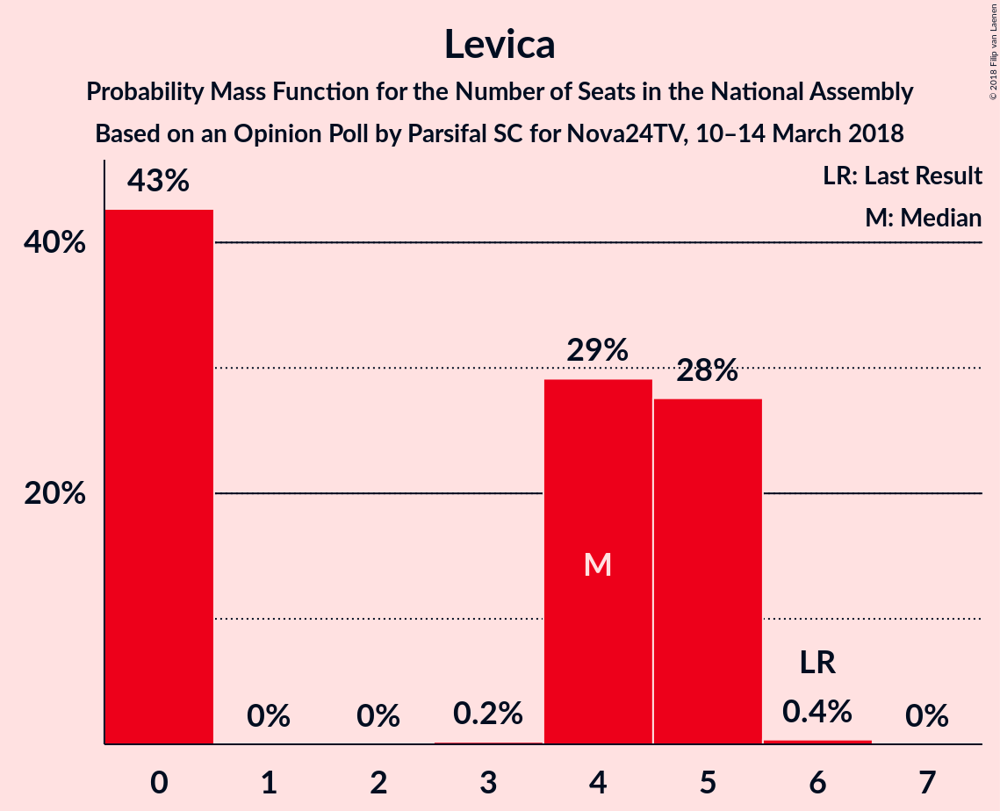
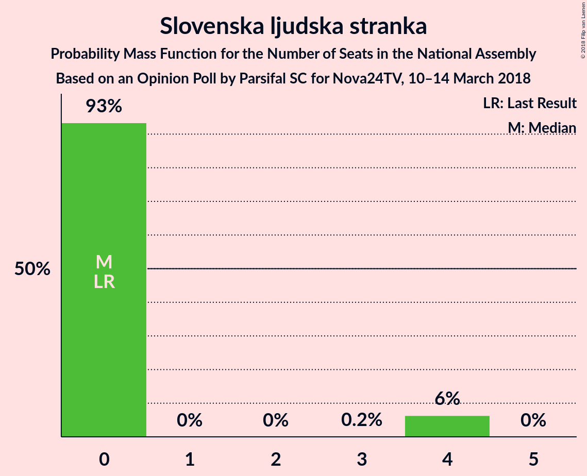

# Opinion Poll by Parsifal SC for Nova24TV, 10–14 March 2018

<a href="#voting-intentions">Voting Intentions</a> | <a href="#seats">Seats</a> | <a href="#coalitions">Coalitions</a> | <a href="#technical-information">Technical Information</a>

## Voting Intentions

### Confidence Intervals

| Party | Last Result | Poll Result | 80% Confidence Interval | 90% Confidence Interval | 95% Confidence Interval | 99% Confidence Interval |
|:-----:|:-----------:|:-----------:|:-----------------------:|:-----------------------:|:-----------------------:|:-----------------------:|
| Slovenska demokratska stranka | 20.7% | 23.3% | 21.5–25.4% |21.0–25.9% |20.5–26.4% |19.6–27.4% |
| Lista Marjana Šarca | 0.0% | 20.9% | 19.1–22.9% |18.6–23.4% |18.2–23.9% |17.4–24.9% |
| Socialni demokrati | 6.0% | 16.5% | 14.9–18.3% |14.4–18.8% |14.0–19.2% |13.3–20.1% |
| Nova Slovenija–Krščanski demokrati | 5.6% | 6.8% | 5.7–8.0% |5.4–8.4% |5.2–8.7% |4.8–9.4% |
| Demokratična stranka upokojencev Slovenije | 10.2% | 6.2% | 5.3–7.5% |5.0–7.9% |4.8–8.2% |4.3–8.8% |
| Stranka modernega centra | 34.5% | 5.2% | 4.3–6.4% |4.1–6.7% |3.9–7.0% |3.5–7.6% |
| Slovenska nacionalna stranka | 2.2% | 5.2% | 4.3–6.4% |4.1–6.7% |3.9–7.0% |3.5–7.6% |
| Levica | 6.0% | 4.1% | 3.3–5.1% |3.1–5.4% |2.9–5.7% |2.6–6.3% |
| Slovenska ljudska stranka | 4.0% | 2.8% | 2.2–3.7% |2.0–4.0% |1.9–4.2% |1.6–4.7% |
| Stranka Alenke Bratušek | 4.4% | 1.5% | 1.1–2.3% |1.0–2.5% |0.9–2.7% |0.7–3.1% |
| Pozitivna Slovenija | 3.0% | 0.9% | 0.6–1.5% |0.5–1.7% |0.4–1.8% |0.3–2.2% |
| Glas za otroke in družine–Nova ljudska stranka Slovenije | 0.0% | 0.6% | 0.4–1.2% |0.3–1.3% |0.3–1.5% |0.2–1.8% |

*Note:* The poll result column reflects the actual value used in the calculations. Published results may vary slightly, and in addition be rounded to fewer digits.

## Seats

### Confidence Intervals

| Party | Last Result | Median | 80% Confidence Interval | 90% Confidence Interval | 95% Confidence Interval | 99% Confidence Interval |
|:-----:|:-----------:|:------:|:-----------------------:|:-----------------------:|:-----------------------:|:-----------------------:|
| <a href="#slovenska-demokratska-stranka">Slovenska demokratska stranka</a> | 21 | 24 | 19–25 |19–27 |18–27 |18–28 |
| <a href="#lista-marjana-Šarca">Lista Marjana Šarca</a> | 0 | 21 | 18–24 |17–24 |17–24 |16–25 |
| <a href="#socialni-demokrati">Socialni demokrati</a> | 6 | 16 | 14–17 |14–17 |14–19 |12–19 |
| <a href="#nova-slovenija–krščanski-demokrati">Nova Slovenija–Krščanski demokrati</a> | 5 | 7 | 5–8 |4–8 |4–8 |4–8 |
| <a href="#demokratična-stranka-upokojencev-slovenije">Demokratična stranka upokojencev Slovenije</a> | 10 | 7 | 5–8 |5–8 |4–8 |0–8 |
| <a href="#stranka-modernega-centra">Stranka modernega centra</a> | 36 | 5 | 4–6 |4–6 |4–6 |0–7 |
| <a href="#slovenska-nacionalna-stranka">Slovenska nacionalna stranka</a> | 0 | 5 | 0–6 |0–7 |0–7 |0–7 |
| <a href="#levica">Levica</a> | 6 | 0 | 0–5 |0–5 |0–5 |0–5 |
| <a href="#slovenska-ljudska-stranka">Slovenska ljudska stranka</a> | 0 | 0 | 0 |0 |0–4 |0–4 |
| <a href="#stranka-alenke-bratušek">Stranka Alenke Bratušek</a> | 4 | 0 | 0 |0 |0 |0 |
| <a href="#pozitivna-slovenija">Pozitivna Slovenija</a> | 0 | 0 | 0 |0 |0 |0 |
| <a href="#glas-za-otroke-in-družine–nova-ljudska-stranka-slovenije">Glas za otroke in družine–Nova ljudska stranka Slovenije</a> | 0 | 0 | 0 |0 |0 |0 |

### Slovenska demokratska stranka

*For a full overview of the results for this party, see the [Slovenska demokratska stranka](party-slovenskademokratskastranka.html) page.*

| Number of Seats | Probability | Accumulated | Special Marks |
|:---------------:|:-----------:|:-----------:|:-------------:|
| 18 | 5% | 100% |  |
| 19 | 6% | 95% |  |
| 20 | 3% | 89% |  |
| 21 | 8% | 86% | Last Result |
| 22 | 17% | 78% |  |
| 23 | 9% | 61% |  |
| 24 | 37% | 52% | Median |
| 25 | 7% | 15% |  |
| 26 | 2% | 8% |  |
| 27 | 4% | 6% |  |
| 28 | 2% | 2% |  |
| 29 | 0% | 0% |  |

### Lista Marjana Šarca

*For a full overview of the results for this party, see the [Lista Marjana Šarca](party-listamarjanaŠarca.html) page.*

| Number of Seats | Probability | Accumulated | Special Marks |
|:---------------:|:-----------:|:-----------:|:-------------:|
| 0 | 0% | 100% | Last Result |
| 1 | 0% | 100% |  |
| 2 | 0% | 100% |  |
| 3 | 0% | 100% |  |
| 4 | 0% | 100% |  |
| 5 | 0% | 100% |  |
| 6 | 0% | 100% |  |
| 7 | 0% | 100% |  |
| 8 | 0% | 100% |  |
| 9 | 0% | 100% |  |
| 10 | 0% | 100% |  |
| 11 | 0% | 100% |  |
| 12 | 0% | 100% |  |
| 13 | 0% | 100% |  |
| 14 | 0% | 100% |  |
| 15 | 0.1% | 100% |  |
| 16 | 0.7% | 99.9% |  |
| 17 | 5% | 99.2% |  |
| 18 | 5% | 94% |  |
| 19 | 13% | 89% |  |
| 20 | 9% | 75% |  |
| 21 | 24% | 66% | Median |
| 22 | 2% | 42% |  |
| 23 | 13% | 41% |  |
| 24 | 26% | 27% |  |
| 25 | 1.2% | 1.2% |  |
| 26 | 0% | 0% |  |

### Socialni demokrati

*For a full overview of the results for this party, see the [Socialni demokrati](party-socialnidemokrati.html) page.*

| Number of Seats | Probability | Accumulated | Special Marks |
|:---------------:|:-----------:|:-----------:|:-------------:|
| 6 | 0% | 100% | Last Result |
| 7 | 0% | 100% |  |
| 8 | 0% | 100% |  |
| 9 | 0% | 100% |  |
| 10 | 0% | 100% |  |
| 11 | 0.1% | 100% |  |
| 12 | 0.6% | 99.9% |  |
| 13 | 1.1% | 99.3% |  |
| 14 | 8% | 98% |  |
| 15 | 17% | 90% |  |
| 16 | 45% | 73% | Median |
| 17 | 24% | 28% |  |
| 18 | 0.8% | 3% |  |
| 19 | 2% | 3% |  |
| 20 | 0.1% | 0.2% |  |
| 21 | 0.1% | 0.1% |  |
| 22 | 0% | 0% |  |

### Nova Slovenija–Krščanski demokrati

*For a full overview of the results for this party, see the [Nova Slovenija–Krščanski demokrati](party-novaslovenija–krščanskidemokrati.html) page.*

| Number of Seats | Probability | Accumulated | Special Marks |
|:---------------:|:-----------:|:-----------:|:-------------:|
| 4 | 6% | 100% |  |
| 5 | 7% | 94% | Last Result |
| 6 | 31% | 87% |  |
| 7 | 44% | 56% | Median |
| 8 | 11% | 11% |  |
| 9 | 0.1% | 0.2% |  |
| 10 | 0% | 0% |  |

### Demokratična stranka upokojencev Slovenije

*For a full overview of the results for this party, see the [Demokratična stranka upokojencev Slovenije](party-demokratičnastrankaupokojencevslovenije.html) page.*

| Number of Seats | Probability | Accumulated | Special Marks |
|:---------------:|:-----------:|:-----------:|:-------------:|
| 0 | 2% | 100% |  |
| 1 | 0% | 98% |  |
| 2 | 0% | 98% |  |
| 3 | 0% | 98% |  |
| 4 | 1.1% | 98% |  |
| 5 | 14% | 97% |  |
| 6 | 20% | 83% |  |
| 7 | 33% | 63% | Median |
| 8 | 29% | 30% |  |
| 9 | 0.2% | 0.2% |  |
| 10 | 0% | 0% | Last Result |

### Stranka modernega centra

*For a full overview of the results for this party, see the [Stranka modernega centra](party-strankamodernegacentra.html) page.*

| Number of Seats | Probability | Accumulated | Special Marks |
|:---------------:|:-----------:|:-----------:|:-------------:|
| 0 | 2% | 100% |  |
| 1 | 0% | 98% |  |
| 2 | 0% | 98% |  |
| 3 | 0% | 98% |  |
| 4 | 38% | 98% |  |
| 5 | 38% | 60% | Median |
| 6 | 20% | 22% |  |
| 7 | 2% | 2% |  |
| 8 | 0.1% | 0.1% |  |
| 9 | 0% | 0% |  |
| 10 | 0% | 0% |  |
| 11 | 0% | 0% |  |
| 12 | 0% | 0% |  |
| 13 | 0% | 0% |  |
| 14 | 0% | 0% |  |
| 15 | 0% | 0% |  |
| 16 | 0% | 0% |  |
| 17 | 0% | 0% |  |
| 18 | 0% | 0% |  |
| 19 | 0% | 0% |  |
| 20 | 0% | 0% |  |
| 21 | 0% | 0% |  |
| 22 | 0% | 0% |  |
| 23 | 0% | 0% |  |
| 24 | 0% | 0% |  |
| 25 | 0% | 0% |  |
| 26 | 0% | 0% |  |
| 27 | 0% | 0% |  |
| 28 | 0% | 0% |  |
| 29 | 0% | 0% |  |
| 30 | 0% | 0% |  |
| 31 | 0% | 0% |  |
| 32 | 0% | 0% |  |
| 33 | 0% | 0% |  |
| 34 | 0% | 0% |  |
| 35 | 0% | 0% |  |
| 36 | 0% | 0% | Last Result |

### Slovenska nacionalna stranka

*For a full overview of the results for this party, see the [Slovenska nacionalna stranka](party-slovenskanacionalnastranka.html) page.*

| Number of Seats | Probability | Accumulated | Special Marks |
|:---------------:|:-----------:|:-----------:|:-------------:|
| 0 | 38% | 100% | Last Result |
| 1 | 0% | 62% |  |
| 2 | 0% | 62% |  |
| 3 | 0.1% | 62% |  |
| 4 | 11% | 62% |  |
| 5 | 30% | 51% | Median |
| 6 | 15% | 22% |  |
| 7 | 7% | 7% |  |
| 8 | 0% | 0% |  |

### Levica

*For a full overview of the results for this party, see the [Levica](party-levica.html) page.*

| Number of Seats | Probability | Accumulated | Special Marks |
|:---------------:|:-----------:|:-----------:|:-------------:|
| 0 | 70% | 100% | Median |
| 1 | 0% | 30% |  |
| 2 | 0% | 30% |  |
| 3 | 0.2% | 30% |  |
| 4 | 18% | 30% |  |
| 5 | 12% | 12% |  |
| 6 | 0.5% | 0.5% | Last Result |
| 7 | 0% | 0% |  |

### Slovenska ljudska stranka

*For a full overview of the results for this party, see the [Slovenska ljudska stranka](party-slovenskaljudskastranka.html) page.*

| Number of Seats | Probability | Accumulated | Special Marks |
|:---------------:|:-----------:|:-----------:|:-------------:|
| 0 | 95% | 100% | Last Result, Median |
| 1 | 0% | 5% |  |
| 2 | 0% | 5% |  |
| 3 | 0% | 5% |  |
| 4 | 4% | 5% |  |
| 5 | 0.2% | 0.2% |  |
| 6 | 0% | 0% |  |

### Stranka Alenke Bratušek

*For a full overview of the results for this party, see the [Stranka Alenke Bratušek](party-strankaalenkebratušek.html) page.*

| Number of Seats | Probability | Accumulated | Special Marks |
|:---------------:|:-----------:|:-----------:|:-------------:|
| 0 | 100% | 100% | Median |
| 1 | 0% | 0% |  |
| 2 | 0% | 0% |  |
| 3 | 0% | 0% |  |
| 4 | 0% | 0% | Last Result |

### Pozitivna Slovenija

*For a full overview of the results for this party, see the [Pozitivna Slovenija](party-pozitivnaslovenija.html) page.*

| Number of Seats | Probability | Accumulated | Special Marks |
|:---------------:|:-----------:|:-----------:|:-------------:|
| 0 | 100% | 100% | Last Result, Median |

### Glas za otroke in družine–Nova ljudska stranka Slovenije

*For a full overview of the results for this party, see the [Glas za otroke in družine–Nova ljudska stranka Slovenije](party-glaszaotrokeindružine–novaljudskastrankaslovenije.html) page.*

| Number of Seats | Probability | Accumulated | Special Marks |
|:---------------:|:-----------:|:-----------:|:-------------:|
| 0 | 100% | 100% | Last Result, Median |

## Coalitions

### Confidence Intervals

| Coalition | Last Result | Median | Majority? | 80% Confidence Interval | 90% Confidence Interval | 95% Confidence Interval | 99% Confidence Interval |
|:---------:|:-----------:|:------:|:---------:|:-----------------------:|:-----------------------:|:-----------------------:|:-----------------------:|
| Slovenska demokratska stranka – Lista Marjana Šarca – Demokratična stranka upokojencev Slovenije | 31 | 50 | 94% | 46–56 | 45–56 | 44–56 | 43–59 |
| Slovenska demokratska stranka – Lista Marjana Šarca | 21 | 45 | 43% | 40–48 | 38–48 | 37–49 | 36–52 |
| Lista Marjana Šarca – Socialni demokrati – Demokratična stranka upokojencev Slovenije | 16 | 44 | 39% | 39–48 | 38–48 | 37–48 | 37–48 |
| Lista Marjana Šarca – Socialni demokrati – Stranka modernega centra | 42 | 42 | 3% | 38–44 | 37–45 | 37–46 | 36–47 |
| Lista Marjana Šarca – Socialni demokrati | 6 | 37 | 0% | 33–40 | 32–40 | 31–42 | 31–42 |
| Socialni demokrati – Demokratična stranka upokojencev Slovenije – Stranka modernega centra | 52 | 28 | 0% | 25–29 | 24–29 | 24–30 | 21–32 |
| Socialni demokrati – Stranka modernega centra – Pozitivna Slovenija | 42 | 21 | 0% | 20–23 | 19–23 | 17–24 | 17–25 |

### Slovenska demokratska stranka – Lista Marjana Šarca – Demokratična stranka upokojencev Slovenije

| Number of Seats | Probability | Accumulated | Special Marks |
|:---------------:|:-----------:|:-----------:|:-------------:|
| 31 | 0% | 100% | Last Result |
| 32 | 0% | 100% |  |
| 33 | 0% | 100% |  |
| 34 | 0% | 100% |  |
| 35 | 0% | 100% |  |
| 36 | 0% | 100% |  |
| 37 | 0% | 100% |  |
| 38 | 0% | 100% |  |
| 39 | 0% | 100% |  |
| 40 | 0% | 100% |  |
| 41 | 0% | 100% |  |
| 42 | 0.2% | 100% |  |
| 43 | 2% | 99.7% |  |
| 44 | 3% | 98% |  |
| 45 | 1.4% | 95% |  |
| 46 | 10% | 94% | Majority |
| 47 | 13% | 84% |  |
| 48 | 4% | 71% |  |
| 49 | 5% | 67% |  |
| 50 | 15% | 62% |  |
| 51 | 4% | 47% |  |
| 52 | 5% | 43% | Median |
| 53 | 5% | 38% |  |
| 54 | 2% | 33% |  |
| 55 | 5% | 31% |  |
| 56 | 24% | 26% |  |
| 57 | 0% | 2% |  |
| 58 | 0% | 2% |  |
| 59 | 2% | 2% |  |
| 60 | 0% | 0% |  |

### Slovenska demokratska stranka – Lista Marjana Šarca

| Number of Seats | Probability | Accumulated | Special Marks |
|:---------------:|:-----------:|:-----------:|:-------------:|
| 21 | 0% | 100% | Last Result |
| 22 | 0% | 100% |  |
| 23 | 0% | 100% |  |
| 24 | 0% | 100% |  |
| 25 | 0% | 100% |  |
| 26 | 0% | 100% |  |
| 27 | 0% | 100% |  |
| 28 | 0% | 100% |  |
| 29 | 0% | 100% |  |
| 30 | 0% | 100% |  |
| 31 | 0% | 100% |  |
| 32 | 0% | 100% |  |
| 33 | 0% | 100% |  |
| 34 | 0% | 100% |  |
| 35 | 0% | 100% |  |
| 36 | 2% | 100% |  |
| 37 | 3% | 98% |  |
| 38 | 0.6% | 96% |  |
| 39 | 2% | 95% |  |
| 40 | 12% | 93% |  |
| 41 | 6% | 81% |  |
| 42 | 5% | 75% |  |
| 43 | 17% | 70% |  |
| 44 | 3% | 54% |  |
| 45 | 7% | 50% | Median |
| 46 | 8% | 43% | Majority |
| 47 | 7% | 36% |  |
| 48 | 25% | 29% |  |
| 49 | 2% | 4% |  |
| 50 | 0% | 2% |  |
| 51 | 0% | 2% |  |
| 52 | 2% | 2% |  |
| 53 | 0% | 0% |  |

### Lista Marjana Šarca – Socialni demokrati – Demokratična stranka upokojencev Slovenije

| Number of Seats | Probability | Accumulated | Special Marks |
|:---------------:|:-----------:|:-----------:|:-------------:|
| 16 | 0% | 100% | Last Result |
| 17 | 0% | 100% |  |
| 18 | 0% | 100% |  |
| 19 | 0% | 100% |  |
| 20 | 0% | 100% |  |
| 21 | 0% | 100% |  |
| 22 | 0% | 100% |  |
| 23 | 0% | 100% |  |
| 24 | 0% | 100% |  |
| 25 | 0% | 100% |  |
| 26 | 0% | 100% |  |
| 27 | 0% | 100% |  |
| 28 | 0% | 100% |  |
| 29 | 0% | 100% |  |
| 30 | 0% | 100% |  |
| 31 | 0% | 100% |  |
| 32 | 0% | 100% |  |
| 33 | 0% | 100% |  |
| 34 | 0.1% | 100% |  |
| 35 | 0.1% | 99.9% |  |
| 36 | 0.1% | 99.8% |  |
| 37 | 4% | 99.7% |  |
| 38 | 3% | 95% |  |
| 39 | 5% | 92% |  |
| 40 | 4% | 86% |  |
| 41 | 7% | 83% |  |
| 42 | 9% | 76% |  |
| 43 | 8% | 67% |  |
| 44 | 19% | 59% | Median |
| 45 | 1.0% | 40% |  |
| 46 | 8% | 39% | Majority |
| 47 | 4% | 31% |  |
| 48 | 27% | 27% |  |
| 49 | 0.1% | 0.2% |  |
| 50 | 0.1% | 0.1% |  |
| 51 | 0% | 0% |  |

### Lista Marjana Šarca – Socialni demokrati – Stranka modernega centra

| Number of Seats | Probability | Accumulated | Special Marks |
|:---------------:|:-----------:|:-----------:|:-------------:|
| 34 | 0% | 100% |  |
| 35 | 0.1% | 99.9% |  |
| 36 | 0.7% | 99.9% |  |
| 37 | 5% | 99.1% |  |
| 38 | 6% | 95% |  |
| 39 | 9% | 89% |  |
| 40 | 7% | 80% |  |
| 41 | 9% | 73% |  |
| 42 | 16% | 64% | Last Result, Median |
| 43 | 1.4% | 48% |  |
| 44 | 39% | 46% |  |
| 45 | 4% | 7% |  |
| 46 | 1.4% | 3% | Majority |
| 47 | 2% | 2% |  |
| 48 | 0% | 0.1% |  |
| 49 | 0% | 0% |  |

### Lista Marjana Šarca – Socialni demokrati

| Number of Seats | Probability | Accumulated | Special Marks |
|:---------------:|:-----------:|:-----------:|:-------------:|
| 6 | 0% | 100% | Last Result |
| 7 | 0% | 100% |  |
| 8 | 0% | 100% |  |
| 9 | 0% | 100% |  |
| 10 | 0% | 100% |  |
| 11 | 0% | 100% |  |
| 12 | 0% | 100% |  |
| 13 | 0% | 100% |  |
| 14 | 0% | 100% |  |
| 15 | 0% | 100% |  |
| 16 | 0% | 100% |  |
| 17 | 0% | 100% |  |
| 18 | 0% | 100% |  |
| 19 | 0% | 100% |  |
| 20 | 0% | 100% |  |
| 21 | 0% | 100% |  |
| 22 | 0% | 100% |  |
| 23 | 0% | 100% |  |
| 24 | 0% | 100% |  |
| 25 | 0% | 100% |  |
| 26 | 0% | 100% |  |
| 27 | 0% | 100% |  |
| 28 | 0% | 100% |  |
| 29 | 0.1% | 100% |  |
| 30 | 0% | 99.9% |  |
| 31 | 4% | 99.9% |  |
| 32 | 1.4% | 96% |  |
| 33 | 5% | 94% |  |
| 34 | 9% | 90% |  |
| 35 | 6% | 81% |  |
| 36 | 7% | 75% |  |
| 37 | 19% | 68% | Median |
| 38 | 14% | 49% |  |
| 39 | 0.8% | 35% |  |
| 40 | 30% | 35% |  |
| 41 | 2% | 5% |  |
| 42 | 3% | 3% |  |
| 43 | 0% | 0.1% |  |
| 44 | 0% | 0% |  |

### Socialni demokrati – Demokratična stranka upokojencev Slovenije – Stranka modernega centra

| Number of Seats | Probability | Accumulated | Special Marks |
|:---------------:|:-----------:|:-----------:|:-------------:|
| 18 | 0.1% | 100% |  |
| 19 | 0% | 99.9% |  |
| 20 | 0% | 99.9% |  |
| 21 | 0.4% | 99.8% |  |
| 22 | 0.5% | 99.5% |  |
| 23 | 0.8% | 99.0% |  |
| 24 | 5% | 98% |  |
| 25 | 9% | 93% |  |
| 26 | 9% | 84% |  |
| 27 | 9% | 75% |  |
| 28 | 49% | 66% | Median |
| 29 | 13% | 17% |  |
| 30 | 2% | 3% |  |
| 31 | 0.1% | 0.6% |  |
| 32 | 0.5% | 0.5% |  |
| 33 | 0% | 0% |  |
| 34 | 0% | 0% |  |
| 35 | 0% | 0% |  |
| 36 | 0% | 0% |  |
| 37 | 0% | 0% |  |
| 38 | 0% | 0% |  |
| 39 | 0% | 0% |  |
| 40 | 0% | 0% |  |
| 41 | 0% | 0% |  |
| 42 | 0% | 0% |  |
| 43 | 0% | 0% |  |
| 44 | 0% | 0% |  |
| 45 | 0% | 0% |  |
| 46 | 0% | 0% | Majority |
| 47 | 0% | 0% |  |
| 48 | 0% | 0% |  |
| 49 | 0% | 0% |  |
| 50 | 0% | 0% |  |
| 51 | 0% | 0% |  |
| 52 | 0% | 0% | Last Result |

### Socialni demokrati – Stranka modernega centra – Pozitivna Slovenija

| Number of Seats | Probability | Accumulated | Special Marks |
|:---------------:|:-----------:|:-----------:|:-------------:|
| 13 | 0.1% | 100% |  |
| 14 | 0% | 99.9% |  |
| 15 | 0% | 99.8% |  |
| 16 | 0.2% | 99.8% |  |
| 17 | 3% | 99.6% |  |
| 18 | 0.8% | 97% |  |
| 19 | 4% | 96% |  |
| 20 | 41% | 92% |  |
| 21 | 33% | 51% | Median |
| 22 | 5% | 18% |  |
| 23 | 10% | 13% |  |
| 24 | 3% | 3% |  |
| 25 | 0.4% | 0.5% |  |
| 26 | 0% | 0.1% |  |
| 27 | 0.1% | 0.1% |  |
| 28 | 0% | 0% |  |
| 29 | 0% | 0% |  |
| 30 | 0% | 0% |  |
| 31 | 0% | 0% |  |
| 32 | 0% | 0% |  |
| 33 | 0% | 0% |  |
| 34 | 0% | 0% |  |
| 35 | 0% | 0% |  |
| 36 | 0% | 0% |  |
| 37 | 0% | 0% |  |
| 38 | 0% | 0% |  |
| 39 | 0% | 0% |  |
| 40 | 0% | 0% |  |
| 41 | 0% | 0% |  |
| 42 | 0% | 0% | Last Result |

## Technical Information

### Opinion Poll

+ **Polling firm:** Parsifal SC
+ **Commissioner(s):** Nova24TV
+ **Fieldwork period:** 10–14 March 2018

### Calculations

+ **Sample size:** 784
+ **Simulations done:** 131,072
+ **Error estimate:** 2.01%

