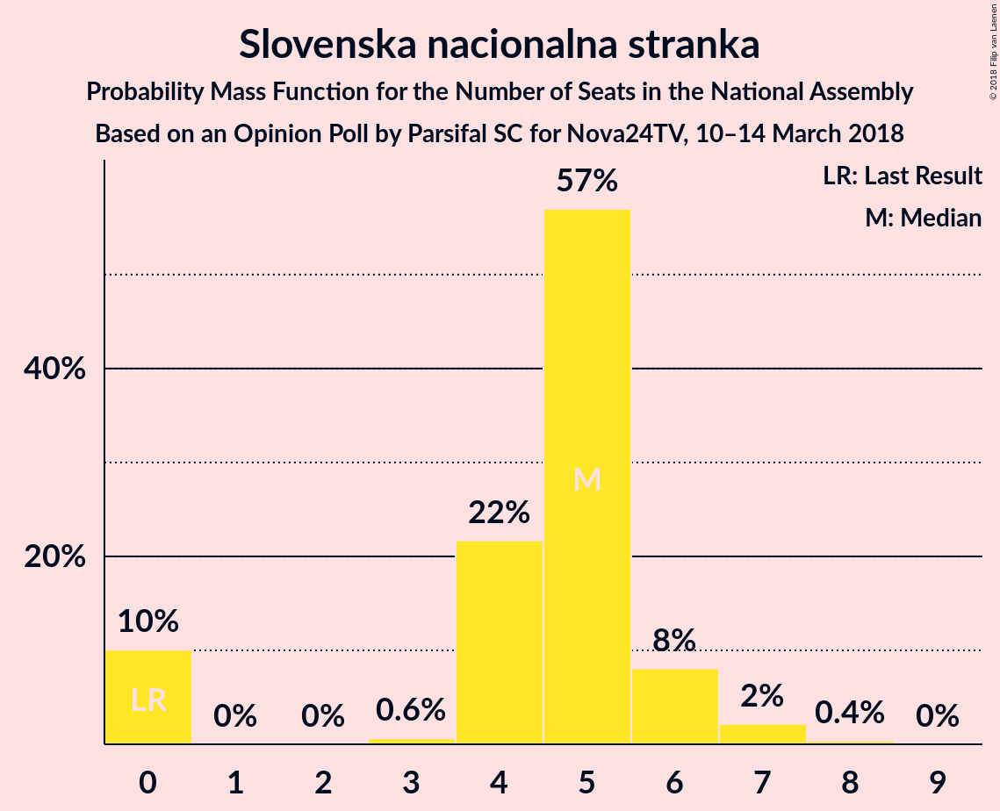
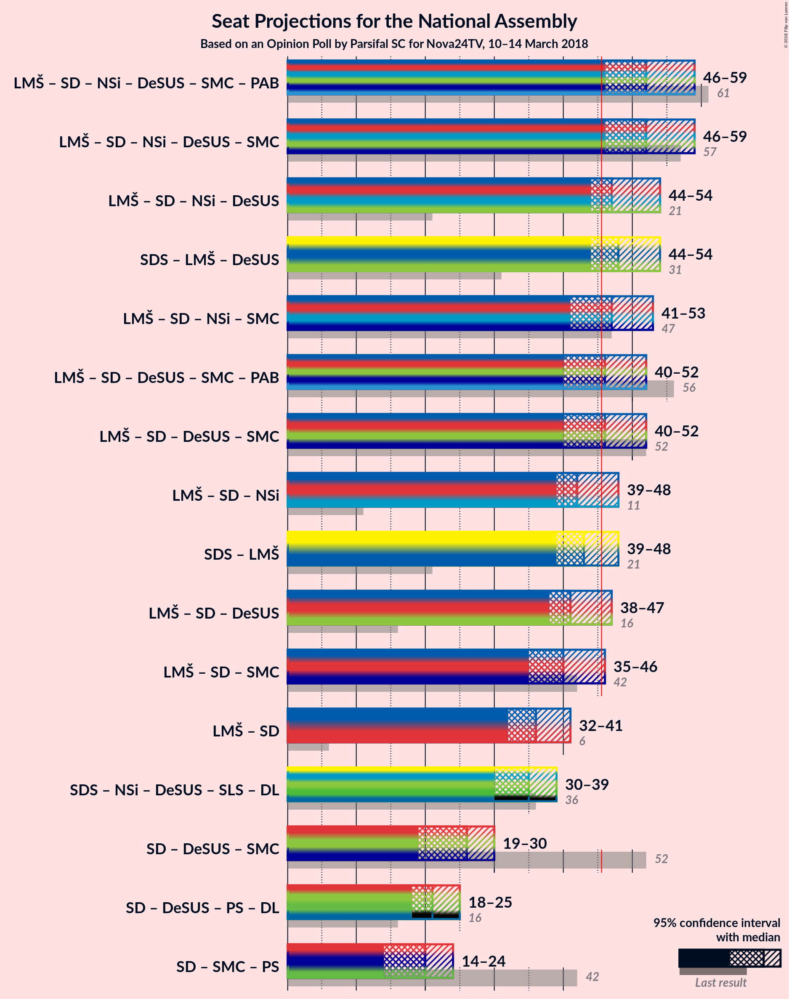

# Opinion Poll by Parsifal SC for Nova24TV, 10–14 March 2018

<a href="#voting-intentions">Voting Intentions</a> | <a href="#seats">Seats</a> | <a href="#coalitions">Coalitions</a> | <a href="#technical-information">Technical Information</a>

## Voting Intentions

### Confidence Intervals

| Party | Last Result | Poll Result | 80% Confidence Interval | 90% Confidence Interval | 95% Confidence Interval | 99% Confidence Interval |
|:-----:|:-----------:|:-----------:|:-----------------------:|:-----------------------:|:-----------------------:|:-----------------------:|
| Slovenska demokratska stranka | 20.7% | 23.3% | 21.5–25.4% |21.0–25.9% |20.5–26.4% |19.6–27.4% |
| Lista Marjana Šarca | 0.0% | 20.9% | 19.1–22.9% |18.6–23.4% |18.2–23.9% |17.4–24.9% |
| Socialni demokrati | 6.0% | 16.5% | 14.9–18.3% |14.4–18.8% |14.0–19.2% |13.3–20.1% |
| Nova Slovenija–Krščanski demokrati | 5.6% | 6.8% | 5.7–8.0% |5.4–8.4% |5.2–8.7% |4.8–9.4% |
| Demokratična stranka upokojencev Slovenije | 10.2% | 6.2% | 5.3–7.5% |5.0–7.9% |4.8–8.2% |4.3–8.8% |
| Stranka modernega centra | 34.5% | 5.2% | 4.3–6.4% |4.1–6.7% |3.9–7.0% |3.5–7.6% |
| Slovenska nacionalna stranka | 2.2% | 5.2% | 4.3–6.4% |4.1–6.7% |3.9–7.0% |3.5–7.6% |
| Levica | 6.0% | 4.1% | 3.3–5.1% |3.1–5.4% |2.9–5.7% |2.6–6.3% |
| Slovenska ljudska stranka | 4.0% | 2.8% | 2.2–3.7% |2.0–4.0% |1.9–4.2% |1.6–4.7% |
| Stranka Alenke Bratušek | 4.4% | 1.5% | 1.1–2.3% |1.0–2.5% |0.9–2.7% |0.7–3.1% |
| Pozitivna Slovenija | 3.0% | 0.9% | 0.6–1.5% |0.5–1.7% |0.4–1.8% |0.3–2.2% |
| Glas za otroke in družine–Nova ljudska stranka Slovenije | 0.0% | 0.6% | 0.4–1.2% |0.3–1.3% |0.3–1.5% |0.2–1.8% |

*Note:* The poll result column reflects the actual value used in the calculations. Published results may vary slightly, and in addition be rounded to fewer digits.

## Seats

### Confidence Intervals

| Party | Last Result | Median | 80% Confidence Interval | 90% Confidence Interval | 95% Confidence Interval | 99% Confidence Interval |
|:-----:|:-----------:|:------:|:-----------------------:|:-----------------------:|:-----------------------:|:-----------------------:|
| <a href="#slovenska-demokratska-stranka">Slovenska demokratska stranka</a> | 21 | 21 | 20–21 |20–21 |20–21 |20–21 |
| <a href="#lista-marjana-Šarca">Lista Marjana Šarca</a> | 0 | 19 | 19–21 |18–21 |18–21 |18–21 |
| <a href="#socialni-demokrati">Socialni demokrati</a> | 6 | 15 | 14–15 |14–16 |14–16 |14–16 |
| <a href="#nova-slovenija–krščanski-demokrati">Nova Slovenija–Krščanski demokrati</a> | 5 | 7 | 5–7 |5–8 |5–8 |5–8 |
| <a href="#demokratična-stranka-upokojencev-slovenije">Demokratična stranka upokojencev Slovenije</a> | 10 | 7 | 5–7 |5–7 |5–7 |5–7 |
| <a href="#stranka-modernega-centra">Stranka modernega centra</a> | 36 | 5 | 5 |5 |5 |5 |
| <a href="#slovenska-nacionalna-stranka">Slovenska nacionalna stranka</a> | 0 | 6 | 6 |5–6 |5–6 |5–6 |
| <a href="#levica">Levica</a> | 6 | 4 | 4–5 |4–5 |4–5 |4–5 |
| <a href="#slovenska-ljudska-stranka">Slovenska ljudska stranka</a> | 0 | 0 | 0 |0 |0 |0 |
| <a href="#stranka-alenke-bratušek">Stranka Alenke Bratušek</a> | 4 | 0 | 0 |0 |0 |0 |
| <a href="#pozitivna-slovenija">Pozitivna Slovenija</a> | 0 | 0 | 0 |0 |0 |0 |
| <a href="#glas-za-otroke-in-družine–nova-ljudska-stranka-slovenije">Glas za otroke in družine–Nova ljudska stranka Slovenije</a> | 0 | 0 | 0 |0 |0 |0 |

### Slovenska demokratska stranka

*For a full overview of the results for this party, see the [Slovenska demokratska stranka](party-slovenskademokratskastranka.html) page.*

| Number of Seats | Probability | Accumulated | Special Marks |
|:---------------:|:-----------:|:-----------:|:-------------:|
| 20 | 22% | 100% |  |
| 21 | 78% | 78% | Last Result, Median |
| 22 | 0% | 0.2% |  |
| 23 | 0% | 0.2% |  |
| 24 | 0% | 0.2% |  |
| 25 | 0.1% | 0.1% |  |
| 26 | 0% | 0% |  |

### Lista Marjana Šarca

*For a full overview of the results for this party, see the [Lista Marjana Šarca](party-listamarjanaŠarca.html) page.*

| Number of Seats | Probability | Accumulated | Special Marks |
|:---------------:|:-----------:|:-----------:|:-------------:|
| 0 | 0% | 100% | Last Result |
| 1 | 0% | 100% |  |
| 2 | 0% | 100% |  |
| 3 | 0% | 100% |  |
| 4 | 0% | 100% |  |
| 5 | 0% | 100% |  |
| 6 | 0% | 100% |  |
| 7 | 0% | 100% |  |
| 8 | 0% | 100% |  |
| 9 | 0% | 100% |  |
| 10 | 0% | 100% |  |
| 11 | 0% | 100% |  |
| 12 | 0% | 100% |  |
| 13 | 0% | 100% |  |
| 14 | 0% | 100% |  |
| 15 | 0% | 100% |  |
| 16 | 0% | 100% |  |
| 17 | 0% | 100% |  |
| 18 | 10% | 100% |  |
| 19 | 78% | 90% | Median |
| 20 | 0% | 12% |  |
| 21 | 12% | 12% |  |
| 22 | 0% | 0% |  |

### Socialni demokrati

*For a full overview of the results for this party, see the [Socialni demokrati](party-socialnidemokrati.html) page.*

| Number of Seats | Probability | Accumulated | Special Marks |
|:---------------:|:-----------:|:-----------:|:-------------:|
| 6 | 0% | 100% | Last Result |
| 7 | 0% | 100% |  |
| 8 | 0% | 100% |  |
| 9 | 0% | 100% |  |
| 10 | 0% | 100% |  |
| 11 | 0% | 100% |  |
| 12 | 0% | 100% |  |
| 13 | 0% | 100% |  |
| 14 | 12% | 100% |  |
| 15 | 78% | 88% | Median |
| 16 | 10% | 10% |  |
| 17 | 0% | 0% |  |

### Nova Slovenija–Krščanski demokrati

*For a full overview of the results for this party, see the [Nova Slovenija–Krščanski demokrati](party-novaslovenija–krščanskidemokrati.html) page.*

| Number of Seats | Probability | Accumulated | Special Marks |
|:---------------:|:-----------:|:-----------:|:-------------:|
| 5 | 12% | 100% | Last Result |
| 6 | 0% | 88% |  |
| 7 | 78% | 88% | Median |
| 8 | 10% | 10% |  |
| 9 | 0% | 0% |  |

### Demokratična stranka upokojencev Slovenije

*For a full overview of the results for this party, see the [Demokratična stranka upokojencev Slovenije](party-demokratičnastrankaupokojencevslovenije.html) page.*

| Number of Seats | Probability | Accumulated | Special Marks |
|:---------------:|:-----------:|:-----------:|:-------------:|
| 5 | 12% | 100% |  |
| 6 | 0% | 88% |  |
| 7 | 88% | 88% | Median |
| 8 | 0% | 0% |  |
| 9 | 0% | 0% |  |
| 10 | 0% | 0% | Last Result |

### Stranka modernega centra

*For a full overview of the results for this party, see the [Stranka modernega centra](party-strankamodernegacentra.html) page.*

| Number of Seats | Probability | Accumulated | Special Marks |
|:---------------:|:-----------:|:-----------:|:-------------:|
| 5 | 100% | 100% | Median |
| 6 | 0% | 0% |  |
| 7 | 0% | 0% |  |
| 8 | 0% | 0% |  |
| 9 | 0% | 0% |  |
| 10 | 0% | 0% |  |
| 11 | 0% | 0% |  |
| 12 | 0% | 0% |  |
| 13 | 0% | 0% |  |
| 14 | 0% | 0% |  |
| 15 | 0% | 0% |  |
| 16 | 0% | 0% |  |
| 17 | 0% | 0% |  |
| 18 | 0% | 0% |  |
| 19 | 0% | 0% |  |
| 20 | 0% | 0% |  |
| 21 | 0% | 0% |  |
| 22 | 0% | 0% |  |
| 23 | 0% | 0% |  |
| 24 | 0% | 0% |  |
| 25 | 0% | 0% |  |
| 26 | 0% | 0% |  |
| 27 | 0% | 0% |  |
| 28 | 0% | 0% |  |
| 29 | 0% | 0% |  |
| 30 | 0% | 0% |  |
| 31 | 0% | 0% |  |
| 32 | 0% | 0% |  |
| 33 | 0% | 0% |  |
| 34 | 0% | 0% |  |
| 35 | 0% | 0% |  |
| 36 | 0% | 0% | Last Result |

### Slovenska nacionalna stranka

*For a full overview of the results for this party, see the [Slovenska nacionalna stranka](party-slovenskanacionalnastranka.html) page.*

| Number of Seats | Probability | Accumulated | Special Marks |
|:---------------:|:-----------:|:-----------:|:-------------:|
| 0 | 0% | 100% | Last Result |
| 1 | 0% | 100% |  |
| 2 | 0% | 100% |  |
| 3 | 0% | 100% |  |
| 4 | 0.1% | 100% |  |
| 5 | 10% | 99.9% |  |
| 6 | 90% | 90% | Median |
| 7 | 0% | 0% |  |

### Levica

*For a full overview of the results for this party, see the [Levica](party-levica.html) page.*

| Number of Seats | Probability | Accumulated | Special Marks |
|:---------------:|:-----------:|:-----------:|:-------------:|
| 0 | 0.2% | 100% |  |
| 1 | 0% | 99.8% |  |
| 2 | 0% | 99.8% |  |
| 3 | 0% | 99.8% |  |
| 4 | 88% | 99.8% | Median |
| 5 | 12% | 12% |  |
| 6 | 0% | 0% | Last Result |

### Slovenska ljudska stranka

*For a full overview of the results for this party, see the [Slovenska ljudska stranka](party-slovenskaljudskastranka.html) page.*

| Number of Seats | Probability | Accumulated | Special Marks |
|:---------------:|:-----------:|:-----------:|:-------------:|
| 0 | 100% | 100% | Last Result, Median |

### Stranka Alenke Bratušek

*For a full overview of the results for this party, see the [Stranka Alenke Bratušek](party-strankaalenkebratušek.html) page.*

| Number of Seats | Probability | Accumulated | Special Marks |
|:---------------:|:-----------:|:-----------:|:-------------:|
| 0 | 100% | 100% | Median |
| 1 | 0% | 0% |  |
| 2 | 0% | 0% |  |
| 3 | 0% | 0% |  |
| 4 | 0% | 0% | Last Result |

### Pozitivna Slovenija

*For a full overview of the results for this party, see the [Pozitivna Slovenija](party-pozitivnaslovenija.html) page.*

| Number of Seats | Probability | Accumulated | Special Marks |
|:---------------:|:-----------:|:-----------:|:-------------:|
| 0 | 100% | 100% | Last Result, Median |

### Glas za otroke in družine–Nova ljudska stranka Slovenije

*For a full overview of the results for this party, see the [Glas za otroke in družine–Nova ljudska stranka Slovenije](party-glaszaotrokeindružine–novaljudskastrankaslovenije.html) page.*

| Number of Seats | Probability | Accumulated | Special Marks |
|:---------------:|:-----------:|:-----------:|:-------------:|
| 0 | 100% | 100% | Last Result, Median |

## Coalitions

### Confidence Intervals

| Coalition | Last Result | Median | Majority? | 80% Confidence Interval | 90% Confidence Interval | 95% Confidence Interval | 99% Confidence Interval |
|:---------:|:-----------:|:------:|:---------:|:-----------------------:|:-----------------------:|:-----------------------:|:-----------------------:|
| Socialni demokrati – Demokratična stranka upokojencev Slovenije – Stranka modernega centra | 52 | 27 | 0% | 24–27 | 24–28 | 24–28 | 24–28 |

### Socialni demokrati – Demokratična stranka upokojencev Slovenije – Stranka modernega centra

| Number of Seats | Probability | Accumulated | Special Marks |
|:---------------:|:-----------:|:-----------:|:-------------:|
| 24 | 12% | 100% |  |
| 25 | 0% | 88% |  |
| 26 | 0.2% | 88% |  |
| 27 | 78% | 88% | Median |
| 28 | 10% | 10% |  |
| 29 | 0% | 0% |  |
| 30 | 0% | 0% |  |
| 31 | 0% | 0% |  |
| 32 | 0% | 0% |  |
| 33 | 0% | 0% |  |
| 34 | 0% | 0% |  |
| 35 | 0% | 0% |  |
| 36 | 0% | 0% |  |
| 37 | 0% | 0% |  |
| 38 | 0% | 0% |  |
| 39 | 0% | 0% |  |
| 40 | 0% | 0% |  |
| 41 | 0% | 0% |  |
| 42 | 0% | 0% |  |
| 43 | 0% | 0% |  |
| 44 | 0% | 0% |  |
| 45 | 0% | 0% |  |
| 46 | 0% | 0% | Majority |
| 47 | 0% | 0% |  |
| 48 | 0% | 0% |  |
| 49 | 0% | 0% |  |
| 50 | 0% | 0% |  |
| 51 | 0% | 0% |  |
| 52 | 0% | 0% | Last Result |

## Technical Information

### Opinion Poll

+ **Polling firm:** Parsifal SC
+ **Commissioner(s):** Nova24TV
+ **Fieldwork period:** 10–14 March 2018

### Calculations

+ **Sample size:** 784
+ **Simulations done:** 1,024
+ **Error estimate:** 3.32%

