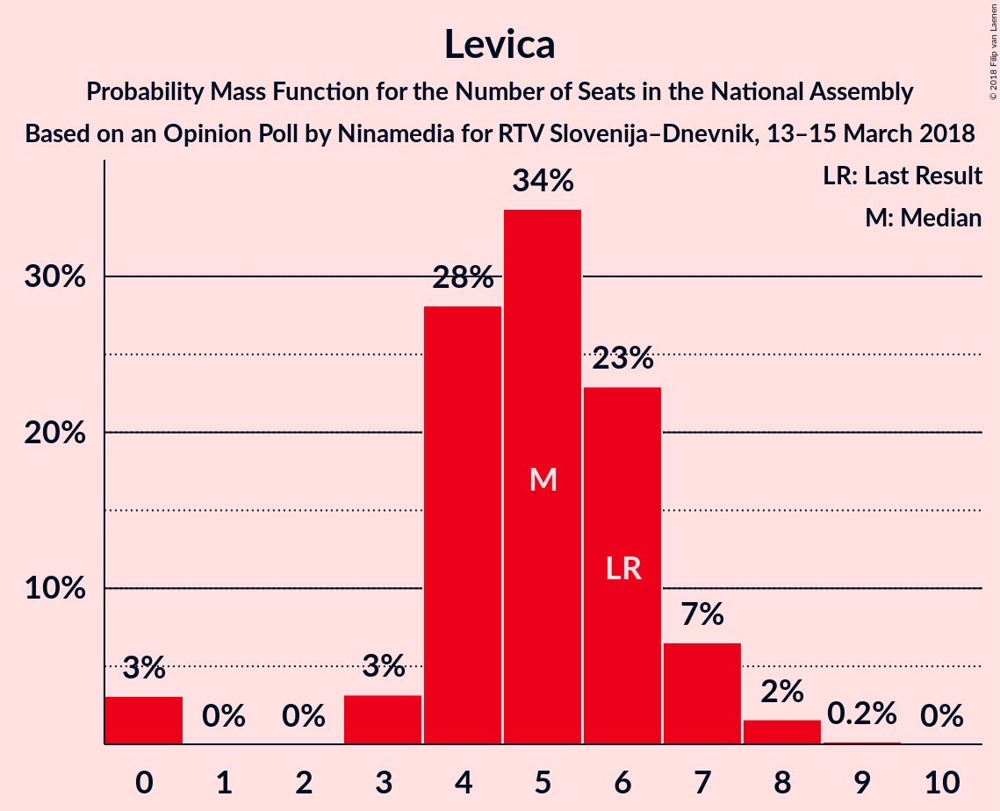

# Opinion Poll by Ninamedia for RTV Slovenija–Dnevnik, 13–15 March 2018

<a href="#voting-intentions">Voting Intentions</a> | <a href="#seats">Seats</a> | <a href="#coalitions">Coalitions</a> | <a href="#technical-information">Technical Information</a>

## Voting Intentions

### Confidence Intervals

| Party | Last Result | Poll Result | 80% Confidence Interval | 90% Confidence Interval | 95% Confidence Interval | 99% Confidence Interval |
|:-----:|:-----------:|:-----------:|:-----------------------:|:-----------------------:|:-----------------------:|:-----------------------:|
| Socialni demokrati | 6.0% | 20.8% | 18.4–23.5% |17.8–24.2% |17.2–24.9% |16.1–26.2% |
| Lista Marjana Šarca | 0.0% | 20.3% | 18.0–23.0% |17.3–23.7% |16.8–24.4% |15.7–25.7% |
| Slovenska demokratska stranka | 20.7% | 19.2% | 16.9–21.8% |16.2–22.5% |15.7–23.2% |14.7–24.5% |
| Stranka modernega centra | 34.5% | 12.4% | 10.5–14.6% |10.0–15.3% |9.6–15.9% |8.8–17.0% |
| Nova Slovenija–Krščanski demokrati | 5.6% | 7.9% | 6.5–9.9% |6.1–10.4% |5.7–10.9% |5.1–11.9% |
| Demokratična stranka upokojencev Slovenije | 10.2% | 7.9% | 6.5–9.9% |6.1–10.4% |5.7–10.9% |5.1–11.9% |
| Levica | 6.0% | 5.8% | 4.6–7.6% |4.3–8.0% |4.0–8.5% |3.5–9.4% |
| Stranka Alenke Bratušek | 4.4% | 0.2% | 0.1–0.9% |0.1–1.1% |0.0–1.3% |0.0–1.7% |

*Note:* The poll result column reflects the actual value used in the calculations. Published results may vary slightly, and in addition be rounded to fewer digits.

## Seats

### Confidence Intervals

| Party | Last Result | Median | 80% Confidence Interval | 90% Confidence Interval | 95% Confidence Interval | 99% Confidence Interval |
|:-----:|:-----------:|:------:|:-----------------------:|:-----------------------:|:-----------------------:|:-----------------------:|
| <a href="#socialni-demokrati">Socialni demokrati</a> | 6 | 19 | 16–21 |16–22 |15–22 |14–24 |
| <a href="#lista-marjana-Šarca">Lista Marjana Šarca</a> | 0 | 18 | 16–21 |15–21 |15–22 |14–23 |
| <a href="#slovenska-demokratska-stranka">Slovenska demokratska stranka</a> | 21 | 17 | 15–19 |14–20 |14–21 |13–22 |
| <a href="#stranka-modernega-centra">Stranka modernega centra</a> | 36 | 11 | 9–13 |9–14 |8–14 |7–15 |
| <a href="#nova-slovenija–krščanski-demokrati">Nova Slovenija–Krščanski demokrati</a> | 5 | 7 | 5–8 |5–9 |5–10 |4–10 |
| <a href="#demokratična-stranka-upokojencev-slovenije">Demokratična stranka upokojencev Slovenije</a> | 10 | 7 | 5–9 |5–9 |5–10 |4–10 |
| <a href="#levica">Levica</a> | 6 | 5 | 4–6 |3–7 |0–7 |0–8 |
| <a href="#stranka-alenke-bratušek">Stranka Alenke Bratušek</a> | 4 | 0 | 0 |0 |0 |0 |

### Socialni demokrati

*For a full overview of the results for this party, see the [Socialni demokrati](party-socialnidemokrati.html) page.*

| Number of Seats | Probability | Accumulated | Special Marks |
|:---------------:|:-----------:|:-----------:|:-------------:|
| 6 | 0% | 100% | Last Result |
| 7 | 0% | 100% |  |
| 8 | 0% | 100% |  |
| 9 | 0% | 100% |  |
| 10 | 0% | 100% |  |
| 11 | 0% | 100% |  |
| 12 | 0% | 100% |  |
| 13 | 0.1% | 100% |  |
| 14 | 0.7% | 99.9% |  |
| 15 | 3% | 99.1% |  |
| 16 | 9% | 96% |  |
| 17 | 16% | 88% |  |
| 18 | 18% | 72% |  |
| 19 | 19% | 53% | Median |
| 20 | 18% | 34% |  |
| 21 | 10% | 17% |  |
| 22 | 4% | 6% |  |
| 23 | 1.5% | 2% |  |
| 24 | 0.4% | 0.6% |  |
| 25 | 0.2% | 0.2% |  |
| 26 | 0% | 0% |  |

### Lista Marjana Šarca

*For a full overview of the results for this party, see the [Lista Marjana Šarca](party-listamarjanaŠarca.html) page.*

| Number of Seats | Probability | Accumulated | Special Marks |
|:---------------:|:-----------:|:-----------:|:-------------:|
| 0 | 0% | 100% | Last Result |
| 1 | 0% | 100% |  |
| 2 | 0% | 100% |  |
| 3 | 0% | 100% |  |
| 4 | 0% | 100% |  |
| 5 | 0% | 100% |  |
| 6 | 0% | 100% |  |
| 7 | 0% | 100% |  |
| 8 | 0% | 100% |  |
| 9 | 0% | 100% |  |
| 10 | 0% | 100% |  |
| 11 | 0% | 100% |  |
| 12 | 0% | 100% |  |
| 13 | 0.3% | 100% |  |
| 14 | 1.2% | 99.7% |  |
| 15 | 5% | 98.5% |  |
| 16 | 11% | 93% |  |
| 17 | 15% | 82% |  |
| 18 | 20% | 67% | Median |
| 19 | 22% | 47% |  |
| 20 | 13% | 25% |  |
| 21 | 7% | 12% |  |
| 22 | 3% | 5% |  |
| 23 | 1.1% | 1.4% |  |
| 24 | 0.2% | 0.3% |  |
| 25 | 0.1% | 0.1% |  |
| 26 | 0% | 0% |  |

### Slovenska demokratska stranka

*For a full overview of the results for this party, see the [Slovenska demokratska stranka](party-slovenskademokratskastranka.html) page.*

| Number of Seats | Probability | Accumulated | Special Marks |
|:---------------:|:-----------:|:-----------:|:-------------:|
| 12 | 0.2% | 100% |  |
| 13 | 1.3% | 99.8% |  |
| 14 | 8% | 98.5% |  |
| 15 | 12% | 91% |  |
| 16 | 17% | 79% |  |
| 17 | 28% | 62% | Median |
| 18 | 16% | 34% |  |
| 19 | 9% | 18% |  |
| 20 | 5% | 8% |  |
| 21 | 2% | 3% | Last Result |
| 22 | 0.9% | 1.2% |  |
| 23 | 0.2% | 0.3% |  |
| 24 | 0.1% | 0.1% |  |
| 25 | 0% | 0% |  |

### Stranka modernega centra

*For a full overview of the results for this party, see the [Stranka modernega centra](party-strankamodernegacentra.html) page.*

| Number of Seats | Probability | Accumulated | Special Marks |
|:---------------:|:-----------:|:-----------:|:-------------:|
| 7 | 0.6% | 100% |  |
| 8 | 3% | 99.4% |  |
| 9 | 12% | 97% |  |
| 10 | 20% | 85% |  |
| 11 | 28% | 65% | Median |
| 12 | 20% | 37% |  |
| 13 | 12% | 17% |  |
| 14 | 4% | 5% |  |
| 15 | 1.0% | 1.3% |  |
| 16 | 0.2% | 0.3% |  |
| 17 | 0% | 0% |  |
| 18 | 0% | 0% |  |
| 19 | 0% | 0% |  |
| 20 | 0% | 0% |  |
| 21 | 0% | 0% |  |
| 22 | 0% | 0% |  |
| 23 | 0% | 0% |  |
| 24 | 0% | 0% |  |
| 25 | 0% | 0% |  |
| 26 | 0% | 0% |  |
| 27 | 0% | 0% |  |
| 28 | 0% | 0% |  |
| 29 | 0% | 0% |  |
| 30 | 0% | 0% |  |
| 31 | 0% | 0% |  |
| 32 | 0% | 0% |  |
| 33 | 0% | 0% |  |
| 34 | 0% | 0% |  |
| 35 | 0% | 0% |  |
| 36 | 0% | 0% | Last Result |

### Nova Slovenija–Krščanski demokrati

*For a full overview of the results for this party, see the [Nova Slovenija–Krščanski demokrati](party-novaslovenija–krščanskidemokrati.html) page.*

| Number of Seats | Probability | Accumulated | Special Marks |
|:---------------:|:-----------:|:-----------:|:-------------:|
| 4 | 1.5% | 100% |  |
| 5 | 12% | 98% | Last Result |
| 6 | 31% | 87% |  |
| 7 | 30% | 56% | Median |
| 8 | 16% | 26% |  |
| 9 | 7% | 10% |  |
| 10 | 2% | 3% |  |
| 11 | 0.4% | 0.5% |  |
| 12 | 0.1% | 0.1% |  |
| 13 | 0% | 0% |  |

### Demokratična stranka upokojencev Slovenije

*For a full overview of the results for this party, see the [Demokratična stranka upokojencev Slovenije](party-demokratičnastrankaupokojencevslovenije.html) page.*

| Number of Seats | Probability | Accumulated | Special Marks |
|:---------------:|:-----------:|:-----------:|:-------------:|
| 4 | 1.2% | 100% |  |
| 5 | 10% | 98.7% |  |
| 6 | 28% | 89% |  |
| 7 | 31% | 61% | Median |
| 8 | 19% | 30% |  |
| 9 | 8% | 11% |  |
| 10 | 2% | 3% | Last Result |
| 11 | 0.3% | 0.4% |  |
| 12 | 0% | 0.1% |  |
| 13 | 0% | 0% |  |

### Levica

*For a full overview of the results for this party, see the [Levica](party-levica.html) page.*

| Number of Seats | Probability | Accumulated | Special Marks |
|:---------------:|:-----------:|:-----------:|:-------------:|
| 0 | 3% | 100% |  |
| 1 | 0% | 97% |  |
| 2 | 0% | 97% |  |
| 3 | 3% | 97% |  |
| 4 | 28% | 94% |  |
| 5 | 34% | 66% | Median |
| 6 | 23% | 31% | Last Result |
| 7 | 7% | 8% |  |
| 8 | 2% | 2% |  |
| 9 | 0.2% | 0.2% |  |
| 10 | 0% | 0% |  |

### Stranka Alenke Bratušek

*For a full overview of the results for this party, see the [Stranka Alenke Bratušek](party-strankaalenkebratušek.html) page.*

| Number of Seats | Probability | Accumulated | Special Marks |
|:---------------:|:-----------:|:-----------:|:-------------:|
| 0 | 100% | 100% | Median |
| 1 | 0% | 0% |  |
| 2 | 0% | 0% |  |
| 3 | 0% | 0% |  |
| 4 | 0% | 0% | Last Result |

## Coalitions

### Confidence Intervals

| Coalition | Last Result | Median | Majority? | 80% Confidence Interval | 90% Confidence Interval | 95% Confidence Interval | 99% Confidence Interval |
|:---------:|:-----------:|:------:|:---------:|:-----------------------:|:-----------------------:|:-----------------------:|:-----------------------:|
| Socialni demokrati – Lista Marjana Šarca – Stranka modernega centra | 42 | 48 | 84% | 45–51 | 44–52 | 43–52 | 42–54 |
| Socialni demokrati – Lista Marjana Šarca – Demokratična stranka upokojencev Slovenije | 16 | 44 | 26% | 41–47 | 40–48 | 39–49 | 38–50 |
| Socialni demokrati – Lista Marjana Šarca – Nova Slovenija–Krščanski demokrati | 11 | 44 | 25% | 41–47 | 40–48 | 39–49 | 38–50 |
| Lista Marjana Šarca – Slovenska demokratska stranka – Demokratična stranka upokojencev Slovenije | 31 | 42 | 9% | 39–45 | 38–46 | 38–47 | 36–49 |
| Socialni demokrati – Lista Marjana Šarca | 6 | 37 | 0% | 34–40 | 33–41 | 32–42 | 31–43 |
| Socialni demokrati – Stranka modernega centra – Demokratična stranka upokojencev Slovenije | 52 | 37 | 0% | 34–40 | 33–40 | 32–41 | 31–43 |
| Lista Marjana Šarca – Slovenska demokratska stranka | 21 | 35 | 0% | 32–38 | 32–39 | 31–40 | 29–41 |

### Socialni demokrati – Lista Marjana Šarca – Stranka modernega centra

| Number of Seats | Probability | Accumulated | Special Marks |
|:---------------:|:-----------:|:-----------:|:-------------:|
| 40 | 0.1% | 100% |  |
| 41 | 0.3% | 99.9% |  |
| 42 | 1.3% | 99.6% | Last Result |
| 43 | 3% | 98% |  |
| 44 | 5% | 95% |  |
| 45 | 7% | 90% |  |
| 46 | 8% | 84% | Majority |
| 47 | 12% | 76% |  |
| 48 | 20% | 64% | Median |
| 49 | 15% | 45% |  |
| 50 | 16% | 30% |  |
| 51 | 7% | 14% |  |
| 52 | 4% | 7% |  |
| 53 | 2% | 2% |  |
| 54 | 0.5% | 0.8% |  |
| 55 | 0.2% | 0.3% |  |
| 56 | 0% | 0.1% |  |
| 57 | 0% | 0.1% |  |
| 58 | 0% | 0% |  |

### Socialni demokrati – Lista Marjana Šarca – Demokratična stranka upokojencev Slovenije

| Number of Seats | Probability | Accumulated | Special Marks |
|:---------------:|:-----------:|:-----------:|:-------------:|
| 16 | 0% | 100% | Last Result |
| 17 | 0% | 100% |  |
| 18 | 0% | 100% |  |
| 19 | 0% | 100% |  |
| 20 | 0% | 100% |  |
| 21 | 0% | 100% |  |
| 22 | 0% | 100% |  |
| 23 | 0% | 100% |  |
| 24 | 0% | 100% |  |
| 25 | 0% | 100% |  |
| 26 | 0% | 100% |  |
| 27 | 0% | 100% |  |
| 28 | 0% | 100% |  |
| 29 | 0% | 100% |  |
| 30 | 0% | 100% |  |
| 31 | 0% | 100% |  |
| 32 | 0% | 100% |  |
| 33 | 0% | 100% |  |
| 34 | 0% | 100% |  |
| 35 | 0% | 100% |  |
| 36 | 0.1% | 100% |  |
| 37 | 0.2% | 99.9% |  |
| 38 | 0.6% | 99.7% |  |
| 39 | 4% | 99.0% |  |
| 40 | 4% | 95% |  |
| 41 | 7% | 92% |  |
| 42 | 13% | 84% |  |
| 43 | 14% | 72% |  |
| 44 | 18% | 58% | Median |
| 45 | 13% | 40% |  |
| 46 | 12% | 26% | Majority |
| 47 | 8% | 15% |  |
| 48 | 4% | 6% |  |
| 49 | 2% | 3% |  |
| 50 | 0.7% | 1.1% |  |
| 51 | 0.3% | 0.4% |  |
| 52 | 0.1% | 0.1% |  |
| 53 | 0% | 0% |  |

### Socialni demokrati – Lista Marjana Šarca – Nova Slovenija–Krščanski demokrati

| Number of Seats | Probability | Accumulated | Special Marks |
|:---------------:|:-----------:|:-----------:|:-------------:|
| 11 | 0% | 100% | Last Result |
| 12 | 0% | 100% |  |
| 13 | 0% | 100% |  |
| 14 | 0% | 100% |  |
| 15 | 0% | 100% |  |
| 16 | 0% | 100% |  |
| 17 | 0% | 100% |  |
| 18 | 0% | 100% |  |
| 19 | 0% | 100% |  |
| 20 | 0% | 100% |  |
| 21 | 0% | 100% |  |
| 22 | 0% | 100% |  |
| 23 | 0% | 100% |  |
| 24 | 0% | 100% |  |
| 25 | 0% | 100% |  |
| 26 | 0% | 100% |  |
| 27 | 0% | 100% |  |
| 28 | 0% | 100% |  |
| 29 | 0% | 100% |  |
| 30 | 0% | 100% |  |
| 31 | 0% | 100% |  |
| 32 | 0% | 100% |  |
| 33 | 0% | 100% |  |
| 34 | 0% | 100% |  |
| 35 | 0% | 100% |  |
| 36 | 0.1% | 100% |  |
| 37 | 0.2% | 99.9% |  |
| 38 | 0.7% | 99.7% |  |
| 39 | 2% | 99.0% |  |
| 40 | 4% | 97% |  |
| 41 | 10% | 93% |  |
| 42 | 12% | 83% |  |
| 43 | 19% | 71% |  |
| 44 | 15% | 52% | Median |
| 45 | 12% | 37% |  |
| 46 | 11% | 25% | Majority |
| 47 | 6% | 13% |  |
| 48 | 5% | 8% |  |
| 49 | 2% | 3% |  |
| 50 | 0.5% | 0.9% |  |
| 51 | 0.3% | 0.4% |  |
| 52 | 0.1% | 0.1% |  |
| 53 | 0% | 0% |  |

### Lista Marjana Šarca – Slovenska demokratska stranka – Demokratična stranka upokojencev Slovenije

| Number of Seats | Probability | Accumulated | Special Marks |
|:---------------:|:-----------:|:-----------:|:-------------:|
| 31 | 0% | 100% | Last Result |
| 32 | 0% | 100% |  |
| 33 | 0% | 100% |  |
| 34 | 0% | 100% |  |
| 35 | 0.1% | 100% |  |
| 36 | 0.5% | 99.8% |  |
| 37 | 2% | 99.3% |  |
| 38 | 3% | 98% |  |
| 39 | 7% | 95% |  |
| 40 | 11% | 88% |  |
| 41 | 16% | 77% |  |
| 42 | 21% | 61% | Median |
| 43 | 14% | 40% |  |
| 44 | 10% | 27% |  |
| 45 | 7% | 16% |  |
| 46 | 5% | 9% | Majority |
| 47 | 2% | 3% |  |
| 48 | 1.1% | 2% |  |
| 49 | 0.4% | 0.5% |  |
| 50 | 0.1% | 0.2% |  |
| 51 | 0% | 0.1% |  |
| 52 | 0% | 0% |  |

### Socialni demokrati – Lista Marjana Šarca

| Number of Seats | Probability | Accumulated | Special Marks |
|:---------------:|:-----------:|:-----------:|:-------------:|
| 6 | 0% | 100% | Last Result |
| 7 | 0% | 100% |  |
| 8 | 0% | 100% |  |
| 9 | 0% | 100% |  |
| 10 | 0% | 100% |  |
| 11 | 0% | 100% |  |
| 12 | 0% | 100% |  |
| 13 | 0% | 100% |  |
| 14 | 0% | 100% |  |
| 15 | 0% | 100% |  |
| 16 | 0% | 100% |  |
| 17 | 0% | 100% |  |
| 18 | 0% | 100% |  |
| 19 | 0% | 100% |  |
| 20 | 0% | 100% |  |
| 21 | 0% | 100% |  |
| 22 | 0% | 100% |  |
| 23 | 0% | 100% |  |
| 24 | 0% | 100% |  |
| 25 | 0% | 100% |  |
| 26 | 0% | 100% |  |
| 27 | 0% | 100% |  |
| 28 | 0% | 100% |  |
| 29 | 0% | 100% |  |
| 30 | 0.2% | 100% |  |
| 31 | 0.9% | 99.8% |  |
| 32 | 2% | 98.9% |  |
| 33 | 6% | 97% |  |
| 34 | 7% | 91% |  |
| 35 | 11% | 85% |  |
| 36 | 15% | 74% |  |
| 37 | 17% | 59% | Median |
| 38 | 13% | 42% |  |
| 39 | 16% | 28% |  |
| 40 | 5% | 13% |  |
| 41 | 5% | 7% |  |
| 42 | 2% | 3% |  |
| 43 | 0.7% | 0.9% |  |
| 44 | 0.2% | 0.2% |  |
| 45 | 0% | 0.1% |  |
| 46 | 0% | 0% | Majority |

### Socialni demokrati – Stranka modernega centra – Demokratična stranka upokojencev Slovenije

| Number of Seats | Probability | Accumulated | Special Marks |
|:---------------:|:-----------:|:-----------:|:-------------:|
| 29 | 0.1% | 100% |  |
| 30 | 0.3% | 99.9% |  |
| 31 | 1.0% | 99.7% |  |
| 32 | 2% | 98.7% |  |
| 33 | 6% | 97% |  |
| 34 | 8% | 91% |  |
| 35 | 13% | 83% |  |
| 36 | 15% | 69% |  |
| 37 | 17% | 54% | Median |
| 38 | 15% | 36% |  |
| 39 | 10% | 22% |  |
| 40 | 6% | 11% |  |
| 41 | 3% | 5% |  |
| 42 | 1.0% | 2% |  |
| 43 | 0.5% | 0.6% |  |
| 44 | 0.1% | 0.1% |  |
| 45 | 0% | 0% |  |
| 46 | 0% | 0% | Majority |
| 47 | 0% | 0% |  |
| 48 | 0% | 0% |  |
| 49 | 0% | 0% |  |
| 50 | 0% | 0% |  |
| 51 | 0% | 0% |  |
| 52 | 0% | 0% | Last Result |

### Lista Marjana Šarca – Slovenska demokratska stranka

| Number of Seats | Probability | Accumulated | Special Marks |
|:---------------:|:-----------:|:-----------:|:-------------:|
| 21 | 0% | 100% | Last Result |
| 22 | 0% | 100% |  |
| 23 | 0% | 100% |  |
| 24 | 0% | 100% |  |
| 25 | 0% | 100% |  |
| 26 | 0% | 100% |  |
| 27 | 0% | 100% |  |
| 28 | 0.1% | 100% |  |
| 29 | 0.4% | 99.9% |  |
| 30 | 1.1% | 99.5% |  |
| 31 | 3% | 98% |  |
| 32 | 6% | 96% |  |
| 33 | 11% | 89% |  |
| 34 | 15% | 78% |  |
| 35 | 19% | 63% | Median |
| 36 | 16% | 44% |  |
| 37 | 12% | 28% |  |
| 38 | 8% | 16% |  |
| 39 | 5% | 8% |  |
| 40 | 2% | 3% |  |
| 41 | 1.0% | 1.4% |  |
| 42 | 0.3% | 0.4% |  |
| 43 | 0.1% | 0.1% |  |
| 44 | 0% | 0% |  |

## Technical Information

### Opinion Poll

+ **Polling firm:** Ninamedia
+ **Commissioner(s):** RTV Slovenija–Dnevnik
+ **Fieldwork period:** 13–15 March 2018

### Calculations

+ **Sample size:** 428
+ **Simulations done:** 1,048,576
+ **Error estimate:** 2.26%

