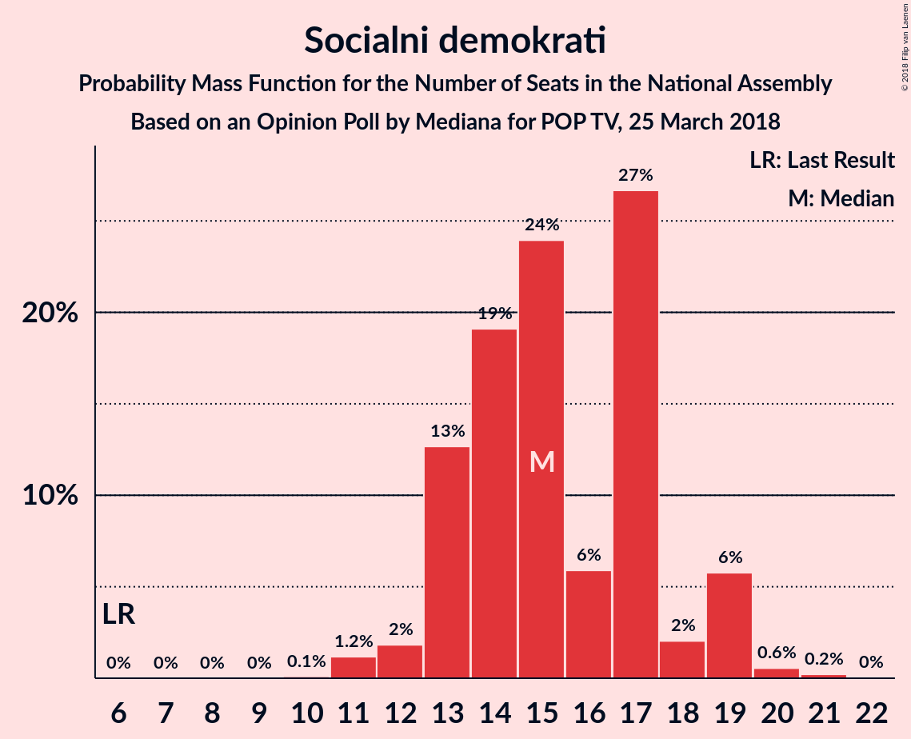

# Opinion Poll by Mediana for POP TV, 25 March 2018

<a href="#voting-intentions">Voting Intentions</a> | <a href="#seats">Seats</a> | <a href="#coalitions">Coalitions</a> | <a href="#technical-information">Technical Information</a>

## Voting Intentions

### Confidence Intervals

| Party | Last Result | Poll Result | 80% Confidence Interval | 90% Confidence Interval | 95% Confidence Interval | 99% Confidence Interval |
|:-----:|:-----------:|:-----------:|:-----------------------:|:-----------------------:|:-----------------------:|:-----------------------:|
| Lista Marjana Šarca | 0.0% | 25.6% | 23.0–28.4% |22.3–29.2% |21.7–29.9% |20.5–31.2% |
| Slovenska demokratska stranka | 20.7% | 18.9% | 16.7–21.5% |16.1–22.3% |15.5–22.9% |14.5–24.2% |
| Socialni demokrati | 6.0% | 15.5% | 13.5–17.9% |12.9–18.6% |12.4–19.2% |11.5–20.4% |
| Stranka modernega centra | 34.5% | 10.3% | 8.6–12.4% |8.2–13.0% |7.8–13.5% |7.0–14.5% |
| Levica | 6.0% | 7.3% | 5.9–9.1% |5.5–9.7% |5.2–10.1% |4.6–11.1% |
| Nova Slovenija–Krščanski demokrati | 5.6% | 6.6% | 5.3–8.4% |5.0–8.9% |4.6–9.4% |4.1–10.3% |
| Demokratična stranka upokojencev Slovenije | 10.2% | 5.7% | 4.5–7.4% |4.2–7.9% |3.9–8.3% |3.4–9.2% |
| Stranka Alenke Bratušek | 4.4% | 3.2% | 2.3–4.6% |2.1–5.0% |1.9–5.3% |1.6–6.0% |
| Slovenska nacionalna stranka | 2.2% | 2.3% | 1.6–3.5% |1.4–3.8% |1.2–4.2% |1.0–4.8% |
| Glas za otroke in družine–Nova ljudska stranka Slovenije | 0.0% | 1.8% | 1.2–3.0% |1.1–3.3% |0.9–3.6% |0.7–4.2% |
| Slovenska ljudska stranka | 4.0% | 1.1% | 0.7–2.1% |0.6–2.4% |0.5–2.7% |0.4–3.2% |
| Pozitivna Slovenija | 3.0% | 0.9% | 0.5–1.8% |0.4–2.1% |0.4–2.3% |0.2–2.9% |

*Note:* The poll result column reflects the actual value used in the calculations. Published results may vary slightly, and in addition be rounded to fewer digits.

## Seats

### Confidence Intervals

| Party | Last Result | Median | 80% Confidence Interval | 90% Confidence Interval | 95% Confidence Interval | 99% Confidence Interval |
|:-----:|:-----------:|:------:|:-----------------------:|:-----------------------:|:-----------------------:|:-----------------------:|
| <a href="#lista-marjana-šarca">Lista Marjana Šarca</a> | 0 | 25 | 20–30 |20–30 |19–30 |19–31 |
| <a href="#slovenska-demokratska-stranka">Slovenska demokratska stranka</a> | 21 | 19 | 15–21 |15–21 |15–23 |14–23 |
| <a href="#socialni-demokrati">Socialni demokrati</a> | 6 | 15 | 14–18 |12–18 |11–18 |11–20 |
| <a href="#stranka-modernega-centra">Stranka modernega centra</a> | 36 | 9 | 7–11 |7–13 |7–13 |6–15 |
| <a href="#levica">Levica</a> | 6 | 7 | 5–8 |5–9 |5–9 |4–11 |
| <a href="#nova-slovenija–krščanski-demokrati">Nova Slovenija–Krščanski demokrati</a> | 5 | 6 | 4–7 |4–8 |4–9 |0–9 |
| <a href="#demokratična-stranka-upokojencev-slovenije">Demokratična stranka upokojencev Slovenije</a> | 10 | 5 | 0–8 |0–8 |0–8 |0–9 |
| <a href="#stranka-alenke-bratušek">Stranka Alenke Bratušek</a> | 4 | 0 | 0–5 |0–6 |0–6 |0–6 |
| <a href="#slovenska-nacionalna-stranka">Slovenska nacionalna stranka</a> | 0 | 0 | 0 |0–5 |0–5 |0–5 |
| <a href="#glas-za-otroke-in-družine–nova-ljudska-stranka-slovenije">Glas za otroke in družine–Nova ljudska stranka Slovenije</a> | 0 | 0 | 0 |0–4 |0–4 |0–4 |
| <a href="#slovenska-ljudska-stranka">Slovenska ljudska stranka</a> | 0 | 0 | 0 |0 |0 |0 |
| <a href="#pozitivna-slovenija">Pozitivna Slovenija</a> | 0 | 0 | 0 |0 |0 |0 |

### Lista Marjana Šarca

*For a full overview of the results for this party, see the [Lista Marjana Šarca](party-listamarjanašarca.html) page.*

| Number of Seats | Probability | Accumulated | Special Marks |
|:---------------:|:-----------:|:-----------:|:-------------:|
| 0 | 0% | 100% | Last Result |
| 1 | 0% | 100% |  |
| 2 | 0% | 100% |  |
| 3 | 0% | 100% |  |
| 4 | 0% | 100% |  |
| 5 | 0% | 100% |  |
| 6 | 0% | 100% |  |
| 7 | 0% | 100% |  |
| 8 | 0% | 100% |  |
| 9 | 0% | 100% |  |
| 10 | 0% | 100% |  |
| 11 | 0% | 100% |  |
| 12 | 0% | 100% |  |
| 13 | 0% | 100% |  |
| 14 | 0% | 100% |  |
| 15 | 0% | 100% |  |
| 16 | 0% | 100% |  |
| 17 | 0% | 100% |  |
| 18 | 0.2% | 100% |  |
| 19 | 5% | 99.8% |  |
| 20 | 14% | 95% |  |
| 21 | 2% | 81% |  |
| 22 | 14% | 79% |  |
| 23 | 4% | 66% |  |
| 24 | 4% | 61% |  |
| 25 | 19% | 57% | Median |
| 26 | 10% | 38% |  |
| 27 | 9% | 28% |  |
| 28 | 3% | 19% |  |
| 29 | 4% | 16% |  |
| 30 | 10% | 12% |  |
| 31 | 2% | 2% |  |
| 32 | 0% | 0.2% |  |
| 33 | 0% | 0.2% |  |
| 34 | 0.2% | 0.2% |  |
| 35 | 0% | 0% |  |

### Slovenska demokratska stranka

*For a full overview of the results for this party, see the [Slovenska demokratska stranka](party-slovenskademokratskastranka.html) page.*

| Number of Seats | Probability | Accumulated | Special Marks |
|:---------------:|:-----------:|:-----------:|:-------------:|
| 13 | 0.2% | 100% |  |
| 14 | 2% | 99.8% |  |
| 15 | 11% | 98% |  |
| 16 | 10% | 87% |  |
| 17 | 8% | 77% |  |
| 18 | 15% | 70% |  |
| 19 | 8% | 54% | Median |
| 20 | 24% | 46% |  |
| 21 | 19% | 22% | Last Result |
| 22 | 0.6% | 3% |  |
| 23 | 3% | 3% |  |
| 24 | 0.1% | 0.2% |  |
| 25 | 0.1% | 0.1% |  |
| 26 | 0% | 0% |  |

### Socialni demokrati

*For a full overview of the results for this party, see the [Socialni demokrati](party-socialnidemokrati.html) page.*

| Number of Seats | Probability | Accumulated | Special Marks |
|:---------------:|:-----------:|:-----------:|:-------------:|
| 6 | 0% | 100% | Last Result |
| 7 | 0% | 100% |  |
| 8 | 0% | 100% |  |
| 9 | 0% | 100% |  |
| 10 | 0.2% | 100% |  |
| 11 | 4% | 99.8% |  |
| 12 | 1.3% | 96% |  |
| 13 | 3% | 94% |  |
| 14 | 31% | 91% |  |
| 15 | 15% | 61% | Median |
| 16 | 29% | 46% |  |
| 17 | 4% | 17% |  |
| 18 | 11% | 13% |  |
| 19 | 0.7% | 2% |  |
| 20 | 1.1% | 1.5% |  |
| 21 | 0.3% | 0.4% |  |
| 22 | 0.1% | 0.1% |  |
| 23 | 0% | 0% |  |

### Stranka modernega centra

*For a full overview of the results for this party, see the [Stranka modernega centra](party-strankamodernegacentra.html) page.*

| Number of Seats | Probability | Accumulated | Special Marks |
|:---------------:|:-----------:|:-----------:|:-------------:|
| 5 | 0.3% | 100% |  |
| 6 | 0.2% | 99.7% |  |
| 7 | 12% | 99.4% |  |
| 8 | 27% | 88% |  |
| 9 | 15% | 61% | Median |
| 10 | 26% | 46% |  |
| 11 | 14% | 21% |  |
| 12 | 1.3% | 7% |  |
| 13 | 4% | 6% |  |
| 14 | 1.4% | 2% |  |
| 15 | 0.5% | 0.7% |  |
| 16 | 0.3% | 0.3% |  |
| 17 | 0% | 0% |  |
| 18 | 0% | 0% |  |
| 19 | 0% | 0% |  |
| 20 | 0% | 0% |  |
| 21 | 0% | 0% |  |
| 22 | 0% | 0% |  |
| 23 | 0% | 0% |  |
| 24 | 0% | 0% |  |
| 25 | 0% | 0% |  |
| 26 | 0% | 0% |  |
| 27 | 0% | 0% |  |
| 28 | 0% | 0% |  |
| 29 | 0% | 0% |  |
| 30 | 0% | 0% |  |
| 31 | 0% | 0% |  |
| 32 | 0% | 0% |  |
| 33 | 0% | 0% |  |
| 34 | 0% | 0% |  |
| 35 | 0% | 0% |  |
| 36 | 0% | 0% | Last Result |

### Levica

*For a full overview of the results for this party, see the [Levica](party-levica.html) page.*

| Number of Seats | Probability | Accumulated | Special Marks |
|:---------------:|:-----------:|:-----------:|:-------------:|
| 0 | 0.1% | 100% |  |
| 1 | 0% | 99.9% |  |
| 2 | 0% | 99.9% |  |
| 3 | 0% | 99.9% |  |
| 4 | 0.7% | 99.9% |  |
| 5 | 10% | 99.2% |  |
| 6 | 11% | 89% | Last Result |
| 7 | 33% | 78% | Median |
| 8 | 37% | 45% |  |
| 9 | 6% | 9% |  |
| 10 | 2% | 2% |  |
| 11 | 0.8% | 0.9% |  |
| 12 | 0.1% | 0.1% |  |
| 13 | 0% | 0% |  |

### Nova Slovenija–Krščanski demokrati

*For a full overview of the results for this party, see the [Nova Slovenija–Krščanski demokrati](party-novaslovenija–krščanskidemokrati.html) page.*

| Number of Seats | Probability | Accumulated | Special Marks |
|:---------------:|:-----------:|:-----------:|:-------------:|
| 0 | 2% | 100% |  |
| 1 | 0% | 98% |  |
| 2 | 0% | 98% |  |
| 3 | 0% | 98% |  |
| 4 | 19% | 98% |  |
| 5 | 26% | 78% | Last Result |
| 6 | 20% | 52% | Median |
| 7 | 24% | 32% |  |
| 8 | 4% | 8% |  |
| 9 | 4% | 4% |  |
| 10 | 0.1% | 0.4% |  |
| 11 | 0.3% | 0.3% |  |
| 12 | 0% | 0% |  |

### Demokratična stranka upokojencev Slovenije

*For a full overview of the results for this party, see the [Demokratična stranka upokojencev Slovenije](party-demokratičnastrankaupokojencevslovenije.html) page.*

| Number of Seats | Probability | Accumulated | Special Marks |
|:---------------:|:-----------:|:-----------:|:-------------:|
| 0 | 11% | 100% |  |
| 1 | 0% | 89% |  |
| 2 | 0% | 89% |  |
| 3 | 0% | 89% |  |
| 4 | 17% | 89% |  |
| 5 | 38% | 72% | Median |
| 6 | 11% | 34% |  |
| 7 | 8% | 23% |  |
| 8 | 14% | 15% |  |
| 9 | 1.2% | 1.2% |  |
| 10 | 0% | 0% | Last Result |

### Stranka Alenke Bratušek

*For a full overview of the results for this party, see the [Stranka Alenke Bratušek](party-strankaalenkebratušek.html) page.*

| Number of Seats | Probability | Accumulated | Special Marks |
|:---------------:|:-----------:|:-----------:|:-------------:|
| 0 | 64% | 100% | Median |
| 1 | 0% | 36% |  |
| 2 | 0% | 36% |  |
| 3 | 0.2% | 36% |  |
| 4 | 9% | 36% | Last Result |
| 5 | 22% | 28% |  |
| 6 | 5% | 5% |  |
| 7 | 0% | 0% |  |

### Slovenska nacionalna stranka

*For a full overview of the results for this party, see the [Slovenska nacionalna stranka](party-slovenskanacionalnastranka.html) page.*

| Number of Seats | Probability | Accumulated | Special Marks |
|:---------------:|:-----------:|:-----------:|:-------------:|
| 0 | 92% | 100% | Last Result, Median |
| 1 | 0% | 8% |  |
| 2 | 0% | 8% |  |
| 3 | 0% | 8% |  |
| 4 | 3% | 8% |  |
| 5 | 5% | 5% |  |
| 6 | 0% | 0% |  |

### Glas za otroke in družine–Nova ljudska stranka Slovenije

*For a full overview of the results for this party, see the [Glas za otroke in družine–Nova ljudska stranka Slovenije](party-glaszaotrokeindružine–novaljudskastrankaslovenije.html) page.*

| Number of Seats | Probability | Accumulated | Special Marks |
|:---------------:|:-----------:|:-----------:|:-------------:|
| 0 | 93% | 100% | Last Result, Median |
| 1 | 0% | 7% |  |
| 2 | 0% | 7% |  |
| 3 | 0% | 7% |  |
| 4 | 7% | 7% |  |
| 5 | 0% | 0% |  |

### Slovenska ljudska stranka

*For a full overview of the results for this party, see the [Slovenska ljudska stranka](party-slovenskaljudskastranka.html) page.*

| Number of Seats | Probability | Accumulated | Special Marks |
|:---------------:|:-----------:|:-----------:|:-------------:|
| 0 | 100% | 100% | Last Result, Median |

### Pozitivna Slovenija

*For a full overview of the results for this party, see the [Pozitivna Slovenija](party-pozitivnaslovenija.html) page.*

| Number of Seats | Probability | Accumulated | Special Marks |
|:---------------:|:-----------:|:-----------:|:-------------:|
| 0 | 100% | 100% | Last Result, Median |

## Coalitions

### Confidence Intervals

| Coalition | Last Result | Median | Majority? | 80% Confidence Interval | 90% Confidence Interval | 95% Confidence Interval | 99% Confidence Interval |
|:---------:|:-----------:|:------:|:---------:|:-----------------------:|:-----------------------:|:-----------------------:|:-----------------------:|
| Lista Marjana Šarca – Socialni demokrati – Stranka modernega centra – Nova Slovenija–Krščanski demokrati – Demokratična stranka upokojencev Slovenije | 57 | 59 | 100% | 56–65 | 54–65 | 54–66 | 54–68 |
| Lista Marjana Šarca – Socialni demokrati – Stranka modernega centra – Demokratična stranka upokojencev Slovenije – Stranka Alenke Bratušek | 56 | 56 | 100% | 53–59 | 51–60 | 51–61 | 49–63 |
| Lista Marjana Šarca – Socialni demokrati – Stranka modernega centra – Nova Slovenija–Krščanski demokrati | 47 | 54 | 100% | 51–61 | 50–61 | 49–61 | 48–63 |
| Lista Marjana Šarca – Socialni demokrati – Stranka modernega centra – Demokratična stranka upokojencev Slovenije | 52 | 54 | 100% | 51–59 | 47–59 | 47–60 | 47–61 |
| Lista Marjana Šarca – Socialni demokrati – Nova Slovenija–Krščanski demokrati – Demokratična stranka upokojencev Slovenije | 21 | 49 | 95% | 47–58 | 45–58 | 45–58 | 44–58 |
| Lista Marjana Šarca – Socialni demokrati – Stranka modernega centra | 42 | 47 | 92% | 46–55 | 42–55 | 42–55 | 41–56 |
| Lista Marjana Šarca – Slovenska demokratska stranka – Demokratična stranka upokojencev Slovenije | 31 | 49 | 78% | 44–50 | 43–52 | 43–54 | 41–57 |
| Lista Marjana Šarca – Socialni demokrati – Nova Slovenija–Krščanski demokrati | 11 | 44 | 40% | 41–53 | 40–54 | 40–54 | 40–54 |
| Lista Marjana Šarca – Slovenska demokratska stranka | 21 | 43 | 12% | 40–46 | 39–47 | 39–52 | 36–52 |
| Lista Marjana Šarca – Socialni demokrati – Demokratična stranka upokojencev Slovenije | 16 | 44 | 30% | 42–52 | 38–52 | 38–52 | 38–52 |
| Lista Marjana Šarca – Socialni demokrati | 6 | 39 | 12% | 36–47 | 33–48 | 33–48 | 33–48 |
| Socialni demokrati – Stranka modernega centra – Demokratična stranka upokojencev Slovenije | 52 | 29 | 0% | 27–34 | 26–34 | 24–34 | 24–37 |
| Socialni demokrati – Stranka modernega centra – Pozitivna Slovenija | 42 | 24 | 0% | 22–27 | 22–28 | 21–28 | 19–30 |

### Lista Marjana Šarca – Socialni demokrati – Stranka modernega centra – Nova Slovenija–Krščanski demokrati – Demokratična stranka upokojencev Slovenije

| Number of Seats | Probability | Accumulated | Special Marks |
|:---------------:|:-----------:|:-----------:|:-------------:|
| 53 | 0.4% | 100% |  |
| 54 | 5% | 99.5% |  |
| 55 | 0.2% | 95% |  |
| 56 | 17% | 95% |  |
| 57 | 6% | 77% | Last Result |
| 58 | 7% | 71% |  |
| 59 | 14% | 64% |  |
| 60 | 11% | 49% | Median |
| 61 | 11% | 39% |  |
| 62 | 6% | 28% |  |
| 63 | 7% | 22% |  |
| 64 | 0.9% | 15% |  |
| 65 | 11% | 14% |  |
| 66 | 2% | 3% |  |
| 67 | 0.6% | 2% |  |
| 68 | 1.2% | 1.2% |  |
| 69 | 0% | 0% |  |

### Lista Marjana Šarca – Socialni demokrati – Stranka modernega centra – Demokratična stranka upokojencev Slovenije – Stranka Alenke Bratušek

| Number of Seats | Probability | Accumulated | Special Marks |
|:---------------:|:-----------:|:-----------:|:-------------:|
| 48 | 0% | 100% |  |
| 49 | 0.7% | 99.9% |  |
| 50 | 0.6% | 99.2% |  |
| 51 | 5% | 98.6% |  |
| 52 | 2% | 93% |  |
| 53 | 11% | 92% |  |
| 54 | 19% | 81% | Median |
| 55 | 9% | 62% |  |
| 56 | 7% | 53% | Last Result |
| 57 | 24% | 47% |  |
| 58 | 1.2% | 23% |  |
| 59 | 13% | 22% |  |
| 60 | 4% | 9% |  |
| 61 | 4% | 5% |  |
| 62 | 0.7% | 1.2% |  |
| 63 | 0.1% | 0.5% |  |
| 64 | 0.4% | 0.4% |  |
| 65 | 0.1% | 0.1% |  |
| 66 | 0% | 0% |  |

### Lista Marjana Šarca – Socialni demokrati – Stranka modernega centra – Nova Slovenija–Krščanski demokrati

| Number of Seats | Probability | Accumulated | Special Marks |
|:---------------:|:-----------:|:-----------:|:-------------:|
| 47 | 0.1% | 100% | Last Result |
| 48 | 0.4% | 99.9% |  |
| 49 | 4% | 99.5% |  |
| 50 | 2% | 95% |  |
| 51 | 35% | 93% |  |
| 52 | 6% | 58% |  |
| 53 | 0.5% | 52% |  |
| 54 | 2% | 51% |  |
| 55 | 7% | 50% | Median |
| 56 | 7% | 43% |  |
| 57 | 8% | 36% |  |
| 58 | 5% | 29% |  |
| 59 | 2% | 24% |  |
| 60 | 5% | 22% |  |
| 61 | 14% | 16% |  |
| 62 | 0.2% | 2% |  |
| 63 | 1.4% | 2% |  |
| 64 | 0.1% | 0.2% |  |
| 65 | 0% | 0.1% |  |
| 66 | 0% | 0.1% |  |
| 67 | 0.1% | 0.1% |  |
| 68 | 0% | 0% |  |

### Lista Marjana Šarca – Socialni demokrati – Stranka modernega centra – Demokratična stranka upokojencev Slovenije

| Number of Seats | Probability | Accumulated | Special Marks |
|:---------------:|:-----------:|:-----------:|:-------------:|
| 46 | 0.4% | 100% | Majority |
| 47 | 5% | 99.6% |  |
| 48 | 0.4% | 95% |  |
| 49 | 0.8% | 94% |  |
| 50 | 0.5% | 93% |  |
| 51 | 6% | 93% |  |
| 52 | 18% | 87% | Last Result |
| 53 | 12% | 69% |  |
| 54 | 21% | 57% | Median |
| 55 | 11% | 36% |  |
| 56 | 7% | 26% |  |
| 57 | 3% | 19% |  |
| 58 | 0.8% | 16% |  |
| 59 | 11% | 15% |  |
| 60 | 2% | 5% |  |
| 61 | 2% | 2% |  |
| 62 | 0.2% | 0.3% |  |
| 63 | 0% | 0.1% |  |
| 64 | 0.1% | 0.1% |  |
| 65 | 0% | 0% |  |

### Lista Marjana Šarca – Socialni demokrati – Nova Slovenija–Krščanski demokrati – Demokratična stranka upokojencev Slovenije

| Number of Seats | Probability | Accumulated | Special Marks |
|:---------------:|:-----------:|:-----------:|:-------------:|
| 21 | 0% | 100% | Last Result |
| 22 | 0% | 100% |  |
| 23 | 0% | 100% |  |
| 24 | 0% | 100% |  |
| 25 | 0% | 100% |  |
| 26 | 0% | 100% |  |
| 27 | 0% | 100% |  |
| 28 | 0% | 100% |  |
| 29 | 0% | 100% |  |
| 30 | 0% | 100% |  |
| 31 | 0% | 100% |  |
| 32 | 0% | 100% |  |
| 33 | 0% | 100% |  |
| 34 | 0% | 100% |  |
| 35 | 0% | 100% |  |
| 36 | 0% | 100% |  |
| 37 | 0% | 100% |  |
| 38 | 0% | 100% |  |
| 39 | 0% | 100% |  |
| 40 | 0% | 100% |  |
| 41 | 0% | 100% |  |
| 42 | 0.1% | 100% |  |
| 43 | 0.1% | 99.9% |  |
| 44 | 0.5% | 99.9% |  |
| 45 | 5% | 99.4% |  |
| 46 | 0.3% | 95% | Majority |
| 47 | 5% | 95% |  |
| 48 | 24% | 89% |  |
| 49 | 23% | 65% |  |
| 50 | 9% | 42% |  |
| 51 | 5% | 33% | Median |
| 52 | 3% | 28% |  |
| 53 | 2% | 25% |  |
| 54 | 9% | 23% |  |
| 55 | 0.7% | 13% |  |
| 56 | 0.3% | 13% |  |
| 57 | 2% | 12% |  |
| 58 | 10% | 10% |  |
| 59 | 0.1% | 0.2% |  |
| 60 | 0.1% | 0.1% |  |
| 61 | 0% | 0% |  |

### Lista Marjana Šarca – Socialni demokrati – Stranka modernega centra

| Number of Seats | Probability | Accumulated | Special Marks |
|:---------------:|:-----------:|:-----------:|:-------------:|
| 41 | 0.9% | 100% |  |
| 42 | 4% | 99.1% | Last Result |
| 43 | 0.7% | 95% |  |
| 44 | 0.8% | 94% |  |
| 45 | 0.9% | 93% |  |
| 46 | 25% | 92% | Majority |
| 47 | 18% | 67% |  |
| 48 | 3% | 49% |  |
| 49 | 1.3% | 47% | Median |
| 50 | 12% | 45% |  |
| 51 | 6% | 33% |  |
| 52 | 3% | 27% |  |
| 53 | 3% | 25% |  |
| 54 | 8% | 22% |  |
| 55 | 12% | 14% |  |
| 56 | 2% | 2% |  |
| 57 | 0.2% | 0.4% |  |
| 58 | 0% | 0.1% |  |
| 59 | 0% | 0.1% |  |
| 60 | 0.1% | 0.1% |  |
| 61 | 0% | 0% |  |

### Lista Marjana Šarca – Slovenska demokratska stranka – Demokratična stranka upokojencev Slovenije

| Number of Seats | Probability | Accumulated | Special Marks |
|:---------------:|:-----------:|:-----------:|:-------------:|
| 31 | 0% | 100% | Last Result |
| 32 | 0% | 100% |  |
| 33 | 0% | 100% |  |
| 34 | 0% | 100% |  |
| 35 | 0% | 100% |  |
| 36 | 0% | 100% |  |
| 37 | 0% | 100% |  |
| 38 | 0% | 100% |  |
| 39 | 0% | 100% |  |
| 40 | 0.4% | 100% |  |
| 41 | 0.4% | 99.5% |  |
| 42 | 0.1% | 99.1% |  |
| 43 | 7% | 99.0% |  |
| 44 | 3% | 92% |  |
| 45 | 11% | 89% |  |
| 46 | 5% | 78% | Majority |
| 47 | 1.1% | 73% |  |
| 48 | 12% | 72% |  |
| 49 | 33% | 60% | Median |
| 50 | 18% | 27% |  |
| 51 | 4% | 9% |  |
| 52 | 3% | 5% |  |
| 53 | 0.2% | 3% |  |
| 54 | 0.2% | 3% |  |
| 55 | 0.3% | 2% |  |
| 56 | 0.3% | 2% |  |
| 57 | 2% | 2% |  |
| 58 | 0% | 0% |  |

### Lista Marjana Šarca – Socialni demokrati – Nova Slovenija–Krščanski demokrati

| Number of Seats | Probability | Accumulated | Special Marks |
|:---------------:|:-----------:|:-----------:|:-------------:|
| 11 | 0% | 100% | Last Result |
| 12 | 0% | 100% |  |
| 13 | 0% | 100% |  |
| 14 | 0% | 100% |  |
| 15 | 0% | 100% |  |
| 16 | 0% | 100% |  |
| 17 | 0% | 100% |  |
| 18 | 0% | 100% |  |
| 19 | 0% | 100% |  |
| 20 | 0% | 100% |  |
| 21 | 0% | 100% |  |
| 22 | 0% | 100% |  |
| 23 | 0% | 100% |  |
| 24 | 0% | 100% |  |
| 25 | 0% | 100% |  |
| 26 | 0% | 100% |  |
| 27 | 0% | 100% |  |
| 28 | 0% | 100% |  |
| 29 | 0% | 100% |  |
| 30 | 0% | 100% |  |
| 31 | 0% | 100% |  |
| 32 | 0% | 100% |  |
| 33 | 0% | 100% |  |
| 34 | 0% | 100% |  |
| 35 | 0% | 100% |  |
| 36 | 0% | 100% |  |
| 37 | 0% | 99.9% |  |
| 38 | 0% | 99.9% |  |
| 39 | 0.1% | 99.9% |  |
| 40 | 5% | 99.8% |  |
| 41 | 19% | 94% |  |
| 42 | 6% | 76% |  |
| 43 | 17% | 69% |  |
| 44 | 6% | 52% |  |
| 45 | 6% | 46% |  |
| 46 | 4% | 40% | Median, Majority |
| 47 | 1.3% | 36% |  |
| 48 | 9% | 35% |  |
| 49 | 3% | 26% |  |
| 50 | 11% | 23% |  |
| 51 | 0.8% | 12% |  |
| 52 | 1.4% | 11% |  |
| 53 | 0.1% | 10% |  |
| 54 | 10% | 10% |  |
| 55 | 0% | 0.1% |  |
| 56 | 0% | 0.1% |  |
| 57 | 0% | 0.1% |  |
| 58 | 0.1% | 0.1% |  |
| 59 | 0% | 0% |  |

### Lista Marjana Šarca – Slovenska demokratska stranka

| Number of Seats | Probability | Accumulated | Special Marks |
|:---------------:|:-----------:|:-----------:|:-------------:|
| 21 | 0% | 100% | Last Result |
| 22 | 0% | 100% |  |
| 23 | 0% | 100% |  |
| 24 | 0% | 100% |  |
| 25 | 0% | 100% |  |
| 26 | 0% | 100% |  |
| 27 | 0% | 100% |  |
| 28 | 0% | 100% |  |
| 29 | 0% | 100% |  |
| 30 | 0% | 100% |  |
| 31 | 0% | 100% |  |
| 32 | 0% | 100% |  |
| 33 | 0% | 100% |  |
| 34 | 0% | 100% |  |
| 35 | 0% | 100% |  |
| 36 | 0.6% | 100% |  |
| 37 | 0.1% | 99.4% |  |
| 38 | 1.2% | 99.3% |  |
| 39 | 4% | 98% |  |
| 40 | 12% | 94% |  |
| 41 | 21% | 82% |  |
| 42 | 3% | 60% |  |
| 43 | 14% | 57% |  |
| 44 | 2% | 43% | Median |
| 45 | 30% | 42% |  |
| 46 | 7% | 12% | Majority |
| 47 | 0.8% | 5% |  |
| 48 | 0.2% | 4% |  |
| 49 | 0.2% | 4% |  |
| 50 | 0.3% | 4% |  |
| 51 | 0% | 4% |  |
| 52 | 4% | 4% |  |
| 53 | 0% | 0.1% |  |
| 54 | 0.1% | 0.1% |  |
| 55 | 0% | 0% |  |

### Lista Marjana Šarca – Socialni demokrati – Demokratična stranka upokojencev Slovenije

| Number of Seats | Probability | Accumulated | Special Marks |
|:---------------:|:-----------:|:-----------:|:-------------:|
| 16 | 0% | 100% | Last Result |
| 17 | 0% | 100% |  |
| 18 | 0% | 100% |  |
| 19 | 0% | 100% |  |
| 20 | 0% | 100% |  |
| 21 | 0% | 100% |  |
| 22 | 0% | 100% |  |
| 23 | 0% | 100% |  |
| 24 | 0% | 100% |  |
| 25 | 0% | 100% |  |
| 26 | 0% | 100% |  |
| 27 | 0% | 100% |  |
| 28 | 0% | 100% |  |
| 29 | 0% | 100% |  |
| 30 | 0% | 100% |  |
| 31 | 0% | 100% |  |
| 32 | 0% | 100% |  |
| 33 | 0% | 100% |  |
| 34 | 0% | 100% |  |
| 35 | 0% | 100% |  |
| 36 | 0% | 100% |  |
| 37 | 0.5% | 100% |  |
| 38 | 5% | 99.5% |  |
| 39 | 1.3% | 95% |  |
| 40 | 0.8% | 93% |  |
| 41 | 1.0% | 93% |  |
| 42 | 4% | 92% |  |
| 43 | 23% | 87% |  |
| 44 | 33% | 65% |  |
| 45 | 2% | 32% | Median |
| 46 | 4% | 30% | Majority |
| 47 | 10% | 26% |  |
| 48 | 2% | 16% |  |
| 49 | 2% | 14% |  |
| 50 | 0.5% | 13% |  |
| 51 | 2% | 12% |  |
| 52 | 10% | 10% |  |
| 53 | 0% | 0.1% |  |
| 54 | 0% | 0.1% |  |
| 55 | 0% | 0.1% |  |
| 56 | 0.1% | 0.1% |  |
| 57 | 0% | 0% |  |

### Lista Marjana Šarca – Socialni demokrati

| Number of Seats | Probability | Accumulated | Special Marks |
|:---------------:|:-----------:|:-----------:|:-------------:|
| 6 | 0% | 100% | Last Result |
| 7 | 0% | 100% |  |
| 8 | 0% | 100% |  |
| 9 | 0% | 100% |  |
| 10 | 0% | 100% |  |
| 11 | 0% | 100% |  |
| 12 | 0% | 100% |  |
| 13 | 0% | 100% |  |
| 14 | 0% | 100% |  |
| 15 | 0% | 100% |  |
| 16 | 0% | 100% |  |
| 17 | 0% | 100% |  |
| 18 | 0% | 100% |  |
| 19 | 0% | 100% |  |
| 20 | 0% | 100% |  |
| 21 | 0% | 100% |  |
| 22 | 0% | 100% |  |
| 23 | 0% | 100% |  |
| 24 | 0% | 100% |  |
| 25 | 0% | 100% |  |
| 26 | 0% | 100% |  |
| 27 | 0% | 100% |  |
| 28 | 0% | 100% |  |
| 29 | 0% | 100% |  |
| 30 | 0% | 100% |  |
| 31 | 0% | 100% |  |
| 32 | 0% | 100% |  |
| 33 | 6% | 100% |  |
| 34 | 0.6% | 94% |  |
| 35 | 0.8% | 94% |  |
| 36 | 21% | 93% |  |
| 37 | 5% | 72% |  |
| 38 | 7% | 67% |  |
| 39 | 18% | 59% |  |
| 40 | 3% | 42% | Median |
| 41 | 10% | 39% |  |
| 42 | 1.1% | 28% |  |
| 43 | 13% | 27% |  |
| 44 | 2% | 14% |  |
| 45 | 0.1% | 12% |  |
| 46 | 2% | 12% | Majority |
| 47 | 0.3% | 10% |  |
| 48 | 10% | 10% |  |
| 49 | 0.1% | 0.1% |  |
| 50 | 0% | 0.1% |  |
| 51 | 0.1% | 0.1% |  |
| 52 | 0% | 0% |  |

### Socialni demokrati – Stranka modernega centra – Demokratična stranka upokojencev Slovenije

| Number of Seats | Probability | Accumulated | Special Marks |
|:---------------:|:-----------:|:-----------:|:-------------:|
| 22 | 0.1% | 100% |  |
| 23 | 0.2% | 99.9% |  |
| 24 | 2% | 99.7% |  |
| 25 | 1.4% | 97% |  |
| 26 | 3% | 96% |  |
| 27 | 21% | 93% |  |
| 28 | 9% | 72% |  |
| 29 | 20% | 62% | Median |
| 30 | 9% | 42% |  |
| 31 | 9% | 33% |  |
| 32 | 7% | 24% |  |
| 33 | 0.9% | 17% |  |
| 34 | 14% | 16% |  |
| 35 | 1.0% | 2% |  |
| 36 | 0.4% | 1.2% |  |
| 37 | 0.7% | 0.8% |  |
| 38 | 0% | 0% |  |
| 39 | 0% | 0% |  |
| 40 | 0% | 0% |  |
| 41 | 0% | 0% |  |
| 42 | 0% | 0% |  |
| 43 | 0% | 0% |  |
| 44 | 0% | 0% |  |
| 45 | 0% | 0% |  |
| 46 | 0% | 0% | Majority |
| 47 | 0% | 0% |  |
| 48 | 0% | 0% |  |
| 49 | 0% | 0% |  |
| 50 | 0% | 0% |  |
| 51 | 0% | 0% |  |
| 52 | 0% | 0% | Last Result |

### Socialni demokrati – Stranka modernega centra – Pozitivna Slovenija

| Number of Seats | Probability | Accumulated | Special Marks |
|:---------------:|:-----------:|:-----------:|:-------------:|
| 17 | 0.1% | 100% |  |
| 18 | 0.1% | 99.9% |  |
| 19 | 0.8% | 99.8% |  |
| 20 | 0.4% | 99.0% |  |
| 21 | 1.3% | 98.7% |  |
| 22 | 17% | 97% |  |
| 23 | 6% | 80% |  |
| 24 | 28% | 75% | Median |
| 25 | 15% | 47% |  |
| 26 | 17% | 32% |  |
| 27 | 9% | 14% |  |
| 28 | 4% | 6% |  |
| 29 | 0.6% | 2% |  |
| 30 | 1.2% | 1.5% |  |
| 31 | 0.3% | 0.3% |  |
| 32 | 0% | 0% |  |
| 33 | 0% | 0% |  |
| 34 | 0% | 0% |  |
| 35 | 0% | 0% |  |
| 36 | 0% | 0% |  |
| 37 | 0% | 0% |  |
| 38 | 0% | 0% |  |
| 39 | 0% | 0% |  |
| 40 | 0% | 0% |  |
| 41 | 0% | 0% |  |
| 42 | 0% | 0% | Last Result |

## Technical Information

### Opinion Poll

+ **Polling firm:** Mediana
+ **Commissioner(s):** POP TV
+ **Fieldwork period:** 25 March 2018

### Calculations

+ **Sample size:** 438
+ **Simulations done:** 131,072
+ **Error estimate:** 4.85%

