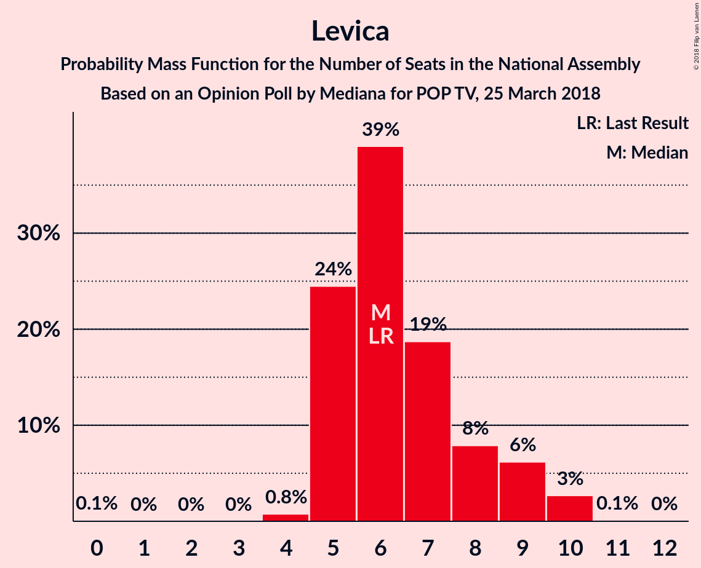

# Opinion Poll by Mediana for POP TV, 25 March 2018

<a href="#voting-intentions">Voting Intentions</a> | <a href="#seats">Seats</a> | <a href="#coalitions">Coalitions</a> | <a href="#technical-information">Technical Information</a>

## Voting Intentions

### Confidence Intervals

| Party | Last Result | Poll Result | 80% Confidence Interval | 90% Confidence Interval | 95% Confidence Interval | 99% Confidence Interval |
|:-----:|:-----------:|:-----------:|:-----------------------:|:-----------------------:|:-----------------------:|:-----------------------:|
| Lista Marjana Šarca | 0.0% | 25.6% | 23.0–28.4% |22.3–29.2% |21.7–29.9% |20.5–31.2% |
| Slovenska demokratska stranka | 20.7% | 18.9% | 16.7–21.5% |16.1–22.3% |15.5–22.9% |14.5–24.2% |
| Socialni demokrati | 6.0% | 15.5% | 13.5–17.9% |12.9–18.6% |12.4–19.2% |11.5–20.4% |
| Stranka modernega centra | 34.5% | 10.3% | 8.6–12.4% |8.2–13.0% |7.8–13.5% |7.0–14.5% |
| Levica | 6.0% | 7.3% | 5.9–9.1% |5.5–9.7% |5.2–10.1% |4.6–11.1% |
| Nova Slovenija–Krščanski demokrati | 5.6% | 6.6% | 5.3–8.4% |5.0–8.9% |4.6–9.4% |4.1–10.3% |
| Demokratična stranka upokojencev Slovenije | 10.2% | 5.7% | 4.5–7.4% |4.2–7.9% |3.9–8.3% |3.4–9.2% |
| Stranka Alenke Bratušek | 4.4% | 3.2% | 2.3–4.6% |2.1–5.0% |1.9–5.3% |1.6–6.0% |
| Slovenska nacionalna stranka | 2.2% | 2.3% | 1.6–3.5% |1.4–3.8% |1.2–4.2% |1.0–4.8% |
| Glas za otroke in družine–Nova ljudska stranka Slovenije | 0.0% | 1.8% | 1.2–3.0% |1.1–3.3% |0.9–3.6% |0.7–4.2% |
| Slovenska ljudska stranka | 4.0% | 1.1% | 0.7–2.1% |0.6–2.4% |0.5–2.7% |0.4–3.2% |
| Pozitivna Slovenija | 3.0% | 0.9% | 0.5–1.8% |0.4–2.1% |0.4–2.3% |0.2–2.9% |

*Note:* The poll result column reflects the actual value used in the calculations. Published results may vary slightly, and in addition be rounded to fewer digits.

## Seats

### Confidence Intervals

| Party | Last Result | Median | 80% Confidence Interval | 90% Confidence Interval | 95% Confidence Interval | 99% Confidence Interval |
|:-----:|:-----------:|:------:|:-----------------------:|:-----------------------:|:-----------------------:|:-----------------------:|
| <a href="#lista-marjana-Šarca">Lista Marjana Šarca</a> | 0 | 25 | 22–28 |21–29 |21–29 |20–31 |
| <a href="#slovenska-demokratska-stranka">Slovenska demokratska stranka</a> | 21 | 19 | 16–21 |15–22 |15–23 |14–24 |
| <a href="#socialni-demokrati">Socialni demokrati</a> | 6 | 15 | 13–17 |13–19 |12–19 |11–21 |
| <a href="#stranka-modernega-centra">Stranka modernega centra</a> | 36 | 9 | 8–11 |8–12 |7–13 |6–14 |
| <a href="#levica">Levica</a> | 6 | 7 | 5–9 |5–9 |5–9 |4–11 |
| <a href="#nova-slovenija–krščanski-demokrati">Nova Slovenija–Krščanski demokrati</a> | 5 | 6 | 5–8 |5–8 |4–9 |4–10 |
| <a href="#demokratična-stranka-upokojencev-slovenije">Demokratična stranka upokojencev Slovenije</a> | 10 | 6 | 4–7 |4–7 |0–8 |0–8 |
| <a href="#stranka-alenke-bratušek">Stranka Alenke Bratušek</a> | 4 | 0 | 0–4 |0–4 |0–5 |0–5 |
| <a href="#slovenska-nacionalna-stranka">Slovenska nacionalna stranka</a> | 0 | 0 | 0 |0 |0–4 |0–4 |
| <a href="#glas-za-otroke-in-družine–nova-ljudska-stranka-slovenije">Glas za otroke in družine–Nova ljudska stranka Slovenije</a> | 0 | 0 | 0 |0 |0 |0–4 |
| <a href="#slovenska-ljudska-stranka">Slovenska ljudska stranka</a> | 0 | 0 | 0 |0 |0 |0 |
| <a href="#pozitivna-slovenija">Pozitivna Slovenija</a> | 0 | 0 | 0 |0 |0 |0 |

### Lista Marjana Šarca

*For a full overview of the results for this party, see the [Lista Marjana Šarca](party-listamarjanaŠarca.html) page.*

| Number of Seats | Probability | Accumulated | Special Marks |
|:---------------:|:-----------:|:-----------:|:-------------:|
| 0 | 0% | 100% | Last Result |
| 1 | 0% | 100% |  |
| 2 | 0% | 100% |  |
| 3 | 0% | 100% |  |
| 4 | 0% | 100% |  |
| 5 | 0% | 100% |  |
| 6 | 0% | 100% |  |
| 7 | 0% | 100% |  |
| 8 | 0% | 100% |  |
| 9 | 0% | 100% |  |
| 10 | 0% | 100% |  |
| 11 | 0% | 100% |  |
| 12 | 0% | 100% |  |
| 13 | 0% | 100% |  |
| 14 | 0% | 100% |  |
| 15 | 0% | 100% |  |
| 16 | 0% | 100% |  |
| 17 | 0% | 100% |  |
| 18 | 0.1% | 100% |  |
| 19 | 0.3% | 99.9% |  |
| 20 | 0.7% | 99.7% |  |
| 21 | 5% | 99.0% |  |
| 22 | 9% | 94% |  |
| 23 | 9% | 86% |  |
| 24 | 13% | 77% |  |
| 25 | 15% | 63% | Median |
| 26 | 16% | 49% |  |
| 27 | 20% | 33% |  |
| 28 | 8% | 13% |  |
| 29 | 4% | 5% |  |
| 30 | 1.2% | 2% |  |
| 31 | 0.4% | 0.6% |  |
| 32 | 0.1% | 0.2% |  |
| 33 | 0% | 0% |  |

### Slovenska demokratska stranka

*For a full overview of the results for this party, see the [Slovenska demokratska stranka](party-slovenskademokratskastranka.html) page.*

| Number of Seats | Probability | Accumulated | Special Marks |
|:---------------:|:-----------:|:-----------:|:-------------:|
| 13 | 0.1% | 100% |  |
| 14 | 1.1% | 99.8% |  |
| 15 | 5% | 98.7% |  |
| 16 | 11% | 94% |  |
| 17 | 7% | 83% |  |
| 18 | 19% | 76% |  |
| 19 | 26% | 57% | Median |
| 20 | 18% | 30% |  |
| 21 | 5% | 13% | Last Result |
| 22 | 5% | 8% |  |
| 23 | 1.1% | 3% |  |
| 24 | 2% | 2% |  |
| 25 | 0.1% | 0.1% |  |
| 26 | 0% | 0% |  |

### Socialni demokrati

*For a full overview of the results for this party, see the [Socialni demokrati](party-socialnidemokrati.html) page.*

| Number of Seats | Probability | Accumulated | Special Marks |
|:---------------:|:-----------:|:-----------:|:-------------:|
| 6 | 0% | 100% | Last Result |
| 7 | 0% | 100% |  |
| 8 | 0% | 100% |  |
| 9 | 0% | 100% |  |
| 10 | 0.3% | 100% |  |
| 11 | 1.0% | 99.7% |  |
| 12 | 3% | 98.7% |  |
| 13 | 14% | 95% |  |
| 14 | 16% | 81% |  |
| 15 | 28% | 65% | Median |
| 16 | 19% | 37% |  |
| 17 | 9% | 18% |  |
| 18 | 3% | 10% |  |
| 19 | 4% | 6% |  |
| 20 | 1.3% | 2% |  |
| 21 | 0.6% | 0.6% |  |
| 22 | 0% | 0% |  |

### Stranka modernega centra

*For a full overview of the results for this party, see the [Stranka modernega centra](party-strankamodernegacentra.html) page.*

| Number of Seats | Probability | Accumulated | Special Marks |
|:---------------:|:-----------:|:-----------:|:-------------:|
| 6 | 0.5% | 100% |  |
| 7 | 4% | 99.5% |  |
| 8 | 17% | 95% |  |
| 9 | 32% | 79% | Median |
| 10 | 16% | 47% |  |
| 11 | 22% | 31% |  |
| 12 | 6% | 9% |  |
| 13 | 3% | 4% |  |
| 14 | 0.8% | 0.9% |  |
| 15 | 0.1% | 0.2% |  |
| 16 | 0% | 0% |  |
| 17 | 0% | 0% |  |
| 18 | 0% | 0% |  |
| 19 | 0% | 0% |  |
| 20 | 0% | 0% |  |
| 21 | 0% | 0% |  |
| 22 | 0% | 0% |  |
| 23 | 0% | 0% |  |
| 24 | 0% | 0% |  |
| 25 | 0% | 0% |  |
| 26 | 0% | 0% |  |
| 27 | 0% | 0% |  |
| 28 | 0% | 0% |  |
| 29 | 0% | 0% |  |
| 30 | 0% | 0% |  |
| 31 | 0% | 0% |  |
| 32 | 0% | 0% |  |
| 33 | 0% | 0% |  |
| 34 | 0% | 0% |  |
| 35 | 0% | 0% |  |
| 36 | 0% | 0% | Last Result |

### Levica

*For a full overview of the results for this party, see the [Levica](party-levica.html) page.*

| Number of Seats | Probability | Accumulated | Special Marks |
|:---------------:|:-----------:|:-----------:|:-------------:|
| 0 | 0.1% | 100% |  |
| 1 | 0% | 99.9% |  |
| 2 | 0% | 99.9% |  |
| 3 | 0% | 99.9% |  |
| 4 | 1.1% | 99.9% |  |
| 5 | 20% | 98.8% |  |
| 6 | 21% | 79% | Last Result |
| 7 | 23% | 58% | Median |
| 8 | 22% | 35% |  |
| 9 | 11% | 13% |  |
| 10 | 1.4% | 2% |  |
| 11 | 0.5% | 0.5% |  |
| 12 | 0% | 0.1% |  |
| 13 | 0% | 0% |  |

### Nova Slovenija–Krščanski demokrati

*For a full overview of the results for this party, see the [Nova Slovenija–Krščanski demokrati](party-novaslovenija–krščanskidemokrati.html) page.*

| Number of Seats | Probability | Accumulated | Special Marks |
|:---------------:|:-----------:|:-----------:|:-------------:|
| 0 | 0.3% | 100% |  |
| 1 | 0% | 99.7% |  |
| 2 | 0% | 99.7% |  |
| 3 | 0% | 99.7% |  |
| 4 | 4% | 99.6% |  |
| 5 | 24% | 96% | Last Result |
| 6 | 39% | 72% | Median |
| 7 | 22% | 33% |  |
| 8 | 8% | 11% |  |
| 9 | 2% | 3% |  |
| 10 | 0.5% | 0.7% |  |
| 11 | 0.2% | 0.2% |  |
| 12 | 0% | 0% |  |

### Demokratična stranka upokojencev Slovenije

*For a full overview of the results for this party, see the [Demokratična stranka upokojencev Slovenije](party-demokratičnastrankaupokojencevslovenije.html) page.*

| Number of Seats | Probability | Accumulated | Special Marks |
|:---------------:|:-----------:|:-----------:|:-------------:|
| 0 | 3% | 100% |  |
| 1 | 0% | 97% |  |
| 2 | 0% | 97% |  |
| 3 | 0% | 97% |  |
| 4 | 15% | 97% |  |
| 5 | 30% | 82% |  |
| 6 | 32% | 52% | Median |
| 7 | 15% | 20% |  |
| 8 | 4% | 4% |  |
| 9 | 0.4% | 0.5% |  |
| 10 | 0.1% | 0.1% | Last Result |
| 11 | 0% | 0% |  |

### Stranka Alenke Bratušek

*For a full overview of the results for this party, see the [Stranka Alenke Bratušek](party-strankaalenkebratušek.html) page.*

| Number of Seats | Probability | Accumulated | Special Marks |
|:---------------:|:-----------:|:-----------:|:-------------:|
| 0 | 83% | 100% | Median |
| 1 | 0% | 17% |  |
| 2 | 0% | 17% |  |
| 3 | 0.2% | 17% |  |
| 4 | 14% | 17% | Last Result |
| 5 | 2% | 3% |  |
| 6 | 0.4% | 0.4% |  |
| 7 | 0% | 0% |  |

### Slovenska nacionalna stranka

*For a full overview of the results for this party, see the [Slovenska nacionalna stranka](party-slovenskanacionalnastranka.html) page.*

| Number of Seats | Probability | Accumulated | Special Marks |
|:---------------:|:-----------:|:-----------:|:-------------:|
| 0 | 97% | 100% | Last Result, Median |
| 1 | 0% | 3% |  |
| 2 | 0% | 3% |  |
| 3 | 0.1% | 3% |  |
| 4 | 3% | 3% |  |
| 5 | 0.2% | 0.2% |  |
| 6 | 0% | 0% |  |

### Glas za otroke in družine–Nova ljudska stranka Slovenije

*For a full overview of the results for this party, see the [Glas za otroke in družine–Nova ljudska stranka Slovenije](party-glaszaotrokeindružine–novaljudskastrankaslovenije.html) page.*

| Number of Seats | Probability | Accumulated | Special Marks |
|:---------------:|:-----------:|:-----------:|:-------------:|
| 0 | 99.4% | 100% | Last Result, Median |
| 1 | 0% | 0.6% |  |
| 2 | 0% | 0.6% |  |
| 3 | 0% | 0.6% |  |
| 4 | 0.5% | 0.6% |  |
| 5 | 0% | 0% |  |

### Slovenska ljudska stranka

*For a full overview of the results for this party, see the [Slovenska ljudska stranka](party-slovenskaljudskastranka.html) page.*

| Number of Seats | Probability | Accumulated | Special Marks |
|:---------------:|:-----------:|:-----------:|:-------------:|
| 0 | 100% | 100% | Last Result, Median |

### Pozitivna Slovenija

*For a full overview of the results for this party, see the [Pozitivna Slovenija](party-pozitivnaslovenija.html) page.*

| Number of Seats | Probability | Accumulated | Special Marks |
|:---------------:|:-----------:|:-----------:|:-------------:|
| 0 | 100% | 100% | Last Result, Median |

## Coalitions

### Confidence Intervals

| Coalition | Last Result | Median | Majority? | 80% Confidence Interval | 90% Confidence Interval | 95% Confidence Interval | 99% Confidence Interval |
|:---------:|:-----------:|:------:|:---------:|:-----------------------:|:-----------------------:|:-----------------------:|:-----------------------:|
| Lista Marjana Šarca – Socialni demokrati – Stranka modernega centra | 42 | 50 | 97% | 47–53 | 46–54 | 45–55 | 43–57 |
| Lista Marjana Šarca – Slovenska demokratska stranka – Demokratična stranka upokojencev Slovenije | 31 | 50 | 90% | 46–53 | 45–54 | 44–55 | 42–55 |
| Lista Marjana Šarca – Socialni demokrati – Nova Slovenija–Krščanski demokrati | 11 | 47 | 67% | 43–49 | 42–50 | 41–51 | 40–53 |
| Lista Marjana Šarca – Socialni demokrati – Demokratična stranka upokojencev Slovenije | 16 | 46 | 57% | 43–49 | 41–50 | 40–50 | 39–52 |
| Lista Marjana Šarca – Slovenska demokratska stranka | 21 | 44 | 33% | 40–47 | 40–48 | 39–49 | 37–50 |
| Lista Marjana Šarca – Socialni demokrati | 6 | 41 | 2% | 37–43 | 36–44 | 36–45 | 34–47 |
| Socialni demokrati – Stranka modernega centra – Demokratična stranka upokojencev Slovenije | 52 | 30 | 0% | 27–33 | 26–35 | 26–36 | 24–37 |
| Socialni demokrati – Stranka modernega centra – Pozitivna Slovenija | 42 | 25 | 0% | 22–28 | 21–29 | 21–30 | 20–31 |

### Lista Marjana Šarca – Socialni demokrati – Stranka modernega centra

| Number of Seats | Probability | Accumulated | Special Marks |
|:---------------:|:-----------:|:-----------:|:-------------:|
| 42 | 0.1% | 100% | Last Result |
| 43 | 0.4% | 99.9% |  |
| 44 | 0.7% | 99.5% |  |
| 45 | 2% | 98.7% |  |
| 46 | 6% | 97% | Majority |
| 47 | 4% | 91% |  |
| 48 | 15% | 87% |  |
| 49 | 13% | 72% | Median |
| 50 | 15% | 59% |  |
| 51 | 15% | 44% |  |
| 52 | 18% | 29% |  |
| 53 | 4% | 11% |  |
| 54 | 3% | 7% |  |
| 55 | 2% | 4% |  |
| 56 | 1.3% | 2% |  |
| 57 | 0.3% | 0.6% |  |
| 58 | 0.2% | 0.3% |  |
| 59 | 0.1% | 0.1% |  |
| 60 | 0% | 0% |  |

### Lista Marjana Šarca – Slovenska demokratska stranka – Demokratična stranka upokojencev Slovenije

| Number of Seats | Probability | Accumulated | Special Marks |
|:---------------:|:-----------:|:-----------:|:-------------:|
| 31 | 0% | 100% | Last Result |
| 32 | 0% | 100% |  |
| 33 | 0% | 100% |  |
| 34 | 0% | 100% |  |
| 35 | 0% | 100% |  |
| 36 | 0% | 100% |  |
| 37 | 0% | 100% |  |
| 38 | 0% | 100% |  |
| 39 | 0% | 100% |  |
| 40 | 0.1% | 100% |  |
| 41 | 0.2% | 99.9% |  |
| 42 | 0.4% | 99.7% |  |
| 43 | 1.0% | 99.3% |  |
| 44 | 3% | 98% |  |
| 45 | 6% | 96% |  |
| 46 | 11% | 90% | Majority |
| 47 | 7% | 79% |  |
| 48 | 7% | 72% |  |
| 49 | 13% | 65% |  |
| 50 | 14% | 52% | Median |
| 51 | 14% | 38% |  |
| 52 | 13% | 24% |  |
| 53 | 5% | 11% |  |
| 54 | 1.3% | 6% |  |
| 55 | 4% | 5% |  |
| 56 | 0.2% | 0.2% |  |
| 57 | 0.1% | 0.1% |  |
| 58 | 0% | 0% |  |

### Lista Marjana Šarca – Socialni demokrati – Nova Slovenija–Krščanski demokrati

| Number of Seats | Probability | Accumulated | Special Marks |
|:---------------:|:-----------:|:-----------:|:-------------:|
| 11 | 0% | 100% | Last Result |
| 12 | 0% | 100% |  |
| 13 | 0% | 100% |  |
| 14 | 0% | 100% |  |
| 15 | 0% | 100% |  |
| 16 | 0% | 100% |  |
| 17 | 0% | 100% |  |
| 18 | 0% | 100% |  |
| 19 | 0% | 100% |  |
| 20 | 0% | 100% |  |
| 21 | 0% | 100% |  |
| 22 | 0% | 100% |  |
| 23 | 0% | 100% |  |
| 24 | 0% | 100% |  |
| 25 | 0% | 100% |  |
| 26 | 0% | 100% |  |
| 27 | 0% | 100% |  |
| 28 | 0% | 100% |  |
| 29 | 0% | 100% |  |
| 30 | 0% | 100% |  |
| 31 | 0% | 100% |  |
| 32 | 0% | 100% |  |
| 33 | 0% | 100% |  |
| 34 | 0% | 100% |  |
| 35 | 0% | 100% |  |
| 36 | 0% | 100% |  |
| 37 | 0% | 100% |  |
| 38 | 0.1% | 100% |  |
| 39 | 0.2% | 99.9% |  |
| 40 | 0.6% | 99.7% |  |
| 41 | 2% | 99.1% |  |
| 42 | 4% | 97% |  |
| 43 | 8% | 93% |  |
| 44 | 6% | 86% |  |
| 45 | 12% | 79% |  |
| 46 | 14% | 67% | Median, Majority |
| 47 | 17% | 53% |  |
| 48 | 14% | 36% |  |
| 49 | 14% | 23% |  |
| 50 | 5% | 8% |  |
| 51 | 2% | 4% |  |
| 52 | 0.9% | 2% |  |
| 53 | 1.0% | 1.3% |  |
| 54 | 0.2% | 0.3% |  |
| 55 | 0% | 0% |  |

### Lista Marjana Šarca – Socialni demokrati – Demokratična stranka upokojencev Slovenije

| Number of Seats | Probability | Accumulated | Special Marks |
|:---------------:|:-----------:|:-----------:|:-------------:|
| 16 | 0% | 100% | Last Result |
| 17 | 0% | 100% |  |
| 18 | 0% | 100% |  |
| 19 | 0% | 100% |  |
| 20 | 0% | 100% |  |
| 21 | 0% | 100% |  |
| 22 | 0% | 100% |  |
| 23 | 0% | 100% |  |
| 24 | 0% | 100% |  |
| 25 | 0% | 100% |  |
| 26 | 0% | 100% |  |
| 27 | 0% | 100% |  |
| 28 | 0% | 100% |  |
| 29 | 0% | 100% |  |
| 30 | 0% | 100% |  |
| 31 | 0% | 100% |  |
| 32 | 0% | 100% |  |
| 33 | 0% | 100% |  |
| 34 | 0% | 100% |  |
| 35 | 0% | 100% |  |
| 36 | 0% | 100% |  |
| 37 | 0.1% | 100% |  |
| 38 | 0.2% | 99.8% |  |
| 39 | 0.6% | 99.7% |  |
| 40 | 2% | 99.1% |  |
| 41 | 4% | 97% |  |
| 42 | 3% | 94% |  |
| 43 | 9% | 91% |  |
| 44 | 11% | 81% |  |
| 45 | 14% | 71% |  |
| 46 | 14% | 57% | Median, Majority |
| 47 | 19% | 42% |  |
| 48 | 6% | 24% |  |
| 49 | 10% | 18% |  |
| 50 | 5% | 7% |  |
| 51 | 1.1% | 2% |  |
| 52 | 0.8% | 0.9% |  |
| 53 | 0.1% | 0.1% |  |
| 54 | 0% | 0% |  |

### Lista Marjana Šarca – Slovenska demokratska stranka

| Number of Seats | Probability | Accumulated | Special Marks |
|:---------------:|:-----------:|:-----------:|:-------------:|
| 21 | 0% | 100% | Last Result |
| 22 | 0% | 100% |  |
| 23 | 0% | 100% |  |
| 24 | 0% | 100% |  |
| 25 | 0% | 100% |  |
| 26 | 0% | 100% |  |
| 27 | 0% | 100% |  |
| 28 | 0% | 100% |  |
| 29 | 0% | 100% |  |
| 30 | 0% | 100% |  |
| 31 | 0% | 100% |  |
| 32 | 0% | 100% |  |
| 33 | 0% | 100% |  |
| 34 | 0% | 100% |  |
| 35 | 0% | 100% |  |
| 36 | 0.1% | 99.9% |  |
| 37 | 0.5% | 99.8% |  |
| 38 | 1.4% | 99.3% |  |
| 39 | 2% | 98% |  |
| 40 | 9% | 95% |  |
| 41 | 9% | 87% |  |
| 42 | 11% | 77% |  |
| 43 | 13% | 67% |  |
| 44 | 6% | 54% | Median |
| 45 | 15% | 48% |  |
| 46 | 18% | 33% | Majority |
| 47 | 6% | 15% |  |
| 48 | 5% | 9% |  |
| 49 | 3% | 4% |  |
| 50 | 0.4% | 0.7% |  |
| 51 | 0.1% | 0.2% |  |
| 52 | 0.1% | 0.2% |  |
| 53 | 0% | 0% |  |

### Lista Marjana Šarca – Socialni demokrati

| Number of Seats | Probability | Accumulated | Special Marks |
|:---------------:|:-----------:|:-----------:|:-------------:|
| 6 | 0% | 100% | Last Result |
| 7 | 0% | 100% |  |
| 8 | 0% | 100% |  |
| 9 | 0% | 100% |  |
| 10 | 0% | 100% |  |
| 11 | 0% | 100% |  |
| 12 | 0% | 100% |  |
| 13 | 0% | 100% |  |
| 14 | 0% | 100% |  |
| 15 | 0% | 100% |  |
| 16 | 0% | 100% |  |
| 17 | 0% | 100% |  |
| 18 | 0% | 100% |  |
| 19 | 0% | 100% |  |
| 20 | 0% | 100% |  |
| 21 | 0% | 100% |  |
| 22 | 0% | 100% |  |
| 23 | 0% | 100% |  |
| 24 | 0% | 100% |  |
| 25 | 0% | 100% |  |
| 26 | 0% | 100% |  |
| 27 | 0% | 100% |  |
| 28 | 0% | 100% |  |
| 29 | 0% | 100% |  |
| 30 | 0% | 100% |  |
| 31 | 0% | 100% |  |
| 32 | 0% | 100% |  |
| 33 | 0.2% | 99.9% |  |
| 34 | 0.4% | 99.7% |  |
| 35 | 2% | 99.3% |  |
| 36 | 4% | 98% |  |
| 37 | 11% | 94% |  |
| 38 | 6% | 82% |  |
| 39 | 10% | 76% |  |
| 40 | 13% | 66% | Median |
| 41 | 19% | 52% |  |
| 42 | 12% | 34% |  |
| 43 | 16% | 22% |  |
| 44 | 2% | 6% |  |
| 45 | 2% | 4% |  |
| 46 | 1.0% | 2% | Majority |
| 47 | 0.8% | 1.1% |  |
| 48 | 0.2% | 0.2% |  |
| 49 | 0% | 0% |  |

### Socialni demokrati – Stranka modernega centra – Demokratična stranka upokojencev Slovenije

| Number of Seats | Probability | Accumulated | Special Marks |
|:---------------:|:-----------:|:-----------:|:-------------:|
| 21 | 0% | 100% |  |
| 22 | 0.1% | 99.9% |  |
| 23 | 0.2% | 99.9% |  |
| 24 | 0.7% | 99.7% |  |
| 25 | 0.9% | 99.0% |  |
| 26 | 6% | 98% |  |
| 27 | 6% | 93% |  |
| 28 | 8% | 86% |  |
| 29 | 16% | 78% |  |
| 30 | 15% | 62% | Median |
| 31 | 20% | 47% |  |
| 32 | 10% | 28% |  |
| 33 | 9% | 18% |  |
| 34 | 4% | 9% |  |
| 35 | 1.3% | 5% |  |
| 36 | 3% | 4% |  |
| 37 | 0.6% | 0.6% |  |
| 38 | 0.1% | 0.1% |  |
| 39 | 0% | 0% |  |
| 40 | 0% | 0% |  |
| 41 | 0% | 0% |  |
| 42 | 0% | 0% |  |
| 43 | 0% | 0% |  |
| 44 | 0% | 0% |  |
| 45 | 0% | 0% |  |
| 46 | 0% | 0% | Majority |
| 47 | 0% | 0% |  |
| 48 | 0% | 0% |  |
| 49 | 0% | 0% |  |
| 50 | 0% | 0% |  |
| 51 | 0% | 0% |  |
| 52 | 0% | 0% | Last Result |

### Socialni demokrati – Stranka modernega centra – Pozitivna Slovenija

| Number of Seats | Probability | Accumulated | Special Marks |
|:---------------:|:-----------:|:-----------:|:-------------:|
| 18 | 0% | 100% |  |
| 19 | 0.3% | 99.9% |  |
| 20 | 0.8% | 99.6% |  |
| 21 | 4% | 98.8% |  |
| 22 | 10% | 95% |  |
| 23 | 10% | 85% |  |
| 24 | 21% | 74% | Median |
| 25 | 26% | 54% |  |
| 26 | 8% | 28% |  |
| 27 | 6% | 20% |  |
| 28 | 6% | 13% |  |
| 29 | 3% | 8% |  |
| 30 | 3% | 4% |  |
| 31 | 0.6% | 1.0% |  |
| 32 | 0.4% | 0.4% |  |
| 33 | 0% | 0% |  |
| 34 | 0% | 0% |  |
| 35 | 0% | 0% |  |
| 36 | 0% | 0% |  |
| 37 | 0% | 0% |  |
| 38 | 0% | 0% |  |
| 39 | 0% | 0% |  |
| 40 | 0% | 0% |  |
| 41 | 0% | 0% |  |
| 42 | 0% | 0% | Last Result |

## Technical Information

### Opinion Poll

+ **Polling firm:** Mediana
+ **Commissioner(s):** POP TV
+ **Fieldwork period:** 25 March 2018

### Calculations

+ **Sample size:** 438
+ **Simulations done:** 8,388,608
+ **Error estimate:** 3.12%

