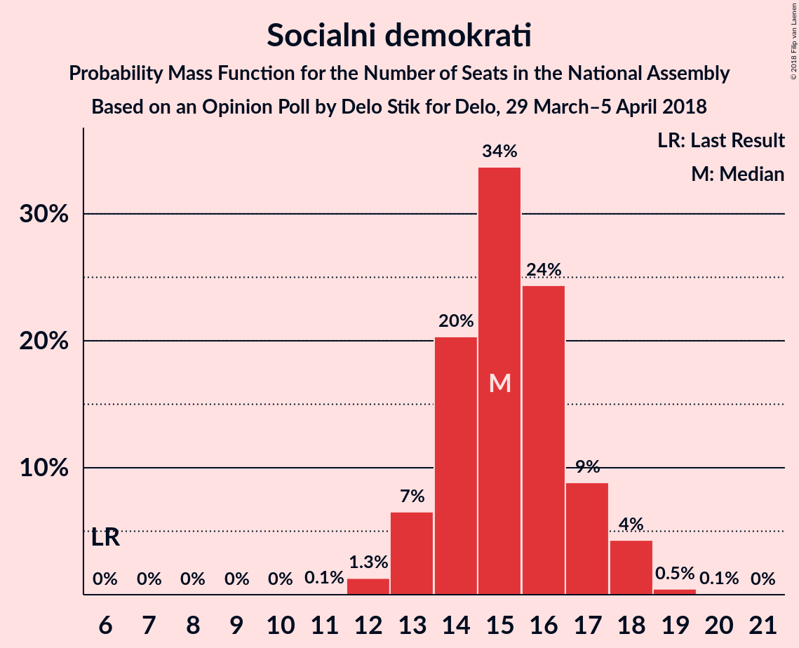
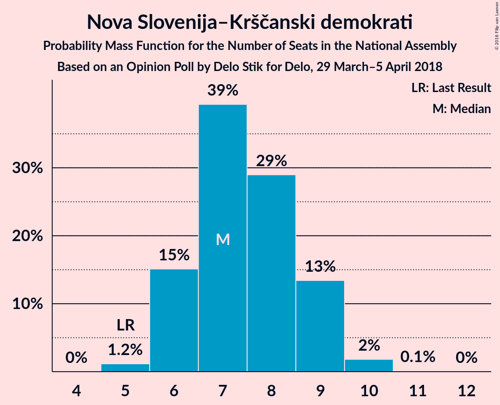

# Opinion Poll by Delo Stik for Delo, 29 March–5 April 2018

<a href="#voting-intentions">Voting Intentions</a> | <a href="#seats">Seats</a> | <a href="#coalitions">Coalitions</a> | <a href="#technical-information">Technical Information</a>

## Voting Intentions

### Confidence Intervals

| Party | Last Result | Poll Result | 80% Confidence Interval | 90% Confidence Interval | 95% Confidence Interval | 99% Confidence Interval |
|:-----:|:-----------:|:-----------:|:-----------------------:|:-----------------------:|:-----------------------:|:-----------------------:|
| Lista Marjana Šarca | 0.0% | 20.8% | 19.1–22.7% |18.6–23.2% |18.1–23.7% |17.3–24.6% |
| Slovenska demokratska stranka | 20.7% | 17.5% | 15.9–19.3% |15.5–19.8% |15.1–20.3% |14.3–21.1% |
| Socialni demokrati | 6.0% | 16.5% | 15.0–18.3% |14.5–18.8% |14.2–19.2% |13.4–20.1% |
| Stranka modernega centra | 34.5% | 11.6% | 10.3–13.1% |9.9–13.6% |9.6–14.0% |9.0–14.7% |
| Nova Slovenija–Krščanski demokrati | 5.6% | 8.3% | 7.2–9.7% |6.9–10.1% |6.6–10.4% |6.1–11.1% |
| Levica | 6.0% | 6.8% | 5.8–8.0% |5.5–8.4% |5.2–8.7% |4.8–9.3% |
| Demokratična stranka upokojencev Slovenije | 10.2% | 4.5% | 3.7–5.5% |3.4–5.8% |3.3–6.1% |2.9–6.7% |
| Stranka Alenke Bratušek | 4.4% | 3.6% | 2.9–4.6% |2.7–4.9% |2.5–5.1% |2.2–5.6% |

*Note:* The poll result column reflects the actual value used in the calculations. Published results may vary slightly, and in addition be rounded to fewer digits.

## Seats

### Confidence Intervals

| Party | Last Result | Median | 80% Confidence Interval | 90% Confidence Interval | 95% Confidence Interval | 99% Confidence Interval |
|:-----:|:-----------:|:------:|:-----------------------:|:-----------------------:|:-----------------------:|:-----------------------:|
| <a href="#lista-marjana-šarca">Lista Marjana Šarca</a> | 0 | 19 | 18–21 |17–21 |17–22 |16–23 |
| <a href="#slovenska-demokratska-stranka">Slovenska demokratska stranka</a> | 21 | 16 | 15–18 |14–18 |13–19 |13–20 |
| <a href="#socialni-demokrati">Socialni demokrati</a> | 6 | 15 | 13–17 |13–18 |13–18 |12–18 |
| <a href="#stranka-modernega-centra">Stranka modernega centra</a> | 36 | 11 | 9–12 |9–13 |9–13 |8–14 |
| <a href="#nova-slovenija–krščanski-demokrati">Nova Slovenija–Krščanski demokrati</a> | 5 | 8 | 6–9 |6–9 |6–9 |5–10 |
| <a href="#levica">Levica</a> | 6 | 6 | 5–7 |5–7 |4–8 |4–8 |
| <a href="#demokratična-stranka-upokojencev-slovenije">Demokratična stranka upokojencev Slovenije</a> | 10 | 4 | 0–5 |0–5 |0–5 |0–6 |
| <a href="#stranka-alenke-bratušek">Stranka Alenke Bratušek</a> | 4 | 0 | 0–4 |0–4 |0–4 |0–5 |

### Lista Marjana Šarca

*For a full overview of the results for this party, see the [Lista Marjana Šarca](party-listamarjanašarca.html) page.*

| Number of Seats | Probability | Accumulated | Special Marks |
|:---------------:|:-----------:|:-----------:|:-------------:|
| 0 | 0% | 100% | Last Result |
| 1 | 0% | 100% |  |
| 2 | 0% | 100% |  |
| 3 | 0% | 100% |  |
| 4 | 0% | 100% |  |
| 5 | 0% | 100% |  |
| 6 | 0% | 100% |  |
| 7 | 0% | 100% |  |
| 8 | 0% | 100% |  |
| 9 | 0% | 100% |  |
| 10 | 0% | 100% |  |
| 11 | 0% | 100% |  |
| 12 | 0% | 100% |  |
| 13 | 0% | 100% |  |
| 14 | 0% | 100% |  |
| 15 | 0.2% | 100% |  |
| 16 | 2% | 99.8% |  |
| 17 | 5% | 98% |  |
| 18 | 17% | 93% |  |
| 19 | 31% | 76% | Median |
| 20 | 15% | 45% |  |
| 21 | 27% | 30% |  |
| 22 | 2% | 3% |  |
| 23 | 1.1% | 1.2% |  |
| 24 | 0.1% | 0.1% |  |
| 25 | 0% | 0% |  |

### Slovenska demokratska stranka

*For a full overview of the results for this party, see the [Slovenska demokratska stranka](party-slovenskademokratskastranka.html) page.*

| Number of Seats | Probability | Accumulated | Special Marks |
|:---------------:|:-----------:|:-----------:|:-------------:|
| 12 | 0.2% | 100% |  |
| 13 | 3% | 99.8% |  |
| 14 | 4% | 97% |  |
| 15 | 16% | 93% |  |
| 16 | 44% | 77% | Median |
| 17 | 22% | 33% |  |
| 18 | 7% | 10% |  |
| 19 | 3% | 4% |  |
| 20 | 0.2% | 0.6% |  |
| 21 | 0.4% | 0.4% | Last Result |
| 22 | 0% | 0% |  |

### Socialni demokrati

*For a full overview of the results for this party, see the [Socialni demokrati](party-socialnidemokrati.html) page.*

| Number of Seats | Probability | Accumulated | Special Marks |
|:---------------:|:-----------:|:-----------:|:-------------:|
| 6 | 0% | 100% | Last Result |
| 7 | 0% | 100% |  |
| 8 | 0% | 100% |  |
| 9 | 0% | 100% |  |
| 10 | 0% | 100% |  |
| 11 | 0.1% | 100% |  |
| 12 | 0.7% | 99.9% |  |
| 13 | 11% | 99.2% |  |
| 14 | 20% | 89% |  |
| 15 | 32% | 69% | Median |
| 16 | 24% | 37% |  |
| 17 | 7% | 12% |  |
| 18 | 5% | 5% |  |
| 19 | 0.3% | 0.3% |  |
| 20 | 0% | 0% |  |

### Stranka modernega centra

*For a full overview of the results for this party, see the [Stranka modernega centra](party-strankamodernegacentra.html) page.*

| Number of Seats | Probability | Accumulated | Special Marks |
|:---------------:|:-----------:|:-----------:|:-------------:|
| 7 | 0.1% | 100% |  |
| 8 | 2% | 99.9% |  |
| 9 | 12% | 98% |  |
| 10 | 35% | 86% |  |
| 11 | 26% | 51% | Median |
| 12 | 19% | 25% |  |
| 13 | 6% | 6% |  |
| 14 | 0.5% | 0.6% |  |
| 15 | 0% | 0% |  |
| 16 | 0% | 0% |  |
| 17 | 0% | 0% |  |
| 18 | 0% | 0% |  |
| 19 | 0% | 0% |  |
| 20 | 0% | 0% |  |
| 21 | 0% | 0% |  |
| 22 | 0% | 0% |  |
| 23 | 0% | 0% |  |
| 24 | 0% | 0% |  |
| 25 | 0% | 0% |  |
| 26 | 0% | 0% |  |
| 27 | 0% | 0% |  |
| 28 | 0% | 0% |  |
| 29 | 0% | 0% |  |
| 30 | 0% | 0% |  |
| 31 | 0% | 0% |  |
| 32 | 0% | 0% |  |
| 33 | 0% | 0% |  |
| 34 | 0% | 0% |  |
| 35 | 0% | 0% |  |
| 36 | 0% | 0% | Last Result |

### Nova Slovenija–Krščanski demokrati

*For a full overview of the results for this party, see the [Nova Slovenija–Krščanski demokrati](party-novaslovenija–krščanskidemokrati.html) page.*

| Number of Seats | Probability | Accumulated | Special Marks |
|:---------------:|:-----------:|:-----------:|:-------------:|
| 5 | 0.5% | 100% | Last Result |
| 6 | 19% | 99.5% |  |
| 7 | 23% | 80% |  |
| 8 | 31% | 57% | Median |
| 9 | 25% | 27% |  |
| 10 | 2% | 2% |  |
| 11 | 0.1% | 0.1% |  |
| 12 | 0% | 0% |  |

### Levica

*For a full overview of the results for this party, see the [Levica](party-levica.html) page.*

| Number of Seats | Probability | Accumulated | Special Marks |
|:---------------:|:-----------:|:-----------:|:-------------:|
| 3 | 0.1% | 100% |  |
| 4 | 3% | 99.9% |  |
| 5 | 14% | 97% |  |
| 6 | 58% | 83% | Last Result, Median |
| 7 | 22% | 25% |  |
| 8 | 3% | 3% |  |
| 9 | 0.3% | 0.3% |  |
| 10 | 0% | 0% |  |

### Demokratična stranka upokojencev Slovenije

*For a full overview of the results for this party, see the [Demokratična stranka upokojencev Slovenije](party-demokratičnastrankaupokojencevslovenije.html) page.*

| Number of Seats | Probability | Accumulated | Special Marks |
|:---------------:|:-----------:|:-----------:|:-------------:|
| 0 | 33% | 100% |  |
| 1 | 0% | 67% |  |
| 2 | 0% | 67% |  |
| 3 | 6% | 67% |  |
| 4 | 49% | 61% | Median |
| 5 | 11% | 12% |  |
| 6 | 1.2% | 1.3% |  |
| 7 | 0% | 0% |  |
| 8 | 0% | 0% |  |
| 9 | 0% | 0% |  |
| 10 | 0% | 0% | Last Result |

### Stranka Alenke Bratušek

*For a full overview of the results for this party, see the [Stranka Alenke Bratušek](party-strankaalenkebratušek.html) page.*

| Number of Seats | Probability | Accumulated | Special Marks |
|:---------------:|:-----------:|:-----------:|:-------------:|
| 0 | 85% | 100% | Median |
| 1 | 0% | 15% |  |
| 2 | 0% | 15% |  |
| 3 | 3% | 15% |  |
| 4 | 11% | 12% | Last Result |
| 5 | 0.7% | 0.7% |  |
| 6 | 0% | 0% |  |

## Coalitions

### Confidence Intervals

| Coalition | Last Result | Median | Majority? | 80% Confidence Interval | 90% Confidence Interval | 95% Confidence Interval | 99% Confidence Interval |
|:---------:|:-----------:|:------:|:---------:|:-----------------------:|:-----------------------:|:-----------------------:|:-----------------------:|
| Lista Marjana Šarca – Socialni demokrati – Stranka modernega centra – Nova Slovenija–Krščanski demokrati – Demokratična stranka upokojencev Slovenije | 57 | 56 | 100% | 54–57 | 53–58 | 51–59 | 50–60 |
| Lista Marjana Šarca – Socialni demokrati – Stranka modernega centra – Nova Slovenija–Krščanski demokrati | 47 | 53 | 99.9% | 50–56 | 49–57 | 49–57 | 47–58 |
| Lista Marjana Šarca – Socialni demokrati – Stranka modernega centra – Demokratična stranka upokojencev Slovenije – Stranka Alenke Bratušek | 56 | 48 | 98% | 47–51 | 46–52 | 46–53 | 44–54 |
| Lista Marjana Šarca – Socialni demokrati – Stranka modernega centra – Demokratična stranka upokojencev Slovenije | 52 | 48 | 93% | 46–50 | 45–51 | 44–51 | 43–53 |
| Lista Marjana Šarca – Socialni demokrati – Stranka modernega centra | 42 | 45 | 44% | 43–48 | 42–49 | 41–49 | 40–51 |
| Lista Marjana Šarca – Socialni demokrati – Nova Slovenija–Krščanski demokrati – Demokratična stranka upokojencev Slovenije | 21 | 45 | 34% | 43–47 | 42–47 | 41–48 | 40–49 |
| Lista Marjana Šarca – Socialni demokrati – Nova Slovenija–Krščanski demokrati | 11 | 42 | 3% | 39–45 | 39–45 | 38–46 | 37–47 |
| Lista Marjana Šarca – Slovenska demokratska stranka – Demokratična stranka upokojencev Slovenije | 31 | 38 | 0% | 36–41 | 35–42 | 34–42 | 33–43 |
| Lista Marjana Šarca – Socialni demokrati – Demokratična stranka upokojencev Slovenije | 16 | 37 | 0% | 35–39 | 34–41 | 33–41 | 32–42 |
| Lista Marjana Šarca – Slovenska demokratska stranka | 21 | 36 | 0% | 34–38 | 32–38 | 32–38 | 31–39 |
| Lista Marjana Šarca – Socialni demokrati | 6 | 34 | 0% | 32–37 | 32–37 | 31–38 | 30–40 |
| Socialni demokrati – Stranka modernega centra – Demokratična stranka upokojencev Slovenije | 52 | 29 | 0% | 26–30 | 26–31 | 24–32 | 22–34 |

### Lista Marjana Šarca – Socialni demokrati – Stranka modernega centra – Nova Slovenija–Krščanski demokrati – Demokratična stranka upokojencev Slovenije

| Number of Seats | Probability | Accumulated | Special Marks |
|:---------------:|:-----------:|:-----------:|:-------------:|
| 49 | 0.2% | 100% |  |
| 50 | 0.3% | 99.8% |  |
| 51 | 2% | 99.5% |  |
| 52 | 1.3% | 97% |  |
| 53 | 5% | 96% |  |
| 54 | 12% | 91% |  |
| 55 | 20% | 79% |  |
| 56 | 26% | 59% |  |
| 57 | 23% | 32% | Last Result, Median |
| 58 | 6% | 9% |  |
| 59 | 3% | 4% |  |
| 60 | 0.8% | 1.0% |  |
| 61 | 0.2% | 0.2% |  |
| 62 | 0% | 0% |  |

### Lista Marjana Šarca – Socialni demokrati – Stranka modernega centra – Nova Slovenija–Krščanski demokrati

| Number of Seats | Probability | Accumulated | Special Marks |
|:---------------:|:-----------:|:-----------:|:-------------:|
| 45 | 0.1% | 100% |  |
| 46 | 0.1% | 99.9% | Majority |
| 47 | 0.9% | 99.8% | Last Result |
| 48 | 0.8% | 98.9% |  |
| 49 | 4% | 98% |  |
| 50 | 11% | 94% |  |
| 51 | 13% | 83% |  |
| 52 | 16% | 70% |  |
| 53 | 18% | 53% | Median |
| 54 | 8% | 36% |  |
| 55 | 7% | 28% |  |
| 56 | 12% | 21% |  |
| 57 | 8% | 9% |  |
| 58 | 0.4% | 0.8% |  |
| 59 | 0.4% | 0.4% |  |
| 60 | 0% | 0% |  |

### Lista Marjana Šarca – Socialni demokrati – Stranka modernega centra – Demokratična stranka upokojencev Slovenije – Stranka Alenke Bratušek

| Number of Seats | Probability | Accumulated | Special Marks |
|:---------------:|:-----------:|:-----------:|:-------------:|
| 43 | 0.1% | 100% |  |
| 44 | 0.6% | 99.9% |  |
| 45 | 1.3% | 99.2% |  |
| 46 | 7% | 98% | Majority |
| 47 | 21% | 91% |  |
| 48 | 27% | 70% |  |
| 49 | 14% | 42% | Median |
| 50 | 10% | 28% |  |
| 51 | 10% | 18% |  |
| 52 | 4% | 8% |  |
| 53 | 3% | 4% |  |
| 54 | 0.7% | 1.0% |  |
| 55 | 0.2% | 0.3% |  |
| 56 | 0% | 0% | Last Result |

### Lista Marjana Šarca – Socialni demokrati – Stranka modernega centra – Demokratična stranka upokojencev Slovenije

| Number of Seats | Probability | Accumulated | Special Marks |
|:---------------:|:-----------:|:-----------:|:-------------:|
| 41 | 0.1% | 100% |  |
| 42 | 0.2% | 99.9% |  |
| 43 | 0.9% | 99.7% |  |
| 44 | 2% | 98.8% |  |
| 45 | 4% | 97% |  |
| 46 | 8% | 93% | Majority |
| 47 | 22% | 85% |  |
| 48 | 27% | 63% |  |
| 49 | 16% | 35% | Median |
| 50 | 10% | 20% |  |
| 51 | 8% | 10% |  |
| 52 | 1.4% | 2% | Last Result |
| 53 | 0.5% | 0.5% |  |
| 54 | 0% | 0.1% |  |
| 55 | 0% | 0% |  |

### Lista Marjana Šarca – Socialni demokrati – Stranka modernega centra

| Number of Seats | Probability | Accumulated | Special Marks |
|:---------------:|:-----------:|:-----------:|:-------------:|
| 38 | 0.1% | 100% |  |
| 39 | 0.2% | 99.9% |  |
| 40 | 0.7% | 99.8% |  |
| 41 | 2% | 99.1% |  |
| 42 | 5% | 97% | Last Result |
| 43 | 14% | 92% |  |
| 44 | 21% | 78% |  |
| 45 | 12% | 56% | Median |
| 46 | 10% | 44% | Majority |
| 47 | 19% | 34% |  |
| 48 | 6% | 15% |  |
| 49 | 7% | 9% |  |
| 50 | 0.9% | 1.4% |  |
| 51 | 0.5% | 0.5% |  |
| 52 | 0% | 0.1% |  |
| 53 | 0% | 0% |  |

### Lista Marjana Šarca – Socialni demokrati – Nova Slovenija–Krščanski demokrati – Demokratična stranka upokojencev Slovenije

| Number of Seats | Probability | Accumulated | Special Marks |
|:---------------:|:-----------:|:-----------:|:-------------:|
| 21 | 0% | 100% | Last Result |
| 22 | 0% | 100% |  |
| 23 | 0% | 100% |  |
| 24 | 0% | 100% |  |
| 25 | 0% | 100% |  |
| 26 | 0% | 100% |  |
| 27 | 0% | 100% |  |
| 28 | 0% | 100% |  |
| 29 | 0% | 100% |  |
| 30 | 0% | 100% |  |
| 31 | 0% | 100% |  |
| 32 | 0% | 100% |  |
| 33 | 0% | 100% |  |
| 34 | 0% | 100% |  |
| 35 | 0% | 100% |  |
| 36 | 0% | 100% |  |
| 37 | 0% | 100% |  |
| 38 | 0% | 100% |  |
| 39 | 0.2% | 100% |  |
| 40 | 1.4% | 99.8% |  |
| 41 | 2% | 98% |  |
| 42 | 4% | 96% |  |
| 43 | 6% | 92% |  |
| 44 | 21% | 86% |  |
| 45 | 31% | 65% |  |
| 46 | 11% | 34% | Median, Majority |
| 47 | 18% | 23% |  |
| 48 | 3% | 5% |  |
| 49 | 1.1% | 2% |  |
| 50 | 0.3% | 0.4% |  |
| 51 | 0.1% | 0.1% |  |
| 52 | 0% | 0% |  |

### Lista Marjana Šarca – Socialni demokrati – Nova Slovenija–Krščanski demokrati

| Number of Seats | Probability | Accumulated | Special Marks |
|:---------------:|:-----------:|:-----------:|:-------------:|
| 11 | 0% | 100% | Last Result |
| 12 | 0% | 100% |  |
| 13 | 0% | 100% |  |
| 14 | 0% | 100% |  |
| 15 | 0% | 100% |  |
| 16 | 0% | 100% |  |
| 17 | 0% | 100% |  |
| 18 | 0% | 100% |  |
| 19 | 0% | 100% |  |
| 20 | 0% | 100% |  |
| 21 | 0% | 100% |  |
| 22 | 0% | 100% |  |
| 23 | 0% | 100% |  |
| 24 | 0% | 100% |  |
| 25 | 0% | 100% |  |
| 26 | 0% | 100% |  |
| 27 | 0% | 100% |  |
| 28 | 0% | 100% |  |
| 29 | 0% | 100% |  |
| 30 | 0% | 100% |  |
| 31 | 0% | 100% |  |
| 32 | 0% | 100% |  |
| 33 | 0% | 100% |  |
| 34 | 0% | 100% |  |
| 35 | 0% | 100% |  |
| 36 | 0.1% | 100% |  |
| 37 | 0.9% | 99.8% |  |
| 38 | 2% | 98.9% |  |
| 39 | 9% | 97% |  |
| 40 | 14% | 88% |  |
| 41 | 13% | 75% |  |
| 42 | 13% | 61% | Median |
| 43 | 18% | 48% |  |
| 44 | 9% | 30% |  |
| 45 | 19% | 21% |  |
| 46 | 1.1% | 3% | Majority |
| 47 | 1.0% | 1.5% |  |
| 48 | 0.4% | 0.5% |  |
| 49 | 0% | 0% |  |

### Lista Marjana Šarca – Slovenska demokratska stranka – Demokratična stranka upokojencev Slovenije

| Number of Seats | Probability | Accumulated | Special Marks |
|:---------------:|:-----------:|:-----------:|:-------------:|
| 31 | 0% | 100% | Last Result |
| 32 | 0.3% | 100% |  |
| 33 | 0.6% | 99.7% |  |
| 34 | 2% | 99.1% |  |
| 35 | 6% | 97% |  |
| 36 | 12% | 91% |  |
| 37 | 13% | 79% |  |
| 38 | 17% | 66% |  |
| 39 | 21% | 49% | Median |
| 40 | 11% | 28% |  |
| 41 | 7% | 17% |  |
| 42 | 8% | 9% |  |
| 43 | 1.5% | 2% |  |
| 44 | 0.2% | 0.2% |  |
| 45 | 0% | 0% |  |

### Lista Marjana Šarca – Socialni demokrati – Demokratična stranka upokojencev Slovenije

| Number of Seats | Probability | Accumulated | Special Marks |
|:---------------:|:-----------:|:-----------:|:-------------:|
| 16 | 0% | 100% | Last Result |
| 17 | 0% | 100% |  |
| 18 | 0% | 100% |  |
| 19 | 0% | 100% |  |
| 20 | 0% | 100% |  |
| 21 | 0% | 100% |  |
| 22 | 0% | 100% |  |
| 23 | 0% | 100% |  |
| 24 | 0% | 100% |  |
| 25 | 0% | 100% |  |
| 26 | 0% | 100% |  |
| 27 | 0% | 100% |  |
| 28 | 0% | 100% |  |
| 29 | 0% | 100% |  |
| 30 | 0% | 100% |  |
| 31 | 0.1% | 100% |  |
| 32 | 0.5% | 99.9% |  |
| 33 | 2% | 99.4% |  |
| 34 | 5% | 97% |  |
| 35 | 3% | 92% |  |
| 36 | 16% | 89% |  |
| 37 | 25% | 73% |  |
| 38 | 27% | 48% | Median |
| 39 | 12% | 20% |  |
| 40 | 3% | 8% |  |
| 41 | 4% | 6% |  |
| 42 | 1.2% | 1.4% |  |
| 43 | 0.2% | 0.2% |  |
| 44 | 0% | 0% |  |

### Lista Marjana Šarca – Slovenska demokratska stranka

| Number of Seats | Probability | Accumulated | Special Marks |
|:---------------:|:-----------:|:-----------:|:-------------:|
| 21 | 0% | 100% | Last Result |
| 22 | 0% | 100% |  |
| 23 | 0% | 100% |  |
| 24 | 0% | 100% |  |
| 25 | 0% | 100% |  |
| 26 | 0% | 100% |  |
| 27 | 0% | 100% |  |
| 28 | 0% | 100% |  |
| 29 | 0% | 100% |  |
| 30 | 0.2% | 100% |  |
| 31 | 0.5% | 99.8% |  |
| 32 | 5% | 99.3% |  |
| 33 | 4% | 95% |  |
| 34 | 14% | 91% |  |
| 35 | 26% | 77% | Median |
| 36 | 20% | 51% |  |
| 37 | 17% | 32% |  |
| 38 | 13% | 14% |  |
| 39 | 1.1% | 1.4% |  |
| 40 | 0.2% | 0.3% |  |
| 41 | 0.1% | 0.1% |  |
| 42 | 0% | 0% |  |

### Lista Marjana Šarca – Socialni demokrati

| Number of Seats | Probability | Accumulated | Special Marks |
|:---------------:|:-----------:|:-----------:|:-------------:|
| 6 | 0% | 100% | Last Result |
| 7 | 0% | 100% |  |
| 8 | 0% | 100% |  |
| 9 | 0% | 100% |  |
| 10 | 0% | 100% |  |
| 11 | 0% | 100% |  |
| 12 | 0% | 100% |  |
| 13 | 0% | 100% |  |
| 14 | 0% | 100% |  |
| 15 | 0% | 100% |  |
| 16 | 0% | 100% |  |
| 17 | 0% | 100% |  |
| 18 | 0% | 100% |  |
| 19 | 0% | 100% |  |
| 20 | 0% | 100% |  |
| 21 | 0% | 100% |  |
| 22 | 0% | 100% |  |
| 23 | 0% | 100% |  |
| 24 | 0% | 100% |  |
| 25 | 0% | 100% |  |
| 26 | 0% | 100% |  |
| 27 | 0% | 100% |  |
| 28 | 0% | 100% |  |
| 29 | 0.1% | 100% |  |
| 30 | 1.3% | 99.9% |  |
| 31 | 3% | 98.6% |  |
| 32 | 9% | 96% |  |
| 33 | 13% | 87% |  |
| 34 | 29% | 74% | Median |
| 35 | 10% | 44% |  |
| 36 | 16% | 34% |  |
| 37 | 15% | 19% |  |
| 38 | 2% | 4% |  |
| 39 | 0.9% | 1.5% |  |
| 40 | 0.5% | 0.6% |  |
| 41 | 0.1% | 0.1% |  |
| 42 | 0% | 0% |  |

### Socialni demokrati – Stranka modernega centra – Demokratična stranka upokojencev Slovenije

| Number of Seats | Probability | Accumulated | Special Marks |
|:---------------:|:-----------:|:-----------:|:-------------:|
| 22 | 0.5% | 100% |  |
| 23 | 1.4% | 99.5% |  |
| 24 | 2% | 98% |  |
| 25 | 0.7% | 97% |  |
| 26 | 12% | 96% |  |
| 27 | 7% | 84% |  |
| 28 | 19% | 77% |  |
| 29 | 27% | 58% |  |
| 30 | 22% | 31% | Median |
| 31 | 7% | 9% |  |
| 32 | 1.2% | 3% |  |
| 33 | 0.8% | 2% |  |
| 34 | 0.8% | 0.9% |  |
| 35 | 0.1% | 0.1% |  |
| 36 | 0% | 0% |  |
| 37 | 0% | 0% |  |
| 38 | 0% | 0% |  |
| 39 | 0% | 0% |  |
| 40 | 0% | 0% |  |
| 41 | 0% | 0% |  |
| 42 | 0% | 0% |  |
| 43 | 0% | 0% |  |
| 44 | 0% | 0% |  |
| 45 | 0% | 0% |  |
| 46 | 0% | 0% | Majority |
| 47 | 0% | 0% |  |
| 48 | 0% | 0% |  |
| 49 | 0% | 0% |  |
| 50 | 0% | 0% |  |
| 51 | 0% | 0% |  |
| 52 | 0% | 0% | Last Result |

## Technical Information

### Opinion Poll

+ **Polling firm:** Delo Stik
+ **Commissioner(s):** Delo
+ **Fieldwork period:** 29 March–5 April 2018

### Calculations

+ **Sample size:** 828
+ **Simulations done:** 131,072
+ **Error estimate:** 1.92%

