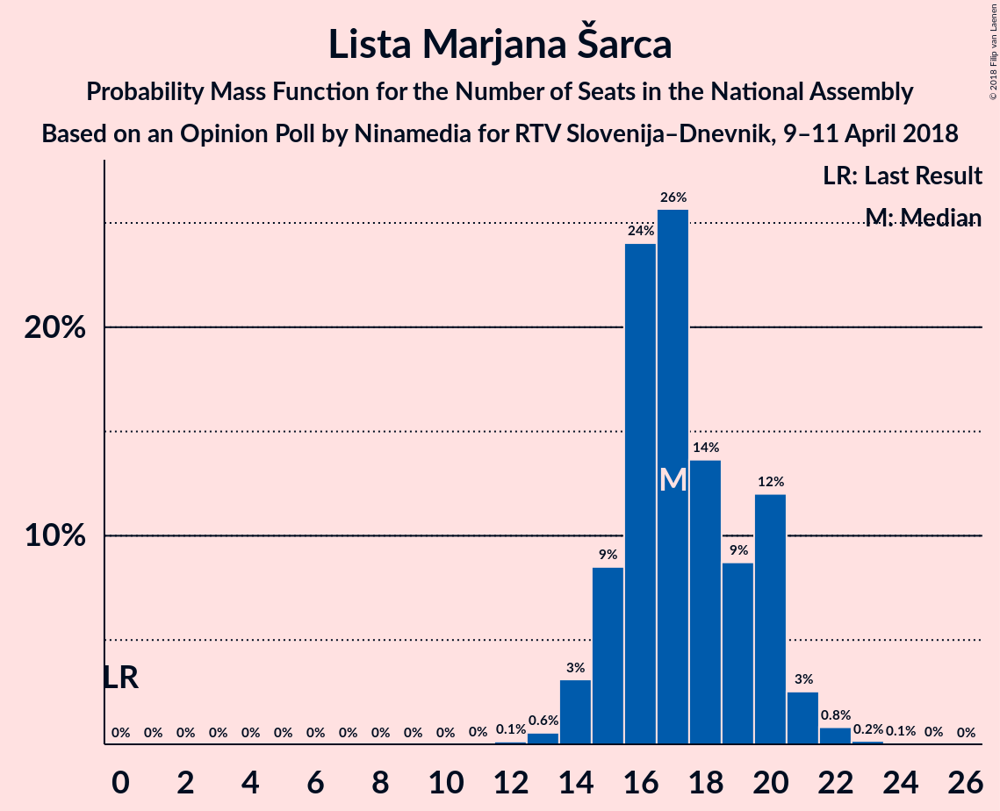

# Opinion Poll by Ninamedia for RTV Slovenija–Dnevnik, 9–11 April 2018

<a href="#voting-intentions">Voting Intentions</a> | <a href="#seats">Seats</a> | <a href="#coalitions">Coalitions</a> | <a href="#technical-information">Technical Information</a>

## Voting Intentions

### Confidence Intervals

| Party | Last Result | Poll Result | 80% Confidence Interval | 90% Confidence Interval | 95% Confidence Interval | 99% Confidence Interval |
|:-----:|:-----------:|:-----------:|:-----------------------:|:-----------------------:|:-----------------------:|:-----------------------:|
| Socialni demokrati | 6.0% | 19.9% | 17.6–22.6% |16.9–23.3% |16.4–24.0% |15.3–25.3% |
| Lista Marjana Šarca | 0.0% | 19.4% | 17.1–22.1% |16.5–22.8% |16.0–23.5% |14.9–24.8% |
| Slovenska demokratska stranka | 20.7% | 19.0% | 16.7–21.6% |16.1–22.3% |15.5–23.0% |14.5–24.3% |
| Stranka modernega centra | 34.5% | 11.5% | 9.7–13.7% |9.2–14.3% |8.8–14.9% |8.0–16.0% |
| Levica | 6.0% | 8.2% | 6.7–10.2% |6.3–10.7% |6.0–11.2% |5.3–12.2% |
| Demokratična stranka upokojencev Slovenije | 10.2% | 7.0% | 5.7–8.9% |5.3–9.4% |5.0–9.9% |4.4–10.8% |
| Nova Slovenija–Krščanski demokrati | 5.6% | 6.8% | 5.5–8.6% |5.1–9.1% |4.8–9.6% |4.2–10.5% |
| Stranka Alenke Bratušek | 4.4% | 0.2% | 0.1–0.9% |0.1–1.1% |0.0–1.3% |0.0–1.7% |

*Note:* The poll result column reflects the actual value used in the calculations. Published results may vary slightly, and in addition be rounded to fewer digits.

## Seats

### Confidence Intervals

| Party | Last Result | Median | 80% Confidence Interval | 90% Confidence Interval | 95% Confidence Interval | 99% Confidence Interval |
|:-----:|:-----------:|:------:|:-----------------------:|:-----------------------:|:-----------------------:|:-----------------------:|
| <a href="#socialni-demokrati">Socialni demokrati</a> | 6 | 18 | 15–20 |15–21 |14–21 |13–22 |
| <a href="#lista-marjana-šarca">Lista Marjana Šarca</a> | 0 | 17 | 15–19 |14–19 |14–20 |13–22 |
| <a href="#slovenska-demokratska-stranka">Slovenska demokratska stranka</a> | 21 | 17 | 14–19 |14–20 |13–20 |12–22 |
| <a href="#stranka-modernega-centra">Stranka modernega centra</a> | 36 | 10 | 9–12 |8–12 |8–13 |7–14 |
| <a href="#levica">Levica</a> | 6 | 7 | 6–9 |5–10 |5–10 |4–11 |
| <a href="#demokratična-stranka-upokojencev-slovenije">Demokratična stranka upokojencev Slovenije</a> | 10 | 6 | 5–8 |4–8 |4–9 |3–10 |
| <a href="#nova-slovenija–krščanski-demokrati">Nova Slovenija–Krščanski demokrati</a> | 5 | 6 | 4–7 |4–8 |4–8 |3–9 |
| <a href="#stranka-alenke-bratušek">Stranka Alenke Bratušek</a> | 4 | 0 | 0 |0 |0 |0 |

### Socialni demokrati

*For a full overview of the results for this party, see the [Socialni demokrati](party-socialnidemokrati.html) page.*

| Number of Seats | Probability | Accumulated | Special Marks |
|:---------------:|:-----------:|:-----------:|:-------------:|
| 6 | 0% | 100% | Last Result |
| 7 | 0% | 100% |  |
| 8 | 0% | 100% |  |
| 9 | 0% | 100% |  |
| 10 | 0% | 100% |  |
| 11 | 0% | 100% |  |
| 12 | 0.1% | 100% |  |
| 13 | 0.9% | 99.9% |  |
| 14 | 3% | 99.0% |  |
| 15 | 7% | 96% |  |
| 16 | 18% | 89% |  |
| 17 | 12% | 71% |  |
| 18 | 11% | 59% | Median |
| 19 | 29% | 48% |  |
| 20 | 12% | 19% |  |
| 21 | 6% | 7% |  |
| 22 | 1.0% | 1.5% |  |
| 23 | 0.3% | 0.5% |  |
| 24 | 0.2% | 0.2% |  |
| 25 | 0% | 0% |  |

### Lista Marjana Šarca

*For a full overview of the results for this party, see the [Lista Marjana Šarca](party-listamarjanašarca.html) page.*

| Number of Seats | Probability | Accumulated | Special Marks |
|:---------------:|:-----------:|:-----------:|:-------------:|
| 0 | 0% | 100% | Last Result |
| 1 | 0% | 100% |  |
| 2 | 0% | 100% |  |
| 3 | 0% | 100% |  |
| 4 | 0% | 100% |  |
| 5 | 0% | 100% |  |
| 6 | 0% | 100% |  |
| 7 | 0% | 100% |  |
| 8 | 0% | 100% |  |
| 9 | 0% | 100% |  |
| 10 | 0% | 100% |  |
| 11 | 0% | 100% |  |
| 12 | 0.3% | 100% |  |
| 13 | 0.6% | 99.7% |  |
| 14 | 6% | 99.1% |  |
| 15 | 5% | 93% |  |
| 16 | 23% | 88% |  |
| 17 | 27% | 65% | Median |
| 18 | 22% | 38% |  |
| 19 | 12% | 16% |  |
| 20 | 2% | 5% |  |
| 21 | 1.0% | 2% |  |
| 22 | 0.7% | 1.1% |  |
| 23 | 0.4% | 0.5% |  |
| 24 | 0% | 0% |  |

### Slovenska demokratska stranka

*For a full overview of the results for this party, see the [Slovenska demokratska stranka](party-slovenskademokratskastranka.html) page.*

| Number of Seats | Probability | Accumulated | Special Marks |
|:---------------:|:-----------:|:-----------:|:-------------:|
| 11 | 0.1% | 100% |  |
| 12 | 0.6% | 99.9% |  |
| 13 | 3% | 99.3% |  |
| 14 | 7% | 96% |  |
| 15 | 19% | 88% |  |
| 16 | 19% | 69% |  |
| 17 | 17% | 50% | Median |
| 18 | 22% | 33% |  |
| 19 | 5% | 11% |  |
| 20 | 4% | 6% |  |
| 21 | 1.1% | 2% | Last Result |
| 22 | 0.8% | 0.9% |  |
| 23 | 0.1% | 0.2% |  |
| 24 | 0% | 0% |  |

### Stranka modernega centra

*For a full overview of the results for this party, see the [Stranka modernega centra](party-strankamodernegacentra.html) page.*

| Number of Seats | Probability | Accumulated | Special Marks |
|:---------------:|:-----------:|:-----------:|:-------------:|
| 6 | 0.1% | 100% |  |
| 7 | 1.2% | 99.9% |  |
| 8 | 5% | 98.7% |  |
| 9 | 14% | 93% |  |
| 10 | 36% | 79% | Median |
| 11 | 26% | 43% |  |
| 12 | 14% | 17% |  |
| 13 | 2% | 3% |  |
| 14 | 0.7% | 0.9% |  |
| 15 | 0.2% | 0.2% |  |
| 16 | 0% | 0% |  |
| 17 | 0% | 0% |  |
| 18 | 0% | 0% |  |
| 19 | 0% | 0% |  |
| 20 | 0% | 0% |  |
| 21 | 0% | 0% |  |
| 22 | 0% | 0% |  |
| 23 | 0% | 0% |  |
| 24 | 0% | 0% |  |
| 25 | 0% | 0% |  |
| 26 | 0% | 0% |  |
| 27 | 0% | 0% |  |
| 28 | 0% | 0% |  |
| 29 | 0% | 0% |  |
| 30 | 0% | 0% |  |
| 31 | 0% | 0% |  |
| 32 | 0% | 0% |  |
| 33 | 0% | 0% |  |
| 34 | 0% | 0% |  |
| 35 | 0% | 0% |  |
| 36 | 0% | 0% | Last Result |

### Levica

*For a full overview of the results for this party, see the [Levica](party-levica.html) page.*

| Number of Seats | Probability | Accumulated | Special Marks |
|:---------------:|:-----------:|:-----------:|:-------------:|
| 4 | 0.9% | 100% |  |
| 5 | 5% | 99.1% |  |
| 6 | 14% | 94% | Last Result |
| 7 | 36% | 79% | Median |
| 8 | 32% | 44% |  |
| 9 | 7% | 12% |  |
| 10 | 5% | 5% |  |
| 11 | 0.6% | 0.6% |  |
| 12 | 0.1% | 0.1% |  |
| 13 | 0% | 0% |  |

### Demokratična stranka upokojencev Slovenije

*For a full overview of the results for this party, see the [Demokratična stranka upokojencev Slovenije](party-demokratičnastrankaupokojencevslovenije.html) page.*

| Number of Seats | Probability | Accumulated | Special Marks |
|:---------------:|:-----------:|:-----------:|:-------------:|
| 0 | 0.2% | 100% |  |
| 1 | 0% | 99.8% |  |
| 2 | 0% | 99.8% |  |
| 3 | 0.4% | 99.8% |  |
| 4 | 9% | 99.4% |  |
| 5 | 38% | 90% |  |
| 6 | 17% | 52% | Median |
| 7 | 13% | 35% |  |
| 8 | 19% | 23% |  |
| 9 | 3% | 4% |  |
| 10 | 0.7% | 0.8% | Last Result |
| 11 | 0.1% | 0.1% |  |
| 12 | 0% | 0% |  |

### Nova Slovenija–Krščanski demokrati

*For a full overview of the results for this party, see the [Nova Slovenija–Krščanski demokrati](party-novaslovenija–krščanskidemokrati.html) page.*

| Number of Seats | Probability | Accumulated | Special Marks |
|:---------------:|:-----------:|:-----------:|:-------------:|
| 0 | 0.2% | 100% |  |
| 1 | 0% | 99.8% |  |
| 2 | 0% | 99.8% |  |
| 3 | 0.6% | 99.8% |  |
| 4 | 12% | 99.2% |  |
| 5 | 30% | 88% | Last Result |
| 6 | 38% | 58% | Median |
| 7 | 13% | 20% |  |
| 8 | 5% | 7% |  |
| 9 | 2% | 2% |  |
| 10 | 0.1% | 0.1% |  |
| 11 | 0% | 0% |  |

### Stranka Alenke Bratušek

*For a full overview of the results for this party, see the [Stranka Alenke Bratušek](party-strankaalenkebratušek.html) page.*

| Number of Seats | Probability | Accumulated | Special Marks |
|:---------------:|:-----------:|:-----------:|:-------------:|
| 0 | 100% | 100% | Median |
| 1 | 0% | 0% |  |
| 2 | 0% | 0% |  |
| 3 | 0% | 0% |  |
| 4 | 0% | 0% | Last Result |

## Coalitions

### Confidence Intervals

| Coalition | Last Result | Median | Majority? | 80% Confidence Interval | 90% Confidence Interval | 95% Confidence Interval | 99% Confidence Interval |
|:---------:|:-----------:|:------:|:---------:|:-----------------------:|:-----------------------:|:-----------------------:|:-----------------------:|
| Socialni demokrati – Lista Marjana Šarca – Stranka modernega centra – Demokratična stranka upokojencev Slovenije – Nova Slovenija–Krščanski demokrati | 57 | 57 | 100% | 54–60 | 53–61 | 52–62 | 51–62 |
| Socialni demokrati – Lista Marjana Šarca – Stranka modernega centra – Demokratična stranka upokojencev Slovenije – Stranka Alenke Bratušek | 56 | 51 | 99.6% | 49–54 | 48–55 | 47–56 | 46–57 |
| Socialni demokrati – Lista Marjana Šarca – Stranka modernega centra – Demokratična stranka upokojencev Slovenije | 52 | 51 | 99.6% | 49–54 | 48–55 | 47–56 | 46–57 |
| Socialni demokrati – Lista Marjana Šarca – Stranka modernega centra – Nova Slovenija–Krščanski demokrati | 47 | 52 | 98% | 48–54 | 47–55 | 46–55 | 45–57 |
| Socialni demokrati – Lista Marjana Šarca – Demokratična stranka upokojencev Slovenije – Nova Slovenija–Krščanski demokrati | 21 | 47 | 74% | 44–49 | 43–51 | 42–51 | 41–53 |
| Socialni demokrati – Lista Marjana Šarca – Stranka modernega centra | 42 | 46 | 52% | 42–48 | 41–49 | 40–50 | 39–51 |
| Socialni demokrati – Lista Marjana Šarca – Demokratična stranka upokojencev Slovenije | 16 | 41 | 2% | 38–43 | 38–45 | 37–45 | 35–47 |
| Lista Marjana Šarca – Slovenska demokratska stranka – Demokratična stranka upokojencev Slovenije | 31 | 40 | 0.8% | 37–42 | 36–44 | 36–45 | 34–46 |
| Socialni demokrati – Lista Marjana Šarca – Nova Slovenija–Krščanski demokrati | 11 | 42 | 0.8% | 37–43 | 36–44 | 36–44 | 35–47 |
| Socialni demokrati – Stranka modernega centra – Demokratična stranka upokojencev Slovenije | 52 | 34 | 0% | 31–37 | 30–38 | 30–39 | 29–39 |
| Socialni demokrati – Lista Marjana Šarca | 6 | 36 | 0% | 32–38 | 31–38 | 30–39 | 30–41 |
| Lista Marjana Šarca – Slovenska demokratska stranka | 21 | 34 | 0% | 31–36 | 31–37 | 30–38 | 29–40 |

### Socialni demokrati – Lista Marjana Šarca – Stranka modernega centra – Demokratična stranka upokojencev Slovenije – Nova Slovenija–Krščanski demokrati

| Number of Seats | Probability | Accumulated | Special Marks |
|:---------------:|:-----------:|:-----------:|:-------------:|
| 50 | 0.1% | 100% |  |
| 51 | 0.6% | 99.8% |  |
| 52 | 2% | 99.2% |  |
| 53 | 2% | 97% |  |
| 54 | 5% | 95% |  |
| 55 | 7% | 89% |  |
| 56 | 17% | 82% |  |
| 57 | 25% | 65% | Last Result, Median |
| 58 | 20% | 41% |  |
| 59 | 10% | 20% |  |
| 60 | 6% | 11% |  |
| 61 | 2% | 5% |  |
| 62 | 2% | 3% |  |
| 63 | 0.3% | 0.4% |  |
| 64 | 0.1% | 0.1% |  |
| 65 | 0% | 0% |  |

### Socialni demokrati – Lista Marjana Šarca – Stranka modernega centra – Demokratična stranka upokojencev Slovenije – Stranka Alenke Bratušek

| Number of Seats | Probability | Accumulated | Special Marks |
|:---------------:|:-----------:|:-----------:|:-------------:|
| 44 | 0.1% | 100% |  |
| 45 | 0.3% | 99.9% |  |
| 46 | 0.8% | 99.6% | Majority |
| 47 | 3% | 98.8% |  |
| 48 | 5% | 96% |  |
| 49 | 9% | 91% |  |
| 50 | 11% | 82% |  |
| 51 | 28% | 72% | Median |
| 52 | 17% | 43% |  |
| 53 | 11% | 26% |  |
| 54 | 8% | 15% |  |
| 55 | 3% | 7% |  |
| 56 | 3% | 4% | Last Result |
| 57 | 1.2% | 1.4% |  |
| 58 | 0.2% | 0.3% |  |
| 59 | 0.1% | 0.1% |  |
| 60 | 0% | 0% |  |

### Socialni demokrati – Lista Marjana Šarca – Stranka modernega centra – Demokratična stranka upokojencev Slovenije

| Number of Seats | Probability | Accumulated | Special Marks |
|:---------------:|:-----------:|:-----------:|:-------------:|
| 44 | 0.1% | 100% |  |
| 45 | 0.3% | 99.9% |  |
| 46 | 0.8% | 99.6% | Majority |
| 47 | 3% | 98.8% |  |
| 48 | 5% | 96% |  |
| 49 | 9% | 91% |  |
| 50 | 11% | 82% |  |
| 51 | 28% | 72% | Median |
| 52 | 17% | 43% | Last Result |
| 53 | 11% | 26% |  |
| 54 | 8% | 15% |  |
| 55 | 3% | 7% |  |
| 56 | 3% | 4% |  |
| 57 | 1.2% | 1.4% |  |
| 58 | 0.2% | 0.3% |  |
| 59 | 0.1% | 0.1% |  |
| 60 | 0% | 0% |  |

### Socialni demokrati – Lista Marjana Šarca – Stranka modernega centra – Nova Slovenija–Krščanski demokrati

| Number of Seats | Probability | Accumulated | Special Marks |
|:---------------:|:-----------:|:-----------:|:-------------:|
| 44 | 0.4% | 100% |  |
| 45 | 1.1% | 99.5% |  |
| 46 | 3% | 98% | Majority |
| 47 | 4% | 96% | Last Result |
| 48 | 12% | 91% |  |
| 49 | 6% | 80% |  |
| 50 | 11% | 74% |  |
| 51 | 11% | 62% | Median |
| 52 | 19% | 51% |  |
| 53 | 21% | 32% |  |
| 54 | 5% | 11% |  |
| 55 | 5% | 7% |  |
| 56 | 1.2% | 2% |  |
| 57 | 0.4% | 0.6% |  |
| 58 | 0.1% | 0.2% |  |
| 59 | 0.1% | 0.1% |  |
| 60 | 0% | 0% |  |

### Socialni demokrati – Lista Marjana Šarca – Demokratična stranka upokojencev Slovenije – Nova Slovenija–Krščanski demokrati

| Number of Seats | Probability | Accumulated | Special Marks |
|:---------------:|:-----------:|:-----------:|:-------------:|
| 21 | 0% | 100% | Last Result |
| 22 | 0% | 100% |  |
| 23 | 0% | 100% |  |
| 24 | 0% | 100% |  |
| 25 | 0% | 100% |  |
| 26 | 0% | 100% |  |
| 27 | 0% | 100% |  |
| 28 | 0% | 100% |  |
| 29 | 0% | 100% |  |
| 30 | 0% | 100% |  |
| 31 | 0% | 100% |  |
| 32 | 0% | 100% |  |
| 33 | 0% | 100% |  |
| 34 | 0% | 100% |  |
| 35 | 0% | 100% |  |
| 36 | 0% | 100% |  |
| 37 | 0% | 100% |  |
| 38 | 0% | 100% |  |
| 39 | 0.1% | 100% |  |
| 40 | 0.2% | 99.9% |  |
| 41 | 0.9% | 99.8% |  |
| 42 | 2% | 98.9% |  |
| 43 | 3% | 96% |  |
| 44 | 5% | 94% |  |
| 45 | 14% | 88% |  |
| 46 | 17% | 74% | Majority |
| 47 | 24% | 57% | Median |
| 48 | 18% | 34% |  |
| 49 | 7% | 16% |  |
| 50 | 4% | 9% |  |
| 51 | 4% | 5% |  |
| 52 | 0.6% | 1.2% |  |
| 53 | 0.5% | 0.6% |  |
| 54 | 0.1% | 0.1% |  |
| 55 | 0% | 0% |  |

### Socialni demokrati – Lista Marjana Šarca – Stranka modernega centra

| Number of Seats | Probability | Accumulated | Special Marks |
|:---------------:|:-----------:|:-----------:|:-------------:|
| 38 | 0.1% | 100% |  |
| 39 | 1.0% | 99.8% |  |
| 40 | 2% | 98.8% |  |
| 41 | 3% | 97% |  |
| 42 | 6% | 94% | Last Result |
| 43 | 14% | 88% |  |
| 44 | 7% | 74% |  |
| 45 | 15% | 67% | Median |
| 46 | 20% | 52% | Majority |
| 47 | 18% | 32% |  |
| 48 | 5% | 14% |  |
| 49 | 7% | 10% |  |
| 50 | 0.8% | 3% |  |
| 51 | 2% | 2% |  |
| 52 | 0.2% | 0.4% |  |
| 53 | 0.1% | 0.1% |  |
| 54 | 0% | 0% |  |

### Socialni demokrati – Lista Marjana Šarca – Demokratična stranka upokojencev Slovenije

| Number of Seats | Probability | Accumulated | Special Marks |
|:---------------:|:-----------:|:-----------:|:-------------:|
| 16 | 0% | 100% | Last Result |
| 17 | 0% | 100% |  |
| 18 | 0% | 100% |  |
| 19 | 0% | 100% |  |
| 20 | 0% | 100% |  |
| 21 | 0% | 100% |  |
| 22 | 0% | 100% |  |
| 23 | 0% | 100% |  |
| 24 | 0% | 100% |  |
| 25 | 0% | 100% |  |
| 26 | 0% | 100% |  |
| 27 | 0% | 100% |  |
| 28 | 0% | 100% |  |
| 29 | 0% | 100% |  |
| 30 | 0% | 100% |  |
| 31 | 0% | 100% |  |
| 32 | 0% | 100% |  |
| 33 | 0.1% | 100% |  |
| 34 | 0.1% | 99.9% |  |
| 35 | 0.4% | 99.8% |  |
| 36 | 0.6% | 99.4% |  |
| 37 | 3% | 98.8% |  |
| 38 | 8% | 96% |  |
| 39 | 5% | 88% |  |
| 40 | 19% | 82% |  |
| 41 | 27% | 63% | Median |
| 42 | 15% | 36% |  |
| 43 | 11% | 21% |  |
| 44 | 3% | 9% |  |
| 45 | 4% | 6% |  |
| 46 | 1.0% | 2% | Majority |
| 47 | 0.5% | 0.7% |  |
| 48 | 0.1% | 0.2% |  |
| 49 | 0.1% | 0.1% |  |
| 50 | 0% | 0% |  |

### Lista Marjana Šarca – Slovenska demokratska stranka – Demokratična stranka upokojencev Slovenije

| Number of Seats | Probability | Accumulated | Special Marks |
|:---------------:|:-----------:|:-----------:|:-------------:|
| 31 | 0% | 100% | Last Result |
| 32 | 0% | 100% |  |
| 33 | 0.2% | 100% |  |
| 34 | 0.4% | 99.8% |  |
| 35 | 2% | 99.3% |  |
| 36 | 6% | 98% |  |
| 37 | 19% | 92% |  |
| 38 | 6% | 73% |  |
| 39 | 14% | 67% |  |
| 40 | 17% | 53% | Median |
| 41 | 8% | 37% |  |
| 42 | 19% | 29% |  |
| 43 | 4% | 10% |  |
| 44 | 3% | 6% |  |
| 45 | 2% | 3% |  |
| 46 | 0.5% | 0.8% | Majority |
| 47 | 0.3% | 0.3% |  |
| 48 | 0% | 0.1% |  |
| 49 | 0% | 0% |  |

### Socialni demokrati – Lista Marjana Šarca – Nova Slovenija–Krščanski demokrati

| Number of Seats | Probability | Accumulated | Special Marks |
|:---------------:|:-----------:|:-----------:|:-------------:|
| 11 | 0% | 100% | Last Result |
| 12 | 0% | 100% |  |
| 13 | 0% | 100% |  |
| 14 | 0% | 100% |  |
| 15 | 0% | 100% |  |
| 16 | 0% | 100% |  |
| 17 | 0% | 100% |  |
| 18 | 0% | 100% |  |
| 19 | 0% | 100% |  |
| 20 | 0% | 100% |  |
| 21 | 0% | 100% |  |
| 22 | 0% | 100% |  |
| 23 | 0% | 100% |  |
| 24 | 0% | 100% |  |
| 25 | 0% | 100% |  |
| 26 | 0% | 100% |  |
| 27 | 0% | 100% |  |
| 28 | 0% | 100% |  |
| 29 | 0% | 100% |  |
| 30 | 0% | 100% |  |
| 31 | 0% | 100% |  |
| 32 | 0% | 100% |  |
| 33 | 0% | 100% |  |
| 34 | 0.1% | 100% |  |
| 35 | 0.4% | 99.9% |  |
| 36 | 5% | 99.5% |  |
| 37 | 13% | 95% |  |
| 38 | 9% | 82% |  |
| 39 | 4% | 73% |  |
| 40 | 6% | 69% |  |
| 41 | 9% | 63% | Median |
| 42 | 29% | 54% |  |
| 43 | 18% | 25% |  |
| 44 | 6% | 7% |  |
| 45 | 0.5% | 1.4% |  |
| 46 | 0.1% | 0.8% | Majority |
| 47 | 0.3% | 0.7% |  |
| 48 | 0.3% | 0.5% |  |
| 49 | 0.1% | 0.1% |  |
| 50 | 0% | 0% |  |

### Socialni demokrati – Stranka modernega centra – Demokratična stranka upokojencev Slovenije

| Number of Seats | Probability | Accumulated | Special Marks |
|:---------------:|:-----------:|:-----------:|:-------------:|
| 27 | 0.1% | 100% |  |
| 28 | 0.3% | 99.9% |  |
| 29 | 1.0% | 99.6% |  |
| 30 | 4% | 98.6% |  |
| 31 | 6% | 95% |  |
| 32 | 6% | 89% |  |
| 33 | 7% | 83% |  |
| 34 | 32% | 75% | Median |
| 35 | 22% | 43% |  |
| 36 | 7% | 21% |  |
| 37 | 8% | 15% |  |
| 38 | 4% | 7% |  |
| 39 | 3% | 3% |  |
| 40 | 0.3% | 0.4% |  |
| 41 | 0.1% | 0.2% |  |
| 42 | 0% | 0.1% |  |
| 43 | 0% | 0% |  |
| 44 | 0% | 0% |  |
| 45 | 0% | 0% |  |
| 46 | 0% | 0% | Majority |
| 47 | 0% | 0% |  |
| 48 | 0% | 0% |  |
| 49 | 0% | 0% |  |
| 50 | 0% | 0% |  |
| 51 | 0% | 0% |  |
| 52 | 0% | 0% | Last Result |

### Socialni demokrati – Lista Marjana Šarca

| Number of Seats | Probability | Accumulated | Special Marks |
|:---------------:|:-----------:|:-----------:|:-------------:|
| 6 | 0% | 100% | Last Result |
| 7 | 0% | 100% |  |
| 8 | 0% | 100% |  |
| 9 | 0% | 100% |  |
| 10 | 0% | 100% |  |
| 11 | 0% | 100% |  |
| 12 | 0% | 100% |  |
| 13 | 0% | 100% |  |
| 14 | 0% | 100% |  |
| 15 | 0% | 100% |  |
| 16 | 0% | 100% |  |
| 17 | 0% | 100% |  |
| 18 | 0% | 100% |  |
| 19 | 0% | 100% |  |
| 20 | 0% | 100% |  |
| 21 | 0% | 100% |  |
| 22 | 0% | 100% |  |
| 23 | 0% | 100% |  |
| 24 | 0% | 100% |  |
| 25 | 0% | 100% |  |
| 26 | 0% | 100% |  |
| 27 | 0% | 100% |  |
| 28 | 0.2% | 100% |  |
| 29 | 0.2% | 99.8% |  |
| 30 | 2% | 99.6% |  |
| 31 | 5% | 97% |  |
| 32 | 15% | 92% |  |
| 33 | 7% | 78% |  |
| 34 | 7% | 70% |  |
| 35 | 10% | 63% | Median |
| 36 | 24% | 53% |  |
| 37 | 19% | 29% |  |
| 38 | 7% | 10% |  |
| 39 | 2% | 3% |  |
| 40 | 0.5% | 1.1% |  |
| 41 | 0.3% | 0.6% |  |
| 42 | 0.2% | 0.3% |  |
| 43 | 0.1% | 0.1% |  |
| 44 | 0% | 0% |  |

### Lista Marjana Šarca – Slovenska demokratska stranka

| Number of Seats | Probability | Accumulated | Special Marks |
|:---------------:|:-----------:|:-----------:|:-------------:|
| 21 | 0% | 100% | Last Result |
| 22 | 0% | 100% |  |
| 23 | 0% | 100% |  |
| 24 | 0% | 100% |  |
| 25 | 0% | 100% |  |
| 26 | 0% | 100% |  |
| 27 | 0.1% | 100% |  |
| 28 | 0.3% | 99.9% |  |
| 29 | 0.9% | 99.6% |  |
| 30 | 3% | 98.7% |  |
| 31 | 5% | 95% |  |
| 32 | 25% | 90% |  |
| 33 | 7% | 65% |  |
| 34 | 31% | 58% | Median |
| 35 | 11% | 27% |  |
| 36 | 8% | 16% |  |
| 37 | 5% | 8% |  |
| 38 | 1.5% | 3% |  |
| 39 | 0.8% | 2% |  |
| 40 | 0.5% | 0.8% |  |
| 41 | 0.3% | 0.3% |  |
| 42 | 0% | 0% |  |

## Technical Information

### Opinion Poll

+ **Polling firm:** Ninamedia
+ **Commissioner(s):** RTV Slovenija–Dnevnik
+ **Fieldwork period:** 9–11 April 2018

### Calculations

+ **Sample size:** 427
+ **Simulations done:** 131,072
+ **Error estimate:** 3.06%

