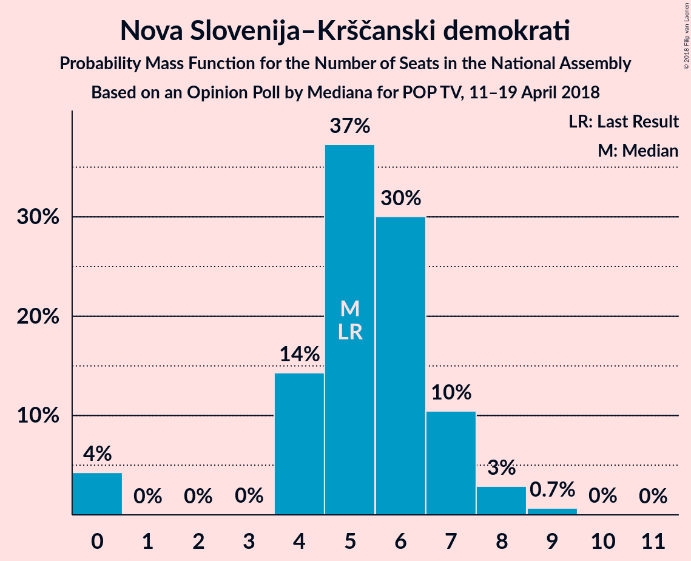

# Opinion Poll by Mediana for POP TV, 11–19 April 2018

<a href="#voting-intentions">Voting Intentions</a> | <a href="#seats">Seats</a> | <a href="#coalitions">Coalitions</a> | <a href="#technical-information">Technical Information</a>

## Voting Intentions

### Confidence Intervals

| Party | Last Result | Poll Result | 80% Confidence Interval | 90% Confidence Interval | 95% Confidence Interval | 99% Confidence Interval |
|:-----:|:-----------:|:-----------:|:-----------------------:|:-----------------------:|:-----------------------:|:-----------------------:|
| Slovenska demokratska stranka | 20.7% | 21.9% | 19.5–24.6% |18.9–25.4% |18.3–26.0% |17.2–27.4% |
| Lista Marjana Šarca | 0.0% | 21.7% | 19.3–24.4% |18.7–25.1% |18.1–25.8% |17.0–27.1% |
| Socialni demokrati | 6.0% | 13.7% | 11.8–16.0% |11.2–16.7% |10.8–17.3% |9.9–18.4% |
| Stranka modernega centra | 34.5% | 7.1% | 5.7–8.9% |5.3–9.4% |5.0–9.9% |4.5–10.8% |
| Levica | 6.0% | 6.6% | 5.3–8.4% |5.0–8.9% |4.6–9.4% |4.1–10.3% |
| Nova Slovenija–Krščanski demokrati | 5.6% | 5.7% | 4.5–7.4% |4.2–7.9% |3.9–8.3% |3.4–9.2% |
| Demokratična stranka upokojencev Slovenije | 10.2% | 4.1% | 3.1–5.6% |2.9–6.0% |2.6–6.4% |2.2–7.2% |
| Stranka Alenke Bratušek | 4.4% | 2.7% | 2.0–4.0% |1.8–4.4% |1.6–4.7% |1.3–5.4% |
| Slovenska ljudska stranka | 4.0% | 2.3% | 1.6–3.5% |1.4–3.8% |1.2–4.2% |1.0–4.8% |
| Slovenska nacionalna stranka | 2.2% | 1.8% | 1.2–3.0% |1.1–3.3% |0.9–3.6% |0.7–4.2% |
| Glas za otroke in družine–Nova ljudska stranka Slovenije | 0.0% | 0.9% | 0.5–1.8% |0.4–2.1% |0.4–2.3% |0.2–2.9% |
| Pozitivna Slovenija | 3.0% | 0.2% | 0.1–0.9% |0.1–1.1% |0.0–1.3% |0.0–1.7% |

*Note:* The poll result column reflects the actual value used in the calculations. Published results may vary slightly, and in addition be rounded to fewer digits.

## Seats

### Confidence Intervals

| Party | Last Result | Median | 80% Confidence Interval | 90% Confidence Interval | 95% Confidence Interval | 99% Confidence Interval |
|:-----:|:-----------:|:------:|:-----------------------:|:-----------------------:|:-----------------------:|:-----------------------:|
| <a href="#slovenska-demokratska-stranka">Slovenska demokratska stranka</a> | 21 | 20 | 19–21 |17–21 |17–21 |17–22 |
| <a href="#lista-marjana-Šarca">Lista Marjana Šarca</a> | 0 | 19 | 19–23 |19–24 |19–24 |19–24 |
| <a href="#socialni-demokrati">Socialni demokrati</a> | 6 | 13 | 12–14 |12–14 |11–14 |10–15 |
| <a href="#stranka-modernega-centra">Stranka modernega centra</a> | 36 | 7 | 7–8 |7–8 |7–8 |6–9 |
| <a href="#levica">Levica</a> | 6 | 6 | 6–7 |6–8 |6–8 |4–8 |
| <a href="#nova-slovenija–krščanski-demokrati">Nova Slovenija–Krščanski demokrati</a> | 5 | 5 | 5 |5–7 |5–7 |4–7 |
| <a href="#demokratična-stranka-upokojencev-slovenije">Demokratična stranka upokojencev Slovenije</a> | 10 | 4 | 4 |4 |4 |0–5 |
| <a href="#stranka-alenke-bratušek">Stranka Alenke Bratušek</a> | 4 | 0 | 0 |0 |0 |0–4 |
| <a href="#slovenska-ljudska-stranka">Slovenska ljudska stranka</a> | 0 | 0 | 0 |0 |0 |0–4 |
| <a href="#slovenska-nacionalna-stranka">Slovenska nacionalna stranka</a> | 0 | 0 | 0 |0 |0 |0 |
| <a href="#glas-za-otroke-in-družine–nova-ljudska-stranka-slovenije">Glas za otroke in družine–Nova ljudska stranka Slovenije</a> | 0 | 0 | 0 |0 |0 |0 |
| <a href="#pozitivna-slovenija">Pozitivna Slovenija</a> | 0 | 0 | 0 |0 |0 |0 |

### Slovenska demokratska stranka

*For a full overview of the results for this party, see the [Slovenska demokratska stranka](party-slovenskademokratskastranka.html) page.*

| Number of Seats | Probability | Accumulated | Special Marks |
|:---------------:|:-----------:|:-----------:|:-------------:|
| 15 | 0.1% | 100% |  |
| 16 | 0% | 99.9% |  |
| 17 | 7% | 99.9% |  |
| 18 | 0.1% | 93% |  |
| 19 | 8% | 93% |  |
| 20 | 57% | 85% | Median |
| 21 | 28% | 28% | Last Result |
| 22 | 0.1% | 0.5% |  |
| 23 | 0.1% | 0.5% |  |
| 24 | 0.2% | 0.3% |  |
| 25 | 0.1% | 0.2% |  |
| 26 | 0% | 0.1% |  |
| 27 | 0.1% | 0.1% |  |
| 28 | 0% | 0% |  |

### Lista Marjana Šarca

*For a full overview of the results for this party, see the [Lista Marjana Šarca](party-listamarjanaŠarca.html) page.*

| Number of Seats | Probability | Accumulated | Special Marks |
|:---------------:|:-----------:|:-----------:|:-------------:|
| 0 | 0% | 100% | Last Result |
| 1 | 0% | 100% |  |
| 2 | 0% | 100% |  |
| 3 | 0% | 100% |  |
| 4 | 0% | 100% |  |
| 5 | 0% | 100% |  |
| 6 | 0% | 100% |  |
| 7 | 0% | 100% |  |
| 8 | 0% | 100% |  |
| 9 | 0% | 100% |  |
| 10 | 0% | 100% |  |
| 11 | 0% | 100% |  |
| 12 | 0% | 100% |  |
| 13 | 0% | 100% |  |
| 14 | 0% | 100% |  |
| 15 | 0% | 100% |  |
| 16 | 0.1% | 100% |  |
| 17 | 0% | 99.9% |  |
| 18 | 0% | 99.9% |  |
| 19 | 55% | 99.9% | Median |
| 20 | 0.5% | 45% |  |
| 21 | 27% | 44% |  |
| 22 | 7% | 17% |  |
| 23 | 0.4% | 10% |  |
| 24 | 9% | 10% |  |
| 25 | 0.1% | 0.4% |  |
| 26 | 0.1% | 0.3% |  |
| 27 | 0.2% | 0.2% |  |
| 28 | 0% | 0% |  |

### Socialni demokrati

*For a full overview of the results for this party, see the [Socialni demokrati](party-socialnidemokrati.html) page.*

| Number of Seats | Probability | Accumulated | Special Marks |
|:---------------:|:-----------:|:-----------:|:-------------:|
| 6 | 0% | 100% | Last Result |
| 7 | 0% | 100% |  |
| 8 | 0% | 100% |  |
| 9 | 0.1% | 100% |  |
| 10 | 0.5% | 99.9% |  |
| 11 | 2% | 99.4% |  |
| 12 | 14% | 97% |  |
| 13 | 56% | 83% | Median |
| 14 | 27% | 28% |  |
| 15 | 0.4% | 0.7% |  |
| 16 | 0.2% | 0.4% |  |
| 17 | 0.2% | 0.2% |  |
| 18 | 0% | 0.1% |  |
| 19 | 0% | 0% |  |

### Stranka modernega centra

*For a full overview of the results for this party, see the [Stranka modernega centra](party-strankamodernegacentra.html) page.*

| Number of Seats | Probability | Accumulated | Special Marks |
|:---------------:|:-----------:|:-----------:|:-------------:|
| 4 | 0.1% | 100% |  |
| 5 | 0.3% | 99.9% |  |
| 6 | 0.1% | 99.6% |  |
| 7 | 66% | 99.4% | Median |
| 8 | 33% | 34% |  |
| 9 | 0.3% | 0.6% |  |
| 10 | 0.2% | 0.3% |  |
| 11 | 0% | 0% |  |
| 12 | 0% | 0% |  |
| 13 | 0% | 0% |  |
| 14 | 0% | 0% |  |
| 15 | 0% | 0% |  |
| 16 | 0% | 0% |  |
| 17 | 0% | 0% |  |
| 18 | 0% | 0% |  |
| 19 | 0% | 0% |  |
| 20 | 0% | 0% |  |
| 21 | 0% | 0% |  |
| 22 | 0% | 0% |  |
| 23 | 0% | 0% |  |
| 24 | 0% | 0% |  |
| 25 | 0% | 0% |  |
| 26 | 0% | 0% |  |
| 27 | 0% | 0% |  |
| 28 | 0% | 0% |  |
| 29 | 0% | 0% |  |
| 30 | 0% | 0% |  |
| 31 | 0% | 0% |  |
| 32 | 0% | 0% |  |
| 33 | 0% | 0% |  |
| 34 | 0% | 0% |  |
| 35 | 0% | 0% |  |
| 36 | 0% | 0% | Last Result |

### Levica

*For a full overview of the results for this party, see the [Levica](party-levica.html) page.*

| Number of Seats | Probability | Accumulated | Special Marks |
|:---------------:|:-----------:|:-----------:|:-------------:|
| 0 | 0.2% | 100% |  |
| 1 | 0% | 99.8% |  |
| 2 | 0% | 99.8% |  |
| 3 | 0% | 99.8% |  |
| 4 | 0.8% | 99.8% |  |
| 5 | 0.7% | 99.1% |  |
| 6 | 56% | 98% | Last Result, Median |
| 7 | 36% | 43% |  |
| 8 | 6% | 6% |  |
| 9 | 0% | 0.1% |  |
| 10 | 0.1% | 0.1% |  |
| 11 | 0% | 0% |  |

### Nova Slovenija–Krščanski demokrati

*For a full overview of the results for this party, see the [Nova Slovenija–Krščanski demokrati](party-novaslovenija–krščanskidemokrati.html) page.*

| Number of Seats | Probability | Accumulated | Special Marks |
|:---------------:|:-----------:|:-----------:|:-------------:|
| 0 | 0.4% | 100% |  |
| 1 | 0% | 99.6% |  |
| 2 | 0% | 99.6% |  |
| 3 | 0% | 99.6% |  |
| 4 | 0.7% | 99.6% |  |
| 5 | 91% | 98.9% | Last Result, Median |
| 6 | 0.8% | 7% |  |
| 7 | 7% | 7% |  |
| 8 | 0% | 0.1% |  |
| 9 | 0% | 0% |  |

### Demokratična stranka upokojencev Slovenije

*For a full overview of the results for this party, see the [Demokratična stranka upokojencev Slovenije](party-demokratičnastrankaupokojencevslovenije.html) page.*

| Number of Seats | Probability | Accumulated | Special Marks |
|:---------------:|:-----------:|:-----------:|:-------------:|
| 0 | 0.9% | 100% |  |
| 1 | 0% | 99.1% |  |
| 2 | 0% | 99.1% |  |
| 3 | 0% | 99.1% |  |
| 4 | 98% | 99.1% | Median |
| 5 | 0.8% | 1.0% |  |
| 6 | 0.2% | 0.3% |  |
| 7 | 0% | 0% |  |
| 8 | 0% | 0% |  |
| 9 | 0% | 0% |  |
| 10 | 0% | 0% | Last Result |

### Stranka Alenke Bratušek

*For a full overview of the results for this party, see the [Stranka Alenke Bratušek](party-strankaalenkebratušek.html) page.*

| Number of Seats | Probability | Accumulated | Special Marks |
|:---------------:|:-----------:|:-----------:|:-------------:|
| 0 | 99.3% | 100% | Median |
| 1 | 0% | 0.7% |  |
| 2 | 0% | 0.7% |  |
| 3 | 0% | 0.7% |  |
| 4 | 0.5% | 0.6% | Last Result |
| 5 | 0.2% | 0.2% |  |
| 6 | 0% | 0% |  |

### Slovenska ljudska stranka

*For a full overview of the results for this party, see the [Slovenska ljudska stranka](party-slovenskaljudskastranka.html) page.*

| Number of Seats | Probability | Accumulated | Special Marks |
|:---------------:|:-----------:|:-----------:|:-------------:|
| 0 | 99.4% | 100% | Last Result, Median |
| 1 | 0% | 0.6% |  |
| 2 | 0% | 0.6% |  |
| 3 | 0% | 0.6% |  |
| 4 | 0.6% | 0.6% |  |
| 5 | 0% | 0% |  |

### Slovenska nacionalna stranka

*For a full overview of the results for this party, see the [Slovenska nacionalna stranka](party-slovenskanacionalnastranka.html) page.*

| Number of Seats | Probability | Accumulated | Special Marks |
|:---------------:|:-----------:|:-----------:|:-------------:|
| 0 | 99.9% | 100% | Last Result, Median |
| 1 | 0% | 0.1% |  |
| 2 | 0% | 0.1% |  |
| 3 | 0.1% | 0.1% |  |
| 4 | 0% | 0% |  |

### Glas za otroke in družine–Nova ljudska stranka Slovenije

*For a full overview of the results for this party, see the [Glas za otroke in družine–Nova ljudska stranka Slovenije](party-glaszaotrokeindružine–novaljudskastrankaslovenije.html) page.*

| Number of Seats | Probability | Accumulated | Special Marks |
|:---------------:|:-----------:|:-----------:|:-------------:|
| 0 | 100% | 100% | Last Result, Median |

### Pozitivna Slovenija

*For a full overview of the results for this party, see the [Pozitivna Slovenija](party-pozitivnaslovenija.html) page.*

| Number of Seats | Probability | Accumulated | Special Marks |
|:---------------:|:-----------:|:-----------:|:-------------:|
| 0 | 100% | 100% | Last Result, Median |

## Coalitions

## Technical Information

### Opinion Poll

+ **Polling firm:** Mediana
+ **Commissioner(s):** POP TV
+ **Fieldwork period:** 11–19 April 2018

### Calculations

+ **Sample size:** 438
+ **Simulations done:** 262,144
+ **Error estimate:** 2.83%

