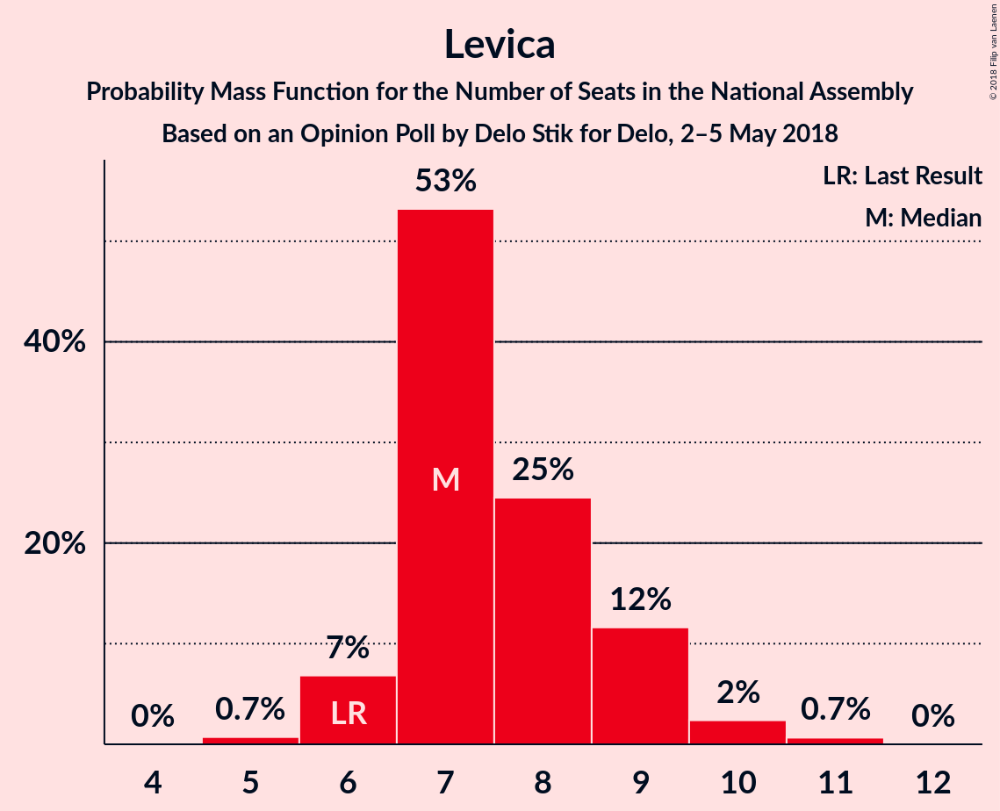
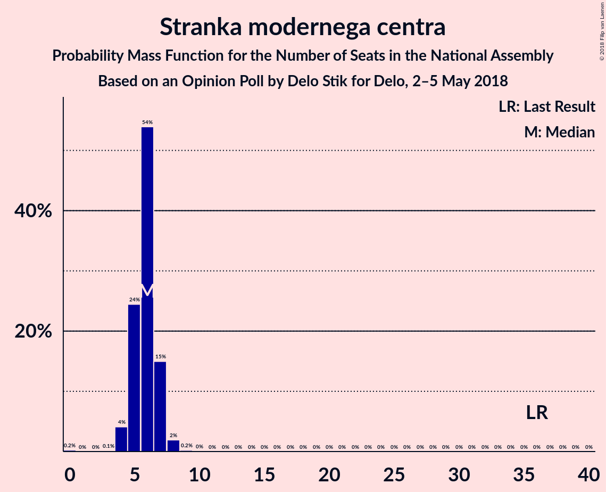
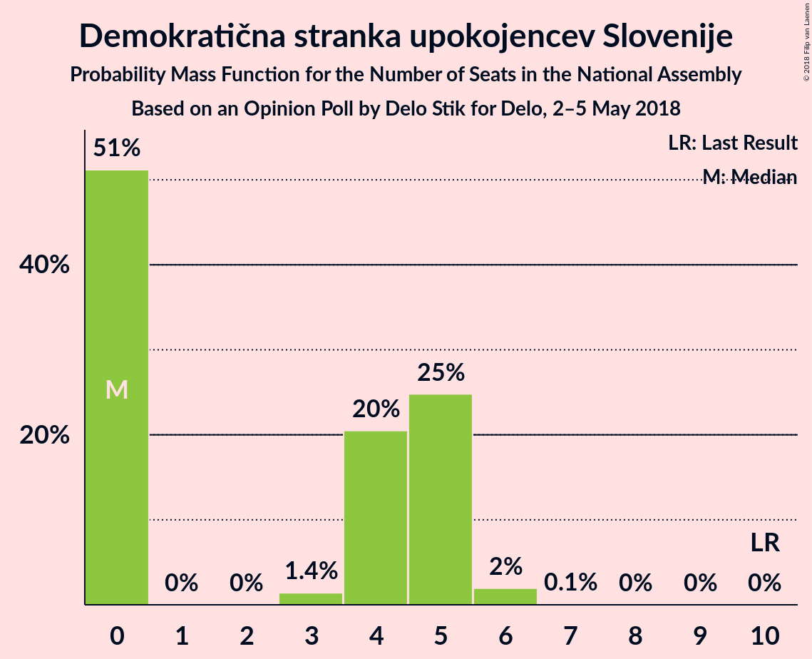

# Opinion Poll by Delo Stik for Delo, 2–5 May 2018

<a href="#voting-intentions">Voting Intentions</a> | <a href="#seats">Seats</a> | <a href="#coalitions">Coalitions</a> | <a href="#technical-information">Technical Information</a>

## Voting Intentions

### Confidence Intervals

| Party | Last Result | Poll Result | 80% Confidence Interval | 90% Confidence Interval | 95% Confidence Interval | 99% Confidence Interval |
|:-----:|:-----------:|:-----------:|:-----------------------:|:-----------------------:|:-----------------------:|:-----------------------:|
| Slovenska demokratska stranka | 20.7% | 21.8% | 20.1–23.8% |19.6–24.3% |19.2–24.8% |18.4–25.7% |
| Lista Marjana Šarca | 0.0% | 19.4% | 17.8–21.3% |17.3–21.8% |16.9–22.3% |16.1–23.2% |
| Socialni demokrati | 6.0% | 13.3% | 11.9–15.0% |11.5–15.4% |11.2–15.8% |10.5–16.6% |
| Levica | 6.0% | 8.2% | 7.1–9.5% |6.8–9.9% |6.5–10.2% |6.0–10.9% |
| Nova Slovenija–Krščanski demokrati | 5.6% | 7.2% | 6.2–8.5% |5.9–8.9% |5.6–9.2% |5.2–9.8% |
| Stranka modernega centra | 34.5% | 6.0% | 5.1–7.2% |4.8–7.5% |4.6–7.8% |4.2–8.4% |
| Demokratična stranka upokojencev Slovenije | 10.2% | 4.6% | 3.7–5.6% |3.5–5.9% |3.3–6.2% |3.0–6.8% |
| Stranka Alenke Bratušek | 4.4% | 3.8% | 3.1–4.8% |2.9–5.1% |2.7–5.4% |2.4–5.9% |
| Slovenska ljudska stranka | 4.0% | 2.8% | 2.1–3.6% |2.0–3.9% |1.8–4.1% |1.6–4.6% |
| Slovenska nacionalna stranka | 2.2% | 2.4% | 1.8–3.2% |1.7–3.5% |1.6–3.7% |1.3–4.1% |
| Glas za otroke in družine–Nova ljudska stranka Slovenije | 0.0% | 0.6% | 0.4–1.1% |0.3–1.3% |0.3–1.4% |0.2–1.7% |

*Note:* The poll result column reflects the actual value used in the calculations. Published results may vary slightly, and in addition be rounded to fewer digits.

## Seats

### Confidence Intervals

| Party | Last Result | Median | 80% Confidence Interval | 90% Confidence Interval | 95% Confidence Interval | 99% Confidence Interval |
|:-----:|:-----------:|:------:|:-----------------------:|:-----------------------:|:-----------------------:|:-----------------------:|
| <a href="#slovenska-demokratska-stranka">Slovenska demokratska stranka</a> | 21 | 22 | 21–23 |20–24 |19–25 |19–25 |
| <a href="#lista-marjana-šarca">Lista Marjana Šarca</a> | 0 | 18 | 17–21 |17–21 |17–22 |16–23 |
| <a href="#socialni-demokrati">Socialni demokrati</a> | 6 | 13 | 11–14 |10–14 |10–15 |10–16 |
| <a href="#levica">Levica</a> | 6 | 8 | 6–8 |6–9 |6–10 |5–10 |
| <a href="#nova-slovenija–krščanski-demokrati">Nova Slovenija–Krščanski demokrati</a> | 5 | 7 | 6–9 |6–9 |6–9 |5–10 |
| <a href="#stranka-modernega-centra">Stranka modernega centra</a> | 36 | 5 | 4–6 |4–6 |4–7 |0–7 |
| <a href="#demokratična-stranka-upokojencev-slovenije">Demokratična stranka upokojencev Slovenije</a> | 10 | 4 | 0–5 |0–5 |0–6 |0–6 |
| <a href="#stranka-alenke-bratušek">Stranka Alenke Bratušek</a> | 4 | 3 | 0–4 |0–5 |0–5 |0–5 |
| <a href="#slovenska-ljudska-stranka">Slovenska ljudska stranka</a> | 0 | 0 | 0 |0 |0 |0–4 |
| <a href="#slovenska-nacionalna-stranka">Slovenska nacionalna stranka</a> | 0 | 0 | 0 |0 |0 |0–4 |
| <a href="#glas-za-otroke-in-družine–nova-ljudska-stranka-slovenije">Glas za otroke in družine–Nova ljudska stranka Slovenije</a> | 0 | 0 | 0 |0 |0 |0 |

### Slovenska demokratska stranka

*For a full overview of the results for this party, see the [Slovenska demokratska stranka](party-slovenskademokratskastranka.html) page.*

| Number of Seats | Probability | Accumulated | Special Marks |
|:---------------:|:-----------:|:-----------:|:-------------:|
| 17 | 0.1% | 100% |  |
| 18 | 0.3% | 99.9% |  |
| 19 | 2% | 99.5% |  |
| 20 | 3% | 97% |  |
| 21 | 25% | 94% | Last Result |
| 22 | 27% | 69% | Median |
| 23 | 34% | 42% |  |
| 24 | 5% | 8% |  |
| 25 | 3% | 3% |  |
| 26 | 0.4% | 0.4% |  |
| 27 | 0% | 0% |  |

### Lista Marjana Šarca

*For a full overview of the results for this party, see the [Lista Marjana Šarca](party-listamarjanašarca.html) page.*

| Number of Seats | Probability | Accumulated | Special Marks |
|:---------------:|:-----------:|:-----------:|:-------------:|
| 0 | 0% | 100% | Last Result |
| 1 | 0% | 100% |  |
| 2 | 0% | 100% |  |
| 3 | 0% | 100% |  |
| 4 | 0% | 100% |  |
| 5 | 0% | 100% |  |
| 6 | 0% | 100% |  |
| 7 | 0% | 100% |  |
| 8 | 0% | 100% |  |
| 9 | 0% | 100% |  |
| 10 | 0% | 100% |  |
| 11 | 0% | 100% |  |
| 12 | 0% | 100% |  |
| 13 | 0% | 100% |  |
| 14 | 0% | 100% |  |
| 15 | 0.1% | 100% |  |
| 16 | 2% | 99.9% |  |
| 17 | 40% | 98% |  |
| 18 | 11% | 58% | Median |
| 19 | 23% | 47% |  |
| 20 | 4% | 23% |  |
| 21 | 17% | 19% |  |
| 22 | 1.1% | 3% |  |
| 23 | 2% | 2% |  |
| 24 | 0% | 0% |  |

### Socialni demokrati

*For a full overview of the results for this party, see the [Socialni demokrati](party-socialnidemokrati.html) page.*

| Number of Seats | Probability | Accumulated | Special Marks |
|:---------------:|:-----------:|:-----------:|:-------------:|
| 6 | 0% | 100% | Last Result |
| 7 | 0% | 100% |  |
| 8 | 0% | 100% |  |
| 9 | 0.2% | 100% |  |
| 10 | 7% | 99.8% |  |
| 11 | 14% | 93% |  |
| 12 | 22% | 79% |  |
| 13 | 36% | 57% | Median |
| 14 | 18% | 21% |  |
| 15 | 2% | 3% |  |
| 16 | 0.7% | 1.0% |  |
| 17 | 0.3% | 0.3% |  |
| 18 | 0% | 0% |  |

### Levica

*For a full overview of the results for this party, see the [Levica](party-levica.html) page.*

| Number of Seats | Probability | Accumulated | Special Marks |
|:---------------:|:-----------:|:-----------:|:-------------:|
| 5 | 0.9% | 100% |  |
| 6 | 19% | 99.1% | Last Result |
| 7 | 29% | 80% |  |
| 8 | 42% | 51% | Median |
| 9 | 5% | 9% |  |
| 10 | 3% | 4% |  |
| 11 | 0.2% | 0.3% |  |
| 12 | 0.1% | 0.1% |  |
| 13 | 0% | 0% |  |

### Nova Slovenija–Krščanski demokrati

*For a full overview of the results for this party, see the [Nova Slovenija–Krščanski demokrati](party-novaslovenija–krščanskidemokrati.html) page.*

| Number of Seats | Probability | Accumulated | Special Marks |
|:---------------:|:-----------:|:-----------:|:-------------:|
| 4 | 0.2% | 100% |  |
| 5 | 2% | 99.8% | Last Result |
| 6 | 30% | 98% |  |
| 7 | 49% | 68% | Median |
| 8 | 8% | 19% |  |
| 9 | 10% | 12% |  |
| 10 | 2% | 2% |  |
| 11 | 0% | 0% |  |

### Stranka modernega centra

*For a full overview of the results for this party, see the [Stranka modernega centra](party-strankamodernegacentra.html) page.*

| Number of Seats | Probability | Accumulated | Special Marks |
|:---------------:|:-----------:|:-----------:|:-------------:|
| 0 | 0.9% | 100% |  |
| 1 | 0% | 99.1% |  |
| 2 | 0% | 99.1% |  |
| 3 | 0% | 99.1% |  |
| 4 | 10% | 99.1% |  |
| 5 | 70% | 89% | Median |
| 6 | 14% | 19% |  |
| 7 | 5% | 5% |  |
| 8 | 0.2% | 0.2% |  |
| 9 | 0.1% | 0.1% |  |
| 10 | 0% | 0% |  |
| 11 | 0% | 0% |  |
| 12 | 0% | 0% |  |
| 13 | 0% | 0% |  |
| 14 | 0% | 0% |  |
| 15 | 0% | 0% |  |
| 16 | 0% | 0% |  |
| 17 | 0% | 0% |  |
| 18 | 0% | 0% |  |
| 19 | 0% | 0% |  |
| 20 | 0% | 0% |  |
| 21 | 0% | 0% |  |
| 22 | 0% | 0% |  |
| 23 | 0% | 0% |  |
| 24 | 0% | 0% |  |
| 25 | 0% | 0% |  |
| 26 | 0% | 0% |  |
| 27 | 0% | 0% |  |
| 28 | 0% | 0% |  |
| 29 | 0% | 0% |  |
| 30 | 0% | 0% |  |
| 31 | 0% | 0% |  |
| 32 | 0% | 0% |  |
| 33 | 0% | 0% |  |
| 34 | 0% | 0% |  |
| 35 | 0% | 0% |  |
| 36 | 0% | 0% | Last Result |

### Demokratična stranka upokojencev Slovenije

*For a full overview of the results for this party, see the [Demokratična stranka upokojencev Slovenije](party-demokratičnastrankaupokojencevslovenije.html) page.*

| Number of Seats | Probability | Accumulated | Special Marks |
|:---------------:|:-----------:|:-----------:|:-------------:|
| 0 | 10% | 100% |  |
| 1 | 0% | 90% |  |
| 2 | 0% | 90% |  |
| 3 | 2% | 90% |  |
| 4 | 44% | 88% | Median |
| 5 | 38% | 43% |  |
| 6 | 5% | 5% |  |
| 7 | 0.1% | 0.1% |  |
| 8 | 0% | 0% |  |
| 9 | 0% | 0% |  |
| 10 | 0% | 0% | Last Result |

### Stranka Alenke Bratušek

*For a full overview of the results for this party, see the [Stranka Alenke Bratušek](party-strankaalenkebratušek.html) page.*

| Number of Seats | Probability | Accumulated | Special Marks |
|:---------------:|:-----------:|:-----------:|:-------------:|
| 0 | 38% | 100% |  |
| 1 | 0% | 62% |  |
| 2 | 0% | 62% |  |
| 3 | 20% | 62% | Median |
| 4 | 37% | 42% | Last Result |
| 5 | 5% | 5% |  |
| 6 | 0.1% | 0.1% |  |
| 7 | 0% | 0% |  |

### Slovenska ljudska stranka

*For a full overview of the results for this party, see the [Slovenska ljudska stranka](party-slovenskaljudskastranka.html) page.*

| Number of Seats | Probability | Accumulated | Special Marks |
|:---------------:|:-----------:|:-----------:|:-------------:|
| 0 | 98.6% | 100% | Last Result, Median |
| 1 | 0% | 1.4% |  |
| 2 | 0% | 1.4% |  |
| 3 | 0% | 1.4% |  |
| 4 | 1.2% | 1.4% |  |
| 5 | 0.2% | 0.2% |  |
| 6 | 0% | 0% |  |

### Slovenska nacionalna stranka

*For a full overview of the results for this party, see the [Slovenska nacionalna stranka](party-slovenskanacionalnastranka.html) page.*

| Number of Seats | Probability | Accumulated | Special Marks |
|:---------------:|:-----------:|:-----------:|:-------------:|
| 0 | 99.5% | 100% | Last Result, Median |
| 1 | 0% | 0.5% |  |
| 2 | 0% | 0.5% |  |
| 3 | 0% | 0.5% |  |
| 4 | 0.5% | 0.5% |  |
| 5 | 0% | 0% |  |

### Glas za otroke in družine–Nova ljudska stranka Slovenije

*For a full overview of the results for this party, see the [Glas za otroke in družine–Nova ljudska stranka Slovenije](party-glaszaotrokeindružine–novaljudskastrankaslovenije.html) page.*

| Number of Seats | Probability | Accumulated | Special Marks |
|:---------------:|:-----------:|:-----------:|:-------------:|
| 0 | 100% | 100% | Last Result, Median |

## Coalitions

### Confidence Intervals

| Coalition | Last Result | Median | Majority? | 80% Confidence Interval | 90% Confidence Interval | 95% Confidence Interval | 99% Confidence Interval |
|:---------:|:-----------:|:------:|:---------:|:-----------------------:|:-----------------------:|:-----------------------:|:-----------------------:|
| Lista Marjana Šarca – Socialni demokrati – Nova Slovenija–Krščanski demokrati – Stranka modernega centra – Demokratična stranka upokojencev Slovenije | 57 | 47 | 81% | 45–49 | 44–51 | 42–52 | 42–52 |
| Slovenska demokratska stranka – Lista Marjana Šarca – Demokratična stranka upokojencev Slovenije | 31 | 45 | 37% | 43–46 | 42–47 | 41–49 | 39–51 |
| Lista Marjana Šarca – Socialni demokrati – Nova Slovenija–Krščanski demokrati – Stranka modernega centra | 47 | 43 | 7% | 40–45 | 40–46 | 39–47 | 38–50 |
| Lista Marjana Šarca – Socialni demokrati – Stranka modernega centra – Demokratična stranka upokojencev Slovenije – Stranka Alenke Bratušek | 56 | 42 | 2% | 40–45 | 39–45 | 39–45 | 36–47 |
| Lista Marjana Šarca – Socialni demokrati – Nova Slovenija–Krščanski demokrati – Demokratična stranka upokojencev Slovenije | 21 | 42 | 2% | 40–45 | 39–45 | 38–45 | 37–47 |
| Lista Marjana Šarca – Socialni demokrati – Stranka modernega centra – Demokratična stranka upokojencev Slovenije | 52 | 40 | 1.4% | 38–42 | 37–44 | 35–45 | 35–46 |
| Slovenska demokratska stranka – Lista Marjana Šarca | 21 | 40 | 0.1% | 39–43 | 39–43 | 38–44 | 37–45 |
| Lista Marjana Šarca – Socialni demokrati – Nova Slovenija–Krščanski demokrati | 11 | 38 | 0.4% | 36–40 | 35–40 | 35–41 | 35–44 |
| Lista Marjana Šarca – Socialni demokrati – Stranka modernega centra | 42 | 36 | 0% | 34–38 | 34–39 | 32–40 | 31–43 |
| Lista Marjana Šarca – Socialni demokrati – Demokratična stranka upokojencev Slovenije | 16 | 35 | 0% | 33–38 | 32–38 | 31–39 | 30–40 |
| Lista Marjana Šarca – Socialni demokrati | 6 | 31 | 0% | 29–33 | 29–33 | 29–34 | 28–37 |
| Socialni demokrati – Stranka modernega centra – Demokratična stranka upokojencev Slovenije | 52 | 22 | 0% | 19–24 | 18–24 | 18–24 | 16–26 |

### Lista Marjana Šarca – Socialni demokrati – Nova Slovenija–Krščanski demokrati – Stranka modernega centra – Demokratična stranka upokojencev Slovenije

| Number of Seats | Probability | Accumulated | Special Marks |
|:---------------:|:-----------:|:-----------:|:-------------:|
| 41 | 0.1% | 100% |  |
| 42 | 3% | 99.9% |  |
| 43 | 1.5% | 97% |  |
| 44 | 2% | 96% |  |
| 45 | 12% | 94% |  |
| 46 | 23% | 81% | Majority |
| 47 | 15% | 58% | Median |
| 48 | 12% | 43% |  |
| 49 | 23% | 31% |  |
| 50 | 2% | 8% |  |
| 51 | 3% | 6% |  |
| 52 | 3% | 3% |  |
| 53 | 0% | 0.1% |  |
| 54 | 0% | 0.1% |  |
| 55 | 0% | 0% |  |
| 56 | 0% | 0% |  |
| 57 | 0% | 0% | Last Result |

### Slovenska demokratska stranka – Lista Marjana Šarca – Demokratična stranka upokojencev Slovenije

| Number of Seats | Probability | Accumulated | Special Marks |
|:---------------:|:-----------:|:-----------:|:-------------:|
| 31 | 0% | 100% | Last Result |
| 32 | 0% | 100% |  |
| 33 | 0% | 100% |  |
| 34 | 0% | 100% |  |
| 35 | 0% | 100% |  |
| 36 | 0% | 100% |  |
| 37 | 0% | 99.9% |  |
| 38 | 0.1% | 99.9% |  |
| 39 | 0.4% | 99.9% |  |
| 40 | 0.1% | 99.5% |  |
| 41 | 3% | 99.4% |  |
| 42 | 2% | 96% |  |
| 43 | 28% | 94% |  |
| 44 | 6% | 66% | Median |
| 45 | 22% | 60% |  |
| 46 | 29% | 37% | Majority |
| 47 | 4% | 8% |  |
| 48 | 0.3% | 4% |  |
| 49 | 2% | 3% |  |
| 50 | 0% | 0.9% |  |
| 51 | 0.8% | 0.8% |  |
| 52 | 0% | 0% |  |

### Lista Marjana Šarca – Socialni demokrati – Nova Slovenija–Krščanski demokrati – Stranka modernega centra

| Number of Seats | Probability | Accumulated | Special Marks |
|:---------------:|:-----------:|:-----------:|:-------------:|
| 38 | 0.8% | 100% |  |
| 39 | 2% | 99.2% |  |
| 40 | 8% | 97% |  |
| 41 | 0.3% | 90% |  |
| 42 | 37% | 89% |  |
| 43 | 4% | 53% | Median |
| 44 | 26% | 48% |  |
| 45 | 15% | 22% |  |
| 46 | 4% | 7% | Majority |
| 47 | 2% | 3% | Last Result |
| 48 | 0.4% | 1.2% |  |
| 49 | 0.1% | 0.8% |  |
| 50 | 0.3% | 0.7% |  |
| 51 | 0.1% | 0.4% |  |
| 52 | 0.3% | 0.3% |  |
| 53 | 0% | 0% |  |

### Lista Marjana Šarca – Socialni demokrati – Stranka modernega centra – Demokratična stranka upokojencev Slovenije – Stranka Alenke Bratušek

| Number of Seats | Probability | Accumulated | Special Marks |
|:---------------:|:-----------:|:-----------:|:-------------:|
| 35 | 0.1% | 100% |  |
| 36 | 1.2% | 99.9% |  |
| 37 | 0.5% | 98.7% |  |
| 38 | 0.4% | 98% |  |
| 39 | 5% | 98% |  |
| 40 | 10% | 92% |  |
| 41 | 3% | 83% |  |
| 42 | 40% | 80% |  |
| 43 | 9% | 40% | Median |
| 44 | 2% | 31% |  |
| 45 | 27% | 29% |  |
| 46 | 2% | 2% | Majority |
| 47 | 0.4% | 0.5% |  |
| 48 | 0.1% | 0.1% |  |
| 49 | 0.1% | 0.1% |  |
| 50 | 0% | 0% |  |
| 51 | 0% | 0% |  |
| 52 | 0% | 0% |  |
| 53 | 0% | 0% |  |
| 54 | 0% | 0% |  |
| 55 | 0% | 0% |  |
| 56 | 0% | 0% | Last Result |

### Lista Marjana Šarca – Socialni demokrati – Nova Slovenija–Krščanski demokrati – Demokratična stranka upokojencev Slovenije

| Number of Seats | Probability | Accumulated | Special Marks |
|:---------------:|:-----------:|:-----------:|:-------------:|
| 21 | 0% | 100% | Last Result |
| 22 | 0% | 100% |  |
| 23 | 0% | 100% |  |
| 24 | 0% | 100% |  |
| 25 | 0% | 100% |  |
| 26 | 0% | 100% |  |
| 27 | 0% | 100% |  |
| 28 | 0% | 100% |  |
| 29 | 0% | 100% |  |
| 30 | 0% | 100% |  |
| 31 | 0% | 100% |  |
| 32 | 0% | 100% |  |
| 33 | 0% | 100% |  |
| 34 | 0% | 100% |  |
| 35 | 0% | 100% |  |
| 36 | 0.1% | 100% |  |
| 37 | 1.3% | 99.9% |  |
| 38 | 2% | 98.6% |  |
| 39 | 2% | 96% |  |
| 40 | 13% | 94% |  |
| 41 | 23% | 81% |  |
| 42 | 17% | 58% | Median |
| 43 | 18% | 42% |  |
| 44 | 11% | 23% |  |
| 45 | 11% | 12% |  |
| 46 | 1.1% | 2% | Majority |
| 47 | 0.5% | 0.6% |  |
| 48 | 0.1% | 0.1% |  |
| 49 | 0.1% | 0.1% |  |
| 50 | 0% | 0% |  |

### Lista Marjana Šarca – Socialni demokrati – Stranka modernega centra – Demokratična stranka upokojencev Slovenije

| Number of Seats | Probability | Accumulated | Special Marks |
|:---------------:|:-----------:|:-----------:|:-------------:|
| 35 | 3% | 100% |  |
| 36 | 2% | 97% |  |
| 37 | 5% | 95% |  |
| 38 | 2% | 90% |  |
| 39 | 29% | 88% |  |
| 40 | 10% | 58% | Median |
| 41 | 26% | 49% |  |
| 42 | 14% | 22% |  |
| 43 | 3% | 9% |  |
| 44 | 2% | 5% |  |
| 45 | 2% | 4% |  |
| 46 | 1.4% | 1.4% | Majority |
| 47 | 0% | 0.1% |  |
| 48 | 0% | 0% |  |
| 49 | 0% | 0% |  |
| 50 | 0% | 0% |  |
| 51 | 0% | 0% |  |
| 52 | 0% | 0% | Last Result |

### Slovenska demokratska stranka – Lista Marjana Šarca

| Number of Seats | Probability | Accumulated | Special Marks |
|:---------------:|:-----------:|:-----------:|:-------------:|
| 21 | 0% | 100% | Last Result |
| 22 | 0% | 100% |  |
| 23 | 0% | 100% |  |
| 24 | 0% | 100% |  |
| 25 | 0% | 100% |  |
| 26 | 0% | 100% |  |
| 27 | 0% | 100% |  |
| 28 | 0% | 100% |  |
| 29 | 0% | 100% |  |
| 30 | 0% | 100% |  |
| 31 | 0% | 100% |  |
| 32 | 0% | 100% |  |
| 33 | 0% | 100% |  |
| 34 | 0% | 100% |  |
| 35 | 0.1% | 99.9% |  |
| 36 | 0.3% | 99.8% |  |
| 37 | 0.1% | 99.5% |  |
| 38 | 4% | 99.4% |  |
| 39 | 23% | 96% |  |
| 40 | 26% | 72% | Median |
| 41 | 11% | 47% |  |
| 42 | 25% | 35% |  |
| 43 | 8% | 11% |  |
| 44 | 1.3% | 3% |  |
| 45 | 1.1% | 1.2% |  |
| 46 | 0.1% | 0.1% | Majority |
| 47 | 0% | 0% |  |

### Lista Marjana Šarca – Socialni demokrati – Nova Slovenija–Krščanski demokrati

| Number of Seats | Probability | Accumulated | Special Marks |
|:---------------:|:-----------:|:-----------:|:-------------:|
| 11 | 0% | 100% | Last Result |
| 12 | 0% | 100% |  |
| 13 | 0% | 100% |  |
| 14 | 0% | 100% |  |
| 15 | 0% | 100% |  |
| 16 | 0% | 100% |  |
| 17 | 0% | 100% |  |
| 18 | 0% | 100% |  |
| 19 | 0% | 100% |  |
| 20 | 0% | 100% |  |
| 21 | 0% | 100% |  |
| 22 | 0% | 100% |  |
| 23 | 0% | 100% |  |
| 24 | 0% | 100% |  |
| 25 | 0% | 100% |  |
| 26 | 0% | 100% |  |
| 27 | 0% | 100% |  |
| 28 | 0% | 100% |  |
| 29 | 0% | 100% |  |
| 30 | 0% | 100% |  |
| 31 | 0% | 100% |  |
| 32 | 0% | 100% |  |
| 33 | 0.1% | 100% |  |
| 34 | 0.2% | 99.9% |  |
| 35 | 9% | 99.8% |  |
| 36 | 1.4% | 90% |  |
| 37 | 38% | 89% |  |
| 38 | 4% | 51% | Median |
| 39 | 30% | 47% |  |
| 40 | 14% | 17% |  |
| 41 | 2% | 3% |  |
| 42 | 0.3% | 2% |  |
| 43 | 0.5% | 1.2% |  |
| 44 | 0.2% | 0.7% |  |
| 45 | 0% | 0.4% |  |
| 46 | 0.1% | 0.4% | Majority |
| 47 | 0.3% | 0.3% |  |
| 48 | 0% | 0% |  |

### Lista Marjana Šarca – Socialni demokrati – Stranka modernega centra

| Number of Seats | Probability | Accumulated | Special Marks |
|:---------------:|:-----------:|:-----------:|:-------------:|
| 31 | 0.8% | 100% |  |
| 32 | 2% | 99.2% |  |
| 33 | 0.3% | 97% |  |
| 34 | 9% | 97% |  |
| 35 | 29% | 88% |  |
| 36 | 19% | 59% | Median |
| 37 | 24% | 41% |  |
| 38 | 10% | 17% |  |
| 39 | 3% | 7% |  |
| 40 | 3% | 4% |  |
| 41 | 0.6% | 1.4% |  |
| 42 | 0.2% | 0.8% | Last Result |
| 43 | 0.5% | 0.7% |  |
| 44 | 0.2% | 0.2% |  |
| 45 | 0% | 0% |  |

### Lista Marjana Šarca – Socialni demokrati – Demokratična stranka upokojencev Slovenije

| Number of Seats | Probability | Accumulated | Special Marks |
|:---------------:|:-----------:|:-----------:|:-------------:|
| 16 | 0% | 100% | Last Result |
| 17 | 0% | 100% |  |
| 18 | 0% | 100% |  |
| 19 | 0% | 100% |  |
| 20 | 0% | 100% |  |
| 21 | 0% | 100% |  |
| 22 | 0% | 100% |  |
| 23 | 0% | 100% |  |
| 24 | 0% | 100% |  |
| 25 | 0% | 100% |  |
| 26 | 0% | 100% |  |
| 27 | 0% | 100% |  |
| 28 | 0% | 100% |  |
| 29 | 0% | 100% |  |
| 30 | 2% | 100% |  |
| 31 | 2% | 98% |  |
| 32 | 5% | 96% |  |
| 33 | 2% | 91% |  |
| 34 | 29% | 88% |  |
| 35 | 11% | 59% | Median |
| 36 | 35% | 48% |  |
| 37 | 2% | 13% |  |
| 38 | 5% | 10% |  |
| 39 | 4% | 5% |  |
| 40 | 1.0% | 1.2% |  |
| 41 | 0.1% | 0.2% |  |
| 42 | 0.1% | 0.1% |  |
| 43 | 0% | 0% |  |

### Lista Marjana Šarca – Socialni demokrati

| Number of Seats | Probability | Accumulated | Special Marks |
|:---------------:|:-----------:|:-----------:|:-------------:|
| 6 | 0% | 100% | Last Result |
| 7 | 0% | 100% |  |
| 8 | 0% | 100% |  |
| 9 | 0% | 100% |  |
| 10 | 0% | 100% |  |
| 11 | 0% | 100% |  |
| 12 | 0% | 100% |  |
| 13 | 0% | 100% |  |
| 14 | 0% | 100% |  |
| 15 | 0% | 100% |  |
| 16 | 0% | 100% |  |
| 17 | 0% | 100% |  |
| 18 | 0% | 100% |  |
| 19 | 0% | 100% |  |
| 20 | 0% | 100% |  |
| 21 | 0% | 100% |  |
| 22 | 0% | 100% |  |
| 23 | 0% | 100% |  |
| 24 | 0% | 100% |  |
| 25 | 0% | 100% |  |
| 26 | 0% | 100% |  |
| 27 | 0% | 100% |  |
| 28 | 2% | 99.9% |  |
| 29 | 9% | 98% |  |
| 30 | 31% | 89% |  |
| 31 | 19% | 57% | Median |
| 32 | 25% | 38% |  |
| 33 | 9% | 13% |  |
| 34 | 2% | 4% |  |
| 35 | 0.3% | 2% |  |
| 36 | 0.7% | 1.4% |  |
| 37 | 0.2% | 0.7% |  |
| 38 | 0.5% | 0.5% |  |
| 39 | 0% | 0% |  |

### Socialni demokrati – Stranka modernega centra – Demokratična stranka upokojencev Slovenije

| Number of Seats | Probability | Accumulated | Special Marks |
|:---------------:|:-----------:|:-----------:|:-------------:|
| 15 | 0.1% | 100% |  |
| 16 | 1.3% | 99.9% |  |
| 17 | 0.3% | 98.6% |  |
| 18 | 5% | 98% |  |
| 19 | 5% | 93% |  |
| 20 | 17% | 88% |  |
| 21 | 9% | 71% |  |
| 22 | 29% | 63% | Median |
| 23 | 13% | 33% |  |
| 24 | 18% | 20% |  |
| 25 | 0.4% | 2% |  |
| 26 | 1.0% | 1.5% |  |
| 27 | 0.5% | 0.5% |  |
| 28 | 0% | 0% |  |
| 29 | 0% | 0% |  |
| 30 | 0% | 0% |  |
| 31 | 0% | 0% |  |
| 32 | 0% | 0% |  |
| 33 | 0% | 0% |  |
| 34 | 0% | 0% |  |
| 35 | 0% | 0% |  |
| 36 | 0% | 0% |  |
| 37 | 0% | 0% |  |
| 38 | 0% | 0% |  |
| 39 | 0% | 0% |  |
| 40 | 0% | 0% |  |
| 41 | 0% | 0% |  |
| 42 | 0% | 0% |  |
| 43 | 0% | 0% |  |
| 44 | 0% | 0% |  |
| 45 | 0% | 0% |  |
| 46 | 0% | 0% | Majority |
| 47 | 0% | 0% |  |
| 48 | 0% | 0% |  |
| 49 | 0% | 0% |  |
| 50 | 0% | 0% |  |
| 51 | 0% | 0% |  |
| 52 | 0% | 0% | Last Result |

## Technical Information

### Opinion Poll

+ **Polling firm:** Delo Stik
+ **Commissioner(s):** Delo
+ **Fieldwork period:** 2–5 May 2018

### Calculations

+ **Sample size:** 833
+ **Simulations done:** 131,072
+ **Error estimate:** 1.83%

