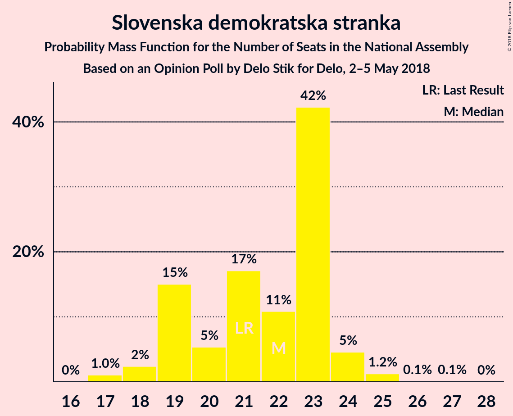

# Opinion Poll by Delo Stik for Delo, 2–5 May 2018

<a href="#voting-intentions">Voting Intentions</a> | <a href="#seats">Seats</a> | <a href="#coalitions">Coalitions</a> | <a href="#technical-information">Technical Information</a>

## Voting Intentions

### Confidence Intervals

| Party | Last Result | Poll Result | 80% Confidence Interval | 90% Confidence Interval | 95% Confidence Interval | 99% Confidence Interval |
|:-----:|:-----------:|:-----------:|:-----------------------:|:-----------------------:|:-----------------------:|:-----------------------:|
| Slovenska demokratska stranka | 20.7% | 21.8% | 20.1–23.8% |19.6–24.3% |19.2–24.8% |18.4–25.7% |
| Lista Marjana Šarca | 0.0% | 19.4% | 17.8–21.3% |17.3–21.8% |16.9–22.3% |16.1–23.2% |
| Socialni demokrati | 6.0% | 13.3% | 11.9–15.0% |11.5–15.4% |11.2–15.8% |10.5–16.6% |
| Levica | 6.0% | 8.2% | 7.1–9.5% |6.8–9.9% |6.5–10.2% |6.0–10.9% |
| Nova Slovenija–Krščanski demokrati | 5.6% | 7.2% | 6.2–8.5% |5.9–8.9% |5.6–9.2% |5.2–9.8% |
| Stranka modernega centra | 34.5% | 6.0% | 5.1–7.2% |4.8–7.5% |4.6–7.8% |4.2–8.4% |
| Demokratična stranka upokojencev Slovenije | 10.2% | 4.6% | 3.7–5.6% |3.5–5.9% |3.3–6.2% |3.0–6.8% |
| Stranka Alenke Bratušek | 4.4% | 3.8% | 3.1–4.8% |2.9–5.1% |2.7–5.4% |2.4–5.9% |
| Slovenska ljudska stranka | 4.0% | 2.8% | 2.1–3.6% |2.0–3.9% |1.8–4.1% |1.6–4.6% |
| Slovenska nacionalna stranka | 2.2% | 2.4% | 1.8–3.2% |1.7–3.5% |1.6–3.7% |1.3–4.1% |
| Glas za otroke in družine–Nova ljudska stranka Slovenije | 0.0% | 0.6% | 0.4–1.1% |0.3–1.3% |0.3–1.4% |0.2–1.7% |

*Note:* The poll result column reflects the actual value used in the calculations. Published results may vary slightly, and in addition be rounded to fewer digits.

## Seats

### Confidence Intervals

| Party | Last Result | Median | 80% Confidence Interval | 90% Confidence Interval | 95% Confidence Interval | 99% Confidence Interval |
|:-----:|:-----------:|:------:|:-----------------------:|:-----------------------:|:-----------------------:|:-----------------------:|
| <a href="#slovenska-demokratska-stranka">Slovenska demokratska stranka</a> | 21 | 21 | 19–23 |19–24 |18–24 |17–26 |
| <a href="#lista-marjana-šarca">Lista Marjana Šarca</a> | 0 | 19 | 17–21 |17–22 |16–22 |15–23 |
| <a href="#socialni-demokrati">Socialni demokrati</a> | 6 | 13 | 11–15 |11–15 |11–16 |10–16 |
| <a href="#levica">Levica</a> | 6 | 8 | 7–9 |6–9 |6–10 |5–11 |
| <a href="#nova-slovenija–krščanski-demokrati">Nova Slovenija–Krščanski demokrati</a> | 5 | 7 | 6–8 |5–8 |5–9 |5–10 |
| <a href="#stranka-modernega-centra">Stranka modernega centra</a> | 36 | 6 | 5–7 |4–7 |4–7 |4–8 |
| <a href="#demokratična-stranka-upokojencev-slovenije">Demokratična stranka upokojencev Slovenije</a> | 10 | 4 | 0–5 |0–6 |0–6 |0–6 |
| <a href="#stranka-alenke-bratušek">Stranka Alenke Bratušek</a> | 4 | 0 | 0–4 |0–5 |0–5 |0–5 |
| <a href="#slovenska-ljudska-stranka">Slovenska ljudska stranka</a> | 0 | 0 | 0 |0 |0–4 |0–4 |
| <a href="#slovenska-nacionalna-stranka">Slovenska nacionalna stranka</a> | 0 | 0 | 0 |0 |0 |0–4 |
| <a href="#glas-za-otroke-in-družine–nova-ljudska-stranka-slovenije">Glas za otroke in družine–Nova ljudska stranka Slovenije</a> | 0 | 0 | 0 |0 |0 |0 |

### Slovenska demokratska stranka

*For a full overview of the results for this party, see the [Slovenska demokratska stranka](party-slovenskademokratskastranka.html) page.*

| Number of Seats | Probability | Accumulated | Special Marks |
|:---------------:|:-----------:|:-----------:|:-------------:|
| 16 | 0.1% | 100% |  |
| 17 | 0.5% | 99.9% |  |
| 18 | 3% | 99.4% |  |
| 19 | 10% | 96% |  |
| 20 | 13% | 86% |  |
| 21 | 26% | 73% | Last Result, Median |
| 22 | 21% | 48% |  |
| 23 | 18% | 27% |  |
| 24 | 7% | 9% |  |
| 25 | 1.2% | 2% |  |
| 26 | 0.5% | 0.7% |  |
| 27 | 0.1% | 0.2% |  |
| 28 | 0% | 0% |  |

### Lista Marjana Šarca

*For a full overview of the results for this party, see the [Lista Marjana Šarca](party-listamarjanašarca.html) page.*

| Number of Seats | Probability | Accumulated | Special Marks |
|:---------------:|:-----------:|:-----------:|:-------------:|
| 0 | 0% | 100% | Last Result |
| 1 | 0% | 100% |  |
| 2 | 0% | 100% |  |
| 3 | 0% | 100% |  |
| 4 | 0% | 100% |  |
| 5 | 0% | 100% |  |
| 6 | 0% | 100% |  |
| 7 | 0% | 100% |  |
| 8 | 0% | 100% |  |
| 9 | 0% | 100% |  |
| 10 | 0% | 100% |  |
| 11 | 0% | 100% |  |
| 12 | 0% | 100% |  |
| 13 | 0% | 100% |  |
| 14 | 0.1% | 100% |  |
| 15 | 0.7% | 99.9% |  |
| 16 | 3% | 99.2% |  |
| 17 | 14% | 96% |  |
| 18 | 17% | 82% |  |
| 19 | 30% | 65% | Median |
| 20 | 20% | 35% |  |
| 21 | 9% | 14% |  |
| 22 | 4% | 6% |  |
| 23 | 1.4% | 2% |  |
| 24 | 0.2% | 0.2% |  |
| 25 | 0% | 0% |  |

### Socialni demokrati

*For a full overview of the results for this party, see the [Socialni demokrati](party-socialnidemokrati.html) page.*

| Number of Seats | Probability | Accumulated | Special Marks |
|:---------------:|:-----------:|:-----------:|:-------------:|
| 6 | 0% | 100% | Last Result |
| 7 | 0% | 100% |  |
| 8 | 0% | 100% |  |
| 9 | 0.2% | 100% |  |
| 10 | 2% | 99.8% |  |
| 11 | 11% | 98% |  |
| 12 | 23% | 87% |  |
| 13 | 31% | 65% | Median |
| 14 | 23% | 33% |  |
| 15 | 8% | 11% |  |
| 16 | 3% | 3% |  |
| 17 | 0.2% | 0.2% |  |
| 18 | 0% | 0% |  |

### Levica

*For a full overview of the results for this party, see the [Levica](party-levica.html) page.*

| Number of Seats | Probability | Accumulated | Special Marks |
|:---------------:|:-----------:|:-----------:|:-------------:|
| 5 | 0.6% | 100% |  |
| 6 | 9% | 99.3% | Last Result |
| 7 | 34% | 90% |  |
| 8 | 38% | 56% | Median |
| 9 | 15% | 19% |  |
| 10 | 3% | 4% |  |
| 11 | 0.6% | 0.6% |  |
| 12 | 0% | 0% |  |

### Nova Slovenija–Krščanski demokrati

*For a full overview of the results for this party, see the [Nova Slovenija–Krščanski demokrati](party-novaslovenija–krščanskidemokrati.html) page.*

| Number of Seats | Probability | Accumulated | Special Marks |
|:---------------:|:-----------:|:-----------:|:-------------:|
| 4 | 0.3% | 100% |  |
| 5 | 8% | 99.7% | Last Result |
| 6 | 32% | 92% |  |
| 7 | 36% | 60% | Median |
| 8 | 21% | 24% |  |
| 9 | 3% | 4% |  |
| 10 | 0.6% | 0.6% |  |
| 11 | 0% | 0% |  |

### Stranka modernega centra

*For a full overview of the results for this party, see the [Stranka modernega centra](party-strankamodernegacentra.html) page.*

| Number of Seats | Probability | Accumulated | Special Marks |
|:---------------:|:-----------:|:-----------:|:-------------:|
| 0 | 0.3% | 100% |  |
| 1 | 0% | 99.7% |  |
| 2 | 0% | 99.7% |  |
| 3 | 0.1% | 99.7% |  |
| 4 | 7% | 99.6% |  |
| 5 | 40% | 92% |  |
| 6 | 35% | 52% | Median |
| 7 | 15% | 17% |  |
| 8 | 1.2% | 1.4% |  |
| 9 | 0.1% | 0.1% |  |
| 10 | 0% | 0% |  |
| 11 | 0% | 0% |  |
| 12 | 0% | 0% |  |
| 13 | 0% | 0% |  |
| 14 | 0% | 0% |  |
| 15 | 0% | 0% |  |
| 16 | 0% | 0% |  |
| 17 | 0% | 0% |  |
| 18 | 0% | 0% |  |
| 19 | 0% | 0% |  |
| 20 | 0% | 0% |  |
| 21 | 0% | 0% |  |
| 22 | 0% | 0% |  |
| 23 | 0% | 0% |  |
| 24 | 0% | 0% |  |
| 25 | 0% | 0% |  |
| 26 | 0% | 0% |  |
| 27 | 0% | 0% |  |
| 28 | 0% | 0% |  |
| 29 | 0% | 0% |  |
| 30 | 0% | 0% |  |
| 31 | 0% | 0% |  |
| 32 | 0% | 0% |  |
| 33 | 0% | 0% |  |
| 34 | 0% | 0% |  |
| 35 | 0% | 0% |  |
| 36 | 0% | 0% | Last Result |

### Demokratična stranka upokojencev Slovenije

*For a full overview of the results for this party, see the [Demokratična stranka upokojencev Slovenije](party-demokratičnastrankaupokojencevslovenije.html) page.*

| Number of Seats | Probability | Accumulated | Special Marks |
|:---------------:|:-----------:|:-----------:|:-------------:|
| 0 | 27% | 100% |  |
| 1 | 0% | 73% |  |
| 2 | 0% | 73% |  |
| 3 | 2% | 73% |  |
| 4 | 45% | 71% | Median |
| 5 | 21% | 26% |  |
| 6 | 5% | 6% |  |
| 7 | 0.2% | 0.2% |  |
| 8 | 0% | 0% |  |
| 9 | 0% | 0% |  |
| 10 | 0% | 0% | Last Result |

### Stranka Alenke Bratušek

*For a full overview of the results for this party, see the [Stranka Alenke Bratušek](party-strankaalenkebratušek.html) page.*

| Number of Seats | Probability | Accumulated | Special Marks |
|:---------------:|:-----------:|:-----------:|:-------------:|
| 0 | 58% | 100% | Median |
| 1 | 0% | 42% |  |
| 2 | 0% | 42% |  |
| 3 | 4% | 42% |  |
| 4 | 33% | 38% | Last Result |
| 5 | 5% | 6% |  |
| 6 | 0.2% | 0.2% |  |
| 7 | 0% | 0% |  |

### Slovenska ljudska stranka

*For a full overview of the results for this party, see the [Slovenska ljudska stranka](party-slovenskaljudskastranka.html) page.*

| Number of Seats | Probability | Accumulated | Special Marks |
|:---------------:|:-----------:|:-----------:|:-------------:|
| 0 | 96% | 100% | Last Result, Median |
| 1 | 0% | 4% |  |
| 2 | 0% | 4% |  |
| 3 | 0.6% | 4% |  |
| 4 | 4% | 4% |  |
| 5 | 0.1% | 0.1% |  |
| 6 | 0% | 0% |  |

### Slovenska nacionalna stranka

*For a full overview of the results for this party, see the [Slovenska nacionalna stranka](party-slovenskanacionalnastranka.html) page.*

| Number of Seats | Probability | Accumulated | Special Marks |
|:---------------:|:-----------:|:-----------:|:-------------:|
| 0 | 99.3% | 100% | Last Result, Median |
| 1 | 0% | 0.7% |  |
| 2 | 0% | 0.7% |  |
| 3 | 0.1% | 0.7% |  |
| 4 | 0.6% | 0.6% |  |
| 5 | 0% | 0% |  |

### Glas za otroke in družine–Nova ljudska stranka Slovenije

*For a full overview of the results for this party, see the [Glas za otroke in družine–Nova ljudska stranka Slovenije](party-glaszaotrokeindružine–novaljudskastrankaslovenije.html) page.*

| Number of Seats | Probability | Accumulated | Special Marks |
|:---------------:|:-----------:|:-----------:|:-------------:|
| 0 | 100% | 100% | Last Result, Median |

## Coalitions

### Confidence Intervals

| Coalition | Last Result | Median | Majority? | 80% Confidence Interval | 90% Confidence Interval | 95% Confidence Interval | 99% Confidence Interval |
|:---------:|:-----------:|:------:|:---------:|:-----------------------:|:-----------------------:|:-----------------------:|:-----------------------:|
| Slovenska demokratska stranka – Lista Marjana Šarca – Demokratična stranka upokojencev Slovenije | 31 | 44 | 20% | 41–47 | 40–47 | 39–48 | 38–49 |
| Slovenska demokratska stranka – Lista Marjana Šarca | 21 | 40 | 0.8% | 38–43 | 37–44 | 36–45 | 35–46 |
| Lista Marjana Šarca – Socialni demokrati – Nova Slovenija–Krščanski demokrati | 11 | 39 | 0.1% | 36–42 | 35–42 | 35–43 | 34–44 |
| Lista Marjana Šarca – Socialni demokrati – Stranka modernega centra | 42 | 38 | 0% | 35–40 | 34–41 | 34–42 | 32–43 |
| Lista Marjana Šarca – Socialni demokrati – Demokratična stranka upokojencev Slovenije | 16 | 35 | 0% | 33–38 | 31–39 | 31–39 | 30–40 |
| Lista Marjana Šarca – Socialni demokrati | 6 | 32 | 0% | 29–34 | 29–36 | 28–36 | 27–37 |
| Socialni demokrati – Stranka modernega centra – Demokratična stranka upokojencev Slovenije | 52 | 22 | 0% | 19–24 | 18–25 | 17–26 | 17–26 |

### Slovenska demokratska stranka – Lista Marjana Šarca – Demokratična stranka upokojencev Slovenije

| Number of Seats | Probability | Accumulated | Special Marks |
|:---------------:|:-----------:|:-----------:|:-------------:|
| 31 | 0% | 100% | Last Result |
| 32 | 0% | 100% |  |
| 33 | 0% | 100% |  |
| 34 | 0% | 100% |  |
| 35 | 0% | 100% |  |
| 36 | 0.1% | 100% |  |
| 37 | 0.2% | 99.9% |  |
| 38 | 2% | 99.8% |  |
| 39 | 1.3% | 98% |  |
| 40 | 5% | 97% |  |
| 41 | 8% | 92% |  |
| 42 | 18% | 85% |  |
| 43 | 16% | 66% |  |
| 44 | 13% | 50% | Median |
| 45 | 17% | 37% |  |
| 46 | 9% | 20% | Majority |
| 47 | 7% | 11% |  |
| 48 | 2% | 3% |  |
| 49 | 0.7% | 1.0% |  |
| 50 | 0.2% | 0.3% |  |
| 51 | 0.1% | 0.1% |  |
| 52 | 0% | 0% |  |

### Slovenska demokratska stranka – Lista Marjana Šarca

| Number of Seats | Probability | Accumulated | Special Marks |
|:---------------:|:-----------:|:-----------:|:-------------:|
| 21 | 0% | 100% | Last Result |
| 22 | 0% | 100% |  |
| 23 | 0% | 100% |  |
| 24 | 0% | 100% |  |
| 25 | 0% | 100% |  |
| 26 | 0% | 100% |  |
| 27 | 0% | 100% |  |
| 28 | 0% | 100% |  |
| 29 | 0% | 100% |  |
| 30 | 0% | 100% |  |
| 31 | 0% | 100% |  |
| 32 | 0% | 100% |  |
| 33 | 0% | 100% |  |
| 34 | 0.1% | 100% |  |
| 35 | 0.6% | 99.8% |  |
| 36 | 2% | 99.2% |  |
| 37 | 6% | 97% |  |
| 38 | 14% | 91% |  |
| 39 | 13% | 77% |  |
| 40 | 16% | 64% | Median |
| 41 | 17% | 48% |  |
| 42 | 13% | 32% |  |
| 43 | 11% | 19% |  |
| 44 | 4% | 7% |  |
| 45 | 3% | 3% |  |
| 46 | 0.7% | 0.8% | Majority |
| 47 | 0.1% | 0.2% |  |
| 48 | 0% | 0% |  |

### Lista Marjana Šarca – Socialni demokrati – Nova Slovenija–Krščanski demokrati

| Number of Seats | Probability | Accumulated | Special Marks |
|:---------------:|:-----------:|:-----------:|:-------------:|
| 11 | 0% | 100% | Last Result |
| 12 | 0% | 100% |  |
| 13 | 0% | 100% |  |
| 14 | 0% | 100% |  |
| 15 | 0% | 100% |  |
| 16 | 0% | 100% |  |
| 17 | 0% | 100% |  |
| 18 | 0% | 100% |  |
| 19 | 0% | 100% |  |
| 20 | 0% | 100% |  |
| 21 | 0% | 100% |  |
| 22 | 0% | 100% |  |
| 23 | 0% | 100% |  |
| 24 | 0% | 100% |  |
| 25 | 0% | 100% |  |
| 26 | 0% | 100% |  |
| 27 | 0% | 100% |  |
| 28 | 0% | 100% |  |
| 29 | 0% | 100% |  |
| 30 | 0% | 100% |  |
| 31 | 0% | 100% |  |
| 32 | 0.1% | 100% |  |
| 33 | 0.3% | 99.9% |  |
| 34 | 1.4% | 99.5% |  |
| 35 | 4% | 98% |  |
| 36 | 10% | 94% |  |
| 37 | 15% | 84% |  |
| 38 | 16% | 68% |  |
| 39 | 13% | 52% | Median |
| 40 | 16% | 39% |  |
| 41 | 12% | 23% |  |
| 42 | 7% | 11% |  |
| 43 | 3% | 4% |  |
| 44 | 1.0% | 1.2% |  |
| 45 | 0.2% | 0.2% |  |
| 46 | 0% | 0.1% | Majority |
| 47 | 0% | 0% |  |

### Lista Marjana Šarca – Socialni demokrati – Stranka modernega centra

| Number of Seats | Probability | Accumulated | Special Marks |
|:---------------:|:-----------:|:-----------:|:-------------:|
| 31 | 0.1% | 100% |  |
| 32 | 0.5% | 99.8% |  |
| 33 | 2% | 99.3% |  |
| 34 | 4% | 98% |  |
| 35 | 11% | 93% |  |
| 36 | 18% | 82% |  |
| 37 | 13% | 65% |  |
| 38 | 17% | 52% | Median |
| 39 | 15% | 34% |  |
| 40 | 11% | 19% |  |
| 41 | 4% | 8% |  |
| 42 | 2% | 4% | Last Result |
| 43 | 2% | 2% |  |
| 44 | 0.1% | 0.2% |  |
| 45 | 0% | 0% |  |

### Lista Marjana Šarca – Socialni demokrati – Demokratična stranka upokojencev Slovenije

| Number of Seats | Probability | Accumulated | Special Marks |
|:---------------:|:-----------:|:-----------:|:-------------:|
| 16 | 0% | 100% | Last Result |
| 17 | 0% | 100% |  |
| 18 | 0% | 100% |  |
| 19 | 0% | 100% |  |
| 20 | 0% | 100% |  |
| 21 | 0% | 100% |  |
| 22 | 0% | 100% |  |
| 23 | 0% | 100% |  |
| 24 | 0% | 100% |  |
| 25 | 0% | 100% |  |
| 26 | 0% | 100% |  |
| 27 | 0% | 100% |  |
| 28 | 0% | 100% |  |
| 29 | 0.4% | 99.9% |  |
| 30 | 2% | 99.5% |  |
| 31 | 3% | 98% |  |
| 32 | 3% | 95% |  |
| 33 | 16% | 91% |  |
| 34 | 17% | 76% |  |
| 35 | 12% | 59% |  |
| 36 | 18% | 47% | Median |
| 37 | 17% | 30% |  |
| 38 | 7% | 13% |  |
| 39 | 3% | 5% |  |
| 40 | 2% | 2% |  |
| 41 | 0.4% | 0.5% |  |
| 42 | 0.1% | 0.1% |  |
| 43 | 0% | 0% |  |

### Lista Marjana Šarca – Socialni demokrati

| Number of Seats | Probability | Accumulated | Special Marks |
|:---------------:|:-----------:|:-----------:|:-------------:|
| 6 | 0% | 100% | Last Result |
| 7 | 0% | 100% |  |
| 8 | 0% | 100% |  |
| 9 | 0% | 100% |  |
| 10 | 0% | 100% |  |
| 11 | 0% | 100% |  |
| 12 | 0% | 100% |  |
| 13 | 0% | 100% |  |
| 14 | 0% | 100% |  |
| 15 | 0% | 100% |  |
| 16 | 0% | 100% |  |
| 17 | 0% | 100% |  |
| 18 | 0% | 100% |  |
| 19 | 0% | 100% |  |
| 20 | 0% | 100% |  |
| 21 | 0% | 100% |  |
| 22 | 0% | 100% |  |
| 23 | 0% | 100% |  |
| 24 | 0% | 100% |  |
| 25 | 0% | 100% |  |
| 26 | 0.2% | 100% |  |
| 27 | 0.9% | 99.8% |  |
| 28 | 2% | 98.9% |  |
| 29 | 8% | 97% |  |
| 30 | 15% | 90% |  |
| 31 | 18% | 75% |  |
| 32 | 14% | 57% | Median |
| 33 | 26% | 44% |  |
| 34 | 8% | 18% |  |
| 35 | 4% | 9% |  |
| 36 | 4% | 5% |  |
| 37 | 1.1% | 1.2% |  |
| 38 | 0.1% | 0.1% |  |
| 39 | 0% | 0% |  |

### Socialni demokrati – Stranka modernega centra – Demokratična stranka upokojencev Slovenije

| Number of Seats | Probability | Accumulated | Special Marks |
|:---------------:|:-----------:|:-----------:|:-------------:|
| 15 | 0.1% | 100% |  |
| 16 | 0.3% | 99.9% |  |
| 17 | 2% | 99.5% |  |
| 18 | 4% | 97% |  |
| 19 | 12% | 93% |  |
| 20 | 8% | 81% |  |
| 21 | 12% | 72% |  |
| 22 | 16% | 60% |  |
| 23 | 24% | 44% | Median |
| 24 | 11% | 20% |  |
| 25 | 6% | 9% |  |
| 26 | 2% | 3% |  |
| 27 | 0.4% | 0.4% |  |
| 28 | 0% | 0.1% |  |
| 29 | 0% | 0% |  |
| 30 | 0% | 0% |  |
| 31 | 0% | 0% |  |
| 32 | 0% | 0% |  |
| 33 | 0% | 0% |  |
| 34 | 0% | 0% |  |
| 35 | 0% | 0% |  |
| 36 | 0% | 0% |  |
| 37 | 0% | 0% |  |
| 38 | 0% | 0% |  |
| 39 | 0% | 0% |  |
| 40 | 0% | 0% |  |
| 41 | 0% | 0% |  |
| 42 | 0% | 0% |  |
| 43 | 0% | 0% |  |
| 44 | 0% | 0% |  |
| 45 | 0% | 0% |  |
| 46 | 0% | 0% | Majority |
| 47 | 0% | 0% |  |
| 48 | 0% | 0% |  |
| 49 | 0% | 0% |  |
| 50 | 0% | 0% |  |
| 51 | 0% | 0% |  |
| 52 | 0% | 0% | Last Result |

## Technical Information

### Opinion Poll

+ **Polling firm:** Delo Stik
+ **Commissioner(s):** Delo
+ **Fieldwork period:** 2–5 May 2018

### Calculations

+ **Sample size:** 833
+ **Simulations done:** 8,388,608
+ **Error estimate:** 1.66%

