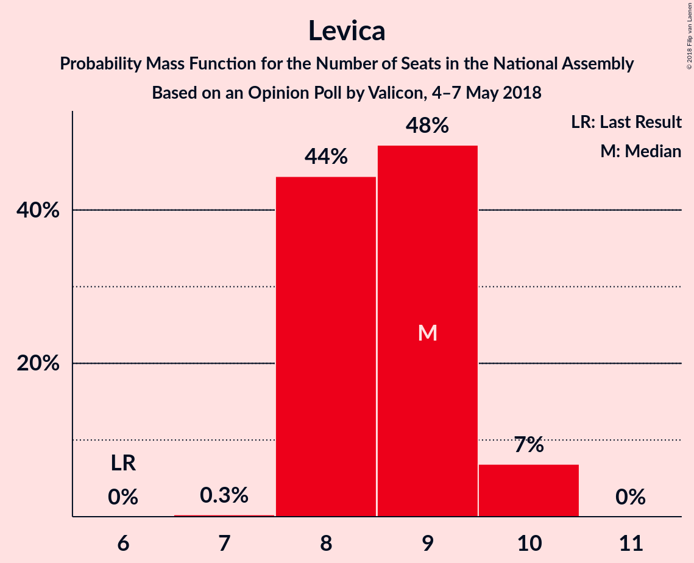
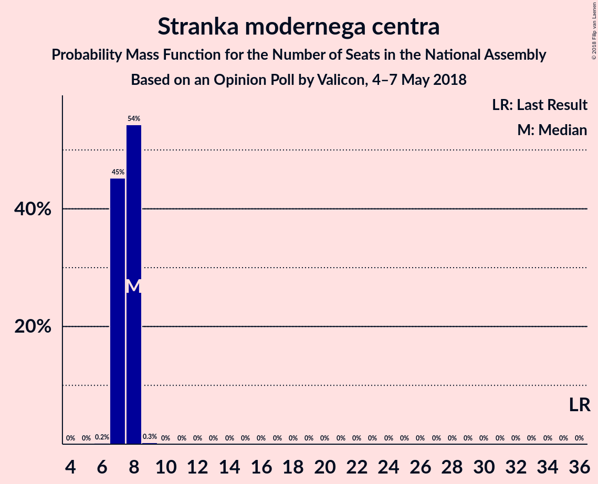
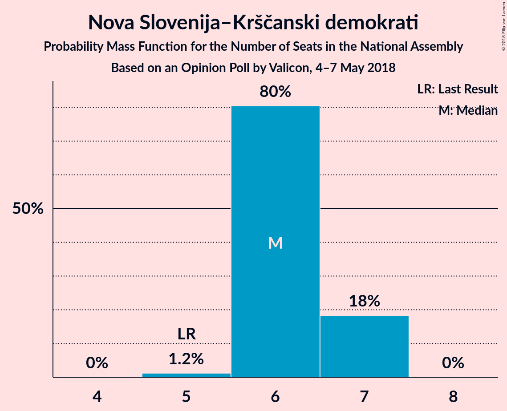
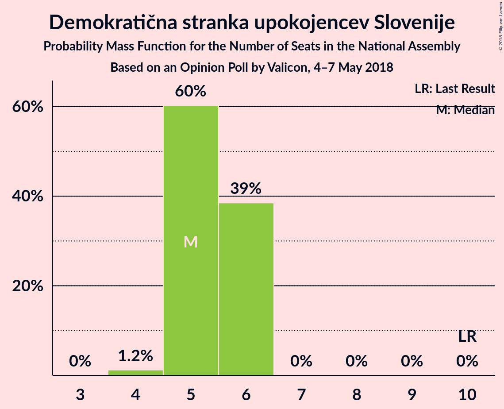

# Opinion Poll by Valicon, 4–7 May 2018

<a href="#voting-intentions">Voting Intentions</a> | <a href="#seats">Seats</a> | <a href="#coalitions">Coalitions</a> | <a href="#technical-information">Technical Information</a>

## Voting Intentions

### Confidence Intervals

| Party | Last Result | Poll Result | 80% Confidence Interval | 90% Confidence Interval | 95% Confidence Interval | 99% Confidence Interval |
|:-----:|:-----------:|:-----------:|:-----------------------:|:-----------------------:|:-----------------------:|:-----------------------:|
| Slovenska demokratska stranka | 20.7% | 18.2% | 17.6–18.9% |17.4–19.1% |17.2–19.3% |16.9–19.6% |
| Lista Marjana Šarca | 0.0% | 18.2% | 17.6–18.9% |17.4–19.1% |17.2–19.3% |16.9–19.6% |
| Socialni demokrati | 6.0% | 18.0% | 17.3–18.7% |17.1–18.9% |17.0–19.0% |16.7–19.3% |
| Levica | 6.0% | 9.0% | 8.5–9.5% |8.4–9.6% |8.2–9.8% |8.0–10.0% |
| Stranka modernega centra | 34.5% | 7.8% | 7.3–8.3% |7.2–8.4% |7.1–8.5% |6.9–8.8% |
| Nova Slovenija–Krščanski demokrati | 5.6% | 6.6% | 6.1–7.0% |6.0–7.1% |5.9–7.3% |5.7–7.5% |
| Demokratična stranka upokojencev Slovenije | 10.2% | 5.6% | 5.2–6.1% |5.1–6.2% |5.0–6.3% |4.9–6.5% |
| Stranka Alenke Bratušek | 4.4% | 3.8% | 3.4–4.1% |3.4–4.2% |3.3–4.3% |3.1–4.5% |
| Slovenska nacionalna stranka | 2.2% | 2.8% | 2.5–3.1% |2.5–3.2% |2.4–3.3% |2.3–3.5% |
| Slovenska ljudska stranka | 4.0% | 2.7% | 2.4–3.0% |2.3–3.1% |2.3–3.1% |2.1–3.3% |
| Glas za otroke in družine–Nova ljudska stranka Slovenije | 0.0% | 1.6% | 1.4–1.8% |1.3–1.9% |1.3–2.0% |1.2–2.1% |

*Note:* The poll result column reflects the actual value used in the calculations. Published results may vary slightly, and in addition be rounded to fewer digits.

## Seats

### Confidence Intervals

| Party | Last Result | Median | 80% Confidence Interval | 90% Confidence Interval | 95% Confidence Interval | 99% Confidence Interval |
|:-----:|:-----------:|:------:|:-----------------------:|:-----------------------:|:-----------------------:|:-----------------------:|
| <a href="#slovenska-demokratska-stranka">Slovenska demokratska stranka</a> | 21 | 18 | 17–19 |17–19 |17–19 |17–19 |
| <a href="#lista-marjana-šarca">Lista Marjana Šarca</a> | 0 | 18 | 18–19 |18–19 |18–19 |17–19 |
| <a href="#socialni-demokrati">Socialni demokrati</a> | 6 | 18 | 17–19 |17–19 |17–19 |16–19 |
| <a href="#levica">Levica</a> | 6 | 9 | 8–9 |8–9 |8–9 |8–9 |
| <a href="#stranka-modernega-centra">Stranka modernega centra</a> | 36 | 7 | 7–8 |7–8 |7–8 |7–8 |
| <a href="#nova-slovenija–krščanski-demokrati">Nova Slovenija–Krščanski demokrati</a> | 5 | 6 | 6–7 |6–7 |5–7 |5–7 |
| <a href="#demokratična-stranka-upokojencev-slovenije">Demokratična stranka upokojencev Slovenije</a> | 10 | 6 | 5–6 |5–6 |5–6 |5–6 |
| <a href="#stranka-alenke-bratušek">Stranka Alenke Bratušek</a> | 4 | 0 | 0 |0 |0–4 |0–4 |
| <a href="#slovenska-nacionalna-stranka">Slovenska nacionalna stranka</a> | 0 | 0 | 0 |0 |0 |0 |
| <a href="#slovenska-ljudska-stranka">Slovenska ljudska stranka</a> | 0 | 0 | 0 |0 |0 |0 |
| <a href="#glas-za-otroke-in-družine–nova-ljudska-stranka-slovenije">Glas za otroke in družine–Nova ljudska stranka Slovenije</a> | 0 | 0 | 0 |0 |0 |0 |

### Slovenska demokratska stranka

*For a full overview of the results for this party, see the [Slovenska demokratska stranka](party-slovenskademokratskastranka.html) page.*

| Number of Seats | Probability | Accumulated | Special Marks |
|:---------------:|:-----------:|:-----------:|:-------------:|
| 16 | 0.1% | 100% |  |
| 17 | 39% | 99.9% |  |
| 18 | 33% | 60% | Median |
| 19 | 27% | 28% |  |
| 20 | 0.4% | 0.4% |  |
| 21 | 0% | 0% | Last Result |

### Lista Marjana Šarca

*For a full overview of the results for this party, see the [Lista Marjana Šarca](party-listamarjanašarca.html) page.*

| Number of Seats | Probability | Accumulated | Special Marks |
|:---------------:|:-----------:|:-----------:|:-------------:|
| 0 | 0% | 100% | Last Result |
| 1 | 0% | 100% |  |
| 2 | 0% | 100% |  |
| 3 | 0% | 100% |  |
| 4 | 0% | 100% |  |
| 5 | 0% | 100% |  |
| 6 | 0% | 100% |  |
| 7 | 0% | 100% |  |
| 8 | 0% | 100% |  |
| 9 | 0% | 100% |  |
| 10 | 0% | 100% |  |
| 11 | 0% | 100% |  |
| 12 | 0% | 100% |  |
| 13 | 0% | 100% |  |
| 14 | 0% | 100% |  |
| 15 | 0% | 100% |  |
| 16 | 0% | 100% |  |
| 17 | 2% | 100% |  |
| 18 | 56% | 98% | Median |
| 19 | 42% | 42% |  |
| 20 | 0.1% | 0.1% |  |
| 21 | 0% | 0% |  |

### Socialni demokrati

*For a full overview of the results for this party, see the [Socialni demokrati](party-socialnidemokrati.html) page.*

| Number of Seats | Probability | Accumulated | Special Marks |
|:---------------:|:-----------:|:-----------:|:-------------:|
| 6 | 0% | 100% | Last Result |
| 7 | 0% | 100% |  |
| 8 | 0% | 100% |  |
| 9 | 0% | 100% |  |
| 10 | 0% | 100% |  |
| 11 | 0% | 100% |  |
| 12 | 0% | 100% |  |
| 13 | 0% | 100% |  |
| 14 | 0% | 100% |  |
| 15 | 0% | 100% |  |
| 16 | 0.8% | 100% |  |
| 17 | 42% | 99.2% |  |
| 18 | 29% | 57% | Median |
| 19 | 28% | 28% |  |
| 20 | 0% | 0% |  |

### Levica

*For a full overview of the results for this party, see the [Levica](party-levica.html) page.*

| Number of Seats | Probability | Accumulated | Special Marks |
|:---------------:|:-----------:|:-----------:|:-------------:|
| 6 | 0% | 100% | Last Result |
| 7 | 0.1% | 100% |  |
| 8 | 29% | 99.9% |  |
| 9 | 70% | 71% | Median |
| 10 | 0.4% | 0.4% |  |
| 11 | 0% | 0% |  |

### Stranka modernega centra

*For a full overview of the results for this party, see the [Stranka modernega centra](party-strankamodernegacentra.html) page.*

| Number of Seats | Probability | Accumulated | Special Marks |
|:---------------:|:-----------:|:-----------:|:-------------:|
| 7 | 61% | 100% | Median |
| 8 | 39% | 39% |  |
| 9 | 0.1% | 0.1% |  |
| 10 | 0% | 0% |  |
| 11 | 0% | 0% |  |
| 12 | 0% | 0% |  |
| 13 | 0% | 0% |  |
| 14 | 0% | 0% |  |
| 15 | 0% | 0% |  |
| 16 | 0% | 0% |  |
| 17 | 0% | 0% |  |
| 18 | 0% | 0% |  |
| 19 | 0% | 0% |  |
| 20 | 0% | 0% |  |
| 21 | 0% | 0% |  |
| 22 | 0% | 0% |  |
| 23 | 0% | 0% |  |
| 24 | 0% | 0% |  |
| 25 | 0% | 0% |  |
| 26 | 0% | 0% |  |
| 27 | 0% | 0% |  |
| 28 | 0% | 0% |  |
| 29 | 0% | 0% |  |
| 30 | 0% | 0% |  |
| 31 | 0% | 0% |  |
| 32 | 0% | 0% |  |
| 33 | 0% | 0% |  |
| 34 | 0% | 0% |  |
| 35 | 0% | 0% |  |
| 36 | 0% | 0% | Last Result |

### Nova Slovenija–Krščanski demokrati

*For a full overview of the results for this party, see the [Nova Slovenija–Krščanski demokrati](party-novaslovenija–krščanskidemokrati.html) page.*

| Number of Seats | Probability | Accumulated | Special Marks |
|:---------------:|:-----------:|:-----------:|:-------------:|
| 5 | 3% | 100% | Last Result |
| 6 | 66% | 97% | Median |
| 7 | 31% | 31% |  |
| 8 | 0% | 0% |  |

### Demokratična stranka upokojencev Slovenije

*For a full overview of the results for this party, see the [Demokratična stranka upokojencev Slovenije](party-demokratičnastrankaupokojencevslovenije.html) page.*

| Number of Seats | Probability | Accumulated | Special Marks |
|:---------------:|:-----------:|:-----------:|:-------------:|
| 4 | 0.2% | 100% |  |
| 5 | 36% | 99.8% |  |
| 6 | 64% | 64% | Median |
| 7 | 0% | 0% |  |
| 8 | 0% | 0% |  |
| 9 | 0% | 0% |  |
| 10 | 0% | 0% | Last Result |

### Stranka Alenke Bratušek

*For a full overview of the results for this party, see the [Stranka Alenke Bratušek](party-strankaalenkebratušek.html) page.*

| Number of Seats | Probability | Accumulated | Special Marks |
|:---------------:|:-----------:|:-----------:|:-------------:|
| 0 | 96% | 100% | Median |
| 1 | 0% | 4% |  |
| 2 | 0% | 4% |  |
| 3 | 0% | 4% |  |
| 4 | 4% | 4% | Last Result |
| 5 | 0% | 0% |  |

### Slovenska nacionalna stranka

*For a full overview of the results for this party, see the [Slovenska nacionalna stranka](party-slovenskanacionalnastranka.html) page.*

| Number of Seats | Probability | Accumulated | Special Marks |
|:---------------:|:-----------:|:-----------:|:-------------:|
| 0 | 100% | 100% | Last Result, Median |

### Slovenska ljudska stranka

*For a full overview of the results for this party, see the [Slovenska ljudska stranka](party-slovenskaljudskastranka.html) page.*

| Number of Seats | Probability | Accumulated | Special Marks |
|:---------------:|:-----------:|:-----------:|:-------------:|
| 0 | 100% | 100% | Last Result, Median |

### Glas za otroke in družine–Nova ljudska stranka Slovenije

*For a full overview of the results for this party, see the [Glas za otroke in družine–Nova ljudska stranka Slovenije](party-glaszaotrokeindružine–novaljudskastrankaslovenije.html) page.*

| Number of Seats | Probability | Accumulated | Special Marks |
|:---------------:|:-----------:|:-----------:|:-------------:|
| 0 | 100% | 100% | Last Result, Median |

## Coalitions

### Confidence Intervals

| Coalition | Last Result | Median | Majority? | 80% Confidence Interval | 90% Confidence Interval | 95% Confidence Interval | 99% Confidence Interval |
|:---------:|:-----------:|:------:|:---------:|:-----------------------:|:-----------------------:|:-----------------------:|:-----------------------:|
| Lista Marjana Šarca – Socialni demokrati – Stranka modernega centra – Nova Slovenija–Krščanski demokrati – Demokratična stranka upokojencev Slovenije | 57 | 56 | 100% | 55–56 | 55–56 | 53–56 | 53–57 |
| Lista Marjana Šarca – Socialni demokrati – Stranka modernega centra – Demokratična stranka upokojencev Slovenije – Stranka Alenke Bratušek | 56 | 49 | 100% | 49–50 | 49–50 | 48–52 | 48–52 |
| Lista Marjana Šarca – Socialni demokrati – Stranka modernega centra – Demokratična stranka upokojencev Slovenije | 52 | 49 | 100% | 49–50 | 48–50 | 48–50 | 46–50 |
| Lista Marjana Šarca – Socialni demokrati – Stranka modernega centra – Nova Slovenija–Krščanski demokrati | 47 | 50 | 100% | 50 | 49–50 | 48–50 | 48–52 |
| Lista Marjana Šarca – Socialni demokrati – Nova Slovenija–Krščanski demokrati – Demokratična stranka upokojencev Slovenije | 21 | 48 | 98.9% | 48–49 | 47–49 | 46–49 | 45–49 |
| Lista Marjana Šarca – Socialni demokrati – Stranka modernega centra | 42 | 44 | 0.1% | 43–44 | 43–44 | 43–44 | 41–45 |
| Lista Marjana Šarca – Socialni demokrati – Nova Slovenija–Krščanski demokrati | 11 | 43 | 0% | 42–43 | 41–43 | 41–43 | 40–44 |
| Lista Marjana Šarca – Slovenska demokratska stranka – Demokratična stranka upokojencev Slovenije | 31 | 42 | 0% | 42 | 41–42 | 41–42 | 39–43 |
| Lista Marjana Šarca – Socialni demokrati – Demokratična stranka upokojencev Slovenije | 16 | 42 | 0% | 42 | 41–42 | 41–42 | 39–42 |
| Lista Marjana Šarca – Slovenska demokratska stranka | 21 | 36 | 0% | 36–37 | 36–37 | 36–37 | 34–38 |
| Lista Marjana Šarca – Socialni demokrati | 6 | 36 | 0% | 36–37 | 36–37 | 36–37 | 34–37 |
| Socialni demokrati – Stranka modernega centra – Demokratična stranka upokojencev Slovenije | 52 | 31 | 0% | 31 | 29–31 | 29–31 | 29–32 |

### Lista Marjana Šarca – Socialni demokrati – Stranka modernega centra – Nova Slovenija–Krščanski demokrati – Demokratična stranka upokojencev Slovenije

| Number of Seats | Probability | Accumulated | Special Marks |
|:---------------:|:-----------:|:-----------:|:-------------:|
| 52 | 0.1% | 100% |  |
| 53 | 4% | 99.9% |  |
| 54 | 0.6% | 96% |  |
| 55 | 31% | 95% | Median |
| 56 | 64% | 65% |  |
| 57 | 0.5% | 0.6% | Last Result |
| 58 | 0% | 0% |  |

### Lista Marjana Šarca – Socialni demokrati – Stranka modernega centra – Demokratična stranka upokojencev Slovenije – Stranka Alenke Bratušek

| Number of Seats | Probability | Accumulated | Special Marks |
|:---------------:|:-----------:|:-----------:|:-------------:|
| 48 | 3% | 100% |  |
| 49 | 56% | 97% | Median |
| 50 | 37% | 41% |  |
| 51 | 1.1% | 4% |  |
| 52 | 3% | 3% |  |
| 53 | 0% | 0% |  |
| 54 | 0% | 0% |  |
| 55 | 0% | 0% |  |
| 56 | 0% | 0% | Last Result |

### Lista Marjana Šarca – Socialni demokrati – Stranka modernega centra – Demokratična stranka upokojencev Slovenije

| Number of Seats | Probability | Accumulated | Special Marks |
|:---------------:|:-----------:|:-----------:|:-------------:|
| 46 | 0.6% | 100% | Majority |
| 47 | 1.0% | 99.4% |  |
| 48 | 6% | 98% |  |
| 49 | 56% | 93% | Median |
| 50 | 37% | 37% |  |
| 51 | 0.1% | 0.2% |  |
| 52 | 0% | 0% | Last Result |

### Lista Marjana Šarca – Socialni demokrati – Stranka modernega centra – Nova Slovenija–Krščanski demokrati

| Number of Seats | Probability | Accumulated | Special Marks |
|:---------------:|:-----------:|:-----------:|:-------------:|
| 47 | 0.1% | 100% | Last Result |
| 48 | 4% | 99.9% |  |
| 49 | 1.1% | 96% | Median |
| 50 | 93% | 95% |  |
| 51 | 0.9% | 1.5% |  |
| 52 | 0.5% | 0.5% |  |
| 53 | 0% | 0% |  |

### Lista Marjana Šarca – Socialni demokrati – Nova Slovenija–Krščanski demokrati – Demokratična stranka upokojencev Slovenije

| Number of Seats | Probability | Accumulated | Special Marks |
|:---------------:|:-----------:|:-----------:|:-------------:|
| 21 | 0% | 100% | Last Result |
| 22 | 0% | 100% |  |
| 23 | 0% | 100% |  |
| 24 | 0% | 100% |  |
| 25 | 0% | 100% |  |
| 26 | 0% | 100% |  |
| 27 | 0% | 100% |  |
| 28 | 0% | 100% |  |
| 29 | 0% | 100% |  |
| 30 | 0% | 100% |  |
| 31 | 0% | 100% |  |
| 32 | 0% | 100% |  |
| 33 | 0% | 100% |  |
| 34 | 0% | 100% |  |
| 35 | 0% | 100% |  |
| 36 | 0% | 100% |  |
| 37 | 0% | 100% |  |
| 38 | 0% | 100% |  |
| 39 | 0% | 100% |  |
| 40 | 0% | 100% |  |
| 41 | 0% | 100% |  |
| 42 | 0% | 100% |  |
| 43 | 0% | 100% |  |
| 44 | 0% | 100% |  |
| 45 | 1.1% | 100% |  |
| 46 | 4% | 98.9% | Majority |
| 47 | 1.4% | 95% |  |
| 48 | 66% | 94% | Median |
| 49 | 28% | 28% |  |
| 50 | 0.1% | 0.1% |  |
| 51 | 0% | 0% |  |

### Lista Marjana Šarca – Socialni demokrati – Stranka modernega centra

| Number of Seats | Probability | Accumulated | Special Marks |
|:---------------:|:-----------:|:-----------:|:-------------:|
| 41 | 0.6% | 100% |  |
| 42 | 1.1% | 99.4% | Last Result |
| 43 | 34% | 98% | Median |
| 44 | 63% | 65% |  |
| 45 | 1.2% | 1.3% |  |
| 46 | 0.1% | 0.1% | Majority |
| 47 | 0% | 0% |  |

### Lista Marjana Šarca – Socialni demokrati – Nova Slovenija–Krščanski demokrati

| Number of Seats | Probability | Accumulated | Special Marks |
|:---------------:|:-----------:|:-----------:|:-------------:|
| 11 | 0% | 100% | Last Result |
| 12 | 0% | 100% |  |
| 13 | 0% | 100% |  |
| 14 | 0% | 100% |  |
| 15 | 0% | 100% |  |
| 16 | 0% | 100% |  |
| 17 | 0% | 100% |  |
| 18 | 0% | 100% |  |
| 19 | 0% | 100% |  |
| 20 | 0% | 100% |  |
| 21 | 0% | 100% |  |
| 22 | 0% | 100% |  |
| 23 | 0% | 100% |  |
| 24 | 0% | 100% |  |
| 25 | 0% | 100% |  |
| 26 | 0% | 100% |  |
| 27 | 0% | 100% |  |
| 28 | 0% | 100% |  |
| 29 | 0% | 100% |  |
| 30 | 0% | 100% |  |
| 31 | 0% | 100% |  |
| 32 | 0% | 100% |  |
| 33 | 0% | 100% |  |
| 34 | 0% | 100% |  |
| 35 | 0% | 100% |  |
| 36 | 0% | 100% |  |
| 37 | 0% | 100% |  |
| 38 | 0% | 100% |  |
| 39 | 0% | 100% |  |
| 40 | 1.1% | 100% |  |
| 41 | 4% | 98.9% |  |
| 42 | 36% | 95% | Median |
| 43 | 58% | 59% |  |
| 44 | 0.5% | 0.6% |  |
| 45 | 0% | 0% |  |

### Lista Marjana Šarca – Slovenska demokratska stranka – Demokratična stranka upokojencev Slovenije

| Number of Seats | Probability | Accumulated | Special Marks |
|:---------------:|:-----------:|:-----------:|:-------------:|
| 31 | 0% | 100% | Last Result |
| 32 | 0% | 100% |  |
| 33 | 0% | 100% |  |
| 34 | 0% | 100% |  |
| 35 | 0% | 100% |  |
| 36 | 0% | 100% |  |
| 37 | 0% | 100% |  |
| 38 | 0% | 100% |  |
| 39 | 0.7% | 100% |  |
| 40 | 1.3% | 99.3% |  |
| 41 | 4% | 98% |  |
| 42 | 94% | 94% | Median |
| 43 | 0.3% | 0.6% |  |
| 44 | 0.4% | 0.4% |  |
| 45 | 0% | 0% |  |

### Lista Marjana Šarca – Socialni demokrati – Demokratična stranka upokojencev Slovenije

| Number of Seats | Probability | Accumulated | Special Marks |
|:---------------:|:-----------:|:-----------:|:-------------:|
| 16 | 0% | 100% | Last Result |
| 17 | 0% | 100% |  |
| 18 | 0% | 100% |  |
| 19 | 0% | 100% |  |
| 20 | 0% | 100% |  |
| 21 | 0% | 100% |  |
| 22 | 0% | 100% |  |
| 23 | 0% | 100% |  |
| 24 | 0% | 100% |  |
| 25 | 0% | 100% |  |
| 26 | 0% | 100% |  |
| 27 | 0% | 100% |  |
| 28 | 0% | 100% |  |
| 29 | 0% | 100% |  |
| 30 | 0% | 100% |  |
| 31 | 0% | 100% |  |
| 32 | 0% | 100% |  |
| 33 | 0% | 100% |  |
| 34 | 0% | 100% |  |
| 35 | 0% | 100% |  |
| 36 | 0% | 100% |  |
| 37 | 0% | 100% |  |
| 38 | 0.5% | 100% |  |
| 39 | 0.7% | 99.5% |  |
| 40 | 0.6% | 98.8% |  |
| 41 | 7% | 98% |  |
| 42 | 91% | 92% | Median |
| 43 | 0.1% | 0.2% |  |
| 44 | 0% | 0% |  |

### Lista Marjana Šarca – Slovenska demokratska stranka

| Number of Seats | Probability | Accumulated | Special Marks |
|:---------------:|:-----------:|:-----------:|:-------------:|
| 21 | 0% | 100% | Last Result |
| 22 | 0% | 100% |  |
| 23 | 0% | 100% |  |
| 24 | 0% | 100% |  |
| 25 | 0% | 100% |  |
| 26 | 0% | 100% |  |
| 27 | 0% | 100% |  |
| 28 | 0% | 100% |  |
| 29 | 0% | 100% |  |
| 30 | 0% | 100% |  |
| 31 | 0% | 100% |  |
| 32 | 0% | 100% |  |
| 33 | 0% | 100% |  |
| 34 | 0.8% | 100% |  |
| 35 | 1.5% | 99.2% |  |
| 36 | 66% | 98% | Median |
| 37 | 31% | 31% |  |
| 38 | 0.6% | 0.6% |  |
| 39 | 0% | 0% |  |

### Lista Marjana Šarca – Socialni demokrati

| Number of Seats | Probability | Accumulated | Special Marks |
|:---------------:|:-----------:|:-----------:|:-------------:|
| 6 | 0% | 100% | Last Result |
| 7 | 0% | 100% |  |
| 8 | 0% | 100% |  |
| 9 | 0% | 100% |  |
| 10 | 0% | 100% |  |
| 11 | 0% | 100% |  |
| 12 | 0% | 100% |  |
| 13 | 0% | 100% |  |
| 14 | 0% | 100% |  |
| 15 | 0% | 100% |  |
| 16 | 0% | 100% |  |
| 17 | 0% | 100% |  |
| 18 | 0% | 100% |  |
| 19 | 0% | 100% |  |
| 20 | 0% | 100% |  |
| 21 | 0% | 100% |  |
| 22 | 0% | 100% |  |
| 23 | 0% | 100% |  |
| 24 | 0% | 100% |  |
| 25 | 0% | 100% |  |
| 26 | 0% | 100% |  |
| 27 | 0% | 100% |  |
| 28 | 0% | 100% |  |
| 29 | 0% | 100% |  |
| 30 | 0% | 100% |  |
| 31 | 0% | 100% |  |
| 32 | 0% | 100% |  |
| 33 | 0.5% | 100% |  |
| 34 | 0.7% | 99.5% |  |
| 35 | 1.2% | 98.8% |  |
| 36 | 69% | 98% | Median |
| 37 | 29% | 29% |  |
| 38 | 0% | 0% |  |

### Socialni demokrati – Stranka modernega centra – Demokratična stranka upokojencev Slovenije

| Number of Seats | Probability | Accumulated | Special Marks |
|:---------------:|:-----------:|:-----------:|:-------------:|
| 28 | 0.3% | 100% |  |
| 29 | 6% | 99.7% |  |
| 30 | 2% | 94% |  |
| 31 | 91% | 92% | Median |
| 32 | 0.8% | 0.9% |  |
| 33 | 0.2% | 0.2% |  |
| 34 | 0% | 0% |  |
| 35 | 0% | 0% |  |
| 36 | 0% | 0% |  |
| 37 | 0% | 0% |  |
| 38 | 0% | 0% |  |
| 39 | 0% | 0% |  |
| 40 | 0% | 0% |  |
| 41 | 0% | 0% |  |
| 42 | 0% | 0% |  |
| 43 | 0% | 0% |  |
| 44 | 0% | 0% |  |
| 45 | 0% | 0% |  |
| 46 | 0% | 0% | Majority |
| 47 | 0% | 0% |  |
| 48 | 0% | 0% |  |
| 49 | 0% | 0% |  |
| 50 | 0% | 0% |  |
| 51 | 0% | 0% |  |
| 52 | 0% | 0% | Last Result |

## Technical Information

### Opinion Poll

+ **Polling firm:** Valicon
+ **Commissioner(s):** —
+ **Fieldwork period:** 4–7 May 2018

### Calculations

+ **Sample size:** 5426
+ **Simulations done:** 65,536
+ **Error estimate:** 1.39%

