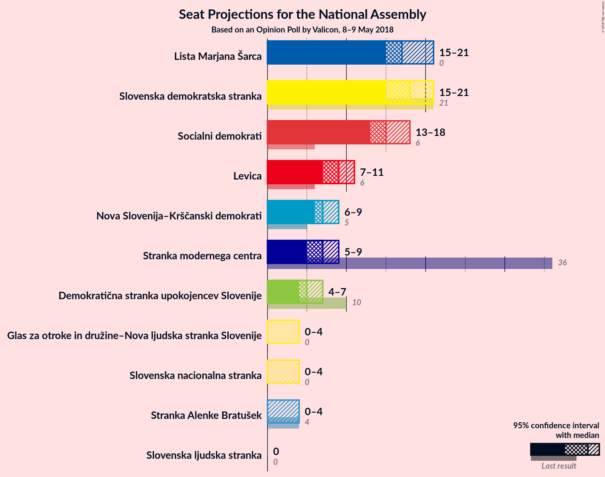
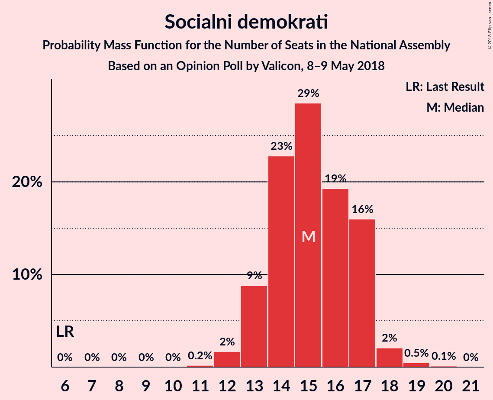
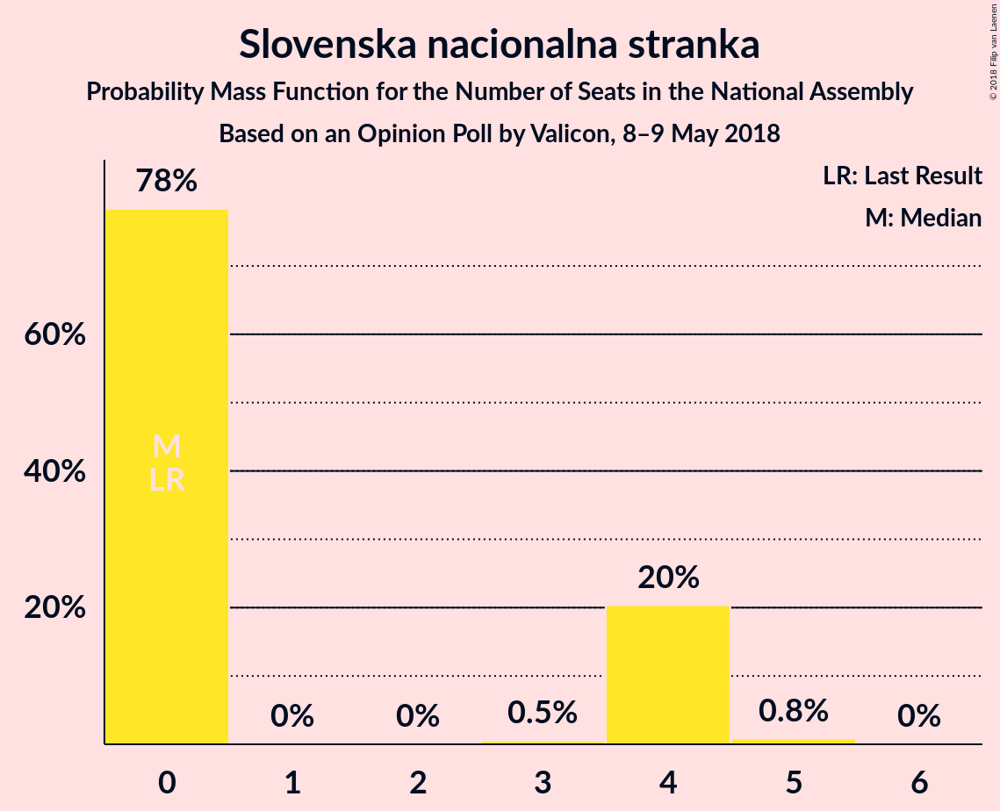
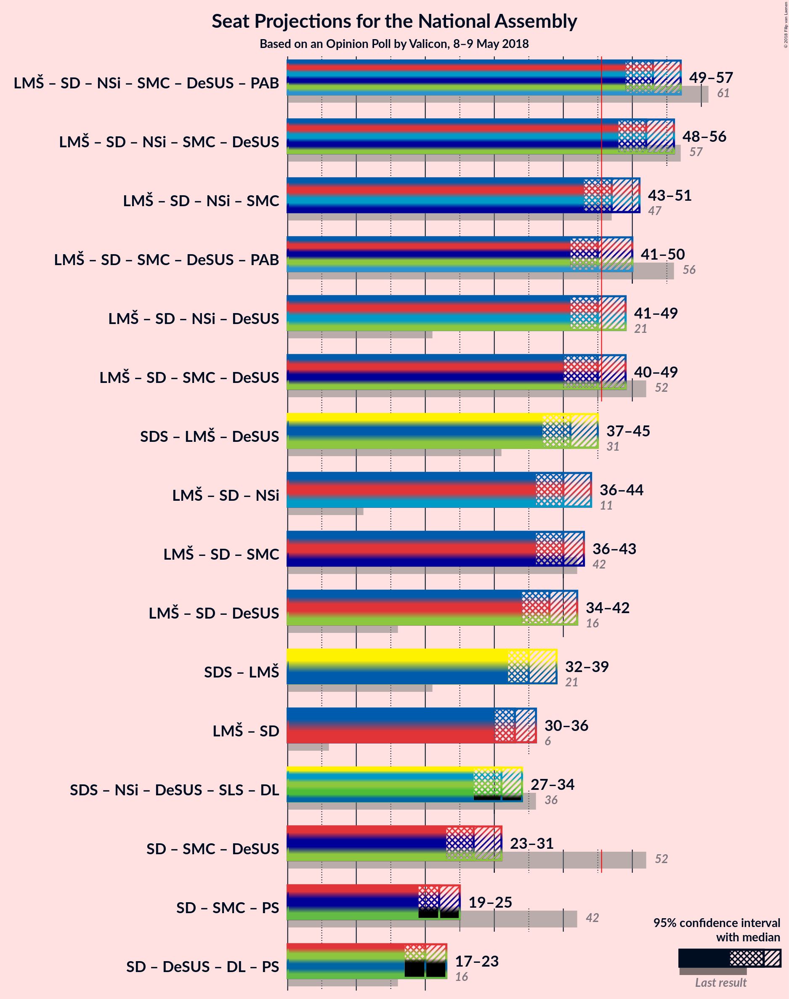

# Opinion Poll by Valicon, 8–9 May 2018

<a href="#voting-intentions">Voting Intentions</a> | <a href="#seats">Seats</a> | <a href="#coalitions">Coalitions</a> | <a href="#technical-information">Technical Information</a>

## Voting Intentions

### Confidence Intervals

| Party | Last Result | Poll Result | 80% Confidence Interval | 90% Confidence Interval | 95% Confidence Interval | 99% Confidence Interval |
|:-----:|:-----------:|:-----------:|:-----------------------:|:-----------------------:|:-----------------------:|:-----------------------:|
| Slovenska demokratska stranka | 20.7% | 18.2% | 16.5–20.0% |16.1–20.5% |15.7–21.0% |14.9–21.9% |
| Lista Marjana Šarca | 0.0% | 17.8% | 16.2–19.6% |15.7–20.1% |15.3–20.6% |14.6–21.5% |
| Socialni demokrati | 6.0% | 15.2% | 13.7–17.0% |13.3–17.5% |12.9–17.9% |12.2–18.7% |
| Levica | 6.0% | 9.3% | 8.1–10.8% |7.8–11.2% |7.5–11.5% |7.0–12.3% |
| Nova Slovenija–Krščanski demokrati | 5.6% | 7.7% | 6.7–9.1% |6.4–9.4% |6.1–9.8% |5.6–10.5% |
| Stranka modernega centra | 34.5% | 7.0% | 6.0–8.3% |5.7–8.7% |5.4–9.0% |5.0–9.6% |
| Demokratična stranka upokojencev Slovenije | 10.2% | 5.5% | 4.6–6.7% |4.4–7.0% |4.2–7.3% |3.8–7.9% |
| Stranka Alenke Bratušek | 4.4% | 3.3% | 2.6–4.3% |2.4–4.5% |2.3–4.8% |2.0–5.3% |
| Slovenska nacionalna stranka | 2.2% | 3.3% | 2.6–4.3% |2.4–4.5% |2.3–4.8% |2.0–5.3% |
| Glas za otroke in družine–Nova ljudska stranka Slovenije | 0.0% | 2.8% | 2.2–3.7% |2.0–4.0% |1.9–4.2% |1.6–4.7% |
| Slovenska ljudska stranka | 4.0% | 2.3% | 1.8–3.2% |1.6–3.4% |1.5–3.6% |1.3–4.1% |

*Note:* The poll result column reflects the actual value used in the calculations. Published results may vary slightly, and in addition be rounded to fewer digits.

## Seats

### Confidence Intervals

| Party | Last Result | Median | 80% Confidence Interval | 90% Confidence Interval | 95% Confidence Interval | 99% Confidence Interval |
|:-----:|:-----------:|:------:|:-----------------------:|:-----------------------:|:-----------------------:|:-----------------------:|
| <a href="#slovenska-demokratska-stranka">Slovenska demokratska stranka</a> | 21 | 18 | 16–20 |16–21 |15–21 |14–22 |
| <a href="#lista-marjana-šarca">Lista Marjana Šarca</a> | 0 | 17 | 16–20 |16–20 |15–20 |14–22 |
| <a href="#socialni-demokrati">Socialni demokrati</a> | 6 | 15 | 13–17 |13–17 |13–18 |12–19 |
| <a href="#levica">Levica</a> | 6 | 9 | 8–10 |7–11 |7–11 |7–12 |
| <a href="#nova-slovenija–krščanski-demokrati">Nova Slovenija–Krščanski demokrati</a> | 5 | 7 | 6–9 |6–9 |6–9 |5–10 |
| <a href="#stranka-modernega-centra">Stranka modernega centra</a> | 36 | 7 | 6–8 |5–8 |5–9 |5–9 |
| <a href="#demokratična-stranka-upokojencev-slovenije">Demokratična stranka upokojencev Slovenije</a> | 10 | 5 | 4–6 |4–7 |4–7 |0–8 |
| <a href="#stranka-alenke-bratušek">Stranka Alenke Bratušek</a> | 4 | 0 | 0–4 |0–4 |0–4 |0–5 |
| <a href="#slovenska-nacionalna-stranka">Slovenska nacionalna stranka</a> | 0 | 0 | 0–4 |0–4 |0–4 |0–5 |
| <a href="#glas-za-otroke-in-družine–nova-ljudska-stranka-slovenije">Glas za otroke in družine–Nova ljudska stranka Slovenije</a> | 0 | 0 | 0 |0 |0–4 |0–4 |
| <a href="#slovenska-ljudska-stranka">Slovenska ljudska stranka</a> | 0 | 0 | 0 |0 |0 |0–4 |

### Slovenska demokratska stranka

*For a full overview of the results for this party, see the [Slovenska demokratska stranka](party-slovenskademokratskastranka.html) page.*

| Number of Seats | Probability | Accumulated | Special Marks |
|:---------------:|:-----------:|:-----------:|:-------------:|
| 14 | 0.5% | 100% |  |
| 15 | 4% | 99.5% |  |
| 16 | 9% | 95% |  |
| 17 | 23% | 86% |  |
| 18 | 30% | 63% | Median |
| 19 | 18% | 33% |  |
| 20 | 9% | 16% |  |
| 21 | 5% | 6% | Last Result |
| 22 | 0.9% | 1.0% |  |
| 23 | 0.2% | 0.2% |  |
| 24 | 0% | 0% |  |

### Lista Marjana Šarca

*For a full overview of the results for this party, see the [Lista Marjana Šarca](party-listamarjanašarca.html) page.*

| Number of Seats | Probability | Accumulated | Special Marks |
|:---------------:|:-----------:|:-----------:|:-------------:|
| 0 | 0% | 100% | Last Result |
| 1 | 0% | 100% |  |
| 2 | 0% | 100% |  |
| 3 | 0% | 100% |  |
| 4 | 0% | 100% |  |
| 5 | 0% | 100% |  |
| 6 | 0% | 100% |  |
| 7 | 0% | 100% |  |
| 8 | 0% | 100% |  |
| 9 | 0% | 100% |  |
| 10 | 0% | 100% |  |
| 11 | 0% | 100% |  |
| 12 | 0% | 100% |  |
| 13 | 0.1% | 100% |  |
| 14 | 0.9% | 99.9% |  |
| 15 | 4% | 99.0% |  |
| 16 | 16% | 95% |  |
| 17 | 30% | 79% | Median |
| 18 | 23% | 49% |  |
| 19 | 13% | 26% |  |
| 20 | 10% | 13% |  |
| 21 | 2% | 2% |  |
| 22 | 0.6% | 0.7% |  |
| 23 | 0.1% | 0.1% |  |
| 24 | 0% | 0% |  |

### Socialni demokrati

*For a full overview of the results for this party, see the [Socialni demokrati](party-socialnidemokrati.html) page.*

| Number of Seats | Probability | Accumulated | Special Marks |
|:---------------:|:-----------:|:-----------:|:-------------:|
| 6 | 0% | 100% | Last Result |
| 7 | 0% | 100% |  |
| 8 | 0% | 100% |  |
| 9 | 0% | 100% |  |
| 10 | 0% | 100% |  |
| 11 | 0.2% | 100% |  |
| 12 | 2% | 99.7% |  |
| 13 | 11% | 98% |  |
| 14 | 25% | 87% |  |
| 15 | 28% | 62% | Median |
| 16 | 18% | 34% |  |
| 17 | 13% | 17% |  |
| 18 | 3% | 3% |  |
| 19 | 0.5% | 0.6% |  |
| 20 | 0.1% | 0.1% |  |
| 21 | 0% | 0% |  |

### Levica

*For a full overview of the results for this party, see the [Levica](party-levica.html) page.*

| Number of Seats | Probability | Accumulated | Special Marks |
|:---------------:|:-----------:|:-----------:|:-------------:|
| 6 | 0.4% | 100% | Last Result |
| 7 | 6% | 99.6% |  |
| 8 | 25% | 94% |  |
| 9 | 34% | 69% | Median |
| 10 | 26% | 35% |  |
| 11 | 8% | 9% |  |
| 12 | 1.3% | 1.4% |  |
| 13 | 0.1% | 0.1% |  |
| 14 | 0% | 0% |  |

### Nova Slovenija–Krščanski demokrati

*For a full overview of the results for this party, see the [Nova Slovenija–Krščanski demokrati](party-novaslovenija–krščanskidemokrati.html) page.*

| Number of Seats | Probability | Accumulated | Special Marks |
|:---------------:|:-----------:|:-----------:|:-------------:|
| 5 | 1.5% | 100% | Last Result |
| 6 | 13% | 98.5% |  |
| 7 | 40% | 85% | Median |
| 8 | 32% | 45% |  |
| 9 | 11% | 13% |  |
| 10 | 2% | 2% |  |
| 11 | 0.2% | 0.2% |  |
| 12 | 0% | 0% |  |

### Stranka modernega centra

*For a full overview of the results for this party, see the [Stranka modernega centra](party-strankamodernegacentra.html) page.*

| Number of Seats | Probability | Accumulated | Special Marks |
|:---------------:|:-----------:|:-----------:|:-------------:|
| 4 | 0.5% | 100% |  |
| 5 | 7% | 99.5% |  |
| 6 | 36% | 92% |  |
| 7 | 37% | 56% | Median |
| 8 | 15% | 19% |  |
| 9 | 3% | 3% |  |
| 10 | 0.3% | 0.3% |  |
| 11 | 0% | 0% |  |
| 12 | 0% | 0% |  |
| 13 | 0% | 0% |  |
| 14 | 0% | 0% |  |
| 15 | 0% | 0% |  |
| 16 | 0% | 0% |  |
| 17 | 0% | 0% |  |
| 18 | 0% | 0% |  |
| 19 | 0% | 0% |  |
| 20 | 0% | 0% |  |
| 21 | 0% | 0% |  |
| 22 | 0% | 0% |  |
| 23 | 0% | 0% |  |
| 24 | 0% | 0% |  |
| 25 | 0% | 0% |  |
| 26 | 0% | 0% |  |
| 27 | 0% | 0% |  |
| 28 | 0% | 0% |  |
| 29 | 0% | 0% |  |
| 30 | 0% | 0% |  |
| 31 | 0% | 0% |  |
| 32 | 0% | 0% |  |
| 33 | 0% | 0% |  |
| 34 | 0% | 0% |  |
| 35 | 0% | 0% |  |
| 36 | 0% | 0% | Last Result |

### Demokratična stranka upokojencev Slovenije

*For a full overview of the results for this party, see the [Demokratična stranka upokojencev Slovenije](party-demokratičnastrankaupokojencevslovenije.html) page.*

| Number of Seats | Probability | Accumulated | Special Marks |
|:---------------:|:-----------:|:-----------:|:-------------:|
| 0 | 2% | 100% |  |
| 1 | 0% | 98% |  |
| 2 | 0% | 98% |  |
| 3 | 0% | 98% |  |
| 4 | 19% | 98% |  |
| 5 | 41% | 79% | Median |
| 6 | 31% | 38% |  |
| 7 | 7% | 7% |  |
| 8 | 0.6% | 0.7% |  |
| 9 | 0% | 0% |  |
| 10 | 0% | 0% | Last Result |

### Stranka Alenke Bratušek

*For a full overview of the results for this party, see the [Stranka Alenke Bratušek](party-strankaalenkebratušek.html) page.*

| Number of Seats | Probability | Accumulated | Special Marks |
|:---------------:|:-----------:|:-----------:|:-------------:|
| 0 | 83% | 100% | Median |
| 1 | 0% | 17% |  |
| 2 | 0% | 17% |  |
| 3 | 0.4% | 17% |  |
| 4 | 15% | 16% | Last Result |
| 5 | 1.0% | 1.1% |  |
| 6 | 0% | 0% |  |

### Slovenska nacionalna stranka

*For a full overview of the results for this party, see the [Slovenska nacionalna stranka](party-slovenskanacionalnastranka.html) page.*

| Number of Seats | Probability | Accumulated | Special Marks |
|:---------------:|:-----------:|:-----------:|:-------------:|
| 0 | 78% | 100% | Last Result, Median |
| 1 | 0% | 22% |  |
| 2 | 0% | 22% |  |
| 3 | 0.8% | 22% |  |
| 4 | 20% | 21% |  |
| 5 | 0.8% | 0.8% |  |
| 6 | 0% | 0% |  |

### Glas za otroke in družine–Nova ljudska stranka Slovenije

*For a full overview of the results for this party, see the [Glas za otroke in družine–Nova ljudska stranka Slovenije](party-glaszaotrokeindružine–novaljudskastrankaslovenije.html) page.*

| Number of Seats | Probability | Accumulated | Special Marks |
|:---------------:|:-----------:|:-----------:|:-------------:|
| 0 | 96% | 100% | Last Result, Median |
| 1 | 0% | 4% |  |
| 2 | 0% | 4% |  |
| 3 | 0.3% | 4% |  |
| 4 | 4% | 4% |  |
| 5 | 0.1% | 0.1% |  |
| 6 | 0% | 0% |  |

### Slovenska ljudska stranka

*For a full overview of the results for this party, see the [Slovenska ljudska stranka](party-slovenskaljudskastranka.html) page.*

| Number of Seats | Probability | Accumulated | Special Marks |
|:---------------:|:-----------:|:-----------:|:-------------:|
| 0 | 99.4% | 100% | Last Result, Median |
| 1 | 0% | 0.6% |  |
| 2 | 0% | 0.6% |  |
| 3 | 0% | 0.6% |  |
| 4 | 0.5% | 0.5% |  |
| 5 | 0% | 0% |  |

## Coalitions

### Confidence Intervals

| Coalition | Last Result | Median | Majority? | 80% Confidence Interval | 90% Confidence Interval | 95% Confidence Interval | 99% Confidence Interval |
|:---------:|:-----------:|:------:|:---------:|:-----------------------:|:-----------------------:|:-----------------------:|:-----------------------:|
| Slovenska demokratska stranka – Lista Marjana Šarca – Demokratična stranka upokojencev Slovenije | 31 | 41 | 1.3% | 38–44 | 37–44 | 37–45 | 36–46 |
| Lista Marjana Šarca – Socialni demokrati – Nova Slovenija–Krščanski demokrati | 11 | 40 | 0.4% | 38–43 | 37–43 | 36–44 | 35–45 |
| Lista Marjana Šarca – Socialni demokrati – Stranka modernega centra | 42 | 39 | 0.2% | 37–42 | 36–43 | 36–43 | 34–45 |
| Lista Marjana Šarca – Socialni demokrati – Demokratična stranka upokojencev Slovenije | 16 | 38 | 0% | 36–40 | 35–41 | 34–42 | 32–43 |
| Slovenska demokratska stranka – Lista Marjana Šarca | 21 | 35 | 0% | 33–38 | 33–39 | 32–40 | 31–41 |
| Lista Marjana Šarca – Socialni demokrati | 6 | 33 | 0% | 30–35 | 30–36 | 29–36 | 28–38 |
| Socialni demokrati – Stranka modernega centra – Demokratična stranka upokojencev Slovenije | 52 | 27 | 0% | 25–29 | 24–30 | 23–31 | 22–31 |

### Slovenska demokratska stranka – Lista Marjana Šarca – Demokratična stranka upokojencev Slovenije

| Number of Seats | Probability | Accumulated | Special Marks |
|:---------------:|:-----------:|:-----------:|:-------------:|
| 31 | 0% | 100% | Last Result |
| 32 | 0% | 100% |  |
| 33 | 0% | 100% |  |
| 34 | 0.1% | 100% |  |
| 35 | 0.3% | 99.9% |  |
| 36 | 1.4% | 99.6% |  |
| 37 | 3% | 98% |  |
| 38 | 10% | 95% |  |
| 39 | 14% | 85% |  |
| 40 | 15% | 71% | Median |
| 41 | 19% | 56% |  |
| 42 | 14% | 37% |  |
| 43 | 12% | 23% |  |
| 44 | 7% | 12% |  |
| 45 | 4% | 5% |  |
| 46 | 1.0% | 1.3% | Majority |
| 47 | 0.3% | 0.3% |  |
| 48 | 0% | 0% |  |

### Lista Marjana Šarca – Socialni demokrati – Nova Slovenija–Krščanski demokrati

| Number of Seats | Probability | Accumulated | Special Marks |
|:---------------:|:-----------:|:-----------:|:-------------:|
| 11 | 0% | 100% | Last Result |
| 12 | 0% | 100% |  |
| 13 | 0% | 100% |  |
| 14 | 0% | 100% |  |
| 15 | 0% | 100% |  |
| 16 | 0% | 100% |  |
| 17 | 0% | 100% |  |
| 18 | 0% | 100% |  |
| 19 | 0% | 100% |  |
| 20 | 0% | 100% |  |
| 21 | 0% | 100% |  |
| 22 | 0% | 100% |  |
| 23 | 0% | 100% |  |
| 24 | 0% | 100% |  |
| 25 | 0% | 100% |  |
| 26 | 0% | 100% |  |
| 27 | 0% | 100% |  |
| 28 | 0% | 100% |  |
| 29 | 0% | 100% |  |
| 30 | 0% | 100% |  |
| 31 | 0% | 100% |  |
| 32 | 0% | 100% |  |
| 33 | 0% | 100% |  |
| 34 | 0.2% | 100% |  |
| 35 | 0.7% | 99.8% |  |
| 36 | 3% | 99.1% |  |
| 37 | 6% | 97% |  |
| 38 | 11% | 91% |  |
| 39 | 16% | 80% | Median |
| 40 | 22% | 64% |  |
| 41 | 19% | 41% |  |
| 42 | 12% | 23% |  |
| 43 | 7% | 11% |  |
| 44 | 3% | 4% |  |
| 45 | 1.4% | 2% |  |
| 46 | 0.3% | 0.4% | Majority |
| 47 | 0.1% | 0.1% |  |
| 48 | 0% | 0% |  |

### Lista Marjana Šarca – Socialni demokrati – Stranka modernega centra

| Number of Seats | Probability | Accumulated | Special Marks |
|:---------------:|:-----------:|:-----------:|:-------------:|
| 33 | 0.1% | 100% |  |
| 34 | 0.4% | 99.8% |  |
| 35 | 2% | 99.5% |  |
| 36 | 5% | 98% |  |
| 37 | 10% | 92% |  |
| 38 | 13% | 82% |  |
| 39 | 20% | 69% | Median |
| 40 | 22% | 48% |  |
| 41 | 13% | 26% |  |
| 42 | 7% | 13% | Last Result |
| 43 | 4% | 6% |  |
| 44 | 1.5% | 2% |  |
| 45 | 0.3% | 0.5% |  |
| 46 | 0.2% | 0.2% | Majority |
| 47 | 0% | 0% |  |

### Lista Marjana Šarca – Socialni demokrati – Demokratična stranka upokojencev Slovenije

| Number of Seats | Probability | Accumulated | Special Marks |
|:---------------:|:-----------:|:-----------:|:-------------:|
| 16 | 0% | 100% | Last Result |
| 17 | 0% | 100% |  |
| 18 | 0% | 100% |  |
| 19 | 0% | 100% |  |
| 20 | 0% | 100% |  |
| 21 | 0% | 100% |  |
| 22 | 0% | 100% |  |
| 23 | 0% | 100% |  |
| 24 | 0% | 100% |  |
| 25 | 0% | 100% |  |
| 26 | 0% | 100% |  |
| 27 | 0% | 100% |  |
| 28 | 0% | 100% |  |
| 29 | 0% | 100% |  |
| 30 | 0% | 100% |  |
| 31 | 0.1% | 99.9% |  |
| 32 | 0.4% | 99.8% |  |
| 33 | 0.9% | 99.4% |  |
| 34 | 3% | 98.5% |  |
| 35 | 5% | 95% |  |
| 36 | 13% | 90% |  |
| 37 | 20% | 77% | Median |
| 38 | 22% | 56% |  |
| 39 | 12% | 34% |  |
| 40 | 13% | 22% |  |
| 41 | 6% | 9% |  |
| 42 | 2% | 3% |  |
| 43 | 0.4% | 0.6% |  |
| 44 | 0.2% | 0.2% |  |
| 45 | 0% | 0% |  |

### Slovenska demokratska stranka – Lista Marjana Šarca

| Number of Seats | Probability | Accumulated | Special Marks |
|:---------------:|:-----------:|:-----------:|:-------------:|
| 21 | 0% | 100% | Last Result |
| 22 | 0% | 100% |  |
| 23 | 0% | 100% |  |
| 24 | 0% | 100% |  |
| 25 | 0% | 100% |  |
| 26 | 0% | 100% |  |
| 27 | 0% | 100% |  |
| 28 | 0% | 100% |  |
| 29 | 0% | 100% |  |
| 30 | 0.2% | 100% |  |
| 31 | 1.0% | 99.8% |  |
| 32 | 3% | 98.8% |  |
| 33 | 10% | 96% |  |
| 34 | 18% | 86% |  |
| 35 | 20% | 68% | Median |
| 36 | 14% | 48% |  |
| 37 | 13% | 34% |  |
| 38 | 11% | 21% |  |
| 39 | 7% | 10% |  |
| 40 | 2% | 3% |  |
| 41 | 0.8% | 1.0% |  |
| 42 | 0.1% | 0.2% |  |
| 43 | 0% | 0% |  |

### Lista Marjana Šarca – Socialni demokrati

| Number of Seats | Probability | Accumulated | Special Marks |
|:---------------:|:-----------:|:-----------:|:-------------:|
| 6 | 0% | 100% | Last Result |
| 7 | 0% | 100% |  |
| 8 | 0% | 100% |  |
| 9 | 0% | 100% |  |
| 10 | 0% | 100% |  |
| 11 | 0% | 100% |  |
| 12 | 0% | 100% |  |
| 13 | 0% | 100% |  |
| 14 | 0% | 100% |  |
| 15 | 0% | 100% |  |
| 16 | 0% | 100% |  |
| 17 | 0% | 100% |  |
| 18 | 0% | 100% |  |
| 19 | 0% | 100% |  |
| 20 | 0% | 100% |  |
| 21 | 0% | 100% |  |
| 22 | 0% | 100% |  |
| 23 | 0% | 100% |  |
| 24 | 0% | 100% |  |
| 25 | 0% | 100% |  |
| 26 | 0% | 100% |  |
| 27 | 0.2% | 100% |  |
| 28 | 0.6% | 99.8% |  |
| 29 | 2% | 99.1% |  |
| 30 | 8% | 97% |  |
| 31 | 17% | 89% |  |
| 32 | 16% | 72% | Median |
| 33 | 24% | 56% |  |
| 34 | 17% | 31% |  |
| 35 | 8% | 15% |  |
| 36 | 4% | 6% |  |
| 37 | 1.2% | 2% |  |
| 38 | 0.4% | 0.6% |  |
| 39 | 0.2% | 0.2% |  |
| 40 | 0% | 0% |  |

### Socialni demokrati – Stranka modernega centra – Demokratična stranka upokojencev Slovenije

| Number of Seats | Probability | Accumulated | Special Marks |
|:---------------:|:-----------:|:-----------:|:-------------:|
| 20 | 0.1% | 100% |  |
| 21 | 0.3% | 99.9% |  |
| 22 | 0.5% | 99.6% |  |
| 23 | 2% | 99.0% |  |
| 24 | 4% | 97% |  |
| 25 | 12% | 93% |  |
| 26 | 23% | 81% |  |
| 27 | 26% | 58% | Median |
| 28 | 13% | 33% |  |
| 29 | 12% | 19% |  |
| 30 | 5% | 8% |  |
| 31 | 2% | 3% |  |
| 32 | 0.3% | 0.5% |  |
| 33 | 0.1% | 0.1% |  |
| 34 | 0% | 0% |  |
| 35 | 0% | 0% |  |
| 36 | 0% | 0% |  |
| 37 | 0% | 0% |  |
| 38 | 0% | 0% |  |
| 39 | 0% | 0% |  |
| 40 | 0% | 0% |  |
| 41 | 0% | 0% |  |
| 42 | 0% | 0% |  |
| 43 | 0% | 0% |  |
| 44 | 0% | 0% |  |
| 45 | 0% | 0% |  |
| 46 | 0% | 0% | Majority |
| 47 | 0% | 0% |  |
| 48 | 0% | 0% |  |
| 49 | 0% | 0% |  |
| 50 | 0% | 0% |  |
| 51 | 0% | 0% |  |
| 52 | 0% | 0% | Last Result |

## Technical Information

### Opinion Poll

+ **Polling firm:** Valicon
+ **Commissioner(s):** —
+ **Fieldwork period:** 8–9 May 2018

### Calculations

+ **Sample size:** 814
+ **Simulations done:** 8,388,608
+ **Error estimate:** 1.20%

