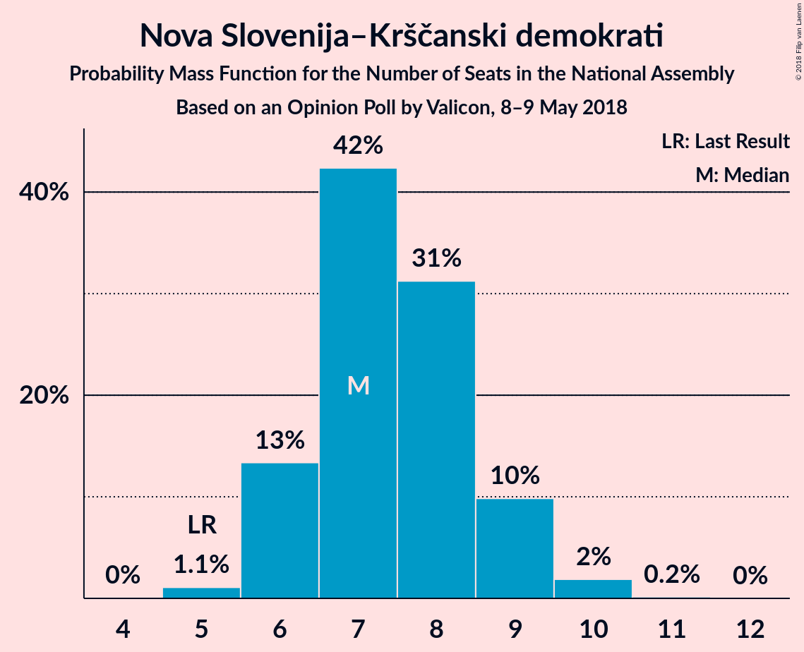
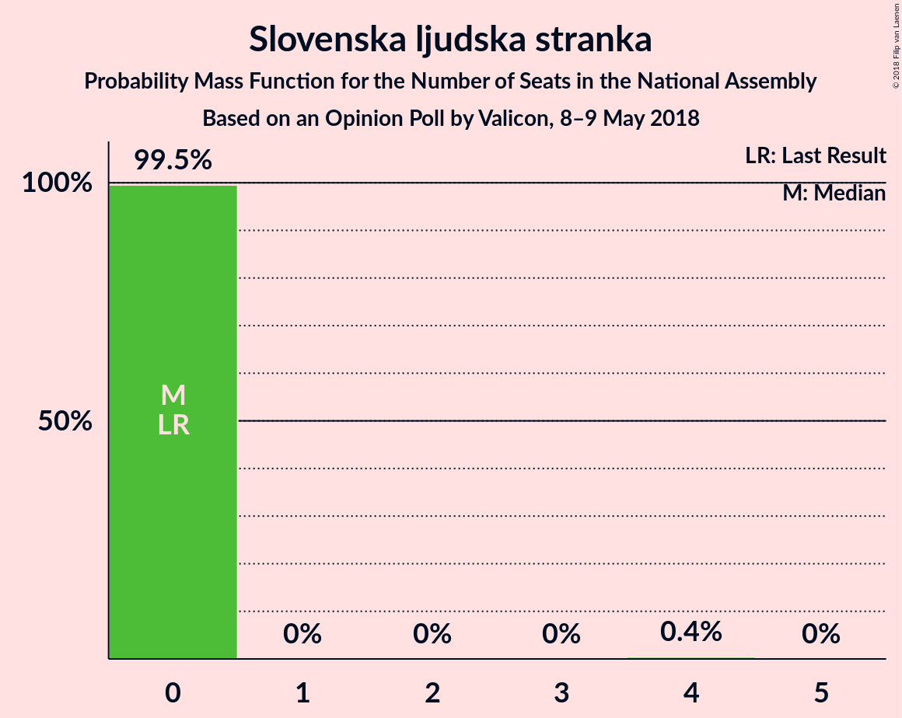

# Opinion Poll by Valicon, 8–9 May 2018

<a href="#voting-intentions">Voting Intentions</a> | <a href="#seats">Seats</a> | <a href="#coalitions">Coalitions</a> | <a href="#technical-information">Technical Information</a>

## Voting Intentions

### Confidence Intervals

| Party | Last Result | Poll Result | 80% Confidence Interval | 90% Confidence Interval | 95% Confidence Interval | 99% Confidence Interval |
|:-----:|:-----------:|:-----------:|:-----------------------:|:-----------------------:|:-----------------------:|:-----------------------:|
| Slovenska demokratska stranka | 20.7% | 18.2% | 16.5–20.0% |16.1–20.5% |15.7–21.0% |14.9–21.9% |
| Lista Marjana Šarca | 0.0% | 17.8% | 16.2–19.6% |15.7–20.1% |15.3–20.6% |14.6–21.5% |
| Socialni demokrati | 6.0% | 15.2% | 13.7–17.0% |13.3–17.5% |12.9–17.9% |12.2–18.7% |
| Levica | 6.0% | 9.3% | 8.1–10.8% |7.8–11.2% |7.5–11.5% |7.0–12.3% |
| Nova Slovenija–Krščanski demokrati | 5.6% | 7.7% | 6.7–9.1% |6.4–9.4% |6.1–9.8% |5.6–10.5% |
| Stranka modernega centra | 34.5% | 7.0% | 6.0–8.3% |5.7–8.7% |5.4–9.0% |5.0–9.6% |
| Demokratična stranka upokojencev Slovenije | 10.2% | 5.5% | 4.6–6.7% |4.4–7.0% |4.2–7.3% |3.8–7.9% |
| Stranka Alenke Bratušek | 4.4% | 3.3% | 2.6–4.3% |2.4–4.5% |2.3–4.8% |2.0–5.3% |
| Slovenska nacionalna stranka | 2.2% | 3.3% | 2.6–4.3% |2.4–4.5% |2.3–4.8% |2.0–5.3% |
| Glas za otroke in družine–Nova ljudska stranka Slovenije | 0.0% | 2.8% | 2.2–3.7% |2.0–4.0% |1.9–4.2% |1.6–4.7% |
| Slovenska ljudska stranka | 4.0% | 2.3% | 1.8–3.2% |1.6–3.4% |1.5–3.6% |1.3–4.1% |

*Note:* The poll result column reflects the actual value used in the calculations. Published results may vary slightly, and in addition be rounded to fewer digits.

## Seats

### Confidence Intervals

| Party | Last Result | Median | 80% Confidence Interval | 90% Confidence Interval | 95% Confidence Interval | 99% Confidence Interval |
|:-----:|:-----------:|:------:|:-----------------------:|:-----------------------:|:-----------------------:|:-----------------------:|
| <a href="#slovenska-demokratska-stranka">Slovenska demokratska stranka</a> | 21 | 18 | 17–19 |17–19 |17–19 |16–20 |
| <a href="#lista-marjana-šarca">Lista Marjana Šarca</a> | 0 | 18 | 16–18 |16–18 |16–18 |16–20 |
| <a href="#socialni-demokrati">Socialni demokrati</a> | 6 | 15 | 14–15 |14–15 |14–16 |13–19 |
| <a href="#levica">Levica</a> | 6 | 10 | 9–10 |9–10 |8–10 |7–11 |
| <a href="#nova-slovenija–krščanski-demokrati">Nova Slovenija–Krščanski demokrati</a> | 5 | 7 | 6–7 |6–8 |6–8 |6–9 |
| <a href="#stranka-modernega-centra">Stranka modernega centra</a> | 36 | 7 | 6–7 |6–7 |6–7 |5–8 |
| <a href="#demokratična-stranka-upokojencev-slovenije">Demokratična stranka upokojencev Slovenije</a> | 10 | 5 | 5–6 |5–6 |4–6 |4–6 |
| <a href="#stranka-alenke-bratušek">Stranka Alenke Bratušek</a> | 4 | 0 | 0–4 |0–4 |0–4 |0–4 |
| <a href="#slovenska-nacionalna-stranka">Slovenska nacionalna stranka</a> | 0 | 0 | 0–4 |0–4 |0–5 |0–5 |
| <a href="#glas-za-otroke-in-družine–nova-ljudska-stranka-slovenije">Glas za otroke in družine–Nova ljudska stranka Slovenije</a> | 0 | 0 | 0 |0 |0 |0 |
| <a href="#slovenska-ljudska-stranka">Slovenska ljudska stranka</a> | 0 | 0 | 0 |0 |0 |0 |

### Slovenska demokratska stranka

*For a full overview of the results for this party, see the [Slovenska demokratska stranka](party-slovenskademokratskastranka.html) page.*

| Number of Seats | Probability | Accumulated | Special Marks |
|:---------------:|:-----------:|:-----------:|:-------------:|
| 14 | 0.1% | 100% |  |
| 15 | 0.1% | 99.9% |  |
| 16 | 1.4% | 99.7% |  |
| 17 | 16% | 98% |  |
| 18 | 59% | 82% | Median |
| 19 | 21% | 22% |  |
| 20 | 0.8% | 1.0% |  |
| 21 | 0.1% | 0.2% | Last Result |
| 22 | 0% | 0.1% |  |
| 23 | 0% | 0% |  |

### Lista Marjana Šarca

*For a full overview of the results for this party, see the [Lista Marjana Šarca](party-listamarjanašarca.html) page.*

| Number of Seats | Probability | Accumulated | Special Marks |
|:---------------:|:-----------:|:-----------:|:-------------:|
| 0 | 0% | 100% | Last Result |
| 1 | 0% | 100% |  |
| 2 | 0% | 100% |  |
| 3 | 0% | 100% |  |
| 4 | 0% | 100% |  |
| 5 | 0% | 100% |  |
| 6 | 0% | 100% |  |
| 7 | 0% | 100% |  |
| 8 | 0% | 100% |  |
| 9 | 0% | 100% |  |
| 10 | 0% | 100% |  |
| 11 | 0% | 100% |  |
| 12 | 0% | 100% |  |
| 13 | 0% | 100% |  |
| 14 | 0.1% | 100% |  |
| 15 | 0.3% | 99.9% |  |
| 16 | 15% | 99.6% |  |
| 17 | 23% | 84% |  |
| 18 | 60% | 62% | Median |
| 19 | 1.2% | 2% |  |
| 20 | 0.4% | 0.6% |  |
| 21 | 0.1% | 0.2% |  |
| 22 | 0% | 0.1% |  |
| 23 | 0% | 0% |  |

### Socialni demokrati

*For a full overview of the results for this party, see the [Socialni demokrati](party-socialnidemokrati.html) page.*

| Number of Seats | Probability | Accumulated | Special Marks |
|:---------------:|:-----------:|:-----------:|:-------------:|
| 6 | 0% | 100% | Last Result |
| 7 | 0% | 100% |  |
| 8 | 0% | 100% |  |
| 9 | 0% | 100% |  |
| 10 | 0% | 100% |  |
| 11 | 0% | 100% |  |
| 12 | 0.1% | 100% |  |
| 13 | 2% | 99.9% |  |
| 14 | 22% | 98% |  |
| 15 | 74% | 77% | Median |
| 16 | 2% | 3% |  |
| 17 | 0.4% | 1.0% |  |
| 18 | 0.1% | 0.6% |  |
| 19 | 0.1% | 0.5% |  |
| 20 | 0.5% | 0.5% |  |
| 21 | 0% | 0% |  |

### Levica

*For a full overview of the results for this party, see the [Levica](party-levica.html) page.*

| Number of Seats | Probability | Accumulated | Special Marks |
|:---------------:|:-----------:|:-----------:|:-------------:|
| 6 | 0.1% | 100% | Last Result |
| 7 | 1.3% | 99.9% |  |
| 8 | 1.1% | 98.6% |  |
| 9 | 26% | 97% |  |
| 10 | 70% | 71% | Median |
| 11 | 1.0% | 1.4% |  |
| 12 | 0.4% | 0.4% |  |
| 13 | 0% | 0% |  |

### Nova Slovenija–Krščanski demokrati

*For a full overview of the results for this party, see the [Nova Slovenija–Krščanski demokrati](party-novaslovenija–krščanskidemokrati.html) page.*

| Number of Seats | Probability | Accumulated | Special Marks |
|:---------------:|:-----------:|:-----------:|:-------------:|
| 5 | 0.1% | 100% | Last Result |
| 6 | 22% | 99.9% |  |
| 7 | 72% | 78% | Median |
| 8 | 4% | 5% |  |
| 9 | 0.8% | 1.0% |  |
| 10 | 0.2% | 0.2% |  |
| 11 | 0% | 0% |  |

### Stranka modernega centra

*For a full overview of the results for this party, see the [Stranka modernega centra](party-strankamodernegacentra.html) page.*

| Number of Seats | Probability | Accumulated | Special Marks |
|:---------------:|:-----------:|:-----------:|:-------------:|
| 4 | 0.1% | 100% |  |
| 5 | 1.4% | 99.9% |  |
| 6 | 26% | 98.6% |  |
| 7 | 71% | 72% | Median |
| 8 | 1.1% | 2% |  |
| 9 | 0.4% | 0.4% |  |
| 10 | 0.1% | 0.1% |  |
| 11 | 0% | 0% |  |
| 12 | 0% | 0% |  |
| 13 | 0% | 0% |  |
| 14 | 0% | 0% |  |
| 15 | 0% | 0% |  |
| 16 | 0% | 0% |  |
| 17 | 0% | 0% |  |
| 18 | 0% | 0% |  |
| 19 | 0% | 0% |  |
| 20 | 0% | 0% |  |
| 21 | 0% | 0% |  |
| 22 | 0% | 0% |  |
| 23 | 0% | 0% |  |
| 24 | 0% | 0% |  |
| 25 | 0% | 0% |  |
| 26 | 0% | 0% |  |
| 27 | 0% | 0% |  |
| 28 | 0% | 0% |  |
| 29 | 0% | 0% |  |
| 30 | 0% | 0% |  |
| 31 | 0% | 0% |  |
| 32 | 0% | 0% |  |
| 33 | 0% | 0% |  |
| 34 | 0% | 0% |  |
| 35 | 0% | 0% |  |
| 36 | 0% | 0% | Last Result |

### Demokratična stranka upokojencev Slovenije

*For a full overview of the results for this party, see the [Demokratična stranka upokojencev Slovenije](party-demokratičnastrankaupokojencevslovenije.html) page.*

| Number of Seats | Probability | Accumulated | Special Marks |
|:---------------:|:-----------:|:-----------:|:-------------:|
| 0 | 0.1% | 100% |  |
| 1 | 0% | 99.9% |  |
| 2 | 0% | 99.9% |  |
| 3 | 0% | 99.9% |  |
| 4 | 5% | 99.9% |  |
| 5 | 73% | 95% | Median |
| 6 | 22% | 22% |  |
| 7 | 0.2% | 0.3% |  |
| 8 | 0% | 0% |  |
| 9 | 0% | 0% |  |
| 10 | 0% | 0% | Last Result |

### Stranka Alenke Bratušek

*For a full overview of the results for this party, see the [Stranka Alenke Bratušek](party-strankaalenkebratušek.html) page.*

| Number of Seats | Probability | Accumulated | Special Marks |
|:---------------:|:-----------:|:-----------:|:-------------:|
| 0 | 87% | 100% | Median |
| 1 | 0% | 13% |  |
| 2 | 0% | 13% |  |
| 3 | 0% | 13% |  |
| 4 | 13% | 13% | Last Result |
| 5 | 0.2% | 0.2% |  |
| 6 | 0% | 0% |  |

### Slovenska nacionalna stranka

*For a full overview of the results for this party, see the [Slovenska nacionalna stranka](party-slovenskanacionalnastranka.html) page.*

| Number of Seats | Probability | Accumulated | Special Marks |
|:---------------:|:-----------:|:-----------:|:-------------:|
| 0 | 73% | 100% | Last Result, Median |
| 1 | 0% | 27% |  |
| 2 | 0% | 27% |  |
| 3 | 1.0% | 27% |  |
| 4 | 23% | 26% |  |
| 5 | 3% | 3% |  |
| 6 | 0% | 0% |  |

### Glas za otroke in družine–Nova ljudska stranka Slovenije

*For a full overview of the results for this party, see the [Glas za otroke in družine–Nova ljudska stranka Slovenije](party-glaszaotrokeindružine–novaljudskastrankaslovenije.html) page.*

| Number of Seats | Probability | Accumulated | Special Marks |
|:---------------:|:-----------:|:-----------:|:-------------:|
| 0 | 99.7% | 100% | Last Result, Median |
| 1 | 0% | 0.3% |  |
| 2 | 0% | 0.3% |  |
| 3 | 0% | 0.3% |  |
| 4 | 0.2% | 0.3% |  |
| 5 | 0.1% | 0.1% |  |
| 6 | 0% | 0% |  |

### Slovenska ljudska stranka

*For a full overview of the results for this party, see the [Slovenska ljudska stranka](party-slovenskaljudskastranka.html) page.*

| Number of Seats | Probability | Accumulated | Special Marks |
|:---------------:|:-----------:|:-----------:|:-------------:|
| 0 | 100% | 100% | Last Result, Median |

## Coalitions

### Confidence Intervals

| Coalition | Last Result | Median | Majority? | 80% Confidence Interval | 90% Confidence Interval | 95% Confidence Interval | 99% Confidence Interval |
|:---------:|:-----------:|:------:|:---------:|:-----------------------:|:-----------------------:|:-----------------------:|:-----------------------:|
| Lista Marjana Šarca – Socialni demokrati – Nova Slovenija–Krščanski demokrati – Stranka modernega centra – Demokratična stranka upokojencev Slovenije – Stranka Alenke Bratušek | 61 | 52 | 100% | 49–54 | 49–54 | 49–54 | 49–55 |
| Lista Marjana Šarca – Socialni demokrati – Nova Slovenija–Krščanski demokrati – Stranka modernega centra – Demokratična stranka upokojencev Slovenije | 57 | 52 | 100% | 49–52 | 49–52 | 49–53 | 47–55 |
| Lista Marjana Šarca – Socialni demokrati – Nova Slovenija–Krščanski demokrati – Stranka modernega centra | 47 | 47 | 63% | 43–47 | 43–47 | 43–48 | 42–49 |
| Lista Marjana Šarca – Socialni demokrati – Stranka modernega centra – Demokratična stranka upokojencev Slovenije – Stranka Alenke Bratušek | 56 | 45 | 14% | 43–47 | 43–47 | 41–47 | 41–48 |
| Lista Marjana Šarca – Socialni demokrati – Nova Slovenija–Krščanski demokrati – Demokratična stranka upokojencev Slovenije | 21 | 45 | 3% | 43–45 | 43–45 | 43–46 | 42–49 |
| Lista Marjana Šarca – Socialni demokrati – Stranka modernega centra – Demokratična stranka upokojencev Slovenije | 52 | 45 | 2% | 43–45 | 43–45 | 41–45 | 41–48 |
| Slovenska demokratska stranka – Lista Marjana Šarca – Demokratična stranka upokojencev Slovenije | 31 | 41 | 0% | 38–42 | 38–42 | 37–42 | 37–43 |
| Lista Marjana Šarca – Socialni demokrati – Nova Slovenija–Krščanski demokrati | 11 | 40 | 0.1% | 37–40 | 37–40 | 37–41 | 37–43 |
| Lista Marjana Šarca – Socialni demokrati – Stranka modernega centra | 42 | 40 | 0% | 37–40 | 37–40 | 37–40 | 36–42 |
| Lista Marjana Šarca – Socialni demokrati – Demokratična stranka upokojencev Slovenije | 16 | 38 | 0% | 36–38 | 36–38 | 35–38 | 35–42 |
| Slovenska demokratska stranka – Lista Marjana Šarca | 21 | 36 | 0% | 33–36 | 33–36 | 33–36 | 33–38 |
| Lista Marjana Šarca – Socialni demokrati | 6 | 33 | 0% | 31–33 | 31–33 | 31–33 | 30–36 |
| Socialni demokrati – Stranka modernega centra – Demokratična stranka upokojencev Slovenije | 52 | 27 | 0% | 26–27 | 26–27 | 25–27 | 23–32 |

### Lista Marjana Šarca – Socialni demokrati – Nova Slovenija–Krščanski demokrati – Stranka modernega centra – Demokratična stranka upokojencev Slovenije – Stranka Alenke Bratušek

| Number of Seats | Probability | Accumulated | Special Marks |
|:---------------:|:-----------:|:-----------:|:-------------:|
| 48 | 0.1% | 100% |  |
| 49 | 24% | 99.9% |  |
| 50 | 0.2% | 76% |  |
| 51 | 2% | 76% |  |
| 52 | 59% | 73% | Median |
| 53 | 0.9% | 15% |  |
| 54 | 12% | 14% |  |
| 55 | 0.8% | 1.1% |  |
| 56 | 0.1% | 0.3% |  |
| 57 | 0.2% | 0.2% |  |
| 58 | 0% | 0% |  |
| 59 | 0% | 0% |  |
| 60 | 0% | 0% |  |
| 61 | 0% | 0% | Last Result |

### Lista Marjana Šarca – Socialni demokrati – Nova Slovenija–Krščanski demokrati – Stranka modernega centra – Demokratična stranka upokojencev Slovenije

| Number of Seats | Probability | Accumulated | Special Marks |
|:---------------:|:-----------:|:-----------:|:-------------:|
| 46 | 0.1% | 100% | Majority |
| 47 | 1.0% | 99.9% |  |
| 48 | 0.1% | 98.9% |  |
| 49 | 24% | 98.8% |  |
| 50 | 12% | 75% |  |
| 51 | 1.2% | 63% |  |
| 52 | 59% | 62% | Median |
| 53 | 0.9% | 3% |  |
| 54 | 0.8% | 2% |  |
| 55 | 0.7% | 0.9% |  |
| 56 | 0.1% | 0.2% |  |
| 57 | 0.2% | 0.2% | Last Result |
| 58 | 0% | 0% |  |

### Lista Marjana Šarca – Socialni demokrati – Nova Slovenija–Krščanski demokrati – Stranka modernega centra

| Number of Seats | Probability | Accumulated | Special Marks |
|:---------------:|:-----------:|:-----------:|:-------------:|
| 41 | 0.1% | 100% |  |
| 42 | 1.0% | 99.9% |  |
| 43 | 21% | 98.9% |  |
| 44 | 0.3% | 78% |  |
| 45 | 15% | 78% |  |
| 46 | 0.4% | 63% | Majority |
| 47 | 60% | 62% | Last Result, Median |
| 48 | 1.0% | 3% |  |
| 49 | 1.4% | 2% |  |
| 50 | 0.1% | 0.4% |  |
| 51 | 0.1% | 0.2% |  |
| 52 | 0% | 0.2% |  |
| 53 | 0.2% | 0.2% |  |
| 54 | 0% | 0% |  |

### Lista Marjana Šarca – Socialni demokrati – Stranka modernega centra – Demokratična stranka upokojencev Slovenije – Stranka Alenke Bratušek

| Number of Seats | Probability | Accumulated | Special Marks |
|:---------------:|:-----------:|:-----------:|:-------------:|
| 40 | 0.2% | 100% |  |
| 41 | 3% | 99.7% |  |
| 42 | 0.1% | 97% |  |
| 43 | 22% | 97% |  |
| 44 | 0.9% | 75% |  |
| 45 | 60% | 74% | Median |
| 46 | 0.5% | 14% | Majority |
| 47 | 12% | 13% |  |
| 48 | 0.9% | 1.2% |  |
| 49 | 0.2% | 0.3% |  |
| 50 | 0% | 0% |  |
| 51 | 0% | 0% |  |
| 52 | 0% | 0% |  |
| 53 | 0% | 0% |  |
| 54 | 0% | 0% |  |
| 55 | 0% | 0% |  |
| 56 | 0% | 0% | Last Result |

### Lista Marjana Šarca – Socialni demokrati – Nova Slovenija–Krščanski demokrati – Demokratična stranka upokojencev Slovenije

| Number of Seats | Probability | Accumulated | Special Marks |
|:---------------:|:-----------:|:-----------:|:-------------:|
| 21 | 0% | 100% | Last Result |
| 22 | 0% | 100% |  |
| 23 | 0% | 100% |  |
| 24 | 0% | 100% |  |
| 25 | 0% | 100% |  |
| 26 | 0% | 100% |  |
| 27 | 0% | 100% |  |
| 28 | 0% | 100% |  |
| 29 | 0% | 100% |  |
| 30 | 0% | 100% |  |
| 31 | 0% | 100% |  |
| 32 | 0% | 100% |  |
| 33 | 0% | 100% |  |
| 34 | 0% | 100% |  |
| 35 | 0% | 100% |  |
| 36 | 0% | 100% |  |
| 37 | 0% | 100% |  |
| 38 | 0% | 100% |  |
| 39 | 0% | 100% |  |
| 40 | 0.1% | 100% |  |
| 41 | 0.1% | 99.9% |  |
| 42 | 1.3% | 99.8% |  |
| 43 | 36% | 98.6% |  |
| 44 | 0.6% | 63% |  |
| 45 | 59% | 62% | Median |
| 46 | 1.4% | 3% | Majority |
| 47 | 0.3% | 1.4% |  |
| 48 | 0.6% | 1.2% |  |
| 49 | 0.5% | 0.6% |  |
| 50 | 0.1% | 0.1% |  |
| 51 | 0% | 0% |  |

### Lista Marjana Šarca – Socialni demokrati – Stranka modernega centra – Demokratična stranka upokojencev Slovenije

| Number of Seats | Probability | Accumulated | Special Marks |
|:---------------:|:-----------:|:-----------:|:-------------:|
| 39 | 0.1% | 100% |  |
| 40 | 0.3% | 99.9% |  |
| 41 | 4% | 99.6% |  |
| 42 | 0.1% | 96% |  |
| 43 | 33% | 95% |  |
| 44 | 1.0% | 62% |  |
| 45 | 59% | 61% | Median |
| 46 | 0.6% | 2% | Majority |
| 47 | 0.8% | 2% |  |
| 48 | 0.6% | 0.8% |  |
| 49 | 0.2% | 0.2% |  |
| 50 | 0% | 0% |  |
| 51 | 0% | 0% |  |
| 52 | 0% | 0% | Last Result |

### Slovenska demokratska stranka – Lista Marjana Šarca – Demokratična stranka upokojencev Slovenije

| Number of Seats | Probability | Accumulated | Special Marks |
|:---------------:|:-----------:|:-----------:|:-------------:|
| 31 | 0% | 100% | Last Result |
| 32 | 0% | 100% |  |
| 33 | 0% | 100% |  |
| 34 | 0% | 100% |  |
| 35 | 0.1% | 100% |  |
| 36 | 0.1% | 99.9% |  |
| 37 | 3% | 99.8% |  |
| 38 | 12% | 96% |  |
| 39 | 0.8% | 84% |  |
| 40 | 1.0% | 83% |  |
| 41 | 60% | 82% | Median |
| 42 | 21% | 22% |  |
| 43 | 0.5% | 0.8% |  |
| 44 | 0.1% | 0.3% |  |
| 45 | 0.2% | 0.2% |  |
| 46 | 0% | 0% | Majority |

### Lista Marjana Šarca – Socialni demokrati – Nova Slovenija–Krščanski demokrati

| Number of Seats | Probability | Accumulated | Special Marks |
|:---------------:|:-----------:|:-----------:|:-------------:|
| 11 | 0% | 100% | Last Result |
| 12 | 0% | 100% |  |
| 13 | 0% | 100% |  |
| 14 | 0% | 100% |  |
| 15 | 0% | 100% |  |
| 16 | 0% | 100% |  |
| 17 | 0% | 100% |  |
| 18 | 0% | 100% |  |
| 19 | 0% | 100% |  |
| 20 | 0% | 100% |  |
| 21 | 0% | 100% |  |
| 22 | 0% | 100% |  |
| 23 | 0% | 100% |  |
| 24 | 0% | 100% |  |
| 25 | 0% | 100% |  |
| 26 | 0% | 100% |  |
| 27 | 0% | 100% |  |
| 28 | 0% | 100% |  |
| 29 | 0% | 100% |  |
| 30 | 0% | 100% |  |
| 31 | 0% | 100% |  |
| 32 | 0% | 100% |  |
| 33 | 0% | 100% |  |
| 34 | 0% | 100% |  |
| 35 | 0% | 100% |  |
| 36 | 0.1% | 99.9% |  |
| 37 | 22% | 99.9% |  |
| 38 | 12% | 78% |  |
| 39 | 3% | 66% |  |
| 40 | 59% | 62% | Median |
| 41 | 2% | 4% |  |
| 42 | 0.3% | 1.3% |  |
| 43 | 0.8% | 1.0% |  |
| 44 | 0.1% | 0.2% |  |
| 45 | 0% | 0.1% |  |
| 46 | 0.1% | 0.1% | Majority |
| 47 | 0% | 0% |  |

### Lista Marjana Šarca – Socialni demokrati – Stranka modernega centra

| Number of Seats | Probability | Accumulated | Special Marks |
|:---------------:|:-----------:|:-----------:|:-------------:|
| 34 | 0% | 100% |  |
| 35 | 0.3% | 99.9% |  |
| 36 | 1.0% | 99.7% |  |
| 37 | 24% | 98.6% |  |
| 38 | 12% | 75% |  |
| 39 | 1.4% | 63% |  |
| 40 | 59% | 61% | Median |
| 41 | 0.7% | 2% |  |
| 42 | 1.2% | 2% | Last Result |
| 43 | 0.2% | 0.4% |  |
| 44 | 0.2% | 0.2% |  |
| 45 | 0% | 0% |  |

### Lista Marjana Šarca – Socialni demokrati – Demokratična stranka upokojencev Slovenije

| Number of Seats | Probability | Accumulated | Special Marks |
|:---------------:|:-----------:|:-----------:|:-------------:|
| 16 | 0% | 100% | Last Result |
| 17 | 0% | 100% |  |
| 18 | 0% | 100% |  |
| 19 | 0% | 100% |  |
| 20 | 0% | 100% |  |
| 21 | 0% | 100% |  |
| 22 | 0% | 100% |  |
| 23 | 0% | 100% |  |
| 24 | 0% | 100% |  |
| 25 | 0% | 100% |  |
| 26 | 0% | 100% |  |
| 27 | 0% | 100% |  |
| 28 | 0% | 100% |  |
| 29 | 0% | 100% |  |
| 30 | 0% | 100% |  |
| 31 | 0% | 100% |  |
| 32 | 0% | 100% |  |
| 33 | 0.1% | 100% |  |
| 34 | 0.3% | 99.9% |  |
| 35 | 3% | 99.6% |  |
| 36 | 13% | 96% |  |
| 37 | 23% | 84% |  |
| 38 | 59% | 61% | Median |
| 39 | 0.9% | 2% |  |
| 40 | 0.4% | 1.3% |  |
| 41 | 0.3% | 0.9% |  |
| 42 | 0.5% | 0.6% |  |
| 43 | 0% | 0% |  |

### Slovenska demokratska stranka – Lista Marjana Šarca

| Number of Seats | Probability | Accumulated | Special Marks |
|:---------------:|:-----------:|:-----------:|:-------------:|
| 21 | 0% | 100% | Last Result |
| 22 | 0% | 100% |  |
| 23 | 0% | 100% |  |
| 24 | 0% | 100% |  |
| 25 | 0% | 100% |  |
| 26 | 0% | 100% |  |
| 27 | 0% | 100% |  |
| 28 | 0% | 100% |  |
| 29 | 0% | 100% |  |
| 30 | 0% | 100% |  |
| 31 | 0.1% | 100% |  |
| 32 | 0% | 99.9% |  |
| 33 | 16% | 99.8% |  |
| 34 | 1.3% | 84% |  |
| 35 | 0.9% | 83% |  |
| 36 | 81% | 82% | Median |
| 37 | 0.2% | 1.2% |  |
| 38 | 0.7% | 1.0% |  |
| 39 | 0.2% | 0.3% |  |
| 40 | 0.1% | 0.1% |  |
| 41 | 0% | 0% |  |

### Lista Marjana Šarca – Socialni demokrati

| Number of Seats | Probability | Accumulated | Special Marks |
|:---------------:|:-----------:|:-----------:|:-------------:|
| 6 | 0% | 100% | Last Result |
| 7 | 0% | 100% |  |
| 8 | 0% | 100% |  |
| 9 | 0% | 100% |  |
| 10 | 0% | 100% |  |
| 11 | 0% | 100% |  |
| 12 | 0% | 100% |  |
| 13 | 0% | 100% |  |
| 14 | 0% | 100% |  |
| 15 | 0% | 100% |  |
| 16 | 0% | 100% |  |
| 17 | 0% | 100% |  |
| 18 | 0% | 100% |  |
| 19 | 0% | 100% |  |
| 20 | 0% | 100% |  |
| 21 | 0% | 100% |  |
| 22 | 0% | 100% |  |
| 23 | 0% | 100% |  |
| 24 | 0% | 100% |  |
| 25 | 0% | 100% |  |
| 26 | 0% | 100% |  |
| 27 | 0% | 100% |  |
| 28 | 0% | 100% |  |
| 29 | 0.3% | 99.9% |  |
| 30 | 0.3% | 99.6% |  |
| 31 | 37% | 99.4% |  |
| 32 | 0.6% | 63% |  |
| 33 | 60% | 62% | Median |
| 34 | 1.1% | 2% |  |
| 35 | 0.4% | 1.3% |  |
| 36 | 0.7% | 0.9% |  |
| 37 | 0% | 0.1% |  |
| 38 | 0.1% | 0.1% |  |
| 39 | 0% | 0% |  |

### Socialni demokrati – Stranka modernega centra – Demokratična stranka upokojencev Slovenije

| Number of Seats | Probability | Accumulated | Special Marks |
|:---------------:|:-----------:|:-----------:|:-------------:|
| 23 | 1.0% | 100% |  |
| 24 | 0.4% | 98.9% |  |
| 25 | 3% | 98% |  |
| 26 | 22% | 95% |  |
| 27 | 71% | 73% | Median |
| 28 | 0.9% | 2% |  |
| 29 | 0.2% | 1.0% |  |
| 30 | 0.1% | 0.8% |  |
| 31 | 0.2% | 0.7% |  |
| 32 | 0.5% | 0.5% |  |
| 33 | 0% | 0% |  |
| 34 | 0% | 0% |  |
| 35 | 0% | 0% |  |
| 36 | 0% | 0% |  |
| 37 | 0% | 0% |  |
| 38 | 0% | 0% |  |
| 39 | 0% | 0% |  |
| 40 | 0% | 0% |  |
| 41 | 0% | 0% |  |
| 42 | 0% | 0% |  |
| 43 | 0% | 0% |  |
| 44 | 0% | 0% |  |
| 45 | 0% | 0% |  |
| 46 | 0% | 0% | Majority |
| 47 | 0% | 0% |  |
| 48 | 0% | 0% |  |
| 49 | 0% | 0% |  |
| 50 | 0% | 0% |  |
| 51 | 0% | 0% |  |
| 52 | 0% | 0% | Last Result |

## Technical Information

### Opinion Poll

+ **Polling firm:** Valicon
+ **Commissioner(s):** —
+ **Fieldwork period:** 8–9 May 2018

### Calculations

+ **Sample size:** 814
+ **Simulations done:** 131,072
+ **Error estimate:** 2.03%

