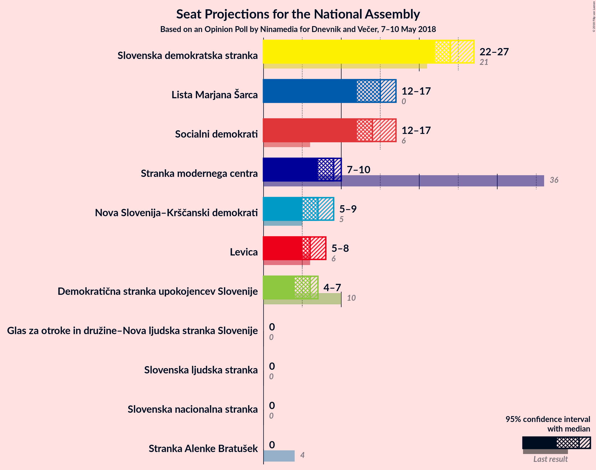
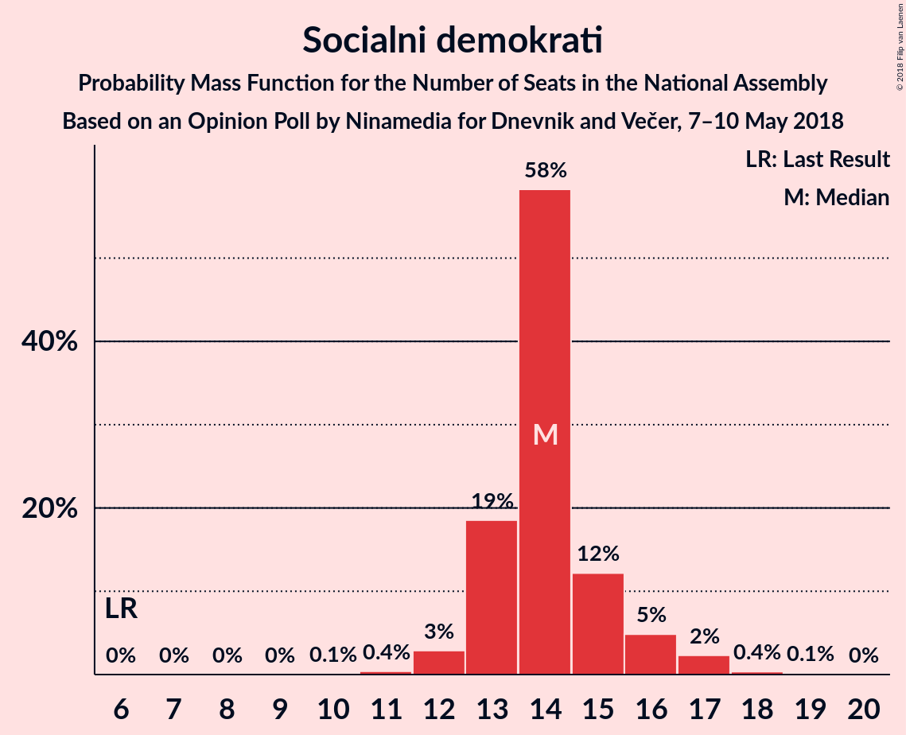
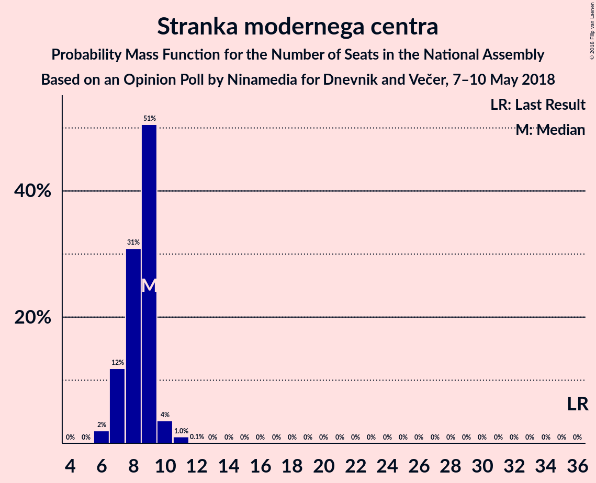
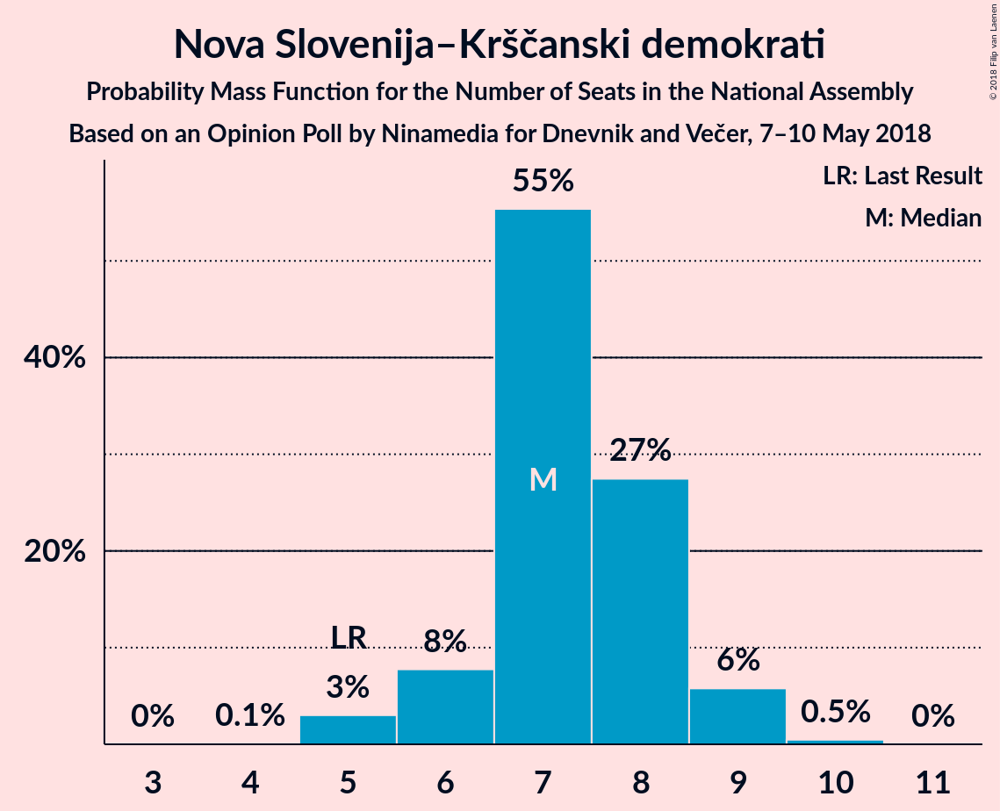

# Opinion Poll by Ninamedia for Dnevnik and Večer, 7–10 May 2018

<a href="#voting-intentions">Voting Intentions</a> | <a href="#seats">Seats</a> | <a href="#coalitions">Coalitions</a> | <a href="#technical-information">Technical Information</a>

## Voting Intentions

### Confidence Intervals

| Party | Last Result | Poll Result | 80% Confidence Interval | 90% Confidence Interval | 95% Confidence Interval | 99% Confidence Interval |
|:-----:|:-----------:|:-----------:|:-----------------------:|:-----------------------:|:-----------------------:|:-----------------------:|
| Slovenska demokratska stranka | 20.7% | 25.9% | 23.9–28.0% |23.3–28.6% |22.9–29.1% |21.9–30.1% |
| Lista Marjana Šarca | 0.0% | 15.8% | 14.2–17.6% |13.7–18.1% |13.4–18.6% |12.6–19.5% |
| Socialni demokrati | 6.0% | 15.3% | 13.7–17.1% |13.2–17.6% |12.9–18.0% |12.1–18.9% |
| Stranka modernega centra | 34.5% | 8.9% | 7.7–10.3% |7.3–10.8% |7.1–11.1% |6.5–11.9% |
| Nova Slovenija–Krščanski demokrati | 5.6% | 7.6% | 6.4–8.9% |6.1–9.3% |5.9–9.7% |5.4–10.4% |
| Levica | 6.0% | 6.6% | 5.6–7.9% |5.3–8.3% |5.1–8.6% |4.6–9.3% |
| Demokratična stranka upokojencev Slovenije | 10.2% | 6.4% | 5.3–7.7% |5.1–8.0% |4.8–8.4% |4.4–9.0% |
| Stranka Alenke Bratušek | 4.4% | 2.0% | 1.5–2.8% |1.3–3.0% |1.2–3.3% |1.0–3.7% |
| Slovenska ljudska stranka | 4.0% | 2.0% | 1.5–2.8% |1.3–3.0% |1.2–3.3% |1.0–3.7% |
| Slovenska nacionalna stranka | 2.2% | 1.7% | 1.2–2.5% |1.1–2.7% |1.0–2.9% |0.8–3.4% |
| Glas za otroke in družine–Nova ljudska stranka Slovenije | 0.0% | 0.1% | 0.1–0.5% |0.0–0.6% |0.0–0.7% |0.0–1.0% |

*Note:* The poll result column reflects the actual value used in the calculations. Published results may vary slightly, and in addition be rounded to fewer digits.

## Seats

### Confidence Intervals

| Party | Last Result | Median | 80% Confidence Interval | 90% Confidence Interval | 95% Confidence Interval | 99% Confidence Interval |
|:-----:|:-----------:|:------:|:-----------------------:|:-----------------------:|:-----------------------:|:-----------------------:|
| <a href="#slovenska-demokratska-stranka">Slovenska demokratska stranka</a> | 21 | 24 | 24–25 |24–25 |24–26 |21–27 |
| <a href="#lista-marjana-šarca">Lista Marjana Šarca</a> | 0 | 15 | 14–15 |14–15 |14–16 |13–17 |
| <a href="#socialni-demokrati">Socialni demokrati</a> | 6 | 14 | 14 |13–14 |13–16 |12–17 |
| <a href="#stranka-modernega-centra">Stranka modernega centra</a> | 36 | 9 | 8–9 |7–9 |7–9 |7–10 |
| <a href="#nova-slovenija–krščanski-demokrati">Nova Slovenija–Krščanski demokrati</a> | 5 | 7 | 7–8 |7–9 |7–9 |6–9 |
| <a href="#levica">Levica</a> | 6 | 6 | 6 |5–7 |5–7 |4–7 |
| <a href="#demokratična-stranka-upokojencev-slovenije">Demokratična stranka upokojencev Slovenije</a> | 10 | 6 | 6 |5–7 |5–7 |5–7 |
| <a href="#stranka-alenke-bratušek">Stranka Alenke Bratušek</a> | 4 | 0 | 0 |0 |0 |0 |
| <a href="#slovenska-ljudska-stranka">Slovenska ljudska stranka</a> | 0 | 0 | 0 |0 |0 |0 |
| <a href="#slovenska-nacionalna-stranka">Slovenska nacionalna stranka</a> | 0 | 0 | 0 |0 |0 |0 |
| <a href="#glas-za-otroke-in-družine–nova-ljudska-stranka-slovenije">Glas za otroke in družine–Nova ljudska stranka Slovenije</a> | 0 | 0 | 0 |0 |0 |0 |

### Slovenska demokratska stranka

*For a full overview of the results for this party, see the [Slovenska demokratska stranka](party-slovenskademokratskastranka.html) page.*

| Number of Seats | Probability | Accumulated | Special Marks |
|:---------------:|:-----------:|:-----------:|:-------------:|
| 20 | 0.1% | 100% |  |
| 21 | 0.7% | 99.9% | Last Result |
| 22 | 0.1% | 99.2% |  |
| 23 | 1.5% | 99.2% |  |
| 24 | 85% | 98% | Median |
| 25 | 10% | 13% |  |
| 26 | 0.7% | 3% |  |
| 27 | 2% | 2% |  |
| 28 | 0.1% | 0.1% |  |
| 29 | 0% | 0% |  |

### Lista Marjana Šarca

*For a full overview of the results for this party, see the [Lista Marjana Šarca](party-listamarjanašarca.html) page.*

| Number of Seats | Probability | Accumulated | Special Marks |
|:---------------:|:-----------:|:-----------:|:-------------:|
| 0 | 0% | 100% | Last Result |
| 1 | 0% | 100% |  |
| 2 | 0% | 100% |  |
| 3 | 0% | 100% |  |
| 4 | 0% | 100% |  |
| 5 | 0% | 100% |  |
| 6 | 0% | 100% |  |
| 7 | 0% | 100% |  |
| 8 | 0% | 100% |  |
| 9 | 0% | 100% |  |
| 10 | 0% | 100% |  |
| 11 | 0% | 100% |  |
| 12 | 0.4% | 100% |  |
| 13 | 0.6% | 99.5% |  |
| 14 | 16% | 99.0% |  |
| 15 | 80% | 83% | Median |
| 16 | 2% | 3% |  |
| 17 | 0.7% | 1.0% |  |
| 18 | 0.2% | 0.3% |  |
| 19 | 0.1% | 0.1% |  |
| 20 | 0% | 0% |  |

### Socialni demokrati

*For a full overview of the results for this party, see the [Socialni demokrati](party-socialnidemokrati.html) page.*

| Number of Seats | Probability | Accumulated | Special Marks |
|:---------------:|:-----------:|:-----------:|:-------------:|
| 6 | 0% | 100% | Last Result |
| 7 | 0% | 100% |  |
| 8 | 0% | 100% |  |
| 9 | 0% | 100% |  |
| 10 | 0% | 100% |  |
| 11 | 0.1% | 100% |  |
| 12 | 1.5% | 99.9% |  |
| 13 | 6% | 98% |  |
| 14 | 89% | 92% | Median |
| 15 | 0.4% | 3% |  |
| 16 | 1.0% | 3% |  |
| 17 | 2% | 2% |  |
| 18 | 0.2% | 0.2% |  |
| 19 | 0% | 0% |  |

### Stranka modernega centra

*For a full overview of the results for this party, see the [Stranka modernega centra](party-strankamodernegacentra.html) page.*

| Number of Seats | Probability | Accumulated | Special Marks |
|:---------------:|:-----------:|:-----------:|:-------------:|
| 6 | 0.3% | 100% |  |
| 7 | 7% | 99.7% |  |
| 8 | 7% | 93% |  |
| 9 | 85% | 86% | Median |
| 10 | 0.8% | 0.9% |  |
| 11 | 0% | 0.1% |  |
| 12 | 0% | 0% |  |
| 13 | 0% | 0% |  |
| 14 | 0% | 0% |  |
| 15 | 0% | 0% |  |
| 16 | 0% | 0% |  |
| 17 | 0% | 0% |  |
| 18 | 0% | 0% |  |
| 19 | 0% | 0% |  |
| 20 | 0% | 0% |  |
| 21 | 0% | 0% |  |
| 22 | 0% | 0% |  |
| 23 | 0% | 0% |  |
| 24 | 0% | 0% |  |
| 25 | 0% | 0% |  |
| 26 | 0% | 0% |  |
| 27 | 0% | 0% |  |
| 28 | 0% | 0% |  |
| 29 | 0% | 0% |  |
| 30 | 0% | 0% |  |
| 31 | 0% | 0% |  |
| 32 | 0% | 0% |  |
| 33 | 0% | 0% |  |
| 34 | 0% | 0% |  |
| 35 | 0% | 0% |  |
| 36 | 0% | 0% | Last Result |

### Nova Slovenija–Krščanski demokrati

*For a full overview of the results for this party, see the [Nova Slovenija–Krščanski demokrati](party-novaslovenija–krščanskidemokrati.html) page.*

| Number of Seats | Probability | Accumulated | Special Marks |
|:---------------:|:-----------:|:-----------:|:-------------:|
| 5 | 0.1% | 100% | Last Result |
| 6 | 1.4% | 99.8% |  |
| 7 | 81% | 98% | Median |
| 8 | 7% | 17% |  |
| 9 | 10% | 10% |  |
| 10 | 0% | 0% |  |

### Levica

*For a full overview of the results for this party, see the [Levica](party-levica.html) page.*

| Number of Seats | Probability | Accumulated | Special Marks |
|:---------------:|:-----------:|:-----------:|:-------------:|
| 4 | 0.6% | 100% |  |
| 5 | 8% | 99.4% |  |
| 6 | 86% | 92% | Last Result, Median |
| 7 | 5% | 6% |  |
| 8 | 0.2% | 0.2% |  |
| 9 | 0% | 0% |  |

### Demokratična stranka upokojencev Slovenije

*For a full overview of the results for this party, see the [Demokratična stranka upokojencev Slovenije](party-demokratičnastrankaupokojencevslovenije.html) page.*

| Number of Seats | Probability | Accumulated | Special Marks |
|:---------------:|:-----------:|:-----------:|:-------------:|
| 3 | 0.1% | 100% |  |
| 4 | 0.3% | 99.9% |  |
| 5 | 7% | 99.6% |  |
| 6 | 87% | 93% | Median |
| 7 | 6% | 6% |  |
| 8 | 0.3% | 0.3% |  |
| 9 | 0% | 0% |  |
| 10 | 0% | 0% | Last Result |

### Stranka Alenke Bratušek

*For a full overview of the results for this party, see the [Stranka Alenke Bratušek](party-strankaalenkebratušek.html) page.*

| Number of Seats | Probability | Accumulated | Special Marks |
|:---------------:|:-----------:|:-----------:|:-------------:|
| 0 | 100% | 100% | Median |
| 1 | 0% | 0% |  |
| 2 | 0% | 0% |  |
| 3 | 0% | 0% |  |
| 4 | 0% | 0% | Last Result |

### Slovenska ljudska stranka

*For a full overview of the results for this party, see the [Slovenska ljudska stranka](party-slovenskaljudskastranka.html) page.*

| Number of Seats | Probability | Accumulated | Special Marks |
|:---------------:|:-----------:|:-----------:|:-------------:|
| 0 | 100% | 100% | Last Result, Median |

### Slovenska nacionalna stranka

*For a full overview of the results for this party, see the [Slovenska nacionalna stranka](party-slovenskanacionalnastranka.html) page.*

| Number of Seats | Probability | Accumulated | Special Marks |
|:---------------:|:-----------:|:-----------:|:-------------:|
| 0 | 100% | 100% | Last Result, Median |

### Glas za otroke in družine–Nova ljudska stranka Slovenije

*For a full overview of the results for this party, see the [Glas za otroke in družine–Nova ljudska stranka Slovenije](party-glaszaotrokeindružine–novaljudskastrankaslovenije.html) page.*

| Number of Seats | Probability | Accumulated | Special Marks |
|:---------------:|:-----------:|:-----------:|:-------------:|
| 0 | 100% | 100% | Last Result, Median |

## Coalitions

### Confidence Intervals

| Coalition | Last Result | Median | Majority? | 80% Confidence Interval | 90% Confidence Interval | 95% Confidence Interval | 99% Confidence Interval |
|:---------:|:-----------:|:------:|:---------:|:-----------------------:|:-----------------------:|:-----------------------:|:-----------------------:|
| Lista Marjana Šarca – Socialni demokrati – Stranka modernega centra – Nova Slovenija–Krščanski demokrati – Demokratična stranka upokojencev Slovenije | 57 | 51 | 100% | 50–51 | 50–51 | 50–52 | 48–54 |
| Slovenska demokratska stranka – Lista Marjana Šarca – Demokratična stranka upokojencev Slovenije | 31 | 45 | 8% | 45 | 43–46 | 43–47 | 42–49 |
| Lista Marjana Šarca – Socialni demokrati – Stranka modernega centra – Nova Slovenija–Krščanski demokrati | 47 | 45 | 8% | 44–45 | 43–46 | 43–47 | 42–48 |
| Lista Marjana Šarca – Socialni demokrati – Stranka modernega centra – Demokratična stranka upokojencev Slovenije – Stranka Alenke Bratušek | 56 | 44 | 1.2% | 42–44 | 41–44 | 41–44 | 41–47 |
| Lista Marjana Šarca – Socialni demokrati – Stranka modernega centra – Demokratična stranka upokojencev Slovenije | 52 | 44 | 1.2% | 42–44 | 41–44 | 41–44 | 41–47 |
| Lista Marjana Šarca – Socialni demokrati – Nova Slovenija–Krščanski demokrati – Demokratična stranka upokojencev Slovenije | 21 | 42 | 0.8% | 42 | 42–43 | 41–43 | 40–46 |
| Slovenska demokratska stranka – Lista Marjana Šarca | 21 | 39 | 0% | 39 | 38–39 | 38–41 | 36–43 |
| Lista Marjana Šarca – Socialni demokrati – Stranka modernega centra | 42 | 38 | 0% | 35–38 | 35–38 | 35–39 | 35–42 |
| Lista Marjana Šarca – Socialni demokrati – Nova Slovenija–Krščanski demokrati | 11 | 36 | 0% | 36 | 36–37 | 35–38 | 34–40 |
| Lista Marjana Šarca – Socialni demokrati – Demokratična stranka upokojencev Slovenije | 16 | 35 | 0% | 33–35 | 33–35 | 33–36 | 33–39 |
| Socialni demokrati – Stranka modernega centra – Demokratična stranka upokojencev Slovenije | 52 | 29 | 0% | 28–29 | 27–29 | 27–30 | 25–32 |
| Lista Marjana Šarca – Socialni demokrati | 6 | 29 | 0% | 28–29 | 27–29 | 27–30 | 27–33 |

### Lista Marjana Šarca – Socialni demokrati – Stranka modernega centra – Nova Slovenija–Krščanski demokrati – Demokratična stranka upokojencev Slovenije

| Number of Seats | Probability | Accumulated | Special Marks |
|:---------------:|:-----------:|:-----------:|:-------------:|
| 46 | 0.1% | 100% | Majority |
| 47 | 0.1% | 99.9% |  |
| 48 | 2% | 99.8% |  |
| 49 | 0.3% | 98% |  |
| 50 | 10% | 98% |  |
| 51 | 84% | 87% | Median |
| 52 | 1.0% | 3% |  |
| 53 | 1.3% | 2% |  |
| 54 | 0.6% | 0.8% |  |
| 55 | 0.2% | 0.2% |  |
| 56 | 0% | 0% |  |
| 57 | 0% | 0% | Last Result |

### Slovenska demokratska stranka – Lista Marjana Šarca – Demokratična stranka upokojencev Slovenije

| Number of Seats | Probability | Accumulated | Special Marks |
|:---------------:|:-----------:|:-----------:|:-------------:|
| 31 | 0% | 100% | Last Result |
| 32 | 0% | 100% |  |
| 33 | 0% | 100% |  |
| 34 | 0% | 100% |  |
| 35 | 0% | 100% |  |
| 36 | 0% | 100% |  |
| 37 | 0% | 100% |  |
| 38 | 0% | 100% |  |
| 39 | 0% | 100% |  |
| 40 | 0% | 100% |  |
| 41 | 0.3% | 100% |  |
| 42 | 0.3% | 99.7% |  |
| 43 | 7% | 99.4% |  |
| 44 | 1.3% | 93% |  |
| 45 | 83% | 91% | Median |
| 46 | 5% | 8% | Majority |
| 47 | 1.2% | 3% |  |
| 48 | 0.6% | 2% |  |
| 49 | 1.4% | 1.4% |  |
| 50 | 0% | 0% |  |

### Lista Marjana Šarca – Socialni demokrati – Stranka modernega centra – Nova Slovenija–Krščanski demokrati

| Number of Seats | Probability | Accumulated | Special Marks |
|:---------------:|:-----------:|:-----------:|:-------------:|
| 41 | 0.1% | 100% |  |
| 42 | 1.5% | 99.8% |  |
| 43 | 6% | 98% |  |
| 44 | 5% | 92% |  |
| 45 | 80% | 88% | Median |
| 46 | 5% | 8% | Majority |
| 47 | 2% | 3% | Last Result |
| 48 | 0.5% | 0.8% |  |
| 49 | 0.2% | 0.3% |  |
| 50 | 0.1% | 0.1% |  |
| 51 | 0% | 0% |  |

### Lista Marjana Šarca – Socialni demokrati – Stranka modernega centra – Demokratična stranka upokojencev Slovenije – Stranka Alenke Bratušek

| Number of Seats | Probability | Accumulated | Special Marks |
|:---------------:|:-----------:|:-----------:|:-------------:|
| 39 | 0.1% | 100% |  |
| 40 | 0.2% | 99.9% |  |
| 41 | 6% | 99.7% |  |
| 42 | 10% | 94% |  |
| 43 | 1.5% | 84% |  |
| 44 | 80% | 82% | Median |
| 45 | 1.1% | 2% |  |
| 46 | 0.7% | 1.2% | Majority |
| 47 | 0.1% | 0.6% |  |
| 48 | 0.4% | 0.4% |  |
| 49 | 0% | 0% |  |
| 50 | 0% | 0% |  |
| 51 | 0% | 0% |  |
| 52 | 0% | 0% |  |
| 53 | 0% | 0% |  |
| 54 | 0% | 0% |  |
| 55 | 0% | 0% |  |
| 56 | 0% | 0% | Last Result |

### Lista Marjana Šarca – Socialni demokrati – Stranka modernega centra – Demokratična stranka upokojencev Slovenije

| Number of Seats | Probability | Accumulated | Special Marks |
|:---------------:|:-----------:|:-----------:|:-------------:|
| 39 | 0.1% | 100% |  |
| 40 | 0.2% | 99.9% |  |
| 41 | 6% | 99.7% |  |
| 42 | 10% | 94% |  |
| 43 | 1.5% | 84% |  |
| 44 | 80% | 82% | Median |
| 45 | 1.1% | 2% |  |
| 46 | 0.7% | 1.2% | Majority |
| 47 | 0.1% | 0.6% |  |
| 48 | 0.4% | 0.4% |  |
| 49 | 0% | 0% |  |
| 50 | 0% | 0% |  |
| 51 | 0% | 0% |  |
| 52 | 0% | 0% | Last Result |

### Lista Marjana Šarca – Socialni demokrati – Nova Slovenija–Krščanski demokrati – Demokratična stranka upokojencev Slovenije

| Number of Seats | Probability | Accumulated | Special Marks |
|:---------------:|:-----------:|:-----------:|:-------------:|
| 21 | 0% | 100% | Last Result |
| 22 | 0% | 100% |  |
| 23 | 0% | 100% |  |
| 24 | 0% | 100% |  |
| 25 | 0% | 100% |  |
| 26 | 0% | 100% |  |
| 27 | 0% | 100% |  |
| 28 | 0% | 100% |  |
| 29 | 0% | 100% |  |
| 30 | 0% | 100% |  |
| 31 | 0% | 100% |  |
| 32 | 0% | 100% |  |
| 33 | 0% | 100% |  |
| 34 | 0% | 100% |  |
| 35 | 0% | 100% |  |
| 36 | 0% | 100% |  |
| 37 | 0% | 100% |  |
| 38 | 0.1% | 100% |  |
| 39 | 0.1% | 99.8% |  |
| 40 | 0.6% | 99.7% |  |
| 41 | 2% | 99.2% |  |
| 42 | 89% | 97% | Median |
| 43 | 6% | 8% |  |
| 44 | 0.2% | 2% |  |
| 45 | 1.0% | 2% |  |
| 46 | 0.5% | 0.8% | Majority |
| 47 | 0.3% | 0.3% |  |
| 48 | 0% | 0% |  |

### Slovenska demokratska stranka – Lista Marjana Šarca

| Number of Seats | Probability | Accumulated | Special Marks |
|:---------------:|:-----------:|:-----------:|:-------------:|
| 21 | 0% | 100% | Last Result |
| 22 | 0% | 100% |  |
| 23 | 0% | 100% |  |
| 24 | 0% | 100% |  |
| 25 | 0% | 100% |  |
| 26 | 0% | 100% |  |
| 27 | 0% | 100% |  |
| 28 | 0% | 100% |  |
| 29 | 0% | 100% |  |
| 30 | 0% | 100% |  |
| 31 | 0% | 100% |  |
| 32 | 0% | 100% |  |
| 33 | 0% | 100% |  |
| 34 | 0% | 100% |  |
| 35 | 0.1% | 100% |  |
| 36 | 0.5% | 99.9% |  |
| 37 | 0.9% | 99.4% |  |
| 38 | 7% | 98.5% |  |
| 39 | 88% | 91% | Median |
| 40 | 0.7% | 3% |  |
| 41 | 0.5% | 3% |  |
| 42 | 0.6% | 2% |  |
| 43 | 2% | 2% |  |
| 44 | 0% | 0% |  |

### Lista Marjana Šarca – Socialni demokrati – Stranka modernega centra

| Number of Seats | Probability | Accumulated | Special Marks |
|:---------------:|:-----------:|:-----------:|:-------------:|
| 33 | 0% | 100% |  |
| 34 | 0.1% | 99.9% |  |
| 35 | 11% | 99.9% |  |
| 36 | 0.8% | 89% |  |
| 37 | 6% | 88% |  |
| 38 | 79% | 82% | Median |
| 39 | 2% | 3% |  |
| 40 | 0.6% | 1.2% |  |
| 41 | 0.1% | 0.6% |  |
| 42 | 0.5% | 0.5% | Last Result |
| 43 | 0% | 0% |  |

### Lista Marjana Šarca – Socialni demokrati – Nova Slovenija–Krščanski demokrati

| Number of Seats | Probability | Accumulated | Special Marks |
|:---------------:|:-----------:|:-----------:|:-------------:|
| 11 | 0% | 100% | Last Result |
| 12 | 0% | 100% |  |
| 13 | 0% | 100% |  |
| 14 | 0% | 100% |  |
| 15 | 0% | 100% |  |
| 16 | 0% | 100% |  |
| 17 | 0% | 100% |  |
| 18 | 0% | 100% |  |
| 19 | 0% | 100% |  |
| 20 | 0% | 100% |  |
| 21 | 0% | 100% |  |
| 22 | 0% | 100% |  |
| 23 | 0% | 100% |  |
| 24 | 0% | 100% |  |
| 25 | 0% | 100% |  |
| 26 | 0% | 100% |  |
| 27 | 0% | 100% |  |
| 28 | 0% | 100% |  |
| 29 | 0% | 100% |  |
| 30 | 0% | 100% |  |
| 31 | 0% | 100% |  |
| 32 | 0% | 100% |  |
| 33 | 0.1% | 100% |  |
| 34 | 0.6% | 99.8% |  |
| 35 | 2% | 99.2% |  |
| 36 | 88% | 97% | Median |
| 37 | 6% | 9% |  |
| 38 | 1.0% | 3% |  |
| 39 | 1.0% | 2% |  |
| 40 | 0.6% | 0.8% |  |
| 41 | 0.2% | 0.2% |  |
| 42 | 0% | 0% |  |

### Lista Marjana Šarca – Socialni demokrati – Demokratična stranka upokojencev Slovenije

| Number of Seats | Probability | Accumulated | Special Marks |
|:---------------:|:-----------:|:-----------:|:-------------:|
| 16 | 0% | 100% | Last Result |
| 17 | 0% | 100% |  |
| 18 | 0% | 100% |  |
| 19 | 0% | 100% |  |
| 20 | 0% | 100% |  |
| 21 | 0% | 100% |  |
| 22 | 0% | 100% |  |
| 23 | 0% | 100% |  |
| 24 | 0% | 100% |  |
| 25 | 0% | 100% |  |
| 26 | 0% | 100% |  |
| 27 | 0% | 100% |  |
| 28 | 0% | 100% |  |
| 29 | 0% | 100% |  |
| 30 | 0.1% | 100% |  |
| 31 | 0.1% | 99.9% |  |
| 32 | 0.1% | 99.8% |  |
| 33 | 10% | 99.7% |  |
| 34 | 2% | 90% |  |
| 35 | 85% | 87% | Median |
| 36 | 0.6% | 3% |  |
| 37 | 1.2% | 2% |  |
| 38 | 0.4% | 1.0% |  |
| 39 | 0.1% | 0.5% |  |
| 40 | 0.5% | 0.5% |  |
| 41 | 0% | 0% |  |

### Socialni demokrati – Stranka modernega centra – Demokratična stranka upokojencev Slovenije

| Number of Seats | Probability | Accumulated | Special Marks |
|:---------------:|:-----------:|:-----------:|:-------------:|
| 24 | 0.1% | 100% |  |
| 25 | 1.4% | 99.9% |  |
| 26 | 0.2% | 98% |  |
| 27 | 6% | 98% |  |
| 28 | 10% | 93% |  |
| 29 | 80% | 83% | Median |
| 30 | 1.1% | 3% |  |
| 31 | 1.4% | 2% |  |
| 32 | 0.2% | 0.5% |  |
| 33 | 0.3% | 0.3% |  |
| 34 | 0% | 0% |  |
| 35 | 0% | 0% |  |
| 36 | 0% | 0% |  |
| 37 | 0% | 0% |  |
| 38 | 0% | 0% |  |
| 39 | 0% | 0% |  |
| 40 | 0% | 0% |  |
| 41 | 0% | 0% |  |
| 42 | 0% | 0% |  |
| 43 | 0% | 0% |  |
| 44 | 0% | 0% |  |
| 45 | 0% | 0% |  |
| 46 | 0% | 0% | Majority |
| 47 | 0% | 0% |  |
| 48 | 0% | 0% |  |
| 49 | 0% | 0% |  |
| 50 | 0% | 0% |  |
| 51 | 0% | 0% |  |
| 52 | 0% | 0% | Last Result |

### Lista Marjana Šarca – Socialni demokrati

| Number of Seats | Probability | Accumulated | Special Marks |
|:---------------:|:-----------:|:-----------:|:-------------:|
| 6 | 0% | 100% | Last Result |
| 7 | 0% | 100% |  |
| 8 | 0% | 100% |  |
| 9 | 0% | 100% |  |
| 10 | 0% | 100% |  |
| 11 | 0% | 100% |  |
| 12 | 0% | 100% |  |
| 13 | 0% | 100% |  |
| 14 | 0% | 100% |  |
| 15 | 0% | 100% |  |
| 16 | 0% | 100% |  |
| 17 | 0% | 100% |  |
| 18 | 0% | 100% |  |
| 19 | 0% | 100% |  |
| 20 | 0% | 100% |  |
| 21 | 0% | 100% |  |
| 22 | 0% | 100% |  |
| 23 | 0% | 100% |  |
| 24 | 0% | 100% |  |
| 25 | 0% | 100% |  |
| 26 | 0.1% | 99.9% |  |
| 27 | 6% | 99.8% |  |
| 28 | 11% | 94% |  |
| 29 | 79% | 83% | Median |
| 30 | 2% | 4% |  |
| 31 | 1.1% | 2% |  |
| 32 | 0.4% | 0.9% |  |
| 33 | 0.1% | 0.5% |  |
| 34 | 0.4% | 0.4% |  |
| 35 | 0% | 0% |  |

## Technical Information

### Opinion Poll

+ **Polling firm:** Ninamedia
+ **Commissioner(s):** Dnevnik and Večer
+ **Fieldwork period:** 7–10 May 2018

### Calculations

+ **Sample size:** 754
+ **Simulations done:** 131,072
+ **Error estimate:** 2.15%

