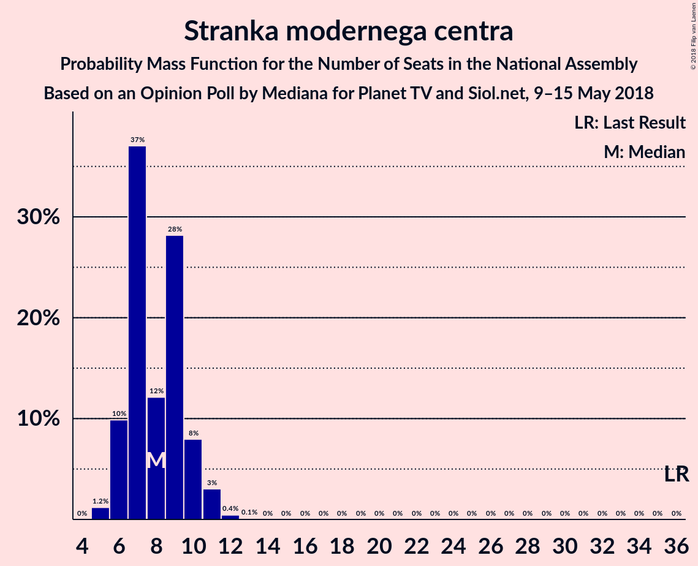
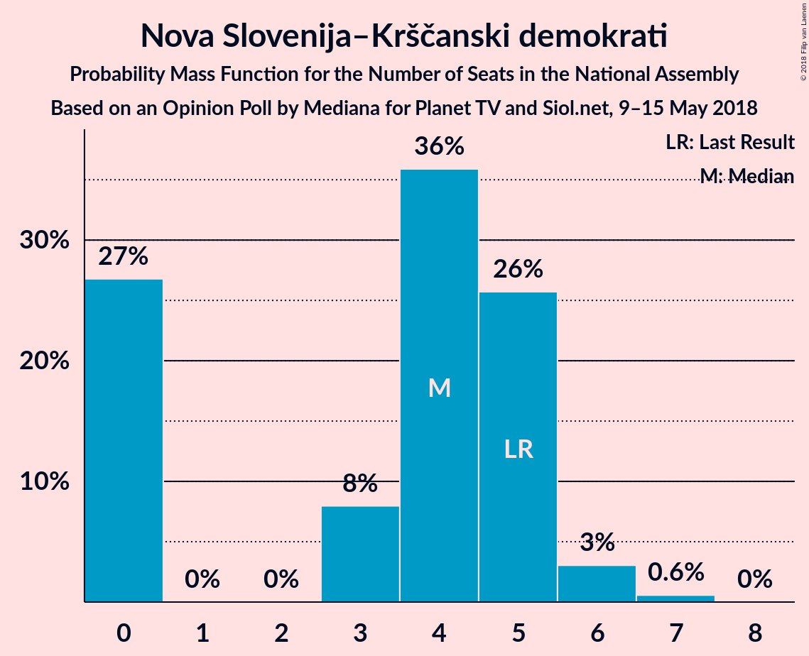
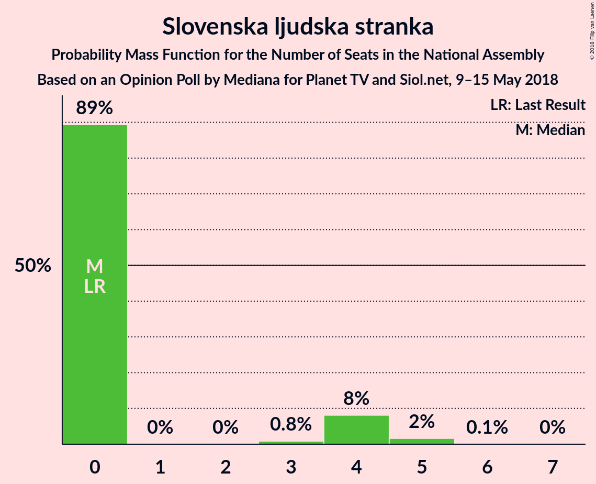

# Opinion Poll by Mediana for Planet TV and Siol.net, 9–15 May 2018

<a href="#voting-intentions">Voting Intentions</a> | <a href="#seats">Seats</a> | <a href="#coalitions">Coalitions</a> | <a href="#technical-information">Technical Information</a>

## Voting Intentions

### Confidence Intervals

| Party | Last Result | Poll Result | 80% Confidence Interval | 90% Confidence Interval | 95% Confidence Interval | 99% Confidence Interval |
|:-----:|:-----------:|:-----------:|:-----------------------:|:-----------------------:|:-----------------------:|:-----------------------:|
| Slovenska demokratska stranka | 20.7% | 28.1% | 25.6–30.8% |24.9–31.6% |24.3–32.3% |23.2–33.6% |
| Lista Marjana Šarca | 0.0% | 15.5% | 13.5–17.7% |13.0–18.4% |12.5–19.0% |11.7–20.1% |
| Socialni demokrati | 6.0% | 12.2% | 10.5–14.3% |10.0–14.9% |9.6–15.4% |8.8–16.5% |
| Stranka modernega centra | 34.5% | 8.8% | 7.3–10.6% |6.9–11.1% |6.6–11.6% |5.9–12.5% |
| Levica | 6.0% | 7.9% | 6.6–9.7% |6.2–10.2% |5.9–10.7% |5.3–11.6% |
| Demokratična stranka upokojencev Slovenije | 10.2% | 7.3% | 6.0–9.1% |5.7–9.6% |5.3–10.0% |4.8–10.9% |
| Stranka Alenke Bratušek | 4.4% | 5.7% | 4.6–7.3% |4.2–7.7% |4.0–8.1% |3.5–8.9% |
| Slovenska nacionalna stranka | 2.2% | 5.3% | 4.2–6.8% |3.9–7.3% |3.6–7.7% |3.2–8.5% |
| Nova Slovenija–Krščanski demokrati | 5.6% | 4.3% | 3.3–5.7% |3.0–6.1% |2.8–6.5% |2.4–7.2% |
| Slovenska ljudska stranka | 4.0% | 3.1% | 2.3–4.3% |2.0–4.7% |1.9–5.0% |1.5–5.7% |
| Glas za otroke in družine–Nova ljudska stranka Slovenije | 0.0% | 0.8% | 0.5–1.6% |0.4–1.9% |0.3–2.1% |0.2–2.5% |

*Note:* The poll result column reflects the actual value used in the calculations. Published results may vary slightly, and in addition be rounded to fewer digits.

## Seats

### Confidence Intervals

| Party | Last Result | Median | 80% Confidence Interval | 90% Confidence Interval | 95% Confidence Interval | 99% Confidence Interval |
|:-----:|:-----------:|:------:|:-----------------------:|:-----------------------:|:-----------------------:|:-----------------------:|
| <a href="#slovenska-demokratska-stranka">Slovenska demokratska stranka</a> | 21 | 28 | 25–29 |24–29 |23–30 |22–31 |
| <a href="#lista-marjana-šarca">Lista Marjana Šarca</a> | 0 | 15 | 13–15 |12–16 |12–18 |11–20 |
| <a href="#socialni-demokrati">Socialni demokrati</a> | 6 | 13 | 10–14 |10–14 |9–14 |8–16 |
| <a href="#stranka-modernega-centra">Stranka modernega centra</a> | 36 | 7 | 6–9 |6–9 |6–11 |5–12 |
| <a href="#levica">Levica</a> | 6 | 8 | 6–8 |6–9 |5–9 |5–10 |
| <a href="#demokratična-stranka-upokojencev-slovenije">Demokratična stranka upokojencev Slovenije</a> | 10 | 5 | 5–8 |5–8 |5–8 |4–10 |
| <a href="#stranka-alenke-bratušek">Stranka Alenke Bratušek</a> | 4 | 4 | 4–7 |4–7 |4–8 |0–8 |
| <a href="#slovenska-nacionalna-stranka">Slovenska nacionalna stranka</a> | 0 | 4 | 4–6 |4–6 |4–7 |0–7 |
| <a href="#nova-slovenija–krščanski-demokrati">Nova Slovenija–Krščanski demokrati</a> | 5 | 4 | 0–5 |0–5 |0–6 |0–7 |
| <a href="#slovenska-ljudska-stranka">Slovenska ljudska stranka</a> | 0 | 0 | 0 |0–4 |0–5 |0–5 |
| <a href="#glas-za-otroke-in-družine–nova-ljudska-stranka-slovenije">Glas za otroke in družine–Nova ljudska stranka Slovenije</a> | 0 | 0 | 0 |0 |0 |0 |

### Slovenska demokratska stranka

*For a full overview of the results for this party, see the [Slovenska demokratska stranka](party-slovenskademokratskastranka.html) page.*

| Number of Seats | Probability | Accumulated | Special Marks |
|:---------------:|:-----------:|:-----------:|:-------------:|
| 21 | 0.2% | 100% | Last Result |
| 22 | 1.1% | 99.8% |  |
| 23 | 3% | 98.7% |  |
| 24 | 4% | 96% |  |
| 25 | 10% | 91% |  |
| 26 | 3% | 81% |  |
| 27 | 3% | 78% |  |
| 28 | 65% | 75% | Median |
| 29 | 7% | 10% |  |
| 30 | 3% | 3% |  |
| 31 | 0.4% | 0.7% |  |
| 32 | 0.1% | 0.3% |  |
| 33 | 0.1% | 0.1% |  |
| 34 | 0% | 0% |  |

### Lista Marjana Šarca

*For a full overview of the results for this party, see the [Lista Marjana Šarca](party-listamarjanašarca.html) page.*

| Number of Seats | Probability | Accumulated | Special Marks |
|:---------------:|:-----------:|:-----------:|:-------------:|
| 0 | 0% | 100% | Last Result |
| 1 | 0% | 100% |  |
| 2 | 0% | 100% |  |
| 3 | 0% | 100% |  |
| 4 | 0% | 100% |  |
| 5 | 0% | 100% |  |
| 6 | 0% | 100% |  |
| 7 | 0% | 100% |  |
| 8 | 0% | 100% |  |
| 9 | 0% | 100% |  |
| 10 | 0.1% | 100% |  |
| 11 | 0.8% | 99.9% |  |
| 12 | 8% | 99.1% |  |
| 13 | 2% | 91% |  |
| 14 | 9% | 89% |  |
| 15 | 71% | 80% | Median |
| 16 | 4% | 9% |  |
| 17 | 2% | 5% |  |
| 18 | 0.8% | 3% |  |
| 19 | 2% | 2% |  |
| 20 | 0.5% | 0.5% |  |
| 21 | 0% | 0% |  |

### Socialni demokrati

*For a full overview of the results for this party, see the [Socialni demokrati](party-socialnidemokrati.html) page.*

| Number of Seats | Probability | Accumulated | Special Marks |
|:---------------:|:-----------:|:-----------:|:-------------:|
| 6 | 0% | 100% | Last Result |
| 7 | 0% | 100% |  |
| 8 | 2% | 100% |  |
| 9 | 1.2% | 98% |  |
| 10 | 7% | 96% |  |
| 11 | 6% | 89% |  |
| 12 | 5% | 83% |  |
| 13 | 62% | 78% | Median |
| 14 | 14% | 16% |  |
| 15 | 0.6% | 1.4% |  |
| 16 | 0.8% | 0.9% |  |
| 17 | 0.1% | 0.1% |  |
| 18 | 0% | 0% |  |

### Stranka modernega centra

*For a full overview of the results for this party, see the [Stranka modernega centra](party-strankamodernegacentra.html) page.*

| Number of Seats | Probability | Accumulated | Special Marks |
|:---------------:|:-----------:|:-----------:|:-------------:|
| 5 | 2% | 100% |  |
| 6 | 9% | 98% |  |
| 7 | 68% | 89% | Median |
| 8 | 5% | 21% |  |
| 9 | 12% | 16% |  |
| 10 | 1.5% | 4% |  |
| 11 | 2% | 3% |  |
| 12 | 0.9% | 0.9% |  |
| 13 | 0.1% | 0.1% |  |
| 14 | 0% | 0% |  |
| 15 | 0% | 0% |  |
| 16 | 0% | 0% |  |
| 17 | 0% | 0% |  |
| 18 | 0% | 0% |  |
| 19 | 0% | 0% |  |
| 20 | 0% | 0% |  |
| 21 | 0% | 0% |  |
| 22 | 0% | 0% |  |
| 23 | 0% | 0% |  |
| 24 | 0% | 0% |  |
| 25 | 0% | 0% |  |
| 26 | 0% | 0% |  |
| 27 | 0% | 0% |  |
| 28 | 0% | 0% |  |
| 29 | 0% | 0% |  |
| 30 | 0% | 0% |  |
| 31 | 0% | 0% |  |
| 32 | 0% | 0% |  |
| 33 | 0% | 0% |  |
| 34 | 0% | 0% |  |
| 35 | 0% | 0% |  |
| 36 | 0% | 0% | Last Result |

### Levica

*For a full overview of the results for this party, see the [Levica](party-levica.html) page.*

| Number of Seats | Probability | Accumulated | Special Marks |
|:---------------:|:-----------:|:-----------:|:-------------:|
| 4 | 0.4% | 100% |  |
| 5 | 3% | 99.6% |  |
| 6 | 12% | 97% | Last Result |
| 7 | 10% | 84% |  |
| 8 | 67% | 74% | Median |
| 9 | 5% | 7% |  |
| 10 | 0.8% | 1.3% |  |
| 11 | 0.4% | 0.5% |  |
| 12 | 0.1% | 0.1% |  |
| 13 | 0% | 0% |  |

### Demokratična stranka upokojencev Slovenije

*For a full overview of the results for this party, see the [Demokratična stranka upokojencev Slovenije](party-demokratičnastrankaupokojencevslovenije.html) page.*

| Number of Seats | Probability | Accumulated | Special Marks |
|:---------------:|:-----------:|:-----------:|:-------------:|
| 4 | 2% | 100% |  |
| 5 | 59% | 98% | Median |
| 6 | 17% | 39% |  |
| 7 | 11% | 22% |  |
| 8 | 9% | 11% |  |
| 9 | 0.9% | 2% |  |
| 10 | 0.8% | 0.9% | Last Result |
| 11 | 0% | 0.1% |  |
| 12 | 0% | 0% |  |

### Stranka Alenke Bratušek

*For a full overview of the results for this party, see the [Stranka Alenke Bratušek](party-strankaalenkebratušek.html) page.*

| Number of Seats | Probability | Accumulated | Special Marks |
|:---------------:|:-----------:|:-----------:|:-------------:|
| 0 | 2% | 100% |  |
| 1 | 0% | 98% |  |
| 2 | 0% | 98% |  |
| 3 | 0.5% | 98% |  |
| 4 | 63% | 98% | Last Result, Median |
| 5 | 10% | 35% |  |
| 6 | 12% | 25% |  |
| 7 | 11% | 13% |  |
| 8 | 2% | 3% |  |
| 9 | 0.1% | 0.1% |  |
| 10 | 0% | 0% |  |

### Slovenska nacionalna stranka

*For a full overview of the results for this party, see the [Slovenska nacionalna stranka](party-slovenskanacionalnastranka.html) page.*

| Number of Seats | Probability | Accumulated | Special Marks |
|:---------------:|:-----------:|:-----------:|:-------------:|
| 0 | 2% | 100% | Last Result |
| 1 | 0% | 98% |  |
| 2 | 0% | 98% |  |
| 3 | 0.1% | 98% |  |
| 4 | 68% | 98% | Median |
| 5 | 19% | 30% |  |
| 6 | 8% | 11% |  |
| 7 | 3% | 3% |  |
| 8 | 0.2% | 0.3% |  |
| 9 | 0.2% | 0.2% |  |
| 10 | 0% | 0% |  |

### Nova Slovenija–Krščanski demokrati

*For a full overview of the results for this party, see the [Nova Slovenija–Krščanski demokrati](party-novaslovenija–krščanskidemokrati.html) page.*

| Number of Seats | Probability | Accumulated | Special Marks |
|:---------------:|:-----------:|:-----------:|:-------------:|
| 0 | 24% | 100% |  |
| 1 | 0% | 76% |  |
| 2 | 0% | 76% |  |
| 3 | 2% | 76% |  |
| 4 | 61% | 74% | Median |
| 5 | 10% | 13% | Last Result |
| 6 | 3% | 3% |  |
| 7 | 0.6% | 0.6% |  |
| 8 | 0% | 0% |  |

### Slovenska ljudska stranka

*For a full overview of the results for this party, see the [Slovenska ljudska stranka](party-slovenskaljudskastranka.html) page.*

| Number of Seats | Probability | Accumulated | Special Marks |
|:---------------:|:-----------:|:-----------:|:-------------:|
| 0 | 92% | 100% | Last Result, Median |
| 1 | 0% | 8% |  |
| 2 | 0% | 8% |  |
| 3 | 0.5% | 8% |  |
| 4 | 4% | 7% |  |
| 5 | 3% | 3% |  |
| 6 | 0.1% | 0.1% |  |
| 7 | 0% | 0% |  |

### Glas za otroke in družine–Nova ljudska stranka Slovenije

*For a full overview of the results for this party, see the [Glas za otroke in družine–Nova ljudska stranka Slovenije](party-glaszaotrokeindružine–novaljudskastrankaslovenije.html) page.*

| Number of Seats | Probability | Accumulated | Special Marks |
|:---------------:|:-----------:|:-----------:|:-------------:|
| 0 | 100% | 100% | Last Result, Median |

## Coalitions

### Confidence Intervals

| Coalition | Last Result | Median | Majority? | 80% Confidence Interval | 90% Confidence Interval | 95% Confidence Interval | 99% Confidence Interval |
|:---------:|:-----------:|:------:|:---------:|:-----------------------:|:-----------------------:|:-----------------------:|:-----------------------:|
| Slovenska demokratska stranka – Lista Marjana Šarca – Demokratična stranka upokojencev Slovenije | 31 | 48 | 90% | 46–51 | 45–51 | 43–52 | 43–55 |
| Lista Marjana Šarca – Socialni demokrati – Stranka modernega centra – Demokratična stranka upokojencev Slovenije – Stranka Alenke Bratušek | 56 | 44 | 25% | 42–50 | 42–51 | 41–51 | 39–52 |
| Lista Marjana Šarca – Socialni demokrati – Stranka modernega centra – Demokratična stranka upokojencev Slovenije – Nova Slovenija–Krščanski demokrati | 57 | 44 | 8% | 41–45 | 40–47 | 39–48 | 38–50 |
| Slovenska demokratska stranka – Lista Marjana Šarca | 21 | 43 | 2% | 40–43 | 38–44 | 37–45 | 36–47 |
| Lista Marjana Šarca – Socialni demokrati – Stranka modernega centra – Demokratična stranka upokojencev Slovenije | 52 | 40 | 2% | 37–44 | 36–44 | 36–45 | 35–48 |
| Lista Marjana Šarca – Socialni demokrati – Stranka modernega centra – Nova Slovenija–Krščanski demokrati | 47 | 39 | 0% | 34–39 | 34–41 | 33–42 | 30–43 |
| Lista Marjana Šarca – Socialni demokrati – Demokratična stranka upokojencev Slovenije – Nova Slovenija–Krščanski demokrati | 21 | 37 | 0% | 34–37 | 33–39 | 32–39 | 31–41 |
| Lista Marjana Šarca – Socialni demokrati – Stranka modernega centra | 42 | 35 | 0% | 31–38 | 29–38 | 29–38 | 29–41 |
| Lista Marjana Šarca – Socialni demokrati – Demokratična stranka upokojencev Slovenije | 16 | 33 | 0% | 30–35 | 29–37 | 29–37 | 27–39 |
| Lista Marjana Šarca – Socialni demokrati – Nova Slovenija–Krščanski demokrati | 11 | 32 | 0% | 27–32 | 27–32 | 26–34 | 23–35 |
| Lista Marjana Šarca – Socialni demokrati | 6 | 28 | 0% | 24–29 | 22–29 | 22–30 | 22–32 |
| Socialni demokrati – Stranka modernega centra – Demokratična stranka upokojencev Slovenije | 52 | 25 | 0% | 24–29 | 23–29 | 21–30 | 20–32 |

### Slovenska demokratska stranka – Lista Marjana Šarca – Demokratična stranka upokojencev Slovenije

| Number of Seats | Probability | Accumulated | Special Marks |
|:---------------:|:-----------:|:-----------:|:-------------:|
| 31 | 0% | 100% | Last Result |
| 32 | 0% | 100% |  |
| 33 | 0% | 100% |  |
| 34 | 0% | 100% |  |
| 35 | 0% | 100% |  |
| 36 | 0% | 100% |  |
| 37 | 0% | 100% |  |
| 38 | 0% | 100% |  |
| 39 | 0% | 100% |  |
| 40 | 0% | 100% |  |
| 41 | 0.2% | 99.9% |  |
| 42 | 0.2% | 99.7% |  |
| 43 | 3% | 99.6% |  |
| 44 | 0.7% | 97% |  |
| 45 | 6% | 96% |  |
| 46 | 10% | 90% | Majority |
| 47 | 3% | 80% |  |
| 48 | 63% | 78% | Median |
| 49 | 3% | 15% |  |
| 50 | 2% | 12% |  |
| 51 | 7% | 10% |  |
| 52 | 2% | 3% |  |
| 53 | 0.2% | 2% |  |
| 54 | 0.9% | 2% |  |
| 55 | 0.8% | 0.8% |  |
| 56 | 0% | 0% |  |

### Lista Marjana Šarca – Socialni demokrati – Stranka modernega centra – Demokratična stranka upokojencev Slovenije – Stranka Alenke Bratušek

| Number of Seats | Probability | Accumulated | Special Marks |
|:---------------:|:-----------:|:-----------:|:-------------:|
| 38 | 0% | 100% |  |
| 39 | 0.6% | 99.9% |  |
| 40 | 0.4% | 99.3% |  |
| 41 | 3% | 98.9% |  |
| 42 | 7% | 96% |  |
| 43 | 0.6% | 89% |  |
| 44 | 61% | 89% | Median |
| 45 | 2% | 27% |  |
| 46 | 2% | 25% | Majority |
| 47 | 2% | 23% |  |
| 48 | 2% | 22% |  |
| 49 | 8% | 20% |  |
| 50 | 2% | 12% |  |
| 51 | 9% | 10% |  |
| 52 | 0.7% | 1.1% |  |
| 53 | 0.2% | 0.4% |  |
| 54 | 0.1% | 0.2% |  |
| 55 | 0% | 0% |  |
| 56 | 0% | 0% | Last Result |

### Lista Marjana Šarca – Socialni demokrati – Stranka modernega centra – Demokratična stranka upokojencev Slovenije – Nova Slovenija–Krščanski demokrati

| Number of Seats | Probability | Accumulated | Special Marks |
|:---------------:|:-----------:|:-----------:|:-------------:|
| 35 | 0.1% | 100% |  |
| 36 | 0.1% | 99.9% |  |
| 37 | 0.1% | 99.9% |  |
| 38 | 0.7% | 99.8% |  |
| 39 | 3% | 99.1% |  |
| 40 | 3% | 96% |  |
| 41 | 8% | 93% |  |
| 42 | 3% | 85% |  |
| 43 | 6% | 82% |  |
| 44 | 64% | 76% | Median |
| 45 | 5% | 13% |  |
| 46 | 2% | 8% | Majority |
| 47 | 3% | 6% |  |
| 48 | 2% | 3% |  |
| 49 | 0.7% | 2% |  |
| 50 | 0.6% | 0.8% |  |
| 51 | 0.2% | 0.2% |  |
| 52 | 0% | 0% |  |
| 53 | 0% | 0% |  |
| 54 | 0% | 0% |  |
| 55 | 0% | 0% |  |
| 56 | 0% | 0% |  |
| 57 | 0% | 0% | Last Result |

### Slovenska demokratska stranka – Lista Marjana Šarca

| Number of Seats | Probability | Accumulated | Special Marks |
|:---------------:|:-----------:|:-----------:|:-------------:|
| 21 | 0% | 100% | Last Result |
| 22 | 0% | 100% |  |
| 23 | 0% | 100% |  |
| 24 | 0% | 100% |  |
| 25 | 0% | 100% |  |
| 26 | 0% | 100% |  |
| 27 | 0% | 100% |  |
| 28 | 0% | 100% |  |
| 29 | 0% | 100% |  |
| 30 | 0% | 100% |  |
| 31 | 0% | 100% |  |
| 32 | 0% | 100% |  |
| 33 | 0% | 100% |  |
| 34 | 0.3% | 100% |  |
| 35 | 0.1% | 99.7% |  |
| 36 | 0.6% | 99.6% |  |
| 37 | 2% | 98.9% |  |
| 38 | 5% | 97% |  |
| 39 | 2% | 92% |  |
| 40 | 11% | 91% |  |
| 41 | 8% | 80% |  |
| 42 | 5% | 72% |  |
| 43 | 61% | 67% | Median |
| 44 | 1.2% | 6% |  |
| 45 | 3% | 5% |  |
| 46 | 0.5% | 2% | Majority |
| 47 | 2% | 2% |  |
| 48 | 0.1% | 0.1% |  |
| 49 | 0% | 0% |  |

### Lista Marjana Šarca – Socialni demokrati – Stranka modernega centra – Demokratična stranka upokojencev Slovenije

| Number of Seats | Probability | Accumulated | Special Marks |
|:---------------:|:-----------:|:-----------:|:-------------:|
| 34 | 0.1% | 100% |  |
| 35 | 1.3% | 99.9% |  |
| 36 | 8% | 98.6% |  |
| 37 | 1.3% | 91% |  |
| 38 | 1.1% | 89% |  |
| 39 | 3% | 88% |  |
| 40 | 59% | 86% | Median |
| 41 | 4% | 27% |  |
| 42 | 4% | 23% |  |
| 43 | 6% | 19% |  |
| 44 | 9% | 14% |  |
| 45 | 3% | 5% |  |
| 46 | 0.8% | 2% | Majority |
| 47 | 0.3% | 1.1% |  |
| 48 | 0.5% | 0.8% |  |
| 49 | 0% | 0.3% |  |
| 50 | 0.3% | 0.3% |  |
| 51 | 0% | 0% |  |
| 52 | 0% | 0% | Last Result |

### Lista Marjana Šarca – Socialni demokrati – Stranka modernega centra – Nova Slovenija–Krščanski demokrati

| Number of Seats | Probability | Accumulated | Special Marks |
|:---------------:|:-----------:|:-----------:|:-------------:|
| 29 | 0.4% | 100% |  |
| 30 | 0.2% | 99.5% |  |
| 31 | 0.4% | 99.3% |  |
| 32 | 0.5% | 98.9% |  |
| 33 | 2% | 98% |  |
| 34 | 9% | 96% |  |
| 35 | 6% | 87% |  |
| 36 | 3% | 81% |  |
| 37 | 3% | 77% |  |
| 38 | 11% | 74% |  |
| 39 | 55% | 63% | Median |
| 40 | 2% | 7% |  |
| 41 | 1.0% | 5% |  |
| 42 | 3% | 4% |  |
| 43 | 1.1% | 1.3% |  |
| 44 | 0.1% | 0.2% |  |
| 45 | 0% | 0% |  |
| 46 | 0% | 0% | Majority |
| 47 | 0% | 0% | Last Result |

### Lista Marjana Šarca – Socialni demokrati – Demokratična stranka upokojencev Slovenije – Nova Slovenija–Krščanski demokrati

| Number of Seats | Probability | Accumulated | Special Marks |
|:---------------:|:-----------:|:-----------:|:-------------:|
| 21 | 0% | 100% | Last Result |
| 22 | 0% | 100% |  |
| 23 | 0% | 100% |  |
| 24 | 0% | 100% |  |
| 25 | 0% | 100% |  |
| 26 | 0% | 100% |  |
| 27 | 0% | 100% |  |
| 28 | 0% | 100% |  |
| 29 | 0.2% | 100% |  |
| 30 | 0.2% | 99.8% |  |
| 31 | 1.1% | 99.6% |  |
| 32 | 2% | 98.5% |  |
| 33 | 4% | 97% |  |
| 34 | 8% | 92% |  |
| 35 | 9% | 84% |  |
| 36 | 6% | 75% |  |
| 37 | 60% | 68% | Median |
| 38 | 3% | 8% |  |
| 39 | 4% | 6% |  |
| 40 | 0.8% | 2% |  |
| 41 | 0.7% | 1.1% |  |
| 42 | 0.1% | 0.4% |  |
| 43 | 0.3% | 0.3% |  |
| 44 | 0% | 0.1% |  |
| 45 | 0% | 0% |  |

### Lista Marjana Šarca – Socialni demokrati – Stranka modernega centra

| Number of Seats | Probability | Accumulated | Special Marks |
|:---------------:|:-----------:|:-----------:|:-------------:|
| 27 | 0.3% | 100% |  |
| 28 | 0.2% | 99.7% |  |
| 29 | 5% | 99.5% |  |
| 30 | 3% | 94% |  |
| 31 | 1.4% | 91% |  |
| 32 | 3% | 89% |  |
| 33 | 3% | 86% |  |
| 34 | 5% | 83% |  |
| 35 | 60% | 78% | Median |
| 36 | 3% | 18% |  |
| 37 | 2% | 15% |  |
| 38 | 11% | 13% |  |
| 39 | 1.0% | 2% |  |
| 40 | 0.5% | 1.5% |  |
| 41 | 0.6% | 1.0% |  |
| 42 | 0.3% | 0.3% | Last Result |
| 43 | 0% | 0% |  |

### Lista Marjana Šarca – Socialni demokrati – Demokratična stranka upokojencev Slovenije

| Number of Seats | Probability | Accumulated | Special Marks |
|:---------------:|:-----------:|:-----------:|:-------------:|
| 16 | 0% | 100% | Last Result |
| 17 | 0% | 100% |  |
| 18 | 0% | 100% |  |
| 19 | 0% | 100% |  |
| 20 | 0% | 100% |  |
| 21 | 0% | 100% |  |
| 22 | 0% | 100% |  |
| 23 | 0% | 100% |  |
| 24 | 0% | 100% |  |
| 25 | 0% | 100% |  |
| 26 | 0.1% | 100% |  |
| 27 | 0.4% | 99.9% |  |
| 28 | 0.1% | 99.5% |  |
| 29 | 7% | 99.3% |  |
| 30 | 3% | 93% |  |
| 31 | 2% | 89% |  |
| 32 | 3% | 87% |  |
| 33 | 60% | 84% | Median |
| 34 | 5% | 24% |  |
| 35 | 10% | 19% |  |
| 36 | 2% | 9% |  |
| 37 | 6% | 7% |  |
| 38 | 0.4% | 1.1% |  |
| 39 | 0.3% | 0.6% |  |
| 40 | 0.3% | 0.3% |  |
| 41 | 0% | 0% |  |

### Lista Marjana Šarca – Socialni demokrati – Nova Slovenija–Krščanski demokrati

| Number of Seats | Probability | Accumulated | Special Marks |
|:---------------:|:-----------:|:-----------:|:-------------:|
| 11 | 0% | 100% | Last Result |
| 12 | 0% | 100% |  |
| 13 | 0% | 100% |  |
| 14 | 0% | 100% |  |
| 15 | 0% | 100% |  |
| 16 | 0% | 100% |  |
| 17 | 0% | 100% |  |
| 18 | 0% | 100% |  |
| 19 | 0% | 100% |  |
| 20 | 0% | 100% |  |
| 21 | 0% | 100% |  |
| 22 | 0% | 99.9% |  |
| 23 | 0.4% | 99.9% |  |
| 24 | 0.6% | 99.5% |  |
| 25 | 1.3% | 98.9% |  |
| 26 | 2% | 98% |  |
| 27 | 11% | 96% |  |
| 28 | 2% | 85% |  |
| 29 | 14% | 83% |  |
| 30 | 6% | 68% |  |
| 31 | 2% | 63% |  |
| 32 | 56% | 60% | Median |
| 33 | 0.4% | 4% |  |
| 34 | 2% | 3% |  |
| 35 | 1.2% | 2% |  |
| 36 | 0.1% | 0.3% |  |
| 37 | 0.1% | 0.1% |  |
| 38 | 0% | 0% |  |

### Lista Marjana Šarca – Socialni demokrati

| Number of Seats | Probability | Accumulated | Special Marks |
|:---------------:|:-----------:|:-----------:|:-------------:|
| 6 | 0% | 100% | Last Result |
| 7 | 0% | 100% |  |
| 8 | 0% | 100% |  |
| 9 | 0% | 100% |  |
| 10 | 0% | 100% |  |
| 11 | 0% | 100% |  |
| 12 | 0% | 100% |  |
| 13 | 0% | 100% |  |
| 14 | 0% | 100% |  |
| 15 | 0% | 100% |  |
| 16 | 0% | 100% |  |
| 17 | 0% | 100% |  |
| 18 | 0% | 100% |  |
| 19 | 0% | 100% |  |
| 20 | 0.1% | 100% |  |
| 21 | 0.1% | 99.9% |  |
| 22 | 6% | 99.7% |  |
| 23 | 1.2% | 94% |  |
| 24 | 3% | 92% |  |
| 25 | 4% | 89% |  |
| 26 | 4% | 85% |  |
| 27 | 7% | 82% |  |
| 28 | 56% | 75% | Median |
| 29 | 15% | 19% |  |
| 30 | 1.0% | 3% |  |
| 31 | 2% | 2% |  |
| 32 | 0.4% | 0.6% |  |
| 33 | 0.2% | 0.2% |  |
| 34 | 0% | 0% |  |

### Socialni demokrati – Stranka modernega centra – Demokratična stranka upokojencev Slovenije

| Number of Seats | Probability | Accumulated | Special Marks |
|:---------------:|:-----------:|:-----------:|:-------------:|
| 19 | 0.2% | 100% |  |
| 20 | 2% | 99.8% |  |
| 21 | 1.3% | 98% |  |
| 22 | 0.7% | 97% |  |
| 23 | 2% | 96% |  |
| 24 | 7% | 94% |  |
| 25 | 57% | 87% | Median |
| 26 | 4% | 30% |  |
| 27 | 5% | 26% |  |
| 28 | 6% | 20% |  |
| 29 | 11% | 14% |  |
| 30 | 1.1% | 3% |  |
| 31 | 1.4% | 2% |  |
| 32 | 0.3% | 0.5% |  |
| 33 | 0.1% | 0.2% |  |
| 34 | 0.1% | 0.1% |  |
| 35 | 0% | 0% |  |
| 36 | 0% | 0% |  |
| 37 | 0% | 0% |  |
| 38 | 0% | 0% |  |
| 39 | 0% | 0% |  |
| 40 | 0% | 0% |  |
| 41 | 0% | 0% |  |
| 42 | 0% | 0% |  |
| 43 | 0% | 0% |  |
| 44 | 0% | 0% |  |
| 45 | 0% | 0% |  |
| 46 | 0% | 0% | Majority |
| 47 | 0% | 0% |  |
| 48 | 0% | 0% |  |
| 49 | 0% | 0% |  |
| 50 | 0% | 0% |  |
| 51 | 0% | 0% |  |
| 52 | 0% | 0% | Last Result |

## Technical Information

### Opinion Poll

+ **Polling firm:** Mediana
+ **Commissioner(s):** Planet TV and Siol.net
+ **Fieldwork period:** 9–15 May 2018

### Calculations

+ **Sample size:** 491
+ **Simulations done:** 131,072
+ **Error estimate:** 3.32%

