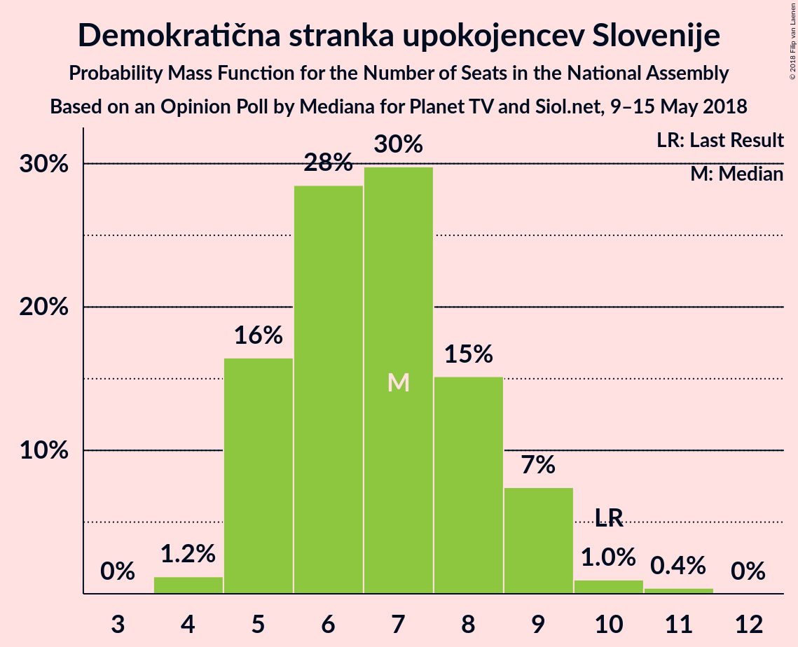

# Opinion Poll by Mediana for Planet TV and Siol.net, 9–15 May 2018

<a href="#voting-intentions">Voting Intentions</a> | <a href="#seats">Seats</a> | <a href="#coalitions">Coalitions</a> | <a href="#technical-information">Technical Information</a>

## Voting Intentions

### Confidence Intervals

| Party | Last Result | Poll Result | 80% Confidence Interval | 90% Confidence Interval | 95% Confidence Interval | 99% Confidence Interval |
|:-----:|:-----------:|:-----------:|:-----------------------:|:-----------------------:|:-----------------------:|:-----------------------:|
| Slovenska demokratska stranka | 20.7% | 28.1% | 25.6–30.8% |24.9–31.6% |24.3–32.3% |23.2–33.6% |
| Lista Marjana Šarca | 0.0% | 15.5% | 13.5–17.7% |13.0–18.4% |12.5–19.0% |11.7–20.1% |
| Socialni demokrati | 6.0% | 12.2% | 10.5–14.3% |10.0–14.9% |9.6–15.4% |8.8–16.5% |
| Stranka modernega centra | 34.5% | 8.8% | 7.3–10.6% |6.9–11.1% |6.6–11.6% |5.9–12.5% |
| Levica | 6.0% | 7.9% | 6.6–9.7% |6.2–10.2% |5.9–10.7% |5.3–11.6% |
| Demokratična stranka upokojencev Slovenije | 10.2% | 7.3% | 6.0–9.1% |5.7–9.6% |5.3–10.0% |4.8–10.9% |
| Stranka Alenke Bratušek | 4.4% | 5.7% | 4.6–7.3% |4.2–7.7% |4.0–8.1% |3.5–8.9% |
| Slovenska nacionalna stranka | 2.2% | 5.3% | 4.2–6.8% |3.9–7.3% |3.6–7.7% |3.2–8.5% |
| Nova Slovenija–Krščanski demokrati | 5.6% | 4.3% | 3.3–5.7% |3.0–6.1% |2.8–6.5% |2.4–7.2% |
| Slovenska ljudska stranka | 4.0% | 3.1% | 2.3–4.3% |2.0–4.7% |1.9–5.0% |1.5–5.7% |
| Glas za otroke in družine–Nova ljudska stranka Slovenije | 0.0% | 0.8% | 0.5–1.6% |0.4–1.9% |0.3–2.1% |0.2–2.5% |

*Note:* The poll result column reflects the actual value used in the calculations. Published results may vary slightly, and in addition be rounded to fewer digits.

## Seats

### Confidence Intervals

| Party | Last Result | Median | 80% Confidence Interval | 90% Confidence Interval | 95% Confidence Interval | 99% Confidence Interval |
|:-----:|:-----------:|:------:|:-----------------------:|:-----------------------:|:-----------------------:|:-----------------------:|
| <a href="#slovenska-demokratska-stranka">Slovenska demokratska stranka</a> | 21 | 27 | 25–29 |24–30 |23–31 |21–33 |
| <a href="#lista-marjana-šarca">Lista Marjana Šarca</a> | 0 | 15 | 13–17 |12–17 |12–18 |11–19 |
| <a href="#socialni-demokrati">Socialni demokrati</a> | 6 | 12 | 10–14 |9–15 |9–15 |8–16 |
| <a href="#stranka-modernega-centra">Stranka modernega centra</a> | 36 | 7 | 6–10 |6–10 |5–10 |5–12 |
| <a href="#levica">Levica</a> | 6 | 8 | 6–9 |6–9 |5–9 |5–10 |
| <a href="#demokratična-stranka-upokojencev-slovenije">Demokratična stranka upokojencev Slovenije</a> | 10 | 6 | 5–8 |5–9 |5–9 |4–10 |
| <a href="#stranka-alenke-bratušek">Stranka Alenke Bratušek</a> | 4 | 5 | 4–7 |4–7 |0–7 |0–8 |
| <a href="#slovenska-nacionalna-stranka">Slovenska nacionalna stranka</a> | 0 | 4 | 4–6 |3–6 |0–7 |0–8 |
| <a href="#nova-slovenija–krščanski-demokrati">Nova Slovenija–Krščanski demokrati</a> | 5 | 4 | 0–5 |0–5 |0–6 |0–7 |
| <a href="#slovenska-ljudska-stranka">Slovenska ljudska stranka</a> | 0 | 0 | 0 |0–4 |0–4 |0–5 |
| <a href="#glas-za-otroke-in-družine–nova-ljudska-stranka-slovenije">Glas za otroke in družine–Nova ljudska stranka Slovenije</a> | 0 | 0 | 0 |0 |0 |0 |

### Slovenska demokratska stranka

*For a full overview of the results for this party, see the [Slovenska demokratska stranka](party-slovenskademokratskastranka.html) page.*

| Number of Seats | Probability | Accumulated | Special Marks |
|:---------------:|:-----------:|:-----------:|:-------------:|
| 20 | 0.1% | 100% |  |
| 21 | 0.6% | 99.9% | Last Result |
| 22 | 1.0% | 99.4% |  |
| 23 | 3% | 98% |  |
| 24 | 4% | 95% |  |
| 25 | 12% | 91% |  |
| 26 | 16% | 79% |  |
| 27 | 15% | 64% | Median |
| 28 | 33% | 48% |  |
| 29 | 7% | 15% |  |
| 30 | 5% | 8% |  |
| 31 | 1.4% | 4% |  |
| 32 | 1.0% | 2% |  |
| 33 | 1.2% | 1.3% |  |
| 34 | 0% | 0.1% |  |
| 35 | 0.1% | 0.1% |  |
| 36 | 0% | 0% |  |

### Lista Marjana Šarca

*For a full overview of the results for this party, see the [Lista Marjana Šarca](party-listamarjanašarca.html) page.*

| Number of Seats | Probability | Accumulated | Special Marks |
|:---------------:|:-----------:|:-----------:|:-------------:|
| 0 | 0% | 100% | Last Result |
| 1 | 0% | 100% |  |
| 2 | 0% | 100% |  |
| 3 | 0% | 100% |  |
| 4 | 0% | 100% |  |
| 5 | 0% | 100% |  |
| 6 | 0% | 100% |  |
| 7 | 0% | 100% |  |
| 8 | 0% | 100% |  |
| 9 | 0% | 100% |  |
| 10 | 0.4% | 100% |  |
| 11 | 0.9% | 99.6% |  |
| 12 | 5% | 98.7% |  |
| 13 | 33% | 94% |  |
| 14 | 11% | 61% |  |
| 15 | 36% | 50% | Median |
| 16 | 4% | 14% |  |
| 17 | 6% | 10% |  |
| 18 | 3% | 4% |  |
| 19 | 1.3% | 2% |  |
| 20 | 0.3% | 0.3% |  |
| 21 | 0% | 0% |  |

### Socialni demokrati

*For a full overview of the results for this party, see the [Socialni demokrati](party-socialnidemokrati.html) page.*

| Number of Seats | Probability | Accumulated | Special Marks |
|:---------------:|:-----------:|:-----------:|:-------------:|
| 6 | 0% | 100% | Last Result |
| 7 | 0.1% | 100% |  |
| 8 | 2% | 99.9% |  |
| 9 | 3% | 98% |  |
| 10 | 9% | 95% |  |
| 11 | 23% | 86% |  |
| 12 | 25% | 63% | Median |
| 13 | 25% | 37% |  |
| 14 | 7% | 12% |  |
| 15 | 4% | 5% |  |
| 16 | 0.6% | 0.9% |  |
| 17 | 0.2% | 0.3% |  |
| 18 | 0% | 0% |  |

### Stranka modernega centra

*For a full overview of the results for this party, see the [Stranka modernega centra](party-strankamodernegacentra.html) page.*

| Number of Seats | Probability | Accumulated | Special Marks |
|:---------------:|:-----------:|:-----------:|:-------------:|
| 5 | 3% | 100% |  |
| 6 | 9% | 97% |  |
| 7 | 38% | 88% | Median |
| 8 | 8% | 50% |  |
| 9 | 27% | 42% |  |
| 10 | 13% | 15% |  |
| 11 | 1.3% | 2% |  |
| 12 | 0.5% | 0.8% |  |
| 13 | 0.3% | 0.3% |  |
| 14 | 0% | 0% |  |
| 15 | 0% | 0% |  |
| 16 | 0% | 0% |  |
| 17 | 0% | 0% |  |
| 18 | 0% | 0% |  |
| 19 | 0% | 0% |  |
| 20 | 0% | 0% |  |
| 21 | 0% | 0% |  |
| 22 | 0% | 0% |  |
| 23 | 0% | 0% |  |
| 24 | 0% | 0% |  |
| 25 | 0% | 0% |  |
| 26 | 0% | 0% |  |
| 27 | 0% | 0% |  |
| 28 | 0% | 0% |  |
| 29 | 0% | 0% |  |
| 30 | 0% | 0% |  |
| 31 | 0% | 0% |  |
| 32 | 0% | 0% |  |
| 33 | 0% | 0% |  |
| 34 | 0% | 0% |  |
| 35 | 0% | 0% |  |
| 36 | 0% | 0% | Last Result |

### Levica

*For a full overview of the results for this party, see the [Levica](party-levica.html) page.*

| Number of Seats | Probability | Accumulated | Special Marks |
|:---------------:|:-----------:|:-----------:|:-------------:|
| 4 | 0.3% | 100% |  |
| 5 | 3% | 99.7% |  |
| 6 | 26% | 97% | Last Result |
| 7 | 14% | 71% |  |
| 8 | 37% | 56% | Median |
| 9 | 17% | 19% |  |
| 10 | 2% | 2% |  |
| 11 | 0.3% | 0.4% |  |
| 12 | 0.1% | 0.1% |  |
| 13 | 0% | 0% |  |

### Demokratična stranka upokojencev Slovenije

*For a full overview of the results for this party, see the [Demokratična stranka upokojencev Slovenije](party-demokratičnastrankaupokojencevslovenije.html) page.*

| Number of Seats | Probability | Accumulated | Special Marks |
|:---------------:|:-----------:|:-----------:|:-------------:|
| 4 | 2% | 100% |  |
| 5 | 23% | 98% |  |
| 6 | 30% | 75% | Median |
| 7 | 29% | 45% |  |
| 8 | 7% | 17% |  |
| 9 | 8% | 9% |  |
| 10 | 2% | 2% | Last Result |
| 11 | 0.1% | 0.1% |  |
| 12 | 0% | 0% |  |

### Stranka Alenke Bratušek

*For a full overview of the results for this party, see the [Stranka Alenke Bratušek](party-strankaalenkebratušek.html) page.*

| Number of Seats | Probability | Accumulated | Special Marks |
|:---------------:|:-----------:|:-----------:|:-------------:|
| 0 | 3% | 100% |  |
| 1 | 0% | 97% |  |
| 2 | 0% | 97% |  |
| 3 | 2% | 97% |  |
| 4 | 38% | 95% | Last Result |
| 5 | 20% | 57% | Median |
| 6 | 21% | 37% |  |
| 7 | 15% | 17% |  |
| 8 | 2% | 2% |  |
| 9 | 0.2% | 0.3% |  |
| 10 | 0% | 0% |  |

### Slovenska nacionalna stranka

*For a full overview of the results for this party, see the [Slovenska nacionalna stranka](party-slovenskanacionalnastranka.html) page.*

| Number of Seats | Probability | Accumulated | Special Marks |
|:---------------:|:-----------:|:-----------:|:-------------:|
| 0 | 4% | 100% | Last Result |
| 1 | 0% | 96% |  |
| 2 | 0% | 96% |  |
| 3 | 2% | 96% |  |
| 4 | 61% | 95% | Median |
| 5 | 14% | 34% |  |
| 6 | 16% | 19% |  |
| 7 | 3% | 4% |  |
| 8 | 0.8% | 0.9% |  |
| 9 | 0.1% | 0.1% |  |
| 10 | 0% | 0% |  |

### Nova Slovenija–Krščanski demokrati

*For a full overview of the results for this party, see the [Nova Slovenija–Krščanski demokrati](party-novaslovenija–krščanskidemokrati.html) page.*

| Number of Seats | Probability | Accumulated | Special Marks |
|:---------------:|:-----------:|:-----------:|:-------------:|
| 0 | 32% | 100% |  |
| 1 | 0% | 68% |  |
| 2 | 0% | 68% |  |
| 3 | 1.0% | 68% |  |
| 4 | 35% | 67% | Median |
| 5 | 30% | 33% | Last Result |
| 6 | 2% | 3% |  |
| 7 | 0.6% | 0.7% |  |
| 8 | 0% | 0% |  |

### Slovenska ljudska stranka

*For a full overview of the results for this party, see the [Slovenska ljudska stranka](party-slovenskaljudskastranka.html) page.*

| Number of Seats | Probability | Accumulated | Special Marks |
|:---------------:|:-----------:|:-----------:|:-------------:|
| 0 | 94% | 100% | Last Result, Median |
| 1 | 0% | 6% |  |
| 2 | 0% | 6% |  |
| 3 | 0.7% | 6% |  |
| 4 | 4% | 6% |  |
| 5 | 2% | 2% |  |
| 6 | 0.1% | 0.1% |  |
| 7 | 0% | 0% |  |

### Glas za otroke in družine–Nova ljudska stranka Slovenije

*For a full overview of the results for this party, see the [Glas za otroke in družine–Nova ljudska stranka Slovenije](party-glaszaotrokeindružine–novaljudskastrankaslovenije.html) page.*

| Number of Seats | Probability | Accumulated | Special Marks |
|:---------------:|:-----------:|:-----------:|:-------------:|
| 0 | 100% | 100% | Last Result, Median |

## Coalitions

### Confidence Intervals

| Coalition | Last Result | Median | Majority? | 80% Confidence Interval | 90% Confidence Interval | 95% Confidence Interval | 99% Confidence Interval |
|:---------:|:-----------:|:------:|:---------:|:-----------------------:|:-----------------------:|:-----------------------:|:-----------------------:|
| Slovenska demokratska stranka – Lista Marjana Šarca – Demokratična stranka upokojencev Slovenije | 31 | 48 | 82% | 45–51 | 45–53 | 44–53 | 41–56 |
| Lista Marjana Šarca – Socialni demokrati – Stranka modernega centra – Demokratična stranka upokojencev Slovenije – Stranka Alenke Bratušek | 56 | 46 | 51% | 43–49 | 42–51 | 41–51 | 38–53 |
| Lista Marjana Šarca – Socialni demokrati – Stranka modernega centra – Demokratična stranka upokojencev Slovenije – Nova Slovenija–Krščanski demokrati | 57 | 44 | 16% | 41–46 | 40–48 | 39–49 | 37–52 |
| Slovenska demokratska stranka – Lista Marjana Šarca | 21 | 42 | 7% | 38–45 | 38–46 | 37–47 | 35–49 |
| Lista Marjana Šarca – Socialni demokrati – Stranka modernega centra – Demokratična stranka upokojencev Slovenije | 52 | 40 | 2% | 39–44 | 37–44 | 36–45 | 34–48 |
| Lista Marjana Šarca – Socialni demokrati – Stranka modernega centra – Nova Slovenija–Krščanski demokrati | 47 | 37 | 0% | 34–39 | 34–41 | 33–42 | 30–43 |
| Lista Marjana Šarca – Socialni demokrati – Demokratična stranka upokojencev Slovenije – Nova Slovenija–Krščanski demokrati | 21 | 36 | 0% | 32–38 | 32–40 | 31–42 | 28–43 |
| Lista Marjana Šarca – Socialni demokrati – Stranka modernega centra | 42 | 35 | 0% | 32–37 | 30–38 | 29–38 | 29–41 |
| Lista Marjana Šarca – Socialni demokrati – Demokratična stranka upokojencev Slovenije | 16 | 33 | 0% | 31–35 | 29–37 | 29–37 | 27–40 |
| Lista Marjana Šarca – Socialni demokrati – Nova Slovenija–Krščanski demokrati | 11 | 30 | 0% | 26–32 | 26–33 | 24–34 | 22–35 |
| Socialni demokrati – Stranka modernega centra – Demokratična stranka upokojencev Slovenije | 52 | 26 | 0% | 24–29 | 23–30 | 22–31 | 20–32 |
| Lista Marjana Šarca – Socialni demokrati | 6 | 26 | 0% | 24–29 | 23–30 | 22–30 | 22–32 |

### Slovenska demokratska stranka – Lista Marjana Šarca – Demokratična stranka upokojencev Slovenije

| Number of Seats | Probability | Accumulated | Special Marks |
|:---------------:|:-----------:|:-----------:|:-------------:|
| 31 | 0% | 100% | Last Result |
| 32 | 0% | 100% |  |
| 33 | 0% | 100% |  |
| 34 | 0% | 100% |  |
| 35 | 0% | 100% |  |
| 36 | 0% | 100% |  |
| 37 | 0% | 100% |  |
| 38 | 0% | 100% |  |
| 39 | 0% | 100% |  |
| 40 | 0.1% | 100% |  |
| 41 | 0.4% | 99.9% |  |
| 42 | 0.4% | 99.5% |  |
| 43 | 1.3% | 99.1% |  |
| 44 | 2% | 98% |  |
| 45 | 14% | 96% |  |
| 46 | 8% | 82% | Majority |
| 47 | 19% | 74% |  |
| 48 | 21% | 55% | Median |
| 49 | 17% | 34% |  |
| 50 | 3% | 16% |  |
| 51 | 4% | 13% |  |
| 52 | 3% | 9% |  |
| 53 | 4% | 6% |  |
| 54 | 0.4% | 2% |  |
| 55 | 1.2% | 2% |  |
| 56 | 0.6% | 0.7% |  |
| 57 | 0.1% | 0.1% |  |
| 58 | 0% | 0% |  |

### Lista Marjana Šarca – Socialni demokrati – Stranka modernega centra – Demokratična stranka upokojencev Slovenije – Stranka Alenke Bratušek

| Number of Seats | Probability | Accumulated | Special Marks |
|:---------------:|:-----------:|:-----------:|:-------------:|
| 38 | 0.5% | 100% |  |
| 39 | 0.5% | 99.4% |  |
| 40 | 0.5% | 99.0% |  |
| 41 | 1.3% | 98% |  |
| 42 | 5% | 97% |  |
| 43 | 15% | 93% |  |
| 44 | 22% | 78% |  |
| 45 | 5% | 56% | Median |
| 46 | 6% | 51% | Majority |
| 47 | 19% | 45% |  |
| 48 | 12% | 26% |  |
| 49 | 7% | 14% |  |
| 50 | 2% | 7% |  |
| 51 | 4% | 5% |  |
| 52 | 0.3% | 1.2% |  |
| 53 | 0.7% | 0.9% |  |
| 54 | 0.2% | 0.2% |  |
| 55 | 0% | 0% |  |
| 56 | 0% | 0% | Last Result |

### Lista Marjana Šarca – Socialni demokrati – Stranka modernega centra – Demokratična stranka upokojencev Slovenije – Nova Slovenija–Krščanski demokrati

| Number of Seats | Probability | Accumulated | Special Marks |
|:---------------:|:-----------:|:-----------:|:-------------:|
| 34 | 0.1% | 100% |  |
| 35 | 0.1% | 99.9% |  |
| 36 | 0.1% | 99.8% |  |
| 37 | 0.4% | 99.6% |  |
| 38 | 2% | 99.2% |  |
| 39 | 2% | 98% |  |
| 40 | 2% | 96% |  |
| 41 | 4% | 94% |  |
| 42 | 13% | 89% |  |
| 43 | 9% | 76% |  |
| 44 | 38% | 66% | Median |
| 45 | 12% | 28% |  |
| 46 | 7% | 16% | Majority |
| 47 | 2% | 8% |  |
| 48 | 3% | 6% |  |
| 49 | 2% | 3% |  |
| 50 | 0.4% | 1.2% |  |
| 51 | 0.2% | 0.8% |  |
| 52 | 0.5% | 0.6% |  |
| 53 | 0% | 0% |  |
| 54 | 0% | 0% |  |
| 55 | 0% | 0% |  |
| 56 | 0% | 0% |  |
| 57 | 0% | 0% | Last Result |

### Slovenska demokratska stranka – Lista Marjana Šarca

| Number of Seats | Probability | Accumulated | Special Marks |
|:---------------:|:-----------:|:-----------:|:-------------:|
| 21 | 0% | 100% | Last Result |
| 22 | 0% | 100% |  |
| 23 | 0% | 100% |  |
| 24 | 0% | 100% |  |
| 25 | 0% | 100% |  |
| 26 | 0% | 100% |  |
| 27 | 0% | 100% |  |
| 28 | 0% | 100% |  |
| 29 | 0% | 100% |  |
| 30 | 0% | 100% |  |
| 31 | 0% | 100% |  |
| 32 | 0% | 100% |  |
| 33 | 0% | 100% |  |
| 34 | 0.1% | 100% |  |
| 35 | 0.5% | 99.8% |  |
| 36 | 0.8% | 99.4% |  |
| 37 | 2% | 98.6% |  |
| 38 | 9% | 97% |  |
| 39 | 14% | 88% |  |
| 40 | 18% | 74% |  |
| 41 | 4% | 56% |  |
| 42 | 9% | 51% | Median |
| 43 | 29% | 42% |  |
| 44 | 3% | 13% |  |
| 45 | 3% | 10% |  |
| 46 | 4% | 7% | Majority |
| 47 | 2% | 3% |  |
| 48 | 0.1% | 0.9% |  |
| 49 | 0.7% | 0.8% |  |
| 50 | 0.1% | 0.1% |  |
| 51 | 0% | 0% |  |

### Lista Marjana Šarca – Socialni demokrati – Stranka modernega centra – Demokratična stranka upokojencev Slovenije

| Number of Seats | Probability | Accumulated | Special Marks |
|:---------------:|:-----------:|:-----------:|:-------------:|
| 34 | 0.7% | 100% |  |
| 35 | 0.9% | 99.2% |  |
| 36 | 3% | 98% |  |
| 37 | 1.1% | 95% |  |
| 38 | 3% | 94% |  |
| 39 | 16% | 91% |  |
| 40 | 32% | 75% | Median |
| 41 | 3% | 42% |  |
| 42 | 20% | 39% |  |
| 43 | 9% | 19% |  |
| 44 | 6% | 11% |  |
| 45 | 2% | 4% |  |
| 46 | 0.8% | 2% | Majority |
| 47 | 0.3% | 1.3% |  |
| 48 | 0.7% | 1.0% |  |
| 49 | 0.1% | 0.3% |  |
| 50 | 0.1% | 0.1% |  |
| 51 | 0% | 0% |  |
| 52 | 0% | 0% | Last Result |

### Lista Marjana Šarca – Socialni demokrati – Stranka modernega centra – Nova Slovenija–Krščanski demokrati

| Number of Seats | Probability | Accumulated | Special Marks |
|:---------------:|:-----------:|:-----------:|:-------------:|
| 29 | 0.4% | 100% |  |
| 30 | 0.5% | 99.6% |  |
| 31 | 0.4% | 99.0% |  |
| 32 | 0.9% | 98.7% |  |
| 33 | 2% | 98% |  |
| 34 | 6% | 95% |  |
| 35 | 6% | 89% |  |
| 36 | 14% | 84% |  |
| 37 | 26% | 70% |  |
| 38 | 6% | 43% | Median |
| 39 | 28% | 37% |  |
| 40 | 3% | 9% |  |
| 41 | 3% | 6% |  |
| 42 | 2% | 3% |  |
| 43 | 1.2% | 1.4% |  |
| 44 | 0.1% | 0.2% |  |
| 45 | 0% | 0.1% |  |
| 46 | 0% | 0% | Majority |
| 47 | 0% | 0% | Last Result |

### Lista Marjana Šarca – Socialni demokrati – Demokratična stranka upokojencev Slovenije – Nova Slovenija–Krščanski demokrati

| Number of Seats | Probability | Accumulated | Special Marks |
|:---------------:|:-----------:|:-----------:|:-------------:|
| 21 | 0% | 100% | Last Result |
| 22 | 0% | 100% |  |
| 23 | 0% | 100% |  |
| 24 | 0% | 100% |  |
| 25 | 0% | 100% |  |
| 26 | 0% | 100% |  |
| 27 | 0.2% | 100% |  |
| 28 | 0.7% | 99.8% |  |
| 29 | 0.5% | 99.1% |  |
| 30 | 0.9% | 98.7% |  |
| 31 | 0.8% | 98% |  |
| 32 | 12% | 97% |  |
| 33 | 3% | 85% |  |
| 34 | 6% | 82% |  |
| 35 | 11% | 76% |  |
| 36 | 15% | 65% |  |
| 37 | 37% | 50% | Median |
| 38 | 4% | 13% |  |
| 39 | 3% | 9% |  |
| 40 | 3% | 7% |  |
| 41 | 0.6% | 3% |  |
| 42 | 2% | 3% |  |
| 43 | 0.8% | 0.9% |  |
| 44 | 0% | 0% |  |

### Lista Marjana Šarca – Socialni demokrati – Stranka modernega centra

| Number of Seats | Probability | Accumulated | Special Marks |
|:---------------:|:-----------:|:-----------:|:-------------:|
| 27 | 0.1% | 100% |  |
| 28 | 0.2% | 99.8% |  |
| 29 | 3% | 99.6% |  |
| 30 | 3% | 96% |  |
| 31 | 2% | 94% |  |
| 32 | 17% | 92% |  |
| 33 | 10% | 75% |  |
| 34 | 15% | 65% | Median |
| 35 | 22% | 50% |  |
| 36 | 14% | 28% |  |
| 37 | 7% | 14% |  |
| 38 | 5% | 7% |  |
| 39 | 1.0% | 2% |  |
| 40 | 0.4% | 0.9% |  |
| 41 | 0.3% | 0.5% |  |
| 42 | 0.1% | 0.3% | Last Result |
| 43 | 0.1% | 0.2% |  |
| 44 | 0% | 0% |  |

### Lista Marjana Šarca – Socialni demokrati – Demokratična stranka upokojencev Slovenije

| Number of Seats | Probability | Accumulated | Special Marks |
|:---------------:|:-----------:|:-----------:|:-------------:|
| 16 | 0% | 100% | Last Result |
| 17 | 0% | 100% |  |
| 18 | 0% | 100% |  |
| 19 | 0% | 100% |  |
| 20 | 0% | 100% |  |
| 21 | 0% | 100% |  |
| 22 | 0% | 100% |  |
| 23 | 0% | 100% |  |
| 24 | 0% | 100% |  |
| 25 | 0.1% | 100% |  |
| 26 | 0.1% | 99.9% |  |
| 27 | 0.8% | 99.8% |  |
| 28 | 1.4% | 99.0% |  |
| 29 | 3% | 98% |  |
| 30 | 3% | 95% |  |
| 31 | 16% | 92% |  |
| 32 | 24% | 76% |  |
| 33 | 27% | 52% | Median |
| 34 | 6% | 25% |  |
| 35 | 9% | 19% |  |
| 36 | 3% | 10% |  |
| 37 | 5% | 7% |  |
| 38 | 1.1% | 2% |  |
| 39 | 0.8% | 1.4% |  |
| 40 | 0.5% | 0.5% |  |
| 41 | 0% | 0% |  |

### Lista Marjana Šarca – Socialni demokrati – Nova Slovenija–Krščanski demokrati

| Number of Seats | Probability | Accumulated | Special Marks |
|:---------------:|:-----------:|:-----------:|:-------------:|
| 11 | 0% | 100% | Last Result |
| 12 | 0% | 100% |  |
| 13 | 0% | 100% |  |
| 14 | 0% | 100% |  |
| 15 | 0% | 100% |  |
| 16 | 0% | 100% |  |
| 17 | 0% | 100% |  |
| 18 | 0% | 100% |  |
| 19 | 0% | 100% |  |
| 20 | 0% | 100% |  |
| 21 | 0.1% | 100% |  |
| 22 | 0.9% | 99.9% |  |
| 23 | 1.0% | 99.0% |  |
| 24 | 0.6% | 98% |  |
| 25 | 1.0% | 97% |  |
| 26 | 11% | 97% |  |
| 27 | 8% | 85% |  |
| 28 | 15% | 77% |  |
| 29 | 7% | 61% |  |
| 30 | 25% | 54% |  |
| 31 | 3% | 30% | Median |
| 32 | 20% | 27% |  |
| 33 | 3% | 7% |  |
| 34 | 2% | 4% |  |
| 35 | 2% | 2% |  |
| 36 | 0.2% | 0.3% |  |
| 37 | 0.1% | 0.1% |  |
| 38 | 0% | 0% |  |

### Socialni demokrati – Stranka modernega centra – Demokratična stranka upokojencev Slovenije

| Number of Seats | Probability | Accumulated | Special Marks |
|:---------------:|:-----------:|:-----------:|:-------------:|
| 19 | 0.1% | 100% |  |
| 20 | 1.3% | 99.9% |  |
| 21 | 0.7% | 98.7% |  |
| 22 | 1.3% | 98% |  |
| 23 | 2% | 97% |  |
| 24 | 7% | 94% |  |
| 25 | 22% | 87% | Median |
| 26 | 19% | 65% |  |
| 27 | 22% | 46% |  |
| 28 | 7% | 24% |  |
| 29 | 12% | 17% |  |
| 30 | 1.1% | 5% |  |
| 31 | 4% | 4% |  |
| 32 | 0.6% | 0.7% |  |
| 33 | 0.1% | 0.2% |  |
| 34 | 0.1% | 0.1% |  |
| 35 | 0% | 0% |  |
| 36 | 0% | 0% |  |
| 37 | 0% | 0% |  |
| 38 | 0% | 0% |  |
| 39 | 0% | 0% |  |
| 40 | 0% | 0% |  |
| 41 | 0% | 0% |  |
| 42 | 0% | 0% |  |
| 43 | 0% | 0% |  |
| 44 | 0% | 0% |  |
| 45 | 0% | 0% |  |
| 46 | 0% | 0% | Majority |
| 47 | 0% | 0% |  |
| 48 | 0% | 0% |  |
| 49 | 0% | 0% |  |
| 50 | 0% | 0% |  |
| 51 | 0% | 0% |  |
| 52 | 0% | 0% | Last Result |

### Lista Marjana Šarca – Socialni demokrati

| Number of Seats | Probability | Accumulated | Special Marks |
|:---------------:|:-----------:|:-----------:|:-------------:|
| 6 | 0% | 100% | Last Result |
| 7 | 0% | 100% |  |
| 8 | 0% | 100% |  |
| 9 | 0% | 100% |  |
| 10 | 0% | 100% |  |
| 11 | 0% | 100% |  |
| 12 | 0% | 100% |  |
| 13 | 0% | 100% |  |
| 14 | 0% | 100% |  |
| 15 | 0% | 100% |  |
| 16 | 0% | 100% |  |
| 17 | 0% | 100% |  |
| 18 | 0% | 100% |  |
| 19 | 0.1% | 100% |  |
| 20 | 0.1% | 99.9% |  |
| 21 | 0.3% | 99.8% |  |
| 22 | 3% | 99.5% |  |
| 23 | 3% | 96% |  |
| 24 | 11% | 93% |  |
| 25 | 24% | 82% |  |
| 26 | 14% | 58% |  |
| 27 | 6% | 44% | Median |
| 28 | 25% | 37% |  |
| 29 | 7% | 12% |  |
| 30 | 3% | 5% |  |
| 31 | 1.2% | 2% |  |
| 32 | 0.4% | 0.7% |  |
| 33 | 0.2% | 0.4% |  |
| 34 | 0.1% | 0.2% |  |
| 35 | 0% | 0% |  |

## Technical Information

### Opinion Poll

+ **Polling firm:** Mediana
+ **Commissioner(s):** Planet TV and Siol.net
+ **Fieldwork period:** 9–15 May 2018

### Calculations

+ **Sample size:** 491
+ **Simulations done:** 524,288
+ **Error estimate:** 1.97%

