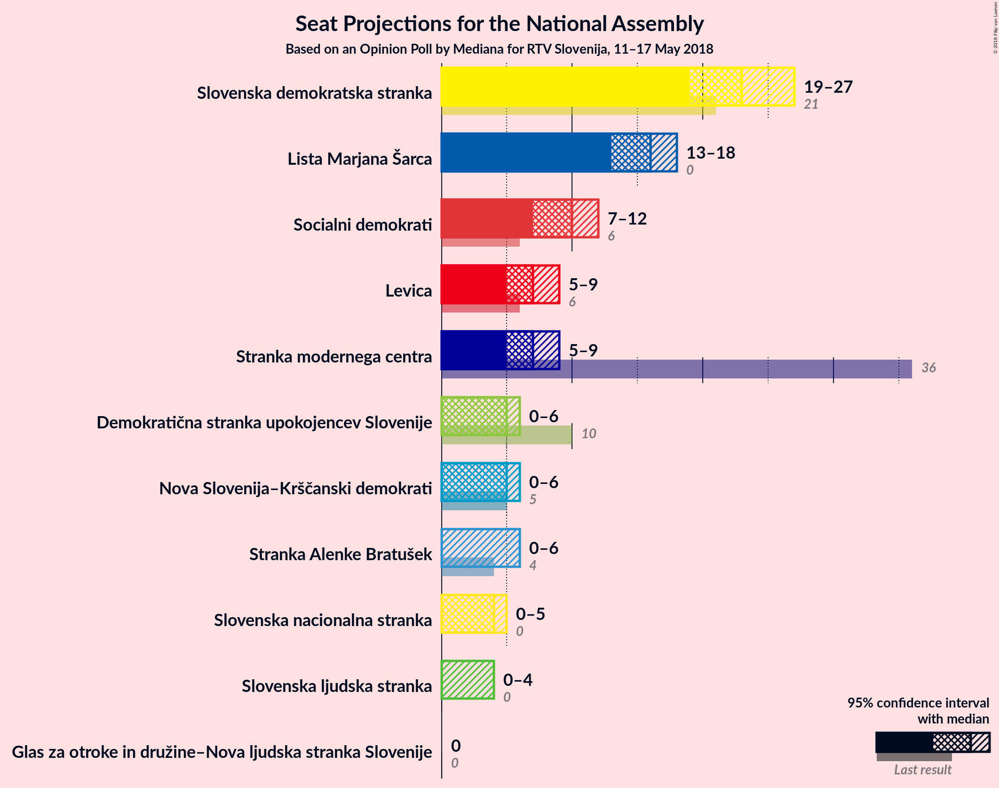
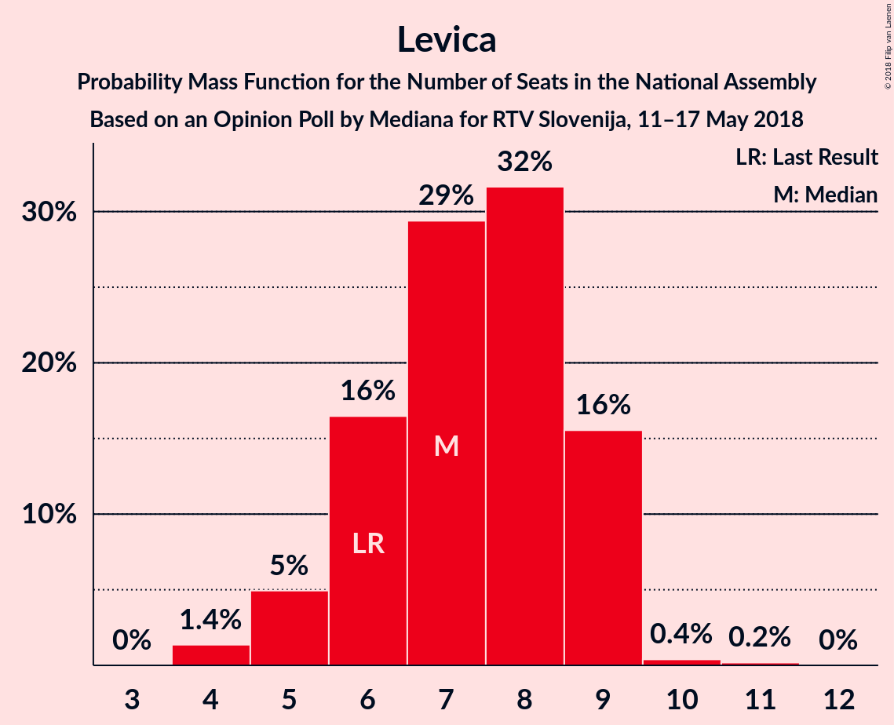

# Opinion Poll by Mediana for RTV Slovenija, 11–17 May 2018

<a href="#voting-intentions">Voting Intentions</a> | <a href="#seats">Seats</a> | <a href="#coalitions">Coalitions</a> | <a href="#technical-information">Technical Information</a>

## Voting Intentions

### Confidence Intervals

| Party | Last Result | Poll Result | 80% Confidence Interval | 90% Confidence Interval | 95% Confidence Interval | 99% Confidence Interval |
|:-----:|:-----------:|:-----------:|:-----------------------:|:-----------------------:|:-----------------------:|:-----------------------:|
| Slovenska demokratska stranka | 20.7% | 24.0% | 21.7–26.5% |21.1–27.2% |20.5–27.8% |19.5–29.1% |
| Lista Marjana Šarca | 0.0% | 16.6% | 14.6–18.8% |14.1–19.4% |13.6–20.0% |12.8–21.1% |
| Socialni demokrati | 6.0% | 10.1% | 8.6–12.0% |8.2–12.5% |7.8–13.0% |7.1–13.9% |
| Levica | 6.0% | 7.4% | 6.1–9.1% |5.8–9.6% |5.5–10.0% |4.9–10.9% |
| Stranka modernega centra | 34.5% | 7.2% | 6.0–8.9% |5.6–9.4% |5.3–9.8% |4.8–10.6% |
| Demokratična stranka upokojencev Slovenije | 10.2% | 5.3% | 4.3–6.8% |4.0–7.2% |3.7–7.6% |3.3–8.4% |
| Nova Slovenija–Krščanski demokrati | 5.6% | 5.1% | 4.1–6.6% |3.8–7.0% |3.6–7.4% |3.1–8.1% |
| Stranka Alenke Bratušek | 4.4% | 4.4% | 3.4–5.8% |3.2–6.1% |2.9–6.5% |2.5–7.2% |
| Slovenska nacionalna stranka | 2.2% | 4.4% | 3.4–5.8% |3.2–6.1% |2.9–6.5% |2.5–7.2% |
| Slovenska ljudska stranka | 4.0% | 3.0% | 2.3–4.3% |2.1–4.6% |1.9–4.9% |1.6–5.5% |
| Glas za otroke in družine–Nova ljudska stranka Slovenije | 0.0% | 0.4% | 0.2–1.0% |0.2–1.2% |0.1–1.4% |0.1–1.8% |

*Note:* The poll result column reflects the actual value used in the calculations. Published results may vary slightly, and in addition be rounded to fewer digits.

## Seats

### Confidence Intervals

| Party | Last Result | Median | 80% Confidence Interval | 90% Confidence Interval | 95% Confidence Interval | 99% Confidence Interval |
|:-----:|:-----------:|:------:|:-----------------------:|:-----------------------:|:-----------------------:|:-----------------------:|
| <a href="#slovenska-demokratska-stranka">Slovenska demokratska stranka</a> | 21 | 23 | 21–25 |20–26 |19–27 |18–29 |
| <a href="#lista-marjana-šarca">Lista Marjana Šarca</a> | 0 | 16 | 13–17 |13–18 |13–18 |12–20 |
| <a href="#socialni-demokrati">Socialni demokrati</a> | 6 | 10 | 8–12 |7–12 |7–12 |7–14 |
| <a href="#levica">Levica</a> | 6 | 7 | 6–9 |5–9 |5–9 |4–10 |
| <a href="#stranka-modernega-centra">Stranka modernega centra</a> | 36 | 7 | 5–8 |5–9 |5–9 |4–10 |
| <a href="#demokratična-stranka-upokojencev-slovenije">Demokratična stranka upokojencev Slovenije</a> | 10 | 5 | 4–6 |4–6 |0–6 |0–7 |
| <a href="#nova-slovenija–krščanski-demokrati">Nova Slovenija–Krščanski demokrati</a> | 5 | 5 | 4–6 |4–6 |0–6 |0–7 |
| <a href="#stranka-alenke-bratušek">Stranka Alenke Bratušek</a> | 4 | 0 | 0–5 |0–5 |0–6 |0–7 |
| <a href="#slovenska-nacionalna-stranka">Slovenska nacionalna stranka</a> | 0 | 4 | 0–5 |0–5 |0–5 |0–6 |
| <a href="#slovenska-ljudska-stranka">Slovenska ljudska stranka</a> | 0 | 0 | 0 |0–4 |0–4 |0–4 |
| <a href="#glas-za-otroke-in-družine–nova-ljudska-stranka-slovenije">Glas za otroke in družine–Nova ljudska stranka Slovenije</a> | 0 | 0 | 0 |0 |0 |0 |

### Slovenska demokratska stranka

*For a full overview of the results for this party, see the [Slovenska demokratska stranka](party-slovenskademokratskastranka.html) page.*

| Number of Seats | Probability | Accumulated | Special Marks |
|:---------------:|:-----------:|:-----------:|:-------------:|
| 17 | 0.2% | 100% |  |
| 18 | 0.9% | 99.8% |  |
| 19 | 2% | 98.9% |  |
| 20 | 4% | 97% |  |
| 21 | 11% | 93% | Last Result |
| 22 | 20% | 82% |  |
| 23 | 38% | 62% | Median |
| 24 | 14% | 24% |  |
| 25 | 4% | 10% |  |
| 26 | 3% | 6% |  |
| 27 | 1.1% | 3% |  |
| 28 | 0.5% | 1.5% |  |
| 29 | 0.7% | 1.0% |  |
| 30 | 0.3% | 0.3% |  |
| 31 | 0% | 0% |  |

### Lista Marjana Šarca

*For a full overview of the results for this party, see the [Lista Marjana Šarca](party-listamarjanašarca.html) page.*

| Number of Seats | Probability | Accumulated | Special Marks |
|:---------------:|:-----------:|:-----------:|:-------------:|
| 0 | 0% | 100% | Last Result |
| 1 | 0% | 100% |  |
| 2 | 0% | 100% |  |
| 3 | 0% | 100% |  |
| 4 | 0% | 100% |  |
| 5 | 0% | 100% |  |
| 6 | 0% | 100% |  |
| 7 | 0% | 100% |  |
| 8 | 0% | 100% |  |
| 9 | 0% | 100% |  |
| 10 | 0% | 100% |  |
| 11 | 0.2% | 100% |  |
| 12 | 1.3% | 99.8% |  |
| 13 | 12% | 98% |  |
| 14 | 17% | 86% |  |
| 15 | 17% | 69% |  |
| 16 | 30% | 52% | Median |
| 17 | 17% | 22% |  |
| 18 | 4% | 6% |  |
| 19 | 1.3% | 2% |  |
| 20 | 0.5% | 0.6% |  |
| 21 | 0.1% | 0.1% |  |
| 22 | 0% | 0% |  |

### Socialni demokrati

*For a full overview of the results for this party, see the [Socialni demokrati](party-socialnidemokrati.html) page.*

| Number of Seats | Probability | Accumulated | Special Marks |
|:---------------:|:-----------:|:-----------:|:-------------:|
| 6 | 0.5% | 100% | Last Result |
| 7 | 8% | 99.5% |  |
| 8 | 15% | 92% |  |
| 9 | 20% | 77% |  |
| 10 | 21% | 57% | Median |
| 11 | 24% | 35% |  |
| 12 | 10% | 11% |  |
| 13 | 0.9% | 1.4% |  |
| 14 | 0.5% | 0.5% |  |
| 15 | 0% | 0% |  |

### Levica

*For a full overview of the results for this party, see the [Levica](party-levica.html) page.*

| Number of Seats | Probability | Accumulated | Special Marks |
|:---------------:|:-----------:|:-----------:|:-------------:|
| 4 | 1.4% | 100% |  |
| 5 | 5% | 98.6% |  |
| 6 | 16% | 94% | Last Result |
| 7 | 29% | 77% | Median |
| 8 | 32% | 48% |  |
| 9 | 16% | 16% |  |
| 10 | 0.4% | 0.6% |  |
| 11 | 0.2% | 0.2% |  |
| 12 | 0% | 0% |  |

### Stranka modernega centra

*For a full overview of the results for this party, see the [Stranka modernega centra](party-strankamodernegacentra.html) page.*

| Number of Seats | Probability | Accumulated | Special Marks |
|:---------------:|:-----------:|:-----------:|:-------------:|
| 4 | 1.4% | 100% |  |
| 5 | 13% | 98.5% |  |
| 6 | 13% | 85% |  |
| 7 | 43% | 72% | Median |
| 8 | 24% | 29% |  |
| 9 | 5% | 6% |  |
| 10 | 0.7% | 0.8% |  |
| 11 | 0.1% | 0.1% |  |
| 12 | 0% | 0% |  |
| 13 | 0% | 0% |  |
| 14 | 0% | 0% |  |
| 15 | 0% | 0% |  |
| 16 | 0% | 0% |  |
| 17 | 0% | 0% |  |
| 18 | 0% | 0% |  |
| 19 | 0% | 0% |  |
| 20 | 0% | 0% |  |
| 21 | 0% | 0% |  |
| 22 | 0% | 0% |  |
| 23 | 0% | 0% |  |
| 24 | 0% | 0% |  |
| 25 | 0% | 0% |  |
| 26 | 0% | 0% |  |
| 27 | 0% | 0% |  |
| 28 | 0% | 0% |  |
| 29 | 0% | 0% |  |
| 30 | 0% | 0% |  |
| 31 | 0% | 0% |  |
| 32 | 0% | 0% |  |
| 33 | 0% | 0% |  |
| 34 | 0% | 0% |  |
| 35 | 0% | 0% |  |
| 36 | 0% | 0% | Last Result |

### Demokratična stranka upokojencev Slovenije

*For a full overview of the results for this party, see the [Demokratična stranka upokojencev Slovenije](party-demokratičnastrankaupokojencevslovenije.html) page.*

| Number of Seats | Probability | Accumulated | Special Marks |
|:---------------:|:-----------:|:-----------:|:-------------:|
| 0 | 3% | 100% |  |
| 1 | 0% | 97% |  |
| 2 | 0% | 97% |  |
| 3 | 0.5% | 97% |  |
| 4 | 23% | 96% |  |
| 5 | 59% | 73% | Median |
| 6 | 13% | 14% |  |
| 7 | 2% | 2% |  |
| 8 | 0.2% | 0.2% |  |
| 9 | 0% | 0% |  |
| 10 | 0% | 0% | Last Result |

### Nova Slovenija–Krščanski demokrati

*For a full overview of the results for this party, see the [Nova Slovenija–Krščanski demokrati](party-novaslovenija–krščanskidemokrati.html) page.*

| Number of Seats | Probability | Accumulated | Special Marks |
|:---------------:|:-----------:|:-----------:|:-------------:|
| 0 | 4% | 100% |  |
| 1 | 0% | 96% |  |
| 2 | 0% | 96% |  |
| 3 | 0.4% | 96% |  |
| 4 | 28% | 96% |  |
| 5 | 52% | 68% | Last Result, Median |
| 6 | 13% | 15% |  |
| 7 | 2% | 2% |  |
| 8 | 0.2% | 0.3% |  |
| 9 | 0% | 0% |  |

### Stranka Alenke Bratušek

*For a full overview of the results for this party, see the [Stranka Alenke Bratušek](party-strankaalenkebratušek.html) page.*

| Number of Seats | Probability | Accumulated | Special Marks |
|:---------------:|:-----------:|:-----------:|:-------------:|
| 0 | 55% | 100% | Median |
| 1 | 0% | 45% |  |
| 2 | 0% | 45% |  |
| 3 | 1.0% | 45% |  |
| 4 | 28% | 44% | Last Result |
| 5 | 13% | 16% |  |
| 6 | 3% | 4% |  |
| 7 | 0.6% | 0.7% |  |
| 8 | 0% | 0% |  |

### Slovenska nacionalna stranka

*For a full overview of the results for this party, see the [Slovenska nacionalna stranka](party-slovenskanacionalnastranka.html) page.*

| Number of Seats | Probability | Accumulated | Special Marks |
|:---------------:|:-----------:|:-----------:|:-------------:|
| 0 | 39% | 100% | Last Result |
| 1 | 0% | 61% |  |
| 2 | 0% | 61% |  |
| 3 | 0.8% | 61% |  |
| 4 | 45% | 60% | Median |
| 5 | 14% | 15% |  |
| 6 | 1.1% | 1.4% |  |
| 7 | 0.3% | 0.3% |  |
| 8 | 0% | 0% |  |

### Slovenska ljudska stranka

*For a full overview of the results for this party, see the [Slovenska ljudska stranka](party-slovenskaljudskastranka.html) page.*

| Number of Seats | Probability | Accumulated | Special Marks |
|:---------------:|:-----------:|:-----------:|:-------------:|
| 0 | 92% | 100% | Last Result, Median |
| 1 | 0% | 8% |  |
| 2 | 0% | 8% |  |
| 3 | 0.6% | 8% |  |
| 4 | 7% | 7% |  |
| 5 | 0.3% | 0.3% |  |
| 6 | 0% | 0% |  |

### Glas za otroke in družine–Nova ljudska stranka Slovenije

*For a full overview of the results for this party, see the [Glas za otroke in družine–Nova ljudska stranka Slovenije](party-glaszaotrokeindružine–novaljudskastrankaslovenije.html) page.*

| Number of Seats | Probability | Accumulated | Special Marks |
|:---------------:|:-----------:|:-----------:|:-------------:|
| 0 | 100% | 100% | Last Result, Median |

## Coalitions

### Confidence Intervals

| Coalition | Last Result | Median | Majority? | 80% Confidence Interval | 90% Confidence Interval | 95% Confidence Interval | 99% Confidence Interval |
|:---------:|:-----------:|:------:|:---------:|:-----------------------:|:-----------------------:|:-----------------------:|:-----------------------:|
| Slovenska demokratska stranka – Lista Marjana Šarca – Demokratična stranka upokojencev Slovenije | 31 | 44 | 11% | 39–46 | 39–47 | 39–48 | 36–50 |
| Slovenska demokratska stranka – Lista Marjana Šarca | 21 | 39 | 0.1% | 35–41 | 34–42 | 34–43 | 32–45 |
| Lista Marjana Šarca – Socialni demokrati – Stranka modernega centra | 42 | 32 | 0% | 28–35 | 28–35 | 28–37 | 26–38 |
| Lista Marjana Šarca – Socialni demokrati – Nova Slovenija–Krščanski demokrati | 11 | 29 | 0% | 27–32 | 26–34 | 25–35 | 24–35 |
| Lista Marjana Šarca – Socialni demokrati – Demokratična stranka upokojencev Slovenije | 16 | 30 | 0% | 27–33 | 26–33 | 25–34 | 24–36 |
| Lista Marjana Šarca – Socialni demokrati | 6 | 25 | 0% | 23–28 | 22–28 | 21–29 | 20–31 |
| Socialni demokrati – Stranka modernega centra – Demokratična stranka upokojencev Slovenije | 52 | 22 | 0% | 18–24 | 17–24 | 17–25 | 15–27 |

### Slovenska demokratska stranka – Lista Marjana Šarca – Demokratična stranka upokojencev Slovenije

| Number of Seats | Probability | Accumulated | Special Marks |
|:---------------:|:-----------:|:-----------:|:-------------:|
| 31 | 0% | 100% | Last Result |
| 32 | 0% | 100% |  |
| 33 | 0% | 100% |  |
| 34 | 0% | 100% |  |
| 35 | 0.1% | 100% |  |
| 36 | 0.4% | 99.9% |  |
| 37 | 0.7% | 99.4% |  |
| 38 | 0.6% | 98.8% |  |
| 39 | 9% | 98% |  |
| 40 | 10% | 89% |  |
| 41 | 7% | 79% |  |
| 42 | 13% | 72% |  |
| 43 | 5% | 59% |  |
| 44 | 33% | 53% | Median |
| 45 | 10% | 21% |  |
| 46 | 5% | 11% | Majority |
| 47 | 3% | 6% |  |
| 48 | 1.0% | 3% |  |
| 49 | 1.1% | 2% |  |
| 50 | 0.4% | 0.6% |  |
| 51 | 0.1% | 0.2% |  |
| 52 | 0.1% | 0.1% |  |
| 53 | 0% | 0% |  |

### Slovenska demokratska stranka – Lista Marjana Šarca

| Number of Seats | Probability | Accumulated | Special Marks |
|:---------------:|:-----------:|:-----------:|:-------------:|
| 21 | 0% | 100% | Last Result |
| 22 | 0% | 100% |  |
| 23 | 0% | 100% |  |
| 24 | 0% | 100% |  |
| 25 | 0% | 100% |  |
| 26 | 0% | 100% |  |
| 27 | 0% | 100% |  |
| 28 | 0% | 100% |  |
| 29 | 0% | 100% |  |
| 30 | 0% | 100% |  |
| 31 | 0.1% | 100% |  |
| 32 | 0.4% | 99.8% |  |
| 33 | 1.0% | 99.5% |  |
| 34 | 7% | 98% |  |
| 35 | 5% | 92% |  |
| 36 | 11% | 87% |  |
| 37 | 10% | 76% |  |
| 38 | 11% | 65% |  |
| 39 | 33% | 54% | Median |
| 40 | 10% | 21% |  |
| 41 | 6% | 11% |  |
| 42 | 3% | 5% |  |
| 43 | 1.1% | 3% |  |
| 44 | 0.8% | 2% |  |
| 45 | 0.6% | 0.7% |  |
| 46 | 0.1% | 0.1% | Majority |
| 47 | 0% | 0% |  |

### Lista Marjana Šarca – Socialni demokrati – Stranka modernega centra

| Number of Seats | Probability | Accumulated | Special Marks |
|:---------------:|:-----------:|:-----------:|:-------------:|
| 25 | 0.1% | 100% |  |
| 26 | 1.4% | 99.9% |  |
| 27 | 0.8% | 98.6% |  |
| 28 | 10% | 98% |  |
| 29 | 5% | 87% |  |
| 30 | 11% | 83% |  |
| 31 | 18% | 71% |  |
| 32 | 7% | 53% |  |
| 33 | 6% | 46% | Median |
| 34 | 24% | 40% |  |
| 35 | 12% | 16% |  |
| 36 | 1.1% | 4% |  |
| 37 | 2% | 3% |  |
| 38 | 0.5% | 0.8% |  |
| 39 | 0.3% | 0.3% |  |
| 40 | 0% | 0% |  |
| 41 | 0% | 0% |  |
| 42 | 0% | 0% | Last Result |

### Lista Marjana Šarca – Socialni demokrati – Nova Slovenija–Krščanski demokrati

| Number of Seats | Probability | Accumulated | Special Marks |
|:---------------:|:-----------:|:-----------:|:-------------:|
| 11 | 0% | 100% | Last Result |
| 12 | 0% | 100% |  |
| 13 | 0% | 100% |  |
| 14 | 0% | 100% |  |
| 15 | 0% | 100% |  |
| 16 | 0% | 100% |  |
| 17 | 0% | 100% |  |
| 18 | 0% | 100% |  |
| 19 | 0% | 100% |  |
| 20 | 0% | 100% |  |
| 21 | 0.1% | 100% |  |
| 22 | 0.1% | 99.9% |  |
| 23 | 0.2% | 99.8% |  |
| 24 | 1.4% | 99.6% |  |
| 25 | 2% | 98% |  |
| 26 | 3% | 96% |  |
| 27 | 16% | 93% |  |
| 28 | 13% | 77% |  |
| 29 | 15% | 64% |  |
| 30 | 4% | 49% |  |
| 31 | 6% | 44% | Median |
| 32 | 31% | 39% |  |
| 33 | 2% | 8% |  |
| 34 | 2% | 6% |  |
| 35 | 3% | 4% |  |
| 36 | 0.2% | 0.3% |  |
| 37 | 0.1% | 0.1% |  |
| 38 | 0% | 0% |  |

### Lista Marjana Šarca – Socialni demokrati – Demokratična stranka upokojencev Slovenije

| Number of Seats | Probability | Accumulated | Special Marks |
|:---------------:|:-----------:|:-----------:|:-------------:|
| 16 | 0% | 100% | Last Result |
| 17 | 0% | 100% |  |
| 18 | 0% | 100% |  |
| 19 | 0% | 100% |  |
| 20 | 0% | 100% |  |
| 21 | 0% | 100% |  |
| 22 | 0% | 100% |  |
| 23 | 0.1% | 99.9% |  |
| 24 | 1.0% | 99.9% |  |
| 25 | 2% | 98.8% |  |
| 26 | 4% | 97% |  |
| 27 | 13% | 93% |  |
| 28 | 13% | 80% |  |
| 29 | 13% | 67% |  |
| 30 | 11% | 54% |  |
| 31 | 6% | 43% | Median |
| 32 | 27% | 37% |  |
| 33 | 8% | 11% |  |
| 34 | 0.8% | 3% |  |
| 35 | 1.1% | 2% |  |
| 36 | 0.3% | 0.7% |  |
| 37 | 0.4% | 0.4% |  |
| 38 | 0% | 0% |  |

### Lista Marjana Šarca – Socialni demokrati

| Number of Seats | Probability | Accumulated | Special Marks |
|:---------------:|:-----------:|:-----------:|:-------------:|
| 6 | 0% | 100% | Last Result |
| 7 | 0% | 100% |  |
| 8 | 0% | 100% |  |
| 9 | 0% | 100% |  |
| 10 | 0% | 100% |  |
| 11 | 0% | 100% |  |
| 12 | 0% | 100% |  |
| 13 | 0% | 100% |  |
| 14 | 0% | 100% |  |
| 15 | 0% | 100% |  |
| 16 | 0% | 100% |  |
| 17 | 0% | 100% |  |
| 18 | 0% | 100% |  |
| 19 | 0.1% | 100% |  |
| 20 | 2% | 99.9% |  |
| 21 | 2% | 98% |  |
| 22 | 5% | 96% |  |
| 23 | 25% | 91% |  |
| 24 | 10% | 66% |  |
| 25 | 11% | 56% |  |
| 26 | 6% | 45% | Median |
| 27 | 28% | 39% |  |
| 28 | 6% | 11% |  |
| 29 | 3% | 4% |  |
| 30 | 0.5% | 1.4% |  |
| 31 | 0.8% | 0.9% |  |
| 32 | 0.1% | 0.1% |  |
| 33 | 0% | 0% |  |

### Socialni demokrati – Stranka modernega centra – Demokratična stranka upokojencev Slovenije

| Number of Seats | Probability | Accumulated | Special Marks |
|:---------------:|:-----------:|:-----------:|:-------------:|
| 14 | 0.1% | 100% |  |
| 15 | 1.0% | 99.9% |  |
| 16 | 1.3% | 98.9% |  |
| 17 | 3% | 98% |  |
| 18 | 9% | 95% |  |
| 19 | 4% | 85% |  |
| 20 | 14% | 82% |  |
| 21 | 13% | 68% |  |
| 22 | 14% | 55% | Median |
| 23 | 30% | 42% |  |
| 24 | 7% | 11% |  |
| 25 | 2% | 4% |  |
| 26 | 2% | 2% |  |
| 27 | 0.5% | 0.5% |  |
| 28 | 0% | 0% |  |
| 29 | 0% | 0% |  |
| 30 | 0% | 0% |  |
| 31 | 0% | 0% |  |
| 32 | 0% | 0% |  |
| 33 | 0% | 0% |  |
| 34 | 0% | 0% |  |
| 35 | 0% | 0% |  |
| 36 | 0% | 0% |  |
| 37 | 0% | 0% |  |
| 38 | 0% | 0% |  |
| 39 | 0% | 0% |  |
| 40 | 0% | 0% |  |
| 41 | 0% | 0% |  |
| 42 | 0% | 0% |  |
| 43 | 0% | 0% |  |
| 44 | 0% | 0% |  |
| 45 | 0% | 0% |  |
| 46 | 0% | 0% | Majority |
| 47 | 0% | 0% |  |
| 48 | 0% | 0% |  |
| 49 | 0% | 0% |  |
| 50 | 0% | 0% |  |
| 51 | 0% | 0% |  |
| 52 | 0% | 0% | Last Result |

## Technical Information

### Opinion Poll

+ **Polling firm:** Mediana
+ **Commissioner(s):** RTV Slovenija
+ **Fieldwork period:** 11–17 May 2018

### Calculations

+ **Sample size:** 525
+ **Simulations done:** 1,048,576
+ **Error estimate:** 2.09%

