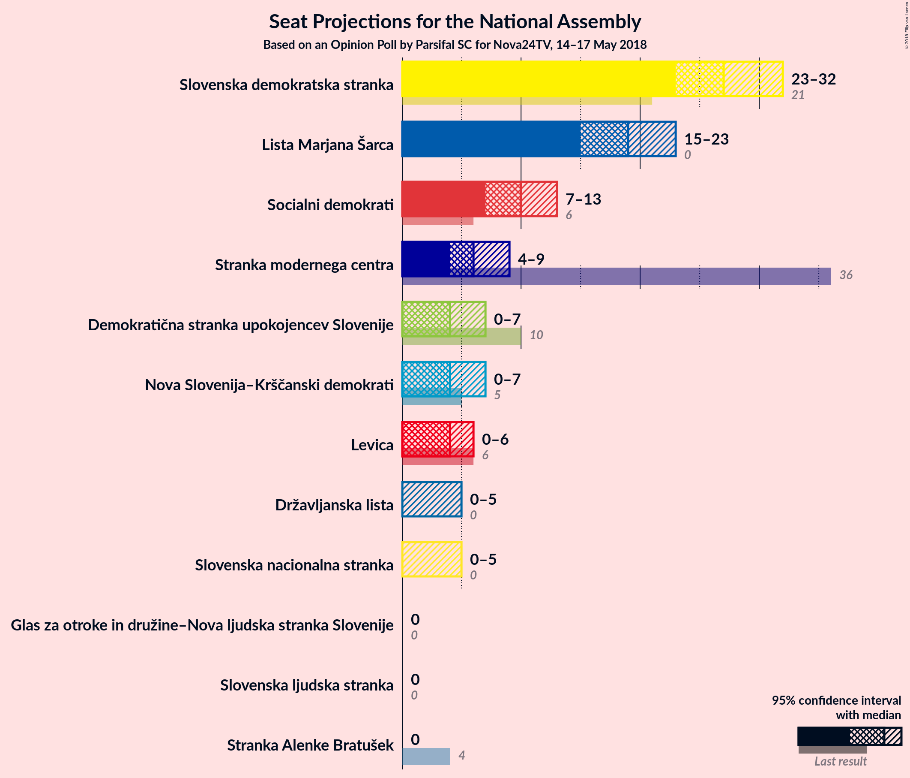
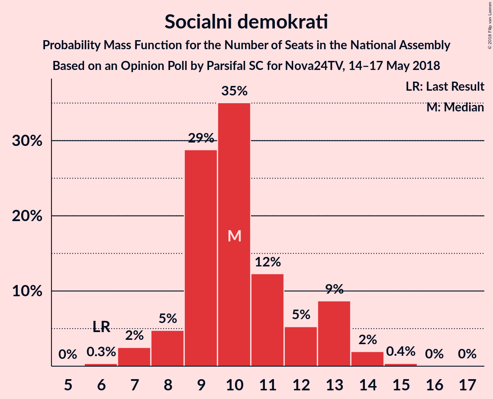
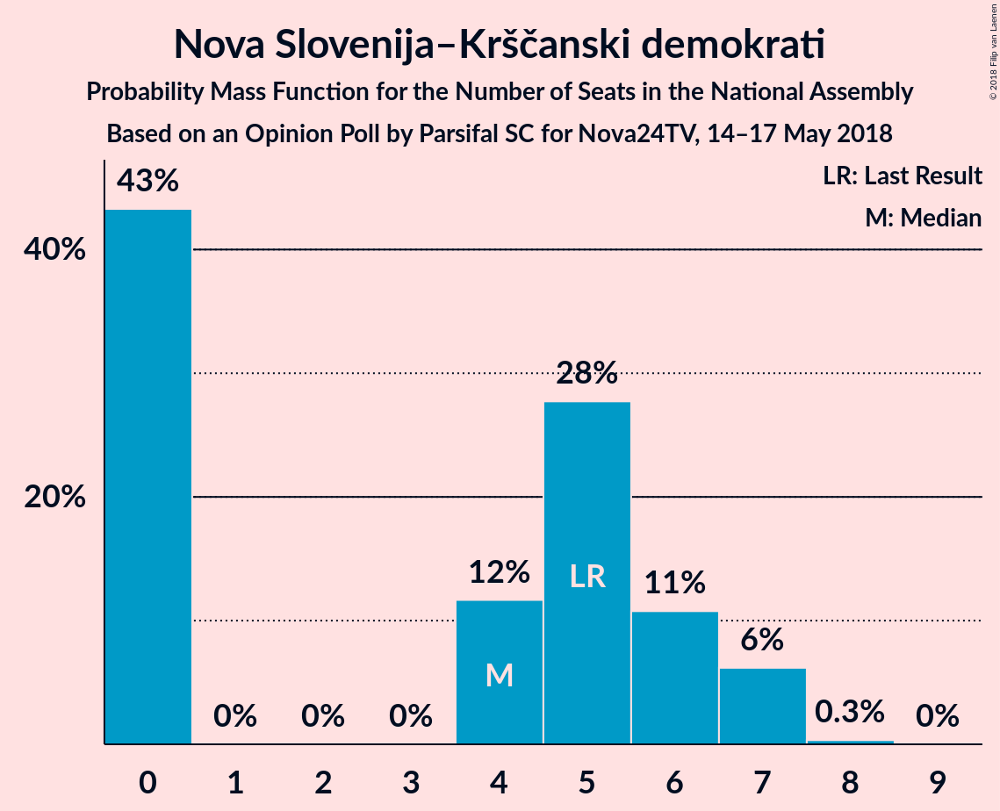
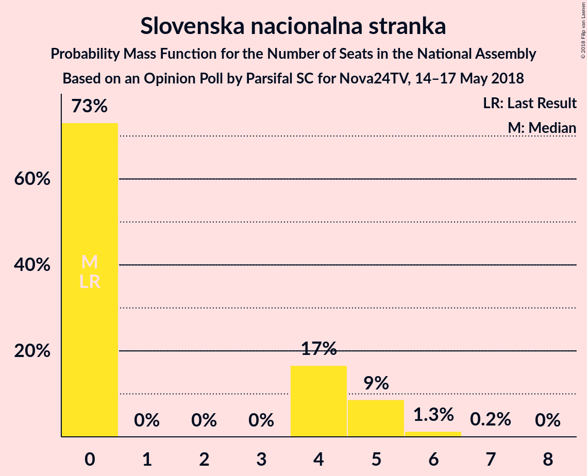
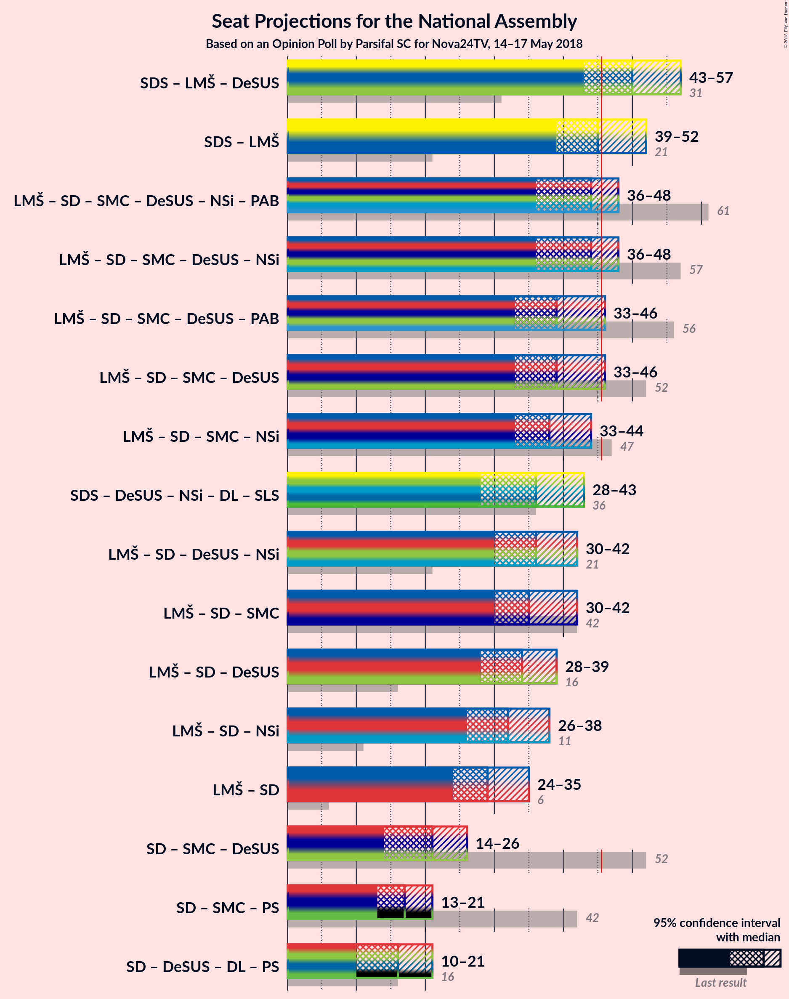

# Opinion Poll by Parsifal SC for Nova24TV, 14–17 May 2018

<a href="#voting-intentions">Voting Intentions</a> | <a href="#seats">Seats</a> | <a href="#coalitions">Coalitions</a> | <a href="#technical-information">Technical Information</a>

## Voting Intentions

### Confidence Intervals

| Party | Last Result | Poll Result | 80% Confidence Interval | 90% Confidence Interval | 95% Confidence Interval | 99% Confidence Interval |
|:-----:|:-----------:|:-----------:|:-----------------------:|:-----------------------:|:-----------------------:|:-----------------------:|
| Slovenska demokratska stranka | 20.7% | 25.8% | 23.4–28.5% |22.7–29.3% |22.1–29.9% |21.0–31.3% |
| Lista Marjana Šarca | 0.0% | 18.3% | 16.2–20.8% |15.6–21.4% |15.1–22.1% |14.2–23.3% |
| Socialni demokrati | 6.0% | 10.2% | 8.6–12.2% |8.2–12.8% |7.8–13.2% |7.1–14.3% |
| Stranka modernega centra | 34.5% | 6.5% | 5.2–8.1% |4.9–8.6% |4.6–9.0% |4.1–9.9% |
| Demokratična stranka upokojencev Slovenije | 10.2% | 4.8% | 3.7–6.3% |3.5–6.7% |3.2–7.1% |2.8–7.9% |
| Nova Slovenija–Krščanski demokrati | 5.6% | 4.6% | 3.6–6.1% |3.3–6.5% |3.0–6.8% |2.6–7.6% |
| Levica | 6.0% | 4.2% | 3.2–5.6% |2.9–6.0% |2.7–6.4% |2.3–7.1% |
| Slovenska nacionalna stranka | 2.2% | 3.8% | 2.9–5.1% |2.6–5.5% |2.4–5.9% |2.0–6.6% |
| Državljanska lista | 0.6% | 3.5% | 2.7–4.9% |2.4–5.3% |2.2–5.6% |1.9–6.3% |
| Slovenska ljudska stranka | 4.0% | 2.1% | 1.5–3.2% |1.3–3.5% |1.1–3.8% |0.9–4.4% |
| Stranka Alenke Bratušek | 4.4% | 1.9% | 1.3–2.9% |1.1–3.2% |1.0–3.5% |0.8–4.1% |
| Glas za otroke in družine–Nova ljudska stranka Slovenije | 0.0% | 1.9% | 1.3–2.9% |1.1–3.2% |1.0–3.5% |0.8–4.1% |

*Note:* The poll result column reflects the actual value used in the calculations. Published results may vary slightly, and in addition be rounded to fewer digits.

## Seats

### Confidence Intervals

| Party | Last Result | Median | 80% Confidence Interval | 90% Confidence Interval | 95% Confidence Interval | 99% Confidence Interval |
|:-----:|:-----------:|:------:|:-----------------------:|:-----------------------:|:-----------------------:|:-----------------------:|
| <a href="#slovenska-demokratska-stranka">Slovenska demokratska stranka</a> | 21 | 27 | 23–30 |23–30 |23–32 |21–36 |
| <a href="#lista-marjana-šarca">Lista Marjana Šarca</a> | 0 | 19 | 16–21 |16–22 |15–23 |14–26 |
| <a href="#socialni-demokrati">Socialni demokrati</a> | 6 | 10 | 9–13 |8–13 |7–13 |7–14 |
| <a href="#stranka-modernega-centra">Stranka modernega centra</a> | 36 | 6 | 5–9 |4–9 |4–9 |0–10 |
| <a href="#demokratična-stranka-upokojencev-slovenije">Demokratična stranka upokojencev Slovenije</a> | 10 | 4 | 0–7 |0–7 |0–7 |0–8 |
| <a href="#nova-slovenija–krščanski-demokrati">Nova Slovenija–Krščanski demokrati</a> | 5 | 4 | 0–6 |0–7 |0–7 |0–7 |
| <a href="#levica">Levica</a> | 6 | 4 | 0–5 |0–6 |0–6 |0–7 |
| <a href="#slovenska-nacionalna-stranka">Slovenska nacionalna stranka</a> | 0 | 0 | 0–5 |0–5 |0–5 |0–6 |
| <a href="#državljanska-lista">Državljanska lista</a> | 0 | 0 | 0–5 |0–5 |0–5 |0–6 |
| <a href="#slovenska-ljudska-stranka">Slovenska ljudska stranka</a> | 0 | 0 | 0 |0 |0 |0–4 |
| <a href="#stranka-alenke-bratušek">Stranka Alenke Bratušek</a> | 4 | 0 | 0 |0 |0 |0–4 |
| <a href="#glas-za-otroke-in-družine–nova-ljudska-stranka-slovenije">Glas za otroke in družine–Nova ljudska stranka Slovenije</a> | 0 | 0 | 0 |0 |0 |0 |

### Slovenska demokratska stranka

*For a full overview of the results for this party, see the [Slovenska demokratska stranka](party-slovenskademokratskastranka.html) page.*

| Number of Seats | Probability | Accumulated | Special Marks |
|:---------------:|:-----------:|:-----------:|:-------------:|
| 19 | 0.1% | 100% |  |
| 20 | 0.2% | 99.9% |  |
| 21 | 0.7% | 99.7% | Last Result |
| 22 | 1.4% | 99.0% |  |
| 23 | 8% | 98% |  |
| 24 | 8% | 90% |  |
| 25 | 7% | 81% |  |
| 26 | 21% | 75% |  |
| 27 | 13% | 53% | Median |
| 28 | 11% | 40% |  |
| 29 | 8% | 29% |  |
| 30 | 17% | 21% |  |
| 31 | 0.7% | 3% |  |
| 32 | 0.7% | 3% |  |
| 33 | 1.0% | 2% |  |
| 34 | 0.1% | 1.0% |  |
| 35 | 0.1% | 0.8% |  |
| 36 | 0.7% | 0.7% |  |
| 37 | 0% | 0% |  |

### Lista Marjana Šarca

*For a full overview of the results for this party, see the [Lista Marjana Šarca](party-listamarjanašarca.html) page.*

| Number of Seats | Probability | Accumulated | Special Marks |
|:---------------:|:-----------:|:-----------:|:-------------:|
| 0 | 0% | 100% | Last Result |
| 1 | 0% | 100% |  |
| 2 | 0% | 100% |  |
| 3 | 0% | 100% |  |
| 4 | 0% | 100% |  |
| 5 | 0% | 100% |  |
| 6 | 0% | 100% |  |
| 7 | 0% | 100% |  |
| 8 | 0% | 100% |  |
| 9 | 0% | 100% |  |
| 10 | 0% | 100% |  |
| 11 | 0% | 100% |  |
| 12 | 0% | 100% |  |
| 13 | 0.3% | 100% |  |
| 14 | 0.6% | 99.7% |  |
| 15 | 3% | 99.1% |  |
| 16 | 7% | 96% |  |
| 17 | 18% | 89% |  |
| 18 | 9% | 71% |  |
| 19 | 27% | 63% | Median |
| 20 | 25% | 36% |  |
| 21 | 3% | 10% |  |
| 22 | 4% | 8% |  |
| 23 | 2% | 3% |  |
| 24 | 0.4% | 1.4% |  |
| 25 | 0.4% | 1.0% |  |
| 26 | 0.6% | 0.6% |  |
| 27 | 0% | 0% |  |

### Socialni demokrati

*For a full overview of the results for this party, see the [Socialni demokrati](party-socialnidemokrati.html) page.*

| Number of Seats | Probability | Accumulated | Special Marks |
|:---------------:|:-----------:|:-----------:|:-------------:|
| 6 | 0.3% | 100% | Last Result |
| 7 | 2% | 99.6% |  |
| 8 | 5% | 97% |  |
| 9 | 29% | 92% |  |
| 10 | 35% | 64% | Median |
| 11 | 12% | 29% |  |
| 12 | 5% | 16% |  |
| 13 | 9% | 11% |  |
| 14 | 2% | 2% |  |
| 15 | 0.4% | 0.4% |  |
| 16 | 0% | 0.1% |  |
| 17 | 0% | 0% |  |

### Stranka modernega centra

*For a full overview of the results for this party, see the [Stranka modernega centra](party-strankamodernegacentra.html) page.*

| Number of Seats | Probability | Accumulated | Special Marks |
|:---------------:|:-----------:|:-----------:|:-------------:|
| 0 | 1.0% | 100% |  |
| 1 | 0% | 99.0% |  |
| 2 | 0% | 99.0% |  |
| 3 | 0% | 99.0% |  |
| 4 | 5% | 99.0% |  |
| 5 | 29% | 94% |  |
| 6 | 18% | 66% | Median |
| 7 | 17% | 48% |  |
| 8 | 13% | 31% |  |
| 9 | 17% | 18% |  |
| 10 | 0.6% | 0.6% |  |
| 11 | 0.1% | 0.1% |  |
| 12 | 0% | 0% |  |
| 13 | 0% | 0% |  |
| 14 | 0% | 0% |  |
| 15 | 0% | 0% |  |
| 16 | 0% | 0% |  |
| 17 | 0% | 0% |  |
| 18 | 0% | 0% |  |
| 19 | 0% | 0% |  |
| 20 | 0% | 0% |  |
| 21 | 0% | 0% |  |
| 22 | 0% | 0% |  |
| 23 | 0% | 0% |  |
| 24 | 0% | 0% |  |
| 25 | 0% | 0% |  |
| 26 | 0% | 0% |  |
| 27 | 0% | 0% |  |
| 28 | 0% | 0% |  |
| 29 | 0% | 0% |  |
| 30 | 0% | 0% |  |
| 31 | 0% | 0% |  |
| 32 | 0% | 0% |  |
| 33 | 0% | 0% |  |
| 34 | 0% | 0% |  |
| 35 | 0% | 0% |  |
| 36 | 0% | 0% | Last Result |

### Demokratična stranka upokojencev Slovenije

*For a full overview of the results for this party, see the [Demokratična stranka upokojencev Slovenije](party-demokratičnastrankaupokojencevslovenije.html) page.*

| Number of Seats | Probability | Accumulated | Special Marks |
|:---------------:|:-----------:|:-----------:|:-------------:|
| 0 | 13% | 100% |  |
| 1 | 0% | 87% |  |
| 2 | 0% | 87% |  |
| 3 | 0% | 87% |  |
| 4 | 37% | 87% | Median |
| 5 | 24% | 50% |  |
| 6 | 11% | 26% |  |
| 7 | 14% | 15% |  |
| 8 | 0.4% | 0.5% |  |
| 9 | 0.1% | 0.1% |  |
| 10 | 0% | 0% | Last Result |

### Nova Slovenija–Krščanski demokrati

*For a full overview of the results for this party, see the [Nova Slovenija–Krščanski demokrati](party-novaslovenija–krščanskidemokrati.html) page.*

| Number of Seats | Probability | Accumulated | Special Marks |
|:---------------:|:-----------:|:-----------:|:-------------:|
| 0 | 43% | 100% |  |
| 1 | 0% | 57% |  |
| 2 | 0% | 57% |  |
| 3 | 0% | 57% |  |
| 4 | 12% | 57% | Median |
| 5 | 28% | 45% | Last Result |
| 6 | 11% | 17% |  |
| 7 | 6% | 7% |  |
| 8 | 0.3% | 0.4% |  |
| 9 | 0% | 0% |  |

### Levica

*For a full overview of the results for this party, see the [Levica](party-levica.html) page.*

| Number of Seats | Probability | Accumulated | Special Marks |
|:---------------:|:-----------:|:-----------:|:-------------:|
| 0 | 41% | 100% |  |
| 1 | 0% | 59% |  |
| 2 | 0% | 59% |  |
| 3 | 1.2% | 59% |  |
| 4 | 33% | 58% | Median |
| 5 | 18% | 25% |  |
| 6 | 6% | 7% | Last Result |
| 7 | 1.0% | 1.1% |  |
| 8 | 0.1% | 0.1% |  |
| 9 | 0% | 0% |  |

### Slovenska nacionalna stranka

*For a full overview of the results for this party, see the [Slovenska nacionalna stranka](party-slovenskanacionalnastranka.html) page.*

| Number of Seats | Probability | Accumulated | Special Marks |
|:---------------:|:-----------:|:-----------:|:-------------:|
| 0 | 73% | 100% | Last Result, Median |
| 1 | 0% | 27% |  |
| 2 | 0% | 27% |  |
| 3 | 0% | 27% |  |
| 4 | 17% | 27% |  |
| 5 | 9% | 10% |  |
| 6 | 1.3% | 2% |  |
| 7 | 0.2% | 0.2% |  |
| 8 | 0% | 0% |  |

### Državljanska lista

*For a full overview of the results for this party, see the [Državljanska lista](party-državljanskalista.html) page.*

| Number of Seats | Probability | Accumulated | Special Marks |
|:---------------:|:-----------:|:-----------:|:-------------:|
| 0 | 71% | 100% | Last Result, Median |
| 1 | 0% | 29% |  |
| 2 | 0% | 29% |  |
| 3 | 0% | 29% |  |
| 4 | 14% | 29% |  |
| 5 | 13% | 15% |  |
| 6 | 2% | 2% |  |
| 7 | 0.1% | 0.1% |  |
| 8 | 0% | 0% |  |

### Slovenska ljudska stranka

*For a full overview of the results for this party, see the [Slovenska ljudska stranka](party-slovenskaljudskastranka.html) page.*

| Number of Seats | Probability | Accumulated | Special Marks |
|:---------------:|:-----------:|:-----------:|:-------------:|
| 0 | 98% | 100% | Last Result, Median |
| 1 | 0% | 2% |  |
| 2 | 0% | 2% |  |
| 3 | 0% | 2% |  |
| 4 | 2% | 2% |  |
| 5 | 0.1% | 0.1% |  |
| 6 | 0% | 0% |  |

### Stranka Alenke Bratušek

*For a full overview of the results for this party, see the [Stranka Alenke Bratušek](party-strankaalenkebratušek.html) page.*

| Number of Seats | Probability | Accumulated | Special Marks |
|:---------------:|:-----------:|:-----------:|:-------------:|
| 0 | 99.4% | 100% | Median |
| 1 | 0% | 0.6% |  |
| 2 | 0% | 0.6% |  |
| 3 | 0% | 0.6% |  |
| 4 | 0.6% | 0.6% | Last Result |
| 5 | 0% | 0% |  |

### Glas za otroke in družine–Nova ljudska stranka Slovenije

*For a full overview of the results for this party, see the [Glas za otroke in družine–Nova ljudska stranka Slovenije](party-glaszaotrokeindružine–novaljudskastrankaslovenije.html) page.*

| Number of Seats | Probability | Accumulated | Special Marks |
|:---------------:|:-----------:|:-----------:|:-------------:|
| 0 | 99.7% | 100% | Last Result, Median |
| 1 | 0% | 0.3% |  |
| 2 | 0% | 0.3% |  |
| 3 | 0% | 0.3% |  |
| 4 | 0.3% | 0.3% |  |
| 5 | 0% | 0% |  |

## Coalitions

### Confidence Intervals

| Coalition | Last Result | Median | Majority? | 80% Confidence Interval | 90% Confidence Interval | 95% Confidence Interval | 99% Confidence Interval |
|:---------:|:-----------:|:------:|:---------:|:-----------------------:|:-----------------------:|:-----------------------:|:-----------------------:|
| Slovenska demokratska stranka – Lista Marjana Šarca – Demokratična stranka upokojencev Slovenije | 31 | 50 | 89% | 45–54 | 44–54 | 43–57 | 41–58 |
| Slovenska demokratska stranka – Lista Marjana Šarca | 21 | 45 | 48% | 41–50 | 40–51 | 39–52 | 38–54 |
| Lista Marjana Šarca – Socialni demokrati – Stranka modernega centra – Demokratična stranka upokojencev Slovenije – Nova Slovenija–Krščanski demokrati – Stranka Alenke Bratušek | 61 | 44 | 14% | 39–46 | 38–47 | 36–48 | 35–50 |
| Lista Marjana Šarca – Socialni demokrati – Stranka modernega centra – Demokratična stranka upokojencev Slovenije – Nova Slovenija–Krščanski demokrati | 57 | 44 | 14% | 39–46 | 38–47 | 36–48 | 35–50 |
| Lista Marjana Šarca – Socialni demokrati – Stranka modernega centra – Demokratična stranka upokojencev Slovenije – Stranka Alenke Bratušek | 56 | 39 | 3% | 35–44 | 34–44 | 33–46 | 32–48 |
| Lista Marjana Šarca – Socialni demokrati – Stranka modernega centra – Demokratična stranka upokojencev Slovenije | 52 | 39 | 3% | 35–44 | 34–44 | 33–46 | 31–48 |
| Lista Marjana Šarca – Socialni demokrati – Stranka modernega centra – Nova Slovenija–Krščanski demokrati | 47 | 38 | 0.7% | 35–42 | 34–43 | 33–44 | 31–46 |
| Slovenska demokratska stranka – Demokratična stranka upokojencev Slovenije – Nova Slovenija–Krščanski demokrati – Državljanska lista – Slovenska ljudska stranka | 36 | 36 | 0% | 31–40 | 30–42 | 28–43 | 27–43 |
| Lista Marjana Šarca – Socialni demokrati – Demokratična stranka upokojencev Slovenije – Nova Slovenija–Krščanski demokrati | 21 | 36 | 0.1% | 32–40 | 31–40 | 30–42 | 28–44 |
| Lista Marjana Šarca – Socialni demokrati – Stranka modernega centra | 42 | 35 | 0% | 32–38 | 30–40 | 30–42 | 28–43 |
| Lista Marjana Šarca – Socialni demokrati – Demokratična stranka upokojencev Slovenije | 16 | 34 | 0% | 30–36 | 28–37 | 28–39 | 25–41 |
| Lista Marjana Šarca – Socialni demokrati – Nova Slovenija–Krščanski demokrati | 11 | 32 | 0% | 28–36 | 27–37 | 26–38 | 25–39 |
| Lista Marjana Šarca – Socialni demokrati | 6 | 29 | 0% | 26–32 | 25–33 | 24–35 | 23–36 |
| Socialni demokrati – Stranka modernega centra – Demokratična stranka upokojencev Slovenije | 52 | 21 | 0% | 17–25 | 16–25 | 14–26 | 12–27 |

### Slovenska demokratska stranka – Lista Marjana Šarca – Demokratična stranka upokojencev Slovenije

| Number of Seats | Probability | Accumulated | Special Marks |
|:---------------:|:-----------:|:-----------:|:-------------:|
| 31 | 0% | 100% | Last Result |
| 32 | 0% | 100% |  |
| 33 | 0% | 100% |  |
| 34 | 0% | 100% |  |
| 35 | 0% | 100% |  |
| 36 | 0% | 100% |  |
| 37 | 0% | 100% |  |
| 38 | 0.1% | 100% |  |
| 39 | 0.1% | 99.9% |  |
| 40 | 0.2% | 99.8% |  |
| 41 | 0.9% | 99.7% |  |
| 42 | 0.4% | 98.7% |  |
| 43 | 2% | 98% |  |
| 44 | 3% | 97% |  |
| 45 | 5% | 94% |  |
| 46 | 7% | 89% | Majority |
| 47 | 5% | 82% |  |
| 48 | 10% | 77% |  |
| 49 | 9% | 67% |  |
| 50 | 8% | 58% | Median |
| 51 | 8% | 50% |  |
| 52 | 17% | 42% |  |
| 53 | 2% | 25% |  |
| 54 | 19% | 23% |  |
| 55 | 1.2% | 5% |  |
| 56 | 0.8% | 3% |  |
| 57 | 1.4% | 3% |  |
| 58 | 1.0% | 1.2% |  |
| 59 | 0.1% | 0.2% |  |
| 60 | 0% | 0.1% |  |
| 61 | 0% | 0% |  |

### Slovenska demokratska stranka – Lista Marjana Šarca

| Number of Seats | Probability | Accumulated | Special Marks |
|:---------------:|:-----------:|:-----------:|:-------------:|
| 21 | 0% | 100% | Last Result |
| 22 | 0% | 100% |  |
| 23 | 0% | 100% |  |
| 24 | 0% | 100% |  |
| 25 | 0% | 100% |  |
| 26 | 0% | 100% |  |
| 27 | 0% | 100% |  |
| 28 | 0% | 100% |  |
| 29 | 0% | 100% |  |
| 30 | 0% | 100% |  |
| 31 | 0% | 100% |  |
| 32 | 0% | 100% |  |
| 33 | 0% | 100% |  |
| 34 | 0% | 100% |  |
| 35 | 0.1% | 100% |  |
| 36 | 0.1% | 99.9% |  |
| 37 | 0.2% | 99.8% |  |
| 38 | 0.4% | 99.6% |  |
| 39 | 2% | 99.2% |  |
| 40 | 3% | 97% |  |
| 41 | 7% | 94% |  |
| 42 | 6% | 87% |  |
| 43 | 9% | 82% |  |
| 44 | 6% | 72% |  |
| 45 | 19% | 67% |  |
| 46 | 12% | 48% | Median, Majority |
| 47 | 5% | 36% |  |
| 48 | 5% | 31% |  |
| 49 | 4% | 27% |  |
| 50 | 18% | 23% |  |
| 51 | 3% | 5% |  |
| 52 | 1.4% | 3% |  |
| 53 | 0.2% | 1.4% |  |
| 54 | 0.9% | 1.2% |  |
| 55 | 0.1% | 0.3% |  |
| 56 | 0% | 0.2% |  |
| 57 | 0.1% | 0.2% |  |
| 58 | 0% | 0.1% |  |
| 59 | 0% | 0% |  |

### Lista Marjana Šarca – Socialni demokrati – Stranka modernega centra – Demokratična stranka upokojencev Slovenije – Nova Slovenija–Krščanski demokrati – Stranka Alenke Bratušek

| Number of Seats | Probability | Accumulated | Special Marks |
|:---------------:|:-----------:|:-----------:|:-------------:|
| 31 | 0.1% | 100% |  |
| 32 | 0.2% | 99.9% |  |
| 33 | 0% | 99.7% |  |
| 34 | 0.1% | 99.7% |  |
| 35 | 0.8% | 99.5% |  |
| 36 | 2% | 98.8% |  |
| 37 | 1.2% | 97% |  |
| 38 | 3% | 96% |  |
| 39 | 8% | 93% |  |
| 40 | 4% | 85% |  |
| 41 | 10% | 81% |  |
| 42 | 11% | 71% |  |
| 43 | 9% | 60% | Median |
| 44 | 33% | 51% |  |
| 45 | 4% | 18% |  |
| 46 | 7% | 14% | Majority |
| 47 | 5% | 8% |  |
| 48 | 1.3% | 3% |  |
| 49 | 1.1% | 2% |  |
| 50 | 0.5% | 0.8% |  |
| 51 | 0.2% | 0.3% |  |
| 52 | 0.1% | 0.2% |  |
| 53 | 0% | 0.1% |  |
| 54 | 0% | 0% |  |
| 55 | 0% | 0% |  |
| 56 | 0% | 0% |  |
| 57 | 0% | 0% |  |
| 58 | 0% | 0% |  |
| 59 | 0% | 0% |  |
| 60 | 0% | 0% |  |
| 61 | 0% | 0% | Last Result |

### Lista Marjana Šarca – Socialni demokrati – Stranka modernega centra – Demokratična stranka upokojencev Slovenije – Nova Slovenija–Krščanski demokrati

| Number of Seats | Probability | Accumulated | Special Marks |
|:---------------:|:-----------:|:-----------:|:-------------:|
| 31 | 0.1% | 100% |  |
| 32 | 0.2% | 99.9% |  |
| 33 | 0% | 99.7% |  |
| 34 | 0.2% | 99.7% |  |
| 35 | 0.8% | 99.5% |  |
| 36 | 2% | 98.8% |  |
| 37 | 1.2% | 97% |  |
| 38 | 3% | 96% |  |
| 39 | 8% | 93% |  |
| 40 | 4% | 85% |  |
| 41 | 10% | 81% |  |
| 42 | 11% | 71% |  |
| 43 | 9% | 59% | Median |
| 44 | 32% | 51% |  |
| 45 | 4% | 18% |  |
| 46 | 7% | 14% | Majority |
| 47 | 5% | 8% |  |
| 48 | 1.3% | 3% |  |
| 49 | 1.0% | 2% |  |
| 50 | 0.5% | 0.8% |  |
| 51 | 0.1% | 0.3% |  |
| 52 | 0.1% | 0.1% |  |
| 53 | 0% | 0.1% |  |
| 54 | 0% | 0% |  |
| 55 | 0% | 0% |  |
| 56 | 0% | 0% |  |
| 57 | 0% | 0% | Last Result |

### Lista Marjana Šarca – Socialni demokrati – Stranka modernega centra – Demokratična stranka upokojencev Slovenije – Stranka Alenke Bratušek

| Number of Seats | Probability | Accumulated | Special Marks |
|:---------------:|:-----------:|:-----------:|:-------------:|
| 30 | 0.1% | 100% |  |
| 31 | 0.3% | 99.9% |  |
| 32 | 0.6% | 99.5% |  |
| 33 | 2% | 98.9% |  |
| 34 | 4% | 97% |  |
| 35 | 5% | 93% |  |
| 36 | 5% | 88% |  |
| 37 | 4% | 83% |  |
| 38 | 4% | 79% |  |
| 39 | 26% | 75% | Median |
| 40 | 8% | 50% |  |
| 41 | 10% | 41% |  |
| 42 | 8% | 31% |  |
| 43 | 7% | 23% |  |
| 44 | 12% | 16% |  |
| 45 | 0.5% | 3% |  |
| 46 | 2% | 3% | Majority |
| 47 | 0.5% | 1.1% |  |
| 48 | 0.3% | 0.6% |  |
| 49 | 0% | 0.3% |  |
| 50 | 0.2% | 0.2% |  |
| 51 | 0% | 0% |  |
| 52 | 0% | 0% |  |
| 53 | 0% | 0% |  |
| 54 | 0% | 0% |  |
| 55 | 0% | 0% |  |
| 56 | 0% | 0% | Last Result |

### Lista Marjana Šarca – Socialni demokrati – Stranka modernega centra – Demokratična stranka upokojencev Slovenije

| Number of Seats | Probability | Accumulated | Special Marks |
|:---------------:|:-----------:|:-----------:|:-------------:|
| 30 | 0.1% | 100% |  |
| 31 | 0.3% | 99.8% |  |
| 32 | 0.6% | 99.5% |  |
| 33 | 2% | 98.9% |  |
| 34 | 4% | 96% |  |
| 35 | 5% | 93% |  |
| 36 | 5% | 88% |  |
| 37 | 4% | 83% |  |
| 38 | 4% | 79% |  |
| 39 | 26% | 75% | Median |
| 40 | 8% | 49% |  |
| 41 | 10% | 41% |  |
| 42 | 8% | 31% |  |
| 43 | 7% | 23% |  |
| 44 | 12% | 16% |  |
| 45 | 0.5% | 3% |  |
| 46 | 2% | 3% | Majority |
| 47 | 0.5% | 1.1% |  |
| 48 | 0.3% | 0.6% |  |
| 49 | 0% | 0.3% |  |
| 50 | 0.2% | 0.2% |  |
| 51 | 0% | 0% |  |
| 52 | 0% | 0% | Last Result |

### Lista Marjana Šarca – Socialni demokrati – Stranka modernega centra – Nova Slovenija–Krščanski demokrati

| Number of Seats | Probability | Accumulated | Special Marks |
|:---------------:|:-----------:|:-----------:|:-------------:|
| 29 | 0.1% | 100% |  |
| 30 | 0.4% | 99.9% |  |
| 31 | 0.3% | 99.5% |  |
| 32 | 2% | 99.2% |  |
| 33 | 1.4% | 98% |  |
| 34 | 6% | 96% |  |
| 35 | 5% | 91% |  |
| 36 | 10% | 85% |  |
| 37 | 16% | 75% |  |
| 38 | 13% | 59% |  |
| 39 | 5% | 46% | Median |
| 40 | 19% | 41% |  |
| 41 | 6% | 22% |  |
| 42 | 10% | 16% |  |
| 43 | 3% | 6% |  |
| 44 | 1.4% | 3% |  |
| 45 | 0.7% | 1.3% |  |
| 46 | 0.4% | 0.7% | Majority |
| 47 | 0.1% | 0.2% | Last Result |
| 48 | 0% | 0.1% |  |
| 49 | 0% | 0.1% |  |
| 50 | 0% | 0% |  |

### Slovenska demokratska stranka – Demokratična stranka upokojencev Slovenije – Nova Slovenija–Krščanski demokrati – Državljanska lista – Slovenska ljudska stranka

| Number of Seats | Probability | Accumulated | Special Marks |
|:---------------:|:-----------:|:-----------:|:-------------:|
| 24 | 0.2% | 100% |  |
| 25 | 0% | 99.8% |  |
| 26 | 0.2% | 99.8% |  |
| 27 | 1.1% | 99.6% |  |
| 28 | 1.1% | 98% |  |
| 29 | 2% | 97% |  |
| 30 | 2% | 96% |  |
| 31 | 6% | 94% |  |
| 32 | 5% | 88% |  |
| 33 | 16% | 83% |  |
| 34 | 8% | 67% |  |
| 35 | 9% | 60% | Median |
| 36 | 7% | 50% | Last Result |
| 37 | 4% | 43% |  |
| 38 | 10% | 39% |  |
| 39 | 19% | 29% |  |
| 40 | 3% | 10% |  |
| 41 | 2% | 7% |  |
| 42 | 2% | 5% |  |
| 43 | 3% | 3% |  |
| 44 | 0.3% | 0.4% |  |
| 45 | 0% | 0.1% |  |
| 46 | 0% | 0% | Majority |

### Lista Marjana Šarca – Socialni demokrati – Demokratična stranka upokojencev Slovenije – Nova Slovenija–Krščanski demokrati

| Number of Seats | Probability | Accumulated | Special Marks |
|:---------------:|:-----------:|:-----------:|:-------------:|
| 21 | 0% | 100% | Last Result |
| 22 | 0% | 100% |  |
| 23 | 0% | 100% |  |
| 24 | 0.1% | 100% |  |
| 25 | 0.1% | 99.9% |  |
| 26 | 0.1% | 99.9% |  |
| 27 | 0.1% | 99.7% |  |
| 28 | 0.3% | 99.6% |  |
| 29 | 0.5% | 99.3% |  |
| 30 | 3% | 98.8% |  |
| 31 | 1.2% | 96% |  |
| 32 | 6% | 95% |  |
| 33 | 7% | 89% |  |
| 34 | 12% | 83% |  |
| 35 | 17% | 71% |  |
| 36 | 9% | 53% |  |
| 37 | 6% | 44% | Median |
| 38 | 5% | 38% |  |
| 39 | 20% | 34% |  |
| 40 | 9% | 14% |  |
| 41 | 1.1% | 4% |  |
| 42 | 2% | 3% |  |
| 43 | 0.4% | 1.2% |  |
| 44 | 0.4% | 0.8% |  |
| 45 | 0.3% | 0.4% |  |
| 46 | 0.1% | 0.1% | Majority |
| 47 | 0% | 0% |  |

### Lista Marjana Šarca – Socialni demokrati – Stranka modernega centra

| Number of Seats | Probability | Accumulated | Special Marks |
|:---------------:|:-----------:|:-----------:|:-------------:|
| 27 | 0.3% | 100% |  |
| 28 | 0.2% | 99.7% |  |
| 29 | 1.2% | 99.5% |  |
| 30 | 3% | 98% |  |
| 31 | 3% | 95% |  |
| 32 | 3% | 92% |  |
| 33 | 6% | 89% |  |
| 34 | 14% | 83% |  |
| 35 | 25% | 69% | Median |
| 36 | 12% | 45% |  |
| 37 | 17% | 32% |  |
| 38 | 6% | 15% |  |
| 39 | 4% | 10% |  |
| 40 | 1.0% | 6% |  |
| 41 | 2% | 5% |  |
| 42 | 1.5% | 3% | Last Result |
| 43 | 1.2% | 1.5% |  |
| 44 | 0.2% | 0.3% |  |
| 45 | 0.1% | 0.1% |  |
| 46 | 0% | 0% | Majority |

### Lista Marjana Šarca – Socialni demokrati – Demokratična stranka upokojencev Slovenije

| Number of Seats | Probability | Accumulated | Special Marks |
|:---------------:|:-----------:|:-----------:|:-------------:|
| 16 | 0% | 100% | Last Result |
| 17 | 0% | 100% |  |
| 18 | 0% | 100% |  |
| 19 | 0% | 100% |  |
| 20 | 0% | 100% |  |
| 21 | 0% | 100% |  |
| 22 | 0% | 100% |  |
| 23 | 0% | 100% |  |
| 24 | 0.1% | 99.9% |  |
| 25 | 1.1% | 99.8% |  |
| 26 | 0.7% | 98.8% |  |
| 27 | 0.5% | 98% |  |
| 28 | 3% | 98% |  |
| 29 | 4% | 95% |  |
| 30 | 8% | 91% |  |
| 31 | 4% | 83% |  |
| 32 | 10% | 79% |  |
| 33 | 10% | 70% | Median |
| 34 | 32% | 60% |  |
| 35 | 17% | 28% |  |
| 36 | 5% | 11% |  |
| 37 | 3% | 7% |  |
| 38 | 1.1% | 4% |  |
| 39 | 2% | 3% |  |
| 40 | 0.5% | 1.4% |  |
| 41 | 0.6% | 0.9% |  |
| 42 | 0.1% | 0.3% |  |
| 43 | 0% | 0.2% |  |
| 44 | 0% | 0.2% |  |
| 45 | 0.2% | 0.2% |  |
| 46 | 0% | 0% | Majority |

### Lista Marjana Šarca – Socialni demokrati – Nova Slovenija–Krščanski demokrati

| Number of Seats | Probability | Accumulated | Special Marks |
|:---------------:|:-----------:|:-----------:|:-------------:|
| 11 | 0% | 100% | Last Result |
| 12 | 0% | 100% |  |
| 13 | 0% | 100% |  |
| 14 | 0% | 100% |  |
| 15 | 0% | 100% |  |
| 16 | 0% | 100% |  |
| 17 | 0% | 100% |  |
| 18 | 0% | 100% |  |
| 19 | 0% | 100% |  |
| 20 | 0% | 100% |  |
| 21 | 0% | 100% |  |
| 22 | 0% | 100% |  |
| 23 | 0.2% | 100% |  |
| 24 | 0.1% | 99.7% |  |
| 25 | 0.4% | 99.6% |  |
| 26 | 2% | 99.2% |  |
| 27 | 6% | 97% |  |
| 28 | 17% | 90% |  |
| 29 | 5% | 73% |  |
| 30 | 8% | 68% |  |
| 31 | 7% | 60% |  |
| 32 | 6% | 53% |  |
| 33 | 5% | 47% | Median |
| 34 | 5% | 42% |  |
| 35 | 24% | 36% |  |
| 36 | 7% | 12% |  |
| 37 | 2% | 5% |  |
| 38 | 1.4% | 3% |  |
| 39 | 1.0% | 1.3% |  |
| 40 | 0.2% | 0.3% |  |
| 41 | 0.1% | 0.1% |  |
| 42 | 0% | 0% |  |

### Lista Marjana Šarca – Socialni demokrati

| Number of Seats | Probability | Accumulated | Special Marks |
|:---------------:|:-----------:|:-----------:|:-------------:|
| 6 | 0% | 100% | Last Result |
| 7 | 0% | 100% |  |
| 8 | 0% | 100% |  |
| 9 | 0% | 100% |  |
| 10 | 0% | 100% |  |
| 11 | 0% | 100% |  |
| 12 | 0% | 100% |  |
| 13 | 0% | 100% |  |
| 14 | 0% | 100% |  |
| 15 | 0% | 100% |  |
| 16 | 0% | 100% |  |
| 17 | 0% | 100% |  |
| 18 | 0% | 100% |  |
| 19 | 0% | 100% |  |
| 20 | 0% | 100% |  |
| 21 | 0.1% | 100% |  |
| 22 | 0.3% | 99.9% |  |
| 23 | 0.9% | 99.6% |  |
| 24 | 2% | 98.7% |  |
| 25 | 4% | 97% |  |
| 26 | 7% | 93% |  |
| 27 | 8% | 86% |  |
| 28 | 24% | 78% |  |
| 29 | 12% | 54% | Median |
| 30 | 27% | 42% |  |
| 31 | 4% | 15% |  |
| 32 | 4% | 11% |  |
| 33 | 3% | 7% |  |
| 34 | 0.4% | 4% |  |
| 35 | 3% | 4% |  |
| 36 | 0.4% | 0.7% |  |
| 37 | 0% | 0.3% |  |
| 38 | 0% | 0.3% |  |
| 39 | 0.2% | 0.2% |  |
| 40 | 0% | 0% |  |

### Socialni demokrati – Stranka modernega centra – Demokratična stranka upokojencev Slovenije

| Number of Seats | Probability | Accumulated | Special Marks |
|:---------------:|:-----------:|:-----------:|:-------------:|
| 11 | 0% | 100% |  |
| 12 | 0.5% | 99.9% |  |
| 13 | 0.3% | 99.4% |  |
| 14 | 2% | 99.2% |  |
| 15 | 2% | 97% |  |
| 16 | 3% | 96% |  |
| 17 | 4% | 93% |  |
| 18 | 5% | 90% |  |
| 19 | 23% | 85% |  |
| 20 | 8% | 62% | Median |
| 21 | 8% | 54% |  |
| 22 | 13% | 46% |  |
| 23 | 8% | 32% |  |
| 24 | 5% | 25% |  |
| 25 | 16% | 20% |  |
| 26 | 3% | 3% |  |
| 27 | 0.4% | 0.6% |  |
| 28 | 0.1% | 0.3% |  |
| 29 | 0.1% | 0.2% |  |
| 30 | 0.1% | 0.1% |  |
| 31 | 0% | 0% |  |
| 32 | 0% | 0% |  |
| 33 | 0% | 0% |  |
| 34 | 0% | 0% |  |
| 35 | 0% | 0% |  |
| 36 | 0% | 0% |  |
| 37 | 0% | 0% |  |
| 38 | 0% | 0% |  |
| 39 | 0% | 0% |  |
| 40 | 0% | 0% |  |
| 41 | 0% | 0% |  |
| 42 | 0% | 0% |  |
| 43 | 0% | 0% |  |
| 44 | 0% | 0% |  |
| 45 | 0% | 0% |  |
| 46 | 0% | 0% | Majority |
| 47 | 0% | 0% |  |
| 48 | 0% | 0% |  |
| 49 | 0% | 0% |  |
| 50 | 0% | 0% |  |
| 51 | 0% | 0% |  |
| 52 | 0% | 0% | Last Result |

## Technical Information

### Opinion Poll

+ **Polling firm:** Parsifal SC
+ **Commissioner(s):** Nova24TV
+ **Fieldwork period:** 14–17 May 2018

### Calculations

+ **Sample size:** 480
+ **Simulations done:** 2,097,152
+ **Error estimate:** 4.18%

