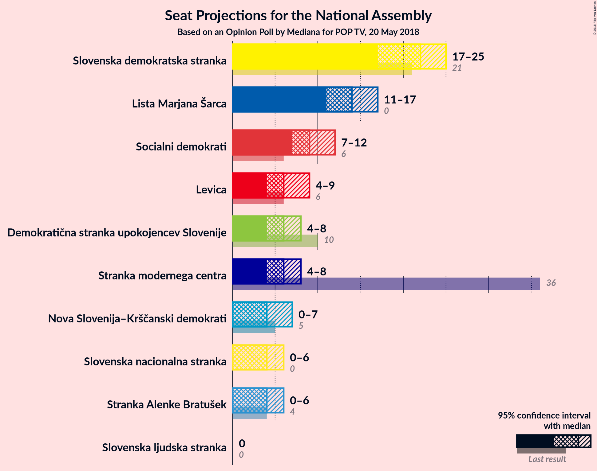
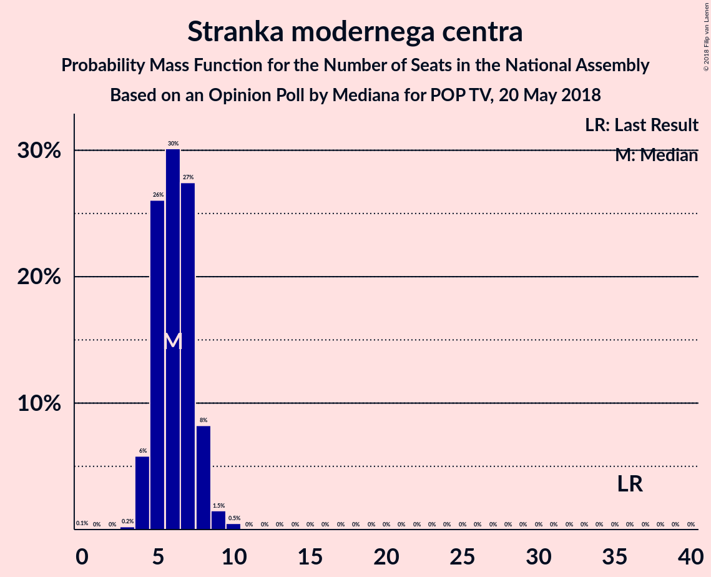
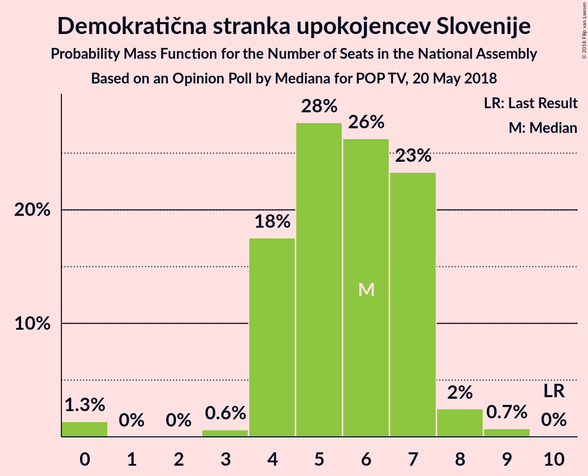
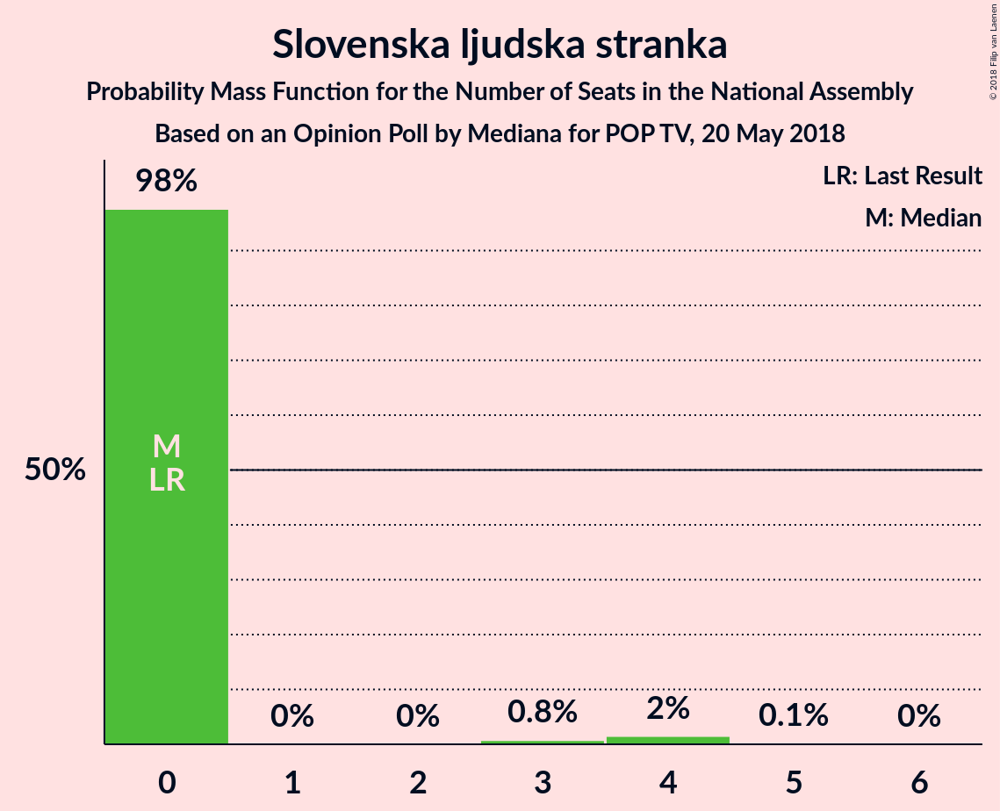

# Opinion Poll by Mediana for POP TV, 20 May 2018

<a href="#voting-intentions">Voting Intentions</a> | <a href="#seats">Seats</a> | <a href="#coalitions">Coalitions</a> | <a href="#technical-information">Technical Information</a>

## Voting Intentions

### Confidence Intervals

| Party | Last Result | Poll Result | 80% Confidence Interval | 90% Confidence Interval | 95% Confidence Interval | 99% Confidence Interval |
|:-----:|:-----------:|:-----------:|:-----------------------:|:-----------------------:|:-----------------------:|:-----------------------:|
| Slovenska demokratska stranka | 20.7% | 22.7% | 20.5–25.3% |19.8–26.0% |19.3–26.6% |18.2–27.8% |
| Lista Marjana Šarca | 0.0% | 14.8% | 13.0–17.0% |12.4–17.6% |12.0–18.2% |11.1–19.3% |
| Socialni demokrati | 6.0% | 9.9% | 8.4–11.8% |7.9–12.3% |7.6–12.8% |6.9–13.8% |
| Stranka modernega centra | 34.5% | 6.9% | 5.7–8.6% |5.3–9.1% |5.0–9.5% |4.5–10.3% |
| Levica | 6.0% | 6.9% | 5.7–8.6% |5.3–9.1% |5.0–9.5% |4.5–10.3% |
| Demokratična stranka upokojencev Slovenije | 10.2% | 5.9% | 4.8–7.5% |4.5–7.9% |4.2–8.4% |3.7–9.2% |
| Nova Slovenija–Krščanski demokrati | 5.6% | 5.1% | 4.1–6.6% |3.8–7.1% |3.5–7.4% |3.1–8.2% |
| Stranka Alenke Bratušek | 4.4% | 4.7% | 3.7–6.2% |3.4–6.6% |3.2–7.0% |2.8–7.7% |
| Slovenska nacionalna stranka | 2.2% | 4.7% | 3.7–6.2% |3.4–6.6% |3.2–7.0% |2.8–7.7% |
| Slovenska ljudska stranka | 4.0% | 2.6% | 1.9–3.7% |1.7–4.1% |1.5–4.4% |1.2–5.0% |

*Note:* The poll result column reflects the actual value used in the calculations. Published results may vary slightly, and in addition be rounded to fewer digits.

## Seats

### Confidence Intervals

| Party | Last Result | Median | 80% Confidence Interval | 90% Confidence Interval | 95% Confidence Interval | 99% Confidence Interval |
|:-----:|:-----------:|:------:|:-----------------------:|:-----------------------:|:-----------------------:|:-----------------------:|
| <a href="#slovenska-demokratska-stranka">Slovenska demokratska stranka</a> | 21 | 21 | 19–24 |18–25 |18–25 |17–27 |
| <a href="#lista-marjana-šarca">Lista Marjana Šarca</a> | 0 | 13 | 12–15 |11–16 |11–17 |10–18 |
| <a href="#socialni-demokrati">Socialni demokrati</a> | 6 | 9 | 7–11 |7–11 |7–12 |6–13 |
| <a href="#stranka-modernega-centra">Stranka modernega centra</a> | 36 | 6 | 5–8 |5–8 |4–9 |4–9 |
| <a href="#levica">Levica</a> | 6 | 6 | 5–8 |5–8 |4–8 |4–9 |
| <a href="#demokratična-stranka-upokojencev-slovenije">Demokratična stranka upokojencev Slovenije</a> | 10 | 5 | 4–7 |4–7 |4–7 |0–8 |
| <a href="#nova-slovenija–krščanski-demokrati">Nova Slovenija–Krščanski demokrati</a> | 5 | 4 | 3–6 |0–6 |0–7 |0–7 |
| <a href="#stranka-alenke-bratušek">Stranka Alenke Bratušek</a> | 4 | 4 | 0–5 |0–6 |0–6 |0–7 |
| <a href="#slovenska-nacionalna-stranka">Slovenska nacionalna stranka</a> | 0 | 4 | 0–6 |0–6 |0–6 |0–7 |
| <a href="#slovenska-ljudska-stranka">Slovenska ljudska stranka</a> | 0 | 0 | 0 |0 |0–3 |0–4 |

### Slovenska demokratska stranka

*For a full overview of the results for this party, see the [Slovenska demokratska stranka](party-slovenskademokratskastranka.html) page.*

| Number of Seats | Probability | Accumulated | Special Marks |
|:---------------:|:-----------:|:-----------:|:-------------:|
| 16 | 0.3% | 100% |  |
| 17 | 1.3% | 99.6% |  |
| 18 | 4% | 98% |  |
| 19 | 10% | 95% |  |
| 20 | 16% | 84% |  |
| 21 | 20% | 69% | Last Result, Median |
| 22 | 23% | 49% |  |
| 23 | 11% | 25% |  |
| 24 | 8% | 14% |  |
| 25 | 4% | 6% |  |
| 26 | 0.9% | 2% |  |
| 27 | 0.4% | 0.6% |  |
| 28 | 0.2% | 0.2% |  |
| 29 | 0% | 0% |  |

### Lista Marjana Šarca

*For a full overview of the results for this party, see the [Lista Marjana Šarca](party-listamarjanašarca.html) page.*

| Number of Seats | Probability | Accumulated | Special Marks |
|:---------------:|:-----------:|:-----------:|:-------------:|
| 0 | 0% | 100% | Last Result |
| 1 | 0% | 100% |  |
| 2 | 0% | 100% |  |
| 3 | 0% | 100% |  |
| 4 | 0% | 100% |  |
| 5 | 0% | 100% |  |
| 6 | 0% | 100% |  |
| 7 | 0% | 100% |  |
| 8 | 0% | 100% |  |
| 9 | 0.1% | 100% |  |
| 10 | 0.8% | 99.9% |  |
| 11 | 7% | 99.1% |  |
| 12 | 21% | 92% |  |
| 13 | 26% | 72% | Median |
| 14 | 27% | 46% |  |
| 15 | 12% | 19% |  |
| 16 | 4% | 7% |  |
| 17 | 2% | 3% |  |
| 18 | 0.7% | 1.1% |  |
| 19 | 0.3% | 0.4% |  |
| 20 | 0.1% | 0.1% |  |
| 21 | 0% | 0% |  |

### Socialni demokrati

*For a full overview of the results for this party, see the [Socialni demokrati](party-socialnidemokrati.html) page.*

| Number of Seats | Probability | Accumulated | Special Marks |
|:---------------:|:-----------:|:-----------:|:-------------:|
| 5 | 0.1% | 100% |  |
| 6 | 2% | 99.9% | Last Result |
| 7 | 10% | 98% |  |
| 8 | 20% | 88% |  |
| 9 | 37% | 67% | Median |
| 10 | 19% | 31% |  |
| 11 | 9% | 12% |  |
| 12 | 3% | 3% |  |
| 13 | 0.5% | 0.6% |  |
| 14 | 0.1% | 0.1% |  |
| 15 | 0% | 0% |  |

### Stranka modernega centra

*For a full overview of the results for this party, see the [Stranka modernega centra](party-strankamodernegacentra.html) page.*

| Number of Seats | Probability | Accumulated | Special Marks |
|:---------------:|:-----------:|:-----------:|:-------------:|
| 0 | 0.1% | 100% |  |
| 1 | 0% | 99.9% |  |
| 2 | 0% | 99.9% |  |
| 3 | 0.1% | 99.9% |  |
| 4 | 3% | 99.8% |  |
| 5 | 20% | 96% |  |
| 6 | 32% | 76% | Median |
| 7 | 31% | 44% |  |
| 8 | 8% | 13% |  |
| 9 | 4% | 4% |  |
| 10 | 0.4% | 0.5% |  |
| 11 | 0% | 0% |  |
| 12 | 0% | 0% |  |
| 13 | 0% | 0% |  |
| 14 | 0% | 0% |  |
| 15 | 0% | 0% |  |
| 16 | 0% | 0% |  |
| 17 | 0% | 0% |  |
| 18 | 0% | 0% |  |
| 19 | 0% | 0% |  |
| 20 | 0% | 0% |  |
| 21 | 0% | 0% |  |
| 22 | 0% | 0% |  |
| 23 | 0% | 0% |  |
| 24 | 0% | 0% |  |
| 25 | 0% | 0% |  |
| 26 | 0% | 0% |  |
| 27 | 0% | 0% |  |
| 28 | 0% | 0% |  |
| 29 | 0% | 0% |  |
| 30 | 0% | 0% |  |
| 31 | 0% | 0% |  |
| 32 | 0% | 0% |  |
| 33 | 0% | 0% |  |
| 34 | 0% | 0% |  |
| 35 | 0% | 0% |  |
| 36 | 0% | 0% | Last Result |

### Levica

*For a full overview of the results for this party, see the [Levica](party-levica.html) page.*

| Number of Seats | Probability | Accumulated | Special Marks |
|:---------------:|:-----------:|:-----------:|:-------------:|
| 0 | 0.1% | 100% |  |
| 1 | 0% | 99.9% |  |
| 2 | 0% | 99.9% |  |
| 3 | 0.1% | 99.9% |  |
| 4 | 3% | 99.9% |  |
| 5 | 19% | 97% |  |
| 6 | 31% | 78% | Last Result, Median |
| 7 | 33% | 47% |  |
| 8 | 11% | 13% |  |
| 9 | 2% | 2% |  |
| 10 | 0.4% | 0.4% |  |
| 11 | 0% | 0% |  |

### Demokratična stranka upokojencev Slovenije

*For a full overview of the results for this party, see the [Demokratična stranka upokojencev Slovenije](party-demokratičnastrankaupokojencevslovenije.html) page.*

| Number of Seats | Probability | Accumulated | Special Marks |
|:---------------:|:-----------:|:-----------:|:-------------:|
| 0 | 2% | 100% |  |
| 1 | 0% | 98% |  |
| 2 | 0% | 98% |  |
| 3 | 0.6% | 98% |  |
| 4 | 17% | 98% |  |
| 5 | 39% | 81% | Median |
| 6 | 29% | 42% |  |
| 7 | 11% | 13% |  |
| 8 | 2% | 2% |  |
| 9 | 0.3% | 0.4% |  |
| 10 | 0% | 0% | Last Result |

### Nova Slovenija–Krščanski demokrati

*For a full overview of the results for this party, see the [Nova Slovenija–Krščanski demokrati](party-novaslovenija–krščanskidemokrati.html) page.*

| Number of Seats | Probability | Accumulated | Special Marks |
|:---------------:|:-----------:|:-----------:|:-------------:|
| 0 | 9% | 100% |  |
| 1 | 0% | 91% |  |
| 2 | 0% | 91% |  |
| 3 | 5% | 91% |  |
| 4 | 43% | 86% | Median |
| 5 | 29% | 43% | Last Result |
| 6 | 11% | 13% |  |
| 7 | 2% | 3% |  |
| 8 | 0.3% | 0.3% |  |
| 9 | 0% | 0% |  |

### Stranka Alenke Bratušek

*For a full overview of the results for this party, see the [Stranka Alenke Bratušek](party-strankaalenkebratušek.html) page.*

| Number of Seats | Probability | Accumulated | Special Marks |
|:---------------:|:-----------:|:-----------:|:-------------:|
| 0 | 20% | 100% |  |
| 1 | 0% | 80% |  |
| 2 | 0% | 80% |  |
| 3 | 6% | 80% |  |
| 4 | 49% | 74% | Last Result, Median |
| 5 | 20% | 25% |  |
| 6 | 5% | 5% |  |
| 7 | 0.7% | 0.8% |  |
| 8 | 0.1% | 0.1% |  |
| 9 | 0% | 0% |  |

### Slovenska nacionalna stranka

*For a full overview of the results for this party, see the [Slovenska nacionalna stranka](party-slovenskanacionalnastranka.html) page.*

| Number of Seats | Probability | Accumulated | Special Marks |
|:---------------:|:-----------:|:-----------:|:-------------:|
| 0 | 14% | 100% | Last Result |
| 1 | 0% | 86% |  |
| 2 | 0% | 86% |  |
| 3 | 5% | 86% |  |
| 4 | 43% | 81% | Median |
| 5 | 28% | 38% |  |
| 6 | 9% | 10% |  |
| 7 | 1.0% | 1.0% |  |
| 8 | 0.1% | 0.1% |  |
| 9 | 0% | 0% |  |

### Slovenska ljudska stranka

*For a full overview of the results for this party, see the [Slovenska ljudska stranka](party-slovenskaljudskastranka.html) page.*

| Number of Seats | Probability | Accumulated | Special Marks |
|:---------------:|:-----------:|:-----------:|:-------------:|
| 0 | 95% | 100% | Last Result, Median |
| 1 | 0% | 5% |  |
| 2 | 0% | 5% |  |
| 3 | 2% | 5% |  |
| 4 | 2% | 2% |  |
| 5 | 0.1% | 0.1% |  |
| 6 | 0% | 0% |  |

## Coalitions

### Confidence Intervals

| Coalition | Last Result | Median | Majority? | 80% Confidence Interval | 90% Confidence Interval | 95% Confidence Interval | 99% Confidence Interval |
|:---------:|:-----------:|:------:|:---------:|:-----------------------:|:-----------------------:|:-----------------------:|:-----------------------:|
| Slovenska demokratska stranka – Lista Marjana Šarca – Demokratična stranka upokojencev Slovenije | 31 | 40 | 2% | 37–44 | 36–45 | 36–45 | 34–46 |
| Slovenska demokratska stranka – Lista Marjana Šarca | 21 | 35 | 0% | 32–38 | 31–39 | 31–39 | 29–41 |
| Lista Marjana Šarca – Socialni demokrati – Stranka modernega centra | 42 | 29 | 0% | 26–31 | 25–32 | 25–33 | 24–35 |
| Lista Marjana Šarca – Socialni demokrati – Demokratična stranka upokojencev Slovenije | 16 | 28 | 0% | 25–31 | 24–31 | 24–32 | 22–34 |
| Lista Marjana Šarca – Socialni demokrati – Nova Slovenija–Krščanski demokrati | 11 | 26 | 0% | 24–30 | 23–30 | 22–31 | 20–33 |
| Lista Marjana Šarca – Socialni demokrati | 6 | 22 | 0% | 20–25 | 20–26 | 19–26 | 18–29 |
| Socialni demokrati – Stranka modernega centra – Demokratična stranka upokojencev Slovenije | 52 | 21 | 0% | 18–23 | 18–24 | 17–25 | 15–26 |

### Slovenska demokratska stranka – Lista Marjana Šarca – Demokratična stranka upokojencev Slovenije

| Number of Seats | Probability | Accumulated | Special Marks |
|:---------------:|:-----------:|:-----------:|:-------------:|
| 31 | 0% | 100% | Last Result |
| 32 | 0.1% | 100% |  |
| 33 | 0.2% | 99.9% |  |
| 34 | 0.5% | 99.7% |  |
| 35 | 2% | 99.2% |  |
| 36 | 3% | 98% |  |
| 37 | 8% | 95% |  |
| 38 | 12% | 87% |  |
| 39 | 15% | 75% | Median |
| 40 | 19% | 60% |  |
| 41 | 17% | 41% |  |
| 42 | 8% | 24% |  |
| 43 | 5% | 16% |  |
| 44 | 6% | 12% |  |
| 45 | 4% | 6% |  |
| 46 | 1.1% | 2% | Majority |
| 47 | 0.3% | 0.4% |  |
| 48 | 0.1% | 0.2% |  |
| 49 | 0% | 0% |  |

### Slovenska demokratska stranka – Lista Marjana Šarca

| Number of Seats | Probability | Accumulated | Special Marks |
|:---------------:|:-----------:|:-----------:|:-------------:|
| 21 | 0% | 100% | Last Result |
| 22 | 0% | 100% |  |
| 23 | 0% | 100% |  |
| 24 | 0% | 100% |  |
| 25 | 0% | 100% |  |
| 26 | 0% | 100% |  |
| 27 | 0% | 100% |  |
| 28 | 0.1% | 100% |  |
| 29 | 0.5% | 99.9% |  |
| 30 | 2% | 99.4% |  |
| 31 | 3% | 98% |  |
| 32 | 10% | 94% |  |
| 33 | 12% | 85% |  |
| 34 | 19% | 73% | Median |
| 35 | 20% | 54% |  |
| 36 | 11% | 34% |  |
| 37 | 12% | 23% |  |
| 38 | 4% | 11% |  |
| 39 | 5% | 7% |  |
| 40 | 1.1% | 2% |  |
| 41 | 0.4% | 0.7% |  |
| 42 | 0.3% | 0.4% |  |
| 43 | 0.1% | 0.1% |  |
| 44 | 0% | 0% |  |

### Lista Marjana Šarca – Socialni demokrati – Stranka modernega centra

| Number of Seats | Probability | Accumulated | Special Marks |
|:---------------:|:-----------:|:-----------:|:-------------:|
| 22 | 0% | 100% |  |
| 23 | 0.2% | 99.9% |  |
| 24 | 1.2% | 99.8% |  |
| 25 | 4% | 98.5% |  |
| 26 | 10% | 94% |  |
| 27 | 14% | 84% |  |
| 28 | 14% | 70% | Median |
| 29 | 19% | 56% |  |
| 30 | 20% | 37% |  |
| 31 | 7% | 17% |  |
| 32 | 5% | 9% |  |
| 33 | 3% | 4% |  |
| 34 | 0.9% | 2% |  |
| 35 | 0.5% | 0.7% |  |
| 36 | 0.1% | 0.2% |  |
| 37 | 0.1% | 0.1% |  |
| 38 | 0% | 0% |  |
| 39 | 0% | 0% |  |
| 40 | 0% | 0% |  |
| 41 | 0% | 0% |  |
| 42 | 0% | 0% | Last Result |

### Lista Marjana Šarca – Socialni demokrati – Demokratična stranka upokojencev Slovenije

| Number of Seats | Probability | Accumulated | Special Marks |
|:---------------:|:-----------:|:-----------:|:-------------:|
| 16 | 0% | 100% | Last Result |
| 17 | 0% | 100% |  |
| 18 | 0% | 100% |  |
| 19 | 0% | 100% |  |
| 20 | 0.1% | 100% |  |
| 21 | 0.3% | 99.9% |  |
| 22 | 0.4% | 99.7% |  |
| 23 | 1.4% | 99.2% |  |
| 24 | 5% | 98% |  |
| 25 | 6% | 93% |  |
| 26 | 18% | 87% |  |
| 27 | 17% | 69% | Median |
| 28 | 16% | 52% |  |
| 29 | 17% | 36% |  |
| 30 | 8% | 19% |  |
| 31 | 6% | 10% |  |
| 32 | 2% | 5% |  |
| 33 | 2% | 2% |  |
| 34 | 0.4% | 0.8% |  |
| 35 | 0.3% | 0.4% |  |
| 36 | 0.1% | 0.1% |  |
| 37 | 0% | 0% |  |

### Lista Marjana Šarca – Socialni demokrati – Nova Slovenija–Krščanski demokrati

| Number of Seats | Probability | Accumulated | Special Marks |
|:---------------:|:-----------:|:-----------:|:-------------:|
| 11 | 0% | 100% | Last Result |
| 12 | 0% | 100% |  |
| 13 | 0% | 100% |  |
| 14 | 0% | 100% |  |
| 15 | 0% | 100% |  |
| 16 | 0% | 100% |  |
| 17 | 0% | 100% |  |
| 18 | 0% | 100% |  |
| 19 | 0.1% | 100% |  |
| 20 | 0.5% | 99.9% |  |
| 21 | 0.8% | 99.4% |  |
| 22 | 1.3% | 98.6% |  |
| 23 | 4% | 97% |  |
| 24 | 7% | 94% |  |
| 25 | 19% | 87% |  |
| 26 | 18% | 67% | Median |
| 27 | 22% | 49% |  |
| 28 | 8% | 27% |  |
| 29 | 8% | 19% |  |
| 30 | 6% | 11% |  |
| 31 | 2% | 4% |  |
| 32 | 1.3% | 2% |  |
| 33 | 0.5% | 0.7% |  |
| 34 | 0.2% | 0.2% |  |
| 35 | 0% | 0.1% |  |
| 36 | 0% | 0% |  |

### Lista Marjana Šarca – Socialni demokrati

| Number of Seats | Probability | Accumulated | Special Marks |
|:---------------:|:-----------:|:-----------:|:-------------:|
| 6 | 0% | 100% | Last Result |
| 7 | 0% | 100% |  |
| 8 | 0% | 100% |  |
| 9 | 0% | 100% |  |
| 10 | 0% | 100% |  |
| 11 | 0% | 100% |  |
| 12 | 0% | 100% |  |
| 13 | 0% | 100% |  |
| 14 | 0% | 100% |  |
| 15 | 0% | 100% |  |
| 16 | 0% | 100% |  |
| 17 | 0.1% | 100% |  |
| 18 | 0.5% | 99.9% |  |
| 19 | 3% | 99.3% |  |
| 20 | 7% | 97% |  |
| 21 | 25% | 90% |  |
| 22 | 17% | 65% | Median |
| 23 | 28% | 48% |  |
| 24 | 10% | 20% |  |
| 25 | 5% | 10% |  |
| 26 | 3% | 5% |  |
| 27 | 1.2% | 2% |  |
| 28 | 0.6% | 1.1% |  |
| 29 | 0.4% | 0.5% |  |
| 30 | 0.1% | 0.1% |  |
| 31 | 0% | 0% |  |

### Socialni demokrati – Stranka modernega centra – Demokratična stranka upokojencev Slovenije

| Number of Seats | Probability | Accumulated | Special Marks |
|:---------------:|:-----------:|:-----------:|:-------------:|
| 13 | 0.1% | 100% |  |
| 14 | 0.1% | 99.9% |  |
| 15 | 0.5% | 99.7% |  |
| 16 | 2% | 99.2% |  |
| 17 | 3% | 98% |  |
| 18 | 11% | 95% |  |
| 19 | 12% | 84% |  |
| 20 | 19% | 73% | Median |
| 21 | 21% | 54% |  |
| 22 | 16% | 33% |  |
| 23 | 8% | 17% |  |
| 24 | 5% | 9% |  |
| 25 | 2% | 3% |  |
| 26 | 0.6% | 0.9% |  |
| 27 | 0.2% | 0.2% |  |
| 28 | 0.1% | 0.1% |  |
| 29 | 0% | 0% |  |
| 30 | 0% | 0% |  |
| 31 | 0% | 0% |  |
| 32 | 0% | 0% |  |
| 33 | 0% | 0% |  |
| 34 | 0% | 0% |  |
| 35 | 0% | 0% |  |
| 36 | 0% | 0% |  |
| 37 | 0% | 0% |  |
| 38 | 0% | 0% |  |
| 39 | 0% | 0% |  |
| 40 | 0% | 0% |  |
| 41 | 0% | 0% |  |
| 42 | 0% | 0% |  |
| 43 | 0% | 0% |  |
| 44 | 0% | 0% |  |
| 45 | 0% | 0% |  |
| 46 | 0% | 0% | Majority |
| 47 | 0% | 0% |  |
| 48 | 0% | 0% |  |
| 49 | 0% | 0% |  |
| 50 | 0% | 0% |  |
| 51 | 0% | 0% |  |
| 52 | 0% | 0% | Last Result |

## Technical Information

### Opinion Poll

+ **Polling firm:** Mediana
+ **Commissioner(s):** POP TV
+ **Fieldwork period:** 20 May 2018

### Calculations

+ **Sample size:** 506
+ **Simulations done:** 4,194,304
+ **Error estimate:** 1.25%

