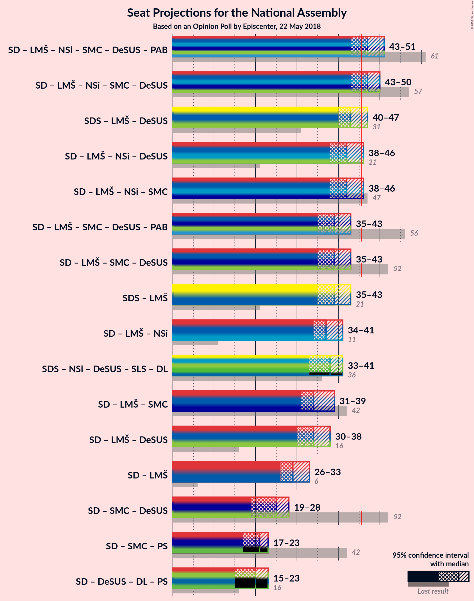

# Opinion Poll by Episcenter, 22 May 2018

<a href="#voting-intentions">Voting Intentions</a> | <a href="#seats">Seats</a> | <a href="#coalitions">Coalitions</a> | <a href="#technical-information">Technical Information</a>

## Voting Intentions

### Confidence Intervals

| Party | Last Result | Poll Result | 80% Confidence Interval | 90% Confidence Interval | 95% Confidence Interval | 99% Confidence Interval |
|:-----:|:-----------:|:-----------:|:-----------------------:|:-----------------------:|:-----------------------:|:-----------------------:|
| Slovenska demokratska stranka | 20.7% | 25.6% | N/A |N/A |N/A |N/A |
| Socialni demokrati | 6.0% | 16.1% | N/A |N/A |N/A |N/A |
| Lista Marjana Šarca | 0.0% | 14.7% | N/A |N/A |N/A |N/A |
| Levica | 6.0% | 8.4% | N/A |N/A |N/A |N/A |
| Nova Slovenija–Krščanski demokrati | 5.6% | 8.2% | N/A |N/A |N/A |N/A |
| Stranka modernega centra | 34.5% | 5.6% | N/A |N/A |N/A |N/A |
| Demokratična stranka upokojencev Slovenije | 10.2% | 5.0% | N/A |N/A |N/A |N/A |
| Stranka Alenke Bratušek | 4.4% | 2.8% | N/A |N/A |N/A |N/A |
| Slovenska ljudska stranka | 4.0% | 2.8% | N/A |N/A |N/A |N/A |
| Slovenska nacionalna stranka | 2.2% | 2.1% | N/A |N/A |N/A |N/A |

*Note:* The poll result column reflects the actual value used in the calculations. Published results may vary slightly, and in addition be rounded to fewer digits.

## Seats

### Confidence Intervals

| Party | Last Result | Median | 80% Confidence Interval | 90% Confidence Interval | 95% Confidence Interval | 99% Confidence Interval |
|:-----:|:-----------:|:------:|:-----------------------:|:-----------------------:|:-----------------------:|:-----------------------:|
| <a href="#slovenska-demokratska-stranka">Slovenska demokratska stranka</a> | 21 | N/A | N/A |N/A |N/A |N/A |
| <a href="#socialni-demokrati">Socialni demokrati</a> | 6 | N/A | N/A |N/A |N/A |N/A |
| <a href="#lista-marjana-šarca">Lista Marjana Šarca</a> | 0 | N/A | N/A |N/A |N/A |N/A |
| <a href="#levica">Levica</a> | 6 | N/A | N/A |N/A |N/A |N/A |
| <a href="#nova-slovenija–krščanski-demokrati">Nova Slovenija–Krščanski demokrati</a> | 5 | N/A | N/A |N/A |N/A |N/A |
| <a href="#stranka-modernega-centra">Stranka modernega centra</a> | 36 | N/A | N/A |N/A |N/A |N/A |
| <a href="#demokratična-stranka-upokojencev-slovenije">Demokratična stranka upokojencev Slovenije</a> | 10 | N/A | N/A |N/A |N/A |N/A |
| <a href="#stranka-alenke-bratušek">Stranka Alenke Bratušek</a> | 4 | N/A | N/A |N/A |N/A |N/A |
| <a href="#slovenska-ljudska-stranka">Slovenska ljudska stranka</a> | 0 | N/A | N/A |N/A |N/A |N/A |
| <a href="#slovenska-nacionalna-stranka">Slovenska nacionalna stranka</a> | 0 | N/A | N/A |N/A |N/A |N/A |

## Coalitions

## Technical Information

### Opinion Poll

+ **Polling firm:** Episcenter
+ **Commissioner(s):** —
+ **Fieldwork period:** 22 May 2018

### Calculations

+ **Sample size:** 747
+ **Simulations done:** 0
+ **Error estimate:** 100.00%

