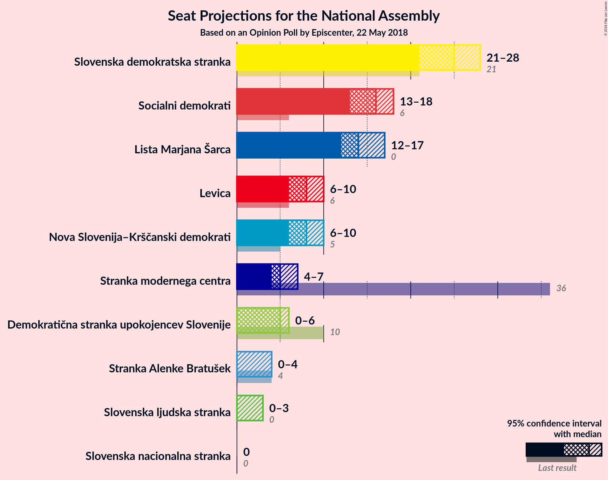
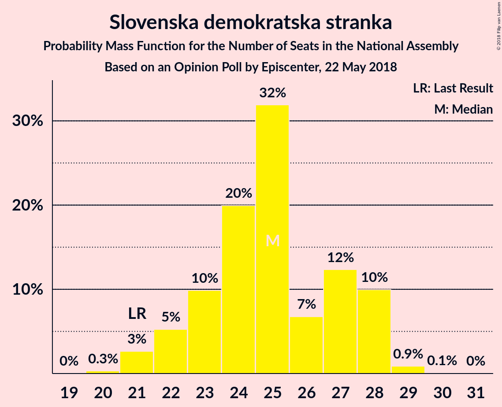
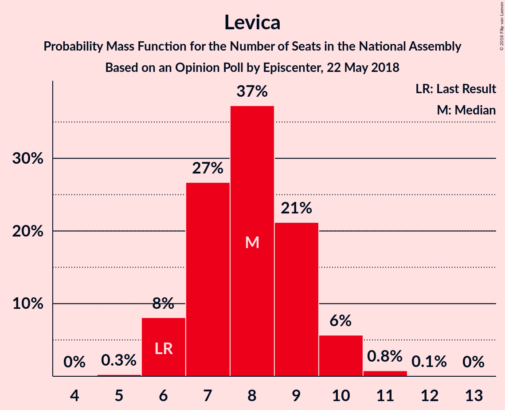

# Opinion Poll by Episcenter, 22 May 2018

<a href="#voting-intentions">Voting Intentions</a> | <a href="#seats">Seats</a> | <a href="#coalitions">Coalitions</a> | <a href="#technical-information">Technical Information</a>

## Voting Intentions

### Confidence Intervals

| Party | Last Result | Poll Result | 80% Confidence Interval | 90% Confidence Interval | 95% Confidence Interval | 99% Confidence Interval |
|:-----:|:-----------:|:-----------:|:-----------------------:|:-----------------------:|:-----------------------:|:-----------------------:|
| Slovenska demokratska stranka | 20.7% | 25.6% | 23.6–27.7% |23.0–28.3% |22.6–28.8% |21.6–29.9% |
| Socialni demokrati | 6.0% | 16.1% | 14.4–17.9% |14.0–18.4% |13.6–18.9% |12.9–19.8% |
| Lista Marjana Šarca | 0.0% | 14.7% | 13.2–16.5% |12.7–17.0% |12.4–17.5% |11.6–18.3% |
| Levica | 6.0% | 8.4% | 7.3–9.9% |6.9–10.3% |6.6–10.7% |6.1–11.4% |
| Nova Slovenija–Krščanski demokrati | 5.6% | 8.2% | 7.0–9.6% |6.7–10.0% |6.4–10.4% |5.9–11.1% |
| Stranka modernega centra | 34.5% | 5.6% | 4.7–6.9% |4.4–7.2% |4.2–7.5% |3.8–8.2% |
| Demokratična stranka upokojencev Slovenije | 10.2% | 5.0% | 4.1–6.1% |3.8–6.5% |3.6–6.8% |3.2–7.4% |
| Stranka Alenke Bratušek | 4.4% | 2.8% | 2.2–3.7% |2.0–4.0% |1.8–4.3% |1.6–4.8% |
| Slovenska ljudska stranka | 4.0% | 2.8% | 2.2–3.7% |2.0–4.0% |1.8–4.3% |1.6–4.8% |
| Slovenska nacionalna stranka | 2.2% | 2.1% | 1.6–3.0% |1.4–3.2% |1.3–3.5% |1.1–3.9% |

*Note:* The poll result column reflects the actual value used in the calculations. Published results may vary slightly, and in addition be rounded to fewer digits.

## Seats

### Confidence Intervals

| Party | Last Result | Median | 80% Confidence Interval | 90% Confidence Interval | 95% Confidence Interval | 99% Confidence Interval |
|:-----:|:-----------:|:------:|:-----------------------:|:-----------------------:|:-----------------------:|:-----------------------:|
| <a href="#slovenska-demokratska-stranka">Slovenska demokratska stranka</a> | 21 | 25 | 23–28 |22–28 |21–28 |21–29 |
| <a href="#socialni-demokrati">Socialni demokrati</a> | 6 | 16 | 13–18 |13–18 |13–18 |12–19 |
| <a href="#lista-marjana-šarca">Lista Marjana Šarca</a> | 0 | 14 | 13–16 |12–16 |12–17 |11–18 |
| <a href="#levica">Levica</a> | 6 | 8 | 7–9 |6–10 |6–10 |6–11 |
| <a href="#nova-slovenija–krščanski-demokrati">Nova Slovenija–Krščanski demokrati</a> | 5 | 8 | 6–9 |6–9 |6–10 |5–11 |
| <a href="#stranka-modernega-centra">Stranka modernega centra</a> | 36 | 5 | 4–6 |4–6 |4–7 |0–8 |
| <a href="#demokratična-stranka-upokojencev-slovenije">Demokratična stranka upokojencev Slovenije</a> | 10 | 5 | 0–5 |0–6 |0–6 |0–7 |
| <a href="#stranka-alenke-bratušek">Stranka Alenke Bratušek</a> | 4 | 0 | 0 |0–3 |0–4 |0–4 |
| <a href="#slovenska-ljudska-stranka">Slovenska ljudska stranka</a> | 0 | 0 | 0 |0 |0–3 |0–4 |
| <a href="#slovenska-nacionalna-stranka">Slovenska nacionalna stranka</a> | 0 | 0 | 0 |0 |0 |0 |

### Slovenska demokratska stranka

*For a full overview of the results for this party, see the [Slovenska demokratska stranka](party-slovenskademokratskastranka.html) page.*

| Number of Seats | Probability | Accumulated | Special Marks |
|:---------------:|:-----------:|:-----------:|:-------------:|
| 20 | 0.3% | 100% |  |
| 21 | 3% | 99.7% | Last Result |
| 22 | 5% | 97% |  |
| 23 | 10% | 92% |  |
| 24 | 20% | 82% |  |
| 25 | 32% | 62% | Median |
| 26 | 7% | 30% |  |
| 27 | 12% | 23% |  |
| 28 | 10% | 11% |  |
| 29 | 0.9% | 1.0% |  |
| 30 | 0.1% | 0.1% |  |
| 31 | 0% | 0% |  |

### Socialni demokrati

*For a full overview of the results for this party, see the [Socialni demokrati](party-socialnidemokrati.html) page.*

| Number of Seats | Probability | Accumulated | Special Marks |
|:---------------:|:-----------:|:-----------:|:-------------:|
| 6 | 0% | 100% | Last Result |
| 7 | 0% | 100% |  |
| 8 | 0% | 100% |  |
| 9 | 0% | 100% |  |
| 10 | 0% | 100% |  |
| 11 | 0.1% | 100% |  |
| 12 | 1.4% | 99.9% |  |
| 13 | 10% | 98.5% |  |
| 14 | 15% | 89% |  |
| 15 | 17% | 74% |  |
| 16 | 30% | 56% | Median |
| 17 | 14% | 27% |  |
| 18 | 12% | 13% |  |
| 19 | 0.6% | 0.8% |  |
| 20 | 0.1% | 0.2% |  |
| 21 | 0% | 0% |  |

### Lista Marjana Šarca

*For a full overview of the results for this party, see the [Lista Marjana Šarca](party-listamarjanašarca.html) page.*

| Number of Seats | Probability | Accumulated | Special Marks |
|:---------------:|:-----------:|:-----------:|:-------------:|
| 0 | 0% | 100% | Last Result |
| 1 | 0% | 100% |  |
| 2 | 0% | 100% |  |
| 3 | 0% | 100% |  |
| 4 | 0% | 100% |  |
| 5 | 0% | 100% |  |
| 6 | 0% | 100% |  |
| 7 | 0% | 100% |  |
| 8 | 0% | 100% |  |
| 9 | 0% | 100% |  |
| 10 | 0.1% | 100% |  |
| 11 | 0.8% | 99.9% |  |
| 12 | 8% | 99.1% |  |
| 13 | 26% | 91% |  |
| 14 | 28% | 65% | Median |
| 15 | 20% | 36% |  |
| 16 | 12% | 16% |  |
| 17 | 3% | 4% |  |
| 18 | 1.1% | 1.2% |  |
| 19 | 0.1% | 0.1% |  |
| 20 | 0% | 0% |  |

### Levica

*For a full overview of the results for this party, see the [Levica](party-levica.html) page.*

| Number of Seats | Probability | Accumulated | Special Marks |
|:---------------:|:-----------:|:-----------:|:-------------:|
| 5 | 0.3% | 100% |  |
| 6 | 8% | 99.7% | Last Result |
| 7 | 27% | 92% |  |
| 8 | 37% | 65% | Median |
| 9 | 21% | 28% |  |
| 10 | 6% | 7% |  |
| 11 | 0.8% | 0.8% |  |
| 12 | 0.1% | 0.1% |  |
| 13 | 0% | 0% |  |

### Nova Slovenija–Krščanski demokrati

*For a full overview of the results for this party, see the [Nova Slovenija–Krščanski demokrati](party-novaslovenija–krščanskidemokrati.html) page.*

| Number of Seats | Probability | Accumulated | Special Marks |
|:---------------:|:-----------:|:-----------:|:-------------:|
| 5 | 0.9% | 100% | Last Result |
| 6 | 11% | 99.1% |  |
| 7 | 26% | 88% |  |
| 8 | 45% | 63% | Median |
| 9 | 14% | 18% |  |
| 10 | 3% | 4% |  |
| 11 | 0.6% | 0.6% |  |
| 12 | 0% | 0% |  |

### Stranka modernega centra

*For a full overview of the results for this party, see the [Stranka modernega centra](party-strankamodernegacentra.html) page.*

| Number of Seats | Probability | Accumulated | Special Marks |
|:---------------:|:-----------:|:-----------:|:-------------:|
| 0 | 1.2% | 100% |  |
| 1 | 0% | 98.8% |  |
| 2 | 0% | 98.8% |  |
| 3 | 0.3% | 98.8% |  |
| 4 | 22% | 98% |  |
| 5 | 58% | 76% | Median |
| 6 | 16% | 18% |  |
| 7 | 1.2% | 3% |  |
| 8 | 1.2% | 1.3% |  |
| 9 | 0% | 0% |  |
| 10 | 0% | 0% |  |
| 11 | 0% | 0% |  |
| 12 | 0% | 0% |  |
| 13 | 0% | 0% |  |
| 14 | 0% | 0% |  |
| 15 | 0% | 0% |  |
| 16 | 0% | 0% |  |
| 17 | 0% | 0% |  |
| 18 | 0% | 0% |  |
| 19 | 0% | 0% |  |
| 20 | 0% | 0% |  |
| 21 | 0% | 0% |  |
| 22 | 0% | 0% |  |
| 23 | 0% | 0% |  |
| 24 | 0% | 0% |  |
| 25 | 0% | 0% |  |
| 26 | 0% | 0% |  |
| 27 | 0% | 0% |  |
| 28 | 0% | 0% |  |
| 29 | 0% | 0% |  |
| 30 | 0% | 0% |  |
| 31 | 0% | 0% |  |
| 32 | 0% | 0% |  |
| 33 | 0% | 0% |  |
| 34 | 0% | 0% |  |
| 35 | 0% | 0% |  |
| 36 | 0% | 0% | Last Result |

### Demokratična stranka upokojencev Slovenije

*For a full overview of the results for this party, see the [Demokratična stranka upokojencev Slovenije](party-demokratičnastrankaupokojencevslovenije.html) page.*

| Number of Seats | Probability | Accumulated | Special Marks |
|:---------------:|:-----------:|:-----------:|:-------------:|
| 0 | 11% | 100% |  |
| 1 | 0% | 89% |  |
| 2 | 0% | 89% |  |
| 3 | 1.0% | 89% |  |
| 4 | 30% | 88% |  |
| 5 | 51% | 59% | Median |
| 6 | 7% | 8% |  |
| 7 | 1.0% | 1.0% |  |
| 8 | 0% | 0% |  |
| 9 | 0% | 0% |  |
| 10 | 0% | 0% | Last Result |

### Stranka Alenke Bratušek

*For a full overview of the results for this party, see the [Stranka Alenke Bratušek](party-strankaalenkebratušek.html) page.*

| Number of Seats | Probability | Accumulated | Special Marks |
|:---------------:|:-----------:|:-----------:|:-------------:|
| 0 | 94% | 100% | Median |
| 1 | 0% | 6% |  |
| 2 | 0% | 6% |  |
| 3 | 2% | 6% |  |
| 4 | 4% | 5% | Last Result |
| 5 | 0.1% | 0.1% |  |
| 6 | 0% | 0% |  |

### Slovenska ljudska stranka

*For a full overview of the results for this party, see the [Slovenska ljudska stranka](party-slovenskaljudskastranka.html) page.*

| Number of Seats | Probability | Accumulated | Special Marks |
|:---------------:|:-----------:|:-----------:|:-------------:|
| 0 | 96% | 100% | Last Result, Median |
| 1 | 0% | 4% |  |
| 2 | 0% | 4% |  |
| 3 | 1.0% | 4% |  |
| 4 | 2% | 2% |  |
| 5 | 0.1% | 0.1% |  |
| 6 | 0% | 0% |  |

### Slovenska nacionalna stranka

*For a full overview of the results for this party, see the [Slovenska nacionalna stranka](party-slovenskanacionalnastranka.html) page.*

| Number of Seats | Probability | Accumulated | Special Marks |
|:---------------:|:-----------:|:-----------:|:-------------:|
| 0 | 99.7% | 100% | Last Result, Median |
| 1 | 0% | 0.3% |  |
| 2 | 0% | 0.3% |  |
| 3 | 0% | 0.3% |  |
| 4 | 0.3% | 0.3% |  |
| 5 | 0% | 0% |  |

## Coalitions

### Confidence Intervals

| Coalition | Last Result | Median | Majority? | 80% Confidence Interval | 90% Confidence Interval | 95% Confidence Interval | 99% Confidence Interval |
|:---------:|:-----------:|:------:|:---------:|:-----------------------:|:-----------------------:|:-----------------------:|:-----------------------:|
| Socialni demokrati – Lista Marjana Šarca – Nova Slovenija–Krščanski demokrati – Stranka modernega centra – Demokratična stranka upokojencev Slovenije – Stranka Alenke Bratušek | 61 | 47 | 78% | 43–50 | 43–50 | 43–51 | 41–52 |
| Socialni demokrati – Lista Marjana Šarca – Nova Slovenija–Krščanski demokrati – Stranka modernega centra – Demokratična stranka upokojencev Slovenije | 57 | 47 | 75% | 43–49 | 43–50 | 43–50 | 41–51 |
| Slovenska demokratska stranka – Lista Marjana Šarca – Demokratična stranka upokojencev Slovenije | 31 | 43 | 18% | 41–46 | 40–47 | 40–47 | 38–48 |
| Socialni demokrati – Lista Marjana Šarca – Nova Slovenija–Krščanski demokrati – Demokratična stranka upokojencev Slovenije | 21 | 42 | 4% | 39–44 | 38–45 | 38–46 | 37–46 |
| Socialni demokrati – Lista Marjana Šarca – Nova Slovenija–Krščanski demokrati – Stranka modernega centra | 47 | 42 | 5% | 39–45 | 39–46 | 38–46 | 37–48 |
| Socialni demokrati – Lista Marjana Šarca – Stranka modernega centra – Demokratična stranka upokojencev Slovenije – Stranka Alenke Bratušek | 56 | 39 | 0% | 36–42 | 35–42 | 35–43 | 34–44 |
| Socialni demokrati – Lista Marjana Šarca – Stranka modernega centra – Demokratična stranka upokojencev Slovenije | 52 | 39 | 0% | 36–41 | 35–42 | 35–43 | 33–44 |
| Slovenska demokratska stranka – Lista Marjana Šarca | 21 | 39 | 0% | 37–42 | 36–43 | 35–43 | 34–44 |
| Socialni demokrati – Lista Marjana Šarca – Nova Slovenija–Krščanski demokrati | 11 | 37 | 0% | 35–40 | 34–41 | 34–41 | 32–43 |
| Socialni demokrati – Lista Marjana Šarca – Stranka modernega centra | 42 | 34 | 0% | 32–37 | 32–38 | 31–39 | 30–40 |
| Socialni demokrati – Lista Marjana Šarca – Demokratična stranka upokojencev Slovenije | 16 | 34 | 0% | 31–36 | 30–37 | 30–38 | 29–39 |
| Socialni demokrati – Lista Marjana Šarca | 6 | 29 | 0% | 28–32 | 27–33 | 26–33 | 25–35 |
| Socialni demokrati – Stranka modernega centra – Demokratična stranka upokojencev Slovenije | 52 | 25 | 0% | 22–27 | 21–28 | 19–28 | 18–29 |

### Socialni demokrati – Lista Marjana Šarca – Nova Slovenija–Krščanski demokrati – Stranka modernega centra – Demokratična stranka upokojencev Slovenije – Stranka Alenke Bratušek

| Number of Seats | Probability | Accumulated | Special Marks |
|:---------------:|:-----------:|:-----------:|:-------------:|
| 39 | 0.1% | 100% |  |
| 40 | 0.1% | 99.9% |  |
| 41 | 0.4% | 99.8% |  |
| 42 | 1.3% | 99.4% |  |
| 43 | 9% | 98% |  |
| 44 | 7% | 89% |  |
| 45 | 4% | 82% |  |
| 46 | 14% | 78% | Majority |
| 47 | 27% | 64% |  |
| 48 | 15% | 37% | Median |
| 49 | 12% | 22% |  |
| 50 | 7% | 10% |  |
| 51 | 3% | 4% |  |
| 52 | 0.4% | 0.5% |  |
| 53 | 0.1% | 0.1% |  |
| 54 | 0% | 0% |  |
| 55 | 0% | 0% |  |
| 56 | 0% | 0% |  |
| 57 | 0% | 0% |  |
| 58 | 0% | 0% |  |
| 59 | 0% | 0% |  |
| 60 | 0% | 0% |  |
| 61 | 0% | 0% | Last Result |

### Socialni demokrati – Lista Marjana Šarca – Nova Slovenija–Krščanski demokrati – Stranka modernega centra – Demokratična stranka upokojencev Slovenije

| Number of Seats | Probability | Accumulated | Special Marks |
|:---------------:|:-----------:|:-----------:|:-------------:|
| 39 | 0.1% | 100% |  |
| 40 | 0.1% | 99.9% |  |
| 41 | 0.6% | 99.7% |  |
| 42 | 2% | 99.2% |  |
| 43 | 9% | 98% |  |
| 44 | 8% | 89% |  |
| 45 | 6% | 80% |  |
| 46 | 15% | 75% | Majority |
| 47 | 28% | 60% |  |
| 48 | 14% | 31% | Median |
| 49 | 9% | 18% |  |
| 50 | 6% | 8% |  |
| 51 | 2% | 2% |  |
| 52 | 0.4% | 0.4% |  |
| 53 | 0% | 0% |  |
| 54 | 0% | 0% |  |
| 55 | 0% | 0% |  |
| 56 | 0% | 0% |  |
| 57 | 0% | 0% | Last Result |

### Slovenska demokratska stranka – Lista Marjana Šarca – Demokratična stranka upokojencev Slovenije

| Number of Seats | Probability | Accumulated | Special Marks |
|:---------------:|:-----------:|:-----------:|:-------------:|
| 31 | 0% | 100% | Last Result |
| 32 | 0% | 100% |  |
| 33 | 0% | 100% |  |
| 34 | 0% | 100% |  |
| 35 | 0% | 100% |  |
| 36 | 0% | 100% |  |
| 37 | 0.3% | 99.9% |  |
| 38 | 0.6% | 99.6% |  |
| 39 | 1.4% | 99.1% |  |
| 40 | 4% | 98% |  |
| 41 | 14% | 94% |  |
| 42 | 12% | 80% |  |
| 43 | 26% | 68% |  |
| 44 | 15% | 41% | Median |
| 45 | 8% | 26% |  |
| 46 | 10% | 18% | Majority |
| 47 | 6% | 8% |  |
| 48 | 2% | 2% |  |
| 49 | 0.2% | 0.2% |  |
| 50 | 0.1% | 0.1% |  |
| 51 | 0% | 0% |  |

### Socialni demokrati – Lista Marjana Šarca – Nova Slovenija–Krščanski demokrati – Demokratična stranka upokojencev Slovenije

| Number of Seats | Probability | Accumulated | Special Marks |
|:---------------:|:-----------:|:-----------:|:-------------:|
| 21 | 0% | 100% | Last Result |
| 22 | 0% | 100% |  |
| 23 | 0% | 100% |  |
| 24 | 0% | 100% |  |
| 25 | 0% | 100% |  |
| 26 | 0% | 100% |  |
| 27 | 0% | 100% |  |
| 28 | 0% | 100% |  |
| 29 | 0% | 100% |  |
| 30 | 0% | 100% |  |
| 31 | 0% | 100% |  |
| 32 | 0% | 100% |  |
| 33 | 0% | 100% |  |
| 34 | 0% | 100% |  |
| 35 | 0% | 100% |  |
| 36 | 0.4% | 99.9% |  |
| 37 | 1.0% | 99.5% |  |
| 38 | 8% | 98.5% |  |
| 39 | 8% | 90% |  |
| 40 | 8% | 82% |  |
| 41 | 14% | 75% |  |
| 42 | 30% | 61% |  |
| 43 | 13% | 31% | Median |
| 44 | 11% | 18% |  |
| 45 | 4% | 7% |  |
| 46 | 3% | 4% | Majority |
| 47 | 0.1% | 0.2% |  |
| 48 | 0.1% | 0.1% |  |
| 49 | 0% | 0% |  |

### Socialni demokrati – Lista Marjana Šarca – Nova Slovenija–Krščanski demokrati – Stranka modernega centra

| Number of Seats | Probability | Accumulated | Special Marks |
|:---------------:|:-----------:|:-----------:|:-------------:|
| 35 | 0.1% | 100% |  |
| 36 | 0.1% | 99.9% |  |
| 37 | 0.6% | 99.8% |  |
| 38 | 3% | 99.2% |  |
| 39 | 7% | 96% |  |
| 40 | 5% | 90% |  |
| 41 | 14% | 84% |  |
| 42 | 25% | 71% |  |
| 43 | 19% | 46% | Median |
| 44 | 12% | 27% |  |
| 45 | 10% | 15% |  |
| 46 | 3% | 5% | Majority |
| 47 | 0.8% | 2% | Last Result |
| 48 | 1.1% | 1.2% |  |
| 49 | 0.1% | 0.1% |  |
| 50 | 0% | 0% |  |

### Socialni demokrati – Lista Marjana Šarca – Stranka modernega centra – Demokratična stranka upokojencev Slovenije – Stranka Alenke Bratušek

| Number of Seats | Probability | Accumulated | Special Marks |
|:---------------:|:-----------:|:-----------:|:-------------:|
| 31 | 0% | 100% |  |
| 32 | 0.3% | 99.9% |  |
| 33 | 0.1% | 99.7% |  |
| 34 | 2% | 99.5% |  |
| 35 | 4% | 98% |  |
| 36 | 8% | 94% |  |
| 37 | 6% | 86% |  |
| 38 | 14% | 80% |  |
| 39 | 22% | 66% |  |
| 40 | 17% | 44% | Median |
| 41 | 15% | 27% |  |
| 42 | 7% | 11% |  |
| 43 | 2% | 5% |  |
| 44 | 2% | 2% |  |
| 45 | 0.2% | 0.3% |  |
| 46 | 0% | 0% | Majority |
| 47 | 0% | 0% |  |
| 48 | 0% | 0% |  |
| 49 | 0% | 0% |  |
| 50 | 0% | 0% |  |
| 51 | 0% | 0% |  |
| 52 | 0% | 0% |  |
| 53 | 0% | 0% |  |
| 54 | 0% | 0% |  |
| 55 | 0% | 0% |  |
| 56 | 0% | 0% | Last Result |

### Socialni demokrati – Lista Marjana Šarca – Stranka modernega centra – Demokratična stranka upokojencev Slovenije

| Number of Seats | Probability | Accumulated | Special Marks |
|:---------------:|:-----------:|:-----------:|:-------------:|
| 31 | 0% | 100% |  |
| 32 | 0.3% | 99.9% |  |
| 33 | 0.2% | 99.6% |  |
| 34 | 2% | 99.5% |  |
| 35 | 5% | 98% |  |
| 36 | 8% | 93% |  |
| 37 | 7% | 85% |  |
| 38 | 17% | 78% |  |
| 39 | 22% | 61% |  |
| 40 | 17% | 39% | Median |
| 41 | 14% | 22% |  |
| 42 | 4% | 8% |  |
| 43 | 2% | 3% |  |
| 44 | 1.3% | 2% |  |
| 45 | 0.2% | 0.2% |  |
| 46 | 0% | 0% | Majority |
| 47 | 0% | 0% |  |
| 48 | 0% | 0% |  |
| 49 | 0% | 0% |  |
| 50 | 0% | 0% |  |
| 51 | 0% | 0% |  |
| 52 | 0% | 0% | Last Result |

### Slovenska demokratska stranka – Lista Marjana Šarca

| Number of Seats | Probability | Accumulated | Special Marks |
|:---------------:|:-----------:|:-----------:|:-------------:|
| 21 | 0% | 100% | Last Result |
| 22 | 0% | 100% |  |
| 23 | 0% | 100% |  |
| 24 | 0% | 100% |  |
| 25 | 0% | 100% |  |
| 26 | 0% | 100% |  |
| 27 | 0% | 100% |  |
| 28 | 0% | 100% |  |
| 29 | 0% | 100% |  |
| 30 | 0% | 100% |  |
| 31 | 0% | 100% |  |
| 32 | 0% | 100% |  |
| 33 | 0.2% | 100% |  |
| 34 | 0.7% | 99.8% |  |
| 35 | 2% | 99.1% |  |
| 36 | 6% | 97% |  |
| 37 | 14% | 91% |  |
| 38 | 24% | 77% |  |
| 39 | 15% | 53% | Median |
| 40 | 11% | 38% |  |
| 41 | 8% | 27% |  |
| 42 | 11% | 19% |  |
| 43 | 7% | 8% |  |
| 44 | 1.4% | 2% |  |
| 45 | 0.1% | 0.1% |  |
| 46 | 0% | 0% | Majority |

### Socialni demokrati – Lista Marjana Šarca – Nova Slovenija–Krščanski demokrati

| Number of Seats | Probability | Accumulated | Special Marks |
|:---------------:|:-----------:|:-----------:|:-------------:|
| 11 | 0% | 100% | Last Result |
| 12 | 0% | 100% |  |
| 13 | 0% | 100% |  |
| 14 | 0% | 100% |  |
| 15 | 0% | 100% |  |
| 16 | 0% | 100% |  |
| 17 | 0% | 100% |  |
| 18 | 0% | 100% |  |
| 19 | 0% | 100% |  |
| 20 | 0% | 100% |  |
| 21 | 0% | 100% |  |
| 22 | 0% | 100% |  |
| 23 | 0% | 100% |  |
| 24 | 0% | 100% |  |
| 25 | 0% | 100% |  |
| 26 | 0% | 100% |  |
| 27 | 0% | 100% |  |
| 28 | 0% | 100% |  |
| 29 | 0% | 100% |  |
| 30 | 0% | 100% |  |
| 31 | 0.1% | 100% |  |
| 32 | 0.5% | 99.9% |  |
| 33 | 2% | 99.4% |  |
| 34 | 6% | 98% |  |
| 35 | 8% | 92% |  |
| 36 | 14% | 84% |  |
| 37 | 26% | 71% |  |
| 38 | 16% | 45% | Median |
| 39 | 13% | 29% |  |
| 40 | 10% | 16% |  |
| 41 | 4% | 6% |  |
| 42 | 0.7% | 2% |  |
| 43 | 0.9% | 1.0% |  |
| 44 | 0.1% | 0.1% |  |
| 45 | 0% | 0% |  |

### Socialni demokrati – Lista Marjana Šarca – Stranka modernega centra

| Number of Seats | Probability | Accumulated | Special Marks |
|:---------------:|:-----------:|:-----------:|:-------------:|
| 28 | 0.1% | 100% |  |
| 29 | 0.2% | 99.9% |  |
| 30 | 1.3% | 99.6% |  |
| 31 | 2% | 98% |  |
| 32 | 9% | 96% |  |
| 33 | 16% | 87% |  |
| 34 | 22% | 71% |  |
| 35 | 15% | 49% | Median |
| 36 | 17% | 34% |  |
| 37 | 11% | 17% |  |
| 38 | 4% | 6% |  |
| 39 | 2% | 3% |  |
| 40 | 0.7% | 0.8% |  |
| 41 | 0.1% | 0.2% |  |
| 42 | 0% | 0% | Last Result |

### Socialni demokrati – Lista Marjana Šarca – Demokratična stranka upokojencev Slovenije

| Number of Seats | Probability | Accumulated | Special Marks |
|:---------------:|:-----------:|:-----------:|:-------------:|
| 16 | 0% | 100% | Last Result |
| 17 | 0% | 100% |  |
| 18 | 0% | 100% |  |
| 19 | 0% | 100% |  |
| 20 | 0% | 100% |  |
| 21 | 0% | 100% |  |
| 22 | 0% | 100% |  |
| 23 | 0% | 100% |  |
| 24 | 0% | 100% |  |
| 25 | 0% | 100% |  |
| 26 | 0% | 100% |  |
| 27 | 0.1% | 100% |  |
| 28 | 0.3% | 99.9% |  |
| 29 | 0.9% | 99.6% |  |
| 30 | 6% | 98.7% |  |
| 31 | 4% | 93% |  |
| 32 | 9% | 89% |  |
| 33 | 17% | 79% |  |
| 34 | 28% | 63% |  |
| 35 | 8% | 34% | Median |
| 36 | 18% | 26% |  |
| 37 | 4% | 8% |  |
| 38 | 2% | 3% |  |
| 39 | 1.2% | 1.2% |  |
| 40 | 0% | 0.1% |  |
| 41 | 0% | 0% |  |

### Socialni demokrati – Lista Marjana Šarca

| Number of Seats | Probability | Accumulated | Special Marks |
|:---------------:|:-----------:|:-----------:|:-------------:|
| 6 | 0% | 100% | Last Result |
| 7 | 0% | 100% |  |
| 8 | 0% | 100% |  |
| 9 | 0% | 100% |  |
| 10 | 0% | 100% |  |
| 11 | 0% | 100% |  |
| 12 | 0% | 100% |  |
| 13 | 0% | 100% |  |
| 14 | 0% | 100% |  |
| 15 | 0% | 100% |  |
| 16 | 0% | 100% |  |
| 17 | 0% | 100% |  |
| 18 | 0% | 100% |  |
| 19 | 0% | 100% |  |
| 20 | 0% | 100% |  |
| 21 | 0% | 100% |  |
| 22 | 0% | 100% |  |
| 23 | 0% | 100% |  |
| 24 | 0.1% | 100% |  |
| 25 | 1.0% | 99.9% |  |
| 26 | 2% | 98.9% |  |
| 27 | 7% | 97% |  |
| 28 | 17% | 90% |  |
| 29 | 27% | 73% |  |
| 30 | 14% | 46% | Median |
| 31 | 9% | 32% |  |
| 32 | 17% | 23% |  |
| 33 | 3% | 6% |  |
| 34 | 2% | 2% |  |
| 35 | 0.5% | 0.6% |  |
| 36 | 0.2% | 0.2% |  |
| 37 | 0% | 0% |  |

### Socialni demokrati – Stranka modernega centra – Demokratična stranka upokojencev Slovenije

| Number of Seats | Probability | Accumulated | Special Marks |
|:---------------:|:-----------:|:-----------:|:-------------:|
| 17 | 0.1% | 100% |  |
| 18 | 0.6% | 99.9% |  |
| 19 | 2% | 99.4% |  |
| 20 | 1.3% | 97% |  |
| 21 | 4% | 96% |  |
| 22 | 8% | 92% |  |
| 23 | 7% | 84% |  |
| 24 | 17% | 77% |  |
| 25 | 17% | 60% |  |
| 26 | 25% | 43% | Median |
| 27 | 12% | 18% |  |
| 28 | 5% | 6% |  |
| 29 | 1.3% | 2% |  |
| 30 | 0.2% | 0.3% |  |
| 31 | 0% | 0% |  |
| 32 | 0% | 0% |  |
| 33 | 0% | 0% |  |
| 34 | 0% | 0% |  |
| 35 | 0% | 0% |  |
| 36 | 0% | 0% |  |
| 37 | 0% | 0% |  |
| 38 | 0% | 0% |  |
| 39 | 0% | 0% |  |
| 40 | 0% | 0% |  |
| 41 | 0% | 0% |  |
| 42 | 0% | 0% |  |
| 43 | 0% | 0% |  |
| 44 | 0% | 0% |  |
| 45 | 0% | 0% |  |
| 46 | 0% | 0% | Majority |
| 47 | 0% | 0% |  |
| 48 | 0% | 0% |  |
| 49 | 0% | 0% |  |
| 50 | 0% | 0% |  |
| 51 | 0% | 0% |  |
| 52 | 0% | 0% | Last Result |

## Technical Information

### Opinion Poll

+ **Polling firm:** Episcenter
+ **Commissioner(s):** —
+ **Fieldwork period:** 22 May 2018

### Calculations

+ **Sample size:** 747
+ **Simulations done:** 1,048,576
+ **Error estimate:** 2.15%

