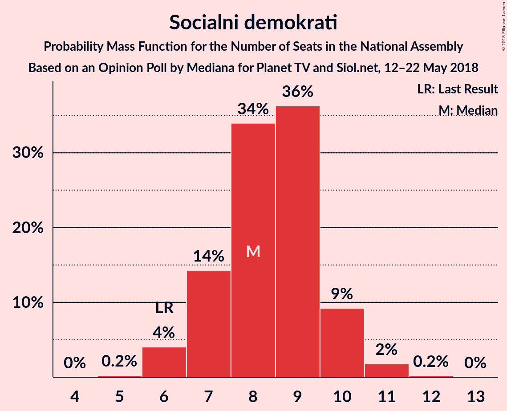

# Opinion Poll by Mediana for Planet TV and Siol.net, 12–22 May 2018

<a href="#voting-intentions">Voting Intentions</a> | <a href="#seats">Seats</a> | <a href="#coalitions">Coalitions</a> | <a href="#technical-information">Technical Information</a>

## Voting Intentions

### Confidence Intervals

| Party | Last Result | Poll Result | 80% Confidence Interval | 90% Confidence Interval | 95% Confidence Interval | 99% Confidence Interval |
|:-----:|:-----------:|:-----------:|:-----------------------:|:-----------------------:|:-----------------------:|:-----------------------:|
| Slovenska demokratska stranka | 20.7% | 27.2% | 25.1–29.4% |24.5–30.1% |24.0–30.6% |23.0–31.7% |
| Lista Marjana Šarca | 0.0% | 18.1% | 16.3–20.1% |15.8–20.6% |15.3–21.1% |14.5–22.1% |
| Socialni demokrati | 6.0% | 9.1% | 7.8–10.7% |7.5–11.1% |7.2–11.5% |6.6–12.3% |
| Stranka modernega centra | 34.5% | 8.7% | 7.4–10.2% |7.1–10.6% |6.8–11.0% |6.2–11.8% |
| Levica | 6.0% | 7.3% | 6.2–8.8% |5.9–9.2% |5.6–9.6% |5.1–10.3% |
| Nova Slovenija–Krščanski demokrati | 5.6% | 7.0% | 5.9–8.5% |5.6–8.9% |5.3–9.2% |4.9–10.0% |
| Demokratična stranka upokojencev Slovenije | 10.2% | 6.8% | 5.7–8.2% |5.3–8.6% |5.1–8.9% |4.6–9.6% |
| Stranka Alenke Bratušek | 4.4% | 5.7% | 4.7–7.0% |4.5–7.4% |4.2–7.7% |3.8–8.4% |
| Slovenska nacionalna stranka | 2.2% | 5.6% | 4.6–6.9% |4.3–7.2% |4.1–7.6% |3.7–8.2% |
| Slovenska ljudska stranka | 4.0% | 3.5% | 2.8–4.6% |2.6–4.9% |2.4–5.2% |2.1–5.8% |
| Glas za otroke in družine–Nova ljudska stranka Slovenije | 0.0% | 0.6% | 0.4–1.2% |0.3–1.3% |0.2–1.5% |0.2–1.8% |

*Note:* The poll result column reflects the actual value used in the calculations. Published results may vary slightly, and in addition be rounded to fewer digits.

## Seats

### Confidence Intervals

| Party | Last Result | Median | 80% Confidence Interval | 90% Confidence Interval | 95% Confidence Interval | 99% Confidence Interval |
|:-----:|:-----------:|:------:|:-----------------------:|:-----------------------:|:-----------------------:|:-----------------------:|
| <a href="#slovenska-demokratska-stranka">Slovenska demokratska stranka</a> | 21 | 25 | 23–26 |23–27 |22–29 |21–30 |
| <a href="#lista-marjana-šarca">Lista Marjana Šarca</a> | 0 | 18 | 16–18 |15–18 |14–18 |13–20 |
| <a href="#socialni-demokrati">Socialni demokrati</a> | 6 | 9 | 8–10 |7–10 |7–10 |7–10 |
| <a href="#stranka-modernega-centra">Stranka modernega centra</a> | 36 | 8 | 7–9 |7–9 |6–10 |6–11 |
| <a href="#levica">Levica</a> | 6 | 6 | 6–8 |5–8 |5–8 |4–8 |
| <a href="#nova-slovenija–krščanski-demokrati">Nova Slovenija–Krščanski demokrati</a> | 5 | 7 | 6–9 |5–9 |5–9 |4–9 |
| <a href="#demokratična-stranka-upokojencev-slovenije">Demokratična stranka upokojencev Slovenije</a> | 10 | 6 | 5–6 |5–7 |5–8 |4–9 |
| <a href="#stranka-alenke-bratušek">Stranka Alenke Bratušek</a> | 4 | 4 | 4–6 |4–6 |4–6 |0–7 |
| <a href="#slovenska-nacionalna-stranka">Slovenska nacionalna stranka</a> | 0 | 5 | 4–5 |4–6 |3–6 |0–7 |
| <a href="#slovenska-ljudska-stranka">Slovenska ljudska stranka</a> | 0 | 0 | 0 |0 |0–4 |0–4 |
| <a href="#glas-za-otroke-in-družine–nova-ljudska-stranka-slovenije">Glas za otroke in družine–Nova ljudska stranka Slovenije</a> | 0 | 0 | 0 |0 |0 |0 |

### Slovenska demokratska stranka

*For a full overview of the results for this party, see the [Slovenska demokratska stranka](party-slovenskademokratskastranka.html) page.*

| Number of Seats | Probability | Accumulated | Special Marks |
|:---------------:|:-----------:|:-----------:|:-------------:|
| 20 | 0.3% | 100% |  |
| 21 | 0.9% | 99.7% | Last Result |
| 22 | 2% | 98.9% |  |
| 23 | 18% | 97% |  |
| 24 | 1.1% | 79% |  |
| 25 | 67% | 78% | Median |
| 26 | 5% | 11% |  |
| 27 | 2% | 6% |  |
| 28 | 0.9% | 4% |  |
| 29 | 3% | 3% |  |
| 30 | 0.5% | 0.6% |  |
| 31 | 0% | 0.1% |  |
| 32 | 0% | 0.1% |  |
| 33 | 0% | 0% |  |

### Lista Marjana Šarca

*For a full overview of the results for this party, see the [Lista Marjana Šarca](party-listamarjanašarca.html) page.*

| Number of Seats | Probability | Accumulated | Special Marks |
|:---------------:|:-----------:|:-----------:|:-------------:|
| 0 | 0% | 100% | Last Result |
| 1 | 0% | 100% |  |
| 2 | 0% | 100% |  |
| 3 | 0% | 100% |  |
| 4 | 0% | 100% |  |
| 5 | 0% | 100% |  |
| 6 | 0% | 100% |  |
| 7 | 0% | 100% |  |
| 8 | 0% | 100% |  |
| 9 | 0% | 100% |  |
| 10 | 0% | 100% |  |
| 11 | 0% | 100% |  |
| 12 | 0.1% | 100% |  |
| 13 | 0.4% | 99.9% |  |
| 14 | 3% | 99.4% |  |
| 15 | 2% | 96% |  |
| 16 | 18% | 94% |  |
| 17 | 8% | 77% |  |
| 18 | 66% | 69% | Median |
| 19 | 0.9% | 2% |  |
| 20 | 1.3% | 1.5% |  |
| 21 | 0.2% | 0.2% |  |
| 22 | 0% | 0% |  |

### Socialni demokrati

*For a full overview of the results for this party, see the [Socialni demokrati](party-socialnidemokrati.html) page.*

| Number of Seats | Probability | Accumulated | Special Marks |
|:---------------:|:-----------:|:-----------:|:-------------:|
| 5 | 0.1% | 100% |  |
| 6 | 0.3% | 99.9% | Last Result |
| 7 | 5% | 99.6% |  |
| 8 | 6% | 94% |  |
| 9 | 78% | 88% | Median |
| 10 | 10% | 11% |  |
| 11 | 0.1% | 0.4% |  |
| 12 | 0.2% | 0.3% |  |
| 13 | 0% | 0% |  |

### Stranka modernega centra

*For a full overview of the results for this party, see the [Stranka modernega centra](party-strankamodernegacentra.html) page.*

| Number of Seats | Probability | Accumulated | Special Marks |
|:---------------:|:-----------:|:-----------:|:-------------:|
| 5 | 0.3% | 100% |  |
| 6 | 3% | 99.7% |  |
| 7 | 18% | 97% |  |
| 8 | 51% | 80% | Median |
| 9 | 25% | 29% |  |
| 10 | 2% | 3% |  |
| 11 | 1.1% | 1.1% |  |
| 12 | 0.1% | 0.1% |  |
| 13 | 0% | 0% |  |
| 14 | 0% | 0% |  |
| 15 | 0% | 0% |  |
| 16 | 0% | 0% |  |
| 17 | 0% | 0% |  |
| 18 | 0% | 0% |  |
| 19 | 0% | 0% |  |
| 20 | 0% | 0% |  |
| 21 | 0% | 0% |  |
| 22 | 0% | 0% |  |
| 23 | 0% | 0% |  |
| 24 | 0% | 0% |  |
| 25 | 0% | 0% |  |
| 26 | 0% | 0% |  |
| 27 | 0% | 0% |  |
| 28 | 0% | 0% |  |
| 29 | 0% | 0% |  |
| 30 | 0% | 0% |  |
| 31 | 0% | 0% |  |
| 32 | 0% | 0% |  |
| 33 | 0% | 0% |  |
| 34 | 0% | 0% |  |
| 35 | 0% | 0% |  |
| 36 | 0% | 0% | Last Result |

### Levica

*For a full overview of the results for this party, see the [Levica](party-levica.html) page.*

| Number of Seats | Probability | Accumulated | Special Marks |
|:---------------:|:-----------:|:-----------:|:-------------:|
| 4 | 1.3% | 100% |  |
| 5 | 8% | 98.7% |  |
| 6 | 54% | 91% | Last Result, Median |
| 7 | 20% | 37% |  |
| 8 | 17% | 17% |  |
| 9 | 0.2% | 0.5% |  |
| 10 | 0.2% | 0.2% |  |
| 11 | 0% | 0% |  |

### Nova Slovenija–Krščanski demokrati

*For a full overview of the results for this party, see the [Nova Slovenija–Krščanski demokrati](party-novaslovenija–krščanskidemokrati.html) page.*

| Number of Seats | Probability | Accumulated | Special Marks |
|:---------------:|:-----------:|:-----------:|:-------------:|
| 4 | 0.6% | 100% |  |
| 5 | 8% | 99.4% | Last Result |
| 6 | 21% | 91% |  |
| 7 | 54% | 71% | Median |
| 8 | 2% | 16% |  |
| 9 | 14% | 14% |  |
| 10 | 0.3% | 0.3% |  |
| 11 | 0% | 0% |  |

### Demokratična stranka upokojencev Slovenije

*For a full overview of the results for this party, see the [Demokratična stranka upokojencev Slovenije](party-demokratičnastrankaupokojencevslovenije.html) page.*

| Number of Seats | Probability | Accumulated | Special Marks |
|:---------------:|:-----------:|:-----------:|:-------------:|
| 3 | 0.2% | 100% |  |
| 4 | 0.9% | 99.8% |  |
| 5 | 19% | 98.9% |  |
| 6 | 71% | 80% | Median |
| 7 | 5% | 10% |  |
| 8 | 4% | 5% |  |
| 9 | 1.2% | 1.2% |  |
| 10 | 0% | 0% | Last Result |

### Stranka Alenke Bratušek

*For a full overview of the results for this party, see the [Stranka Alenke Bratušek](party-strankaalenkebratušek.html) page.*

| Number of Seats | Probability | Accumulated | Special Marks |
|:---------------:|:-----------:|:-----------:|:-------------:|
| 0 | 0.8% | 100% |  |
| 1 | 0% | 99.2% |  |
| 2 | 0% | 99.2% |  |
| 3 | 0.1% | 99.2% |  |
| 4 | 52% | 99.1% | Last Result, Median |
| 5 | 24% | 47% |  |
| 6 | 20% | 22% |  |
| 7 | 2% | 2% |  |
| 8 | 0.2% | 0.2% |  |
| 9 | 0% | 0% |  |

### Slovenska nacionalna stranka

*For a full overview of the results for this party, see the [Slovenska nacionalna stranka](party-slovenskanacionalnastranka.html) page.*

| Number of Seats | Probability | Accumulated | Special Marks |
|:---------------:|:-----------:|:-----------:|:-------------:|
| 0 | 2% | 100% | Last Result |
| 1 | 0% | 98% |  |
| 2 | 0% | 98% |  |
| 3 | 0.8% | 98% |  |
| 4 | 35% | 97% |  |
| 5 | 54% | 63% | Median |
| 6 | 7% | 9% |  |
| 7 | 2% | 2% |  |
| 8 | 0% | 0% |  |

### Slovenska ljudska stranka

*For a full overview of the results for this party, see the [Slovenska ljudska stranka](party-slovenskaljudskastranka.html) page.*

| Number of Seats | Probability | Accumulated | Special Marks |
|:---------------:|:-----------:|:-----------:|:-------------:|
| 0 | 96% | 100% | Last Result, Median |
| 1 | 0% | 4% |  |
| 2 | 0% | 4% |  |
| 3 | 0.5% | 4% |  |
| 4 | 3% | 3% |  |
| 5 | 0.4% | 0.5% |  |
| 6 | 0% | 0% |  |

### Glas za otroke in družine–Nova ljudska stranka Slovenije

*For a full overview of the results for this party, see the [Glas za otroke in družine–Nova ljudska stranka Slovenije](party-glaszaotrokeindružine–novaljudskastrankaslovenije.html) page.*

| Number of Seats | Probability | Accumulated | Special Marks |
|:---------------:|:-----------:|:-----------:|:-------------:|
| 0 | 100% | 100% | Last Result, Median |

## Coalitions

### Confidence Intervals

| Coalition | Last Result | Median | Majority? | 80% Confidence Interval | 90% Confidence Interval | 95% Confidence Interval | 99% Confidence Interval |
|:---------:|:-----------:|:------:|:---------:|:-----------------------:|:-----------------------:|:-----------------------:|:-----------------------:|
| Slovenska demokratska stranka – Lista Marjana Šarca – Demokratična stranka upokojencev Slovenije | 31 | 49 | 97% | 46–49 | 46–50 | 45–51 | 43–54 |
| Lista Marjana Šarca – Socialni demokrati – Stranka modernega centra – Nova Slovenija–Krščanski demokrati – Demokratična stranka upokojencev Slovenije | 57 | 48 | 92% | 46–48 | 43–49 | 43–49 | 41–50 |
| Lista Marjana Šarca – Socialni demokrati – Stranka modernega centra – Demokratična stranka upokojencev Slovenije – Stranka Alenke Bratušek | 56 | 45 | 26% | 43–47 | 42–48 | 41–49 | 39–49 |
| Slovenska demokratska stranka – Lista Marjana Šarca | 21 | 43 | 1.4% | 41–43 | 40–44 | 39–45 | 37–47 |
| Lista Marjana Šarca – Socialni demokrati – Stranka modernega centra – Demokratična stranka upokojencev Slovenije | 52 | 41 | 0.1% | 38–41 | 38–43 | 36–43 | 35–44 |
| Lista Marjana Šarca – Socialni demokrati – Stranka modernega centra – Nova Slovenija–Krščanski demokrati | 47 | 42 | 0.1% | 40–42 | 38–42 | 35–42 | 34–44 |
| Lista Marjana Šarca – Socialni demokrati – Nova Slovenija–Krščanski demokrati – Demokratična stranka upokojencev Slovenije | 21 | 40 | 0% | 38–40 | 36–40 | 35–41 | 33–43 |
| Lista Marjana Šarca – Socialni demokrati – Stranka modernega centra | 42 | 35 | 0% | 32–36 | 31–36 | 30–36 | 29–39 |
| Lista Marjana Šarca – Socialni demokrati – Demokratična stranka upokojencev Slovenije | 16 | 33 | 0% | 31–33 | 29–34 | 29–34 | 27–37 |
| Lista Marjana Šarca – Socialni demokrati – Nova Slovenija–Krščanski demokrati | 11 | 34 | 0% | 32–34 | 30–34 | 28–34 | 26–35 |
| Lista Marjana Šarca – Socialni demokrati | 6 | 27 | 0% | 25–27 | 23–27 | 22–28 | 21–29 |
| Socialni demokrati – Stranka modernega centra – Demokratična stranka upokojencev Slovenije | 52 | 23 | 0% | 22–25 | 21–25 | 20–26 | 19–26 |

### Slovenska demokratska stranka – Lista Marjana Šarca – Demokratična stranka upokojencev Slovenije

| Number of Seats | Probability | Accumulated | Special Marks |
|:---------------:|:-----------:|:-----------:|:-------------:|
| 31 | 0% | 100% | Last Result |
| 32 | 0% | 100% |  |
| 33 | 0% | 100% |  |
| 34 | 0% | 100% |  |
| 35 | 0% | 100% |  |
| 36 | 0% | 100% |  |
| 37 | 0% | 100% |  |
| 38 | 0% | 100% |  |
| 39 | 0% | 100% |  |
| 40 | 0% | 100% |  |
| 41 | 0% | 100% |  |
| 42 | 0.3% | 100% |  |
| 43 | 0.3% | 99.7% |  |
| 44 | 0.4% | 99.4% |  |
| 45 | 2% | 99.0% |  |
| 46 | 16% | 97% | Majority |
| 47 | 19% | 81% |  |
| 48 | 5% | 63% |  |
| 49 | 50% | 57% | Median |
| 50 | 3% | 7% |  |
| 51 | 2% | 4% |  |
| 52 | 0.4% | 2% |  |
| 53 | 1.0% | 2% |  |
| 54 | 0.5% | 0.5% |  |
| 55 | 0% | 0% |  |

### Lista Marjana Šarca – Socialni demokrati – Stranka modernega centra – Nova Slovenija–Krščanski demokrati – Demokratična stranka upokojencev Slovenije

| Number of Seats | Probability | Accumulated | Special Marks |
|:---------------:|:-----------:|:-----------:|:-------------:|
| 39 | 0.1% | 100% |  |
| 40 | 0.3% | 99.9% |  |
| 41 | 0.6% | 99.6% |  |
| 42 | 1.3% | 99.0% |  |
| 43 | 3% | 98% |  |
| 44 | 0.7% | 94% |  |
| 45 | 2% | 94% |  |
| 46 | 2% | 92% | Majority |
| 47 | 34% | 90% |  |
| 48 | 49% | 56% | Median |
| 49 | 5% | 6% |  |
| 50 | 1.0% | 1.2% |  |
| 51 | 0% | 0.2% |  |
| 52 | 0.1% | 0.1% |  |
| 53 | 0% | 0% |  |
| 54 | 0% | 0% |  |
| 55 | 0% | 0% |  |
| 56 | 0% | 0% |  |
| 57 | 0% | 0% | Last Result |

### Lista Marjana Šarca – Socialni demokrati – Stranka modernega centra – Demokratična stranka upokojencev Slovenije – Stranka Alenke Bratušek

| Number of Seats | Probability | Accumulated | Special Marks |
|:---------------:|:-----------:|:-----------:|:-------------:|
| 37 | 0% | 100% |  |
| 38 | 0.1% | 99.9% |  |
| 39 | 0.4% | 99.9% |  |
| 40 | 0.4% | 99.4% |  |
| 41 | 2% | 99.1% |  |
| 42 | 4% | 97% |  |
| 43 | 14% | 93% |  |
| 44 | 4% | 79% |  |
| 45 | 49% | 76% | Median |
| 46 | 0.5% | 26% | Majority |
| 47 | 20% | 26% |  |
| 48 | 3% | 6% |  |
| 49 | 3% | 3% |  |
| 50 | 0.2% | 0.3% |  |
| 51 | 0% | 0.1% |  |
| 52 | 0.1% | 0.1% |  |
| 53 | 0% | 0% |  |
| 54 | 0% | 0% |  |
| 55 | 0% | 0% |  |
| 56 | 0% | 0% | Last Result |

### Slovenska demokratska stranka – Lista Marjana Šarca

| Number of Seats | Probability | Accumulated | Special Marks |
|:---------------:|:-----------:|:-----------:|:-------------:|
| 21 | 0% | 100% | Last Result |
| 22 | 0% | 100% |  |
| 23 | 0% | 100% |  |
| 24 | 0% | 100% |  |
| 25 | 0% | 100% |  |
| 26 | 0% | 100% |  |
| 27 | 0% | 100% |  |
| 28 | 0% | 100% |  |
| 29 | 0% | 100% |  |
| 30 | 0% | 100% |  |
| 31 | 0% | 100% |  |
| 32 | 0% | 100% |  |
| 33 | 0% | 100% |  |
| 34 | 0% | 100% |  |
| 35 | 0% | 100% |  |
| 36 | 0.5% | 100% |  |
| 37 | 0.2% | 99.5% |  |
| 38 | 0.5% | 99.3% |  |
| 39 | 2% | 98.8% |  |
| 40 | 4% | 97% |  |
| 41 | 29% | 93% |  |
| 42 | 7% | 63% |  |
| 43 | 51% | 56% | Median |
| 44 | 3% | 6% |  |
| 45 | 1.5% | 3% |  |
| 46 | 0.7% | 1.4% | Majority |
| 47 | 0.5% | 0.6% |  |
| 48 | 0.1% | 0.1% |  |
| 49 | 0% | 0% |  |

### Lista Marjana Šarca – Socialni demokrati – Stranka modernega centra – Demokratična stranka upokojencev Slovenije

| Number of Seats | Probability | Accumulated | Special Marks |
|:---------------:|:-----------:|:-----------:|:-------------:|
| 33 | 0.1% | 100% |  |
| 34 | 0.4% | 99.9% |  |
| 35 | 0.7% | 99.5% |  |
| 36 | 2% | 98.9% |  |
| 37 | 2% | 97% |  |
| 38 | 17% | 95% |  |
| 39 | 2% | 78% |  |
| 40 | 2% | 76% |  |
| 41 | 65% | 75% | Median |
| 42 | 5% | 10% |  |
| 43 | 3% | 5% |  |
| 44 | 1.4% | 2% |  |
| 45 | 0.1% | 0.2% |  |
| 46 | 0% | 0.1% | Majority |
| 47 | 0.1% | 0.1% |  |
| 48 | 0% | 0% |  |
| 49 | 0% | 0% |  |
| 50 | 0% | 0% |  |
| 51 | 0% | 0% |  |
| 52 | 0% | 0% | Last Result |

### Lista Marjana Šarca – Socialni demokrati – Stranka modernega centra – Nova Slovenija–Krščanski demokrati

| Number of Seats | Probability | Accumulated | Special Marks |
|:---------------:|:-----------:|:-----------:|:-------------:|
| 33 | 0.1% | 100% |  |
| 34 | 1.0% | 99.9% |  |
| 35 | 2% | 98.9% |  |
| 36 | 0.8% | 97% |  |
| 37 | 0.5% | 96% |  |
| 38 | 2% | 96% |  |
| 39 | 2% | 94% |  |
| 40 | 4% | 92% |  |
| 41 | 19% | 88% |  |
| 42 | 67% | 69% | Median |
| 43 | 1.1% | 2% |  |
| 44 | 0.8% | 0.9% |  |
| 45 | 0.1% | 0.2% |  |
| 46 | 0.1% | 0.1% | Majority |
| 47 | 0% | 0% | Last Result |

### Lista Marjana Šarca – Socialni demokrati – Nova Slovenija–Krščanski demokrati – Demokratična stranka upokojencev Slovenije

| Number of Seats | Probability | Accumulated | Special Marks |
|:---------------:|:-----------:|:-----------:|:-------------:|
| 21 | 0% | 100% | Last Result |
| 22 | 0% | 100% |  |
| 23 | 0% | 100% |  |
| 24 | 0% | 100% |  |
| 25 | 0% | 100% |  |
| 26 | 0% | 100% |  |
| 27 | 0% | 100% |  |
| 28 | 0% | 100% |  |
| 29 | 0% | 100% |  |
| 30 | 0% | 100% |  |
| 31 | 0% | 100% |  |
| 32 | 0.3% | 100% |  |
| 33 | 0.3% | 99.6% |  |
| 34 | 2% | 99.4% |  |
| 35 | 2% | 98% |  |
| 36 | 3% | 96% |  |
| 37 | 2% | 93% |  |
| 38 | 22% | 92% |  |
| 39 | 2% | 69% |  |
| 40 | 65% | 68% | Median |
| 41 | 1.4% | 3% |  |
| 42 | 0.4% | 1.4% |  |
| 43 | 1.0% | 1.0% |  |
| 44 | 0% | 0% |  |

### Lista Marjana Šarca – Socialni demokrati – Stranka modernega centra

| Number of Seats | Probability | Accumulated | Special Marks |
|:---------------:|:-----------:|:-----------:|:-------------:|
| 27 | 0.1% | 100% |  |
| 28 | 0.1% | 99.9% |  |
| 29 | 2% | 99.8% |  |
| 30 | 2% | 98% |  |
| 31 | 2% | 96% |  |
| 32 | 16% | 94% |  |
| 33 | 3% | 78% |  |
| 34 | 2% | 75% |  |
| 35 | 50% | 73% | Median |
| 36 | 22% | 24% |  |
| 37 | 0.9% | 2% |  |
| 38 | 0.1% | 0.8% |  |
| 39 | 0.7% | 0.8% |  |
| 40 | 0.1% | 0.1% |  |
| 41 | 0% | 0% |  |
| 42 | 0% | 0% | Last Result |

### Lista Marjana Šarca – Socialni demokrati – Demokratična stranka upokojencev Slovenije

| Number of Seats | Probability | Accumulated | Special Marks |
|:---------------:|:-----------:|:-----------:|:-------------:|
| 16 | 0% | 100% | Last Result |
| 17 | 0% | 100% |  |
| 18 | 0% | 100% |  |
| 19 | 0% | 100% |  |
| 20 | 0% | 100% |  |
| 21 | 0% | 100% |  |
| 22 | 0% | 100% |  |
| 23 | 0% | 100% |  |
| 24 | 0% | 100% |  |
| 25 | 0.1% | 100% |  |
| 26 | 0.2% | 99.9% |  |
| 27 | 0.4% | 99.7% |  |
| 28 | 2% | 99.3% |  |
| 29 | 4% | 98% |  |
| 30 | 1.2% | 94% |  |
| 31 | 17% | 93% |  |
| 32 | 16% | 76% |  |
| 33 | 54% | 60% | Median |
| 34 | 5% | 6% |  |
| 35 | 0.1% | 1.2% |  |
| 36 | 0.1% | 1.1% |  |
| 37 | 0.9% | 1.0% |  |
| 38 | 0.1% | 0.1% |  |
| 39 | 0% | 0% |  |

### Lista Marjana Šarca – Socialni demokrati – Nova Slovenija–Krščanski demokrati

| Number of Seats | Probability | Accumulated | Special Marks |
|:---------------:|:-----------:|:-----------:|:-------------:|
| 11 | 0% | 100% | Last Result |
| 12 | 0% | 100% |  |
| 13 | 0% | 100% |  |
| 14 | 0% | 100% |  |
| 15 | 0% | 100% |  |
| 16 | 0% | 100% |  |
| 17 | 0% | 100% |  |
| 18 | 0% | 100% |  |
| 19 | 0% | 100% |  |
| 20 | 0% | 100% |  |
| 21 | 0% | 100% |  |
| 22 | 0% | 100% |  |
| 23 | 0% | 100% |  |
| 24 | 0% | 100% |  |
| 25 | 0% | 100% |  |
| 26 | 1.4% | 100% |  |
| 27 | 0.4% | 98.6% |  |
| 28 | 1.1% | 98% |  |
| 29 | 2% | 97% |  |
| 30 | 2% | 95% |  |
| 31 | 3% | 94% |  |
| 32 | 7% | 91% |  |
| 33 | 18% | 84% |  |
| 34 | 64% | 66% | Median |
| 35 | 0.9% | 1.2% |  |
| 36 | 0.2% | 0.4% |  |
| 37 | 0.1% | 0.2% |  |
| 38 | 0% | 0% |  |

### Lista Marjana Šarca – Socialni demokrati

| Number of Seats | Probability | Accumulated | Special Marks |
|:---------------:|:-----------:|:-----------:|:-------------:|
| 6 | 0% | 100% | Last Result |
| 7 | 0% | 100% |  |
| 8 | 0% | 100% |  |
| 9 | 0% | 100% |  |
| 10 | 0% | 100% |  |
| 11 | 0% | 100% |  |
| 12 | 0% | 100% |  |
| 13 | 0% | 100% |  |
| 14 | 0% | 100% |  |
| 15 | 0% | 100% |  |
| 16 | 0% | 100% |  |
| 17 | 0% | 100% |  |
| 18 | 0% | 100% |  |
| 19 | 0% | 100% |  |
| 20 | 0.2% | 100% |  |
| 21 | 1.5% | 99.8% |  |
| 22 | 2% | 98% |  |
| 23 | 3% | 97% |  |
| 24 | 2% | 94% |  |
| 25 | 16% | 91% |  |
| 26 | 2% | 75% |  |
| 27 | 70% | 74% | Median |
| 28 | 2% | 3% |  |
| 29 | 1.0% | 1.2% |  |
| 30 | 0.1% | 0.2% |  |
| 31 | 0.1% | 0.1% |  |
| 32 | 0% | 0.1% |  |
| 33 | 0% | 0% |  |

### Socialni demokrati – Stranka modernega centra – Demokratična stranka upokojencev Slovenije

| Number of Seats | Probability | Accumulated | Special Marks |
|:---------------:|:-----------:|:-----------:|:-------------:|
| 17 | 0.1% | 100% |  |
| 18 | 0.4% | 99.9% |  |
| 19 | 0.5% | 99.5% |  |
| 20 | 4% | 99.0% |  |
| 21 | 2% | 95% |  |
| 22 | 15% | 94% |  |
| 23 | 64% | 79% | Median |
| 24 | 3% | 15% |  |
| 25 | 8% | 12% |  |
| 26 | 3% | 4% |  |
| 27 | 0.3% | 0.4% |  |
| 28 | 0% | 0.1% |  |
| 29 | 0.1% | 0.1% |  |
| 30 | 0% | 0% |  |
| 31 | 0% | 0% |  |
| 32 | 0% | 0% |  |
| 33 | 0% | 0% |  |
| 34 | 0% | 0% |  |
| 35 | 0% | 0% |  |
| 36 | 0% | 0% |  |
| 37 | 0% | 0% |  |
| 38 | 0% | 0% |  |
| 39 | 0% | 0% |  |
| 40 | 0% | 0% |  |
| 41 | 0% | 0% |  |
| 42 | 0% | 0% |  |
| 43 | 0% | 0% |  |
| 44 | 0% | 0% |  |
| 45 | 0% | 0% |  |
| 46 | 0% | 0% | Majority |
| 47 | 0% | 0% |  |
| 48 | 0% | 0% |  |
| 49 | 0% | 0% |  |
| 50 | 0% | 0% |  |
| 51 | 0% | 0% |  |
| 52 | 0% | 0% | Last Result |

## Technical Information

### Opinion Poll

+ **Polling firm:** Mediana
+ **Commissioner(s):** Planet TV and Siol.net
+ **Fieldwork period:** 12–22 May 2018

### Calculations

+ **Sample size:** 681
+ **Simulations done:** 131,072
+ **Error estimate:** 2.70%

