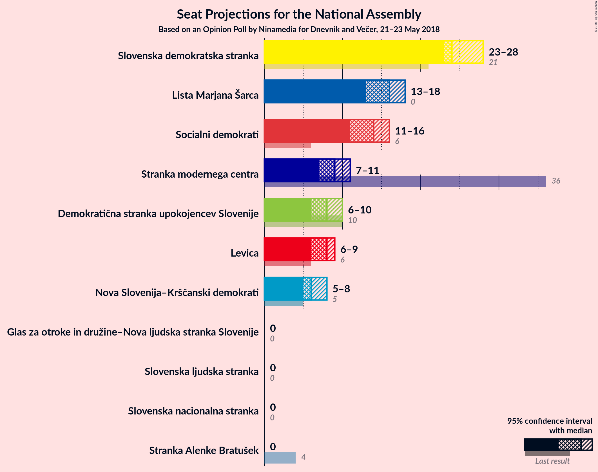
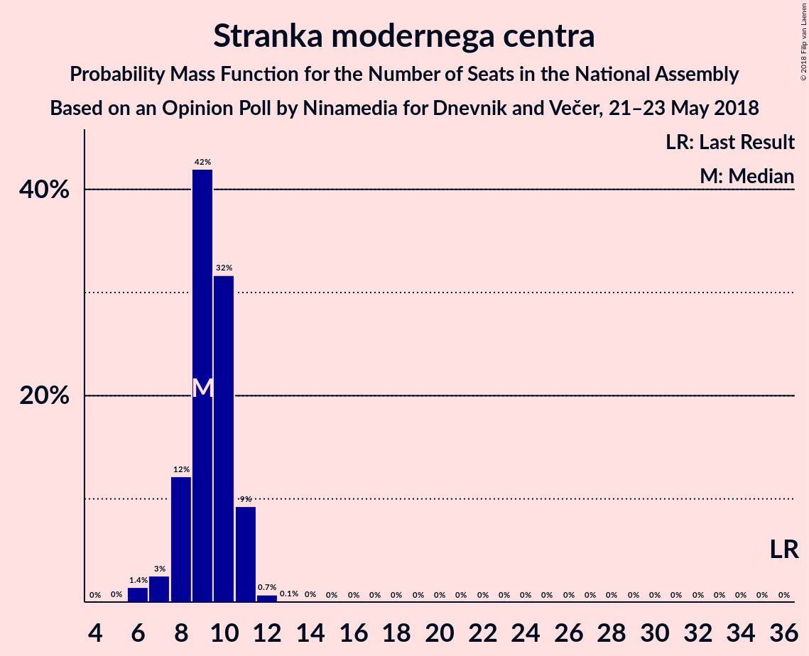

# Opinion Poll by Ninamedia for Dnevnik and Večer, 21–23 May 2018

<a href="#voting-intentions">Voting Intentions</a> | <a href="#seats">Seats</a> | <a href="#coalitions">Coalitions</a> | <a href="#technical-information">Technical Information</a>

## Voting Intentions

### Confidence Intervals

| Party | Last Result | Poll Result | 80% Confidence Interval | 90% Confidence Interval | 95% Confidence Interval | 99% Confidence Interval |
|:-----:|:-----------:|:-----------:|:-----------------------:|:-----------------------:|:-----------------------:|:-----------------------:|
| Slovenska demokratska stranka | 20.7% | 26.4% | 24.0–28.9% |23.4–29.6% |22.8–30.3% |21.7–31.5% |
| Lista Marjana Šarca | 0.0% | 16.2% | 14.3–18.4% |13.8–19.0% |13.3–19.6% |12.4–20.7% |
| Socialni demokrati | 6.0% | 14.3% | 12.5–16.4% |12.0–17.0% |11.6–17.6% |10.8–18.6% |
| Stranka modernega centra | 34.5% | 9.4% | 8.0–11.2% |7.6–11.8% |7.2–12.2% |6.6–13.1% |
| Demokratična stranka upokojencev Slovenije | 10.2% | 8.3% | 6.9–10.0% |6.6–10.5% |6.2–10.9% |5.6–11.8% |
| Levica | 6.0% | 7.7% | 6.4–9.4% |6.1–9.9% |5.7–10.3% |5.2–11.2% |
| Nova Slovenija–Krščanski demokrati | 5.6% | 6.6% | 5.4–8.2% |5.1–8.6% |4.8–9.0% |4.3–9.9% |
| Slovenska nacionalna stranka | 2.2% | 2.6% | 1.9–3.8% |1.7–4.1% |1.6–4.4% |1.3–5.0% |
| Slovenska ljudska stranka | 4.0% | 2.1% | 1.5–3.1% |1.3–3.4% |1.2–3.7% |0.9–4.2% |
| Stranka Alenke Bratušek | 4.4% | 1.7% | 1.2–2.7% |1.0–2.9% |0.9–3.2% |0.7–3.7% |
| Glas za otroke in družine–Nova ljudska stranka Slovenije | 0.0% | 0.2% | 0.1–0.7% |0.1–0.9% |0.0–1.1% |0.0–1.4% |

*Note:* The poll result column reflects the actual value used in the calculations. Published results may vary slightly, and in addition be rounded to fewer digits.

## Seats

### Confidence Intervals

| Party | Last Result | Median | 80% Confidence Interval | 90% Confidence Interval | 95% Confidence Interval | 99% Confidence Interval |
|:-----:|:-----------:|:------:|:-----------------------:|:-----------------------:|:-----------------------:|:-----------------------:|
| <a href="#slovenska-demokratska-stranka">Slovenska demokratska stranka</a> | 21 | 25 | 23–28 |22–29 |21–29 |20–30 |
| <a href="#lista-marjana-šarca">Lista Marjana Šarca</a> | 0 | 16 | 13–18 |13–18 |12–19 |12–20 |
| <a href="#socialni-demokrati">Socialni demokrati</a> | 6 | 14 | 12–15 |11–16 |11–17 |10–18 |
| <a href="#stranka-modernega-centra">Stranka modernega centra</a> | 36 | 9 | 8–10 |7–11 |6–11 |6–12 |
| <a href="#demokratična-stranka-upokojencev-slovenije">Demokratična stranka upokojencev Slovenije</a> | 10 | 8 | 6–9 |6–10 |6–11 |5–11 |
| <a href="#levica">Levica</a> | 6 | 7 | 6–8 |5–9 |5–9 |5–10 |
| <a href="#nova-slovenija–krščanski-demokrati">Nova Slovenija–Krščanski demokrati</a> | 5 | 6 | 5–7 |4–8 |4–8 |4–9 |
| <a href="#slovenska-nacionalna-stranka">Slovenska nacionalna stranka</a> | 0 | 0 | 0 |0 |0–3 |0–4 |
| <a href="#slovenska-ljudska-stranka">Slovenska ljudska stranka</a> | 0 | 0 | 0 |0 |0 |0–4 |
| <a href="#stranka-alenke-bratušek">Stranka Alenke Bratušek</a> | 4 | 0 | 0 |0 |0 |0 |
| <a href="#glas-za-otroke-in-družine–nova-ljudska-stranka-slovenije">Glas za otroke in družine–Nova ljudska stranka Slovenije</a> | 0 | 0 | 0 |0 |0 |0 |

### Slovenska demokratska stranka

*For a full overview of the results for this party, see the [Slovenska demokratska stranka](party-slovenskademokratskastranka.html) page.*

| Number of Seats | Probability | Accumulated | Special Marks |
|:---------------:|:-----------:|:-----------:|:-------------:|
| 19 | 0.1% | 100% |  |
| 20 | 0.7% | 99.9% |  |
| 21 | 3% | 99.1% | Last Result |
| 22 | 3% | 96% |  |
| 23 | 8% | 94% |  |
| 24 | 29% | 86% |  |
| 25 | 17% | 56% | Median |
| 26 | 17% | 39% |  |
| 27 | 7% | 22% |  |
| 28 | 8% | 15% |  |
| 29 | 5% | 7% |  |
| 30 | 0.8% | 1.3% |  |
| 31 | 0.4% | 0.5% |  |
| 32 | 0.1% | 0.1% |  |
| 33 | 0% | 0% |  |

### Lista Marjana Šarca

*For a full overview of the results for this party, see the [Lista Marjana Šarca](party-listamarjanašarca.html) page.*

| Number of Seats | Probability | Accumulated | Special Marks |
|:---------------:|:-----------:|:-----------:|:-------------:|
| 0 | 0% | 100% | Last Result |
| 1 | 0% | 100% |  |
| 2 | 0% | 100% |  |
| 3 | 0% | 100% |  |
| 4 | 0% | 100% |  |
| 5 | 0% | 100% |  |
| 6 | 0% | 100% |  |
| 7 | 0% | 100% |  |
| 8 | 0% | 100% |  |
| 9 | 0% | 100% |  |
| 10 | 0% | 100% |  |
| 11 | 0.2% | 100% |  |
| 12 | 3% | 99.7% |  |
| 13 | 7% | 97% |  |
| 14 | 7% | 90% |  |
| 15 | 28% | 83% |  |
| 16 | 14% | 55% | Median |
| 17 | 21% | 41% |  |
| 18 | 15% | 20% |  |
| 19 | 3% | 5% |  |
| 20 | 0.6% | 1.1% |  |
| 21 | 0.5% | 0.5% |  |
| 22 | 0% | 0% |  |

### Socialni demokrati

*For a full overview of the results for this party, see the [Socialni demokrati](party-socialnidemokrati.html) page.*

| Number of Seats | Probability | Accumulated | Special Marks |
|:---------------:|:-----------:|:-----------:|:-------------:|
| 6 | 0% | 100% | Last Result |
| 7 | 0% | 100% |  |
| 8 | 0% | 100% |  |
| 9 | 0.1% | 100% |  |
| 10 | 1.0% | 99.9% |  |
| 11 | 8% | 98.9% |  |
| 12 | 12% | 91% |  |
| 13 | 27% | 79% |  |
| 14 | 35% | 52% | Median |
| 15 | 8% | 17% |  |
| 16 | 7% | 10% |  |
| 17 | 2% | 3% |  |
| 18 | 0.4% | 0.5% |  |
| 19 | 0.1% | 0.1% |  |
| 20 | 0% | 0% |  |

### Stranka modernega centra

*For a full overview of the results for this party, see the [Stranka modernega centra](party-strankamodernegacentra.html) page.*

| Number of Seats | Probability | Accumulated | Special Marks |
|:---------------:|:-----------:|:-----------:|:-------------:|
| 5 | 0.1% | 100% |  |
| 6 | 3% | 99.9% |  |
| 7 | 7% | 97% |  |
| 8 | 18% | 91% |  |
| 9 | 38% | 73% | Median |
| 10 | 26% | 34% |  |
| 11 | 7% | 8% |  |
| 12 | 2% | 2% |  |
| 13 | 0.3% | 0.3% |  |
| 14 | 0% | 0% |  |
| 15 | 0% | 0% |  |
| 16 | 0% | 0% |  |
| 17 | 0% | 0% |  |
| 18 | 0% | 0% |  |
| 19 | 0% | 0% |  |
| 20 | 0% | 0% |  |
| 21 | 0% | 0% |  |
| 22 | 0% | 0% |  |
| 23 | 0% | 0% |  |
| 24 | 0% | 0% |  |
| 25 | 0% | 0% |  |
| 26 | 0% | 0% |  |
| 27 | 0% | 0% |  |
| 28 | 0% | 0% |  |
| 29 | 0% | 0% |  |
| 30 | 0% | 0% |  |
| 31 | 0% | 0% |  |
| 32 | 0% | 0% |  |
| 33 | 0% | 0% |  |
| 34 | 0% | 0% |  |
| 35 | 0% | 0% |  |
| 36 | 0% | 0% | Last Result |

### Demokratična stranka upokojencev Slovenije

*For a full overview of the results for this party, see the [Demokratična stranka upokojencev Slovenije](party-demokratičnastrankaupokojencevslovenije.html) page.*

| Number of Seats | Probability | Accumulated | Special Marks |
|:---------------:|:-----------:|:-----------:|:-------------:|
| 4 | 0.1% | 100% |  |
| 5 | 2% | 99.9% |  |
| 6 | 10% | 98% |  |
| 7 | 22% | 88% |  |
| 8 | 29% | 66% | Median |
| 9 | 27% | 37% |  |
| 10 | 7% | 10% | Last Result |
| 11 | 2% | 3% |  |
| 12 | 0.3% | 0.3% |  |
| 13 | 0% | 0% |  |

### Levica

*For a full overview of the results for this party, see the [Levica](party-levica.html) page.*

| Number of Seats | Probability | Accumulated | Special Marks |
|:---------------:|:-----------:|:-----------:|:-------------:|
| 4 | 0.4% | 100% |  |
| 5 | 7% | 99.6% |  |
| 6 | 28% | 93% | Last Result |
| 7 | 24% | 65% | Median |
| 8 | 32% | 41% |  |
| 9 | 7% | 9% |  |
| 10 | 2% | 2% |  |
| 11 | 0.3% | 0.4% |  |
| 12 | 0% | 0% |  |

### Nova Slovenija–Krščanski demokrati

*For a full overview of the results for this party, see the [Nova Slovenija–Krščanski demokrati](party-novaslovenija–krščanskidemokrati.html) page.*

| Number of Seats | Probability | Accumulated | Special Marks |
|:---------------:|:-----------:|:-----------:|:-------------:|
| 0 | 0.2% | 100% |  |
| 1 | 0% | 99.8% |  |
| 2 | 0% | 99.8% |  |
| 3 | 0.2% | 99.8% |  |
| 4 | 5% | 99.6% |  |
| 5 | 25% | 95% | Last Result |
| 6 | 48% | 70% | Median |
| 7 | 16% | 22% |  |
| 8 | 5% | 6% |  |
| 9 | 1.0% | 1.2% |  |
| 10 | 0.2% | 0.2% |  |
| 11 | 0% | 0% |  |

### Slovenska nacionalna stranka

*For a full overview of the results for this party, see the [Slovenska nacionalna stranka](party-slovenskanacionalnastranka.html) page.*

| Number of Seats | Probability | Accumulated | Special Marks |
|:---------------:|:-----------:|:-----------:|:-------------:|
| 0 | 97% | 100% | Last Result, Median |
| 1 | 0% | 3% |  |
| 2 | 0% | 3% |  |
| 3 | 0.8% | 3% |  |
| 4 | 2% | 2% |  |
| 5 | 0.2% | 0.2% |  |
| 6 | 0% | 0% |  |

### Slovenska ljudska stranka

*For a full overview of the results for this party, see the [Slovenska ljudska stranka](party-slovenskaljudskastranka.html) page.*

| Number of Seats | Probability | Accumulated | Special Marks |
|:---------------:|:-----------:|:-----------:|:-------------:|
| 0 | 99.3% | 100% | Last Result, Median |
| 1 | 0% | 0.7% |  |
| 2 | 0% | 0.7% |  |
| 3 | 0.1% | 0.7% |  |
| 4 | 0.6% | 0.6% |  |
| 5 | 0% | 0% |  |

### Stranka Alenke Bratušek

*For a full overview of the results for this party, see the [Stranka Alenke Bratušek](party-strankaalenkebratušek.html) page.*

| Number of Seats | Probability | Accumulated | Special Marks |
|:---------------:|:-----------:|:-----------:|:-------------:|
| 0 | 99.9% | 100% | Median |
| 1 | 0% | 0.1% |  |
| 2 | 0% | 0.1% |  |
| 3 | 0% | 0.1% |  |
| 4 | 0.1% | 0.1% | Last Result |
| 5 | 0% | 0% |  |

### Glas za otroke in družine–Nova ljudska stranka Slovenije

*For a full overview of the results for this party, see the [Glas za otroke in družine–Nova ljudska stranka Slovenije](party-glaszaotrokeindružine–novaljudskastrankaslovenije.html) page.*

| Number of Seats | Probability | Accumulated | Special Marks |
|:---------------:|:-----------:|:-----------:|:-------------:|
| 0 | 100% | 100% | Last Result, Median |

## Coalitions

### Confidence Intervals

| Coalition | Last Result | Median | Majority? | 80% Confidence Interval | 90% Confidence Interval | 95% Confidence Interval | 99% Confidence Interval |
|:---------:|:-----------:|:------:|:---------:|:-----------------------:|:-----------------------:|:-----------------------:|:-----------------------:|
| Slovenska demokratska stranka – Lista Marjana Šarca – Demokratična stranka upokojencev Slovenije | 31 | 49 | 95% | 46–51 | 46–53 | 44–53 | 43–54 |
| Slovenska demokratska stranka – Lista Marjana Šarca | 21 | 41 | 0.9% | 38–43 | 37–44 | 36–45 | 35–46 |
| Lista Marjana Šarca – Socialni demokrati – Demokratična stranka upokojencev Slovenije | 16 | 38 | 0% | 34–40 | 33–41 | 33–42 | 31–43 |
| Lista Marjana Šarca – Socialni demokrati – Stranka modernega centra | 42 | 39 | 0.1% | 35–41 | 34–42 | 33–42 | 32–44 |
| Lista Marjana Šarca – Socialni demokrati – Nova Slovenija–Krščanski demokrati | 11 | 35 | 0% | 32–38 | 32–39 | 31–40 | 30–41 |
| Socialni demokrati – Stranka modernega centra – Demokratična stranka upokojencev Slovenije | 52 | 31 | 0% | 28–33 | 27–34 | 26–34 | 25–36 |
| Lista Marjana Šarca – Socialni demokrati | 6 | 30 | 0% | 26–32 | 26–33 | 25–33 | 24–35 |

### Slovenska demokratska stranka – Lista Marjana Šarca – Demokratična stranka upokojencev Slovenije

| Number of Seats | Probability | Accumulated | Special Marks |
|:---------------:|:-----------:|:-----------:|:-------------:|
| 31 | 0% | 100% | Last Result |
| 32 | 0% | 100% |  |
| 33 | 0% | 100% |  |
| 34 | 0% | 100% |  |
| 35 | 0% | 100% |  |
| 36 | 0% | 100% |  |
| 37 | 0% | 100% |  |
| 38 | 0% | 100% |  |
| 39 | 0% | 100% |  |
| 40 | 0% | 100% |  |
| 41 | 0.1% | 100% |  |
| 42 | 0.4% | 99.9% |  |
| 43 | 0.7% | 99.5% |  |
| 44 | 1.4% | 98.8% |  |
| 45 | 2% | 97% |  |
| 46 | 6% | 95% | Majority |
| 47 | 8% | 89% |  |
| 48 | 22% | 81% |  |
| 49 | 18% | 59% | Median |
| 50 | 11% | 41% |  |
| 51 | 20% | 30% |  |
| 52 | 4% | 9% |  |
| 53 | 4% | 6% |  |
| 54 | 0.9% | 1.3% |  |
| 55 | 0.3% | 0.4% |  |
| 56 | 0% | 0.1% |  |
| 57 | 0% | 0% |  |

### Slovenska demokratska stranka – Lista Marjana Šarca

| Number of Seats | Probability | Accumulated | Special Marks |
|:---------------:|:-----------:|:-----------:|:-------------:|
| 21 | 0% | 100% | Last Result |
| 22 | 0% | 100% |  |
| 23 | 0% | 100% |  |
| 24 | 0% | 100% |  |
| 25 | 0% | 100% |  |
| 26 | 0% | 100% |  |
| 27 | 0% | 100% |  |
| 28 | 0% | 100% |  |
| 29 | 0% | 100% |  |
| 30 | 0% | 100% |  |
| 31 | 0% | 100% |  |
| 32 | 0% | 100% |  |
| 33 | 0% | 100% |  |
| 34 | 0.2% | 99.9% |  |
| 35 | 0.8% | 99.7% |  |
| 36 | 2% | 99.0% |  |
| 37 | 2% | 97% |  |
| 38 | 5% | 95% |  |
| 39 | 14% | 90% |  |
| 40 | 16% | 76% |  |
| 41 | 12% | 60% | Median |
| 42 | 21% | 48% |  |
| 43 | 17% | 27% |  |
| 44 | 7% | 10% |  |
| 45 | 2% | 3% |  |
| 46 | 0.8% | 0.9% | Majority |
| 47 | 0.1% | 0.2% |  |
| 48 | 0.1% | 0.1% |  |
| 49 | 0% | 0% |  |

### Lista Marjana Šarca – Socialni demokrati – Demokratična stranka upokojencev Slovenije

| Number of Seats | Probability | Accumulated | Special Marks |
|:---------------:|:-----------:|:-----------:|:-------------:|
| 16 | 0% | 100% | Last Result |
| 17 | 0% | 100% |  |
| 18 | 0% | 100% |  |
| 19 | 0% | 100% |  |
| 20 | 0% | 100% |  |
| 21 | 0% | 100% |  |
| 22 | 0% | 100% |  |
| 23 | 0% | 100% |  |
| 24 | 0% | 100% |  |
| 25 | 0% | 100% |  |
| 26 | 0% | 100% |  |
| 27 | 0% | 100% |  |
| 28 | 0% | 100% |  |
| 29 | 0% | 100% |  |
| 30 | 0.1% | 100% |  |
| 31 | 0.7% | 99.8% |  |
| 32 | 1.2% | 99.1% |  |
| 33 | 5% | 98% |  |
| 34 | 6% | 93% |  |
| 35 | 8% | 88% |  |
| 36 | 11% | 80% |  |
| 37 | 8% | 69% |  |
| 38 | 33% | 60% | Median |
| 39 | 12% | 28% |  |
| 40 | 7% | 15% |  |
| 41 | 4% | 9% |  |
| 42 | 4% | 4% |  |
| 43 | 0.3% | 0.6% |  |
| 44 | 0.3% | 0.3% |  |
| 45 | 0% | 0% |  |

### Lista Marjana Šarca – Socialni demokrati – Stranka modernega centra

| Number of Seats | Probability | Accumulated | Special Marks |
|:---------------:|:-----------:|:-----------:|:-------------:|
| 31 | 0.2% | 100% |  |
| 32 | 0.4% | 99.8% |  |
| 33 | 2% | 99.4% |  |
| 34 | 3% | 97% |  |
| 35 | 9% | 94% |  |
| 36 | 6% | 85% |  |
| 37 | 11% | 80% |  |
| 38 | 17% | 68% |  |
| 39 | 10% | 51% | Median |
| 40 | 21% | 42% |  |
| 41 | 15% | 20% |  |
| 42 | 3% | 6% | Last Result |
| 43 | 1.1% | 2% |  |
| 44 | 0.9% | 1.2% |  |
| 45 | 0.2% | 0.3% |  |
| 46 | 0% | 0.1% | Majority |
| 47 | 0% | 0% |  |

### Lista Marjana Šarca – Socialni demokrati – Nova Slovenija–Krščanski demokrati

| Number of Seats | Probability | Accumulated | Special Marks |
|:---------------:|:-----------:|:-----------:|:-------------:|
| 11 | 0% | 100% | Last Result |
| 12 | 0% | 100% |  |
| 13 | 0% | 100% |  |
| 14 | 0% | 100% |  |
| 15 | 0% | 100% |  |
| 16 | 0% | 100% |  |
| 17 | 0% | 100% |  |
| 18 | 0% | 100% |  |
| 19 | 0% | 100% |  |
| 20 | 0% | 100% |  |
| 21 | 0% | 100% |  |
| 22 | 0% | 100% |  |
| 23 | 0% | 100% |  |
| 24 | 0% | 100% |  |
| 25 | 0% | 100% |  |
| 26 | 0% | 100% |  |
| 27 | 0.1% | 100% |  |
| 28 | 0.1% | 99.9% |  |
| 29 | 0.3% | 99.9% |  |
| 30 | 2% | 99.6% |  |
| 31 | 3% | 98% |  |
| 32 | 8% | 95% |  |
| 33 | 9% | 87% |  |
| 34 | 11% | 78% |  |
| 35 | 18% | 67% |  |
| 36 | 21% | 49% | Median |
| 37 | 12% | 29% |  |
| 38 | 7% | 16% |  |
| 39 | 7% | 10% |  |
| 40 | 2% | 3% |  |
| 41 | 1.1% | 1.3% |  |
| 42 | 0.1% | 0.2% |  |
| 43 | 0.1% | 0.1% |  |
| 44 | 0% | 0% |  |

### Socialni demokrati – Stranka modernega centra – Demokratična stranka upokojencev Slovenije

| Number of Seats | Probability | Accumulated | Special Marks |
|:---------------:|:-----------:|:-----------:|:-------------:|
| 23 | 0.1% | 100% |  |
| 24 | 0.1% | 99.9% |  |
| 25 | 0.5% | 99.8% |  |
| 26 | 3% | 99.2% |  |
| 27 | 4% | 97% |  |
| 28 | 6% | 92% |  |
| 29 | 12% | 86% |  |
| 30 | 15% | 74% |  |
| 31 | 28% | 59% | Median |
| 32 | 20% | 31% |  |
| 33 | 5% | 11% |  |
| 34 | 4% | 6% |  |
| 35 | 1.2% | 2% |  |
| 36 | 0.5% | 0.8% |  |
| 37 | 0.2% | 0.3% |  |
| 38 | 0.1% | 0.1% |  |
| 39 | 0% | 0% |  |
| 40 | 0% | 0% |  |
| 41 | 0% | 0% |  |
| 42 | 0% | 0% |  |
| 43 | 0% | 0% |  |
| 44 | 0% | 0% |  |
| 45 | 0% | 0% |  |
| 46 | 0% | 0% | Majority |
| 47 | 0% | 0% |  |
| 48 | 0% | 0% |  |
| 49 | 0% | 0% |  |
| 50 | 0% | 0% |  |
| 51 | 0% | 0% |  |
| 52 | 0% | 0% | Last Result |

### Lista Marjana Šarca – Socialni demokrati

| Number of Seats | Probability | Accumulated | Special Marks |
|:---------------:|:-----------:|:-----------:|:-------------:|
| 6 | 0% | 100% | Last Result |
| 7 | 0% | 100% |  |
| 8 | 0% | 100% |  |
| 9 | 0% | 100% |  |
| 10 | 0% | 100% |  |
| 11 | 0% | 100% |  |
| 12 | 0% | 100% |  |
| 13 | 0% | 100% |  |
| 14 | 0% | 100% |  |
| 15 | 0% | 100% |  |
| 16 | 0% | 100% |  |
| 17 | 0% | 100% |  |
| 18 | 0% | 100% |  |
| 19 | 0% | 100% |  |
| 20 | 0% | 100% |  |
| 21 | 0% | 100% |  |
| 22 | 0.1% | 100% |  |
| 23 | 0.1% | 99.9% |  |
| 24 | 1.0% | 99.8% |  |
| 25 | 2% | 98.8% |  |
| 26 | 8% | 96% |  |
| 27 | 9% | 88% |  |
| 28 | 11% | 80% |  |
| 29 | 18% | 69% |  |
| 30 | 23% | 50% | Median |
| 31 | 6% | 28% |  |
| 32 | 15% | 21% |  |
| 33 | 4% | 7% |  |
| 34 | 1.4% | 2% |  |
| 35 | 0.7% | 1.0% |  |
| 36 | 0.3% | 0.3% |  |
| 37 | 0% | 0% |  |

## Technical Information

### Opinion Poll

+ **Polling firm:** Ninamedia
+ **Commissioner(s):** Dnevnik and Večer
+ **Fieldwork period:** 21–23 May 2018

### Calculations

+ **Sample size:** 531
+ **Simulations done:** 4,194,304
+ **Error estimate:** 2.97%

