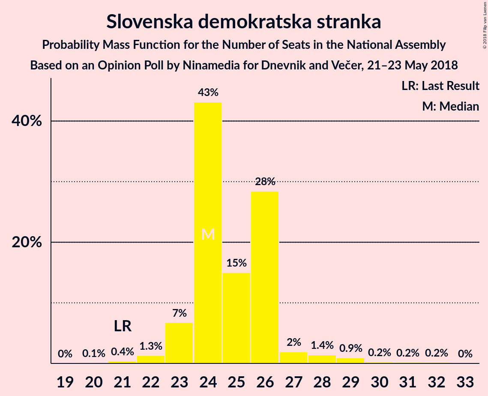
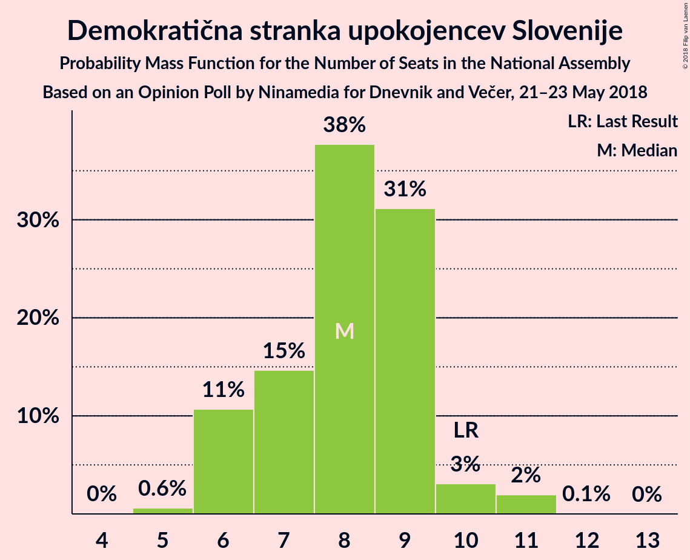
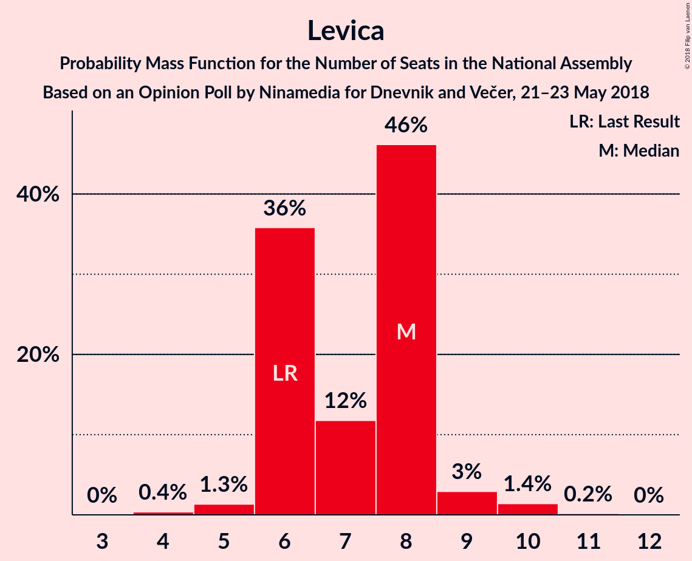

# Opinion Poll by Ninamedia for Dnevnik and Večer, 21–23 May 2018

<a href="#voting-intentions">Voting Intentions</a> | <a href="#seats">Seats</a> | <a href="#coalitions">Coalitions</a> | <a href="#technical-information">Technical Information</a>

## Voting Intentions

### Confidence Intervals

| Party | Last Result | Poll Result | 80% Confidence Interval | 90% Confidence Interval | 95% Confidence Interval | 99% Confidence Interval |
|:-----:|:-----------:|:-----------:|:-----------------------:|:-----------------------:|:-----------------------:|:-----------------------:|
| Slovenska demokratska stranka | 20.7% | 26.4% | 24.0–28.9% |23.4–29.6% |22.8–30.3% |21.7–31.5% |
| Lista Marjana Šarca | 0.0% | 16.2% | 14.3–18.4% |13.8–19.0% |13.3–19.6% |12.4–20.7% |
| Socialni demokrati | 6.0% | 14.3% | 12.5–16.4% |12.0–17.0% |11.6–17.6% |10.8–18.6% |
| Stranka modernega centra | 34.5% | 9.4% | 8.0–11.2% |7.6–11.8% |7.2–12.2% |6.6–13.1% |
| Demokratična stranka upokojencev Slovenije | 10.2% | 8.3% | 6.9–10.0% |6.6–10.5% |6.2–10.9% |5.6–11.8% |
| Levica | 6.0% | 7.7% | 6.4–9.4% |6.1–9.9% |5.7–10.3% |5.2–11.2% |
| Nova Slovenija–Krščanski demokrati | 5.6% | 6.6% | 5.4–8.2% |5.1–8.6% |4.8–9.0% |4.3–9.9% |
| Slovenska nacionalna stranka | 2.2% | 2.6% | 1.9–3.8% |1.7–4.1% |1.6–4.4% |1.3–5.0% |
| Slovenska ljudska stranka | 4.0% | 2.1% | 1.5–3.1% |1.3–3.4% |1.2–3.7% |0.9–4.2% |
| Stranka Alenke Bratušek | 4.4% | 1.7% | 1.2–2.7% |1.0–2.9% |0.9–3.2% |0.7–3.7% |
| Glas za otroke in družine–Nova ljudska stranka Slovenije | 0.0% | 0.2% | 0.1–0.7% |0.1–0.9% |0.0–1.1% |0.0–1.4% |

*Note:* The poll result column reflects the actual value used in the calculations. Published results may vary slightly, and in addition be rounded to fewer digits.

## Seats

### Confidence Intervals

| Party | Last Result | Median | 80% Confidence Interval | 90% Confidence Interval | 95% Confidence Interval | 99% Confidence Interval |
|:-----:|:-----------:|:------:|:-----------------------:|:-----------------------:|:-----------------------:|:-----------------------:|
| <a href="#slovenska-demokratska-stranka">Slovenska demokratska stranka</a> | 21 | 26 | 24–26 |24–26 |23–26 |23–28 |
| <a href="#lista-marjana-šarca">Lista Marjana Šarca</a> | 0 | 17 | 15–17 |14–17 |14–17 |13–18 |
| <a href="#socialni-demokrati">Socialni demokrati</a> | 6 | 13 | 13 |13 |12–14 |10–16 |
| <a href="#stranka-modernega-centra">Stranka modernega centra</a> | 36 | 10 | 9–10 |9–10 |8–10 |7–11 |
| <a href="#demokratična-stranka-upokojencev-slovenije">Demokratična stranka upokojencev Slovenije</a> | 10 | 8 | 8 |8 |7–10 |6–10 |
| <a href="#levica">Levica</a> | 6 | 8 | 7–8 |6–8 |6–8 |5–9 |
| <a href="#nova-slovenija–krščanski-demokrati">Nova Slovenija–Krščanski demokrati</a> | 5 | 6 | 6 |6–7 |6–7 |5–8 |
| <a href="#slovenska-nacionalna-stranka">Slovenska nacionalna stranka</a> | 0 | 0 | 0 |0 |0 |0–3 |
| <a href="#slovenska-ljudska-stranka">Slovenska ljudska stranka</a> | 0 | 0 | 0 |0 |0 |0 |
| <a href="#stranka-alenke-bratušek">Stranka Alenke Bratušek</a> | 4 | 0 | 0 |0 |0 |0 |
| <a href="#glas-za-otroke-in-družine–nova-ljudska-stranka-slovenije">Glas za otroke in družine–Nova ljudska stranka Slovenije</a> | 0 | 0 | 0 |0 |0 |0 |

### Slovenska demokratska stranka

*For a full overview of the results for this party, see the [Slovenska demokratska stranka](party-slovenskademokratskastranka.html) page.*

| Number of Seats | Probability | Accumulated | Special Marks |
|:---------------:|:-----------:|:-----------:|:-------------:|
| 21 | 0.1% | 100% | Last Result |
| 22 | 0% | 99.8% |  |
| 23 | 3% | 99.8% |  |
| 24 | 7% | 96% |  |
| 25 | 1.3% | 89% |  |
| 26 | 87% | 88% | Median |
| 27 | 0.2% | 0.8% |  |
| 28 | 0.1% | 0.6% |  |
| 29 | 0.2% | 0.5% |  |
| 30 | 0.2% | 0.3% |  |
| 31 | 0% | 0.1% |  |
| 32 | 0% | 0% |  |

### Lista Marjana Šarca

*For a full overview of the results for this party, see the [Lista Marjana Šarca](party-listamarjanašarca.html) page.*

| Number of Seats | Probability | Accumulated | Special Marks |
|:---------------:|:-----------:|:-----------:|:-------------:|
| 0 | 0% | 100% | Last Result |
| 1 | 0% | 100% |  |
| 2 | 0% | 100% |  |
| 3 | 0% | 100% |  |
| 4 | 0% | 100% |  |
| 5 | 0% | 100% |  |
| 6 | 0% | 100% |  |
| 7 | 0% | 100% |  |
| 8 | 0% | 100% |  |
| 9 | 0% | 100% |  |
| 10 | 0% | 100% |  |
| 11 | 0% | 100% |  |
| 12 | 0.2% | 100% |  |
| 13 | 0.4% | 99.8% |  |
| 14 | 7% | 99.4% |  |
| 15 | 7% | 93% |  |
| 16 | 2% | 86% |  |
| 17 | 83% | 84% | Median |
| 18 | 1.1% | 1.2% |  |
| 19 | 0.1% | 0.1% |  |
| 20 | 0.1% | 0.1% |  |
| 21 | 0% | 0% |  |

### Socialni demokrati

*For a full overview of the results for this party, see the [Socialni demokrati](party-socialnidemokrati.html) page.*

| Number of Seats | Probability | Accumulated | Special Marks |
|:---------------:|:-----------:|:-----------:|:-------------:|
| 6 | 0% | 100% | Last Result |
| 7 | 0% | 100% |  |
| 8 | 0% | 100% |  |
| 9 | 0% | 100% |  |
| 10 | 0.5% | 100% |  |
| 11 | 2% | 99.4% |  |
| 12 | 2% | 98% |  |
| 13 | 91% | 96% | Median |
| 14 | 3% | 5% |  |
| 15 | 1.1% | 2% |  |
| 16 | 0.4% | 0.8% |  |
| 17 | 0.4% | 0.4% |  |
| 18 | 0% | 0% |  |

### Stranka modernega centra

*For a full overview of the results for this party, see the [Stranka modernega centra](party-strankamodernegacentra.html) page.*

| Number of Seats | Probability | Accumulated | Special Marks |
|:---------------:|:-----------:|:-----------:|:-------------:|
| 6 | 0.3% | 100% |  |
| 7 | 2% | 99.7% |  |
| 8 | 3% | 98% |  |
| 9 | 9% | 95% |  |
| 10 | 83% | 86% | Median |
| 11 | 2% | 2% |  |
| 12 | 0% | 0.1% |  |
| 13 | 0% | 0% |  |
| 14 | 0% | 0% |  |
| 15 | 0% | 0% |  |
| 16 | 0% | 0% |  |
| 17 | 0% | 0% |  |
| 18 | 0% | 0% |  |
| 19 | 0% | 0% |  |
| 20 | 0% | 0% |  |
| 21 | 0% | 0% |  |
| 22 | 0% | 0% |  |
| 23 | 0% | 0% |  |
| 24 | 0% | 0% |  |
| 25 | 0% | 0% |  |
| 26 | 0% | 0% |  |
| 27 | 0% | 0% |  |
| 28 | 0% | 0% |  |
| 29 | 0% | 0% |  |
| 30 | 0% | 0% |  |
| 31 | 0% | 0% |  |
| 32 | 0% | 0% |  |
| 33 | 0% | 0% |  |
| 34 | 0% | 0% |  |
| 35 | 0% | 0% |  |
| 36 | 0% | 0% | Last Result |

### Demokratična stranka upokojencev Slovenije

*For a full overview of the results for this party, see the [Demokratična stranka upokojencev Slovenije](party-demokratičnastrankaupokojencevslovenije.html) page.*

| Number of Seats | Probability | Accumulated | Special Marks |
|:---------------:|:-----------:|:-----------:|:-------------:|
| 5 | 0.1% | 100% |  |
| 6 | 0.7% | 99.9% |  |
| 7 | 3% | 99.1% |  |
| 8 | 92% | 96% | Median |
| 9 | 1.1% | 4% |  |
| 10 | 2% | 3% | Last Result |
| 11 | 0.1% | 0.1% |  |
| 12 | 0% | 0% |  |

### Levica

*For a full overview of the results for this party, see the [Levica](party-levica.html) page.*

| Number of Seats | Probability | Accumulated | Special Marks |
|:---------------:|:-----------:|:-----------:|:-------------:|
| 4 | 0.3% | 100% |  |
| 5 | 0.3% | 99.7% |  |
| 6 | 6% | 99.4% | Last Result |
| 7 | 7% | 94% |  |
| 8 | 85% | 87% | Median |
| 9 | 1.0% | 1.4% |  |
| 10 | 0.1% | 0.4% |  |
| 11 | 0.3% | 0.3% |  |
| 12 | 0% | 0% |  |

### Nova Slovenija–Krščanski demokrati

*For a full overview of the results for this party, see the [Nova Slovenija–Krščanski demokrati](party-novaslovenija–krščanskidemokrati.html) page.*

| Number of Seats | Probability | Accumulated | Special Marks |
|:---------------:|:-----------:|:-----------:|:-------------:|
| 4 | 0.5% | 100% |  |
| 5 | 0.5% | 99.5% | Last Result |
| 6 | 93% | 99.0% | Median |
| 7 | 5% | 6% |  |
| 8 | 0.7% | 1.0% |  |
| 9 | 0.3% | 0.3% |  |
| 10 | 0% | 0% |  |

### Slovenska nacionalna stranka

*For a full overview of the results for this party, see the [Slovenska nacionalna stranka](party-slovenskanacionalnastranka.html) page.*

| Number of Seats | Probability | Accumulated | Special Marks |
|:---------------:|:-----------:|:-----------:|:-------------:|
| 0 | 99.2% | 100% | Last Result, Median |
| 1 | 0% | 0.8% |  |
| 2 | 0% | 0.8% |  |
| 3 | 0.4% | 0.8% |  |
| 4 | 0.4% | 0.4% |  |
| 5 | 0% | 0% |  |

### Slovenska ljudska stranka

*For a full overview of the results for this party, see the [Slovenska ljudska stranka](party-slovenskaljudskastranka.html) page.*

| Number of Seats | Probability | Accumulated | Special Marks |
|:---------------:|:-----------:|:-----------:|:-------------:|
| 0 | 100% | 100% | Last Result, Median |

### Stranka Alenke Bratušek

*For a full overview of the results for this party, see the [Stranka Alenke Bratušek](party-strankaalenkebratušek.html) page.*

| Number of Seats | Probability | Accumulated | Special Marks |
|:---------------:|:-----------:|:-----------:|:-------------:|
| 0 | 100% | 100% | Median |
| 1 | 0% | 0% |  |
| 2 | 0% | 0% |  |
| 3 | 0% | 0% |  |
| 4 | 0% | 0% | Last Result |

### Glas za otroke in družine–Nova ljudska stranka Slovenije

*For a full overview of the results for this party, see the [Glas za otroke in družine–Nova ljudska stranka Slovenije](party-glaszaotrokeindružine–novaljudskastrankaslovenije.html) page.*

| Number of Seats | Probability | Accumulated | Special Marks |
|:---------------:|:-----------:|:-----------:|:-------------:|
| 0 | 100% | 100% | Last Result, Median |

## Coalitions

### Confidence Intervals

| Coalition | Last Result | Median | Majority? | 80% Confidence Interval | 90% Confidence Interval | 95% Confidence Interval | 99% Confidence Interval |
|:---------:|:-----------:|:------:|:---------:|:-----------------------:|:-----------------------:|:-----------------------:|:-----------------------:|
| Slovenska demokratska stranka – Lista Marjana Šarca – Demokratična stranka upokojencev Slovenije | 31 | 51 | 99.4% | 48–51 | 46–51 | 46–51 | 45–53 |
| Slovenska demokratska stranka – Lista Marjana Šarca | 21 | 43 | 0.1% | 40–43 | 38–43 | 38–43 | 37–43 |
| Lista Marjana Šarca – Socialni demokrati – Stranka modernega centra | 42 | 40 | 0% | 37–40 | 36–40 | 36–40 | 34–40 |
| Lista Marjana Šarca – Socialni demokrati – Demokratična stranka upokojencev Slovenije | 16 | 38 | 0% | 36–38 | 35–38 | 35–39 | 33–40 |
| Lista Marjana Šarca – Socialni demokrati – Nova Slovenija–Krščanski demokrati | 11 | 36 | 0% | 34–36 | 33–36 | 33–36 | 32–39 |
| Socialni demokrati – Stranka modernega centra – Demokratična stranka upokojencev Slovenije | 52 | 31 | 0% | 30–31 | 30–31 | 29–32 | 27–33 |
| Lista Marjana Šarca – Socialni demokrati | 6 | 30 | 0% | 28–30 | 27–30 | 27–30 | 25–32 |

### Slovenska demokratska stranka – Lista Marjana Šarca – Demokratična stranka upokojencev Slovenije

| Number of Seats | Probability | Accumulated | Special Marks |
|:---------------:|:-----------:|:-----------:|:-------------:|
| 31 | 0% | 100% | Last Result |
| 32 | 0% | 100% |  |
| 33 | 0% | 100% |  |
| 34 | 0% | 100% |  |
| 35 | 0% | 100% |  |
| 36 | 0% | 100% |  |
| 37 | 0% | 100% |  |
| 38 | 0% | 100% |  |
| 39 | 0% | 100% |  |
| 40 | 0% | 100% |  |
| 41 | 0% | 100% |  |
| 42 | 0.1% | 100% |  |
| 43 | 0% | 99.9% |  |
| 44 | 0.1% | 99.9% |  |
| 45 | 0.4% | 99.8% |  |
| 46 | 7% | 99.4% | Majority |
| 47 | 2% | 92% |  |
| 48 | 2% | 91% |  |
| 49 | 5% | 89% |  |
| 50 | 0.4% | 84% |  |
| 51 | 83% | 84% | Median |
| 52 | 0.3% | 0.8% |  |
| 53 | 0.4% | 0.5% |  |
| 54 | 0% | 0.1% |  |
| 55 | 0% | 0.1% |  |
| 56 | 0% | 0.1% |  |
| 57 | 0% | 0.1% |  |
| 58 | 0% | 0% |  |

### Slovenska demokratska stranka – Lista Marjana Šarca

| Number of Seats | Probability | Accumulated | Special Marks |
|:---------------:|:-----------:|:-----------:|:-------------:|
| 21 | 0% | 100% | Last Result |
| 22 | 0% | 100% |  |
| 23 | 0% | 100% |  |
| 24 | 0% | 100% |  |
| 25 | 0% | 100% |  |
| 26 | 0% | 100% |  |
| 27 | 0% | 100% |  |
| 28 | 0% | 100% |  |
| 29 | 0% | 100% |  |
| 30 | 0% | 100% |  |
| 31 | 0% | 100% |  |
| 32 | 0% | 100% |  |
| 33 | 0% | 100% |  |
| 34 | 0% | 100% |  |
| 35 | 0% | 100% |  |
| 36 | 0.2% | 100% |  |
| 37 | 2% | 99.8% |  |
| 38 | 5% | 98% |  |
| 39 | 2% | 93% |  |
| 40 | 2% | 91% |  |
| 41 | 5% | 89% |  |
| 42 | 0.8% | 84% |  |
| 43 | 83% | 83% | Median |
| 44 | 0.2% | 0.4% |  |
| 45 | 0.1% | 0.2% |  |
| 46 | 0.1% | 0.1% | Majority |
| 47 | 0% | 0.1% |  |
| 48 | 0% | 0.1% |  |
| 49 | 0.1% | 0.1% |  |
| 50 | 0% | 0% |  |

### Lista Marjana Šarca – Socialni demokrati – Stranka modernega centra

| Number of Seats | Probability | Accumulated | Special Marks |
|:---------------:|:-----------:|:-----------:|:-------------:|
| 33 | 0.1% | 100% |  |
| 34 | 0.6% | 99.8% |  |
| 35 | 0.6% | 99.3% |  |
| 36 | 6% | 98.7% |  |
| 37 | 6% | 93% |  |
| 38 | 1.5% | 86% |  |
| 39 | 1.3% | 85% |  |
| 40 | 83% | 84% | Median |
| 41 | 0% | 0.4% |  |
| 42 | 0.2% | 0.3% | Last Result |
| 43 | 0.1% | 0.2% |  |
| 44 | 0% | 0% |  |

### Lista Marjana Šarca – Socialni demokrati – Demokratična stranka upokojencev Slovenije

| Number of Seats | Probability | Accumulated | Special Marks |
|:---------------:|:-----------:|:-----------:|:-------------:|
| 16 | 0% | 100% | Last Result |
| 17 | 0% | 100% |  |
| 18 | 0% | 100% |  |
| 19 | 0% | 100% |  |
| 20 | 0% | 100% |  |
| 21 | 0% | 100% |  |
| 22 | 0% | 100% |  |
| 23 | 0% | 100% |  |
| 24 | 0% | 100% |  |
| 25 | 0% | 100% |  |
| 26 | 0% | 100% |  |
| 27 | 0% | 100% |  |
| 28 | 0% | 100% |  |
| 29 | 0% | 100% |  |
| 30 | 0% | 100% |  |
| 31 | 0.1% | 100% |  |
| 32 | 0.2% | 99.8% |  |
| 33 | 0.6% | 99.6% |  |
| 34 | 0.1% | 99.0% |  |
| 35 | 6% | 98.9% |  |
| 36 | 6% | 93% |  |
| 37 | 1.1% | 87% |  |
| 38 | 83% | 86% | Median |
| 39 | 2% | 3% |  |
| 40 | 0.7% | 0.8% |  |
| 41 | 0.1% | 0.2% |  |
| 42 | 0.1% | 0.1% |  |
| 43 | 0% | 0% |  |

### Lista Marjana Šarca – Socialni demokrati – Nova Slovenija–Krščanski demokrati

| Number of Seats | Probability | Accumulated | Special Marks |
|:---------------:|:-----------:|:-----------:|:-------------:|
| 11 | 0% | 100% | Last Result |
| 12 | 0% | 100% |  |
| 13 | 0% | 100% |  |
| 14 | 0% | 100% |  |
| 15 | 0% | 100% |  |
| 16 | 0% | 100% |  |
| 17 | 0% | 100% |  |
| 18 | 0% | 100% |  |
| 19 | 0% | 100% |  |
| 20 | 0% | 100% |  |
| 21 | 0% | 100% |  |
| 22 | 0% | 100% |  |
| 23 | 0% | 100% |  |
| 24 | 0% | 100% |  |
| 25 | 0% | 100% |  |
| 26 | 0% | 100% |  |
| 27 | 0% | 100% |  |
| 28 | 0% | 100% |  |
| 29 | 0% | 100% |  |
| 30 | 0.1% | 99.9% |  |
| 31 | 0.2% | 99.9% |  |
| 32 | 2% | 99.7% |  |
| 33 | 5% | 98% |  |
| 34 | 5% | 93% |  |
| 35 | 0.9% | 88% |  |
| 36 | 84% | 87% | Median |
| 37 | 0.7% | 2% |  |
| 38 | 0.4% | 2% |  |
| 39 | 0.9% | 1.3% |  |
| 40 | 0.1% | 0.3% |  |
| 41 | 0.2% | 0.2% |  |
| 42 | 0% | 0% |  |

### Socialni demokrati – Stranka modernega centra – Demokratična stranka upokojencev Slovenije

| Number of Seats | Probability | Accumulated | Special Marks |
|:---------------:|:-----------:|:-----------:|:-------------:|
| 26 | 0.1% | 100% |  |
| 27 | 0.4% | 99.9% |  |
| 28 | 2% | 99.5% |  |
| 29 | 2% | 98% |  |
| 30 | 10% | 96% |  |
| 31 | 83% | 86% | Median |
| 32 | 2% | 3% |  |
| 33 | 1.2% | 1.5% |  |
| 34 | 0.1% | 0.2% |  |
| 35 | 0% | 0.1% |  |
| 36 | 0% | 0.1% |  |
| 37 | 0% | 0% |  |
| 38 | 0% | 0% |  |
| 39 | 0% | 0% |  |
| 40 | 0% | 0% |  |
| 41 | 0% | 0% |  |
| 42 | 0% | 0% |  |
| 43 | 0% | 0% |  |
| 44 | 0% | 0% |  |
| 45 | 0% | 0% |  |
| 46 | 0% | 0% | Majority |
| 47 | 0% | 0% |  |
| 48 | 0% | 0% |  |
| 49 | 0% | 0% |  |
| 50 | 0% | 0% |  |
| 51 | 0% | 0% |  |
| 52 | 0% | 0% | Last Result |

### Lista Marjana Šarca – Socialni demokrati

| Number of Seats | Probability | Accumulated | Special Marks |
|:---------------:|:-----------:|:-----------:|:-------------:|
| 6 | 0% | 100% | Last Result |
| 7 | 0% | 100% |  |
| 8 | 0% | 100% |  |
| 9 | 0% | 100% |  |
| 10 | 0% | 100% |  |
| 11 | 0% | 100% |  |
| 12 | 0% | 100% |  |
| 13 | 0% | 100% |  |
| 14 | 0% | 100% |  |
| 15 | 0% | 100% |  |
| 16 | 0% | 100% |  |
| 17 | 0% | 100% |  |
| 18 | 0% | 100% |  |
| 19 | 0% | 100% |  |
| 20 | 0% | 100% |  |
| 21 | 0% | 100% |  |
| 22 | 0% | 100% |  |
| 23 | 0.1% | 100% |  |
| 24 | 0.1% | 99.9% |  |
| 25 | 1.3% | 99.9% |  |
| 26 | 0.7% | 98.6% |  |
| 27 | 6% | 98% |  |
| 28 | 4% | 92% |  |
| 29 | 2% | 88% |  |
| 30 | 83% | 85% | Median |
| 31 | 0.5% | 2% |  |
| 32 | 1.4% | 2% |  |
| 33 | 0% | 0.2% |  |
| 34 | 0.1% | 0.1% |  |
| 35 | 0% | 0% |  |

## Technical Information

### Opinion Poll

+ **Polling firm:** Ninamedia
+ **Commissioner(s):** Dnevnik and Večer
+ **Fieldwork period:** 21–23 May 2018

### Calculations

+ **Sample size:** 531
+ **Simulations done:** 131,072
+ **Error estimate:** 1.66%

