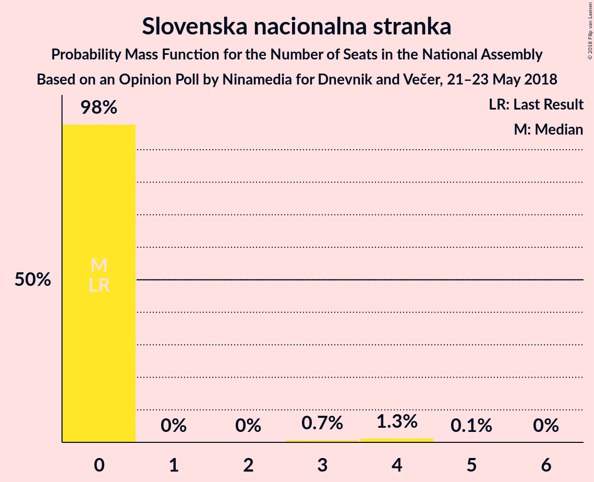
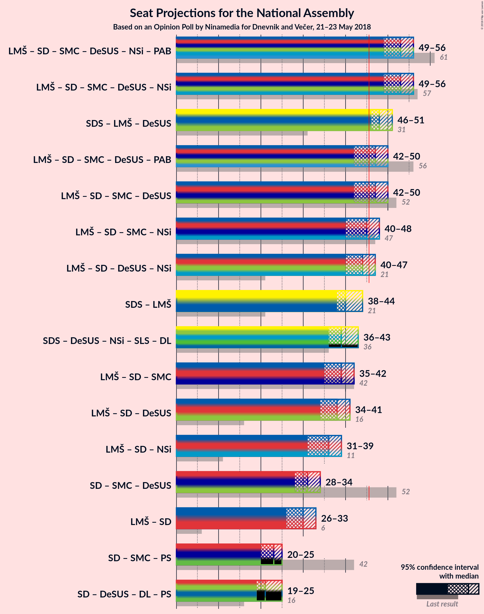

# Opinion Poll by Ninamedia for Dnevnik and Večer, 21–23 May 2018

<a href="#voting-intentions">Voting Intentions</a> | <a href="#seats">Seats</a> | <a href="#coalitions">Coalitions</a> | <a href="#technical-information">Technical Information</a>

## Voting Intentions

### Confidence Intervals

| Party | Last Result | Poll Result | 80% Confidence Interval | 90% Confidence Interval | 95% Confidence Interval | 99% Confidence Interval |
|:-----:|:-----------:|:-----------:|:-----------------------:|:-----------------------:|:-----------------------:|:-----------------------:|
| Slovenska demokratska stranka | 20.7% | 26.4% | 24.0–28.9% |23.4–29.6% |22.8–30.3% |21.7–31.5% |
| Lista Marjana Šarca | 0.0% | 16.2% | 14.3–18.4% |13.8–19.0% |13.3–19.6% |12.4–20.7% |
| Socialni demokrati | 6.0% | 14.3% | 12.5–16.4% |12.0–17.0% |11.6–17.6% |10.8–18.6% |
| Stranka modernega centra | 34.5% | 9.4% | 8.0–11.2% |7.6–11.8% |7.2–12.2% |6.6–13.1% |
| Demokratična stranka upokojencev Slovenije | 10.2% | 8.3% | 6.9–10.0% |6.6–10.5% |6.2–10.9% |5.6–11.8% |
| Levica | 6.0% | 7.7% | 6.4–9.4% |6.1–9.9% |5.7–10.3% |5.2–11.2% |
| Nova Slovenija–Krščanski demokrati | 5.6% | 6.6% | 5.4–8.2% |5.1–8.6% |4.8–9.0% |4.3–9.9% |
| Slovenska nacionalna stranka | 2.2% | 2.6% | 1.9–3.8% |1.7–4.1% |1.6–4.4% |1.3–5.0% |
| Slovenska ljudska stranka | 4.0% | 2.1% | 1.5–3.1% |1.3–3.4% |1.2–3.7% |0.9–4.2% |
| Stranka Alenke Bratušek | 4.4% | 1.7% | 1.2–2.7% |1.0–2.9% |0.9–3.2% |0.7–3.7% |
| Glas za otroke in družine–Nova ljudska stranka Slovenije | 0.0% | 0.2% | 0.1–0.7% |0.1–0.9% |0.0–1.1% |0.0–1.4% |

*Note:* The poll result column reflects the actual value used in the calculations. Published results may vary slightly, and in addition be rounded to fewer digits.

## Seats

### Confidence Intervals

| Party | Last Result | Median | 80% Confidence Interval | 90% Confidence Interval | 95% Confidence Interval | 99% Confidence Interval |
|:-----:|:-----------:|:------:|:-----------------------:|:-----------------------:|:-----------------------:|:-----------------------:|
| <a href="#slovenska-demokratska-stranka">Slovenska demokratska stranka</a> | 21 | 24 | 24–26 |23–26 |23–28 |22–30 |
| <a href="#lista-marjana-šarca">Lista Marjana Šarca</a> | 0 | 16 | 14–18 |14–18 |13–18 |12–19 |
| <a href="#socialni-demokrati">Socialni demokrati</a> | 6 | 14 | 12–15 |11–16 |11–16 |10–18 |
| <a href="#stranka-modernega-centra">Stranka modernega centra</a> | 36 | 9 | 8–11 |8–11 |7–11 |6–12 |
| <a href="#demokratična-stranka-upokojencev-slovenije">Demokratična stranka upokojencev Slovenije</a> | 10 | 8 | 6–9 |6–10 |6–10 |5–11 |
| <a href="#levica">Levica</a> | 6 | 8 | 6–8 |6–8 |6–9 |5–10 |
| <a href="#nova-slovenija–krščanski-demokrati">Nova Slovenija–Krščanski demokrati</a> | 5 | 6 | 5–7 |5–7 |5–8 |4–9 |
| <a href="#slovenska-nacionalna-stranka">Slovenska nacionalna stranka</a> | 0 | 0 | 0 |0 |0 |0–4 |
| <a href="#slovenska-ljudska-stranka">Slovenska ljudska stranka</a> | 0 | 0 | 0 |0 |0 |0 |
| <a href="#stranka-alenke-bratušek">Stranka Alenke Bratušek</a> | 4 | 0 | 0 |0 |0 |0 |
| <a href="#glas-za-otroke-in-družine–nova-ljudska-stranka-slovenije">Glas za otroke in družine–Nova ljudska stranka Slovenije</a> | 0 | 0 | 0 |0 |0 |0 |

### Slovenska demokratska stranka

*For a full overview of the results for this party, see the [Slovenska demokratska stranka](party-slovenskademokratskastranka.html) page.*

| Number of Seats | Probability | Accumulated | Special Marks |
|:---------------:|:-----------:|:-----------:|:-------------:|
| 20 | 0.1% | 100% |  |
| 21 | 0.4% | 99.9% | Last Result |
| 22 | 1.3% | 99.6% |  |
| 23 | 7% | 98% |  |
| 24 | 43% | 91% | Median |
| 25 | 15% | 48% |  |
| 26 | 28% | 33% |  |
| 27 | 2% | 5% |  |
| 28 | 1.4% | 3% |  |
| 29 | 0.9% | 2% |  |
| 30 | 0.2% | 0.6% |  |
| 31 | 0.2% | 0.4% |  |
| 32 | 0.2% | 0.2% |  |
| 33 | 0% | 0% |  |

### Lista Marjana Šarca

*For a full overview of the results for this party, see the [Lista Marjana Šarca](party-listamarjanašarca.html) page.*

| Number of Seats | Probability | Accumulated | Special Marks |
|:---------------:|:-----------:|:-----------:|:-------------:|
| 0 | 0% | 100% | Last Result |
| 1 | 0% | 100% |  |
| 2 | 0% | 100% |  |
| 3 | 0% | 100% |  |
| 4 | 0% | 100% |  |
| 5 | 0% | 100% |  |
| 6 | 0% | 100% |  |
| 7 | 0% | 100% |  |
| 8 | 0% | 100% |  |
| 9 | 0% | 100% |  |
| 10 | 0% | 100% |  |
| 11 | 0.1% | 100% |  |
| 12 | 0.9% | 99.9% |  |
| 13 | 4% | 99.0% |  |
| 14 | 7% | 95% |  |
| 15 | 32% | 88% |  |
| 16 | 12% | 57% | Median |
| 17 | 32% | 45% |  |
| 18 | 12% | 13% |  |
| 19 | 1.3% | 1.4% |  |
| 20 | 0.1% | 0.2% |  |
| 21 | 0.1% | 0.1% |  |
| 22 | 0% | 0% |  |

### Socialni demokrati

*For a full overview of the results for this party, see the [Socialni demokrati](party-socialnidemokrati.html) page.*

| Number of Seats | Probability | Accumulated | Special Marks |
|:---------------:|:-----------:|:-----------:|:-------------:|
| 6 | 0% | 100% | Last Result |
| 7 | 0% | 100% |  |
| 8 | 0% | 100% |  |
| 9 | 0% | 100% |  |
| 10 | 0.5% | 100% |  |
| 11 | 8% | 99.4% |  |
| 12 | 6% | 91% |  |
| 13 | 33% | 85% |  |
| 14 | 37% | 52% | Median |
| 15 | 7% | 16% |  |
| 16 | 7% | 9% |  |
| 17 | 2% | 2% |  |
| 18 | 0.5% | 0.5% |  |
| 19 | 0% | 0.1% |  |
| 20 | 0% | 0% |  |

### Stranka modernega centra

*For a full overview of the results for this party, see the [Stranka modernega centra](party-strankamodernegacentra.html) page.*

| Number of Seats | Probability | Accumulated | Special Marks |
|:---------------:|:-----------:|:-----------:|:-------------:|
| 6 | 1.4% | 100% |  |
| 7 | 3% | 98.5% |  |
| 8 | 12% | 96% |  |
| 9 | 42% | 84% | Median |
| 10 | 32% | 42% |  |
| 11 | 9% | 10% |  |
| 12 | 0.7% | 0.9% |  |
| 13 | 0.1% | 0.2% |  |
| 14 | 0% | 0% |  |
| 15 | 0% | 0% |  |
| 16 | 0% | 0% |  |
| 17 | 0% | 0% |  |
| 18 | 0% | 0% |  |
| 19 | 0% | 0% |  |
| 20 | 0% | 0% |  |
| 21 | 0% | 0% |  |
| 22 | 0% | 0% |  |
| 23 | 0% | 0% |  |
| 24 | 0% | 0% |  |
| 25 | 0% | 0% |  |
| 26 | 0% | 0% |  |
| 27 | 0% | 0% |  |
| 28 | 0% | 0% |  |
| 29 | 0% | 0% |  |
| 30 | 0% | 0% |  |
| 31 | 0% | 0% |  |
| 32 | 0% | 0% |  |
| 33 | 0% | 0% |  |
| 34 | 0% | 0% |  |
| 35 | 0% | 0% |  |
| 36 | 0% | 0% | Last Result |

### Demokratična stranka upokojencev Slovenije

*For a full overview of the results for this party, see the [Demokratična stranka upokojencev Slovenije](party-demokratičnastrankaupokojencevslovenije.html) page.*

| Number of Seats | Probability | Accumulated | Special Marks |
|:---------------:|:-----------:|:-----------:|:-------------:|
| 5 | 0.6% | 100% |  |
| 6 | 11% | 99.3% |  |
| 7 | 15% | 89% |  |
| 8 | 38% | 74% | Median |
| 9 | 31% | 36% |  |
| 10 | 3% | 5% | Last Result |
| 11 | 2% | 2% |  |
| 12 | 0.1% | 0.1% |  |
| 13 | 0% | 0% |  |

### Levica

*For a full overview of the results for this party, see the [Levica](party-levica.html) page.*

| Number of Seats | Probability | Accumulated | Special Marks |
|:---------------:|:-----------:|:-----------:|:-------------:|
| 4 | 0.4% | 100% |  |
| 5 | 1.3% | 99.6% |  |
| 6 | 36% | 98% | Last Result |
| 7 | 12% | 62% |  |
| 8 | 46% | 51% | Median |
| 9 | 3% | 5% |  |
| 10 | 1.4% | 2% |  |
| 11 | 0.2% | 0.2% |  |
| 12 | 0% | 0% |  |

### Nova Slovenija–Krščanski demokrati

*For a full overview of the results for this party, see the [Nova Slovenija–Krščanski demokrati](party-novaslovenija–krščanskidemokrati.html) page.*

| Number of Seats | Probability | Accumulated | Special Marks |
|:---------------:|:-----------:|:-----------:|:-------------:|
| 0 | 0.1% | 100% |  |
| 1 | 0% | 99.9% |  |
| 2 | 0% | 99.9% |  |
| 3 | 0% | 99.9% |  |
| 4 | 2% | 99.9% |  |
| 5 | 14% | 98% | Last Result |
| 6 | 64% | 83% | Median |
| 7 | 15% | 19% |  |
| 8 | 3% | 4% |  |
| 9 | 0.4% | 0.5% |  |
| 10 | 0.1% | 0.1% |  |
| 11 | 0% | 0% |  |

### Slovenska nacionalna stranka

*For a full overview of the results for this party, see the [Slovenska nacionalna stranka](party-slovenskanacionalnastranka.html) page.*

| Number of Seats | Probability | Accumulated | Special Marks |
|:---------------:|:-----------:|:-----------:|:-------------:|
| 0 | 98% | 100% | Last Result, Median |
| 1 | 0% | 2% |  |
| 2 | 0% | 2% |  |
| 3 | 0.7% | 2% |  |
| 4 | 1.3% | 1.4% |  |
| 5 | 0.1% | 0.1% |  |
| 6 | 0% | 0% |  |

### Slovenska ljudska stranka

*For a full overview of the results for this party, see the [Slovenska ljudska stranka](party-slovenskaljudskastranka.html) page.*

| Number of Seats | Probability | Accumulated | Special Marks |
|:---------------:|:-----------:|:-----------:|:-------------:|
| 0 | 99.7% | 100% | Last Result, Median |
| 1 | 0% | 0.3% |  |
| 2 | 0% | 0.3% |  |
| 3 | 0.1% | 0.3% |  |
| 4 | 0.3% | 0.3% |  |
| 5 | 0% | 0% |  |

### Stranka Alenke Bratušek

*For a full overview of the results for this party, see the [Stranka Alenke Bratušek](party-strankaalenkebratušek.html) page.*

| Number of Seats | Probability | Accumulated | Special Marks |
|:---------------:|:-----------:|:-----------:|:-------------:|
| 0 | 99.9% | 100% | Median |
| 1 | 0% | 0.1% |  |
| 2 | 0% | 0.1% |  |
| 3 | 0% | 0.1% |  |
| 4 | 0.1% | 0.1% | Last Result |
| 5 | 0% | 0% |  |

### Glas za otroke in družine–Nova ljudska stranka Slovenije

*For a full overview of the results for this party, see the [Glas za otroke in družine–Nova ljudska stranka Slovenije](party-glaszaotrokeindružine–novaljudskastrankaslovenije.html) page.*

| Number of Seats | Probability | Accumulated | Special Marks |
|:---------------:|:-----------:|:-----------:|:-------------:|
| 0 | 100% | 100% | Last Result, Median |

## Coalitions

### Confidence Intervals

| Coalition | Last Result | Median | Majority? | 80% Confidence Interval | 90% Confidence Interval | 95% Confidence Interval | 99% Confidence Interval |
|:---------:|:-----------:|:------:|:---------:|:-----------------------:|:-----------------------:|:-----------------------:|:-----------------------:|
| Lista Marjana Šarca – Socialni demokrati – Stranka modernega centra – Demokratična stranka upokojencev Slovenije – Nova Slovenija–Krščanski demokrati | 57 | 53 | 99.9% | 50–54 | 49–56 | 49–56 | 47–58 |
| Slovenska demokratska stranka – Lista Marjana Šarca – Demokratična stranka upokojencev Slovenije | 31 | 48 | 98% | 47–51 | 46–51 | 46–51 | 44–53 |
| Lista Marjana Šarca – Socialni demokrati – Stranka modernega centra – Demokratična stranka upokojencev Slovenije – Stranka Alenke Bratušek | 56 | 47 | 84% | 44–48 | 44–50 | 42–50 | 40–51 |
| Lista Marjana Šarca – Socialni demokrati – Stranka modernega centra – Demokratična stranka upokojencev Slovenije | 52 | 47 | 83% | 44–48 | 44–50 | 42–50 | 40–51 |
| Lista Marjana Šarca – Socialni demokrati – Stranka modernega centra – Nova Slovenija–Krščanski demokrati | 47 | 45 | 45% | 42–48 | 41–48 | 40–48 | 39–51 |
| Lista Marjana Šarca – Socialni demokrati – Demokratična stranka upokojencev Slovenije – Nova Slovenija–Krščanski demokrati | 21 | 44 | 8% | 41–45 | 41–46 | 40–47 | 38–49 |
| Slovenska demokratska stranka – Lista Marjana Šarca | 21 | 40 | 0.5% | 39–43 | 38–43 | 38–44 | 36–45 |
| Lista Marjana Šarca – Socialni demokrati – Stranka modernega centra | 42 | 39 | 0% | 36–41 | 35–41 | 35–42 | 33–44 |
| Lista Marjana Šarca – Socialni demokrati – Demokratična stranka upokojencev Slovenije | 16 | 38 | 0% | 35–39 | 35–40 | 34–41 | 32–42 |
| Lista Marjana Šarca – Socialni demokrati – Nova Slovenija–Krščanski demokrati | 11 | 36 | 0% | 33–39 | 32–39 | 31–39 | 31–41 |
| Socialni demokrati – Stranka modernega centra – Demokratična stranka upokojencev Slovenije | 52 | 31 | 0% | 29–33 | 28–34 | 28–34 | 26–35 |
| Lista Marjana Šarca – Socialni demokrati | 6 | 30 | 0% | 27–32 | 26–32 | 26–33 | 25–34 |

### Lista Marjana Šarca – Socialni demokrati – Stranka modernega centra – Demokratična stranka upokojencev Slovenije – Nova Slovenija–Krščanski demokrati

| Number of Seats | Probability | Accumulated | Special Marks |
|:---------------:|:-----------:|:-----------:|:-------------:|
| 45 | 0.1% | 100% |  |
| 46 | 0.4% | 99.9% | Majority |
| 47 | 0.9% | 99.5% |  |
| 48 | 1.1% | 98.6% |  |
| 49 | 3% | 98% |  |
| 50 | 7% | 95% |  |
| 51 | 6% | 88% |  |
| 52 | 10% | 81% |  |
| 53 | 26% | 71% | Median |
| 54 | 36% | 45% |  |
| 55 | 3% | 9% |  |
| 56 | 5% | 7% |  |
| 57 | 1.0% | 2% | Last Result |
| 58 | 0.9% | 1.0% |  |
| 59 | 0% | 0.1% |  |
| 60 | 0% | 0% |  |

### Slovenska demokratska stranka – Lista Marjana Šarca – Demokratična stranka upokojencev Slovenije

| Number of Seats | Probability | Accumulated | Special Marks |
|:---------------:|:-----------:|:-----------:|:-------------:|
| 31 | 0% | 100% | Last Result |
| 32 | 0% | 100% |  |
| 33 | 0% | 100% |  |
| 34 | 0% | 100% |  |
| 35 | 0% | 100% |  |
| 36 | 0% | 100% |  |
| 37 | 0% | 100% |  |
| 38 | 0% | 100% |  |
| 39 | 0% | 100% |  |
| 40 | 0% | 100% |  |
| 41 | 0.1% | 100% |  |
| 42 | 0.1% | 99.9% |  |
| 43 | 0.2% | 99.8% |  |
| 44 | 0.5% | 99.5% |  |
| 45 | 0.6% | 99.0% |  |
| 46 | 7% | 98% | Majority |
| 47 | 9% | 91% |  |
| 48 | 34% | 82% | Median |
| 49 | 14% | 47% |  |
| 50 | 4% | 34% |  |
| 51 | 28% | 30% |  |
| 52 | 0.7% | 2% |  |
| 53 | 1.3% | 2% |  |
| 54 | 0.2% | 0.3% |  |
| 55 | 0.1% | 0.1% |  |
| 56 | 0% | 0.1% |  |
| 57 | 0% | 0% |  |

### Lista Marjana Šarca – Socialni demokrati – Stranka modernega centra – Demokratična stranka upokojencev Slovenije – Stranka Alenke Bratušek

| Number of Seats | Probability | Accumulated | Special Marks |
|:---------------:|:-----------:|:-----------:|:-------------:|
| 38 | 0.1% | 100% |  |
| 39 | 0.2% | 99.9% |  |
| 40 | 0.3% | 99.8% |  |
| 41 | 0.9% | 99.5% |  |
| 42 | 2% | 98.6% |  |
| 43 | 1.2% | 97% |  |
| 44 | 7% | 96% |  |
| 45 | 5% | 89% |  |
| 46 | 7% | 84% | Majority |
| 47 | 41% | 76% | Median |
| 48 | 27% | 36% |  |
| 49 | 3% | 9% |  |
| 50 | 5% | 6% |  |
| 51 | 1.4% | 2% |  |
| 52 | 0.1% | 0.2% |  |
| 53 | 0% | 0% |  |
| 54 | 0% | 0% |  |
| 55 | 0% | 0% |  |
| 56 | 0% | 0% | Last Result |

### Lista Marjana Šarca – Socialni demokrati – Stranka modernega centra – Demokratična stranka upokojencev Slovenije

| Number of Seats | Probability | Accumulated | Special Marks |
|:---------------:|:-----------:|:-----------:|:-------------:|
| 38 | 0.1% | 100% |  |
| 39 | 0.2% | 99.9% |  |
| 40 | 0.3% | 99.8% |  |
| 41 | 0.9% | 99.5% |  |
| 42 | 2% | 98.6% |  |
| 43 | 1.2% | 97% |  |
| 44 | 7% | 96% |  |
| 45 | 5% | 89% |  |
| 46 | 7% | 83% | Majority |
| 47 | 41% | 76% | Median |
| 48 | 27% | 36% |  |
| 49 | 3% | 9% |  |
| 50 | 5% | 6% |  |
| 51 | 1.4% | 2% |  |
| 52 | 0.1% | 0.2% | Last Result |
| 53 | 0% | 0% |  |

### Lista Marjana Šarca – Socialni demokrati – Stranka modernega centra – Nova Slovenija–Krščanski demokrati

| Number of Seats | Probability | Accumulated | Special Marks |
|:---------------:|:-----------:|:-----------:|:-------------:|
| 38 | 0.2% | 100% |  |
| 39 | 0.7% | 99.8% |  |
| 40 | 2% | 99.0% |  |
| 41 | 5% | 97% |  |
| 42 | 6% | 92% |  |
| 43 | 6% | 86% |  |
| 44 | 24% | 80% |  |
| 45 | 11% | 56% | Median |
| 46 | 27% | 45% | Majority |
| 47 | 7% | 18% | Last Result |
| 48 | 9% | 12% |  |
| 49 | 0.9% | 2% |  |
| 50 | 0.5% | 1.3% |  |
| 51 | 0.8% | 0.8% |  |
| 52 | 0% | 0% |  |

### Lista Marjana Šarca – Socialni demokrati – Demokratična stranka upokojencev Slovenije – Nova Slovenija–Krščanski demokrati

| Number of Seats | Probability | Accumulated | Special Marks |
|:---------------:|:-----------:|:-----------:|:-------------:|
| 21 | 0% | 100% | Last Result |
| 22 | 0% | 100% |  |
| 23 | 0% | 100% |  |
| 24 | 0% | 100% |  |
| 25 | 0% | 100% |  |
| 26 | 0% | 100% |  |
| 27 | 0% | 100% |  |
| 28 | 0% | 100% |  |
| 29 | 0% | 100% |  |
| 30 | 0% | 100% |  |
| 31 | 0% | 100% |  |
| 32 | 0% | 100% |  |
| 33 | 0% | 100% |  |
| 34 | 0% | 100% |  |
| 35 | 0% | 100% |  |
| 36 | 0.1% | 100% |  |
| 37 | 0.1% | 99.9% |  |
| 38 | 0.6% | 99.8% |  |
| 39 | 2% | 99.3% |  |
| 40 | 2% | 98% |  |
| 41 | 8% | 96% |  |
| 42 | 13% | 88% |  |
| 43 | 2% | 75% |  |
| 44 | 52% | 73% | Median |
| 45 | 13% | 21% |  |
| 46 | 5% | 8% | Majority |
| 47 | 1.4% | 3% |  |
| 48 | 1.3% | 2% |  |
| 49 | 0.5% | 0.6% |  |
| 50 | 0.1% | 0.1% |  |
| 51 | 0% | 0% |  |

### Slovenska demokratska stranka – Lista Marjana Šarca

| Number of Seats | Probability | Accumulated | Special Marks |
|:---------------:|:-----------:|:-----------:|:-------------:|
| 21 | 0% | 100% | Last Result |
| 22 | 0% | 100% |  |
| 23 | 0% | 100% |  |
| 24 | 0% | 100% |  |
| 25 | 0% | 100% |  |
| 26 | 0% | 100% |  |
| 27 | 0% | 100% |  |
| 28 | 0% | 100% |  |
| 29 | 0% | 100% |  |
| 30 | 0% | 100% |  |
| 31 | 0% | 100% |  |
| 32 | 0% | 100% |  |
| 33 | 0% | 100% |  |
| 34 | 0.1% | 100% |  |
| 35 | 0.2% | 99.8% |  |
| 36 | 0.5% | 99.6% |  |
| 37 | 1.2% | 99.1% |  |
| 38 | 6% | 98% |  |
| 39 | 24% | 92% |  |
| 40 | 20% | 68% | Median |
| 41 | 7% | 48% |  |
| 42 | 12% | 42% |  |
| 43 | 26% | 30% |  |
| 44 | 3% | 3% |  |
| 45 | 0.2% | 0.7% |  |
| 46 | 0.4% | 0.5% | Majority |
| 47 | 0.1% | 0.1% |  |
| 48 | 0% | 0.1% |  |
| 49 | 0% | 0% |  |

### Lista Marjana Šarca – Socialni demokrati – Stranka modernega centra

| Number of Seats | Probability | Accumulated | Special Marks |
|:---------------:|:-----------:|:-----------:|:-------------:|
| 31 | 0.1% | 100% |  |
| 32 | 0.2% | 99.9% |  |
| 33 | 0.7% | 99.7% |  |
| 34 | 1.2% | 99.0% |  |
| 35 | 6% | 98% |  |
| 36 | 4% | 91% |  |
| 37 | 7% | 88% |  |
| 38 | 24% | 80% |  |
| 39 | 8% | 57% | Median |
| 40 | 31% | 48% |  |
| 41 | 13% | 18% |  |
| 42 | 3% | 4% | Last Result |
| 43 | 0.8% | 2% |  |
| 44 | 0.9% | 1.0% |  |
| 45 | 0% | 0.1% |  |
| 46 | 0% | 0% | Majority |

### Lista Marjana Šarca – Socialni demokrati – Demokratična stranka upokojencev Slovenije

| Number of Seats | Probability | Accumulated | Special Marks |
|:---------------:|:-----------:|:-----------:|:-------------:|
| 16 | 0% | 100% | Last Result |
| 17 | 0% | 100% |  |
| 18 | 0% | 100% |  |
| 19 | 0% | 100% |  |
| 20 | 0% | 100% |  |
| 21 | 0% | 100% |  |
| 22 | 0% | 100% |  |
| 23 | 0% | 100% |  |
| 24 | 0% | 100% |  |
| 25 | 0% | 100% |  |
| 26 | 0% | 100% |  |
| 27 | 0% | 100% |  |
| 28 | 0% | 100% |  |
| 29 | 0% | 100% |  |
| 30 | 0.1% | 100% |  |
| 31 | 0.2% | 99.9% |  |
| 32 | 0.5% | 99.7% |  |
| 33 | 1.1% | 99.2% |  |
| 34 | 1.2% | 98% |  |
| 35 | 8% | 97% |  |
| 36 | 11% | 89% |  |
| 37 | 5% | 78% |  |
| 38 | 56% | 72% | Median |
| 39 | 9% | 16% |  |
| 40 | 3% | 7% |  |
| 41 | 3% | 4% |  |
| 42 | 0.6% | 0.7% |  |
| 43 | 0.1% | 0.1% |  |
| 44 | 0% | 0.1% |  |
| 45 | 0% | 0% |  |

### Lista Marjana Šarca – Socialni demokrati – Nova Slovenija–Krščanski demokrati

| Number of Seats | Probability | Accumulated | Special Marks |
|:---------------:|:-----------:|:-----------:|:-------------:|
| 11 | 0% | 100% | Last Result |
| 12 | 0% | 100% |  |
| 13 | 0% | 100% |  |
| 14 | 0% | 100% |  |
| 15 | 0% | 100% |  |
| 16 | 0% | 100% |  |
| 17 | 0% | 100% |  |
| 18 | 0% | 100% |  |
| 19 | 0% | 100% |  |
| 20 | 0% | 100% |  |
| 21 | 0% | 100% |  |
| 22 | 0% | 100% |  |
| 23 | 0% | 100% |  |
| 24 | 0% | 100% |  |
| 25 | 0% | 100% |  |
| 26 | 0% | 100% |  |
| 27 | 0% | 100% |  |
| 28 | 0% | 100% |  |
| 29 | 0.1% | 100% |  |
| 30 | 0.3% | 99.9% |  |
| 31 | 2% | 99.6% |  |
| 32 | 6% | 97% |  |
| 33 | 6% | 92% |  |
| 34 | 9% | 85% |  |
| 35 | 23% | 77% |  |
| 36 | 29% | 53% | Median |
| 37 | 9% | 24% |  |
| 38 | 3% | 15% |  |
| 39 | 10% | 12% |  |
| 40 | 1.0% | 2% |  |
| 41 | 0.9% | 1.1% |  |
| 42 | 0.1% | 0.2% |  |
| 43 | 0.1% | 0.1% |  |
| 44 | 0% | 0% |  |

### Socialni demokrati – Stranka modernega centra – Demokratična stranka upokojencev Slovenije

| Number of Seats | Probability | Accumulated | Special Marks |
|:---------------:|:-----------:|:-----------:|:-------------:|
| 24 | 0.1% | 100% |  |
| 25 | 0.1% | 99.9% |  |
| 26 | 0.3% | 99.8% |  |
| 27 | 2% | 99.5% |  |
| 28 | 3% | 98% |  |
| 29 | 15% | 94% |  |
| 30 | 10% | 79% |  |
| 31 | 35% | 70% | Median |
| 32 | 24% | 35% |  |
| 33 | 5% | 11% |  |
| 34 | 5% | 6% |  |
| 35 | 1.1% | 1.4% |  |
| 36 | 0.2% | 0.3% |  |
| 37 | 0% | 0.1% |  |
| 38 | 0% | 0% |  |
| 39 | 0% | 0% |  |
| 40 | 0% | 0% |  |
| 41 | 0% | 0% |  |
| 42 | 0% | 0% |  |
| 43 | 0% | 0% |  |
| 44 | 0% | 0% |  |
| 45 | 0% | 0% |  |
| 46 | 0% | 0% | Majority |
| 47 | 0% | 0% |  |
| 48 | 0% | 0% |  |
| 49 | 0% | 0% |  |
| 50 | 0% | 0% |  |
| 51 | 0% | 0% |  |
| 52 | 0% | 0% | Last Result |

### Lista Marjana Šarca – Socialni demokrati

| Number of Seats | Probability | Accumulated | Special Marks |
|:---------------:|:-----------:|:-----------:|:-------------:|
| 6 | 0% | 100% | Last Result |
| 7 | 0% | 100% |  |
| 8 | 0% | 100% |  |
| 9 | 0% | 100% |  |
| 10 | 0% | 100% |  |
| 11 | 0% | 100% |  |
| 12 | 0% | 100% |  |
| 13 | 0% | 100% |  |
| 14 | 0% | 100% |  |
| 15 | 0% | 100% |  |
| 16 | 0% | 100% |  |
| 17 | 0% | 100% |  |
| 18 | 0% | 100% |  |
| 19 | 0% | 100% |  |
| 20 | 0% | 100% |  |
| 21 | 0% | 100% |  |
| 22 | 0% | 100% |  |
| 23 | 0.1% | 100% |  |
| 24 | 0.3% | 99.9% |  |
| 25 | 1.1% | 99.6% |  |
| 26 | 6% | 98% |  |
| 27 | 6% | 92% |  |
| 28 | 9% | 86% |  |
| 29 | 24% | 77% |  |
| 30 | 31% | 53% | Median |
| 31 | 3% | 22% |  |
| 32 | 15% | 19% |  |
| 33 | 2% | 4% |  |
| 34 | 2% | 2% |  |
| 35 | 0.4% | 0.4% |  |
| 36 | 0% | 0.1% |  |
| 37 | 0% | 0% |  |

## Technical Information

### Opinion Poll

+ **Polling firm:** Ninamedia
+ **Commissioner(s):** Dnevnik and Večer
+ **Fieldwork period:** 21–23 May 2018

### Calculations

+ **Sample size:** 531
+ **Simulations done:** 1,048,576
+ **Error estimate:** 2.10%

