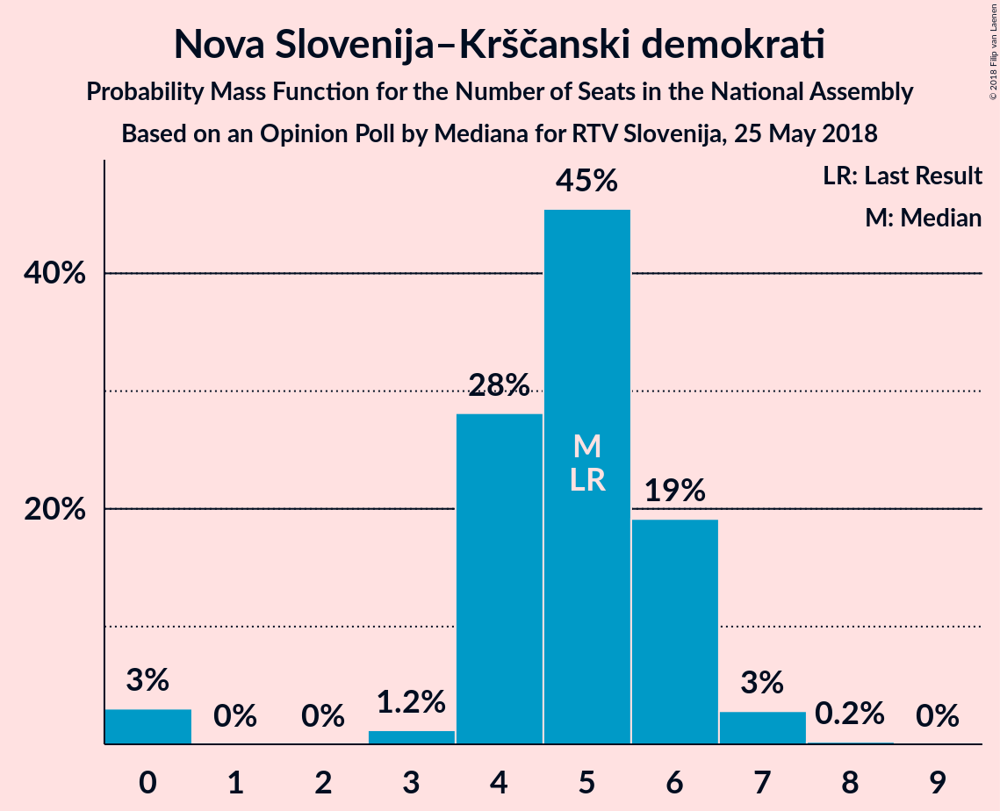
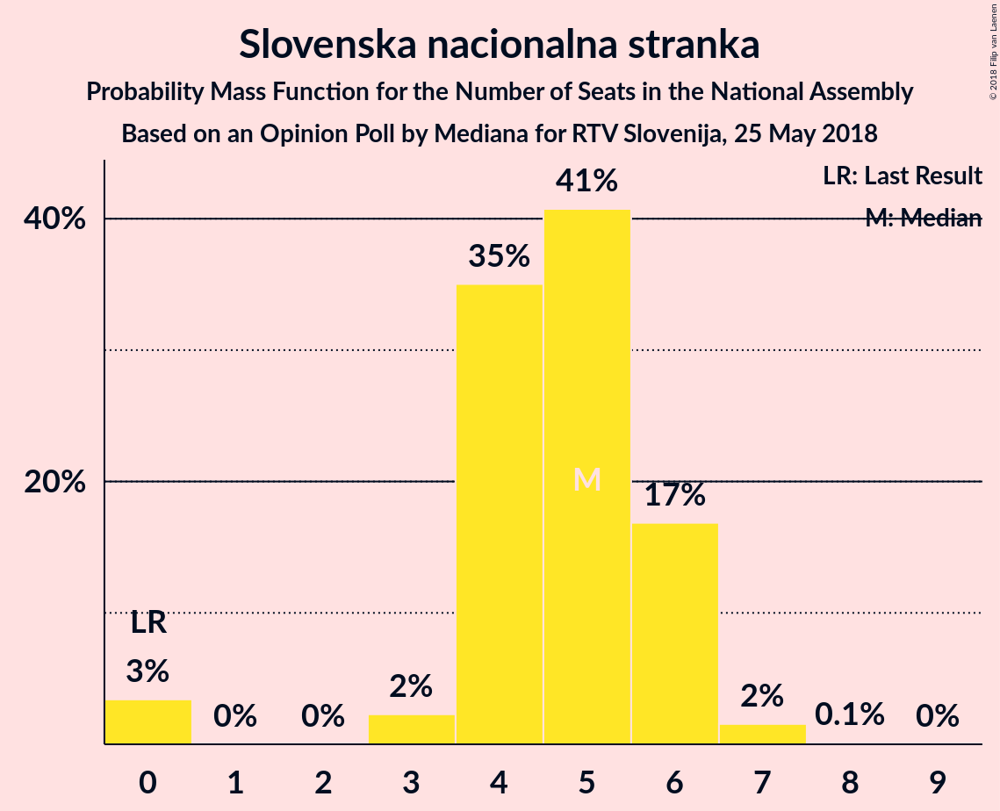

# Opinion Poll by Mediana for RTV Slovenija, 25 May 2018

<a href="#voting-intentions">Voting Intentions</a> | <a href="#seats">Seats</a> | <a href="#coalitions">Coalitions</a> | <a href="#technical-information">Technical Information</a>

## Voting Intentions

### Confidence Intervals

| Party | Last Result | Poll Result | 80% Confidence Interval | 90% Confidence Interval | 95% Confidence Interval | 99% Confidence Interval |
|:-----:|:-----------:|:-----------:|:-----------------------:|:-----------------------:|:-----------------------:|:-----------------------:|
| Slovenska demokratska stranka | 20.7% | 23.2% | 21.2–25.3% |20.7–25.9% |20.2–26.4% |19.4–27.4% |
| Lista Marjana Šarca | 0.0% | 16.0% | 14.4–17.9% |13.9–18.4% |13.5–18.9% |12.8–19.8% |
| Socialni demokrati | 6.0% | 7.4% | 6.3–8.9% |6.0–9.3% |5.7–9.6% |5.3–10.3% |
| Stranka modernega centra | 34.5% | 6.6% | 5.6–8.0% |5.3–8.3% |5.0–8.7% |4.6–9.4% |
| Demokratična stranka upokojencev Slovenije | 10.2% | 6.5% | 5.4–7.8% |5.2–8.2% |4.9–8.5% |4.5–9.2% |
| Levica | 6.0% | 6.3% | 5.3–7.7% |5.0–8.0% |4.8–8.4% |4.3–9.0% |
| Nova Slovenija–Krščanski demokrati | 5.6% | 5.5% | 4.6–6.8% |4.3–7.1% |4.1–7.4% |3.7–8.1% |
| Slovenska nacionalna stranka | 2.2% | 5.2% | 4.3–6.5% |4.1–6.8% |3.8–7.1% |3.4–7.7% |
| Stranka Alenke Bratušek | 4.4% | 4.7% | 3.8–5.9% |3.6–6.2% |3.4–6.5% |3.0–7.1% |
| Slovenska ljudska stranka | 4.0% | 3.0% | 2.4–4.0% |2.2–4.3% |2.0–4.6% |1.7–5.1% |
| Glas za otroke in družine–Nova ljudska stranka Slovenije | 0.0% | 0.6% | 0.3–1.1% |0.3–1.3% |0.2–1.4% |0.1–1.7% |

*Note:* The poll result column reflects the actual value used in the calculations. Published results may vary slightly, and in addition be rounded to fewer digits.

## Seats

### Confidence Intervals

| Party | Last Result | Median | 80% Confidence Interval | 90% Confidence Interval | 95% Confidence Interval | 99% Confidence Interval |
|:-----:|:-----------:|:------:|:-----------------------:|:-----------------------:|:-----------------------:|:-----------------------:|
| <a href="#slovenska-demokratska-stranka">Slovenska demokratska stranka</a> | 21 | 22 | 20–24 |19–24 |18–25 |18–26 |
| <a href="#lista-marjana-šarca">Lista Marjana Šarca</a> | 0 | 15 | 13–16 |13–17 |12–18 |12–19 |
| <a href="#socialni-demokrati">Socialni demokrati</a> | 6 | 7 | 5–8 |5–8 |5–9 |5–9 |
| <a href="#stranka-modernega-centra">Stranka modernega centra</a> | 36 | 6 | 5–7 |5–7 |5–8 |4–9 |
| <a href="#demokratična-stranka-upokojencev-slovenije">Demokratična stranka upokojencev Slovenije</a> | 10 | 6 | 5–7 |4–7 |4–8 |4–8 |
| <a href="#levica">Levica</a> | 6 | 5 | 4–7 |4–7 |4–8 |4–8 |
| <a href="#nova-slovenija–krščanski-demokrati">Nova Slovenija–Krščanski demokrati</a> | 5 | 5 | 4–6 |3–6 |0–7 |0–7 |
| <a href="#slovenska-nacionalna-stranka">Slovenska nacionalna stranka</a> | 0 | 5 | 4–6 |3–6 |0–7 |0–7 |
| <a href="#stranka-alenke-bratušek">Stranka Alenke Bratušek</a> | 4 | 4 | 0–5 |0–5 |0–6 |0–6 |
| <a href="#slovenska-ljudska-stranka">Slovenska ljudska stranka</a> | 0 | 0 | 0–3 |0–3 |0–4 |0–4 |
| <a href="#glas-za-otroke-in-družine–nova-ljudska-stranka-slovenije">Glas za otroke in družine–Nova ljudska stranka Slovenije</a> | 0 | 0 | 0 |0 |0 |0 |

### Slovenska demokratska stranka

*For a full overview of the results for this party, see the [Slovenska demokratska stranka](party-slovenskademokratskastranka.html) page.*

| Number of Seats | Probability | Accumulated | Special Marks |
|:---------------:|:-----------:|:-----------:|:-------------:|
| 17 | 0.2% | 100% |  |
| 18 | 2% | 99.8% |  |
| 19 | 4% | 97% |  |
| 20 | 9% | 93% |  |
| 21 | 24% | 85% | Last Result |
| 22 | 23% | 61% | Median |
| 23 | 19% | 38% |  |
| 24 | 15% | 18% |  |
| 25 | 2% | 3% |  |
| 26 | 1.5% | 2% |  |
| 27 | 0.1% | 0.2% |  |
| 28 | 0% | 0.1% |  |
| 29 | 0% | 0% |  |

### Lista Marjana Šarca

*For a full overview of the results for this party, see the [Lista Marjana Šarca](party-listamarjanašarca.html) page.*

| Number of Seats | Probability | Accumulated | Special Marks |
|:---------------:|:-----------:|:-----------:|:-------------:|
| 0 | 0% | 100% | Last Result |
| 1 | 0% | 100% |  |
| 2 | 0% | 100% |  |
| 3 | 0% | 100% |  |
| 4 | 0% | 100% |  |
| 5 | 0% | 100% |  |
| 6 | 0% | 100% |  |
| 7 | 0% | 100% |  |
| 8 | 0% | 100% |  |
| 9 | 0% | 100% |  |
| 10 | 0% | 100% |  |
| 11 | 0.4% | 100% |  |
| 12 | 2% | 99.6% |  |
| 13 | 8% | 97% |  |
| 14 | 21% | 89% |  |
| 15 | 29% | 68% | Median |
| 16 | 30% | 39% |  |
| 17 | 6% | 9% |  |
| 18 | 2% | 3% |  |
| 19 | 1.5% | 2% |  |
| 20 | 0.1% | 0.1% |  |
| 21 | 0% | 0% |  |

### Socialni demokrati

*For a full overview of the results for this party, see the [Socialni demokrati](party-socialnidemokrati.html) page.*

| Number of Seats | Probability | Accumulated | Special Marks |
|:---------------:|:-----------:|:-----------:|:-------------:|
| 4 | 0.4% | 100% |  |
| 5 | 11% | 99.6% |  |
| 6 | 33% | 89% | Last Result |
| 7 | 40% | 56% | Median |
| 8 | 12% | 16% |  |
| 9 | 4% | 5% |  |
| 10 | 0.4% | 0.5% |  |
| 11 | 0% | 0% |  |

### Stranka modernega centra

*For a full overview of the results for this party, see the [Stranka modernega centra](party-strankamodernegacentra.html) page.*

| Number of Seats | Probability | Accumulated | Special Marks |
|:---------------:|:-----------:|:-----------:|:-------------:|
| 0 | 0.1% | 100% |  |
| 1 | 0% | 99.9% |  |
| 2 | 0% | 99.9% |  |
| 3 | 0% | 99.9% |  |
| 4 | 2% | 99.8% |  |
| 5 | 23% | 98% |  |
| 6 | 56% | 75% | Median |
| 7 | 14% | 19% |  |
| 8 | 4% | 5% |  |
| 9 | 0.6% | 0.6% |  |
| 10 | 0% | 0% |  |
| 11 | 0% | 0% |  |
| 12 | 0% | 0% |  |
| 13 | 0% | 0% |  |
| 14 | 0% | 0% |  |
| 15 | 0% | 0% |  |
| 16 | 0% | 0% |  |
| 17 | 0% | 0% |  |
| 18 | 0% | 0% |  |
| 19 | 0% | 0% |  |
| 20 | 0% | 0% |  |
| 21 | 0% | 0% |  |
| 22 | 0% | 0% |  |
| 23 | 0% | 0% |  |
| 24 | 0% | 0% |  |
| 25 | 0% | 0% |  |
| 26 | 0% | 0% |  |
| 27 | 0% | 0% |  |
| 28 | 0% | 0% |  |
| 29 | 0% | 0% |  |
| 30 | 0% | 0% |  |
| 31 | 0% | 0% |  |
| 32 | 0% | 0% |  |
| 33 | 0% | 0% |  |
| 34 | 0% | 0% |  |
| 35 | 0% | 0% |  |
| 36 | 0% | 0% | Last Result |

### Demokratična stranka upokojencev Slovenije

*For a full overview of the results for this party, see the [Demokratična stranka upokojencev Slovenije](party-demokratičnastrankaupokojencevslovenije.html) page.*

| Number of Seats | Probability | Accumulated | Special Marks |
|:---------------:|:-----------:|:-----------:|:-------------:|
| 0 | 0.2% | 100% |  |
| 1 | 0% | 99.8% |  |
| 2 | 0% | 99.8% |  |
| 3 | 0.1% | 99.8% |  |
| 4 | 8% | 99.7% |  |
| 5 | 20% | 92% |  |
| 6 | 30% | 71% | Median |
| 7 | 37% | 41% |  |
| 8 | 4% | 4% |  |
| 9 | 0.4% | 0.4% |  |
| 10 | 0% | 0% | Last Result |

### Levica

*For a full overview of the results for this party, see the [Levica](party-levica.html) page.*

| Number of Seats | Probability | Accumulated | Special Marks |
|:---------------:|:-----------:|:-----------:|:-------------:|
| 0 | 0.1% | 100% |  |
| 1 | 0% | 99.9% |  |
| 2 | 0% | 99.9% |  |
| 3 | 0% | 99.9% |  |
| 4 | 15% | 99.9% |  |
| 5 | 41% | 85% | Median |
| 6 | 25% | 44% | Last Result |
| 7 | 16% | 19% |  |
| 8 | 3% | 3% |  |
| 9 | 0.3% | 0.3% |  |
| 10 | 0% | 0% |  |

### Nova Slovenija–Krščanski demokrati

*For a full overview of the results for this party, see the [Nova Slovenija–Krščanski demokrati](party-novaslovenija–krščanskidemokrati.html) page.*

| Number of Seats | Probability | Accumulated | Special Marks |
|:---------------:|:-----------:|:-----------:|:-------------:|
| 0 | 3% | 100% |  |
| 1 | 0% | 97% |  |
| 2 | 0% | 97% |  |
| 3 | 2% | 97% |  |
| 4 | 21% | 95% |  |
| 5 | 48% | 73% | Last Result, Median |
| 6 | 22% | 26% |  |
| 7 | 3% | 4% |  |
| 8 | 0.2% | 0.2% |  |
| 9 | 0% | 0% |  |

### Slovenska nacionalna stranka

*For a full overview of the results for this party, see the [Slovenska nacionalna stranka](party-slovenskanacionalnastranka.html) page.*

| Number of Seats | Probability | Accumulated | Special Marks |
|:---------------:|:-----------:|:-----------:|:-------------:|
| 0 | 4% | 100% | Last Result |
| 1 | 0% | 96% |  |
| 2 | 0% | 96% |  |
| 3 | 4% | 96% |  |
| 4 | 29% | 92% |  |
| 5 | 40% | 63% | Median |
| 6 | 20% | 23% |  |
| 7 | 2% | 3% |  |
| 8 | 0.2% | 0.2% |  |
| 9 | 0% | 0% |  |

### Stranka Alenke Bratušek

*For a full overview of the results for this party, see the [Stranka Alenke Bratušek](party-strankaalenkebratušek.html) page.*

| Number of Seats | Probability | Accumulated | Special Marks |
|:---------------:|:-----------:|:-----------:|:-------------:|
| 0 | 36% | 100% |  |
| 1 | 0% | 64% |  |
| 2 | 0% | 64% |  |
| 3 | 3% | 64% |  |
| 4 | 36% | 61% | Last Result, Median |
| 5 | 20% | 25% |  |
| 6 | 4% | 4% |  |
| 7 | 0.2% | 0.2% |  |
| 8 | 0% | 0% |  |

### Slovenska ljudska stranka

*For a full overview of the results for this party, see the [Slovenska ljudska stranka](party-slovenskaljudskastranka.html) page.*

| Number of Seats | Probability | Accumulated | Special Marks |
|:---------------:|:-----------:|:-----------:|:-------------:|
| 0 | 89% | 100% | Last Result, Median |
| 1 | 0% | 11% |  |
| 2 | 0% | 11% |  |
| 3 | 8% | 11% |  |
| 4 | 3% | 4% |  |
| 5 | 0.3% | 0.3% |  |
| 6 | 0% | 0% |  |

### Glas za otroke in družine–Nova ljudska stranka Slovenije

*For a full overview of the results for this party, see the [Glas za otroke in družine–Nova ljudska stranka Slovenije](party-glaszaotrokeindružine–novaljudskastrankaslovenije.html) page.*

| Number of Seats | Probability | Accumulated | Special Marks |
|:---------------:|:-----------:|:-----------:|:-------------:|
| 0 | 100% | 100% | Last Result, Median |

## Coalitions

### Confidence Intervals

| Coalition | Last Result | Median | Majority? | 80% Confidence Interval | 90% Confidence Interval | 95% Confidence Interval | 99% Confidence Interval |
|:---------:|:-----------:|:------:|:---------:|:-----------------------:|:-----------------------:|:-----------------------:|:-----------------------:|
| Slovenska demokratska stranka – Lista Marjana Šarca – Demokratična stranka upokojencev Slovenije | 31 | 43 | 14% | 40–47 | 39–47 | 38–47 | 37–48 |
| Lista Marjana Šarca – Socialni demokrati – Stranka modernega centra – Demokratična stranka upokojencev Slovenije – Nova Slovenija–Krščanski demokrati – Stranka Alenke Bratušek | 61 | 41 | 3% | 39–44 | 38–45 | 38–46 | 35–47 |
| Lista Marjana Šarca – Socialni demokrati – Stranka modernega centra – Demokratična stranka upokojencev Slovenije – Nova Slovenija–Krščanski demokrati | 57 | 39 | 0% | 36–41 | 35–42 | 34–43 | 33–44 |
| Lista Marjana Šarca – Socialni demokrati – Stranka modernega centra – Demokratična stranka upokojencev Slovenije – Stranka Alenke Bratušek | 56 | 36 | 0% | 34–39 | 33–40 | 33–41 | 31–43 |
| Slovenska demokratska stranka – Lista Marjana Šarca | 21 | 37 | 0% | 35–40 | 34–40 | 33–40 | 32–42 |
| Lista Marjana Šarca – Socialni demokrati – Stranka modernega centra – Demokratična stranka upokojencev Slovenije | 52 | 34 | 0% | 32–36 | 30–37 | 30–37 | 29–39 |
| Lista Marjana Šarca – Socialni demokrati – Demokratična stranka upokojencev Slovenije – Nova Slovenija–Krščanski demokrati | 21 | 33 | 0% | 30–35 | 29–36 | 29–36 | 27–38 |
| Lista Marjana Šarca – Socialni demokrati – Stranka modernega centra – Nova Slovenija–Krščanski demokrati | 47 | 33 | 0% | 30–35 | 29–36 | 29–36 | 28–38 |
| Lista Marjana Šarca – Socialni demokrati – Demokratična stranka upokojencev Slovenije | 16 | 28 | 0% | 25–30 | 25–30 | 24–31 | 23–32 |
| Lista Marjana Šarca – Socialni demokrati – Stranka modernega centra | 42 | 28 | 0% | 26–30 | 25–31 | 24–31 | 23–32 |
| Lista Marjana Šarca – Socialni demokrati – Nova Slovenija–Krščanski demokrati | 11 | 27 | 0% | 24–29 | 24–30 | 23–30 | 22–32 |
| Lista Marjana Šarca – Socialni demokrati | 6 | 22 | 0% | 19–24 | 19–24 | 19–25 | 18–26 |
| Socialni demokrati – Stranka modernega centra – Demokratična stranka upokojencev Slovenije | 52 | 19 | 0% | 17–20 | 16–21 | 16–22 | 15–23 |

### Slovenska demokratska stranka – Lista Marjana Šarca – Demokratična stranka upokojencev Slovenije

| Number of Seats | Probability | Accumulated | Special Marks |
|:---------------:|:-----------:|:-----------:|:-------------:|
| 31 | 0% | 100% | Last Result |
| 32 | 0% | 100% |  |
| 33 | 0% | 100% |  |
| 34 | 0% | 100% |  |
| 35 | 0% | 100% |  |
| 36 | 0.1% | 100% |  |
| 37 | 0.5% | 99.9% |  |
| 38 | 2% | 99.4% |  |
| 39 | 2% | 97% |  |
| 40 | 6% | 95% |  |
| 41 | 11% | 89% |  |
| 42 | 20% | 78% |  |
| 43 | 14% | 59% | Median |
| 44 | 22% | 45% |  |
| 45 | 9% | 23% |  |
| 46 | 2% | 14% | Majority |
| 47 | 11% | 12% |  |
| 48 | 1.0% | 1.4% |  |
| 49 | 0.3% | 0.4% |  |
| 50 | 0.1% | 0.1% |  |
| 51 | 0% | 0% |  |

### Lista Marjana Šarca – Socialni demokrati – Stranka modernega centra – Demokratična stranka upokojencev Slovenije – Nova Slovenija–Krščanski demokrati – Stranka Alenke Bratušek

| Number of Seats | Probability | Accumulated | Special Marks |
|:---------------:|:-----------:|:-----------:|:-------------:|
| 33 | 0.1% | 100% |  |
| 34 | 0.1% | 99.9% |  |
| 35 | 0.5% | 99.8% |  |
| 36 | 0.6% | 99.4% |  |
| 37 | 0.7% | 98.7% |  |
| 38 | 5% | 98% |  |
| 39 | 5% | 93% |  |
| 40 | 21% | 88% |  |
| 41 | 19% | 66% |  |
| 42 | 20% | 48% |  |
| 43 | 11% | 27% | Median |
| 44 | 10% | 17% |  |
| 45 | 3% | 6% |  |
| 46 | 2% | 3% | Majority |
| 47 | 0.8% | 1.3% |  |
| 48 | 0.3% | 0.5% |  |
| 49 | 0.2% | 0.2% |  |
| 50 | 0% | 0% |  |
| 51 | 0% | 0% |  |
| 52 | 0% | 0% |  |
| 53 | 0% | 0% |  |
| 54 | 0% | 0% |  |
| 55 | 0% | 0% |  |
| 56 | 0% | 0% |  |
| 57 | 0% | 0% |  |
| 58 | 0% | 0% |  |
| 59 | 0% | 0% |  |
| 60 | 0% | 0% |  |
| 61 | 0% | 0% | Last Result |

### Lista Marjana Šarca – Socialni demokrati – Stranka modernega centra – Demokratična stranka upokojencev Slovenije – Nova Slovenija–Krščanski demokrati

| Number of Seats | Probability | Accumulated | Special Marks |
|:---------------:|:-----------:|:-----------:|:-------------:|
| 31 | 0.1% | 100% |  |
| 32 | 0.2% | 99.9% |  |
| 33 | 0.5% | 99.8% |  |
| 34 | 2% | 99.3% |  |
| 35 | 5% | 97% |  |
| 36 | 10% | 92% |  |
| 37 | 10% | 82% |  |
| 38 | 22% | 72% |  |
| 39 | 13% | 51% | Median |
| 40 | 17% | 38% |  |
| 41 | 14% | 21% |  |
| 42 | 5% | 8% |  |
| 43 | 2% | 3% |  |
| 44 | 0.7% | 0.8% |  |
| 45 | 0.1% | 0.2% |  |
| 46 | 0% | 0% | Majority |
| 47 | 0% | 0% |  |
| 48 | 0% | 0% |  |
| 49 | 0% | 0% |  |
| 50 | 0% | 0% |  |
| 51 | 0% | 0% |  |
| 52 | 0% | 0% |  |
| 53 | 0% | 0% |  |
| 54 | 0% | 0% |  |
| 55 | 0% | 0% |  |
| 56 | 0% | 0% |  |
| 57 | 0% | 0% | Last Result |

### Lista Marjana Šarca – Socialni demokrati – Stranka modernega centra – Demokratična stranka upokojencev Slovenije – Stranka Alenke Bratušek

| Number of Seats | Probability | Accumulated | Special Marks |
|:---------------:|:-----------:|:-----------:|:-------------:|
| 29 | 0.1% | 100% |  |
| 30 | 0.2% | 99.9% |  |
| 31 | 0.5% | 99.8% |  |
| 32 | 0.5% | 99.3% |  |
| 33 | 4% | 98.7% |  |
| 34 | 5% | 95% |  |
| 35 | 18% | 90% |  |
| 36 | 28% | 72% |  |
| 37 | 14% | 44% |  |
| 38 | 13% | 30% | Median |
| 39 | 11% | 17% |  |
| 40 | 3% | 7% |  |
| 41 | 2% | 3% |  |
| 42 | 1.0% | 2% |  |
| 43 | 0.4% | 0.6% |  |
| 44 | 0.2% | 0.2% |  |
| 45 | 0% | 0% |  |
| 46 | 0% | 0% | Majority |
| 47 | 0% | 0% |  |
| 48 | 0% | 0% |  |
| 49 | 0% | 0% |  |
| 50 | 0% | 0% |  |
| 51 | 0% | 0% |  |
| 52 | 0% | 0% |  |
| 53 | 0% | 0% |  |
| 54 | 0% | 0% |  |
| 55 | 0% | 0% |  |
| 56 | 0% | 0% | Last Result |

### Slovenska demokratska stranka – Lista Marjana Šarca

| Number of Seats | Probability | Accumulated | Special Marks |
|:---------------:|:-----------:|:-----------:|:-------------:|
| 21 | 0% | 100% | Last Result |
| 22 | 0% | 100% |  |
| 23 | 0% | 100% |  |
| 24 | 0% | 100% |  |
| 25 | 0% | 100% |  |
| 26 | 0% | 100% |  |
| 27 | 0% | 100% |  |
| 28 | 0% | 100% |  |
| 29 | 0% | 100% |  |
| 30 | 0.1% | 100% |  |
| 31 | 0.1% | 99.9% |  |
| 32 | 1.3% | 99.8% |  |
| 33 | 1.4% | 98% |  |
| 34 | 6% | 97% |  |
| 35 | 11% | 91% |  |
| 36 | 22% | 80% |  |
| 37 | 24% | 58% | Median |
| 38 | 8% | 34% |  |
| 39 | 9% | 26% |  |
| 40 | 15% | 17% |  |
| 41 | 1.4% | 2% |  |
| 42 | 0.8% | 1.0% |  |
| 43 | 0.1% | 0.1% |  |
| 44 | 0% | 0% |  |

### Lista Marjana Šarca – Socialni demokrati – Stranka modernega centra – Demokratična stranka upokojencev Slovenije

| Number of Seats | Probability | Accumulated | Special Marks |
|:---------------:|:-----------:|:-----------:|:-------------:|
| 27 | 0.1% | 100% |  |
| 28 | 0.2% | 99.9% |  |
| 29 | 0.8% | 99.7% |  |
| 30 | 4% | 98.9% |  |
| 31 | 4% | 95% |  |
| 32 | 19% | 91% |  |
| 33 | 21% | 72% |  |
| 34 | 10% | 51% | Median |
| 35 | 22% | 41% |  |
| 36 | 14% | 19% |  |
| 37 | 4% | 6% |  |
| 38 | 1.2% | 2% |  |
| 39 | 0.5% | 0.7% |  |
| 40 | 0.1% | 0.2% |  |
| 41 | 0.1% | 0.1% |  |
| 42 | 0% | 0% |  |
| 43 | 0% | 0% |  |
| 44 | 0% | 0% |  |
| 45 | 0% | 0% |  |
| 46 | 0% | 0% | Majority |
| 47 | 0% | 0% |  |
| 48 | 0% | 0% |  |
| 49 | 0% | 0% |  |
| 50 | 0% | 0% |  |
| 51 | 0% | 0% |  |
| 52 | 0% | 0% | Last Result |

### Lista Marjana Šarca – Socialni demokrati – Demokratična stranka upokojencev Slovenije – Nova Slovenija–Krščanski demokrati

| Number of Seats | Probability | Accumulated | Special Marks |
|:---------------:|:-----------:|:-----------:|:-------------:|
| 21 | 0% | 100% | Last Result |
| 22 | 0% | 100% |  |
| 23 | 0% | 100% |  |
| 24 | 0% | 100% |  |
| 25 | 0% | 100% |  |
| 26 | 0.1% | 99.9% |  |
| 27 | 0.4% | 99.9% |  |
| 28 | 1.1% | 99.4% |  |
| 29 | 6% | 98% |  |
| 30 | 9% | 92% |  |
| 31 | 18% | 84% |  |
| 32 | 12% | 65% |  |
| 33 | 8% | 53% | Median |
| 34 | 24% | 45% |  |
| 35 | 14% | 21% |  |
| 36 | 5% | 7% |  |
| 37 | 2% | 2% |  |
| 38 | 0.4% | 0.6% |  |
| 39 | 0.1% | 0.1% |  |
| 40 | 0.1% | 0.1% |  |
| 41 | 0% | 0% |  |

### Lista Marjana Šarca – Socialni demokrati – Stranka modernega centra – Nova Slovenija–Krščanski demokrati

| Number of Seats | Probability | Accumulated | Special Marks |
|:---------------:|:-----------:|:-----------:|:-------------:|
| 25 | 0% | 100% |  |
| 26 | 0.1% | 99.9% |  |
| 27 | 0.3% | 99.9% |  |
| 28 | 2% | 99.6% |  |
| 29 | 3% | 98% |  |
| 30 | 10% | 95% |  |
| 31 | 14% | 85% |  |
| 32 | 14% | 71% |  |
| 33 | 28% | 57% | Median |
| 34 | 16% | 29% |  |
| 35 | 6% | 12% |  |
| 36 | 4% | 6% |  |
| 37 | 1.0% | 2% |  |
| 38 | 1.3% | 1.5% |  |
| 39 | 0.1% | 0.1% |  |
| 40 | 0% | 0% |  |
| 41 | 0% | 0% |  |
| 42 | 0% | 0% |  |
| 43 | 0% | 0% |  |
| 44 | 0% | 0% |  |
| 45 | 0% | 0% |  |
| 46 | 0% | 0% | Majority |
| 47 | 0% | 0% | Last Result |

### Lista Marjana Šarca – Socialni demokrati – Demokratična stranka upokojencev Slovenije

| Number of Seats | Probability | Accumulated | Special Marks |
|:---------------:|:-----------:|:-----------:|:-------------:|
| 16 | 0% | 100% | Last Result |
| 17 | 0% | 100% |  |
| 18 | 0% | 100% |  |
| 19 | 0% | 100% |  |
| 20 | 0% | 100% |  |
| 21 | 0% | 100% |  |
| 22 | 0.2% | 100% |  |
| 23 | 0.7% | 99.7% |  |
| 24 | 3% | 99.0% |  |
| 25 | 11% | 96% |  |
| 26 | 12% | 85% |  |
| 27 | 16% | 74% |  |
| 28 | 14% | 58% | Median |
| 29 | 23% | 43% |  |
| 30 | 16% | 20% |  |
| 31 | 3% | 4% |  |
| 32 | 0.9% | 1.2% |  |
| 33 | 0.2% | 0.3% |  |
| 34 | 0.1% | 0.1% |  |
| 35 | 0.1% | 0.1% |  |
| 36 | 0% | 0% |  |

### Lista Marjana Šarca – Socialni demokrati – Stranka modernega centra

| Number of Seats | Probability | Accumulated | Special Marks |
|:---------------:|:-----------:|:-----------:|:-------------:|
| 22 | 0.1% | 100% |  |
| 23 | 0.5% | 99.9% |  |
| 24 | 2% | 99.4% |  |
| 25 | 5% | 97% |  |
| 26 | 17% | 92% |  |
| 27 | 19% | 75% |  |
| 28 | 25% | 56% | Median |
| 29 | 21% | 31% |  |
| 30 | 5% | 11% |  |
| 31 | 3% | 5% |  |
| 32 | 2% | 2% |  |
| 33 | 0.4% | 0.5% |  |
| 34 | 0.1% | 0.1% |  |
| 35 | 0% | 0% |  |
| 36 | 0% | 0% |  |
| 37 | 0% | 0% |  |
| 38 | 0% | 0% |  |
| 39 | 0% | 0% |  |
| 40 | 0% | 0% |  |
| 41 | 0% | 0% |  |
| 42 | 0% | 0% | Last Result |

### Lista Marjana Šarca – Socialni demokrati – Nova Slovenija–Krščanski demokrati

| Number of Seats | Probability | Accumulated | Special Marks |
|:---------------:|:-----------:|:-----------:|:-------------:|
| 11 | 0% | 100% | Last Result |
| 12 | 0% | 100% |  |
| 13 | 0% | 100% |  |
| 14 | 0% | 100% |  |
| 15 | 0% | 100% |  |
| 16 | 0% | 100% |  |
| 17 | 0% | 100% |  |
| 18 | 0% | 100% |  |
| 19 | 0.1% | 100% |  |
| 20 | 0% | 99.9% |  |
| 21 | 0.2% | 99.9% |  |
| 22 | 0.6% | 99.6% |  |
| 23 | 3% | 99.0% |  |
| 24 | 10% | 96% |  |
| 25 | 17% | 86% |  |
| 26 | 12% | 68% |  |
| 27 | 20% | 57% | Median |
| 28 | 26% | 37% |  |
| 29 | 5% | 11% |  |
| 30 | 3% | 6% |  |
| 31 | 1.0% | 2% |  |
| 32 | 1.1% | 1.2% |  |
| 33 | 0.1% | 0.1% |  |
| 34 | 0% | 0% |  |

### Lista Marjana Šarca – Socialni demokrati

| Number of Seats | Probability | Accumulated | Special Marks |
|:---------------:|:-----------:|:-----------:|:-------------:|
| 6 | 0% | 100% | Last Result |
| 7 | 0% | 100% |  |
| 8 | 0% | 100% |  |
| 9 | 0% | 100% |  |
| 10 | 0% | 100% |  |
| 11 | 0% | 100% |  |
| 12 | 0% | 100% |  |
| 13 | 0% | 100% |  |
| 14 | 0% | 100% |  |
| 15 | 0% | 100% |  |
| 16 | 0% | 100% |  |
| 17 | 0.4% | 100% |  |
| 18 | 0.9% | 99.6% |  |
| 19 | 13% | 98.7% |  |
| 20 | 6% | 86% |  |
| 21 | 18% | 80% |  |
| 22 | 30% | 62% | Median |
| 23 | 21% | 32% |  |
| 24 | 7% | 11% |  |
| 25 | 2% | 3% |  |
| 26 | 2% | 2% |  |
| 27 | 0.2% | 0.3% |  |
| 28 | 0% | 0% |  |

### Socialni demokrati – Stranka modernega centra – Demokratična stranka upokojencev Slovenije

| Number of Seats | Probability | Accumulated | Special Marks |
|:---------------:|:-----------:|:-----------:|:-------------:|
| 13 | 0.1% | 100% |  |
| 14 | 0.2% | 99.8% |  |
| 15 | 1.0% | 99.6% |  |
| 16 | 8% | 98.6% |  |
| 17 | 17% | 91% |  |
| 18 | 18% | 73% |  |
| 19 | 19% | 56% | Median |
| 20 | 28% | 37% |  |
| 21 | 4% | 9% |  |
| 22 | 4% | 4% |  |
| 23 | 0.5% | 0.7% |  |
| 24 | 0.1% | 0.1% |  |
| 25 | 0% | 0% |  |
| 26 | 0% | 0% |  |
| 27 | 0% | 0% |  |
| 28 | 0% | 0% |  |
| 29 | 0% | 0% |  |
| 30 | 0% | 0% |  |
| 31 | 0% | 0% |  |
| 32 | 0% | 0% |  |
| 33 | 0% | 0% |  |
| 34 | 0% | 0% |  |
| 35 | 0% | 0% |  |
| 36 | 0% | 0% |  |
| 37 | 0% | 0% |  |
| 38 | 0% | 0% |  |
| 39 | 0% | 0% |  |
| 40 | 0% | 0% |  |
| 41 | 0% | 0% |  |
| 42 | 0% | 0% |  |
| 43 | 0% | 0% |  |
| 44 | 0% | 0% |  |
| 45 | 0% | 0% |  |
| 46 | 0% | 0% | Majority |
| 47 | 0% | 0% |  |
| 48 | 0% | 0% |  |
| 49 | 0% | 0% |  |
| 50 | 0% | 0% |  |
| 51 | 0% | 0% |  |
| 52 | 0% | 0% | Last Result |

## Technical Information

### Opinion Poll

+ **Polling firm:** Mediana
+ **Commissioner(s):** RTV Slovenija
+ **Fieldwork period:** 25 May 2018

### Calculations

+ **Sample size:** 725
+ **Simulations done:** 2,097,152
+ **Error estimate:** 2.33%

