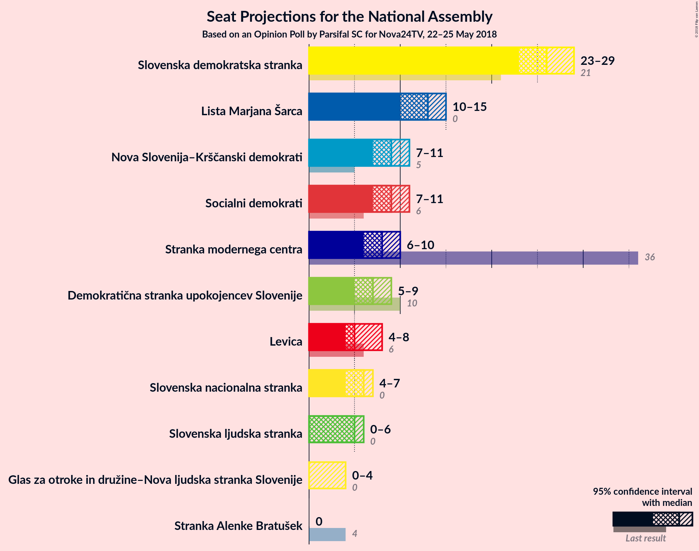
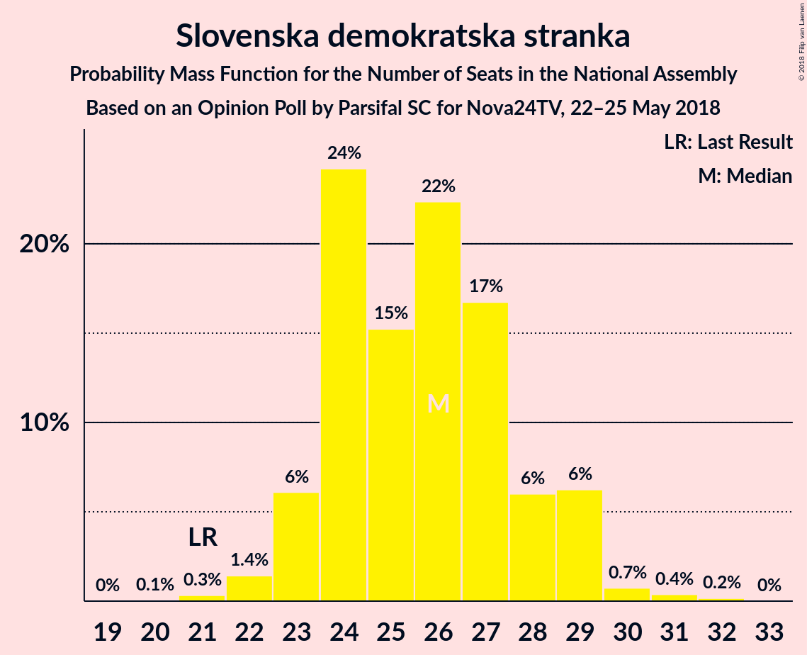
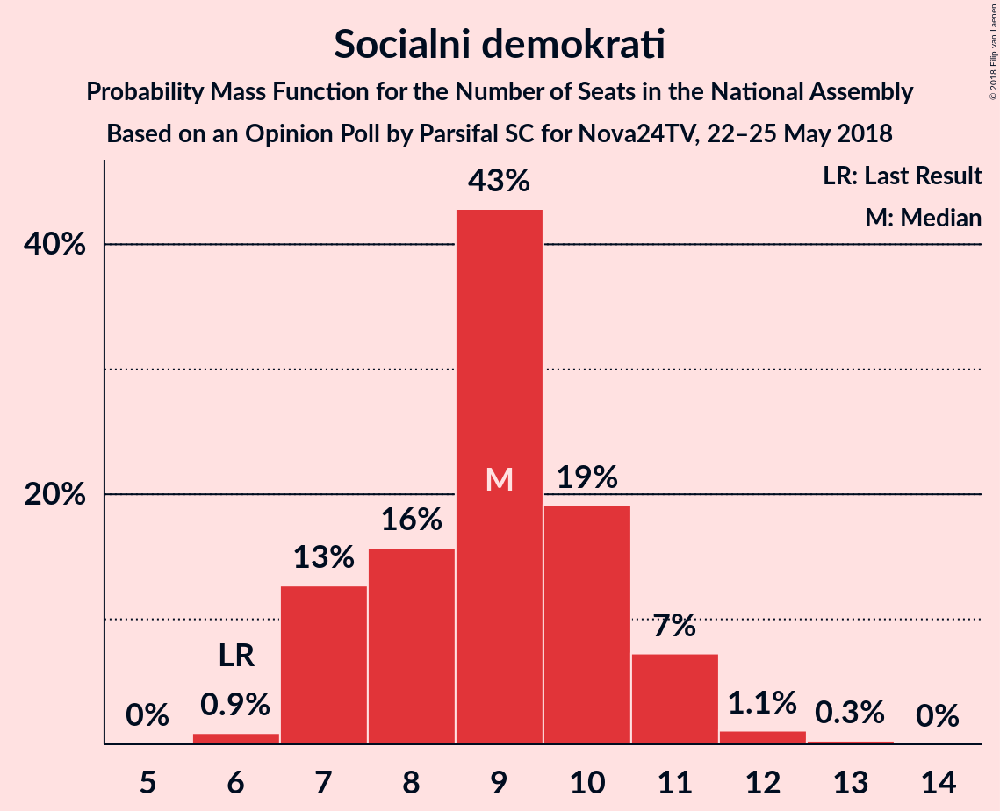
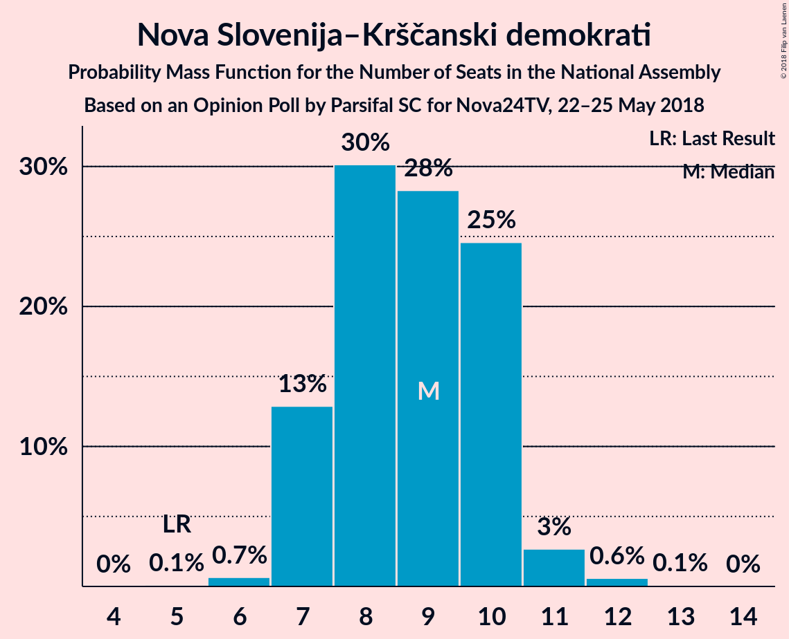
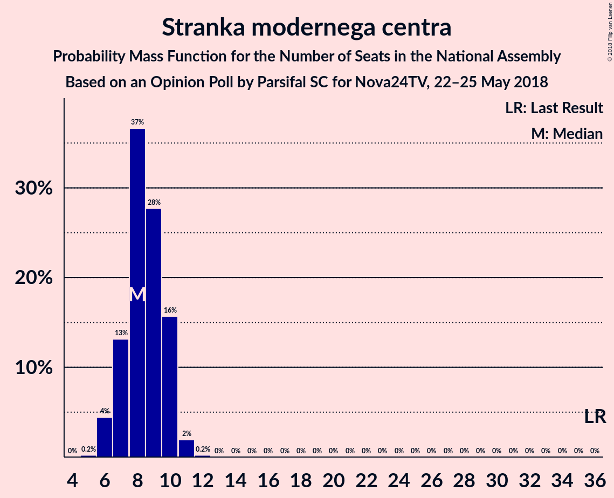
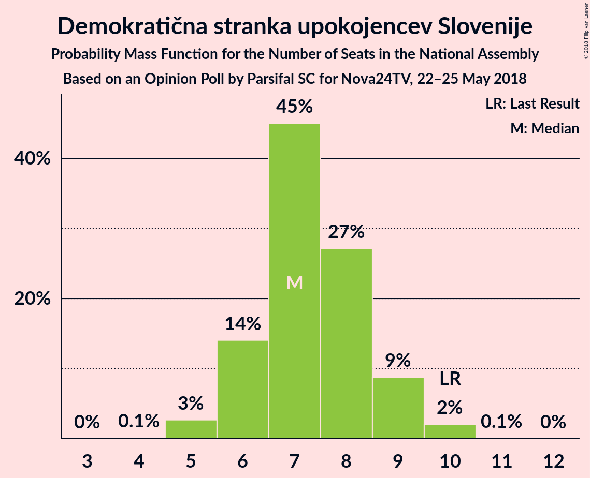
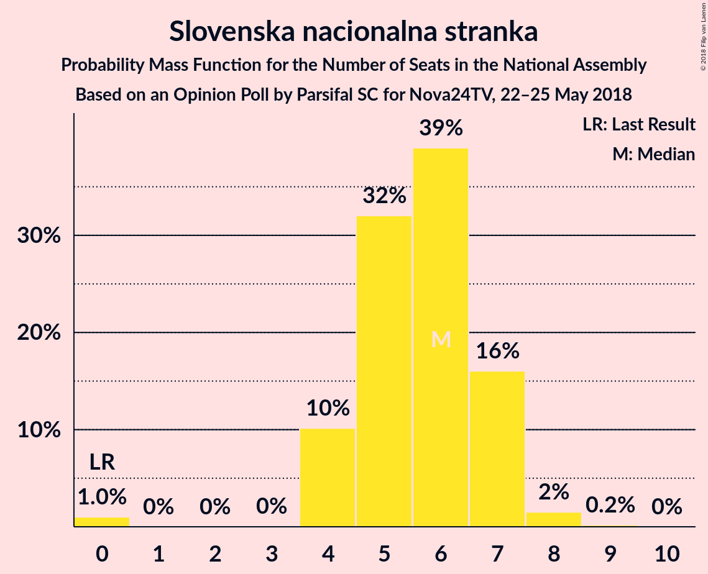
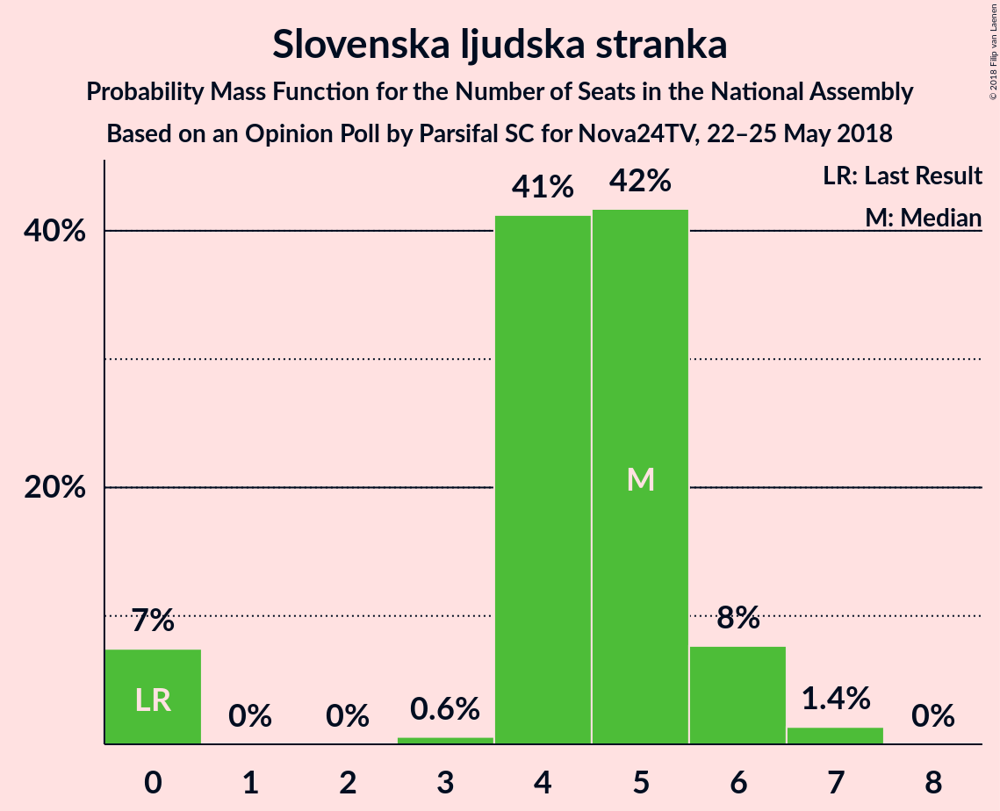
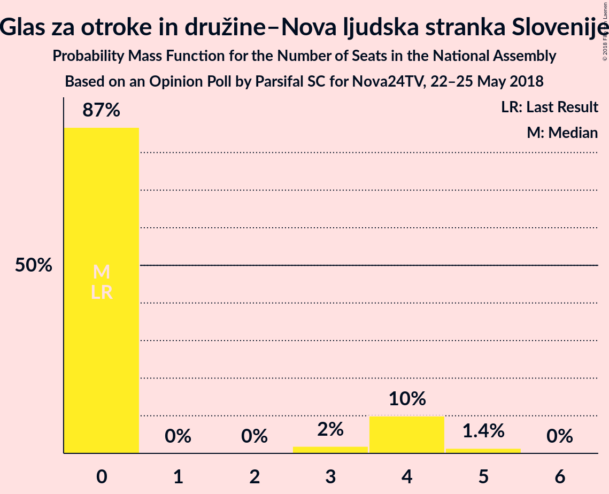

# Opinion Poll by Parsifal SC for Nova24TV, 22–25 May 2018

<a href="#voting-intentions">Voting Intentions</a> | <a href="#seats">Seats</a> | <a href="#coalitions">Coalitions</a> | <a href="#technical-information">Technical Information</a>

## Voting Intentions

### Confidence Intervals

| Party | Last Result | Poll Result | 80% Confidence Interval | 90% Confidence Interval | 95% Confidence Interval | 99% Confidence Interval |
|:-----:|:-----------:|:-----------:|:-----------------------:|:-----------------------:|:-----------------------:|:-----------------------:|
| Slovenska demokratska stranka | 20.7% | 26.9% | 24.6–29.3% |24.0–30.0% |23.5–30.6% |22.4–31.8% |
| Lista Marjana Šarca | 0.0% | 13.4% | 11.7–15.3% |11.2–15.8% |10.9–16.3% |10.1–17.3% |
| Socialni demokrati | 6.0% | 9.7% | 8.3–11.4% |7.9–11.9% |7.6–12.3% |6.9–13.2% |
| Nova Slovenija–Krščanski demokrati | 5.6% | 9.3% | 8.0–11.1% |7.6–11.5% |7.3–11.9% |6.7–12.8% |
| Stranka modernega centra | 34.5% | 9.0% | 7.7–10.7% |7.3–11.2% |7.0–11.6% |6.4–12.4% |
| Demokratična stranka upokojencev Slovenije | 10.2% | 7.7% | 6.4–9.3% |6.1–9.7% |5.8–10.1% |5.3–10.9% |
| Levica | 6.0% | 6.2% | 5.1–7.6% |4.8–8.0% |4.5–8.4% |4.0–9.1% |
| Slovenska nacionalna stranka | 2.2% | 6.0% | 4.9–7.5% |4.6–7.8% |4.4–8.2% |3.9–9.0% |
| Slovenska ljudska stranka | 4.0% | 4.8% | 3.9–6.2% |3.6–6.5% |3.4–6.9% |3.0–7.6% |
| Glas za otroke in družine–Nova ljudska stranka Slovenije | 0.0% | 3.3% | 2.6–4.5% |2.3–4.8% |2.2–5.1% |1.8–5.7% |
| Stranka Alenke Bratušek | 4.4% | 1.5% | 1.0–2.4% |0.9–2.6% |0.8–2.8% |0.6–3.3% |

*Note:* The poll result column reflects the actual value used in the calculations. Published results may vary slightly, and in addition be rounded to fewer digits.

## Seats

### Confidence Intervals

| Party | Last Result | Median | 80% Confidence Interval | 90% Confidence Interval | 95% Confidence Interval | 99% Confidence Interval |
|:-----:|:-----------:|:------:|:-----------------------:|:-----------------------:|:-----------------------:|:-----------------------:|
| <a href="#slovenska-demokratska-stranka">Slovenska demokratska stranka</a> | 21 | 26 | 24–28 |23–29 |23–29 |22–31 |
| <a href="#lista-marjana-šarca">Lista Marjana Šarca</a> | 0 | 13 | 11–14 |10–15 |10–15 |10–17 |
| <a href="#socialni-demokrati">Socialni demokrati</a> | 6 | 9 | 7–10 |7–11 |7–11 |6–12 |
| <a href="#nova-slovenija–krščanski-demokrati">Nova Slovenija–Krščanski demokrati</a> | 5 | 9 | 7–10 |7–10 |7–11 |6–12 |
| <a href="#stranka-modernega-centra">Stranka modernega centra</a> | 36 | 8 | 7–10 |7–10 |6–10 |6–11 |
| <a href="#demokratična-stranka-upokojencev-slovenije">Demokratična stranka upokojencev Slovenije</a> | 10 | 7 | 6–9 |6–9 |5–9 |5–10 |
| <a href="#levica">Levica</a> | 6 | 5 | 5–7 |4–8 |4–8 |0–8 |
| <a href="#slovenska-nacionalna-stranka">Slovenska nacionalna stranka</a> | 0 | 6 | 4–7 |4–7 |4–7 |0–8 |
| <a href="#slovenska-ljudska-stranka">Slovenska ljudska stranka</a> | 0 | 5 | 4–5 |0–6 |0–6 |0–7 |
| <a href="#glas-za-otroke-in-družine–nova-ljudska-stranka-slovenije">Glas za otroke in družine–Nova ljudska stranka Slovenije</a> | 0 | 0 | 0–4 |0–4 |0–4 |0–5 |
| <a href="#stranka-alenke-bratušek">Stranka Alenke Bratušek</a> | 4 | 0 | 0 |0 |0 |0 |

### Slovenska demokratska stranka

*For a full overview of the results for this party, see the [Slovenska demokratska stranka](party-slovenskademokratskastranka.html) page.*

| Number of Seats | Probability | Accumulated | Special Marks |
|:---------------:|:-----------:|:-----------:|:-------------:|
| 20 | 0.1% | 100% |  |
| 21 | 0.3% | 99.9% | Last Result |
| 22 | 1.4% | 99.6% |  |
| 23 | 6% | 98% |  |
| 24 | 24% | 92% |  |
| 25 | 15% | 68% |  |
| 26 | 22% | 53% | Median |
| 27 | 17% | 30% |  |
| 28 | 6% | 14% |  |
| 29 | 6% | 8% |  |
| 30 | 0.7% | 1.3% |  |
| 31 | 0.4% | 0.6% |  |
| 32 | 0.2% | 0.2% |  |
| 33 | 0% | 0% |  |

### Lista Marjana Šarca

*For a full overview of the results for this party, see the [Lista Marjana Šarca](party-listamarjanašarca.html) page.*

| Number of Seats | Probability | Accumulated | Special Marks |
|:---------------:|:-----------:|:-----------:|:-------------:|
| 0 | 0% | 100% | Last Result |
| 1 | 0% | 100% |  |
| 2 | 0% | 100% |  |
| 3 | 0% | 100% |  |
| 4 | 0% | 100% |  |
| 5 | 0% | 100% |  |
| 6 | 0% | 100% |  |
| 7 | 0% | 100% |  |
| 8 | 0.1% | 100% |  |
| 9 | 0.4% | 99.9% |  |
| 10 | 5% | 99.5% |  |
| 11 | 13% | 95% |  |
| 12 | 29% | 82% |  |
| 13 | 19% | 53% | Median |
| 14 | 28% | 34% |  |
| 15 | 4% | 6% |  |
| 16 | 2% | 2% |  |
| 17 | 0.6% | 0.7% |  |
| 18 | 0.1% | 0.1% |  |
| 19 | 0% | 0% |  |

### Socialni demokrati

*For a full overview of the results for this party, see the [Socialni demokrati](party-socialnidemokrati.html) page.*

| Number of Seats | Probability | Accumulated | Special Marks |
|:---------------:|:-----------:|:-----------:|:-------------:|
| 6 | 0.9% | 100% | Last Result |
| 7 | 13% | 99.1% |  |
| 8 | 16% | 86% |  |
| 9 | 43% | 71% | Median |
| 10 | 19% | 28% |  |
| 11 | 7% | 9% |  |
| 12 | 1.1% | 1.4% |  |
| 13 | 0.3% | 0.3% |  |
| 14 | 0% | 0% |  |

### Nova Slovenija–Krščanski demokrati

*For a full overview of the results for this party, see the [Nova Slovenija–Krščanski demokrati](party-novaslovenija–krščanskidemokrati.html) page.*

| Number of Seats | Probability | Accumulated | Special Marks |
|:---------------:|:-----------:|:-----------:|:-------------:|
| 5 | 0.1% | 100% | Last Result |
| 6 | 0.7% | 99.9% |  |
| 7 | 13% | 99.2% |  |
| 8 | 30% | 86% |  |
| 9 | 28% | 56% | Median |
| 10 | 25% | 28% |  |
| 11 | 3% | 3% |  |
| 12 | 0.6% | 0.7% |  |
| 13 | 0.1% | 0.1% |  |
| 14 | 0% | 0% |  |

### Stranka modernega centra

*For a full overview of the results for this party, see the [Stranka modernega centra](party-strankamodernegacentra.html) page.*

| Number of Seats | Probability | Accumulated | Special Marks |
|:---------------:|:-----------:|:-----------:|:-------------:|
| 5 | 0.2% | 100% |  |
| 6 | 4% | 99.8% |  |
| 7 | 13% | 95% |  |
| 8 | 37% | 82% | Median |
| 9 | 28% | 46% |  |
| 10 | 16% | 18% |  |
| 11 | 2% | 2% |  |
| 12 | 0.2% | 0.2% |  |
| 13 | 0% | 0% |  |
| 14 | 0% | 0% |  |
| 15 | 0% | 0% |  |
| 16 | 0% | 0% |  |
| 17 | 0% | 0% |  |
| 18 | 0% | 0% |  |
| 19 | 0% | 0% |  |
| 20 | 0% | 0% |  |
| 21 | 0% | 0% |  |
| 22 | 0% | 0% |  |
| 23 | 0% | 0% |  |
| 24 | 0% | 0% |  |
| 25 | 0% | 0% |  |
| 26 | 0% | 0% |  |
| 27 | 0% | 0% |  |
| 28 | 0% | 0% |  |
| 29 | 0% | 0% |  |
| 30 | 0% | 0% |  |
| 31 | 0% | 0% |  |
| 32 | 0% | 0% |  |
| 33 | 0% | 0% |  |
| 34 | 0% | 0% |  |
| 35 | 0% | 0% |  |
| 36 | 0% | 0% | Last Result |

### Demokratična stranka upokojencev Slovenije

*For a full overview of the results for this party, see the [Demokratična stranka upokojencev Slovenije](party-demokratičnastrankaupokojencevslovenije.html) page.*

| Number of Seats | Probability | Accumulated | Special Marks |
|:---------------:|:-----------:|:-----------:|:-------------:|
| 4 | 0.1% | 100% |  |
| 5 | 3% | 99.9% |  |
| 6 | 14% | 97% |  |
| 7 | 45% | 83% | Median |
| 8 | 27% | 38% |  |
| 9 | 9% | 11% |  |
| 10 | 2% | 2% | Last Result |
| 11 | 0.1% | 0.1% |  |
| 12 | 0% | 0% |  |

### Levica

*For a full overview of the results for this party, see the [Levica](party-levica.html) page.*

| Number of Seats | Probability | Accumulated | Special Marks |
|:---------------:|:-----------:|:-----------:|:-------------:|
| 0 | 0.7% | 100% |  |
| 1 | 0% | 99.3% |  |
| 2 | 0% | 99.3% |  |
| 3 | 0.1% | 99.3% |  |
| 4 | 5% | 99.2% |  |
| 5 | 46% | 94% | Median |
| 6 | 21% | 48% | Last Result |
| 7 | 20% | 27% |  |
| 8 | 7% | 7% |  |
| 9 | 0.2% | 0.3% |  |
| 10 | 0.1% | 0.1% |  |
| 11 | 0% | 0% |  |

### Slovenska nacionalna stranka

*For a full overview of the results for this party, see the [Slovenska nacionalna stranka](party-slovenskanacionalnastranka.html) page.*

| Number of Seats | Probability | Accumulated | Special Marks |
|:---------------:|:-----------:|:-----------:|:-------------:|
| 0 | 1.0% | 100% | Last Result |
| 1 | 0% | 99.0% |  |
| 2 | 0% | 99.0% |  |
| 3 | 0% | 99.0% |  |
| 4 | 10% | 98.9% |  |
| 5 | 32% | 89% |  |
| 6 | 39% | 57% | Median |
| 7 | 16% | 18% |  |
| 8 | 2% | 2% |  |
| 9 | 0.2% | 0.2% |  |
| 10 | 0% | 0% |  |

### Slovenska ljudska stranka

*For a full overview of the results for this party, see the [Slovenska ljudska stranka](party-slovenskaljudskastranka.html) page.*

| Number of Seats | Probability | Accumulated | Special Marks |
|:---------------:|:-----------:|:-----------:|:-------------:|
| 0 | 7% | 100% | Last Result |
| 1 | 0% | 93% |  |
| 2 | 0% | 93% |  |
| 3 | 0.6% | 93% |  |
| 4 | 41% | 92% |  |
| 5 | 42% | 51% | Median |
| 6 | 8% | 9% |  |
| 7 | 1.4% | 1.4% |  |
| 8 | 0% | 0% |  |

### Glas za otroke in družine–Nova ljudska stranka Slovenije

*For a full overview of the results for this party, see the [Glas za otroke in družine–Nova ljudska stranka Slovenije](party-glaszaotrokeindružine–novaljudskastrankaslovenije.html) page.*

| Number of Seats | Probability | Accumulated | Special Marks |
|:---------------:|:-----------:|:-----------:|:-------------:|
| 0 | 87% | 100% | Last Result, Median |
| 1 | 0% | 13% |  |
| 2 | 0% | 13% |  |
| 3 | 2% | 13% |  |
| 4 | 10% | 11% |  |
| 5 | 1.4% | 1.4% |  |
| 6 | 0% | 0% |  |

### Stranka Alenke Bratušek

*For a full overview of the results for this party, see the [Stranka Alenke Bratušek](party-strankaalenkebratušek.html) page.*

| Number of Seats | Probability | Accumulated | Special Marks |
|:---------------:|:-----------:|:-----------:|:-------------:|
| 0 | 100% | 100% | Median |
| 1 | 0% | 0% |  |
| 2 | 0% | 0% |  |
| 3 | 0% | 0% |  |
| 4 | 0% | 0% | Last Result |

## Coalitions

### Confidence Intervals

| Coalition | Last Result | Median | Majority? | 80% Confidence Interval | 90% Confidence Interval | 95% Confidence Interval | 99% Confidence Interval |
|:---------:|:-----------:|:------:|:---------:|:-----------------------:|:-----------------------:|:-----------------------:|:-----------------------:|
| Lista Marjana Šarca – Socialni demokrati – Nova Slovenija–Krščanski demokrati – Stranka modernega centra – Demokratična stranka upokojencev Slovenije – Stranka Alenke Bratušek | 61 | 46 | 56% | 44–49 | 43–49 | 42–50 | 41–52 |
| Lista Marjana Šarca – Socialni demokrati – Nova Slovenija–Krščanski demokrati – Stranka modernega centra – Demokratična stranka upokojencev Slovenije | 57 | 46 | 56% | 44–49 | 43–49 | 42–50 | 41–52 |
| Slovenska demokratska stranka – Lista Marjana Šarca – Demokratična stranka upokojencev Slovenije | 31 | 46 | 52% | 43–48 | 42–49 | 42–50 | 40–52 |
| Lista Marjana Šarca – Socialni demokrati – Nova Slovenija–Krščanski demokrati – Stranka modernega centra | 47 | 38 | 0.1% | 36–41 | 36–41 | 35–43 | 34–45 |
| Lista Marjana Šarca – Socialni demokrati – Nova Slovenija–Krščanski demokrati – Demokratična stranka upokojencev Slovenije | 21 | 38 | 0.2% | 35–40 | 34–41 | 34–42 | 32–45 |
| Slovenska demokratska stranka – Lista Marjana Šarca | 21 | 38 | 0.1% | 36–41 | 35–42 | 34–42 | 33–44 |
| Lista Marjana Šarca – Socialni demokrati – Stranka modernega centra – Demokratična stranka upokojencev Slovenije – Stranka Alenke Bratušek | 56 | 37 | 0% | 35–41 | 34–41 | 33–42 | 32–43 |
| Lista Marjana Šarca – Socialni demokrati – Stranka modernega centra – Demokratična stranka upokojencev Slovenije | 52 | 37 | 0% | 35–41 | 34–41 | 33–42 | 32–43 |
| Lista Marjana Šarca – Socialni demokrati – Nova Slovenija–Krščanski demokrati | 11 | 30 | 0% | 28–33 | 27–33 | 27–34 | 26–36 |
| Lista Marjana Šarca – Socialni demokrati – Stranka modernega centra | 42 | 30 | 0% | 28–33 | 27–33 | 26–34 | 25–35 |
| Lista Marjana Šarca – Socialni demokrati – Demokratična stranka upokojencev Slovenije | 16 | 29 | 0% | 26–32 | 26–32 | 25–33 | 24–35 |
| Socialni demokrati – Stranka modernega centra – Demokratična stranka upokojencev Slovenije | 52 | 24 | 0% | 22–27 | 22–27 | 21–28 | 20–30 |
| Lista Marjana Šarca – Socialni demokrati | 6 | 22 | 0% | 19–24 | 19–24 | 18–25 | 17–27 |

### Lista Marjana Šarca – Socialni demokrati – Nova Slovenija–Krščanski demokrati – Stranka modernega centra – Demokratična stranka upokojencev Slovenije – Stranka Alenke Bratušek

| Number of Seats | Probability | Accumulated | Special Marks |
|:---------------:|:-----------:|:-----------:|:-------------:|
| 39 | 0.1% | 100% |  |
| 40 | 0.1% | 99.9% |  |
| 41 | 0.4% | 99.8% |  |
| 42 | 4% | 99.3% |  |
| 43 | 6% | 96% |  |
| 44 | 13% | 90% |  |
| 45 | 22% | 77% |  |
| 46 | 12% | 56% | Median, Majority |
| 47 | 13% | 44% |  |
| 48 | 18% | 31% |  |
| 49 | 8% | 13% |  |
| 50 | 2% | 5% |  |
| 51 | 1.4% | 2% |  |
| 52 | 0.6% | 1.1% |  |
| 53 | 0.1% | 0.5% |  |
| 54 | 0.3% | 0.3% |  |
| 55 | 0% | 0% |  |
| 56 | 0% | 0% |  |
| 57 | 0% | 0% |  |
| 58 | 0% | 0% |  |
| 59 | 0% | 0% |  |
| 60 | 0% | 0% |  |
| 61 | 0% | 0% | Last Result |

### Lista Marjana Šarca – Socialni demokrati – Nova Slovenija–Krščanski demokrati – Stranka modernega centra – Demokratična stranka upokojencev Slovenije

| Number of Seats | Probability | Accumulated | Special Marks |
|:---------------:|:-----------:|:-----------:|:-------------:|
| 39 | 0.1% | 100% |  |
| 40 | 0.1% | 99.9% |  |
| 41 | 0.4% | 99.8% |  |
| 42 | 4% | 99.3% |  |
| 43 | 6% | 96% |  |
| 44 | 13% | 90% |  |
| 45 | 22% | 77% |  |
| 46 | 12% | 56% | Median, Majority |
| 47 | 13% | 44% |  |
| 48 | 18% | 31% |  |
| 49 | 8% | 13% |  |
| 50 | 2% | 5% |  |
| 51 | 1.4% | 2% |  |
| 52 | 0.6% | 1.1% |  |
| 53 | 0.1% | 0.5% |  |
| 54 | 0.3% | 0.3% |  |
| 55 | 0% | 0% |  |
| 56 | 0% | 0% |  |
| 57 | 0% | 0% | Last Result |

### Slovenska demokratska stranka – Lista Marjana Šarca – Demokratična stranka upokojencev Slovenije

| Number of Seats | Probability | Accumulated | Special Marks |
|:---------------:|:-----------:|:-----------:|:-------------:|
| 31 | 0% | 100% | Last Result |
| 32 | 0% | 100% |  |
| 33 | 0% | 100% |  |
| 34 | 0% | 100% |  |
| 35 | 0% | 100% |  |
| 36 | 0% | 100% |  |
| 37 | 0% | 100% |  |
| 38 | 0% | 100% |  |
| 39 | 0.1% | 100% |  |
| 40 | 0.4% | 99.8% |  |
| 41 | 2% | 99.4% |  |
| 42 | 3% | 98% |  |
| 43 | 8% | 95% |  |
| 44 | 10% | 87% |  |
| 45 | 25% | 77% |  |
| 46 | 25% | 52% | Median, Majority |
| 47 | 8% | 27% |  |
| 48 | 10% | 19% |  |
| 49 | 4% | 8% |  |
| 50 | 2% | 4% |  |
| 51 | 1.0% | 2% |  |
| 52 | 0.6% | 0.8% |  |
| 53 | 0.1% | 0.2% |  |
| 54 | 0.1% | 0.1% |  |
| 55 | 0% | 0% |  |

### Lista Marjana Šarca – Socialni demokrati – Nova Slovenija–Krščanski demokrati – Stranka modernega centra

| Number of Seats | Probability | Accumulated | Special Marks |
|:---------------:|:-----------:|:-----------:|:-------------:|
| 33 | 0.1% | 100% |  |
| 34 | 2% | 99.8% |  |
| 35 | 1.3% | 98% |  |
| 36 | 7% | 97% |  |
| 37 | 14% | 89% |  |
| 38 | 26% | 75% |  |
| 39 | 10% | 49% | Median |
| 40 | 11% | 39% |  |
| 41 | 23% | 28% |  |
| 42 | 2% | 5% |  |
| 43 | 2% | 3% |  |
| 44 | 0.4% | 1.1% |  |
| 45 | 0.6% | 0.7% |  |
| 46 | 0% | 0.1% | Majority |
| 47 | 0% | 0% | Last Result |

### Lista Marjana Šarca – Socialni demokrati – Nova Slovenija–Krščanski demokrati – Demokratična stranka upokojencev Slovenije

| Number of Seats | Probability | Accumulated | Special Marks |
|:---------------:|:-----------:|:-----------:|:-------------:|
| 21 | 0% | 100% | Last Result |
| 22 | 0% | 100% |  |
| 23 | 0% | 100% |  |
| 24 | 0% | 100% |  |
| 25 | 0% | 100% |  |
| 26 | 0% | 100% |  |
| 27 | 0% | 100% |  |
| 28 | 0% | 100% |  |
| 29 | 0% | 100% |  |
| 30 | 0% | 100% |  |
| 31 | 0.1% | 100% |  |
| 32 | 0.5% | 99.9% |  |
| 33 | 0.7% | 99.4% |  |
| 34 | 4% | 98.7% |  |
| 35 | 11% | 95% |  |
| 36 | 20% | 83% |  |
| 37 | 10% | 63% |  |
| 38 | 10% | 53% | Median |
| 39 | 20% | 43% |  |
| 40 | 16% | 23% |  |
| 41 | 3% | 7% |  |
| 42 | 2% | 4% |  |
| 43 | 0.8% | 2% |  |
| 44 | 0.3% | 0.8% |  |
| 45 | 0.4% | 0.5% |  |
| 46 | 0.2% | 0.2% | Majority |
| 47 | 0% | 0% |  |

### Slovenska demokratska stranka – Lista Marjana Šarca

| Number of Seats | Probability | Accumulated | Special Marks |
|:---------------:|:-----------:|:-----------:|:-------------:|
| 21 | 0% | 100% | Last Result |
| 22 | 0% | 100% |  |
| 23 | 0% | 100% |  |
| 24 | 0% | 100% |  |
| 25 | 0% | 100% |  |
| 26 | 0% | 100% |  |
| 27 | 0% | 100% |  |
| 28 | 0% | 100% |  |
| 29 | 0% | 100% |  |
| 30 | 0% | 100% |  |
| 31 | 0% | 100% |  |
| 32 | 0.1% | 100% |  |
| 33 | 0.7% | 99.9% |  |
| 34 | 2% | 99.2% |  |
| 35 | 4% | 97% |  |
| 36 | 9% | 93% |  |
| 37 | 10% | 85% |  |
| 38 | 34% | 75% |  |
| 39 | 17% | 41% | Median |
| 40 | 11% | 24% |  |
| 41 | 7% | 13% |  |
| 42 | 4% | 6% |  |
| 43 | 1.1% | 2% |  |
| 44 | 0.8% | 1.1% |  |
| 45 | 0.2% | 0.3% |  |
| 46 | 0.1% | 0.1% | Majority |
| 47 | 0% | 0% |  |

### Lista Marjana Šarca – Socialni demokrati – Stranka modernega centra – Demokratična stranka upokojencev Slovenije – Stranka Alenke Bratušek

| Number of Seats | Probability | Accumulated | Special Marks |
|:---------------:|:-----------:|:-----------:|:-------------:|
| 31 | 0.2% | 100% |  |
| 32 | 0.6% | 99.8% |  |
| 33 | 2% | 99.2% |  |
| 34 | 3% | 97% |  |
| 35 | 12% | 94% |  |
| 36 | 14% | 82% |  |
| 37 | 22% | 68% | Median |
| 38 | 25% | 46% |  |
| 39 | 5% | 22% |  |
| 40 | 4% | 17% |  |
| 41 | 10% | 13% |  |
| 42 | 2% | 3% |  |
| 43 | 0.6% | 1.0% |  |
| 44 | 0.4% | 0.5% |  |
| 45 | 0% | 0.1% |  |
| 46 | 0% | 0% | Majority |
| 47 | 0% | 0% |  |
| 48 | 0% | 0% |  |
| 49 | 0% | 0% |  |
| 50 | 0% | 0% |  |
| 51 | 0% | 0% |  |
| 52 | 0% | 0% |  |
| 53 | 0% | 0% |  |
| 54 | 0% | 0% |  |
| 55 | 0% | 0% |  |
| 56 | 0% | 0% | Last Result |

### Lista Marjana Šarca – Socialni demokrati – Stranka modernega centra – Demokratična stranka upokojencev Slovenije

| Number of Seats | Probability | Accumulated | Special Marks |
|:---------------:|:-----------:|:-----------:|:-------------:|
| 31 | 0.2% | 100% |  |
| 32 | 0.6% | 99.8% |  |
| 33 | 2% | 99.2% |  |
| 34 | 3% | 97% |  |
| 35 | 12% | 94% |  |
| 36 | 14% | 82% |  |
| 37 | 22% | 68% | Median |
| 38 | 25% | 46% |  |
| 39 | 5% | 22% |  |
| 40 | 4% | 17% |  |
| 41 | 10% | 13% |  |
| 42 | 2% | 3% |  |
| 43 | 0.6% | 1.0% |  |
| 44 | 0.4% | 0.5% |  |
| 45 | 0% | 0.1% |  |
| 46 | 0% | 0% | Majority |
| 47 | 0% | 0% |  |
| 48 | 0% | 0% |  |
| 49 | 0% | 0% |  |
| 50 | 0% | 0% |  |
| 51 | 0% | 0% |  |
| 52 | 0% | 0% | Last Result |

### Lista Marjana Šarca – Socialni demokrati – Nova Slovenija–Krščanski demokrati

| Number of Seats | Probability | Accumulated | Special Marks |
|:---------------:|:-----------:|:-----------:|:-------------:|
| 11 | 0% | 100% | Last Result |
| 12 | 0% | 100% |  |
| 13 | 0% | 100% |  |
| 14 | 0% | 100% |  |
| 15 | 0% | 100% |  |
| 16 | 0% | 100% |  |
| 17 | 0% | 100% |  |
| 18 | 0% | 100% |  |
| 19 | 0% | 100% |  |
| 20 | 0% | 100% |  |
| 21 | 0% | 100% |  |
| 22 | 0% | 100% |  |
| 23 | 0% | 100% |  |
| 24 | 0.1% | 100% |  |
| 25 | 0.2% | 99.9% |  |
| 26 | 2% | 99.7% |  |
| 27 | 4% | 98% |  |
| 28 | 13% | 94% |  |
| 29 | 18% | 81% |  |
| 30 | 14% | 63% |  |
| 31 | 20% | 49% | Median |
| 32 | 6% | 29% |  |
| 33 | 19% | 22% |  |
| 34 | 1.3% | 3% |  |
| 35 | 1.1% | 2% |  |
| 36 | 0.5% | 0.9% |  |
| 37 | 0.4% | 0.4% |  |
| 38 | 0% | 0% |  |

### Lista Marjana Šarca – Socialni demokrati – Stranka modernega centra

| Number of Seats | Probability | Accumulated | Special Marks |
|:---------------:|:-----------:|:-----------:|:-------------:|
| 24 | 0.1% | 100% |  |
| 25 | 0.4% | 99.9% |  |
| 26 | 3% | 99.5% |  |
| 27 | 5% | 97% |  |
| 28 | 11% | 91% |  |
| 29 | 18% | 81% |  |
| 30 | 22% | 63% | Median |
| 31 | 22% | 41% |  |
| 32 | 5% | 19% |  |
| 33 | 11% | 14% |  |
| 34 | 1.4% | 3% |  |
| 35 | 1.2% | 1.4% |  |
| 36 | 0.2% | 0.2% |  |
| 37 | 0% | 0% |  |
| 38 | 0% | 0% |  |
| 39 | 0% | 0% |  |
| 40 | 0% | 0% |  |
| 41 | 0% | 0% |  |
| 42 | 0% | 0% | Last Result |

### Lista Marjana Šarca – Socialni demokrati – Demokratična stranka upokojencev Slovenije

| Number of Seats | Probability | Accumulated | Special Marks |
|:---------------:|:-----------:|:-----------:|:-------------:|
| 16 | 0% | 100% | Last Result |
| 17 | 0% | 100% |  |
| 18 | 0% | 100% |  |
| 19 | 0% | 100% |  |
| 20 | 0% | 100% |  |
| 21 | 0% | 100% |  |
| 22 | 0% | 100% |  |
| 23 | 0.2% | 100% |  |
| 24 | 0.3% | 99.8% |  |
| 25 | 3% | 99.4% |  |
| 26 | 9% | 97% |  |
| 27 | 12% | 88% |  |
| 28 | 17% | 75% |  |
| 29 | 14% | 58% | Median |
| 30 | 24% | 44% |  |
| 31 | 8% | 19% |  |
| 32 | 7% | 11% |  |
| 33 | 3% | 4% |  |
| 34 | 1.1% | 2% |  |
| 35 | 0.4% | 0.6% |  |
| 36 | 0.2% | 0.2% |  |
| 37 | 0% | 0% |  |

### Socialni demokrati – Stranka modernega centra – Demokratična stranka upokojencev Slovenije

| Number of Seats | Probability | Accumulated | Special Marks |
|:---------------:|:-----------:|:-----------:|:-------------:|
| 19 | 0.1% | 100% |  |
| 20 | 1.0% | 99.9% |  |
| 21 | 2% | 98.8% |  |
| 22 | 8% | 97% |  |
| 23 | 10% | 89% |  |
| 24 | 33% | 79% | Median |
| 25 | 14% | 46% |  |
| 26 | 12% | 32% |  |
| 27 | 15% | 20% |  |
| 28 | 3% | 5% |  |
| 29 | 1.3% | 2% |  |
| 30 | 0.6% | 0.8% |  |
| 31 | 0.1% | 0.2% |  |
| 32 | 0% | 0% |  |
| 33 | 0% | 0% |  |
| 34 | 0% | 0% |  |
| 35 | 0% | 0% |  |
| 36 | 0% | 0% |  |
| 37 | 0% | 0% |  |
| 38 | 0% | 0% |  |
| 39 | 0% | 0% |  |
| 40 | 0% | 0% |  |
| 41 | 0% | 0% |  |
| 42 | 0% | 0% |  |
| 43 | 0% | 0% |  |
| 44 | 0% | 0% |  |
| 45 | 0% | 0% |  |
| 46 | 0% | 0% | Majority |
| 47 | 0% | 0% |  |
| 48 | 0% | 0% |  |
| 49 | 0% | 0% |  |
| 50 | 0% | 0% |  |
| 51 | 0% | 0% |  |
| 52 | 0% | 0% | Last Result |

### Lista Marjana Šarca – Socialni demokrati

| Number of Seats | Probability | Accumulated | Special Marks |
|:---------------:|:-----------:|:-----------:|:-------------:|
| 6 | 0% | 100% | Last Result |
| 7 | 0% | 100% |  |
| 8 | 0% | 100% |  |
| 9 | 0% | 100% |  |
| 10 | 0% | 100% |  |
| 11 | 0% | 100% |  |
| 12 | 0% | 100% |  |
| 13 | 0% | 100% |  |
| 14 | 0% | 100% |  |
| 15 | 0% | 100% |  |
| 16 | 0.1% | 100% |  |
| 17 | 0.9% | 99.9% |  |
| 18 | 2% | 99.0% |  |
| 19 | 11% | 97% |  |
| 20 | 12% | 85% |  |
| 21 | 20% | 74% |  |
| 22 | 14% | 54% | Median |
| 23 | 28% | 40% |  |
| 24 | 7% | 11% |  |
| 25 | 3% | 5% |  |
| 26 | 1.2% | 2% |  |
| 27 | 0.5% | 0.5% |  |
| 28 | 0% | 0.1% |  |
| 29 | 0% | 0% |  |

## Technical Information

### Opinion Poll

+ **Polling firm:** Parsifal SC
+ **Commissioner(s):** Nova24TV
+ **Fieldwork period:** 22–25 May 2018

### Calculations

+ **Sample size:** 599
+ **Simulations done:** 2,097,152
+ **Error estimate:** 1.66%

