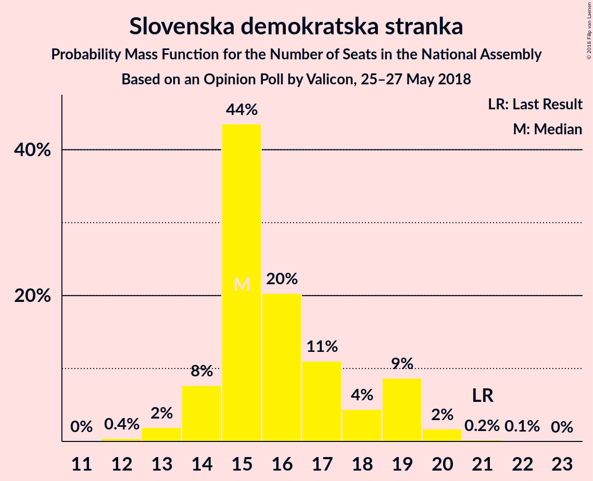
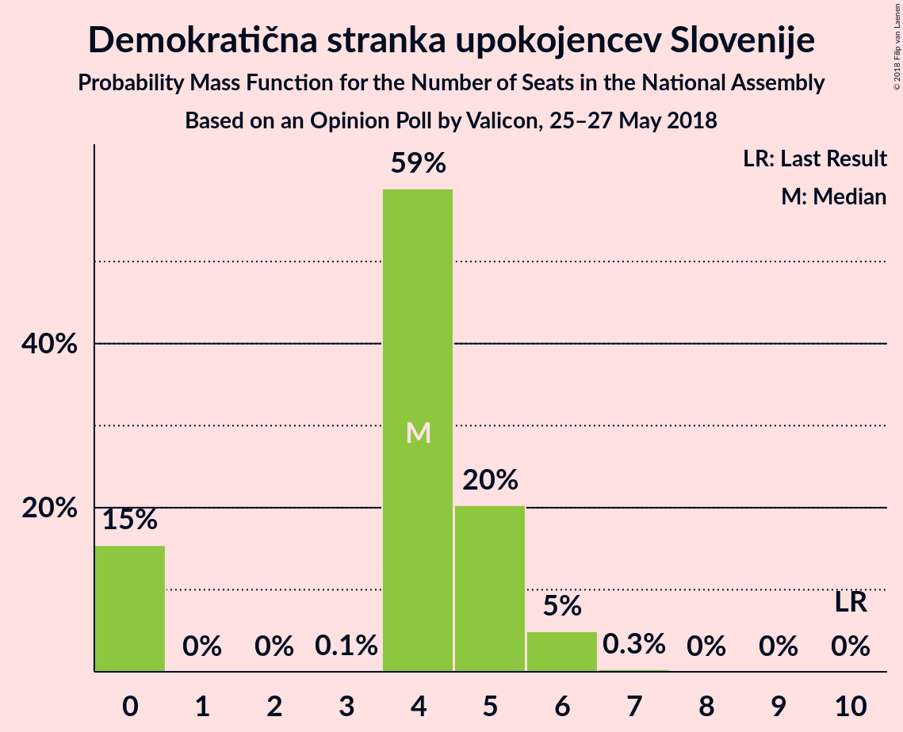
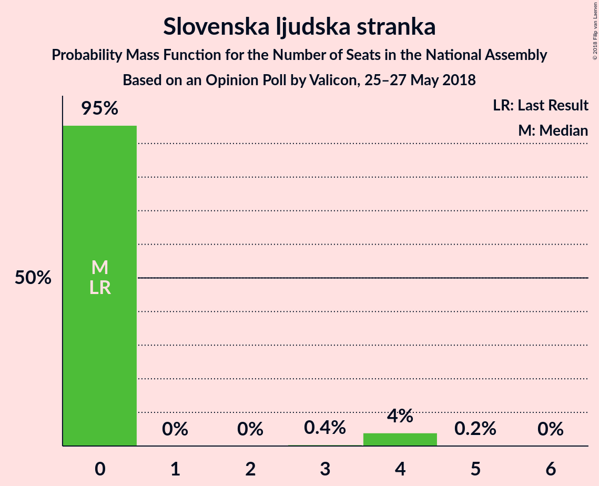

# Opinion Poll by Valicon, 25–27 May 2018

<a href="#voting-intentions">Voting Intentions</a> | <a href="#seats">Seats</a> | <a href="#coalitions">Coalitions</a> | <a href="#technical-information">Technical Information</a>

## Voting Intentions

### Confidence Intervals

| Party | Last Result | Poll Result | 80% Confidence Interval | 90% Confidence Interval | 95% Confidence Interval | 99% Confidence Interval |
|:-----:|:-----------:|:-----------:|:-----------------------:|:-----------------------:|:-----------------------:|:-----------------------:|
| Slovenska demokratska stranka | 20.7% | 17.2% | 15.4–19.3% |14.9–19.9% |14.4–20.4% |13.6–21.5% |
| Lista Marjana Šarca | 0.0% | 13.8% | 12.2–15.8% |11.7–16.3% |11.3–16.8% |10.6–17.7% |
| Socialni demokrati | 6.0% | 11.9% | 10.3–13.7% |9.9–14.2% |9.5–14.7% |8.9–15.6% |
| Levica | 6.0% | 9.8% | 8.4–11.5% |8.0–11.9% |7.7–12.4% |7.0–13.2% |
| Nova Slovenija–Krščanski demokrati | 5.6% | 5.7% | 4.6–7.1% |4.4–7.5% |4.1–7.8% |3.7–8.5% |
| Stranka modernega centra | 34.5% | 5.5% | 4.5–6.9% |4.2–7.3% |4.0–7.6% |3.5–8.3% |
| Slovenska nacionalna stranka | 2.2% | 5.0% | 4.1–6.4% |3.8–6.7% |3.6–7.1% |3.2–7.8% |
| Demokratična stranka upokojencev Slovenije | 10.2% | 4.7% | 3.8–6.0% |3.5–6.4% |3.3–6.7% |2.9–7.4% |
| Stranka Alenke Bratušek | 4.4% | 3.3% | 2.5–4.4% |2.3–4.7% |2.1–5.0% |1.8–5.6% |
| Slovenska ljudska stranka | 4.0% | 2.8% | 2.1–3.8% |1.9–4.1% |1.7–4.4% |1.4–5.0% |
| Glas za otroke in družine–Nova ljudska stranka Slovenije | 0.0% | 0.7% | 0.4–1.3% |0.3–1.5% |0.3–1.7% |0.2–2.0% |

*Note:* The poll result column reflects the actual value used in the calculations. Published results may vary slightly, and in addition be rounded to fewer digits.

## Seats

### Confidence Intervals

| Party | Last Result | Median | 80% Confidence Interval | 90% Confidence Interval | 95% Confidence Interval | 99% Confidence Interval |
|:-----:|:-----------:|:------:|:-----------------------:|:-----------------------:|:-----------------------:|:-----------------------:|
| <a href="#slovenska-demokratska-stranka">Slovenska demokratska stranka</a> | 21 | 15 | 14–19 |14–19 |14–19 |13–20 |
| <a href="#lista-marjana-šarca">Lista Marjana Šarca</a> | 0 | 13 | 11–14 |11–15 |10–16 |10–16 |
| <a href="#socialni-demokrati">Socialni demokrati</a> | 6 | 12 | 10–12 |9–13 |9–13 |8–15 |
| <a href="#levica">Levica</a> | 6 | 9 | 8–11 |7–12 |7–12 |6–12 |
| <a href="#nova-slovenija–krščanski-demokrati">Nova Slovenija–Krščanski demokrati</a> | 5 | 6 | 4–6 |4–7 |4–7 |0–8 |
| <a href="#stranka-modernega-centra">Stranka modernega centra</a> | 36 | 5 | 4–6 |0–7 |0–7 |0–7 |
| <a href="#slovenska-nacionalna-stranka">Slovenska nacionalna stranka</a> | 0 | 5 | 4–6 |0–6 |0–6 |0–7 |
| <a href="#demokratična-stranka-upokojencev-slovenije">Demokratična stranka upokojencev Slovenije</a> | 10 | 4 | 0–5 |0–6 |0–6 |0–6 |
| <a href="#stranka-alenke-bratušek">Stranka Alenke Bratušek</a> | 4 | 0 | 0–4 |0–4 |0–5 |0–5 |
| <a href="#slovenska-ljudska-stranka">Slovenska ljudska stranka</a> | 0 | 0 | 0 |0 |0–4 |0–4 |
| <a href="#glas-za-otroke-in-družine–nova-ljudska-stranka-slovenije">Glas za otroke in družine–Nova ljudska stranka Slovenije</a> | 0 | 0 | 0 |0 |0 |0 |

### Slovenska demokratska stranka

*For a full overview of the results for this party, see the [Slovenska demokratska stranka](party-slovenskademokratskastranka.html) page.*

| Number of Seats | Probability | Accumulated | Special Marks |
|:---------------:|:-----------:|:-----------:|:-------------:|
| 12 | 0.4% | 100% |  |
| 13 | 2% | 99.6% |  |
| 14 | 8% | 98% |  |
| 15 | 44% | 90% | Median |
| 16 | 20% | 46% |  |
| 17 | 11% | 26% |  |
| 18 | 4% | 15% |  |
| 19 | 9% | 11% |  |
| 20 | 2% | 2% |  |
| 21 | 0.2% | 0.3% | Last Result |
| 22 | 0.1% | 0.1% |  |
| 23 | 0% | 0% |  |

### Lista Marjana Šarca

*For a full overview of the results for this party, see the [Lista Marjana Šarca](party-listamarjanašarca.html) page.*

| Number of Seats | Probability | Accumulated | Special Marks |
|:---------------:|:-----------:|:-----------:|:-------------:|
| 0 | 0% | 100% | Last Result |
| 1 | 0% | 100% |  |
| 2 | 0% | 100% |  |
| 3 | 0% | 100% |  |
| 4 | 0% | 100% |  |
| 5 | 0% | 100% |  |
| 6 | 0% | 100% |  |
| 7 | 0% | 100% |  |
| 8 | 0% | 100% |  |
| 9 | 0.2% | 100% |  |
| 10 | 2% | 99.8% |  |
| 11 | 10% | 97% |  |
| 12 | 25% | 87% |  |
| 13 | 43% | 62% | Median |
| 14 | 11% | 19% |  |
| 15 | 3% | 8% |  |
| 16 | 4% | 4% |  |
| 17 | 0.3% | 0.5% |  |
| 18 | 0.1% | 0.1% |  |
| 19 | 0.1% | 0.1% |  |
| 20 | 0% | 0% |  |

### Socialni demokrati

*For a full overview of the results for this party, see the [Socialni demokrati](party-socialnidemokrati.html) page.*

| Number of Seats | Probability | Accumulated | Special Marks |
|:---------------:|:-----------:|:-----------:|:-------------:|
| 6 | 0% | 100% | Last Result |
| 7 | 0.1% | 100% |  |
| 8 | 2% | 99.9% |  |
| 9 | 7% | 98% |  |
| 10 | 8% | 92% |  |
| 11 | 32% | 84% |  |
| 12 | 44% | 52% | Median |
| 13 | 6% | 7% |  |
| 14 | 0.9% | 2% |  |
| 15 | 0.8% | 1.0% |  |
| 16 | 0.1% | 0.1% |  |
| 17 | 0% | 0% |  |

### Levica

*For a full overview of the results for this party, see the [Levica](party-levica.html) page.*

| Number of Seats | Probability | Accumulated | Special Marks |
|:---------------:|:-----------:|:-----------:|:-------------:|
| 6 | 2% | 100% | Last Result |
| 7 | 4% | 98% |  |
| 8 | 10% | 94% |  |
| 9 | 60% | 84% | Median |
| 10 | 12% | 25% |  |
| 11 | 6% | 13% |  |
| 12 | 6% | 6% |  |
| 13 | 0.2% | 0.2% |  |
| 14 | 0% | 0% |  |

### Nova Slovenija–Krščanski demokrati

*For a full overview of the results for this party, see the [Nova Slovenija–Krščanski demokrati](party-novaslovenija–krščanskidemokrati.html) page.*

| Number of Seats | Probability | Accumulated | Special Marks |
|:---------------:|:-----------:|:-----------:|:-------------:|
| 0 | 2% | 100% |  |
| 1 | 0% | 98% |  |
| 2 | 0% | 98% |  |
| 3 | 0.1% | 98% |  |
| 4 | 20% | 98% |  |
| 5 | 17% | 78% | Last Result |
| 6 | 52% | 61% | Median |
| 7 | 8% | 9% |  |
| 8 | 0.8% | 1.1% |  |
| 9 | 0.3% | 0.3% |  |
| 10 | 0% | 0% |  |

### Stranka modernega centra

*For a full overview of the results for this party, see the [Stranka modernega centra](party-strankamodernegacentra.html) page.*

| Number of Seats | Probability | Accumulated | Special Marks |
|:---------------:|:-----------:|:-----------:|:-------------:|
| 0 | 8% | 100% |  |
| 1 | 0% | 92% |  |
| 2 | 0% | 92% |  |
| 3 | 0.2% | 92% |  |
| 4 | 41% | 92% |  |
| 5 | 25% | 51% | Median |
| 6 | 16% | 26% |  |
| 7 | 9% | 9% |  |
| 8 | 0.4% | 0.5% |  |
| 9 | 0% | 0% |  |
| 10 | 0% | 0% |  |
| 11 | 0% | 0% |  |
| 12 | 0% | 0% |  |
| 13 | 0% | 0% |  |
| 14 | 0% | 0% |  |
| 15 | 0% | 0% |  |
| 16 | 0% | 0% |  |
| 17 | 0% | 0% |  |
| 18 | 0% | 0% |  |
| 19 | 0% | 0% |  |
| 20 | 0% | 0% |  |
| 21 | 0% | 0% |  |
| 22 | 0% | 0% |  |
| 23 | 0% | 0% |  |
| 24 | 0% | 0% |  |
| 25 | 0% | 0% |  |
| 26 | 0% | 0% |  |
| 27 | 0% | 0% |  |
| 28 | 0% | 0% |  |
| 29 | 0% | 0% |  |
| 30 | 0% | 0% |  |
| 31 | 0% | 0% |  |
| 32 | 0% | 0% |  |
| 33 | 0% | 0% |  |
| 34 | 0% | 0% |  |
| 35 | 0% | 0% |  |
| 36 | 0% | 0% | Last Result |

### Slovenska nacionalna stranka

*For a full overview of the results for this party, see the [Slovenska nacionalna stranka](party-slovenskanacionalnastranka.html) page.*

| Number of Seats | Probability | Accumulated | Special Marks |
|:---------------:|:-----------:|:-----------:|:-------------:|
| 0 | 6% | 100% | Last Result |
| 1 | 0% | 94% |  |
| 2 | 0% | 94% |  |
| 3 | 0.4% | 94% |  |
| 4 | 28% | 93% |  |
| 5 | 26% | 65% | Median |
| 6 | 37% | 39% |  |
| 7 | 2% | 2% |  |
| 8 | 0% | 0.1% |  |
| 9 | 0% | 0% |  |

### Demokratična stranka upokojencev Slovenije

*For a full overview of the results for this party, see the [Demokratična stranka upokojencev Slovenije](party-demokratičnastrankaupokojencevslovenije.html) page.*

| Number of Seats | Probability | Accumulated | Special Marks |
|:---------------:|:-----------:|:-----------:|:-------------:|
| 0 | 15% | 100% |  |
| 1 | 0% | 85% |  |
| 2 | 0% | 85% |  |
| 3 | 0.1% | 85% |  |
| 4 | 59% | 84% | Median |
| 5 | 20% | 26% |  |
| 6 | 5% | 5% |  |
| 7 | 0.3% | 0.4% |  |
| 8 | 0% | 0% |  |
| 9 | 0% | 0% |  |
| 10 | 0% | 0% | Last Result |

### Stranka Alenke Bratušek

*For a full overview of the results for this party, see the [Stranka Alenke Bratušek](party-strankaalenkebratušek.html) page.*

| Number of Seats | Probability | Accumulated | Special Marks |
|:---------------:|:-----------:|:-----------:|:-------------:|
| 0 | 72% | 100% | Median |
| 1 | 0% | 28% |  |
| 2 | 0% | 28% |  |
| 3 | 3% | 28% |  |
| 4 | 21% | 25% | Last Result |
| 5 | 3% | 3% |  |
| 6 | 0% | 0% |  |

### Slovenska ljudska stranka

*For a full overview of the results for this party, see the [Slovenska ljudska stranka](party-slovenskaljudskastranka.html) page.*

| Number of Seats | Probability | Accumulated | Special Marks |
|:---------------:|:-----------:|:-----------:|:-------------:|
| 0 | 95% | 100% | Last Result, Median |
| 1 | 0% | 5% |  |
| 2 | 0% | 5% |  |
| 3 | 0.4% | 5% |  |
| 4 | 4% | 4% |  |
| 5 | 0.2% | 0.2% |  |
| 6 | 0% | 0% |  |

### Glas za otroke in družine–Nova ljudska stranka Slovenije

*For a full overview of the results for this party, see the [Glas za otroke in družine–Nova ljudska stranka Slovenije](party-glaszaotrokeindružine–novaljudskastrankaslovenije.html) page.*

| Number of Seats | Probability | Accumulated | Special Marks |
|:---------------:|:-----------:|:-----------:|:-------------:|
| 0 | 100% | 100% | Last Result, Median |

## Coalitions

### Confidence Intervals

| Coalition | Last Result | Median | Majority? | 80% Confidence Interval | 90% Confidence Interval | 95% Confidence Interval | 99% Confidence Interval |
|:---------:|:-----------:|:------:|:---------:|:-----------------------:|:-----------------------:|:-----------------------:|:-----------------------:|
| Lista Marjana Šarca – Socialni demokrati – Nova Slovenija–Krščanski demokrati – Stranka modernega centra – Demokratična stranka upokojencev Slovenije – Stranka Alenke Bratušek | 61 | 39 | 0.3% | 35–42 | 35–43 | 33–44 | 33–45 |
| Lista Marjana Šarca – Socialni demokrati – Nova Slovenija–Krščanski demokrati – Stranka modernega centra – Demokratična stranka upokojencev Slovenije | 57 | 38 | 0% | 33–41 | 33–42 | 33–43 | 29–44 |
| Lista Marjana Šarca – Socialni demokrati – Nova Slovenija–Krščanski demokrati – Stranka modernega centra | 47 | 35 | 0% | 31–37 | 29–38 | 29–39 | 28–40 |
| Lista Marjana Šarca – Socialni demokrati – Stranka modernega centra – Demokratična stranka upokojencev Slovenije – Stranka Alenke Bratušek | 56 | 33 | 0% | 30–37 | 29–38 | 29–38 | 27–40 |
| Lista Marjana Šarca – Socialni demokrati – Nova Slovenija–Krščanski demokrati – Demokratična stranka upokojencev Slovenije | 21 | 34 | 0% | 30–35 | 29–37 | 27–38 | 24–39 |
| Lista Marjana Šarca – Socialni demokrati – Stranka modernega centra – Demokratična stranka upokojencev Slovenije | 52 | 33 | 0% | 29–35 | 27–37 | 27–38 | 27–39 |
| Slovenska demokratska stranka – Lista Marjana Šarca – Demokratična stranka upokojencev Slovenije | 31 | 32 | 0% | 30–35 | 30–36 | 29–37 | 28–38 |
| Lista Marjana Šarca – Socialni demokrati – Nova Slovenija–Krščanski demokrati | 11 | 30 | 0% | 27–32 | 26–33 | 25–34 | 24–35 |
| Slovenska demokratska stranka – Lista Marjana Šarca | 21 | 28 | 0% | 27–31 | 26–32 | 25–33 | 25–36 |
| Lista Marjana Šarca – Socialni demokrati – Demokratična stranka upokojencev Slovenije | 16 | 28 | 0% | 24–30 | 23–32 | 23–33 | 21–34 |
| Lista Marjana Šarca – Socialni demokrati – Stranka modernega centra | 42 | 29 | 0% | 25–31 | 23–33 | 23–33 | 23–35 |
| Lista Marjana Šarca – Socialni demokrati | 6 | 25 | 0% | 22–26 | 20–27 | 20–28 | 20–29 |
| Socialni demokrati – Stranka modernega centra – Demokratična stranka upokojencev Slovenije | 52 | 20 | 0% | 16–22 | 15–23 | 15–24 | 14–25 |

### Lista Marjana Šarca – Socialni demokrati – Nova Slovenija–Krščanski demokrati – Stranka modernega centra – Demokratična stranka upokojencev Slovenije – Stranka Alenke Bratušek

| Number of Seats | Probability | Accumulated | Special Marks |
|:---------------:|:-----------:|:-----------:|:-------------:|
| 31 | 0.1% | 100% |  |
| 32 | 0.1% | 99.9% |  |
| 33 | 2% | 99.7% |  |
| 34 | 0.4% | 97% |  |
| 35 | 7% | 97% |  |
| 36 | 2% | 90% |  |
| 37 | 11% | 88% |  |
| 38 | 11% | 77% |  |
| 39 | 34% | 66% |  |
| 40 | 12% | 32% | Median |
| 41 | 8% | 21% |  |
| 42 | 6% | 13% |  |
| 43 | 3% | 6% |  |
| 44 | 3% | 3% |  |
| 45 | 0.3% | 0.7% |  |
| 46 | 0.3% | 0.3% | Majority |
| 47 | 0% | 0.1% |  |
| 48 | 0% | 0% |  |
| 49 | 0% | 0% |  |
| 50 | 0% | 0% |  |
| 51 | 0% | 0% |  |
| 52 | 0% | 0% |  |
| 53 | 0% | 0% |  |
| 54 | 0% | 0% |  |
| 55 | 0% | 0% |  |
| 56 | 0% | 0% |  |
| 57 | 0% | 0% |  |
| 58 | 0% | 0% |  |
| 59 | 0% | 0% |  |
| 60 | 0% | 0% |  |
| 61 | 0% | 0% | Last Result |

### Lista Marjana Šarca – Socialni demokrati – Nova Slovenija–Krščanski demokrati – Stranka modernega centra – Demokratična stranka upokojencev Slovenije

| Number of Seats | Probability | Accumulated | Special Marks |
|:---------------:|:-----------:|:-----------:|:-------------:|
| 29 | 0.7% | 100% |  |
| 30 | 0% | 99.3% |  |
| 31 | 0.2% | 99.2% |  |
| 32 | 1.4% | 99.0% |  |
| 33 | 8% | 98% |  |
| 34 | 0.8% | 90% |  |
| 35 | 11% | 89% |  |
| 36 | 4% | 78% |  |
| 37 | 11% | 74% |  |
| 38 | 14% | 63% |  |
| 39 | 32% | 49% |  |
| 40 | 6% | 17% | Median |
| 41 | 3% | 10% |  |
| 42 | 3% | 7% |  |
| 43 | 2% | 5% |  |
| 44 | 2% | 2% |  |
| 45 | 0.2% | 0.2% |  |
| 46 | 0% | 0% | Majority |
| 47 | 0% | 0% |  |
| 48 | 0% | 0% |  |
| 49 | 0% | 0% |  |
| 50 | 0% | 0% |  |
| 51 | 0% | 0% |  |
| 52 | 0% | 0% |  |
| 53 | 0% | 0% |  |
| 54 | 0% | 0% |  |
| 55 | 0% | 0% |  |
| 56 | 0% | 0% |  |
| 57 | 0% | 0% | Last Result |

### Lista Marjana Šarca – Socialni demokrati – Nova Slovenija–Krščanski demokrati – Stranka modernega centra

| Number of Seats | Probability | Accumulated | Special Marks |
|:---------------:|:-----------:|:-----------:|:-------------:|
| 26 | 0.1% | 100% |  |
| 27 | 0.1% | 99.9% |  |
| 28 | 0.4% | 99.8% |  |
| 29 | 7% | 99.4% |  |
| 30 | 0.8% | 92% |  |
| 31 | 6% | 92% |  |
| 32 | 5% | 85% |  |
| 33 | 15% | 80% |  |
| 34 | 8% | 65% |  |
| 35 | 41% | 57% |  |
| 36 | 4% | 16% | Median |
| 37 | 5% | 12% |  |
| 38 | 4% | 7% |  |
| 39 | 2% | 3% |  |
| 40 | 1.1% | 1.3% |  |
| 41 | 0.1% | 0.1% |  |
| 42 | 0% | 0% |  |
| 43 | 0% | 0% |  |
| 44 | 0% | 0% |  |
| 45 | 0% | 0% |  |
| 46 | 0% | 0% | Majority |
| 47 | 0% | 0% | Last Result |

### Lista Marjana Šarca – Socialni demokrati – Stranka modernega centra – Demokratična stranka upokojencev Slovenije – Stranka Alenke Bratušek

| Number of Seats | Probability | Accumulated | Special Marks |
|:---------------:|:-----------:|:-----------:|:-------------:|
| 26 | 0.2% | 100% |  |
| 27 | 1.4% | 99.8% |  |
| 28 | 0.3% | 98% |  |
| 29 | 6% | 98% |  |
| 30 | 4% | 92% |  |
| 31 | 8% | 89% |  |
| 32 | 4% | 81% |  |
| 33 | 36% | 77% |  |
| 34 | 13% | 41% | Median |
| 35 | 9% | 27% |  |
| 36 | 3% | 19% |  |
| 37 | 8% | 16% |  |
| 38 | 6% | 8% |  |
| 39 | 0.7% | 2% |  |
| 40 | 0.6% | 0.8% |  |
| 41 | 0.1% | 0.2% |  |
| 42 | 0.1% | 0.1% |  |
| 43 | 0% | 0% |  |
| 44 | 0% | 0% |  |
| 45 | 0% | 0% |  |
| 46 | 0% | 0% | Majority |
| 47 | 0% | 0% |  |
| 48 | 0% | 0% |  |
| 49 | 0% | 0% |  |
| 50 | 0% | 0% |  |
| 51 | 0% | 0% |  |
| 52 | 0% | 0% |  |
| 53 | 0% | 0% |  |
| 54 | 0% | 0% |  |
| 55 | 0% | 0% |  |
| 56 | 0% | 0% | Last Result |

### Lista Marjana Šarca – Socialni demokrati – Nova Slovenija–Krščanski demokrati – Demokratična stranka upokojencev Slovenije

| Number of Seats | Probability | Accumulated | Special Marks |
|:---------------:|:-----------:|:-----------:|:-------------:|
| 21 | 0% | 100% | Last Result |
| 22 | 0% | 100% |  |
| 23 | 0% | 100% |  |
| 24 | 0.7% | 100% |  |
| 25 | 0% | 99.2% |  |
| 26 | 0.1% | 99.2% |  |
| 27 | 2% | 99.1% |  |
| 28 | 0.7% | 97% |  |
| 29 | 6% | 96% |  |
| 30 | 6% | 90% |  |
| 31 | 8% | 84% |  |
| 32 | 9% | 76% |  |
| 33 | 12% | 67% |  |
| 34 | 16% | 55% |  |
| 35 | 29% | 39% | Median |
| 36 | 2% | 10% |  |
| 37 | 4% | 8% |  |
| 38 | 2% | 4% |  |
| 39 | 2% | 2% |  |
| 40 | 0.2% | 0.2% |  |
| 41 | 0% | 0% |  |

### Lista Marjana Šarca – Socialni demokrati – Stranka modernega centra – Demokratična stranka upokojencev Slovenije

| Number of Seats | Probability | Accumulated | Special Marks |
|:---------------:|:-----------:|:-----------:|:-------------:|
| 24 | 0% | 100% |  |
| 25 | 0% | 99.9% |  |
| 26 | 0.2% | 99.9% |  |
| 27 | 8% | 99.7% |  |
| 28 | 2% | 92% |  |
| 29 | 8% | 90% |  |
| 30 | 7% | 83% |  |
| 31 | 7% | 75% |  |
| 32 | 4% | 68% |  |
| 33 | 38% | 64% |  |
| 34 | 11% | 26% | Median |
| 35 | 5% | 15% |  |
| 36 | 3% | 10% |  |
| 37 | 3% | 7% |  |
| 38 | 4% | 4% |  |
| 39 | 0.4% | 0.5% |  |
| 40 | 0.1% | 0.2% |  |
| 41 | 0% | 0% |  |
| 42 | 0% | 0% |  |
| 43 | 0% | 0% |  |
| 44 | 0% | 0% |  |
| 45 | 0% | 0% |  |
| 46 | 0% | 0% | Majority |
| 47 | 0% | 0% |  |
| 48 | 0% | 0% |  |
| 49 | 0% | 0% |  |
| 50 | 0% | 0% |  |
| 51 | 0% | 0% |  |
| 52 | 0% | 0% | Last Result |

### Slovenska demokratska stranka – Lista Marjana Šarca – Demokratična stranka upokojencev Slovenije

| Number of Seats | Probability | Accumulated | Special Marks |
|:---------------:|:-----------:|:-----------:|:-------------:|
| 25 | 0.1% | 100% |  |
| 26 | 0% | 99.9% |  |
| 27 | 0.2% | 99.8% |  |
| 28 | 0.2% | 99.6% |  |
| 29 | 3% | 99.4% |  |
| 30 | 11% | 97% |  |
| 31 | 13% | 86% | Last Result |
| 32 | 40% | 73% | Median |
| 33 | 13% | 33% |  |
| 34 | 6% | 20% |  |
| 35 | 4% | 14% |  |
| 36 | 6% | 10% |  |
| 37 | 3% | 4% |  |
| 38 | 0.5% | 0.8% |  |
| 39 | 0.1% | 0.3% |  |
| 40 | 0.1% | 0.2% |  |
| 41 | 0% | 0.1% |  |
| 42 | 0% | 0% |  |

### Lista Marjana Šarca – Socialni demokrati – Nova Slovenija–Krščanski demokrati

| Number of Seats | Probability | Accumulated | Special Marks |
|:---------------:|:-----------:|:-----------:|:-------------:|
| 11 | 0% | 100% | Last Result |
| 12 | 0% | 100% |  |
| 13 | 0% | 100% |  |
| 14 | 0% | 100% |  |
| 15 | 0% | 100% |  |
| 16 | 0% | 100% |  |
| 17 | 0% | 100% |  |
| 18 | 0% | 100% |  |
| 19 | 0% | 100% |  |
| 20 | 0% | 100% |  |
| 21 | 0% | 100% |  |
| 22 | 0.1% | 100% |  |
| 23 | 0.1% | 99.9% |  |
| 24 | 1.5% | 99.7% |  |
| 25 | 0.8% | 98% |  |
| 26 | 5% | 97% |  |
| 27 | 10% | 93% |  |
| 28 | 7% | 82% |  |
| 29 | 23% | 75% |  |
| 30 | 12% | 52% |  |
| 31 | 29% | 39% | Median |
| 32 | 5% | 10% |  |
| 33 | 2% | 6% |  |
| 34 | 3% | 3% |  |
| 35 | 0.4% | 0.6% |  |
| 36 | 0.1% | 0.2% |  |
| 37 | 0% | 0% |  |

### Slovenska demokratska stranka – Lista Marjana Šarca

| Number of Seats | Probability | Accumulated | Special Marks |
|:---------------:|:-----------:|:-----------:|:-------------:|
| 21 | 0% | 100% | Last Result |
| 22 | 0% | 100% |  |
| 23 | 0.2% | 100% |  |
| 24 | 0.2% | 99.8% |  |
| 25 | 2% | 99.6% |  |
| 26 | 7% | 97% |  |
| 27 | 6% | 90% |  |
| 28 | 47% | 84% | Median |
| 29 | 11% | 37% |  |
| 30 | 9% | 26% |  |
| 31 | 9% | 17% |  |
| 32 | 4% | 7% |  |
| 33 | 2% | 4% |  |
| 34 | 0.4% | 2% |  |
| 35 | 0.3% | 1.2% |  |
| 36 | 0.8% | 0.9% |  |
| 37 | 0.1% | 0.1% |  |
| 38 | 0% | 0% |  |

### Lista Marjana Šarca – Socialni demokrati – Demokratična stranka upokojencev Slovenije

| Number of Seats | Probability | Accumulated | Special Marks |
|:---------------:|:-----------:|:-----------:|:-------------:|
| 16 | 0% | 100% | Last Result |
| 17 | 0% | 100% |  |
| 18 | 0% | 100% |  |
| 19 | 0% | 100% |  |
| 20 | 0.1% | 100% |  |
| 21 | 1.4% | 99.9% |  |
| 22 | 0.2% | 98.5% |  |
| 23 | 6% | 98% |  |
| 24 | 6% | 93% |  |
| 25 | 5% | 87% |  |
| 26 | 8% | 82% |  |
| 27 | 12% | 74% |  |
| 28 | 15% | 63% |  |
| 29 | 28% | 48% | Median |
| 30 | 11% | 20% |  |
| 31 | 2% | 9% |  |
| 32 | 3% | 6% |  |
| 33 | 1.3% | 3% |  |
| 34 | 2% | 2% |  |
| 35 | 0.1% | 0.2% |  |
| 36 | 0.1% | 0.1% |  |
| 37 | 0% | 0% |  |

### Lista Marjana Šarca – Socialni demokrati – Stranka modernega centra

| Number of Seats | Probability | Accumulated | Special Marks |
|:---------------:|:-----------:|:-----------:|:-------------:|
| 21 | 0% | 100% |  |
| 22 | 0.1% | 99.9% |  |
| 23 | 6% | 99.8% |  |
| 24 | 0.6% | 94% |  |
| 25 | 5% | 93% |  |
| 26 | 3% | 88% |  |
| 27 | 8% | 85% |  |
| 28 | 4% | 77% |  |
| 29 | 48% | 73% |  |
| 30 | 9% | 25% | Median |
| 31 | 7% | 16% |  |
| 32 | 3% | 9% |  |
| 33 | 5% | 6% |  |
| 34 | 0.4% | 0.9% |  |
| 35 | 0.4% | 0.6% |  |
| 36 | 0% | 0.1% |  |
| 37 | 0% | 0.1% |  |
| 38 | 0% | 0% |  |
| 39 | 0% | 0% |  |
| 40 | 0% | 0% |  |
| 41 | 0% | 0% |  |
| 42 | 0% | 0% | Last Result |

### Lista Marjana Šarca – Socialni demokrati

| Number of Seats | Probability | Accumulated | Special Marks |
|:---------------:|:-----------:|:-----------:|:-------------:|
| 6 | 0% | 100% | Last Result |
| 7 | 0% | 100% |  |
| 8 | 0% | 100% |  |
| 9 | 0% | 100% |  |
| 10 | 0% | 100% |  |
| 11 | 0% | 100% |  |
| 12 | 0% | 100% |  |
| 13 | 0% | 100% |  |
| 14 | 0% | 100% |  |
| 15 | 0% | 100% |  |
| 16 | 0% | 100% |  |
| 17 | 0% | 100% |  |
| 18 | 0% | 100% |  |
| 19 | 0.5% | 100% |  |
| 20 | 5% | 99.5% |  |
| 21 | 4% | 95% |  |
| 22 | 7% | 90% |  |
| 23 | 17% | 84% |  |
| 24 | 15% | 67% |  |
| 25 | 40% | 52% | Median |
| 26 | 5% | 12% |  |
| 27 | 5% | 8% |  |
| 28 | 0.8% | 3% |  |
| 29 | 2% | 2% |  |
| 30 | 0.4% | 0.5% |  |
| 31 | 0.1% | 0.1% |  |
| 32 | 0% | 0% |  |

### Socialni demokrati – Stranka modernega centra – Demokratična stranka upokojencev Slovenije

| Number of Seats | Probability | Accumulated | Special Marks |
|:---------------:|:-----------:|:-----------:|:-------------:|
| 11 | 0% | 100% |  |
| 12 | 0% | 99.9% |  |
| 13 | 0.1% | 99.9% |  |
| 14 | 0.5% | 99.8% |  |
| 15 | 7% | 99.3% |  |
| 16 | 5% | 93% |  |
| 17 | 10% | 88% |  |
| 18 | 4% | 77% |  |
| 19 | 5% | 73% |  |
| 20 | 37% | 68% |  |
| 21 | 15% | 31% | Median |
| 22 | 7% | 16% |  |
| 23 | 4% | 9% |  |
| 24 | 4% | 4% |  |
| 25 | 0.3% | 0.6% |  |
| 26 | 0.2% | 0.3% |  |
| 27 | 0% | 0% |  |
| 28 | 0% | 0% |  |
| 29 | 0% | 0% |  |
| 30 | 0% | 0% |  |
| 31 | 0% | 0% |  |
| 32 | 0% | 0% |  |
| 33 | 0% | 0% |  |
| 34 | 0% | 0% |  |
| 35 | 0% | 0% |  |
| 36 | 0% | 0% |  |
| 37 | 0% | 0% |  |
| 38 | 0% | 0% |  |
| 39 | 0% | 0% |  |
| 40 | 0% | 0% |  |
| 41 | 0% | 0% |  |
| 42 | 0% | 0% |  |
| 43 | 0% | 0% |  |
| 44 | 0% | 0% |  |
| 45 | 0% | 0% |  |
| 46 | 0% | 0% | Majority |
| 47 | 0% | 0% |  |
| 48 | 0% | 0% |  |
| 49 | 0% | 0% |  |
| 50 | 0% | 0% |  |
| 51 | 0% | 0% |  |
| 52 | 0% | 0% | Last Result |

## Technical Information

### Opinion Poll

+ **Polling firm:** Valicon
+ **Commissioner(s):** —
+ **Fieldwork period:** 25–27 May 2018

### Calculations

+ **Sample size:** 615
+ **Simulations done:** 1,048,576
+ **Error estimate:** 1.49%

