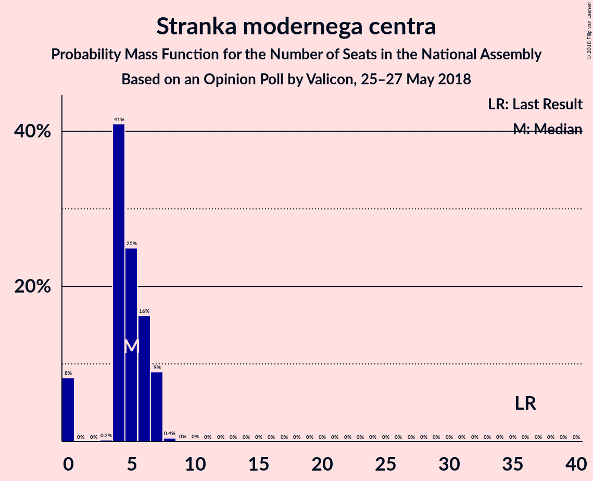
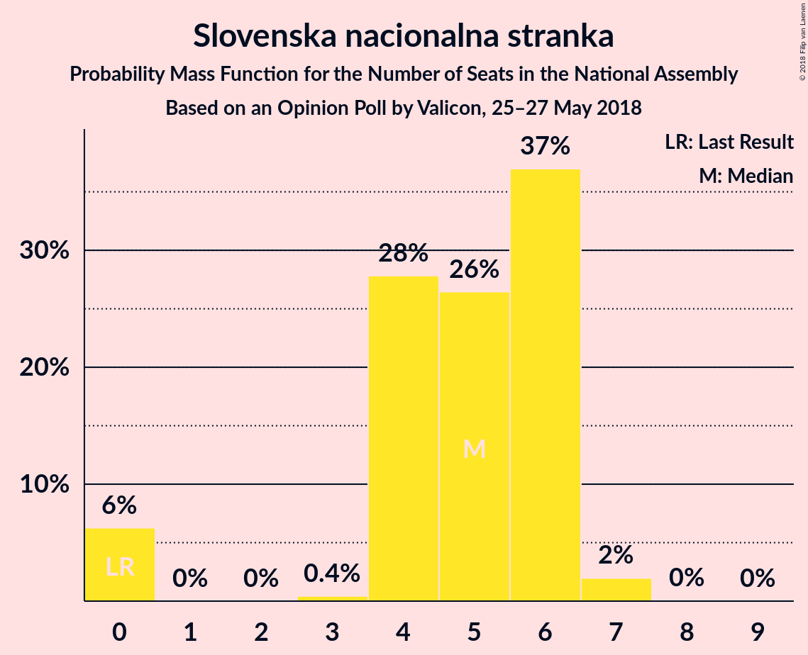
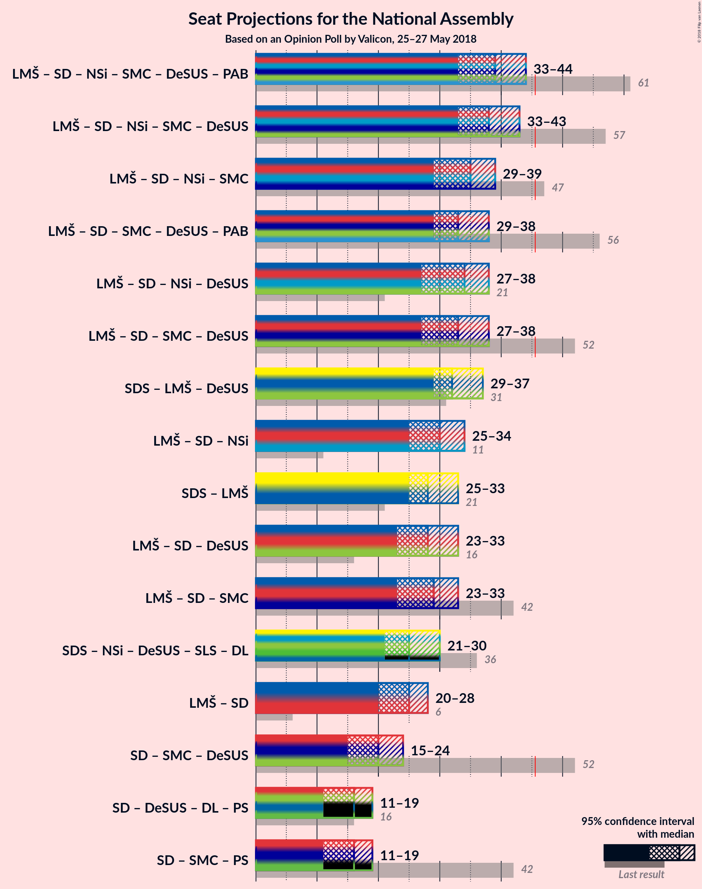

# Opinion Poll by Valicon, 25–27 May 2018

<a href="#voting-intentions">Voting Intentions</a> | <a href="#seats">Seats</a> | <a href="#coalitions">Coalitions</a> | <a href="#technical-information">Technical Information</a>

## Voting Intentions

### Confidence Intervals

| Party | Last Result | Poll Result | 80% Confidence Interval | 90% Confidence Interval | 95% Confidence Interval | 99% Confidence Interval |
|:-----:|:-----------:|:-----------:|:-----------------------:|:-----------------------:|:-----------------------:|:-----------------------:|
| Slovenska demokratska stranka | 20.7% | 17.2% | 15.4–19.3% |14.9–19.9% |14.4–20.4% |13.6–21.5% |
| Lista Marjana Šarca | 0.0% | 13.8% | 12.2–15.8% |11.7–16.3% |11.3–16.8% |10.6–17.7% |
| Socialni demokrati | 6.0% | 11.9% | 10.3–13.7% |9.9–14.2% |9.5–14.7% |8.9–15.6% |
| Levica | 6.0% | 9.8% | 8.4–11.5% |8.0–11.9% |7.7–12.4% |7.0–13.2% |
| Nova Slovenija–Krščanski demokrati | 5.6% | 5.7% | 4.6–7.1% |4.4–7.5% |4.1–7.8% |3.7–8.5% |
| Stranka modernega centra | 34.5% | 5.5% | 4.5–6.9% |4.2–7.3% |4.0–7.6% |3.5–8.3% |
| Slovenska nacionalna stranka | 2.2% | 5.0% | 4.1–6.4% |3.8–6.7% |3.6–7.1% |3.2–7.8% |
| Demokratična stranka upokojencev Slovenije | 10.2% | 4.7% | 3.8–6.0% |3.5–6.4% |3.3–6.7% |2.9–7.4% |
| Stranka Alenke Bratušek | 4.4% | 3.3% | 2.5–4.4% |2.3–4.7% |2.1–5.0% |1.8–5.6% |
| Slovenska ljudska stranka | 4.0% | 2.8% | 2.1–3.8% |1.9–4.1% |1.7–4.4% |1.4–5.0% |
| Glas za otroke in družine–Nova ljudska stranka Slovenije | 0.0% | 0.7% | 0.4–1.3% |0.3–1.5% |0.3–1.7% |0.2–2.0% |

*Note:* The poll result column reflects the actual value used in the calculations. Published results may vary slightly, and in addition be rounded to fewer digits.

## Seats

### Confidence Intervals

| Party | Last Result | Median | 80% Confidence Interval | 90% Confidence Interval | 95% Confidence Interval | 99% Confidence Interval |
|:-----:|:-----------:|:------:|:-----------------------:|:-----------------------:|:-----------------------:|:-----------------------:|
| <a href="#slovenska-demokratska-stranka">Slovenska demokratska stranka</a> | 21 | 15 | 14–17 |13–18 |13–19 |12–21 |
| <a href="#lista-marjana-šarca">Lista Marjana Šarca</a> | 0 | 13 | 12–14 |12–15 |11–16 |10–17 |
| <a href="#socialni-demokrati">Socialni demokrati</a> | 6 | 11 | 10–12 |9–12 |8–12 |8–14 |
| <a href="#levica">Levica</a> | 6 | 9 | 9–10 |8–11 |6–12 |6–12 |
| <a href="#nova-slovenija–krščanski-demokrati">Nova Slovenija–Krščanski demokrati</a> | 5 | 6 | 5–7 |4–7 |4–7 |0–8 |
| <a href="#stranka-modernega-centra">Stranka modernega centra</a> | 36 | 5 | 4–6 |4–6 |4–6 |0–7 |
| <a href="#slovenska-nacionalna-stranka">Slovenska nacionalna stranka</a> | 0 | 5 | 4–5 |0–6 |0–6 |0–7 |
| <a href="#demokratična-stranka-upokojencev-slovenije">Demokratična stranka upokojencev Slovenije</a> | 10 | 4 | 0–5 |0–5 |0–6 |0–7 |
| <a href="#stranka-alenke-bratušek">Stranka Alenke Bratušek</a> | 4 | 0 | 0–3 |0–4 |0–5 |0–5 |
| <a href="#slovenska-ljudska-stranka">Slovenska ljudska stranka</a> | 0 | 0 | 0 |0 |0 |0–4 |
| <a href="#glas-za-otroke-in-družine–nova-ljudska-stranka-slovenije">Glas za otroke in družine–Nova ljudska stranka Slovenije</a> | 0 | 0 | 0 |0 |0 |0 |

### Slovenska demokratska stranka

*For a full overview of the results for this party, see the [Slovenska demokratska stranka](party-slovenskademokratskastranka.html) page.*

| Number of Seats | Probability | Accumulated | Special Marks |
|:---------------:|:-----------:|:-----------:|:-------------:|
| 12 | 0.9% | 100% |  |
| 13 | 7% | 99.1% |  |
| 14 | 4% | 92% |  |
| 15 | 60% | 87% | Median |
| 16 | 14% | 27% |  |
| 17 | 3% | 13% |  |
| 18 | 6% | 10% |  |
| 19 | 3% | 4% |  |
| 20 | 0.5% | 1.3% |  |
| 21 | 0.6% | 0.8% | Last Result |
| 22 | 0.2% | 0.2% |  |
| 23 | 0% | 0% |  |

### Lista Marjana Šarca

*For a full overview of the results for this party, see the [Lista Marjana Šarca](party-listamarjanašarca.html) page.*

| Number of Seats | Probability | Accumulated | Special Marks |
|:---------------:|:-----------:|:-----------:|:-------------:|
| 0 | 0% | 100% | Last Result |
| 1 | 0% | 100% |  |
| 2 | 0% | 100% |  |
| 3 | 0% | 100% |  |
| 4 | 0% | 100% |  |
| 5 | 0% | 100% |  |
| 6 | 0% | 100% |  |
| 7 | 0% | 100% |  |
| 8 | 0% | 100% |  |
| 9 | 0.4% | 100% |  |
| 10 | 0.7% | 99.6% |  |
| 11 | 1.5% | 99.0% |  |
| 12 | 9% | 97% |  |
| 13 | 61% | 89% | Median |
| 14 | 22% | 28% |  |
| 15 | 1.3% | 5% |  |
| 16 | 3% | 4% |  |
| 17 | 0.5% | 0.7% |  |
| 18 | 0.2% | 0.2% |  |
| 19 | 0% | 0% |  |

### Socialni demokrati

*For a full overview of the results for this party, see the [Socialni demokrati](party-socialnidemokrati.html) page.*

| Number of Seats | Probability | Accumulated | Special Marks |
|:---------------:|:-----------:|:-----------:|:-------------:|
| 6 | 0% | 100% | Last Result |
| 7 | 0.1% | 100% |  |
| 8 | 4% | 99.9% |  |
| 9 | 2% | 96% |  |
| 10 | 4% | 94% |  |
| 11 | 77% | 90% | Median |
| 12 | 10% | 12% |  |
| 13 | 0.9% | 2% |  |
| 14 | 0.7% | 1.0% |  |
| 15 | 0.1% | 0.2% |  |
| 16 | 0% | 0.1% |  |
| 17 | 0% | 0% |  |

### Levica

*For a full overview of the results for this party, see the [Levica](party-levica.html) page.*

| Number of Seats | Probability | Accumulated | Special Marks |
|:---------------:|:-----------:|:-----------:|:-------------:|
| 6 | 3% | 100% | Last Result |
| 7 | 1.0% | 97% |  |
| 8 | 3% | 96% |  |
| 9 | 78% | 93% | Median |
| 10 | 5% | 15% |  |
| 11 | 7% | 10% |  |
| 12 | 3% | 3% |  |
| 13 | 0% | 0% |  |

### Nova Slovenija–Krščanski demokrati

*For a full overview of the results for this party, see the [Nova Slovenija–Krščanski demokrati](party-novaslovenija–krščanskidemokrati.html) page.*

| Number of Seats | Probability | Accumulated | Special Marks |
|:---------------:|:-----------:|:-----------:|:-------------:|
| 0 | 1.1% | 100% |  |
| 1 | 0% | 98.9% |  |
| 2 | 0% | 98.9% |  |
| 3 | 0.1% | 98.9% |  |
| 4 | 6% | 98.7% |  |
| 5 | 8% | 92% | Last Result |
| 6 | 66% | 85% | Median |
| 7 | 17% | 19% |  |
| 8 | 2% | 2% |  |
| 9 | 0.1% | 0.1% |  |
| 10 | 0% | 0% |  |

### Stranka modernega centra

*For a full overview of the results for this party, see the [Stranka modernega centra](party-strankamodernegacentra.html) page.*

| Number of Seats | Probability | Accumulated | Special Marks |
|:---------------:|:-----------:|:-----------:|:-------------:|
| 0 | 0.5% | 100% |  |
| 1 | 0% | 99.5% |  |
| 2 | 0% | 99.5% |  |
| 3 | 1.0% | 99.5% |  |
| 4 | 11% | 98% |  |
| 5 | 66% | 87% | Median |
| 6 | 20% | 21% |  |
| 7 | 0.7% | 0.9% |  |
| 8 | 0.1% | 0.3% |  |
| 9 | 0.1% | 0.1% |  |
| 10 | 0% | 0% |  |
| 11 | 0% | 0% |  |
| 12 | 0% | 0% |  |
| 13 | 0% | 0% |  |
| 14 | 0% | 0% |  |
| 15 | 0% | 0% |  |
| 16 | 0% | 0% |  |
| 17 | 0% | 0% |  |
| 18 | 0% | 0% |  |
| 19 | 0% | 0% |  |
| 20 | 0% | 0% |  |
| 21 | 0% | 0% |  |
| 22 | 0% | 0% |  |
| 23 | 0% | 0% |  |
| 24 | 0% | 0% |  |
| 25 | 0% | 0% |  |
| 26 | 0% | 0% |  |
| 27 | 0% | 0% |  |
| 28 | 0% | 0% |  |
| 29 | 0% | 0% |  |
| 30 | 0% | 0% |  |
| 31 | 0% | 0% |  |
| 32 | 0% | 0% |  |
| 33 | 0% | 0% |  |
| 34 | 0% | 0% |  |
| 35 | 0% | 0% |  |
| 36 | 0% | 0% | Last Result |

### Slovenska nacionalna stranka

*For a full overview of the results for this party, see the [Slovenska nacionalna stranka](party-slovenskanacionalnastranka.html) page.*

| Number of Seats | Probability | Accumulated | Special Marks |
|:---------------:|:-----------:|:-----------:|:-------------:|
| 0 | 5% | 100% | Last Result |
| 1 | 0% | 95% |  |
| 2 | 0% | 95% |  |
| 3 | 0% | 95% |  |
| 4 | 10% | 95% |  |
| 5 | 79% | 85% | Median |
| 6 | 4% | 5% |  |
| 7 | 1.3% | 1.3% |  |
| 8 | 0% | 0% |  |

### Demokratična stranka upokojencev Slovenije

*For a full overview of the results for this party, see the [Demokratična stranka upokojencev Slovenije](party-demokratičnastrankaupokojencevslovenije.html) page.*

| Number of Seats | Probability | Accumulated | Special Marks |
|:---------------:|:-----------:|:-----------:|:-------------:|
| 0 | 16% | 100% |  |
| 1 | 0% | 84% |  |
| 2 | 0% | 84% |  |
| 3 | 0.1% | 84% |  |
| 4 | 70% | 84% | Median |
| 5 | 10% | 13% |  |
| 6 | 3% | 4% |  |
| 7 | 0.6% | 0.9% |  |
| 8 | 0.3% | 0.3% |  |
| 9 | 0% | 0% |  |
| 10 | 0% | 0% | Last Result |

### Stranka Alenke Bratušek

*For a full overview of the results for this party, see the [Stranka Alenke Bratušek](party-strankaalenkebratušek.html) page.*

| Number of Seats | Probability | Accumulated | Special Marks |
|:---------------:|:-----------:|:-----------:|:-------------:|
| 0 | 88% | 100% | Median |
| 1 | 0% | 12% |  |
| 2 | 0% | 12% |  |
| 3 | 4% | 12% |  |
| 4 | 5% | 8% | Last Result |
| 5 | 3% | 3% |  |
| 6 | 0% | 0% |  |

### Slovenska ljudska stranka

*For a full overview of the results for this party, see the [Slovenska ljudska stranka](party-slovenskaljudskastranka.html) page.*

| Number of Seats | Probability | Accumulated | Special Marks |
|:---------------:|:-----------:|:-----------:|:-------------:|
| 0 | 98% | 100% | Last Result, Median |
| 1 | 0% | 2% |  |
| 2 | 0% | 2% |  |
| 3 | 0.1% | 2% |  |
| 4 | 1.1% | 1.4% |  |
| 5 | 0.3% | 0.3% |  |
| 6 | 0% | 0% |  |

### Glas za otroke in družine–Nova ljudska stranka Slovenije

*For a full overview of the results for this party, see the [Glas za otroke in družine–Nova ljudska stranka Slovenije](party-glaszaotrokeindružine–novaljudskastrankaslovenije.html) page.*

| Number of Seats | Probability | Accumulated | Special Marks |
|:---------------:|:-----------:|:-----------:|:-------------:|
| 0 | 100% | 100% | Last Result, Median |

## Coalitions

### Confidence Intervals

| Coalition | Last Result | Median | Majority? | 80% Confidence Interval | 90% Confidence Interval | 95% Confidence Interval | 99% Confidence Interval |
|:---------:|:-----------:|:------:|:---------:|:-----------------------:|:-----------------------:|:-----------------------:|:-----------------------:|
| Lista Marjana Šarca – Socialni demokrati – Nova Slovenija–Krščanski demokrati – Stranka modernega centra – Demokratična stranka upokojencev Slovenije – Stranka Alenke Bratušek | 61 | 39 | 0.5% | 38–41 | 38–42 | 36–44 | 34–46 |
| Lista Marjana Šarca – Socialni demokrati – Nova Slovenija–Krščanski demokrati – Stranka modernega centra – Demokratična stranka upokojencev Slovenije | 57 | 39 | 0% | 36–41 | 35–41 | 34–42 | 32–45 |
| Lista Marjana Šarca – Socialni demokrati – Stranka modernega centra – Demokratična stranka upokojencev Slovenije – Stranka Alenke Bratušek | 56 | 33 | 0% | 31–35 | 31–37 | 31–38 | 28–40 |
| Lista Marjana Šarca – Socialni demokrati – Nova Slovenija–Krščanski demokrati – Stranka modernega centra | 47 | 35 | 0% | 33–38 | 32–38 | 30–38 | 29–40 |
| Lista Marjana Šarca – Socialni demokrati – Nova Slovenija–Krščanski demokrati – Demokratična stranka upokojencev Slovenije | 21 | 34 | 0% | 32–36 | 30–37 | 29–38 | 28–39 |
| Lista Marjana Šarca – Socialni demokrati – Stranka modernega centra – Demokratična stranka upokojencev Slovenije | 52 | 33 | 0% | 31–34 | 30–36 | 30–37 | 28–40 |
| Slovenska demokratska stranka – Lista Marjana Šarca – Demokratična stranka upokojencev Slovenije | 31 | 32 | 0% | 30–35 | 30–36 | 30–36 | 29–38 |
| Lista Marjana Šarca – Socialni demokrati – Demokratična stranka upokojencev Slovenije | 16 | 28 | 0% | 25–29 | 25–31 | 25–33 | 23–34 |
| Lista Marjana Šarca – Socialni demokrati – Nova Slovenija–Krščanski demokrati | 11 | 30 | 0% | 29–32 | 26–32 | 24–33 | 24–34 |
| Lista Marjana Šarca – Socialni demokrati – Stranka modernega centra | 42 | 29 | 0% | 28–31 | 27–31 | 26–32 | 25–35 |
| Slovenska demokratska stranka – Lista Marjana Šarca | 21 | 28 | 0% | 28–30 | 27–31 | 25–32 | 25–35 |
| Lista Marjana Šarca – Socialni demokrati | 6 | 24 | 0% | 23–25 | 21–26 | 20–28 | 20–29 |
| Socialni demokrati – Stranka modernega centra – Demokratična stranka upokojencev Slovenije | 52 | 20 | 0% | 17–21 | 17–21 | 16–22 | 16–24 |

### Lista Marjana Šarca – Socialni demokrati – Nova Slovenija–Krščanski demokrati – Stranka modernega centra – Demokratična stranka upokojencev Slovenije – Stranka Alenke Bratušek

| Number of Seats | Probability | Accumulated | Special Marks |
|:---------------:|:-----------:|:-----------:|:-------------:|
| 31 | 0.1% | 100% |  |
| 32 | 0% | 99.9% |  |
| 33 | 0.1% | 99.9% |  |
| 34 | 0.7% | 99.8% |  |
| 35 | 0.4% | 99.0% |  |
| 36 | 2% | 98.6% |  |
| 37 | 2% | 97% |  |
| 38 | 18% | 95% |  |
| 39 | 60% | 77% | Median |
| 40 | 0.7% | 18% |  |
| 41 | 10% | 17% |  |
| 42 | 3% | 7% |  |
| 43 | 0.2% | 4% |  |
| 44 | 3% | 4% |  |
| 45 | 0.9% | 1.4% |  |
| 46 | 0.4% | 0.5% | Majority |
| 47 | 0% | 0.1% |  |
| 48 | 0.1% | 0.1% |  |
| 49 | 0% | 0% |  |
| 50 | 0% | 0% |  |
| 51 | 0% | 0% |  |
| 52 | 0% | 0% |  |
| 53 | 0% | 0% |  |
| 54 | 0% | 0% |  |
| 55 | 0% | 0% |  |
| 56 | 0% | 0% |  |
| 57 | 0% | 0% |  |
| 58 | 0% | 0% |  |
| 59 | 0% | 0% |  |
| 60 | 0% | 0% |  |
| 61 | 0% | 0% | Last Result |

### Lista Marjana Šarca – Socialni demokrati – Nova Slovenija–Krščanski demokrati – Stranka modernega centra – Demokratična stranka upokojencev Slovenije

| Number of Seats | Probability | Accumulated | Special Marks |
|:---------------:|:-----------:|:-----------:|:-------------:|
| 29 | 0.2% | 100% |  |
| 30 | 0.1% | 99.8% |  |
| 31 | 0.1% | 99.7% |  |
| 32 | 0.1% | 99.6% |  |
| 33 | 0.3% | 99.5% |  |
| 34 | 3% | 99.2% |  |
| 35 | 3% | 96% |  |
| 36 | 4% | 93% |  |
| 37 | 2% | 90% |  |
| 38 | 15% | 88% |  |
| 39 | 59% | 73% | Median |
| 40 | 3% | 14% |  |
| 41 | 7% | 12% |  |
| 42 | 3% | 4% |  |
| 43 | 0.2% | 1.2% |  |
| 44 | 0.5% | 1.0% |  |
| 45 | 0.5% | 0.5% |  |
| 46 | 0% | 0% | Majority |
| 47 | 0% | 0% |  |
| 48 | 0% | 0% |  |
| 49 | 0% | 0% |  |
| 50 | 0% | 0% |  |
| 51 | 0% | 0% |  |
| 52 | 0% | 0% |  |
| 53 | 0% | 0% |  |
| 54 | 0% | 0% |  |
| 55 | 0% | 0% |  |
| 56 | 0% | 0% |  |
| 57 | 0% | 0% | Last Result |

### Lista Marjana Šarca – Socialni demokrati – Stranka modernega centra – Demokratična stranka upokojencev Slovenije – Stranka Alenke Bratušek

| Number of Seats | Probability | Accumulated | Special Marks |
|:---------------:|:-----------:|:-----------:|:-------------:|
| 26 | 0% | 100% |  |
| 27 | 0.1% | 99.9% |  |
| 28 | 0.4% | 99.9% |  |
| 29 | 0.4% | 99.5% |  |
| 30 | 0.4% | 99.1% |  |
| 31 | 15% | 98.7% |  |
| 32 | 2% | 84% |  |
| 33 | 58% | 82% | Median |
| 34 | 10% | 24% |  |
| 35 | 4% | 14% |  |
| 36 | 2% | 10% |  |
| 37 | 4% | 8% |  |
| 38 | 3% | 4% |  |
| 39 | 0.2% | 1.5% |  |
| 40 | 0.8% | 1.3% |  |
| 41 | 0.3% | 0.4% |  |
| 42 | 0.1% | 0.1% |  |
| 43 | 0% | 0% |  |
| 44 | 0% | 0% |  |
| 45 | 0% | 0% |  |
| 46 | 0% | 0% | Majority |
| 47 | 0% | 0% |  |
| 48 | 0% | 0% |  |
| 49 | 0% | 0% |  |
| 50 | 0% | 0% |  |
| 51 | 0% | 0% |  |
| 52 | 0% | 0% |  |
| 53 | 0% | 0% |  |
| 54 | 0% | 0% |  |
| 55 | 0% | 0% |  |
| 56 | 0% | 0% | Last Result |

### Lista Marjana Šarca – Socialni demokrati – Nova Slovenija–Krščanski demokrati – Stranka modernega centra

| Number of Seats | Probability | Accumulated | Special Marks |
|:---------------:|:-----------:|:-----------:|:-------------:|
| 24 | 0.1% | 100% |  |
| 25 | 0% | 99.9% |  |
| 26 | 0% | 99.9% |  |
| 27 | 0.1% | 99.9% |  |
| 28 | 0% | 99.8% |  |
| 29 | 0.5% | 99.8% |  |
| 30 | 3% | 99.2% |  |
| 31 | 0.7% | 96% |  |
| 32 | 4% | 95% |  |
| 33 | 2% | 92% |  |
| 34 | 7% | 90% |  |
| 35 | 59% | 83% | Median |
| 36 | 3% | 24% |  |
| 37 | 7% | 21% |  |
| 38 | 13% | 14% |  |
| 39 | 0.1% | 1.2% |  |
| 40 | 0.9% | 1.1% |  |
| 41 | 0.1% | 0.2% |  |
| 42 | 0.1% | 0.1% |  |
| 43 | 0% | 0% |  |
| 44 | 0% | 0% |  |
| 45 | 0% | 0% |  |
| 46 | 0% | 0% | Majority |
| 47 | 0% | 0% | Last Result |

### Lista Marjana Šarca – Socialni demokrati – Nova Slovenija–Krščanski demokrati – Demokratična stranka upokojencev Slovenije

| Number of Seats | Probability | Accumulated | Special Marks |
|:---------------:|:-----------:|:-----------:|:-------------:|
| 21 | 0% | 100% | Last Result |
| 22 | 0% | 100% |  |
| 23 | 0% | 100% |  |
| 24 | 0% | 100% |  |
| 25 | 0.1% | 100% |  |
| 26 | 0.2% | 99.9% |  |
| 27 | 0.1% | 99.7% |  |
| 28 | 0.3% | 99.7% |  |
| 29 | 4% | 99.4% |  |
| 30 | 4% | 96% |  |
| 31 | 0.5% | 92% |  |
| 32 | 16% | 92% |  |
| 33 | 4% | 76% |  |
| 34 | 58% | 72% | Median |
| 35 | 1.0% | 14% |  |
| 36 | 6% | 13% |  |
| 37 | 3% | 6% |  |
| 38 | 3% | 4% |  |
| 39 | 0.9% | 1.0% |  |
| 40 | 0% | 0.1% |  |
| 41 | 0% | 0.1% |  |
| 42 | 0% | 0.1% |  |
| 43 | 0% | 0.1% |  |
| 44 | 0.1% | 0.1% |  |
| 45 | 0% | 0% |  |

### Lista Marjana Šarca – Socialni demokrati – Stranka modernega centra – Demokratična stranka upokojencev Slovenije

| Number of Seats | Probability | Accumulated | Special Marks |
|:---------------:|:-----------:|:-----------:|:-------------:|
| 23 | 0.2% | 100% |  |
| 24 | 0% | 99.8% |  |
| 25 | 0% | 99.8% |  |
| 26 | 0% | 99.7% |  |
| 27 | 0.2% | 99.7% |  |
| 28 | 1.0% | 99.5% |  |
| 29 | 0.6% | 98.5% |  |
| 30 | 3% | 98% |  |
| 31 | 19% | 95% |  |
| 32 | 2% | 76% |  |
| 33 | 58% | 75% | Median |
| 34 | 8% | 16% |  |
| 35 | 3% | 8% |  |
| 36 | 0.5% | 5% |  |
| 37 | 3% | 5% |  |
| 38 | 0.5% | 1.2% |  |
| 39 | 0.1% | 0.6% |  |
| 40 | 0.5% | 0.5% |  |
| 41 | 0% | 0% |  |
| 42 | 0% | 0% |  |
| 43 | 0% | 0% |  |
| 44 | 0% | 0% |  |
| 45 | 0% | 0% |  |
| 46 | 0% | 0% | Majority |
| 47 | 0% | 0% |  |
| 48 | 0% | 0% |  |
| 49 | 0% | 0% |  |
| 50 | 0% | 0% |  |
| 51 | 0% | 0% |  |
| 52 | 0% | 0% | Last Result |

### Slovenska demokratska stranka – Lista Marjana Šarca – Demokratična stranka upokojencev Slovenije

| Number of Seats | Probability | Accumulated | Special Marks |
|:---------------:|:-----------:|:-----------:|:-------------:|
| 26 | 0.1% | 100% |  |
| 27 | 0% | 99.9% |  |
| 28 | 0.1% | 99.8% |  |
| 29 | 1.0% | 99.8% |  |
| 30 | 14% | 98.7% |  |
| 31 | 9% | 85% | Last Result |
| 32 | 58% | 76% | Median |
| 33 | 3% | 18% |  |
| 34 | 4% | 14% |  |
| 35 | 4% | 10% |  |
| 36 | 4% | 7% |  |
| 37 | 1.4% | 2% |  |
| 38 | 0.4% | 0.8% |  |
| 39 | 0.2% | 0.4% |  |
| 40 | 0.1% | 0.2% |  |
| 41 | 0% | 0.1% |  |
| 42 | 0% | 0% |  |

### Lista Marjana Šarca – Socialni demokrati – Demokratična stranka upokojencev Slovenije

| Number of Seats | Probability | Accumulated | Special Marks |
|:---------------:|:-----------:|:-----------:|:-------------:|
| 16 | 0% | 100% | Last Result |
| 17 | 0% | 100% |  |
| 18 | 0% | 100% |  |
| 19 | 0% | 100% |  |
| 20 | 0% | 100% |  |
| 21 | 0.1% | 100% |  |
| 22 | 0.1% | 99.9% |  |
| 23 | 1.2% | 99.8% |  |
| 24 | 0.4% | 98.6% |  |
| 25 | 18% | 98% |  |
| 26 | 2% | 80% |  |
| 27 | 4% | 78% |  |
| 28 | 58% | 74% | Median |
| 29 | 6% | 16% |  |
| 30 | 3% | 10% |  |
| 31 | 2% | 7% |  |
| 32 | 0.4% | 5% |  |
| 33 | 3% | 4% |  |
| 34 | 0.7% | 0.8% |  |
| 35 | 0% | 0.1% |  |
| 36 | 0% | 0.1% |  |
| 37 | 0.1% | 0.1% |  |
| 38 | 0% | 0% |  |

### Lista Marjana Šarca – Socialni demokrati – Nova Slovenija–Krščanski demokrati

| Number of Seats | Probability | Accumulated | Special Marks |
|:---------------:|:-----------:|:-----------:|:-------------:|
| 11 | 0% | 100% | Last Result |
| 12 | 0% | 100% |  |
| 13 | 0% | 100% |  |
| 14 | 0% | 100% |  |
| 15 | 0% | 100% |  |
| 16 | 0% | 100% |  |
| 17 | 0% | 100% |  |
| 18 | 0% | 100% |  |
| 19 | 0.1% | 100% |  |
| 20 | 0% | 99.9% |  |
| 21 | 0% | 99.9% |  |
| 22 | 0.1% | 99.9% |  |
| 23 | 0.1% | 99.8% |  |
| 24 | 2% | 99.7% |  |
| 25 | 0.5% | 97% |  |
| 26 | 2% | 97% |  |
| 27 | 1.0% | 95% |  |
| 28 | 3% | 94% |  |
| 29 | 5% | 90% |  |
| 30 | 61% | 86% | Median |
| 31 | 1.2% | 24% |  |
| 32 | 19% | 23% |  |
| 33 | 3% | 4% |  |
| 34 | 0.7% | 1.2% |  |
| 35 | 0.3% | 0.5% |  |
| 36 | 0.1% | 0.2% |  |
| 37 | 0% | 0.1% |  |
| 38 | 0.1% | 0.1% |  |
| 39 | 0% | 0% |  |

### Lista Marjana Šarca – Socialni demokrati – Stranka modernega centra

| Number of Seats | Probability | Accumulated | Special Marks |
|:---------------:|:-----------:|:-----------:|:-------------:|
| 23 | 0.2% | 100% |  |
| 24 | 0.2% | 99.7% |  |
| 25 | 0.4% | 99.5% |  |
| 26 | 4% | 99.1% |  |
| 27 | 4% | 95% |  |
| 28 | 4% | 91% |  |
| 29 | 59% | 87% | Median |
| 30 | 10% | 28% |  |
| 31 | 13% | 18% |  |
| 32 | 3% | 5% |  |
| 33 | 0.2% | 1.4% |  |
| 34 | 0.4% | 1.1% |  |
| 35 | 0.5% | 0.7% |  |
| 36 | 0.1% | 0.2% |  |
| 37 | 0% | 0.1% |  |
| 38 | 0% | 0.1% |  |
| 39 | 0% | 0% |  |
| 40 | 0% | 0% |  |
| 41 | 0% | 0% |  |
| 42 | 0% | 0% | Last Result |

### Slovenska demokratska stranka – Lista Marjana Šarca

| Number of Seats | Probability | Accumulated | Special Marks |
|:---------------:|:-----------:|:-----------:|:-------------:|
| 21 | 0% | 100% | Last Result |
| 22 | 0% | 100% |  |
| 23 | 0.1% | 100% |  |
| 24 | 0.1% | 99.9% |  |
| 25 | 3% | 99.9% |  |
| 26 | 0.8% | 97% |  |
| 27 | 5% | 96% |  |
| 28 | 60% | 90% | Median |
| 29 | 1.4% | 30% |  |
| 30 | 20% | 29% |  |
| 31 | 5% | 8% |  |
| 32 | 2% | 4% |  |
| 33 | 0.2% | 1.2% |  |
| 34 | 0.4% | 1.1% |  |
| 35 | 0.2% | 0.7% |  |
| 36 | 0% | 0.5% |  |
| 37 | 0.4% | 0.5% |  |
| 38 | 0.1% | 0.1% |  |
| 39 | 0% | 0% |  |

### Lista Marjana Šarca – Socialni demokrati

| Number of Seats | Probability | Accumulated | Special Marks |
|:---------------:|:-----------:|:-----------:|:-------------:|
| 6 | 0% | 100% | Last Result |
| 7 | 0% | 100% |  |
| 8 | 0% | 100% |  |
| 9 | 0% | 100% |  |
| 10 | 0% | 100% |  |
| 11 | 0% | 100% |  |
| 12 | 0% | 100% |  |
| 13 | 0% | 100% |  |
| 14 | 0% | 100% |  |
| 15 | 0% | 100% |  |
| 16 | 0% | 100% |  |
| 17 | 0% | 100% |  |
| 18 | 0.1% | 100% |  |
| 19 | 0.2% | 99.9% |  |
| 20 | 3% | 99.8% |  |
| 21 | 3% | 97% |  |
| 22 | 0.7% | 94% |  |
| 23 | 5% | 93% |  |
| 24 | 60% | 88% | Median |
| 25 | 18% | 28% |  |
| 26 | 5% | 9% |  |
| 27 | 0.8% | 4% |  |
| 28 | 3% | 4% |  |
| 29 | 0.8% | 1.0% |  |
| 30 | 0.1% | 0.2% |  |
| 31 | 0.1% | 0.1% |  |
| 32 | 0% | 0% |  |

### Socialni demokrati – Stranka modernega centra – Demokratična stranka upokojencev Slovenije

| Number of Seats | Probability | Accumulated | Special Marks |
|:---------------:|:-----------:|:-----------:|:-------------:|
| 10 | 0.2% | 100% |  |
| 11 | 0% | 99.8% |  |
| 12 | 0% | 99.8% |  |
| 13 | 0% | 99.8% |  |
| 14 | 0.1% | 99.7% |  |
| 15 | 0.1% | 99.6% |  |
| 16 | 3% | 99.5% |  |
| 17 | 13% | 96% |  |
| 18 | 2% | 83% |  |
| 19 | 6% | 81% |  |
| 20 | 63% | 75% | Median |
| 21 | 7% | 12% |  |
| 22 | 2% | 5% |  |
| 23 | 1.2% | 2% |  |
| 24 | 0.9% | 1.2% |  |
| 25 | 0.2% | 0.2% |  |
| 26 | 0% | 0.1% |  |
| 27 | 0% | 0% |  |
| 28 | 0% | 0% |  |
| 29 | 0% | 0% |  |
| 30 | 0% | 0% |  |
| 31 | 0% | 0% |  |
| 32 | 0% | 0% |  |
| 33 | 0% | 0% |  |
| 34 | 0% | 0% |  |
| 35 | 0% | 0% |  |
| 36 | 0% | 0% |  |
| 37 | 0% | 0% |  |
| 38 | 0% | 0% |  |
| 39 | 0% | 0% |  |
| 40 | 0% | 0% |  |
| 41 | 0% | 0% |  |
| 42 | 0% | 0% |  |
| 43 | 0% | 0% |  |
| 44 | 0% | 0% |  |
| 45 | 0% | 0% |  |
| 46 | 0% | 0% | Majority |
| 47 | 0% | 0% |  |
| 48 | 0% | 0% |  |
| 49 | 0% | 0% |  |
| 50 | 0% | 0% |  |
| 51 | 0% | 0% |  |
| 52 | 0% | 0% | Last Result |

## Technical Information

### Opinion Poll

+ **Polling firm:** Valicon
+ **Commissioner(s):** —
+ **Fieldwork period:** 25–27 May 2018

### Calculations

+ **Sample size:** 615
+ **Simulations done:** 131,072
+ **Error estimate:** 2.50%

