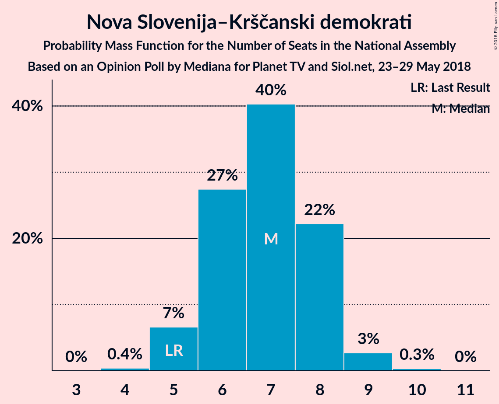
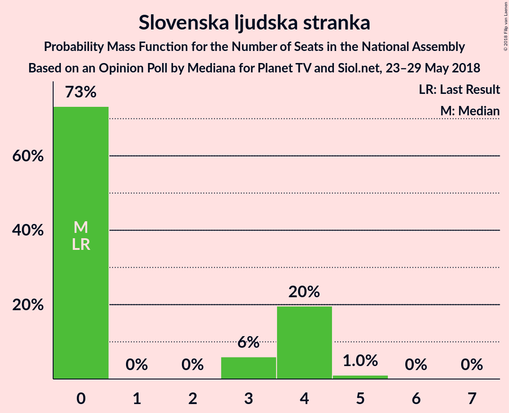

# Opinion Poll by Mediana for Planet TV and Siol.net, 23–29 May 2018

<a href="#voting-intentions">Voting Intentions</a> | <a href="#seats">Seats</a> | <a href="#coalitions">Coalitions</a> | <a href="#technical-information">Technical Information</a>

## Voting Intentions

### Confidence Intervals

| Party | Last Result | Poll Result | 80% Confidence Interval | 90% Confidence Interval | 95% Confidence Interval | 99% Confidence Interval |
|:-----:|:-----------:|:-----------:|:-----------------------:|:-----------------------:|:-----------------------:|:-----------------------:|
| Slovenska demokratska stranka | 20.7% | 28.5% | 26.4–30.7% |25.8–31.4% |25.3–31.9% |24.3–33.0% |
| Lista Marjana Šarca | 0.0% | 15.4% | 13.7–17.2% |13.3–17.7% |12.9–18.2% |12.2–19.1% |
| Levica | 6.0% | 9.8% | 8.5–11.4% |8.2–11.8% |7.8–12.2% |7.3–13.0% |
| Socialni demokrati | 6.0% | 9.3% | 8.0–10.8% |7.7–11.2% |7.4–11.6% |6.8–12.4% |
| Nova Slovenija–Krščanski demokrati | 5.6% | 7.5% | 6.3–8.9% |6.0–9.3% |5.8–9.6% |5.3–10.3% |
| Demokratična stranka upokojencev Slovenije | 10.2% | 7.2% | 6.1–8.6% |5.8–9.0% |5.5–9.3% |5.0–10.0% |
| Stranka modernega centra | 34.5% | 6.9% | 5.8–8.3% |5.5–8.7% |5.3–9.0% |4.8–9.7% |
| Slovenska nacionalna stranka | 2.2% | 6.5% | 5.5–7.8% |5.2–8.2% |4.9–8.6% |4.5–9.2% |
| Stranka Alenke Bratušek | 4.4% | 4.8% | 3.9–6.0% |3.7–6.4% |3.5–6.7% |3.1–7.3% |
| Slovenska ljudska stranka | 4.0% | 3.5% | 2.7–4.5% |2.5–4.8% |2.3–5.1% |2.0–5.6% |
| Glas za otroke in družine–Nova ljudska stranka Slovenije | 0.0% | 0.1% | 0.1–0.5% |0.0–0.7% |0.0–0.8% |0.0–1.0% |

*Note:* The poll result column reflects the actual value used in the calculations. Published results may vary slightly, and in addition be rounded to fewer digits.

## Seats

### Confidence Intervals

| Party | Last Result | Median | 80% Confidence Interval | 90% Confidence Interval | 95% Confidence Interval | 99% Confidence Interval |
|:-----:|:-----------:|:------:|:-----------------------:|:-----------------------:|:-----------------------:|:-----------------------:|
| <a href="#slovenska-demokratska-stranka">Slovenska demokratska stranka</a> | 21 | 27 | 25–29 |24–30 |23–30 |22–31 |
| <a href="#lista-marjana-šarca">Lista Marjana Šarca</a> | 0 | 14 | 12–16 |12–17 |12–17 |11–18 |
| <a href="#levica">Levica</a> | 6 | 9 | 8–10 |7–11 |7–11 |6–12 |
| <a href="#socialni-demokrati">Socialni demokrati</a> | 6 | 8 | 7–10 |7–10 |6–10 |6–11 |
| <a href="#nova-slovenija–krščanski-demokrati">Nova Slovenija–Krščanski demokrati</a> | 5 | 7 | 5–8 |5–8 |5–9 |4–9 |
| <a href="#demokratična-stranka-upokojencev-slovenije">Demokratična stranka upokojencev Slovenije</a> | 10 | 6 | 5–8 |5–8 |5–8 |4–9 |
| <a href="#stranka-modernega-centra">Stranka modernega centra</a> | 36 | 6 | 5–7 |5–8 |5–8 |4–9 |
| <a href="#slovenska-nacionalna-stranka">Slovenska nacionalna stranka</a> | 0 | 6 | 4–7 |4–7 |4–8 |4–9 |
| <a href="#stranka-alenke-bratušek">Stranka Alenke Bratušek</a> | 4 | 4 | 0–5 |0–6 |0–6 |0–6 |
| <a href="#slovenska-ljudska-stranka">Slovenska ljudska stranka</a> | 0 | 0 | 0–4 |0–4 |0–4 |0–5 |
| <a href="#glas-za-otroke-in-družine–nova-ljudska-stranka-slovenije">Glas za otroke in družine–Nova ljudska stranka Slovenije</a> | 0 | 0 | 0 |0 |0 |0 |

### Slovenska demokratska stranka

*For a full overview of the results for this party, see the [Slovenska demokratska stranka](party-slovenskademokratskastranka.html) page.*

| Number of Seats | Probability | Accumulated | Special Marks |
|:---------------:|:-----------:|:-----------:|:-------------:|
| 21 | 0.1% | 100% | Last Result |
| 22 | 1.0% | 99.9% |  |
| 23 | 2% | 98.9% |  |
| 24 | 6% | 97% |  |
| 25 | 12% | 91% |  |
| 26 | 18% | 78% |  |
| 27 | 28% | 61% | Median |
| 28 | 16% | 33% |  |
| 29 | 11% | 17% |  |
| 30 | 5% | 6% |  |
| 31 | 0.5% | 1.0% |  |
| 32 | 0.4% | 0.4% |  |
| 33 | 0% | 0.1% |  |
| 34 | 0% | 0% |  |

### Lista Marjana Šarca

*For a full overview of the results for this party, see the [Lista Marjana Šarca](party-listamarjanašarca.html) page.*

| Number of Seats | Probability | Accumulated | Special Marks |
|:---------------:|:-----------:|:-----------:|:-------------:|
| 0 | 0% | 100% | Last Result |
| 1 | 0% | 100% |  |
| 2 | 0% | 100% |  |
| 3 | 0% | 100% |  |
| 4 | 0% | 100% |  |
| 5 | 0% | 100% |  |
| 6 | 0% | 100% |  |
| 7 | 0% | 100% |  |
| 8 | 0% | 100% |  |
| 9 | 0% | 100% |  |
| 10 | 0.1% | 100% |  |
| 11 | 1.4% | 99.9% |  |
| 12 | 15% | 98% |  |
| 13 | 29% | 83% |  |
| 14 | 16% | 55% | Median |
| 15 | 19% | 39% |  |
| 16 | 12% | 20% |  |
| 17 | 8% | 9% |  |
| 18 | 0.4% | 0.5% |  |
| 19 | 0.1% | 0.1% |  |
| 20 | 0% | 0% |  |

### Levica

*For a full overview of the results for this party, see the [Levica](party-levica.html) page.*

| Number of Seats | Probability | Accumulated | Special Marks |
|:---------------:|:-----------:|:-----------:|:-------------:|
| 6 | 0.9% | 100% | Last Result |
| 7 | 7% | 99.1% |  |
| 8 | 17% | 92% |  |
| 9 | 44% | 75% | Median |
| 10 | 25% | 31% |  |
| 11 | 5% | 6% |  |
| 12 | 0.7% | 1.1% |  |
| 13 | 0.4% | 0.4% |  |
| 14 | 0% | 0% |  |

### Socialni demokrati

*For a full overview of the results for this party, see the [Socialni demokrati](party-socialnidemokrati.html) page.*

| Number of Seats | Probability | Accumulated | Special Marks |
|:---------------:|:-----------:|:-----------:|:-------------:|
| 5 | 0.1% | 100% |  |
| 6 | 3% | 99.9% | Last Result |
| 7 | 15% | 97% |  |
| 8 | 35% | 82% | Median |
| 9 | 20% | 47% |  |
| 10 | 26% | 27% |  |
| 11 | 0.9% | 1.2% |  |
| 12 | 0.3% | 0.3% |  |
| 13 | 0% | 0% |  |

### Nova Slovenija–Krščanski demokrati

*For a full overview of the results for this party, see the [Nova Slovenija–Krščanski demokrati](party-novaslovenija–krščanskidemokrati.html) page.*

| Number of Seats | Probability | Accumulated | Special Marks |
|:---------------:|:-----------:|:-----------:|:-------------:|
| 4 | 1.0% | 100% |  |
| 5 | 10% | 99.0% | Last Result |
| 6 | 17% | 89% |  |
| 7 | 60% | 72% | Median |
| 8 | 9% | 12% |  |
| 9 | 3% | 3% |  |
| 10 | 0.5% | 0.5% |  |
| 11 | 0% | 0% |  |

### Demokratična stranka upokojencev Slovenije

*For a full overview of the results for this party, see the [Demokratična stranka upokojencev Slovenije](party-demokratičnastrankaupokojencevslovenije.html) page.*

| Number of Seats | Probability | Accumulated | Special Marks |
|:---------------:|:-----------:|:-----------:|:-------------:|
| 4 | 0.6% | 100% |  |
| 5 | 25% | 99.4% |  |
| 6 | 38% | 74% | Median |
| 7 | 23% | 36% |  |
| 8 | 12% | 14% |  |
| 9 | 1.5% | 2% |  |
| 10 | 0.2% | 0.2% | Last Result |
| 11 | 0% | 0% |  |

### Stranka modernega centra

*For a full overview of the results for this party, see the [Stranka modernega centra](party-strankamodernegacentra.html) page.*

| Number of Seats | Probability | Accumulated | Special Marks |
|:---------------:|:-----------:|:-----------:|:-------------:|
| 3 | 0% | 100% |  |
| 4 | 2% | 99.9% |  |
| 5 | 17% | 98% |  |
| 6 | 51% | 80% | Median |
| 7 | 22% | 30% |  |
| 8 | 7% | 8% |  |
| 9 | 0.7% | 0.8% |  |
| 10 | 0.1% | 0.1% |  |
| 11 | 0% | 0% |  |
| 12 | 0% | 0% |  |
| 13 | 0% | 0% |  |
| 14 | 0% | 0% |  |
| 15 | 0% | 0% |  |
| 16 | 0% | 0% |  |
| 17 | 0% | 0% |  |
| 18 | 0% | 0% |  |
| 19 | 0% | 0% |  |
| 20 | 0% | 0% |  |
| 21 | 0% | 0% |  |
| 22 | 0% | 0% |  |
| 23 | 0% | 0% |  |
| 24 | 0% | 0% |  |
| 25 | 0% | 0% |  |
| 26 | 0% | 0% |  |
| 27 | 0% | 0% |  |
| 28 | 0% | 0% |  |
| 29 | 0% | 0% |  |
| 30 | 0% | 0% |  |
| 31 | 0% | 0% |  |
| 32 | 0% | 0% |  |
| 33 | 0% | 0% |  |
| 34 | 0% | 0% |  |
| 35 | 0% | 0% |  |
| 36 | 0% | 0% | Last Result |

### Slovenska nacionalna stranka

*For a full overview of the results for this party, see the [Slovenska nacionalna stranka](party-slovenskanacionalnastranka.html) page.*

| Number of Seats | Probability | Accumulated | Special Marks |
|:---------------:|:-----------:|:-----------:|:-------------:|
| 0 | 0.2% | 100% | Last Result |
| 1 | 0% | 99.8% |  |
| 2 | 0% | 99.8% |  |
| 3 | 0.2% | 99.8% |  |
| 4 | 18% | 99.7% |  |
| 5 | 29% | 82% |  |
| 6 | 36% | 53% | Median |
| 7 | 14% | 17% |  |
| 8 | 3% | 3% |  |
| 9 | 0.7% | 0.7% |  |
| 10 | 0% | 0% |  |

### Stranka Alenke Bratušek

*For a full overview of the results for this party, see the [Stranka Alenke Bratušek](party-strankaalenkebratušek.html) page.*

| Number of Seats | Probability | Accumulated | Special Marks |
|:---------------:|:-----------:|:-----------:|:-------------:|
| 0 | 12% | 100% |  |
| 1 | 0% | 88% |  |
| 2 | 0% | 88% |  |
| 3 | 5% | 88% |  |
| 4 | 49% | 83% | Last Result, Median |
| 5 | 27% | 33% |  |
| 6 | 6% | 6% |  |
| 7 | 0.2% | 0.2% |  |
| 8 | 0% | 0% |  |

### Slovenska ljudska stranka

*For a full overview of the results for this party, see the [Slovenska ljudska stranka](party-slovenskaljudskastranka.html) page.*

| Number of Seats | Probability | Accumulated | Special Marks |
|:---------------:|:-----------:|:-----------:|:-------------:|
| 0 | 76% | 100% | Last Result, Median |
| 1 | 0% | 24% |  |
| 2 | 0% | 24% |  |
| 3 | 4% | 24% |  |
| 4 | 18% | 20% |  |
| 5 | 2% | 2% |  |
| 6 | 0.2% | 0.2% |  |
| 7 | 0% | 0% |  |

### Glas za otroke in družine–Nova ljudska stranka Slovenije

*For a full overview of the results for this party, see the [Glas za otroke in družine–Nova ljudska stranka Slovenije](party-glaszaotrokeindružine–novaljudskastrankaslovenije.html) page.*

| Number of Seats | Probability | Accumulated | Special Marks |
|:---------------:|:-----------:|:-----------:|:-------------:|
| 0 | 100% | 100% | Last Result, Median |

## Coalitions

### Confidence Intervals

| Coalition | Last Result | Median | Majority? | 80% Confidence Interval | 90% Confidence Interval | 95% Confidence Interval | 99% Confidence Interval |
|:---------:|:-----------:|:------:|:---------:|:-----------------------:|:-----------------------:|:-----------------------:|:-----------------------:|
| Slovenska demokratska stranka – Lista Marjana Šarca – Demokratična stranka upokojencev Slovenije | 31 | 47 | 73% | 44–50 | 43–50 | 43–51 | 42–53 |
| Lista Marjana Šarca – Socialni demokrati – Nova Slovenija–Krščanski demokrati – Demokratična stranka upokojencev Slovenije – Stranka modernega centra – Stranka Alenke Bratušek | 61 | 46 | 54% | 43–49 | 42–49 | 42–49 | 40–51 |
| Lista Marjana Šarca – Socialni demokrati – Nova Slovenija–Krščanski demokrati – Demokratična stranka upokojencev Slovenije – Stranka modernega centra | 57 | 42 | 3% | 39–45 | 39–45 | 38–46 | 37–47 |
| Slovenska demokratska stranka – Lista Marjana Šarca | 21 | 41 | 1.0% | 38–43 | 37–44 | 37–44 | 36–46 |
| Lista Marjana Šarca – Socialni demokrati – Demokratična stranka upokojencev Slovenije – Stranka modernega centra – Stranka Alenke Bratušek | 56 | 39 | 0.1% | 36–42 | 36–42 | 35–42 | 34–44 |
| Lista Marjana Šarca – Socialni demokrati – Nova Slovenija–Krščanski demokrati – Stranka modernega centra | 47 | 36 | 0% | 33–38 | 32–38 | 31–40 | 31–40 |
| Lista Marjana Šarca – Socialni demokrati – Nova Slovenija–Krščanski demokrati – Demokratična stranka upokojencev Slovenije | 21 | 35 | 0% | 33–38 | 32–39 | 32–39 | 31–41 |
| Lista Marjana Šarca – Socialni demokrati – Demokratična stranka upokojencev Slovenije – Stranka modernega centra | 52 | 35 | 0% | 32–38 | 32–38 | 32–39 | 30–41 |
| Lista Marjana Šarca – Socialni demokrati – Stranka modernega centra | 42 | 29 | 0% | 26–31 | 25–31 | 25–33 | 24–33 |
| Lista Marjana Šarca – Socialni demokrati – Demokratična stranka upokojencev Slovenije | 16 | 29 | 0% | 27–32 | 26–32 | 25–32 | 25–34 |
| Lista Marjana Šarca – Socialni demokrati – Nova Slovenija–Krščanski demokrati | 11 | 30 | 0% | 27–32 | 26–32 | 25–32 | 25–34 |
| Lista Marjana Šarca – Socialni demokrati | 6 | 23 | 0% | 20–25 | 20–25 | 19–26 | 19–27 |
| Socialni demokrati – Demokratična stranka upokojencev Slovenije – Stranka modernega centra | 52 | 21 | 0% | 19–23 | 19–23 | 18–25 | 17–25 |

### Slovenska demokratska stranka – Lista Marjana Šarca – Demokratična stranka upokojencev Slovenije

| Number of Seats | Probability | Accumulated | Special Marks |
|:---------------:|:-----------:|:-----------:|:-------------:|
| 31 | 0% | 100% | Last Result |
| 32 | 0% | 100% |  |
| 33 | 0% | 100% |  |
| 34 | 0% | 100% |  |
| 35 | 0% | 100% |  |
| 36 | 0% | 100% |  |
| 37 | 0% | 100% |  |
| 38 | 0% | 100% |  |
| 39 | 0% | 100% |  |
| 40 | 0% | 100% |  |
| 41 | 0.2% | 99.9% |  |
| 42 | 0.6% | 99.8% |  |
| 43 | 5% | 99.2% |  |
| 44 | 6% | 95% |  |
| 45 | 16% | 88% |  |
| 46 | 9% | 73% | Majority |
| 47 | 24% | 63% | Median |
| 48 | 8% | 39% |  |
| 49 | 14% | 31% |  |
| 50 | 13% | 17% |  |
| 51 | 2% | 4% |  |
| 52 | 1.4% | 2% |  |
| 53 | 0.7% | 0.8% |  |
| 54 | 0.1% | 0.1% |  |
| 55 | 0% | 0% |  |

### Lista Marjana Šarca – Socialni demokrati – Nova Slovenija–Krščanski demokrati – Demokratična stranka upokojencev Slovenije – Stranka modernega centra – Stranka Alenke Bratušek

| Number of Seats | Probability | Accumulated | Special Marks |
|:---------------:|:-----------:|:-----------:|:-------------:|
| 37 | 0.1% | 100% |  |
| 38 | 0.1% | 99.9% |  |
| 39 | 0.1% | 99.8% |  |
| 40 | 0.4% | 99.7% |  |
| 41 | 0.5% | 99.2% |  |
| 42 | 5% | 98.7% |  |
| 43 | 13% | 94% |  |
| 44 | 9% | 81% |  |
| 45 | 19% | 73% | Median |
| 46 | 25% | 54% | Majority |
| 47 | 5% | 29% |  |
| 48 | 13% | 23% |  |
| 49 | 9% | 11% |  |
| 50 | 0.8% | 1.5% |  |
| 51 | 0.6% | 0.7% |  |
| 52 | 0% | 0.1% |  |
| 53 | 0.1% | 0.1% |  |
| 54 | 0% | 0% |  |
| 55 | 0% | 0% |  |
| 56 | 0% | 0% |  |
| 57 | 0% | 0% |  |
| 58 | 0% | 0% |  |
| 59 | 0% | 0% |  |
| 60 | 0% | 0% |  |
| 61 | 0% | 0% | Last Result |

### Lista Marjana Šarca – Socialni demokrati – Nova Slovenija–Krščanski demokrati – Demokratična stranka upokojencev Slovenije – Stranka modernega centra

| Number of Seats | Probability | Accumulated | Special Marks |
|:---------------:|:-----------:|:-----------:|:-------------:|
| 35 | 0.1% | 100% |  |
| 36 | 0.2% | 99.9% |  |
| 37 | 0.4% | 99.7% |  |
| 38 | 4% | 99.3% |  |
| 39 | 10% | 95% |  |
| 40 | 12% | 86% |  |
| 41 | 21% | 74% | Median |
| 42 | 16% | 53% |  |
| 43 | 19% | 37% |  |
| 44 | 5% | 18% |  |
| 45 | 10% | 13% |  |
| 46 | 2% | 3% | Majority |
| 47 | 0.3% | 0.7% |  |
| 48 | 0.2% | 0.3% |  |
| 49 | 0.1% | 0.1% |  |
| 50 | 0% | 0% |  |
| 51 | 0% | 0% |  |
| 52 | 0% | 0% |  |
| 53 | 0% | 0% |  |
| 54 | 0% | 0% |  |
| 55 | 0% | 0% |  |
| 56 | 0% | 0% |  |
| 57 | 0% | 0% | Last Result |

### Slovenska demokratska stranka – Lista Marjana Šarca

| Number of Seats | Probability | Accumulated | Special Marks |
|:---------------:|:-----------:|:-----------:|:-------------:|
| 21 | 0% | 100% | Last Result |
| 22 | 0% | 100% |  |
| 23 | 0% | 100% |  |
| 24 | 0% | 100% |  |
| 25 | 0% | 100% |  |
| 26 | 0% | 100% |  |
| 27 | 0% | 100% |  |
| 28 | 0% | 100% |  |
| 29 | 0% | 100% |  |
| 30 | 0% | 100% |  |
| 31 | 0% | 100% |  |
| 32 | 0% | 100% |  |
| 33 | 0% | 100% |  |
| 34 | 0.1% | 100% |  |
| 35 | 0.2% | 99.9% |  |
| 36 | 1.1% | 99.7% |  |
| 37 | 6% | 98.7% |  |
| 38 | 6% | 92% |  |
| 39 | 8% | 86% |  |
| 40 | 16% | 78% |  |
| 41 | 28% | 62% | Median |
| 42 | 11% | 34% |  |
| 43 | 14% | 23% |  |
| 44 | 7% | 9% |  |
| 45 | 1.3% | 2% |  |
| 46 | 0.9% | 1.0% | Majority |
| 47 | 0.1% | 0.1% |  |
| 48 | 0% | 0% |  |

### Lista Marjana Šarca – Socialni demokrati – Demokratična stranka upokojencev Slovenije – Stranka modernega centra – Stranka Alenke Bratušek

| Number of Seats | Probability | Accumulated | Special Marks |
|:---------------:|:-----------:|:-----------:|:-------------:|
| 31 | 0.1% | 100% |  |
| 32 | 0.2% | 99.9% |  |
| 33 | 0.2% | 99.7% |  |
| 34 | 1.2% | 99.5% |  |
| 35 | 2% | 98% |  |
| 36 | 16% | 96% |  |
| 37 | 5% | 80% |  |
| 38 | 14% | 75% | Median |
| 39 | 26% | 61% |  |
| 40 | 7% | 35% |  |
| 41 | 16% | 27% |  |
| 42 | 10% | 12% |  |
| 43 | 0.6% | 2% |  |
| 44 | 1.1% | 1.3% |  |
| 45 | 0.1% | 0.2% |  |
| 46 | 0.1% | 0.1% | Majority |
| 47 | 0% | 0% |  |
| 48 | 0% | 0% |  |
| 49 | 0% | 0% |  |
| 50 | 0% | 0% |  |
| 51 | 0% | 0% |  |
| 52 | 0% | 0% |  |
| 53 | 0% | 0% |  |
| 54 | 0% | 0% |  |
| 55 | 0% | 0% |  |
| 56 | 0% | 0% | Last Result |

### Lista Marjana Šarca – Socialni demokrati – Nova Slovenija–Krščanski demokrati – Stranka modernega centra

| Number of Seats | Probability | Accumulated | Special Marks |
|:---------------:|:-----------:|:-----------:|:-------------:|
| 29 | 0% | 100% |  |
| 30 | 0.3% | 99.9% |  |
| 31 | 3% | 99.7% |  |
| 32 | 4% | 96% |  |
| 33 | 9% | 92% |  |
| 34 | 10% | 83% |  |
| 35 | 22% | 73% | Median |
| 36 | 14% | 52% |  |
| 37 | 25% | 38% |  |
| 38 | 8% | 12% |  |
| 39 | 1.4% | 4% |  |
| 40 | 2% | 3% |  |
| 41 | 0.3% | 0.5% |  |
| 42 | 0.1% | 0.1% |  |
| 43 | 0% | 0% |  |
| 44 | 0% | 0% |  |
| 45 | 0% | 0% |  |
| 46 | 0% | 0% | Majority |
| 47 | 0% | 0% | Last Result |

### Lista Marjana Šarca – Socialni demokrati – Nova Slovenija–Krščanski demokrati – Demokratična stranka upokojencev Slovenije

| Number of Seats | Probability | Accumulated | Special Marks |
|:---------------:|:-----------:|:-----------:|:-------------:|
| 21 | 0% | 100% | Last Result |
| 22 | 0% | 100% |  |
| 23 | 0% | 100% |  |
| 24 | 0% | 100% |  |
| 25 | 0% | 100% |  |
| 26 | 0% | 100% |  |
| 27 | 0% | 100% |  |
| 28 | 0% | 100% |  |
| 29 | 0.1% | 100% |  |
| 30 | 0.1% | 99.9% |  |
| 31 | 0.4% | 99.8% |  |
| 32 | 5% | 99.4% |  |
| 33 | 7% | 95% |  |
| 34 | 18% | 88% |  |
| 35 | 25% | 70% | Median |
| 36 | 9% | 44% |  |
| 37 | 18% | 36% |  |
| 38 | 8% | 18% |  |
| 39 | 9% | 10% |  |
| 40 | 0.5% | 1.0% |  |
| 41 | 0.3% | 0.5% |  |
| 42 | 0.1% | 0.2% |  |
| 43 | 0.1% | 0.1% |  |
| 44 | 0% | 0% |  |

### Lista Marjana Šarca – Socialni demokrati – Demokratična stranka upokojencev Slovenije – Stranka modernega centra

| Number of Seats | Probability | Accumulated | Special Marks |
|:---------------:|:-----------:|:-----------:|:-------------:|
| 28 | 0.1% | 100% |  |
| 29 | 0.1% | 99.9% |  |
| 30 | 0.5% | 99.9% |  |
| 31 | 1.3% | 99.4% |  |
| 32 | 11% | 98% |  |
| 33 | 10% | 87% |  |
| 34 | 13% | 77% | Median |
| 35 | 22% | 64% |  |
| 36 | 25% | 41% |  |
| 37 | 3% | 16% |  |
| 38 | 10% | 13% |  |
| 39 | 2% | 4% |  |
| 40 | 0.6% | 1.4% |  |
| 41 | 0.6% | 0.7% |  |
| 42 | 0.1% | 0.1% |  |
| 43 | 0% | 0% |  |
| 44 | 0% | 0% |  |
| 45 | 0% | 0% |  |
| 46 | 0% | 0% | Majority |
| 47 | 0% | 0% |  |
| 48 | 0% | 0% |  |
| 49 | 0% | 0% |  |
| 50 | 0% | 0% |  |
| 51 | 0% | 0% |  |
| 52 | 0% | 0% | Last Result |

### Lista Marjana Šarca – Socialni demokrati – Stranka modernega centra

| Number of Seats | Probability | Accumulated | Special Marks |
|:---------------:|:-----------:|:-----------:|:-------------:|
| 22 | 0.1% | 100% |  |
| 23 | 0.2% | 99.9% |  |
| 24 | 0.7% | 99.7% |  |
| 25 | 5% | 99.0% |  |
| 26 | 7% | 94% |  |
| 27 | 13% | 87% |  |
| 28 | 20% | 74% | Median |
| 29 | 9% | 54% |  |
| 30 | 32% | 46% |  |
| 31 | 9% | 14% |  |
| 32 | 2% | 5% |  |
| 33 | 3% | 3% |  |
| 34 | 0.3% | 0.4% |  |
| 35 | 0.1% | 0.1% |  |
| 36 | 0% | 0% |  |
| 37 | 0% | 0% |  |
| 38 | 0% | 0% |  |
| 39 | 0% | 0% |  |
| 40 | 0% | 0% |  |
| 41 | 0% | 0% |  |
| 42 | 0% | 0% | Last Result |

### Lista Marjana Šarca – Socialni demokrati – Demokratična stranka upokojencev Slovenije

| Number of Seats | Probability | Accumulated | Special Marks |
|:---------------:|:-----------:|:-----------:|:-------------:|
| 16 | 0% | 100% | Last Result |
| 17 | 0% | 100% |  |
| 18 | 0% | 100% |  |
| 19 | 0% | 100% |  |
| 20 | 0% | 100% |  |
| 21 | 0% | 100% |  |
| 22 | 0% | 100% |  |
| 23 | 0.1% | 100% |  |
| 24 | 0.2% | 99.9% |  |
| 25 | 2% | 99.7% |  |
| 26 | 7% | 97% |  |
| 27 | 17% | 90% |  |
| 28 | 19% | 73% | Median |
| 29 | 14% | 54% |  |
| 30 | 21% | 39% |  |
| 31 | 8% | 18% |  |
| 32 | 8% | 10% |  |
| 33 | 1.5% | 2% |  |
| 34 | 0.5% | 0.8% |  |
| 35 | 0.1% | 0.3% |  |
| 36 | 0.1% | 0.1% |  |
| 37 | 0% | 0% |  |

### Lista Marjana Šarca – Socialni demokrati – Nova Slovenija–Krščanski demokrati

| Number of Seats | Probability | Accumulated | Special Marks |
|:---------------:|:-----------:|:-----------:|:-------------:|
| 11 | 0% | 100% | Last Result |
| 12 | 0% | 100% |  |
| 13 | 0% | 100% |  |
| 14 | 0% | 100% |  |
| 15 | 0% | 100% |  |
| 16 | 0% | 100% |  |
| 17 | 0% | 100% |  |
| 18 | 0% | 100% |  |
| 19 | 0% | 100% |  |
| 20 | 0% | 100% |  |
| 21 | 0% | 100% |  |
| 22 | 0% | 100% |  |
| 23 | 0% | 100% |  |
| 24 | 0.1% | 99.9% |  |
| 25 | 3% | 99.9% |  |
| 26 | 3% | 97% |  |
| 27 | 12% | 94% |  |
| 28 | 13% | 83% |  |
| 29 | 18% | 70% | Median |
| 30 | 25% | 51% |  |
| 31 | 14% | 26% |  |
| 32 | 10% | 12% |  |
| 33 | 1.1% | 2% |  |
| 34 | 0.6% | 1.0% |  |
| 35 | 0.2% | 0.3% |  |
| 36 | 0.1% | 0.1% |  |
| 37 | 0% | 0% |  |

### Lista Marjana Šarca – Socialni demokrati

| Number of Seats | Probability | Accumulated | Special Marks |
|:---------------:|:-----------:|:-----------:|:-------------:|
| 6 | 0% | 100% | Last Result |
| 7 | 0% | 100% |  |
| 8 | 0% | 100% |  |
| 9 | 0% | 100% |  |
| 10 | 0% | 100% |  |
| 11 | 0% | 100% |  |
| 12 | 0% | 100% |  |
| 13 | 0% | 100% |  |
| 14 | 0% | 100% |  |
| 15 | 0% | 100% |  |
| 16 | 0% | 100% |  |
| 17 | 0% | 100% |  |
| 18 | 0.4% | 99.9% |  |
| 19 | 2% | 99.5% |  |
| 20 | 10% | 97% |  |
| 21 | 18% | 87% |  |
| 22 | 15% | 69% | Median |
| 23 | 19% | 54% |  |
| 24 | 22% | 35% |  |
| 25 | 10% | 13% |  |
| 26 | 2% | 3% |  |
| 27 | 0.9% | 1.2% |  |
| 28 | 0.1% | 0.3% |  |
| 29 | 0.1% | 0.1% |  |
| 30 | 0% | 0% |  |

### Socialni demokrati – Demokratična stranka upokojencev Slovenije – Stranka modernega centra

| Number of Seats | Probability | Accumulated | Special Marks |
|:---------------:|:-----------:|:-----------:|:-------------:|
| 16 | 0.1% | 100% |  |
| 17 | 0.6% | 99.9% |  |
| 18 | 3% | 99.3% |  |
| 19 | 16% | 96% |  |
| 20 | 19% | 80% | Median |
| 21 | 20% | 61% |  |
| 22 | 30% | 41% |  |
| 23 | 7% | 12% |  |
| 24 | 2% | 5% |  |
| 25 | 3% | 3% |  |
| 26 | 0.4% | 0.5% |  |
| 27 | 0.1% | 0.1% |  |
| 28 | 0% | 0% |  |
| 29 | 0% | 0% |  |
| 30 | 0% | 0% |  |
| 31 | 0% | 0% |  |
| 32 | 0% | 0% |  |
| 33 | 0% | 0% |  |
| 34 | 0% | 0% |  |
| 35 | 0% | 0% |  |
| 36 | 0% | 0% |  |
| 37 | 0% | 0% |  |
| 38 | 0% | 0% |  |
| 39 | 0% | 0% |  |
| 40 | 0% | 0% |  |
| 41 | 0% | 0% |  |
| 42 | 0% | 0% |  |
| 43 | 0% | 0% |  |
| 44 | 0% | 0% |  |
| 45 | 0% | 0% |  |
| 46 | 0% | 0% | Majority |
| 47 | 0% | 0% |  |
| 48 | 0% | 0% |  |
| 49 | 0% | 0% |  |
| 50 | 0% | 0% |  |
| 51 | 0% | 0% |  |
| 52 | 0% | 0% | Last Result |

## Technical Information

### Opinion Poll

+ **Polling firm:** Mediana
+ **Commissioner(s):** Planet TV and Siol.net
+ **Fieldwork period:** 23–29 May 2018

### Calculations

+ **Sample size:** 723
+ **Simulations done:** 1,048,576
+ **Error estimate:** 2.70%

