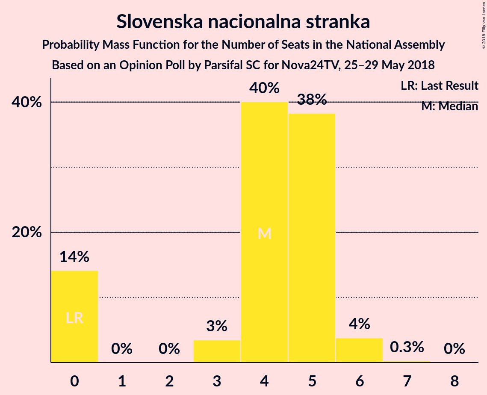

# Opinion Poll by Parsifal SC for Nova24TV, 25–29 May 2018

<a href="#voting-intentions">Voting Intentions</a> | <a href="#seats">Seats</a> | <a href="#coalitions">Coalitions</a> | <a href="#technical-information">Technical Information</a>

## Voting Intentions

### Confidence Intervals

| Party | Last Result | Poll Result | 80% Confidence Interval | 90% Confidence Interval | 95% Confidence Interval | 99% Confidence Interval |
|:-----:|:-----------:|:-----------:|:-----------------------:|:-----------------------:|:-----------------------:|:-----------------------:|
| Slovenska demokratska stranka | 20.7% | 28.7% | 26.5–31.0% |25.8–31.7% |25.3–32.3% |24.3–33.4% |
| Lista Marjana Šarca | 0.0% | 14.8% | 13.1–16.7% |12.7–17.2% |12.3–17.7% |11.5–18.7% |
| Socialni demokrati | 6.0% | 7.9% | 6.7–9.4% |6.4–9.9% |6.1–10.3% |5.6–11.0% |
| Stranka modernega centra | 34.5% | 7.5% | 6.3–8.9% |6.0–9.4% |5.7–9.8% |5.2–10.5% |
| Nova Slovenija–Krščanski demokrati | 5.6% | 7.3% | 6.2–8.8% |5.8–9.2% |5.6–9.6% |5.0–10.3% |
| Demokratična stranka upokojencev Slovenije | 10.2% | 6.1% | 5.0–7.5% |4.8–7.9% |4.5–8.2% |4.1–8.9% |
| Levica | 6.0% | 5.9% | 4.9–7.3% |4.6–7.7% |4.4–8.0% |3.9–8.7% |
| Slovenska nacionalna stranka | 2.2% | 4.7% | 3.8–6.0% |3.6–6.3% |3.4–6.6% |3.0–7.3% |
| Slovenska ljudska stranka | 4.0% | 3.5% | 2.7–4.6% |2.5–4.9% |2.3–5.2% |2.0–5.8% |
| Stranka Alenke Bratušek | 4.4% | 1.5% | 1.1–2.3% |0.9–2.6% |0.8–2.8% |0.7–3.2% |

*Note:* The poll result column reflects the actual value used in the calculations. Published results may vary slightly, and in addition be rounded to fewer digits.

## Seats

### Confidence Intervals

| Party | Last Result | Median | 80% Confidence Interval | 90% Confidence Interval | 95% Confidence Interval | 99% Confidence Interval |
|:-----:|:-----------:|:------:|:-----------------------:|:-----------------------:|:-----------------------:|:-----------------------:|
| <a href="#slovenska-demokratska-stranka">Slovenska demokratska stranka</a> | 21 | 26 | 24–29 |24–30 |24–31 |23–31 |
| <a href="#lista-marjana-šarca">Lista Marjana Šarca</a> | 0 | 14 | 12–16 |11–16 |11–16 |10–18 |
| <a href="#socialni-demokrati">Socialni demokrati</a> | 6 | 7 | 6–8 |6–8 |6–9 |5–10 |
| <a href="#stranka-modernega-centra">Stranka modernega centra</a> | 36 | 7 | 5–8 |5–9 |5–9 |4–9 |
| <a href="#nova-slovenija–krščanski-demokrati">Nova Slovenija–Krščanski demokrati</a> | 5 | 7 | 5–8 |5–8 |5–9 |4–9 |
| <a href="#demokratična-stranka-upokojencev-slovenije">Demokratična stranka upokojencev Slovenije</a> | 10 | 5 | 4–8 |4–8 |4–8 |0–8 |
| <a href="#levica">Levica</a> | 6 | 5 | 5–6 |4–7 |4–7 |0–8 |
| <a href="#slovenska-nacionalna-stranka">Slovenska nacionalna stranka</a> | 0 | 4 | 0–6 |0–6 |0–6 |0–6 |
| <a href="#slovenska-ljudska-stranka">Slovenska ljudska stranka</a> | 0 | 0 | 0–4 |0–5 |0–5 |0–5 |
| <a href="#stranka-alenke-bratušek">Stranka Alenke Bratušek</a> | 4 | 0 | 0 |0 |0 |0 |

### Slovenska demokratska stranka

*For a full overview of the results for this party, see the [Slovenska demokratska stranka](party-slovenskademokratskastranka.html) page.*

| Number of Seats | Probability | Accumulated | Special Marks |
|:---------------:|:-----------:|:-----------:|:-------------:|
| 21 | 0% | 100% | Last Result |
| 22 | 0.3% | 100% |  |
| 23 | 1.1% | 99.7% |  |
| 24 | 15% | 98.6% |  |
| 25 | 26% | 84% |  |
| 26 | 14% | 58% | Median |
| 27 | 7% | 43% |  |
| 28 | 18% | 37% |  |
| 29 | 11% | 18% |  |
| 30 | 3% | 7% |  |
| 31 | 4% | 4% |  |
| 32 | 0.1% | 0.2% |  |
| 33 | 0.1% | 0.1% |  |
| 34 | 0% | 0% |  |

### Lista Marjana Šarca

*For a full overview of the results for this party, see the [Lista Marjana Šarca](party-listamarjanašarca.html) page.*

| Number of Seats | Probability | Accumulated | Special Marks |
|:---------------:|:-----------:|:-----------:|:-------------:|
| 0 | 0% | 100% | Last Result |
| 1 | 0% | 100% |  |
| 2 | 0% | 100% |  |
| 3 | 0% | 100% |  |
| 4 | 0% | 100% |  |
| 5 | 0% | 100% |  |
| 6 | 0% | 100% |  |
| 7 | 0% | 100% |  |
| 8 | 0% | 100% |  |
| 9 | 0.1% | 100% |  |
| 10 | 0.9% | 99.9% |  |
| 11 | 7% | 99.0% |  |
| 12 | 11% | 92% |  |
| 13 | 28% | 81% |  |
| 14 | 19% | 53% | Median |
| 15 | 14% | 34% |  |
| 16 | 19% | 20% |  |
| 17 | 0.8% | 2% |  |
| 18 | 0.8% | 0.9% |  |
| 19 | 0% | 0% |  |

### Socialni demokrati

*For a full overview of the results for this party, see the [Socialni demokrati](party-socialnidemokrati.html) page.*

| Number of Seats | Probability | Accumulated | Special Marks |
|:---------------:|:-----------:|:-----------:|:-------------:|
| 4 | 0.1% | 100% |  |
| 5 | 2% | 99.9% |  |
| 6 | 11% | 98% | Last Result |
| 7 | 44% | 87% | Median |
| 8 | 38% | 43% |  |
| 9 | 3% | 5% |  |
| 10 | 1.3% | 2% |  |
| 11 | 0.1% | 0.2% |  |
| 12 | 0% | 0% |  |

### Stranka modernega centra

*For a full overview of the results for this party, see the [Stranka modernega centra](party-strankamodernegacentra.html) page.*

| Number of Seats | Probability | Accumulated | Special Marks |
|:---------------:|:-----------:|:-----------:|:-------------:|
| 4 | 0.6% | 100% |  |
| 5 | 12% | 99.4% |  |
| 6 | 11% | 87% |  |
| 7 | 48% | 76% | Median |
| 8 | 23% | 28% |  |
| 9 | 5% | 5% |  |
| 10 | 0.4% | 0.4% |  |
| 11 | 0% | 0% |  |
| 12 | 0% | 0% |  |
| 13 | 0% | 0% |  |
| 14 | 0% | 0% |  |
| 15 | 0% | 0% |  |
| 16 | 0% | 0% |  |
| 17 | 0% | 0% |  |
| 18 | 0% | 0% |  |
| 19 | 0% | 0% |  |
| 20 | 0% | 0% |  |
| 21 | 0% | 0% |  |
| 22 | 0% | 0% |  |
| 23 | 0% | 0% |  |
| 24 | 0% | 0% |  |
| 25 | 0% | 0% |  |
| 26 | 0% | 0% |  |
| 27 | 0% | 0% |  |
| 28 | 0% | 0% |  |
| 29 | 0% | 0% |  |
| 30 | 0% | 0% |  |
| 31 | 0% | 0% |  |
| 32 | 0% | 0% |  |
| 33 | 0% | 0% |  |
| 34 | 0% | 0% |  |
| 35 | 0% | 0% |  |
| 36 | 0% | 0% | Last Result |

### Nova Slovenija–Krščanski demokrati

*For a full overview of the results for this party, see the [Nova Slovenija–Krščanski demokrati](party-novaslovenija–krščanskidemokrati.html) page.*

| Number of Seats | Probability | Accumulated | Special Marks |
|:---------------:|:-----------:|:-----------:|:-------------:|
| 4 | 1.1% | 100% |  |
| 5 | 10% | 98.9% | Last Result |
| 6 | 20% | 89% |  |
| 7 | 44% | 69% | Median |
| 8 | 21% | 24% |  |
| 9 | 3% | 3% |  |
| 10 | 0.4% | 0.4% |  |
| 11 | 0% | 0% |  |

### Demokratična stranka upokojencev Slovenije

*For a full overview of the results for this party, see the [Demokratična stranka upokojencev Slovenije](party-demokratičnastrankaupokojencevslovenije.html) page.*

| Number of Seats | Probability | Accumulated | Special Marks |
|:---------------:|:-----------:|:-----------:|:-------------:|
| 0 | 1.1% | 100% |  |
| 1 | 0% | 98.9% |  |
| 2 | 0% | 98.9% |  |
| 3 | 0.1% | 98.9% |  |
| 4 | 12% | 98.8% |  |
| 5 | 38% | 87% | Median |
| 6 | 10% | 48% |  |
| 7 | 20% | 38% |  |
| 8 | 18% | 18% |  |
| 9 | 0.3% | 0.3% |  |
| 10 | 0% | 0% | Last Result |

### Levica

*For a full overview of the results for this party, see the [Levica](party-levica.html) page.*

| Number of Seats | Probability | Accumulated | Special Marks |
|:---------------:|:-----------:|:-----------:|:-------------:|
| 0 | 1.3% | 100% |  |
| 1 | 0% | 98.7% |  |
| 2 | 0% | 98.7% |  |
| 3 | 1.1% | 98.7% |  |
| 4 | 7% | 98% |  |
| 5 | 65% | 91% | Median |
| 6 | 19% | 26% | Last Result |
| 7 | 4% | 6% |  |
| 8 | 2% | 2% |  |
| 9 | 0.1% | 0.1% |  |
| 10 | 0% | 0% |  |

### Slovenska nacionalna stranka

*For a full overview of the results for this party, see the [Slovenska nacionalna stranka](party-slovenskanacionalnastranka.html) page.*

| Number of Seats | Probability | Accumulated | Special Marks |
|:---------------:|:-----------:|:-----------:|:-------------:|
| 0 | 20% | 100% | Last Result |
| 1 | 0% | 80% |  |
| 2 | 0% | 80% |  |
| 3 | 2% | 80% |  |
| 4 | 29% | 77% | Median |
| 5 | 36% | 48% |  |
| 6 | 12% | 12% |  |
| 7 | 0.1% | 0.1% |  |
| 8 | 0% | 0% |  |

### Slovenska ljudska stranka

*For a full overview of the results for this party, see the [Slovenska ljudska stranka](party-slovenskaljudskastranka.html) page.*

| Number of Seats | Probability | Accumulated | Special Marks |
|:---------------:|:-----------:|:-----------:|:-------------:|
| 0 | 84% | 100% | Last Result, Median |
| 1 | 0% | 16% |  |
| 2 | 0% | 16% |  |
| 3 | 5% | 16% |  |
| 4 | 4% | 11% |  |
| 5 | 7% | 7% |  |
| 6 | 0% | 0% |  |

### Stranka Alenke Bratušek

*For a full overview of the results for this party, see the [Stranka Alenke Bratušek](party-strankaalenkebratušek.html) page.*

| Number of Seats | Probability | Accumulated | Special Marks |
|:---------------:|:-----------:|:-----------:|:-------------:|
| 0 | 100% | 100% | Median |
| 1 | 0% | 0% |  |
| 2 | 0% | 0% |  |
| 3 | 0% | 0% |  |
| 4 | 0% | 0% | Last Result |

## Coalitions

### Confidence Intervals

| Coalition | Last Result | Median | Majority? | 80% Confidence Interval | 90% Confidence Interval | 95% Confidence Interval | 99% Confidence Interval |
|:---------:|:-----------:|:------:|:---------:|:-----------------------:|:-----------------------:|:-----------------------:|:-----------------------:|
| Slovenska demokratska stranka – Lista Marjana Šarca – Demokratična stranka upokojencev Slovenije | 31 | 46 | 65% | 43–49 | 43–49 | 42–50 | 41–51 |
| Slovenska demokratska stranka – Lista Marjana Šarca | 21 | 40 | 0.9% | 38–44 | 37–44 | 37–44 | 35–47 |
| Lista Marjana Šarca – Socialni demokrati – Stranka modernega centra – Nova Slovenija–Krščanski demokrati – Demokratična stranka upokojencev Slovenije – Stranka Alenke Bratušek | 61 | 41 | 0.8% | 37–44 | 37–44 | 36–44 | 34–46 |
| Lista Marjana Šarca – Socialni demokrati – Stranka modernega centra – Nova Slovenija–Krščanski demokrati – Demokratična stranka upokojencev Slovenije | 57 | 41 | 0.8% | 37–44 | 37–44 | 36–44 | 34–46 |
| Lista Marjana Šarca – Socialni demokrati – Stranka modernega centra – Nova Slovenija–Krščanski demokrati | 47 | 35 | 0% | 32–39 | 32–39 | 31–39 | 29–40 |
| Lista Marjana Šarca – Socialni demokrati – Nova Slovenija–Krščanski demokrati – Demokratična stranka upokojencev Slovenije | 21 | 34 | 0% | 31–37 | 30–37 | 30–37 | 28–39 |
| Lista Marjana Šarca – Socialni demokrati – Stranka modernega centra – Demokratična stranka upokojencev Slovenije – Stranka Alenke Bratušek | 56 | 35 | 0% | 30–36 | 30–37 | 29–37 | 27–38 |
| Lista Marjana Šarca – Socialni demokrati – Stranka modernega centra – Demokratična stranka upokojencev Slovenije | 52 | 35 | 0% | 30–36 | 30–37 | 29–37 | 27–38 |
| Lista Marjana Šarca – Socialni demokrati – Nova Slovenija–Krščanski demokrati | 11 | 27 | 0% | 26–32 | 25–32 | 25–32 | 23–32 |
| Lista Marjana Šarca – Socialni demokrati – Stranka modernega centra | 42 | 28 | 0% | 26–31 | 25–31 | 24–32 | 22–32 |
| Lista Marjana Šarca – Socialni demokrati – Demokratična stranka upokojencev Slovenije | 16 | 28 | 0% | 24–29 | 23–29 | 23–30 | 21–32 |
| Lista Marjana Šarca – Socialni demokrati | 6 | 21 | 0% | 19–24 | 19–24 | 18–24 | 17–26 |
| Socialni demokrati – Stranka modernega centra – Demokratična stranka upokojencev Slovenije | 52 | 20 | 0% | 18–23 | 17–23 | 16–23 | 15–24 |

### Slovenska demokratska stranka – Lista Marjana Šarca – Demokratična stranka upokojencev Slovenije

| Number of Seats | Probability | Accumulated | Special Marks |
|:---------------:|:-----------:|:-----------:|:-------------:|
| 31 | 0% | 100% | Last Result |
| 32 | 0% | 100% |  |
| 33 | 0% | 100% |  |
| 34 | 0% | 100% |  |
| 35 | 0% | 100% |  |
| 36 | 0% | 100% |  |
| 37 | 0% | 100% |  |
| 38 | 0% | 100% |  |
| 39 | 0.1% | 100% |  |
| 40 | 0.1% | 99.9% |  |
| 41 | 1.3% | 99.9% |  |
| 42 | 2% | 98.5% |  |
| 43 | 7% | 96% |  |
| 44 | 6% | 89% |  |
| 45 | 18% | 83% | Median |
| 46 | 34% | 65% | Majority |
| 47 | 2% | 31% |  |
| 48 | 5% | 28% |  |
| 49 | 21% | 24% |  |
| 50 | 1.5% | 3% |  |
| 51 | 0.8% | 1.2% |  |
| 52 | 0.1% | 0.4% |  |
| 53 | 0.2% | 0.3% |  |
| 54 | 0.1% | 0.1% |  |
| 55 | 0% | 0% |  |

### Slovenska demokratska stranka – Lista Marjana Šarca

| Number of Seats | Probability | Accumulated | Special Marks |
|:---------------:|:-----------:|:-----------:|:-------------:|
| 21 | 0% | 100% | Last Result |
| 22 | 0% | 100% |  |
| 23 | 0% | 100% |  |
| 24 | 0% | 100% |  |
| 25 | 0% | 100% |  |
| 26 | 0% | 100% |  |
| 27 | 0% | 100% |  |
| 28 | 0% | 100% |  |
| 29 | 0% | 100% |  |
| 30 | 0% | 100% |  |
| 31 | 0% | 100% |  |
| 32 | 0% | 100% |  |
| 33 | 0% | 100% |  |
| 34 | 0.1% | 100% |  |
| 35 | 0.4% | 99.8% |  |
| 36 | 1.1% | 99.4% |  |
| 37 | 6% | 98% |  |
| 38 | 31% | 92% |  |
| 39 | 4% | 60% |  |
| 40 | 7% | 56% | Median |
| 41 | 22% | 49% |  |
| 42 | 4% | 28% |  |
| 43 | 2% | 24% |  |
| 44 | 19% | 21% |  |
| 45 | 1.3% | 2% |  |
| 46 | 0.3% | 0.9% | Majority |
| 47 | 0.4% | 0.6% |  |
| 48 | 0.1% | 0.2% |  |
| 49 | 0% | 0.1% |  |
| 50 | 0.1% | 0.1% |  |
| 51 | 0% | 0% |  |

### Lista Marjana Šarca – Socialni demokrati – Stranka modernega centra – Nova Slovenija–Krščanski demokrati – Demokratična stranka upokojencev Slovenije – Stranka Alenke Bratušek

| Number of Seats | Probability | Accumulated | Special Marks |
|:---------------:|:-----------:|:-----------:|:-------------:|
| 32 | 0.1% | 100% |  |
| 33 | 0.3% | 99.9% |  |
| 34 | 0.3% | 99.7% |  |
| 35 | 1.3% | 99.3% |  |
| 36 | 0.5% | 98% |  |
| 37 | 8% | 97% |  |
| 38 | 13% | 89% |  |
| 39 | 3% | 76% |  |
| 40 | 18% | 74% | Median |
| 41 | 15% | 56% |  |
| 42 | 5% | 41% |  |
| 43 | 20% | 36% |  |
| 44 | 15% | 16% |  |
| 45 | 0.4% | 1.2% |  |
| 46 | 0.8% | 0.8% | Majority |
| 47 | 0.1% | 0.1% |  |
| 48 | 0% | 0% |  |
| 49 | 0% | 0% |  |
| 50 | 0% | 0% |  |
| 51 | 0% | 0% |  |
| 52 | 0% | 0% |  |
| 53 | 0% | 0% |  |
| 54 | 0% | 0% |  |
| 55 | 0% | 0% |  |
| 56 | 0% | 0% |  |
| 57 | 0% | 0% |  |
| 58 | 0% | 0% |  |
| 59 | 0% | 0% |  |
| 60 | 0% | 0% |  |
| 61 | 0% | 0% | Last Result |

### Lista Marjana Šarca – Socialni demokrati – Stranka modernega centra – Nova Slovenija–Krščanski demokrati – Demokratična stranka upokojencev Slovenije

| Number of Seats | Probability | Accumulated | Special Marks |
|:---------------:|:-----------:|:-----------:|:-------------:|
| 32 | 0.1% | 100% |  |
| 33 | 0.3% | 99.9% |  |
| 34 | 0.3% | 99.7% |  |
| 35 | 1.3% | 99.3% |  |
| 36 | 0.5% | 98% |  |
| 37 | 8% | 97% |  |
| 38 | 13% | 89% |  |
| 39 | 3% | 76% |  |
| 40 | 18% | 74% | Median |
| 41 | 15% | 56% |  |
| 42 | 5% | 41% |  |
| 43 | 20% | 36% |  |
| 44 | 15% | 16% |  |
| 45 | 0.4% | 1.2% |  |
| 46 | 0.8% | 0.8% | Majority |
| 47 | 0.1% | 0.1% |  |
| 48 | 0% | 0% |  |
| 49 | 0% | 0% |  |
| 50 | 0% | 0% |  |
| 51 | 0% | 0% |  |
| 52 | 0% | 0% |  |
| 53 | 0% | 0% |  |
| 54 | 0% | 0% |  |
| 55 | 0% | 0% |  |
| 56 | 0% | 0% |  |
| 57 | 0% | 0% | Last Result |

### Lista Marjana Šarca – Socialni demokrati – Stranka modernega centra – Nova Slovenija–Krščanski demokrati

| Number of Seats | Probability | Accumulated | Special Marks |
|:---------------:|:-----------:|:-----------:|:-------------:|
| 27 | 0.1% | 100% |  |
| 28 | 0.1% | 99.9% |  |
| 29 | 0.5% | 99.8% |  |
| 30 | 1.0% | 99.3% |  |
| 31 | 2% | 98% |  |
| 32 | 11% | 96% |  |
| 33 | 9% | 85% |  |
| 34 | 18% | 76% |  |
| 35 | 30% | 58% | Median |
| 36 | 6% | 27% |  |
| 37 | 2% | 21% |  |
| 38 | 3% | 19% |  |
| 39 | 15% | 16% |  |
| 40 | 0.5% | 0.7% |  |
| 41 | 0.1% | 0.2% |  |
| 42 | 0% | 0% |  |
| 43 | 0% | 0% |  |
| 44 | 0% | 0% |  |
| 45 | 0% | 0% |  |
| 46 | 0% | 0% | Majority |
| 47 | 0% | 0% | Last Result |

### Lista Marjana Šarca – Socialni demokrati – Nova Slovenija–Krščanski demokrati – Demokratična stranka upokojencev Slovenije

| Number of Seats | Probability | Accumulated | Special Marks |
|:---------------:|:-----------:|:-----------:|:-------------:|
| 21 | 0% | 100% | Last Result |
| 22 | 0% | 100% |  |
| 23 | 0% | 100% |  |
| 24 | 0% | 100% |  |
| 25 | 0% | 100% |  |
| 26 | 0% | 100% |  |
| 27 | 0.3% | 100% |  |
| 28 | 0.4% | 99.6% |  |
| 29 | 2% | 99.2% |  |
| 30 | 5% | 98% |  |
| 31 | 14% | 92% |  |
| 32 | 5% | 78% |  |
| 33 | 11% | 74% | Median |
| 34 | 16% | 63% |  |
| 35 | 29% | 48% |  |
| 36 | 3% | 19% |  |
| 37 | 15% | 16% |  |
| 38 | 0.6% | 1.2% |  |
| 39 | 0.3% | 0.6% |  |
| 40 | 0.3% | 0.3% |  |
| 41 | 0% | 0% |  |

### Lista Marjana Šarca – Socialni demokrati – Stranka modernega centra – Demokratična stranka upokojencev Slovenije – Stranka Alenke Bratušek

| Number of Seats | Probability | Accumulated | Special Marks |
|:---------------:|:-----------:|:-----------:|:-------------:|
| 27 | 1.0% | 100% |  |
| 28 | 0.7% | 99.0% |  |
| 29 | 1.4% | 98% |  |
| 30 | 9% | 97% |  |
| 31 | 6% | 88% |  |
| 32 | 6% | 82% |  |
| 33 | 17% | 76% | Median |
| 34 | 5% | 59% |  |
| 35 | 16% | 54% |  |
| 36 | 33% | 38% |  |
| 37 | 4% | 5% |  |
| 38 | 1.3% | 1.5% |  |
| 39 | 0.1% | 0.1% |  |
| 40 | 0% | 0% |  |
| 41 | 0% | 0% |  |
| 42 | 0% | 0% |  |
| 43 | 0% | 0% |  |
| 44 | 0% | 0% |  |
| 45 | 0% | 0% |  |
| 46 | 0% | 0% | Majority |
| 47 | 0% | 0% |  |
| 48 | 0% | 0% |  |
| 49 | 0% | 0% |  |
| 50 | 0% | 0% |  |
| 51 | 0% | 0% |  |
| 52 | 0% | 0% |  |
| 53 | 0% | 0% |  |
| 54 | 0% | 0% |  |
| 55 | 0% | 0% |  |
| 56 | 0% | 0% | Last Result |

### Lista Marjana Šarca – Socialni demokrati – Stranka modernega centra – Demokratična stranka upokojencev Slovenije

| Number of Seats | Probability | Accumulated | Special Marks |
|:---------------:|:-----------:|:-----------:|:-------------:|
| 27 | 1.0% | 100% |  |
| 28 | 0.7% | 99.0% |  |
| 29 | 1.4% | 98% |  |
| 30 | 9% | 97% |  |
| 31 | 6% | 88% |  |
| 32 | 6% | 82% |  |
| 33 | 17% | 76% | Median |
| 34 | 5% | 59% |  |
| 35 | 16% | 54% |  |
| 36 | 33% | 38% |  |
| 37 | 4% | 5% |  |
| 38 | 1.3% | 1.5% |  |
| 39 | 0.1% | 0.1% |  |
| 40 | 0% | 0% |  |
| 41 | 0% | 0% |  |
| 42 | 0% | 0% |  |
| 43 | 0% | 0% |  |
| 44 | 0% | 0% |  |
| 45 | 0% | 0% |  |
| 46 | 0% | 0% | Majority |
| 47 | 0% | 0% |  |
| 48 | 0% | 0% |  |
| 49 | 0% | 0% |  |
| 50 | 0% | 0% |  |
| 51 | 0% | 0% |  |
| 52 | 0% | 0% | Last Result |

### Lista Marjana Šarca – Socialni demokrati – Nova Slovenija–Krščanski demokrati

| Number of Seats | Probability | Accumulated | Special Marks |
|:---------------:|:-----------:|:-----------:|:-------------:|
| 11 | 0% | 100% | Last Result |
| 12 | 0% | 100% |  |
| 13 | 0% | 100% |  |
| 14 | 0% | 100% |  |
| 15 | 0% | 100% |  |
| 16 | 0% | 100% |  |
| 17 | 0% | 100% |  |
| 18 | 0% | 100% |  |
| 19 | 0% | 100% |  |
| 20 | 0% | 100% |  |
| 21 | 0.2% | 100% |  |
| 22 | 0% | 99.8% |  |
| 23 | 1.1% | 99.8% |  |
| 24 | 0.9% | 98.7% |  |
| 25 | 7% | 98% |  |
| 26 | 15% | 90% |  |
| 27 | 35% | 76% |  |
| 28 | 6% | 41% | Median |
| 29 | 6% | 35% |  |
| 30 | 10% | 29% |  |
| 31 | 3% | 19% |  |
| 32 | 15% | 16% |  |
| 33 | 0.4% | 0.4% |  |
| 34 | 0% | 0.1% |  |
| 35 | 0% | 0% |  |

### Lista Marjana Šarca – Socialni demokrati – Stranka modernega centra

| Number of Seats | Probability | Accumulated | Special Marks |
|:---------------:|:-----------:|:-----------:|:-------------:|
| 21 | 0.1% | 100% |  |
| 22 | 0.5% | 99.9% |  |
| 23 | 2% | 99.4% |  |
| 24 | 1.1% | 98% |  |
| 25 | 5% | 97% |  |
| 26 | 11% | 91% |  |
| 27 | 9% | 80% |  |
| 28 | 43% | 71% | Median |
| 29 | 5% | 29% |  |
| 30 | 4% | 24% |  |
| 31 | 16% | 19% |  |
| 32 | 3% | 3% |  |
| 33 | 0.2% | 0.3% |  |
| 34 | 0.1% | 0.1% |  |
| 35 | 0% | 0% |  |
| 36 | 0% | 0% |  |
| 37 | 0% | 0% |  |
| 38 | 0% | 0% |  |
| 39 | 0% | 0% |  |
| 40 | 0% | 0% |  |
| 41 | 0% | 0% |  |
| 42 | 0% | 0% | Last Result |

### Lista Marjana Šarca – Socialni demokrati – Demokratična stranka upokojencev Slovenije

| Number of Seats | Probability | Accumulated | Special Marks |
|:---------------:|:-----------:|:-----------:|:-------------:|
| 16 | 0% | 100% | Last Result |
| 17 | 0% | 100% |  |
| 18 | 0% | 100% |  |
| 19 | 0% | 100% |  |
| 20 | 0% | 100% |  |
| 21 | 0.6% | 100% |  |
| 22 | 2% | 99.4% |  |
| 23 | 4% | 98% |  |
| 24 | 11% | 93% |  |
| 25 | 7% | 83% |  |
| 26 | 7% | 76% | Median |
| 27 | 5% | 69% |  |
| 28 | 45% | 64% |  |
| 29 | 16% | 18% |  |
| 30 | 0.9% | 3% |  |
| 31 | 1.1% | 2% |  |
| 32 | 0.6% | 0.6% |  |
| 33 | 0% | 0% |  |

### Lista Marjana Šarca – Socialni demokrati

| Number of Seats | Probability | Accumulated | Special Marks |
|:---------------:|:-----------:|:-----------:|:-------------:|
| 6 | 0% | 100% | Last Result |
| 7 | 0% | 100% |  |
| 8 | 0% | 100% |  |
| 9 | 0% | 100% |  |
| 10 | 0% | 100% |  |
| 11 | 0% | 100% |  |
| 12 | 0% | 100% |  |
| 13 | 0% | 100% |  |
| 14 | 0% | 100% |  |
| 15 | 0.1% | 100% |  |
| 16 | 0.1% | 99.9% |  |
| 17 | 1.3% | 99.8% |  |
| 18 | 3% | 98% |  |
| 19 | 14% | 96% |  |
| 20 | 27% | 82% |  |
| 21 | 20% | 55% | Median |
| 22 | 4% | 35% |  |
| 23 | 13% | 31% |  |
| 24 | 16% | 18% |  |
| 25 | 1.2% | 2% |  |
| 26 | 0.8% | 0.8% |  |
| 27 | 0% | 0.1% |  |
| 28 | 0% | 0% |  |

### Socialni demokrati – Stranka modernega centra – Demokratična stranka upokojencev Slovenije

| Number of Seats | Probability | Accumulated | Special Marks |
|:---------------:|:-----------:|:-----------:|:-------------:|
| 14 | 0.3% | 100% |  |
| 15 | 0.3% | 99.7% |  |
| 16 | 2% | 99.4% |  |
| 17 | 6% | 97% |  |
| 18 | 11% | 92% |  |
| 19 | 16% | 80% | Median |
| 20 | 27% | 65% |  |
| 21 | 14% | 38% |  |
| 22 | 2% | 24% |  |
| 23 | 21% | 22% |  |
| 24 | 0.8% | 0.9% |  |
| 25 | 0.1% | 0.1% |  |
| 26 | 0% | 0.1% |  |
| 27 | 0% | 0% |  |
| 28 | 0% | 0% |  |
| 29 | 0% | 0% |  |
| 30 | 0% | 0% |  |
| 31 | 0% | 0% |  |
| 32 | 0% | 0% |  |
| 33 | 0% | 0% |  |
| 34 | 0% | 0% |  |
| 35 | 0% | 0% |  |
| 36 | 0% | 0% |  |
| 37 | 0% | 0% |  |
| 38 | 0% | 0% |  |
| 39 | 0% | 0% |  |
| 40 | 0% | 0% |  |
| 41 | 0% | 0% |  |
| 42 | 0% | 0% |  |
| 43 | 0% | 0% |  |
| 44 | 0% | 0% |  |
| 45 | 0% | 0% |  |
| 46 | 0% | 0% | Majority |
| 47 | 0% | 0% |  |
| 48 | 0% | 0% |  |
| 49 | 0% | 0% |  |
| 50 | 0% | 0% |  |
| 51 | 0% | 0% |  |
| 52 | 0% | 0% | Last Result |

## Technical Information

### Opinion Poll

+ **Polling firm:** Parsifal SC
+ **Commissioner(s):** Nova24TV
+ **Fieldwork period:** 25–29 May 2018

### Calculations

+ **Sample size:** 656
+ **Simulations done:** 131,072
+ **Error estimate:** 2.09%

