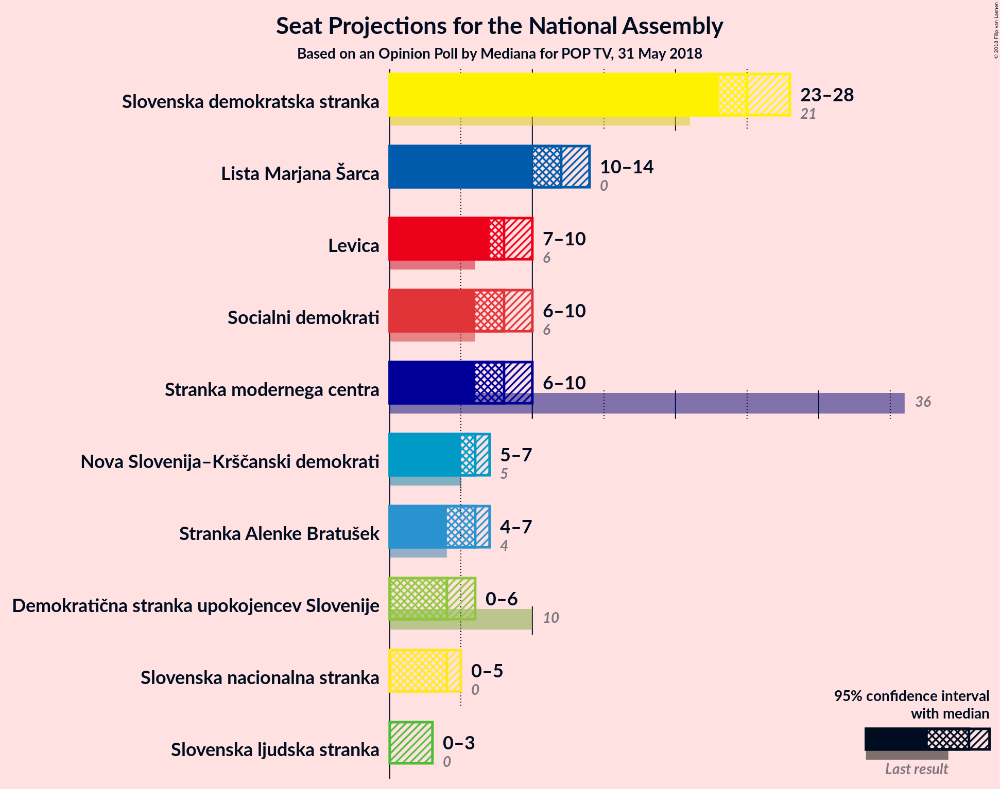
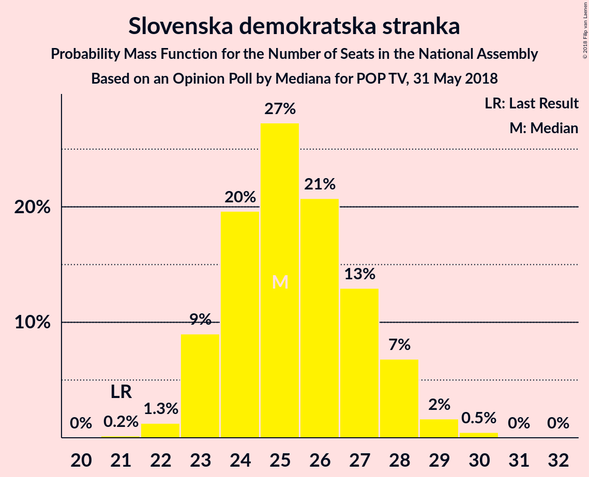
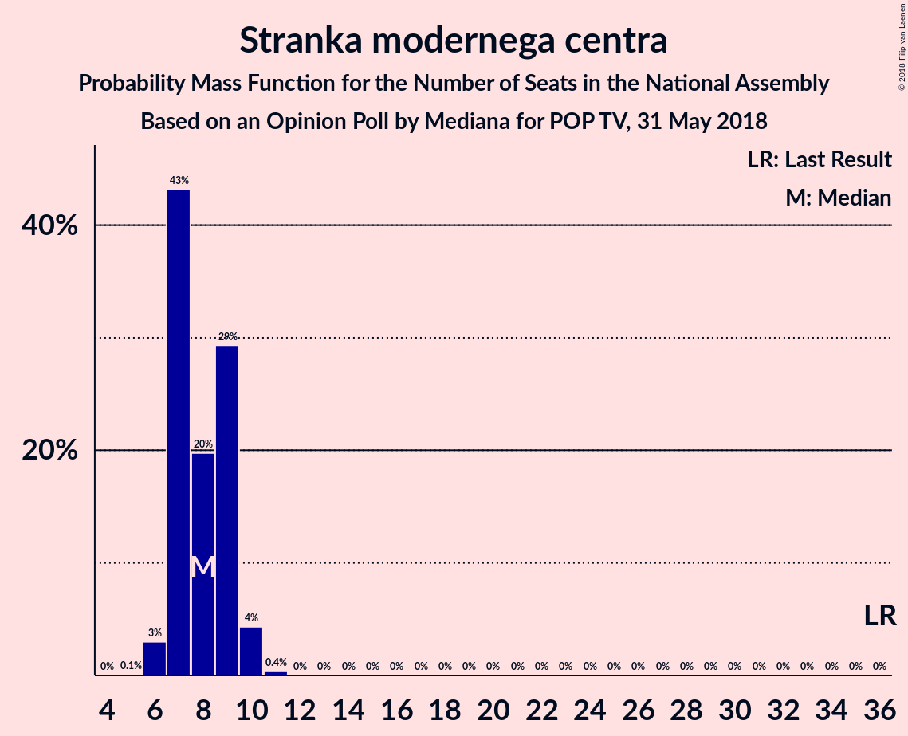
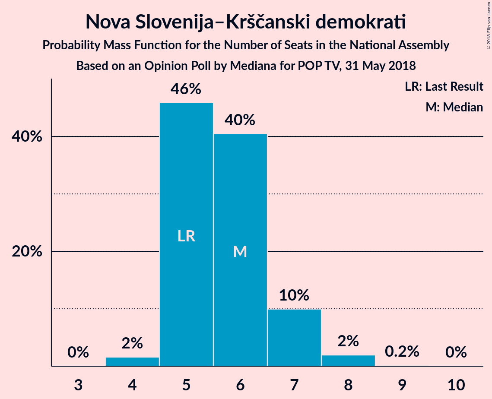
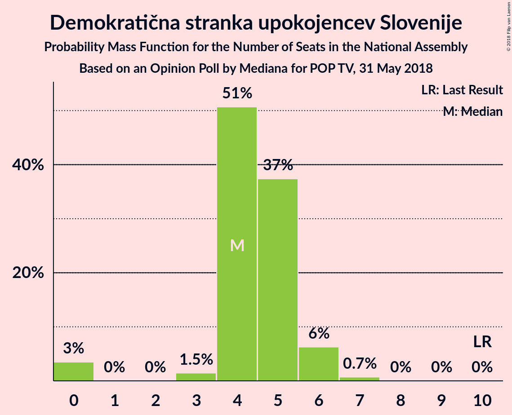
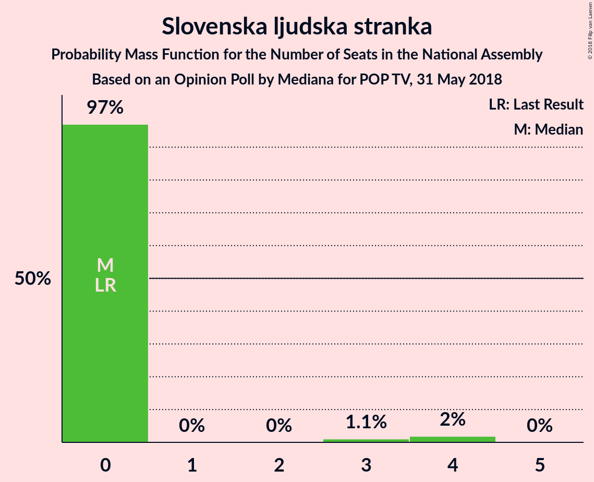
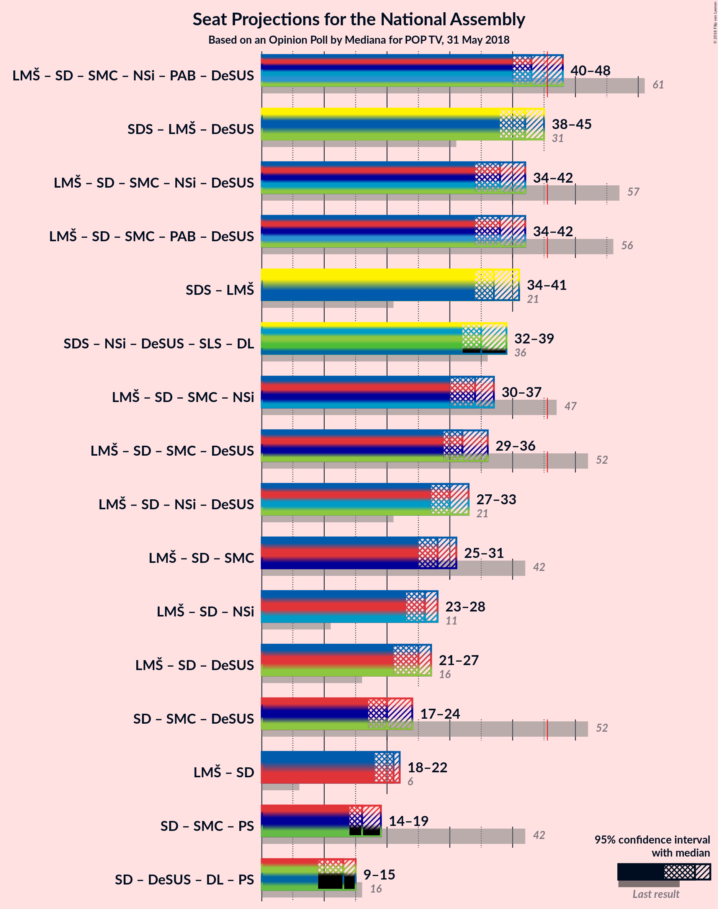

# Opinion Poll by Mediana for POP TV, 31 May 2018

<a href="#voting-intentions">Voting Intentions</a> | <a href="#seats">Seats</a> | <a href="#coalitions">Coalitions</a> | <a href="#technical-information">Technical Information</a>

## Voting Intentions

### Confidence Intervals

| Party | Last Result | Poll Result | 80% Confidence Interval | 90% Confidence Interval | 95% Confidence Interval | 99% Confidence Interval |
|:-----:|:-----------:|:-----------:|:-----------------------:|:-----------------------:|:-----------------------:|:-----------------------:|
| Slovenska demokratska stranka | 20.7% | 27.1% | 25.3–29.1% |24.8–29.6% |24.4–30.1% |23.5–31.0% |
| Lista Marjana Šarca | 0.0% | 12.8% | 11.5–14.3% |11.1–14.8% |10.8–15.1% |10.2–15.9% |
| Levica | 6.0% | 9.1% | 8.0–10.4% |7.7–10.8% |7.4–11.1% |6.9–11.8% |
| Socialni demokrati | 6.0% | 9.0% | 7.9–10.3% |7.6–10.7% |7.3–11.0% |6.8–11.6% |
| Stranka modernega centra | 34.5% | 8.8% | 7.7–10.1% |7.4–10.4% |7.1–10.7% |6.6–11.4% |
| Nova Slovenija–Krščanski demokrati | 5.6% | 6.5% | 5.6–7.7% |5.3–8.0% |5.1–8.3% |4.7–8.9% |
| Stranka Alenke Bratušek | 4.4% | 6.5% | 5.6–7.7% |5.3–8.0% |5.1–8.3% |4.7–8.9% |
| Demokratična stranka upokojencev Slovenije | 10.2% | 5.1% | 4.3–6.2% |4.1–6.5% |3.9–6.7% |3.5–7.3% |
| Slovenska nacionalna stranka | 2.2% | 4.6% | 3.8–5.6% |3.6–5.9% |3.4–6.1% |3.1–6.7% |
| Slovenska ljudska stranka | 4.0% | 2.9% | 2.3–3.7% |2.1–4.0% |2.0–4.2% |1.7–4.6% |

*Note:* The poll result column reflects the actual value used in the calculations. Published results may vary slightly, and in addition be rounded to fewer digits.

## Seats

### Confidence Intervals

| Party | Last Result | Median | 80% Confidence Interval | 90% Confidence Interval | 95% Confidence Interval | 99% Confidence Interval |
|:-----:|:-----------:|:------:|:-----------------------:|:-----------------------:|:-----------------------:|:-----------------------:|
| <a href="#slovenska-demokratska-stranka">Slovenska demokratska stranka</a> | 21 | 22 | 22–27 |22–27 |22–27 |22–27 |
| <a href="#lista-marjana-šarca">Lista Marjana Šarca</a> | 0 | 11 | 11–13 |11–13 |11–13 |10–13 |
| <a href="#levica">Levica</a> | 6 | 9 | 9–10 |9–10 |9–10 |9–10 |
| <a href="#socialni-demokrati">Socialni demokrati</a> | 6 | 9 | 9 |9 |9 |7–9 |
| <a href="#stranka-modernega-centra">Stranka modernega centra</a> | 36 | 8 | 6–8 |6–8 |6–8 |6–8 |
| <a href="#nova-slovenija–krščanski-demokrati">Nova Slovenija–Krščanski demokrati</a> | 5 | 5 | 5–7 |5–7 |5–7 |5–7 |
| <a href="#stranka-alenke-bratušek">Stranka Alenke Bratušek</a> | 4 | 6 | 5–6 |5–6 |5–6 |5–7 |
| <a href="#demokratična-stranka-upokojencev-slovenije">Demokratična stranka upokojencev Slovenije</a> | 10 | 5 | 5 |5 |5 |4–5 |
| <a href="#slovenska-nacionalna-stranka">Slovenska nacionalna stranka</a> | 0 | 5 | 0–5 |0–5 |0–5 |0–5 |
| <a href="#slovenska-ljudska-stranka">Slovenska ljudska stranka</a> | 0 | 0 | 0 |0 |0 |0 |

### Slovenska demokratska stranka

*For a full overview of the results for this party, see the [Slovenska demokratska stranka](party-slovenskademokratskastranka.html) page.*

| Number of Seats | Probability | Accumulated | Special Marks |
|:---------------:|:-----------:|:-----------:|:-------------:|
| 21 | 0% | 100% | Last Result |
| 22 | 75% | 100% | Median |
| 23 | 0% | 25% |  |
| 24 | 0.3% | 25% |  |
| 25 | 0.1% | 25% |  |
| 26 | 0% | 24% |  |
| 27 | 24% | 24% |  |
| 28 | 0% | 0% |  |

### Lista Marjana Šarca

*For a full overview of the results for this party, see the [Lista Marjana Šarca](party-listamarjanašarca.html) page.*

| Number of Seats | Probability | Accumulated | Special Marks |
|:---------------:|:-----------:|:-----------:|:-------------:|
| 0 | 0% | 100% | Last Result |
| 1 | 0% | 100% |  |
| 2 | 0% | 100% |  |
| 3 | 0% | 100% |  |
| 4 | 0% | 100% |  |
| 5 | 0% | 100% |  |
| 6 | 0% | 100% |  |
| 7 | 0% | 100% |  |
| 8 | 0% | 100% |  |
| 9 | 0% | 100% |  |
| 10 | 0.9% | 100% |  |
| 11 | 75% | 99.0% | Median |
| 12 | 0% | 24% |  |
| 13 | 24% | 24% |  |
| 14 | 0% | 0% |  |

### Levica

*For a full overview of the results for this party, see the [Levica](party-levica.html) page.*

| Number of Seats | Probability | Accumulated | Special Marks |
|:---------------:|:-----------:|:-----------:|:-------------:|
| 6 | 0% | 100% | Last Result |
| 7 | 0% | 100% |  |
| 8 | 0% | 100% |  |
| 9 | 76% | 100% | Median |
| 10 | 24% | 24% |  |
| 11 | 0% | 0% |  |

### Socialni demokrati

*For a full overview of the results for this party, see the [Socialni demokrati](party-socialnidemokrati.html) page.*

| Number of Seats | Probability | Accumulated | Special Marks |
|:---------------:|:-----------:|:-----------:|:-------------:|
| 6 | 0% | 100% | Last Result |
| 7 | 0.7% | 100% |  |
| 8 | 0% | 99.3% |  |
| 9 | 99.3% | 99.3% | Median |
| 10 | 0% | 0% |  |

### Stranka modernega centra

*For a full overview of the results for this party, see the [Stranka modernega centra](party-strankamodernegacentra.html) page.*

| Number of Seats | Probability | Accumulated | Special Marks |
|:---------------:|:-----------:|:-----------:|:-------------:|
| 6 | 24% | 100% |  |
| 7 | 0% | 76% |  |
| 8 | 76% | 76% | Median |
| 9 | 0.3% | 0.3% |  |
| 10 | 0% | 0% |  |
| 11 | 0% | 0% |  |
| 12 | 0% | 0% |  |
| 13 | 0% | 0% |  |
| 14 | 0% | 0% |  |
| 15 | 0% | 0% |  |
| 16 | 0% | 0% |  |
| 17 | 0% | 0% |  |
| 18 | 0% | 0% |  |
| 19 | 0% | 0% |  |
| 20 | 0% | 0% |  |
| 21 | 0% | 0% |  |
| 22 | 0% | 0% |  |
| 23 | 0% | 0% |  |
| 24 | 0% | 0% |  |
| 25 | 0% | 0% |  |
| 26 | 0% | 0% |  |
| 27 | 0% | 0% |  |
| 28 | 0% | 0% |  |
| 29 | 0% | 0% |  |
| 30 | 0% | 0% |  |
| 31 | 0% | 0% |  |
| 32 | 0% | 0% |  |
| 33 | 0% | 0% |  |
| 34 | 0% | 0% |  |
| 35 | 0% | 0% |  |
| 36 | 0% | 0% | Last Result |

### Nova Slovenija–Krščanski demokrati

*For a full overview of the results for this party, see the [Nova Slovenija–Krščanski demokrati](party-novaslovenija–krščanskidemokrati.html) page.*

| Number of Seats | Probability | Accumulated | Special Marks |
|:---------------:|:-----------:|:-----------:|:-------------:|
| 5 | 75% | 100% | Last Result, Median |
| 6 | 0.1% | 25% |  |
| 7 | 25% | 25% |  |
| 8 | 0% | 0% |  |

### Stranka Alenke Bratušek

*For a full overview of the results for this party, see the [Stranka Alenke Bratušek](party-strankaalenkebratušek.html) page.*

| Number of Seats | Probability | Accumulated | Special Marks |
|:---------------:|:-----------:|:-----------:|:-------------:|
| 4 | 0% | 100% | Last Result |
| 5 | 24% | 100% |  |
| 6 | 75% | 76% | Median |
| 7 | 1.0% | 1.0% |  |
| 8 | 0% | 0% |  |

### Demokratična stranka upokojencev Slovenije

*For a full overview of the results for this party, see the [Demokratična stranka upokojencev Slovenije](party-demokratičnastrankaupokojencevslovenije.html) page.*

| Number of Seats | Probability | Accumulated | Special Marks |
|:---------------:|:-----------:|:-----------:|:-------------:|
| 4 | 0.7% | 100% |  |
| 5 | 99.0% | 99.2% | Median |
| 6 | 0% | 0.3% |  |
| 7 | 0.3% | 0.3% |  |
| 8 | 0% | 0% |  |
| 9 | 0% | 0% |  |
| 10 | 0% | 0% | Last Result |

### Slovenska nacionalna stranka

*For a full overview of the results for this party, see the [Slovenska nacionalna stranka](party-slovenskanacionalnastranka.html) page.*

| Number of Seats | Probability | Accumulated | Special Marks |
|:---------------:|:-----------:|:-----------:|:-------------:|
| 0 | 24% | 100% | Last Result |
| 1 | 0% | 76% |  |
| 2 | 0% | 76% |  |
| 3 | 0% | 76% |  |
| 4 | 0.7% | 76% |  |
| 5 | 75% | 75% | Median |
| 6 | 0% | 0% |  |

### Slovenska ljudska stranka

*For a full overview of the results for this party, see the [Slovenska ljudska stranka](party-slovenskaljudskastranka.html) page.*

| Number of Seats | Probability | Accumulated | Special Marks |
|:---------------:|:-----------:|:-----------:|:-------------:|
| 0 | 100% | 100% | Last Result, Median |

## Coalitions

### Confidence Intervals

| Coalition | Last Result | Median | Majority? | 80% Confidence Interval | 90% Confidence Interval | 95% Confidence Interval | 99% Confidence Interval |
|:---------:|:-----------:|:------:|:---------:|:-----------------------:|:-----------------------:|:-----------------------:|:-----------------------:|
| Lista Marjana Šarca – Socialni demokrati – Stranka modernega centra – Nova Slovenija–Krščanski demokrati – Stranka Alenke Bratušek – Demokratična stranka upokojencev Slovenije | 61 | 44 | 0.3% | 44–45 | 44–45 | 44–45 | 43–45 |
| Slovenska demokratska stranka – Lista Marjana Šarca – Demokratična stranka upokojencev Slovenije | 31 | 38 | 0% | 38–45 | 38–45 | 38–45 | 38–45 |
| Lista Marjana Šarca – Socialni demokrati – Stranka modernega centra – Nova Slovenija–Krščanski demokrati – Demokratična stranka upokojencev Slovenije | 57 | 38 | 0% | 38–40 | 38–40 | 38–40 | 36–40 |
| Slovenska demokratska stranka – Lista Marjana Šarca | 21 | 33 | 0% | 33–40 | 33–40 | 33–40 | 33–40 |
| Lista Marjana Šarca – Socialni demokrati – Stranka modernega centra – Stranka Alenke Bratušek – Demokratična stranka upokojencev Slovenije | 56 | 39 | 0% | 38–39 | 38–39 | 38–39 | 36–39 |
| Lista Marjana Šarca – Socialni demokrati – Stranka modernega centra – Nova Slovenija–Krščanski demokrati | 47 | 33 | 0% | 33–35 | 33–35 | 33–35 | 32–35 |
| Lista Marjana Šarca – Socialni demokrati – Nova Slovenija–Krščanski demokrati – Demokratična stranka upokojencev Slovenije | 21 | 30 | 0% | 30–34 | 30–34 | 30–34 | 28–34 |
| Lista Marjana Šarca – Socialni demokrati – Stranka modernega centra – Demokratična stranka upokojencev Slovenije | 52 | 33 | 0% | 33 | 33 | 33 | 29–33 |
| Lista Marjana Šarca – Socialni demokrati – Nova Slovenija–Krščanski demokrati | 11 | 25 | 0% | 25–29 | 25–29 | 25–29 | 24–29 |
| Lista Marjana Šarca – Socialni demokrati – Stranka modernega centra | 42 | 28 | 0% | 28 | 28 | 28 | 25–28 |
| Lista Marjana Šarca – Socialni demokrati – Demokratična stranka upokojencev Slovenije | 16 | 25 | 0% | 25–27 | 25–27 | 25–27 | 21–27 |
| Socialni demokrati – Stranka modernega centra – Demokratična stranka upokojencev Slovenije | 52 | 22 | 0% | 20–22 | 20–22 | 20–22 | 19–22 |
| Lista Marjana Šarca – Socialni demokrati | 6 | 20 | 0% | 20–22 | 20–22 | 20–22 | 17–22 |

### Lista Marjana Šarca – Socialni demokrati – Stranka modernega centra – Nova Slovenija–Krščanski demokrati – Stranka Alenke Bratušek – Demokratična stranka upokojencev Slovenije

| Number of Seats | Probability | Accumulated | Special Marks |
|:---------------:|:-----------:|:-----------:|:-------------:|
| 43 | 0.7% | 100% |  |
| 44 | 75% | 99.3% | Median |
| 45 | 24% | 24% |  |
| 46 | 0% | 0.3% | Majority |
| 47 | 0% | 0.3% |  |
| 48 | 0.1% | 0.3% |  |
| 49 | 0.3% | 0.3% |  |
| 50 | 0% | 0% |  |
| 51 | 0% | 0% |  |
| 52 | 0% | 0% |  |
| 53 | 0% | 0% |  |
| 54 | 0% | 0% |  |
| 55 | 0% | 0% |  |
| 56 | 0% | 0% |  |
| 57 | 0% | 0% |  |
| 58 | 0% | 0% |  |
| 59 | 0% | 0% |  |
| 60 | 0% | 0% |  |
| 61 | 0% | 0% | Last Result |

### Slovenska demokratska stranka – Lista Marjana Šarca – Demokratična stranka upokojencev Slovenije

| Number of Seats | Probability | Accumulated | Special Marks |
|:---------------:|:-----------:|:-----------:|:-------------:|
| 31 | 0% | 100% | Last Result |
| 32 | 0% | 100% |  |
| 33 | 0% | 100% |  |
| 34 | 0% | 100% |  |
| 35 | 0% | 100% |  |
| 36 | 0% | 100% |  |
| 37 | 0% | 100% |  |
| 38 | 75% | 100% | Median |
| 39 | 0% | 25% |  |
| 40 | 0% | 25% |  |
| 41 | 0.9% | 25% |  |
| 42 | 0.1% | 24% |  |
| 43 | 0% | 24% |  |
| 44 | 0% | 24% |  |
| 45 | 24% | 24% |  |
| 46 | 0% | 0% | Majority |

### Lista Marjana Šarca – Socialni demokrati – Stranka modernega centra – Nova Slovenija–Krščanski demokrati – Demokratična stranka upokojencev Slovenije

| Number of Seats | Probability | Accumulated | Special Marks |
|:---------------:|:-----------:|:-----------:|:-------------:|
| 36 | 0.7% | 100% |  |
| 37 | 0% | 99.3% |  |
| 38 | 75% | 99.3% | Median |
| 39 | 0% | 24% |  |
| 40 | 24% | 24% |  |
| 41 | 0.1% | 0.3% |  |
| 42 | 0.3% | 0.3% |  |
| 43 | 0% | 0% |  |
| 44 | 0% | 0% |  |
| 45 | 0% | 0% |  |
| 46 | 0% | 0% | Majority |
| 47 | 0% | 0% |  |
| 48 | 0% | 0% |  |
| 49 | 0% | 0% |  |
| 50 | 0% | 0% |  |
| 51 | 0% | 0% |  |
| 52 | 0% | 0% |  |
| 53 | 0% | 0% |  |
| 54 | 0% | 0% |  |
| 55 | 0% | 0% |  |
| 56 | 0% | 0% |  |
| 57 | 0% | 0% | Last Result |

### Slovenska demokratska stranka – Lista Marjana Šarca

| Number of Seats | Probability | Accumulated | Special Marks |
|:---------------:|:-----------:|:-----------:|:-------------:|
| 21 | 0% | 100% | Last Result |
| 22 | 0% | 100% |  |
| 23 | 0% | 100% |  |
| 24 | 0% | 100% |  |
| 25 | 0% | 100% |  |
| 26 | 0% | 100% |  |
| 27 | 0% | 100% |  |
| 28 | 0% | 100% |  |
| 29 | 0% | 100% |  |
| 30 | 0% | 100% |  |
| 31 | 0% | 100% |  |
| 32 | 0% | 100% |  |
| 33 | 75% | 100% | Median |
| 34 | 0.3% | 25% |  |
| 35 | 0% | 25% |  |
| 36 | 0% | 25% |  |
| 37 | 0.7% | 25% |  |
| 38 | 0.1% | 24% |  |
| 39 | 0% | 24% |  |
| 40 | 24% | 24% |  |
| 41 | 0% | 0% |  |

### Lista Marjana Šarca – Socialni demokrati – Stranka modernega centra – Stranka Alenke Bratušek – Demokratična stranka upokojencev Slovenije

| Number of Seats | Probability | Accumulated | Special Marks |
|:---------------:|:-----------:|:-----------:|:-------------:|
| 36 | 0.7% | 100% |  |
| 37 | 0% | 99.3% |  |
| 38 | 24% | 99.3% |  |
| 39 | 75% | 76% | Median |
| 40 | 0% | 0.3% |  |
| 41 | 0% | 0.3% |  |
| 42 | 0.3% | 0.3% |  |
| 43 | 0% | 0% |  |
| 44 | 0% | 0% |  |
| 45 | 0% | 0% |  |
| 46 | 0% | 0% | Majority |
| 47 | 0% | 0% |  |
| 48 | 0% | 0% |  |
| 49 | 0% | 0% |  |
| 50 | 0% | 0% |  |
| 51 | 0% | 0% |  |
| 52 | 0% | 0% |  |
| 53 | 0% | 0% |  |
| 54 | 0% | 0% |  |
| 55 | 0% | 0% |  |
| 56 | 0% | 0% | Last Result |

### Lista Marjana Šarca – Socialni demokrati – Stranka modernega centra – Nova Slovenija–Krščanski demokrati

| Number of Seats | Probability | Accumulated | Special Marks |
|:---------------:|:-----------:|:-----------:|:-------------:|
| 32 | 0.7% | 100% |  |
| 33 | 75% | 99.3% | Median |
| 34 | 0% | 24% |  |
| 35 | 24% | 24% |  |
| 36 | 0% | 0.1% |  |
| 37 | 0.1% | 0.1% |  |
| 38 | 0% | 0% |  |
| 39 | 0% | 0% |  |
| 40 | 0% | 0% |  |
| 41 | 0% | 0% |  |
| 42 | 0% | 0% |  |
| 43 | 0% | 0% |  |
| 44 | 0% | 0% |  |
| 45 | 0% | 0% |  |
| 46 | 0% | 0% | Majority |
| 47 | 0% | 0% | Last Result |

### Lista Marjana Šarca – Socialni demokrati – Nova Slovenija–Krščanski demokrati – Demokratična stranka upokojencev Slovenije

| Number of Seats | Probability | Accumulated | Special Marks |
|:---------------:|:-----------:|:-----------:|:-------------:|
| 21 | 0% | 100% | Last Result |
| 22 | 0% | 100% |  |
| 23 | 0% | 100% |  |
| 24 | 0% | 100% |  |
| 25 | 0% | 100% |  |
| 26 | 0% | 100% |  |
| 27 | 0% | 100% |  |
| 28 | 0.7% | 100% |  |
| 29 | 0% | 99.3% |  |
| 30 | 75% | 99.3% | Median |
| 31 | 0% | 24% |  |
| 32 | 0.1% | 24% |  |
| 33 | 0.3% | 24% |  |
| 34 | 24% | 24% |  |
| 35 | 0% | 0% |  |

### Lista Marjana Šarca – Socialni demokrati – Stranka modernega centra – Demokratična stranka upokojencev Slovenije

| Number of Seats | Probability | Accumulated | Special Marks |
|:---------------:|:-----------:|:-----------:|:-------------:|
| 29 | 0.7% | 100% |  |
| 30 | 0% | 99.3% |  |
| 31 | 0% | 99.3% |  |
| 32 | 0% | 99.3% |  |
| 33 | 99.0% | 99.3% | Median |
| 34 | 0% | 0.3% |  |
| 35 | 0.3% | 0.3% |  |
| 36 | 0% | 0% |  |
| 37 | 0% | 0% |  |
| 38 | 0% | 0% |  |
| 39 | 0% | 0% |  |
| 40 | 0% | 0% |  |
| 41 | 0% | 0% |  |
| 42 | 0% | 0% |  |
| 43 | 0% | 0% |  |
| 44 | 0% | 0% |  |
| 45 | 0% | 0% |  |
| 46 | 0% | 0% | Majority |
| 47 | 0% | 0% |  |
| 48 | 0% | 0% |  |
| 49 | 0% | 0% |  |
| 50 | 0% | 0% |  |
| 51 | 0% | 0% |  |
| 52 | 0% | 0% | Last Result |

### Lista Marjana Šarca – Socialni demokrati – Nova Slovenija–Krščanski demokrati

| Number of Seats | Probability | Accumulated | Special Marks |
|:---------------:|:-----------:|:-----------:|:-------------:|
| 11 | 0% | 100% | Last Result |
| 12 | 0% | 100% |  |
| 13 | 0% | 100% |  |
| 14 | 0% | 100% |  |
| 15 | 0% | 100% |  |
| 16 | 0% | 100% |  |
| 17 | 0% | 100% |  |
| 18 | 0% | 100% |  |
| 19 | 0% | 100% |  |
| 20 | 0% | 100% |  |
| 21 | 0% | 100% |  |
| 22 | 0% | 100% |  |
| 23 | 0% | 100% |  |
| 24 | 0.7% | 100% |  |
| 25 | 75% | 99.3% | Median |
| 26 | 0.3% | 24% |  |
| 27 | 0% | 24% |  |
| 28 | 0.1% | 24% |  |
| 29 | 24% | 24% |  |
| 30 | 0% | 0% |  |

### Lista Marjana Šarca – Socialni demokrati – Stranka modernega centra

| Number of Seats | Probability | Accumulated | Special Marks |
|:---------------:|:-----------:|:-----------:|:-------------:|
| 25 | 0.7% | 100% |  |
| 26 | 0% | 99.3% |  |
| 27 | 0% | 99.3% |  |
| 28 | 99.2% | 99.3% | Median |
| 29 | 0% | 0.1% |  |
| 30 | 0% | 0.1% |  |
| 31 | 0.1% | 0.1% |  |
| 32 | 0% | 0% |  |
| 33 | 0% | 0% |  |
| 34 | 0% | 0% |  |
| 35 | 0% | 0% |  |
| 36 | 0% | 0% |  |
| 37 | 0% | 0% |  |
| 38 | 0% | 0% |  |
| 39 | 0% | 0% |  |
| 40 | 0% | 0% |  |
| 41 | 0% | 0% |  |
| 42 | 0% | 0% | Last Result |

### Lista Marjana Šarca – Socialni demokrati – Demokratična stranka upokojencev Slovenije

| Number of Seats | Probability | Accumulated | Special Marks |
|:---------------:|:-----------:|:-----------:|:-------------:|
| 16 | 0% | 100% | Last Result |
| 17 | 0% | 100% |  |
| 18 | 0% | 100% |  |
| 19 | 0% | 100% |  |
| 20 | 0% | 100% |  |
| 21 | 0.7% | 100% |  |
| 22 | 0% | 99.3% |  |
| 23 | 0% | 99.3% |  |
| 24 | 0% | 99.3% |  |
| 25 | 75% | 99.3% | Median |
| 26 | 0.3% | 24% |  |
| 27 | 24% | 24% |  |
| 28 | 0% | 0% |  |

### Socialni demokrati – Stranka modernega centra – Demokratična stranka upokojencev Slovenije

| Number of Seats | Probability | Accumulated | Special Marks |
|:---------------:|:-----------:|:-----------:|:-------------:|
| 19 | 0.7% | 100% |  |
| 20 | 24% | 99.3% |  |
| 21 | 0% | 76% |  |
| 22 | 75% | 76% | Median |
| 23 | 0% | 0.3% |  |
| 24 | 0% | 0.3% |  |
| 25 | 0.3% | 0.3% |  |
| 26 | 0% | 0% |  |
| 27 | 0% | 0% |  |
| 28 | 0% | 0% |  |
| 29 | 0% | 0% |  |
| 30 | 0% | 0% |  |
| 31 | 0% | 0% |  |
| 32 | 0% | 0% |  |
| 33 | 0% | 0% |  |
| 34 | 0% | 0% |  |
| 35 | 0% | 0% |  |
| 36 | 0% | 0% |  |
| 37 | 0% | 0% |  |
| 38 | 0% | 0% |  |
| 39 | 0% | 0% |  |
| 40 | 0% | 0% |  |
| 41 | 0% | 0% |  |
| 42 | 0% | 0% |  |
| 43 | 0% | 0% |  |
| 44 | 0% | 0% |  |
| 45 | 0% | 0% |  |
| 46 | 0% | 0% | Majority |
| 47 | 0% | 0% |  |
| 48 | 0% | 0% |  |
| 49 | 0% | 0% |  |
| 50 | 0% | 0% |  |
| 51 | 0% | 0% |  |
| 52 | 0% | 0% | Last Result |

### Lista Marjana Šarca – Socialni demokrati

| Number of Seats | Probability | Accumulated | Special Marks |
|:---------------:|:-----------:|:-----------:|:-------------:|
| 6 | 0% | 100% | Last Result |
| 7 | 0% | 100% |  |
| 8 | 0% | 100% |  |
| 9 | 0% | 100% |  |
| 10 | 0% | 100% |  |
| 11 | 0% | 100% |  |
| 12 | 0% | 100% |  |
| 13 | 0% | 100% |  |
| 14 | 0% | 100% |  |
| 15 | 0% | 100% |  |
| 16 | 0% | 100% |  |
| 17 | 0.7% | 100% |  |
| 18 | 0% | 99.3% |  |
| 19 | 0.3% | 99.3% |  |
| 20 | 75% | 99.1% | Median |
| 21 | 0% | 24% |  |
| 22 | 24% | 24% |  |
| 23 | 0% | 0% |  |

## Technical Information

### Opinion Poll

+ **Polling firm:** Mediana
+ **Commissioner(s):** POP TV
+ **Fieldwork period:** 31 May 2018

### Calculations

+ **Sample size:** 936
+ **Simulations done:** 1,024
+ **Error estimate:** 4.79%

