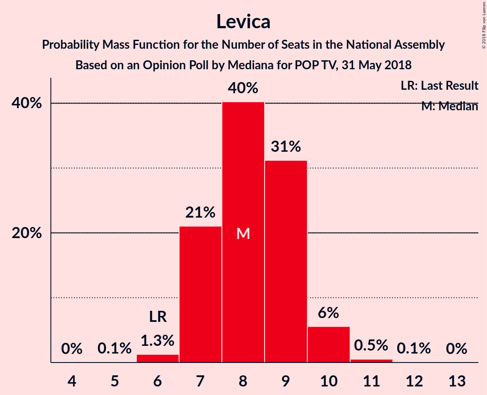
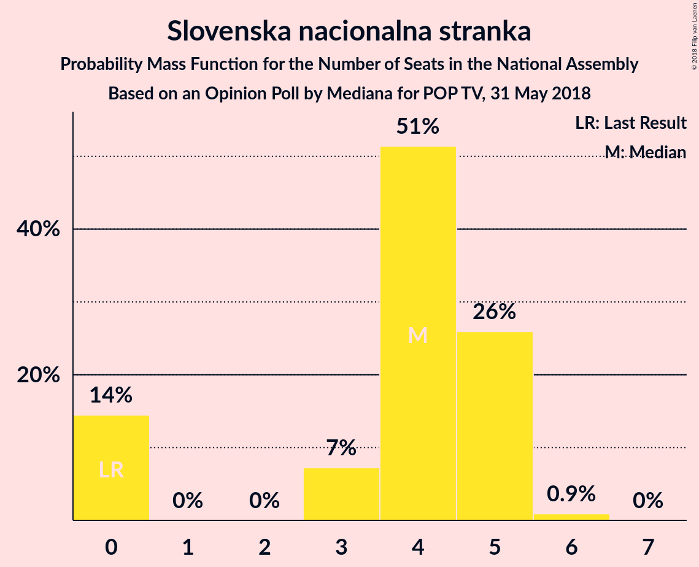

# Opinion Poll by Mediana for POP TV, 31 May 2018

<a href="#voting-intentions">Voting Intentions</a> | <a href="#seats">Seats</a> | <a href="#coalitions">Coalitions</a> | <a href="#technical-information">Technical Information</a>

## Voting Intentions

### Confidence Intervals

| Party | Last Result | Poll Result | 80% Confidence Interval | 90% Confidence Interval | 95% Confidence Interval | 99% Confidence Interval |
|:-----:|:-----------:|:-----------:|:-----------------------:|:-----------------------:|:-----------------------:|:-----------------------:|
| Slovenska demokratska stranka | 20.7% | 27.1% | 25.3–29.1% |24.8–29.6% |24.4–30.1% |23.5–31.0% |
| Lista Marjana Šarca | 0.0% | 12.8% | 11.5–14.3% |11.1–14.8% |10.8–15.1% |10.2–15.9% |
| Levica | 6.0% | 9.1% | 8.0–10.4% |7.7–10.8% |7.4–11.1% |6.9–11.8% |
| Socialni demokrati | 6.0% | 9.0% | 7.9–10.3% |7.6–10.7% |7.3–11.0% |6.8–11.6% |
| Stranka modernega centra | 34.5% | 8.8% | 7.7–10.1% |7.4–10.4% |7.1–10.7% |6.6–11.4% |
| Nova Slovenija–Krščanski demokrati | 5.6% | 6.5% | 5.6–7.7% |5.3–8.0% |5.1–8.3% |4.7–8.9% |
| Stranka Alenke Bratušek | 4.4% | 6.5% | 5.6–7.7% |5.3–8.0% |5.1–8.3% |4.7–8.9% |
| Demokratična stranka upokojencev Slovenije | 10.2% | 5.1% | 4.3–6.2% |4.1–6.5% |3.9–6.7% |3.5–7.3% |
| Slovenska nacionalna stranka | 2.2% | 4.6% | 3.8–5.6% |3.6–5.9% |3.4–6.1% |3.1–6.7% |
| Slovenska ljudska stranka | 4.0% | 2.9% | 2.3–3.7% |2.1–4.0% |2.0–4.2% |1.7–4.6% |

*Note:* The poll result column reflects the actual value used in the calculations. Published results may vary slightly, and in addition be rounded to fewer digits.

## Seats

### Confidence Intervals

| Party | Last Result | Median | 80% Confidence Interval | 90% Confidence Interval | 95% Confidence Interval | 99% Confidence Interval |
|:-----:|:-----------:|:------:|:-----------------------:|:-----------------------:|:-----------------------:|:-----------------------:|
| <a href="#slovenska-demokratska-stranka">Slovenska demokratska stranka</a> | 21 | 25 | 23–27 |23–28 |23–28 |22–30 |
| <a href="#lista-marjana-šarca">Lista Marjana Šarca</a> | 0 | 12 | 10–13 |10–14 |10–14 |9–15 |
| <a href="#levica">Levica</a> | 6 | 8 | 7–9 |7–10 |7–10 |6–11 |
| <a href="#socialni-demokrati">Socialni demokrati</a> | 6 | 8 | 7–9 |7–10 |6–10 |6–11 |
| <a href="#stranka-modernega-centra">Stranka modernega centra</a> | 36 | 8 | 7–9 |7–9 |6–10 |6–10 |
| <a href="#nova-slovenija–krščanski-demokrati">Nova Slovenija–Krščanski demokrati</a> | 5 | 6 | 5–7 |5–7 |5–7 |4–8 |
| <a href="#stranka-alenke-bratušek">Stranka Alenke Bratušek</a> | 4 | 6 | 5–6 |4–7 |4–7 |4–8 |
| <a href="#demokratična-stranka-upokojencev-slovenije">Demokratična stranka upokojencev Slovenije</a> | 10 | 4 | 4–5 |4–6 |0–6 |0–7 |
| <a href="#slovenska-nacionalna-stranka">Slovenska nacionalna stranka</a> | 0 | 4 | 0–5 |0–5 |0–5 |0–6 |
| <a href="#slovenska-ljudska-stranka">Slovenska ljudska stranka</a> | 0 | 0 | 0 |0 |0–3 |0–4 |

### Slovenska demokratska stranka

*For a full overview of the results for this party, see the [Slovenska demokratska stranka](party-slovenskademokratskastranka.html) page.*

| Number of Seats | Probability | Accumulated | Special Marks |
|:---------------:|:-----------:|:-----------:|:-------------:|
| 21 | 0.2% | 100% | Last Result |
| 22 | 1.3% | 99.8% |  |
| 23 | 9% | 98.6% |  |
| 24 | 20% | 90% |  |
| 25 | 27% | 70% | Median |
| 26 | 21% | 43% |  |
| 27 | 13% | 22% |  |
| 28 | 7% | 9% |  |
| 29 | 2% | 2% |  |
| 30 | 0.5% | 0.5% |  |
| 31 | 0% | 0.1% |  |
| 32 | 0% | 0% |  |

### Lista Marjana Šarca

*For a full overview of the results for this party, see the [Lista Marjana Šarca](party-listamarjanašarca.html) page.*

| Number of Seats | Probability | Accumulated | Special Marks |
|:---------------:|:-----------:|:-----------:|:-------------:|
| 0 | 0% | 100% | Last Result |
| 1 | 0% | 100% |  |
| 2 | 0% | 100% |  |
| 3 | 0% | 100% |  |
| 4 | 0% | 100% |  |
| 5 | 0% | 100% |  |
| 6 | 0% | 100% |  |
| 7 | 0% | 100% |  |
| 8 | 0% | 100% |  |
| 9 | 1.5% | 100% |  |
| 10 | 10% | 98% |  |
| 11 | 29% | 89% |  |
| 12 | 25% | 59% | Median |
| 13 | 28% | 35% |  |
| 14 | 6% | 7% |  |
| 15 | 0.5% | 0.5% |  |
| 16 | 0% | 0.1% |  |
| 17 | 0% | 0% |  |

### Levica

*For a full overview of the results for this party, see the [Levica](party-levica.html) page.*

| Number of Seats | Probability | Accumulated | Special Marks |
|:---------------:|:-----------:|:-----------:|:-------------:|
| 5 | 0.1% | 100% |  |
| 6 | 1.3% | 99.9% | Last Result |
| 7 | 21% | 98.6% |  |
| 8 | 40% | 78% | Median |
| 9 | 31% | 37% |  |
| 10 | 6% | 6% |  |
| 11 | 0.5% | 0.6% |  |
| 12 | 0.1% | 0.1% |  |
| 13 | 0% | 0% |  |

### Socialni demokrati

*For a full overview of the results for this party, see the [Socialni demokrati](party-socialnidemokrati.html) page.*

| Number of Seats | Probability | Accumulated | Special Marks |
|:---------------:|:-----------:|:-----------:|:-------------:|
| 5 | 0.1% | 100% |  |
| 6 | 2% | 99.9% | Last Result |
| 7 | 24% | 97% |  |
| 8 | 35% | 73% | Median |
| 9 | 29% | 38% |  |
| 10 | 8% | 9% |  |
| 11 | 0.9% | 0.9% |  |
| 12 | 0.1% | 0.1% |  |
| 13 | 0% | 0% |  |

### Stranka modernega centra

*For a full overview of the results for this party, see the [Stranka modernega centra](party-strankamodernegacentra.html) page.*

| Number of Seats | Probability | Accumulated | Special Marks |
|:---------------:|:-----------:|:-----------:|:-------------:|
| 5 | 0.1% | 100% |  |
| 6 | 3% | 99.9% |  |
| 7 | 43% | 97% |  |
| 8 | 20% | 54% | Median |
| 9 | 29% | 34% |  |
| 10 | 4% | 5% |  |
| 11 | 0.4% | 0.4% |  |
| 12 | 0% | 0% |  |
| 13 | 0% | 0% |  |
| 14 | 0% | 0% |  |
| 15 | 0% | 0% |  |
| 16 | 0% | 0% |  |
| 17 | 0% | 0% |  |
| 18 | 0% | 0% |  |
| 19 | 0% | 0% |  |
| 20 | 0% | 0% |  |
| 21 | 0% | 0% |  |
| 22 | 0% | 0% |  |
| 23 | 0% | 0% |  |
| 24 | 0% | 0% |  |
| 25 | 0% | 0% |  |
| 26 | 0% | 0% |  |
| 27 | 0% | 0% |  |
| 28 | 0% | 0% |  |
| 29 | 0% | 0% |  |
| 30 | 0% | 0% |  |
| 31 | 0% | 0% |  |
| 32 | 0% | 0% |  |
| 33 | 0% | 0% |  |
| 34 | 0% | 0% |  |
| 35 | 0% | 0% |  |
| 36 | 0% | 0% | Last Result |

### Nova Slovenija–Krščanski demokrati

*For a full overview of the results for this party, see the [Nova Slovenija–Krščanski demokrati](party-novaslovenija–krščanskidemokrati.html) page.*

| Number of Seats | Probability | Accumulated | Special Marks |
|:---------------:|:-----------:|:-----------:|:-------------:|
| 4 | 2% | 100% |  |
| 5 | 46% | 98% | Last Result |
| 6 | 40% | 53% | Median |
| 7 | 10% | 12% |  |
| 8 | 2% | 2% |  |
| 9 | 0.2% | 0.2% |  |
| 10 | 0% | 0% |  |

### Stranka Alenke Bratušek

*For a full overview of the results for this party, see the [Stranka Alenke Bratušek](party-strankaalenkebratušek.html) page.*

| Number of Seats | Probability | Accumulated | Special Marks |
|:---------------:|:-----------:|:-----------:|:-------------:|
| 4 | 6% | 100% | Last Result |
| 5 | 24% | 94% |  |
| 6 | 60% | 70% | Median |
| 7 | 8% | 10% |  |
| 8 | 2% | 2% |  |
| 9 | 0.1% | 0.1% |  |
| 10 | 0% | 0% |  |

### Demokratična stranka upokojencev Slovenije

*For a full overview of the results for this party, see the [Demokratična stranka upokojencev Slovenije](party-demokratičnastrankaupokojencevslovenije.html) page.*

| Number of Seats | Probability | Accumulated | Special Marks |
|:---------------:|:-----------:|:-----------:|:-------------:|
| 0 | 3% | 100% |  |
| 1 | 0% | 97% |  |
| 2 | 0% | 97% |  |
| 3 | 1.5% | 97% |  |
| 4 | 51% | 95% | Median |
| 5 | 37% | 44% |  |
| 6 | 6% | 7% |  |
| 7 | 0.7% | 0.7% |  |
| 8 | 0% | 0% |  |
| 9 | 0% | 0% |  |
| 10 | 0% | 0% | Last Result |

### Slovenska nacionalna stranka

*For a full overview of the results for this party, see the [Slovenska nacionalna stranka](party-slovenskanacionalnastranka.html) page.*

| Number of Seats | Probability | Accumulated | Special Marks |
|:---------------:|:-----------:|:-----------:|:-------------:|
| 0 | 14% | 100% | Last Result |
| 1 | 0% | 86% |  |
| 2 | 0% | 86% |  |
| 3 | 7% | 86% |  |
| 4 | 51% | 78% | Median |
| 5 | 26% | 27% |  |
| 6 | 0.9% | 0.9% |  |
| 7 | 0% | 0% |  |

### Slovenska ljudska stranka

*For a full overview of the results for this party, see the [Slovenska ljudska stranka](party-slovenskaljudskastranka.html) page.*

| Number of Seats | Probability | Accumulated | Special Marks |
|:---------------:|:-----------:|:-----------:|:-------------:|
| 0 | 97% | 100% | Last Result, Median |
| 1 | 0% | 3% |  |
| 2 | 0% | 3% |  |
| 3 | 1.1% | 3% |  |
| 4 | 2% | 2% |  |
| 5 | 0% | 0% |  |

## Coalitions

### Confidence Intervals

| Coalition | Last Result | Median | Majority? | 80% Confidence Interval | 90% Confidence Interval | 95% Confidence Interval | 99% Confidence Interval |
|:---------:|:-----------:|:------:|:---------:|:-----------------------:|:-----------------------:|:-----------------------:|:-----------------------:|
| Lista Marjana Šarca – Socialni demokrati – Stranka modernega centra – Nova Slovenija–Krščanski demokrati – Stranka Alenke Bratušek – Demokratična stranka upokojencev Slovenije | 61 | 43 | 20% | 41–47 | 41–48 | 40–48 | 39–48 |
| Slovenska demokratska stranka – Lista Marjana Šarca – Demokratična stranka upokojencev Slovenije | 31 | 42 | 1.1% | 40–44 | 39–44 | 38–45 | 37–46 |
| Lista Marjana Šarca – Socialni demokrati – Stranka modernega centra – Nova Slovenija–Krščanski demokrati – Demokratična stranka upokojencev Slovenije | 57 | 38 | 0% | 35–41 | 35–42 | 34–42 | 33–43 |
| Lista Marjana Šarca – Socialni demokrati – Stranka modernega centra – Stranka Alenke Bratušek – Demokratična stranka upokojencev Slovenije | 56 | 38 | 0% | 36–41 | 35–42 | 34–42 | 33–42 |
| Slovenska demokratska stranka – Lista Marjana Šarca | 21 | 37 | 0% | 35–39 | 34–40 | 34–41 | 33–42 |
| Lista Marjana Šarca – Socialni demokrati – Stranka modernega centra – Nova Slovenija–Krščanski demokrati | 47 | 34 | 0% | 31–36 | 30–37 | 30–37 | 30–38 |
| Lista Marjana Šarca – Socialni demokrati – Stranka modernega centra – Demokratična stranka upokojencev Slovenije | 52 | 32 | 0% | 30–35 | 30–36 | 29–36 | 27–37 |
| Lista Marjana Šarca – Socialni demokrati – Nova Slovenija–Krščanski demokrati – Demokratična stranka upokojencev Slovenije | 21 | 30 | 0% | 28–33 | 27–33 | 27–33 | 25–34 |
| Lista Marjana Šarca – Socialni demokrati – Stranka modernega centra | 42 | 28 | 0% | 25–31 | 25–31 | 25–31 | 24–32 |
| Lista Marjana Šarca – Socialni demokrati – Nova Slovenija–Krščanski demokrati | 11 | 26 | 0% | 23–28 | 23–28 | 23–28 | 22–30 |
| Lista Marjana Šarca – Socialni demokrati – Demokratična stranka upokojencev Slovenije | 16 | 25 | 0% | 22–27 | 22–27 | 21–27 | 19–28 |
| Socialni demokrati – Stranka modernega centra – Demokratična stranka upokojencev Slovenije | 52 | 20 | 0% | 19–23 | 18–23 | 17–24 | 15–24 |
| Lista Marjana Šarca – Socialni demokrati | 6 | 21 | 0% | 18–22 | 18–22 | 18–22 | 17–24 |

### Lista Marjana Šarca – Socialni demokrati – Stranka modernega centra – Nova Slovenija–Krščanski demokrati – Stranka Alenke Bratušek – Demokratična stranka upokojencev Slovenije

| Number of Seats | Probability | Accumulated | Special Marks |
|:---------------:|:-----------:|:-----------:|:-------------:|
| 37 | 0% | 100% |  |
| 38 | 0.2% | 99.9% |  |
| 39 | 0.7% | 99.8% |  |
| 40 | 4% | 99.1% |  |
| 41 | 9% | 95% |  |
| 42 | 11% | 86% |  |
| 43 | 27% | 75% |  |
| 44 | 17% | 49% | Median |
| 45 | 11% | 31% |  |
| 46 | 10% | 20% | Majority |
| 47 | 3% | 10% |  |
| 48 | 6% | 7% |  |
| 49 | 0.3% | 0.5% |  |
| 50 | 0.2% | 0.2% |  |
| 51 | 0% | 0% |  |
| 52 | 0% | 0% |  |
| 53 | 0% | 0% |  |
| 54 | 0% | 0% |  |
| 55 | 0% | 0% |  |
| 56 | 0% | 0% |  |
| 57 | 0% | 0% |  |
| 58 | 0% | 0% |  |
| 59 | 0% | 0% |  |
| 60 | 0% | 0% |  |
| 61 | 0% | 0% | Last Result |

### Slovenska demokratska stranka – Lista Marjana Šarca – Demokratična stranka upokojencev Slovenije

| Number of Seats | Probability | Accumulated | Special Marks |
|:---------------:|:-----------:|:-----------:|:-------------:|
| 31 | 0% | 100% | Last Result |
| 32 | 0% | 100% |  |
| 33 | 0% | 100% |  |
| 34 | 0% | 100% |  |
| 35 | 0.1% | 100% |  |
| 36 | 0.3% | 99.9% |  |
| 37 | 0.6% | 99.6% |  |
| 38 | 2% | 99.0% |  |
| 39 | 5% | 97% |  |
| 40 | 26% | 92% |  |
| 41 | 8% | 65% | Median |
| 42 | 30% | 57% |  |
| 43 | 10% | 27% |  |
| 44 | 12% | 17% |  |
| 45 | 4% | 5% |  |
| 46 | 0.9% | 1.1% | Majority |
| 47 | 0.1% | 0.2% |  |
| 48 | 0.1% | 0.1% |  |
| 49 | 0% | 0% |  |

### Lista Marjana Šarca – Socialni demokrati – Stranka modernega centra – Nova Slovenija–Krščanski demokrati – Demokratična stranka upokojencev Slovenije

| Number of Seats | Probability | Accumulated | Special Marks |
|:---------------:|:-----------:|:-----------:|:-------------:|
| 32 | 0.1% | 100% |  |
| 33 | 0.6% | 99.8% |  |
| 34 | 3% | 99.2% |  |
| 35 | 8% | 97% |  |
| 36 | 12% | 89% |  |
| 37 | 18% | 77% |  |
| 38 | 23% | 59% | Median |
| 39 | 16% | 36% |  |
| 40 | 9% | 21% |  |
| 41 | 3% | 12% |  |
| 42 | 8% | 8% |  |
| 43 | 0.3% | 0.5% |  |
| 44 | 0.1% | 0.2% |  |
| 45 | 0.1% | 0.1% |  |
| 46 | 0% | 0% | Majority |
| 47 | 0% | 0% |  |
| 48 | 0% | 0% |  |
| 49 | 0% | 0% |  |
| 50 | 0% | 0% |  |
| 51 | 0% | 0% |  |
| 52 | 0% | 0% |  |
| 53 | 0% | 0% |  |
| 54 | 0% | 0% |  |
| 55 | 0% | 0% |  |
| 56 | 0% | 0% |  |
| 57 | 0% | 0% | Last Result |

### Lista Marjana Šarca – Socialni demokrati – Stranka modernega centra – Stranka Alenke Bratušek – Demokratična stranka upokojencev Slovenije

| Number of Seats | Probability | Accumulated | Special Marks |
|:---------------:|:-----------:|:-----------:|:-------------:|
| 32 | 0.1% | 100% |  |
| 33 | 0.6% | 99.8% |  |
| 34 | 2% | 99.3% |  |
| 35 | 4% | 97% |  |
| 36 | 16% | 93% |  |
| 37 | 19% | 77% |  |
| 38 | 20% | 58% | Median |
| 39 | 16% | 38% |  |
| 40 | 6% | 22% |  |
| 41 | 7% | 16% |  |
| 42 | 8% | 8% |  |
| 43 | 0.3% | 0.5% |  |
| 44 | 0.2% | 0.2% |  |
| 45 | 0% | 0% |  |
| 46 | 0% | 0% | Majority |
| 47 | 0% | 0% |  |
| 48 | 0% | 0% |  |
| 49 | 0% | 0% |  |
| 50 | 0% | 0% |  |
| 51 | 0% | 0% |  |
| 52 | 0% | 0% |  |
| 53 | 0% | 0% |  |
| 54 | 0% | 0% |  |
| 55 | 0% | 0% |  |
| 56 | 0% | 0% | Last Result |

### Slovenska demokratska stranka – Lista Marjana Šarca

| Number of Seats | Probability | Accumulated | Special Marks |
|:---------------:|:-----------:|:-----------:|:-------------:|
| 21 | 0% | 100% | Last Result |
| 22 | 0% | 100% |  |
| 23 | 0% | 100% |  |
| 24 | 0% | 100% |  |
| 25 | 0% | 100% |  |
| 26 | 0% | 100% |  |
| 27 | 0% | 100% |  |
| 28 | 0% | 100% |  |
| 29 | 0% | 100% |  |
| 30 | 0% | 100% |  |
| 31 | 0% | 100% |  |
| 32 | 0.1% | 100% |  |
| 33 | 1.2% | 99.9% |  |
| 34 | 4% | 98.7% |  |
| 35 | 6% | 95% |  |
| 36 | 29% | 89% |  |
| 37 | 15% | 60% | Median |
| 38 | 23% | 45% |  |
| 39 | 13% | 22% |  |
| 40 | 5% | 9% |  |
| 41 | 3% | 4% |  |
| 42 | 0.6% | 0.8% |  |
| 43 | 0.1% | 0.1% |  |
| 44 | 0% | 0% |  |

### Lista Marjana Šarca – Socialni demokrati – Stranka modernega centra – Nova Slovenija–Krščanski demokrati

| Number of Seats | Probability | Accumulated | Special Marks |
|:---------------:|:-----------:|:-----------:|:-------------:|
| 28 | 0.1% | 100% |  |
| 29 | 0.4% | 99.9% |  |
| 30 | 7% | 99.6% |  |
| 31 | 7% | 93% |  |
| 32 | 11% | 86% |  |
| 33 | 25% | 75% |  |
| 34 | 22% | 51% | Median |
| 35 | 12% | 29% |  |
| 36 | 7% | 17% |  |
| 37 | 8% | 10% |  |
| 38 | 1.2% | 1.5% |  |
| 39 | 0.2% | 0.3% |  |
| 40 | 0% | 0.1% |  |
| 41 | 0% | 0% |  |
| 42 | 0% | 0% |  |
| 43 | 0% | 0% |  |
| 44 | 0% | 0% |  |
| 45 | 0% | 0% |  |
| 46 | 0% | 0% | Majority |
| 47 | 0% | 0% | Last Result |

### Lista Marjana Šarca – Socialni demokrati – Stranka modernega centra – Demokratična stranka upokojencev Slovenije

| Number of Seats | Probability | Accumulated | Special Marks |
|:---------------:|:-----------:|:-----------:|:-------------:|
| 26 | 0.2% | 100% |  |
| 27 | 0.3% | 99.8% |  |
| 28 | 1.1% | 99.5% |  |
| 29 | 3% | 98% |  |
| 30 | 14% | 96% |  |
| 31 | 15% | 82% |  |
| 32 | 30% | 67% | Median |
| 33 | 10% | 38% |  |
| 34 | 12% | 28% |  |
| 35 | 6% | 15% |  |
| 36 | 8% | 9% |  |
| 37 | 0.3% | 0.5% |  |
| 38 | 0.2% | 0.2% |  |
| 39 | 0% | 0% |  |
| 40 | 0% | 0% |  |
| 41 | 0% | 0% |  |
| 42 | 0% | 0% |  |
| 43 | 0% | 0% |  |
| 44 | 0% | 0% |  |
| 45 | 0% | 0% |  |
| 46 | 0% | 0% | Majority |
| 47 | 0% | 0% |  |
| 48 | 0% | 0% |  |
| 49 | 0% | 0% |  |
| 50 | 0% | 0% |  |
| 51 | 0% | 0% |  |
| 52 | 0% | 0% | Last Result |

### Lista Marjana Šarca – Socialni demokrati – Nova Slovenija–Krščanski demokrati – Demokratična stranka upokojencev Slovenije

| Number of Seats | Probability | Accumulated | Special Marks |
|:---------------:|:-----------:|:-----------:|:-------------:|
| 21 | 0% | 100% | Last Result |
| 22 | 0% | 100% |  |
| 23 | 0% | 100% |  |
| 24 | 0.2% | 100% |  |
| 25 | 0.4% | 99.8% |  |
| 26 | 1.2% | 99.4% |  |
| 27 | 5% | 98% |  |
| 28 | 12% | 93% |  |
| 29 | 16% | 81% |  |
| 30 | 23% | 65% | Median |
| 31 | 24% | 42% |  |
| 32 | 7% | 18% |  |
| 33 | 10% | 11% |  |
| 34 | 1.1% | 1.4% |  |
| 35 | 0.2% | 0.3% |  |
| 36 | 0.1% | 0.1% |  |
| 37 | 0% | 0% |  |

### Lista Marjana Šarca – Socialni demokrati – Stranka modernega centra

| Number of Seats | Probability | Accumulated | Special Marks |
|:---------------:|:-----------:|:-----------:|:-------------:|
| 23 | 0.2% | 100% |  |
| 24 | 0.5% | 99.8% |  |
| 25 | 10% | 99.3% |  |
| 26 | 12% | 89% |  |
| 27 | 14% | 77% |  |
| 28 | 33% | 63% | Median |
| 29 | 8% | 30% |  |
| 30 | 8% | 22% |  |
| 31 | 12% | 14% |  |
| 32 | 1.1% | 1.3% |  |
| 33 | 0.2% | 0.3% |  |
| 34 | 0% | 0% |  |
| 35 | 0% | 0% |  |
| 36 | 0% | 0% |  |
| 37 | 0% | 0% |  |
| 38 | 0% | 0% |  |
| 39 | 0% | 0% |  |
| 40 | 0% | 0% |  |
| 41 | 0% | 0% |  |
| 42 | 0% | 0% | Last Result |

### Lista Marjana Šarca – Socialni demokrati – Nova Slovenija–Krščanski demokrati

| Number of Seats | Probability | Accumulated | Special Marks |
|:---------------:|:-----------:|:-----------:|:-------------:|
| 11 | 0% | 100% | Last Result |
| 12 | 0% | 100% |  |
| 13 | 0% | 100% |  |
| 14 | 0% | 100% |  |
| 15 | 0% | 100% |  |
| 16 | 0% | 100% |  |
| 17 | 0% | 100% |  |
| 18 | 0% | 100% |  |
| 19 | 0% | 100% |  |
| 20 | 0% | 100% |  |
| 21 | 0.1% | 100% |  |
| 22 | 1.1% | 99.8% |  |
| 23 | 10% | 98.7% |  |
| 24 | 14% | 88% |  |
| 25 | 15% | 74% |  |
| 26 | 24% | 59% | Median |
| 27 | 21% | 35% |  |
| 28 | 12% | 14% |  |
| 29 | 1.1% | 2% |  |
| 30 | 0.7% | 0.9% |  |
| 31 | 0.2% | 0.2% |  |
| 32 | 0% | 0% |  |

### Lista Marjana Šarca – Socialni demokrati – Demokratična stranka upokojencev Slovenije

| Number of Seats | Probability | Accumulated | Special Marks |
|:---------------:|:-----------:|:-----------:|:-------------:|
| 16 | 0% | 100% | Last Result |
| 17 | 0% | 100% |  |
| 18 | 0.3% | 100% |  |
| 19 | 0.2% | 99.7% |  |
| 20 | 0.5% | 99.5% |  |
| 21 | 2% | 99.0% |  |
| 22 | 10% | 97% |  |
| 23 | 16% | 86% |  |
| 24 | 15% | 70% | Median |
| 25 | 32% | 56% |  |
| 26 | 12% | 23% |  |
| 27 | 11% | 12% |  |
| 28 | 0.8% | 1.1% |  |
| 29 | 0.3% | 0.4% |  |
| 30 | 0.1% | 0.1% |  |
| 31 | 0% | 0% |  |

### Socialni demokrati – Stranka modernega centra – Demokratična stranka upokojencev Slovenije

| Number of Seats | Probability | Accumulated | Special Marks |
|:---------------:|:-----------:|:-----------:|:-------------:|
| 14 | 0.3% | 100% |  |
| 15 | 0.3% | 99.7% |  |
| 16 | 1.1% | 99.4% |  |
| 17 | 2% | 98% |  |
| 18 | 5% | 97% |  |
| 19 | 26% | 91% |  |
| 20 | 20% | 65% | Median |
| 21 | 17% | 45% |  |
| 22 | 9% | 28% |  |
| 23 | 15% | 18% |  |
| 24 | 3% | 3% |  |
| 25 | 0.4% | 0.5% |  |
| 26 | 0.1% | 0.1% |  |
| 27 | 0% | 0% |  |
| 28 | 0% | 0% |  |
| 29 | 0% | 0% |  |
| 30 | 0% | 0% |  |
| 31 | 0% | 0% |  |
| 32 | 0% | 0% |  |
| 33 | 0% | 0% |  |
| 34 | 0% | 0% |  |
| 35 | 0% | 0% |  |
| 36 | 0% | 0% |  |
| 37 | 0% | 0% |  |
| 38 | 0% | 0% |  |
| 39 | 0% | 0% |  |
| 40 | 0% | 0% |  |
| 41 | 0% | 0% |  |
| 42 | 0% | 0% |  |
| 43 | 0% | 0% |  |
| 44 | 0% | 0% |  |
| 45 | 0% | 0% |  |
| 46 | 0% | 0% | Majority |
| 47 | 0% | 0% |  |
| 48 | 0% | 0% |  |
| 49 | 0% | 0% |  |
| 50 | 0% | 0% |  |
| 51 | 0% | 0% |  |
| 52 | 0% | 0% | Last Result |

### Lista Marjana Šarca – Socialni demokrati

| Number of Seats | Probability | Accumulated | Special Marks |
|:---------------:|:-----------:|:-----------:|:-------------:|
| 6 | 0% | 100% | Last Result |
| 7 | 0% | 100% |  |
| 8 | 0% | 100% |  |
| 9 | 0% | 100% |  |
| 10 | 0% | 100% |  |
| 11 | 0% | 100% |  |
| 12 | 0% | 100% |  |
| 13 | 0% | 100% |  |
| 14 | 0% | 100% |  |
| 15 | 0% | 100% |  |
| 16 | 0.2% | 100% |  |
| 17 | 2% | 99.8% |  |
| 18 | 20% | 98% |  |
| 19 | 15% | 78% |  |
| 20 | 12% | 62% | Median |
| 21 | 33% | 50% |  |
| 22 | 15% | 17% |  |
| 23 | 2% | 2% |  |
| 24 | 0.4% | 0.5% |  |
| 25 | 0.1% | 0.2% |  |
| 26 | 0% | 0% |  |

## Technical Information

### Opinion Poll

+ **Polling firm:** Mediana
+ **Commissioner(s):** POP TV
+ **Fieldwork period:** 31 May 2018

### Calculations

+ **Sample size:** 936
+ **Simulations done:** 1,048,576
+ **Error estimate:** 0.87%

