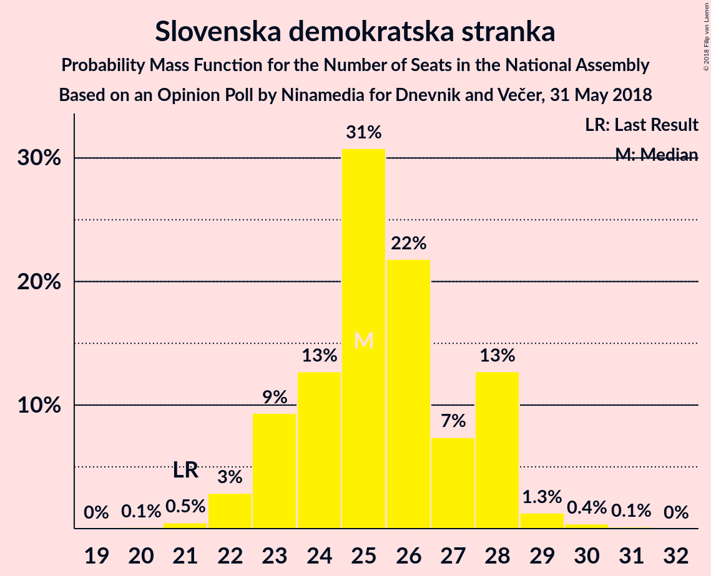
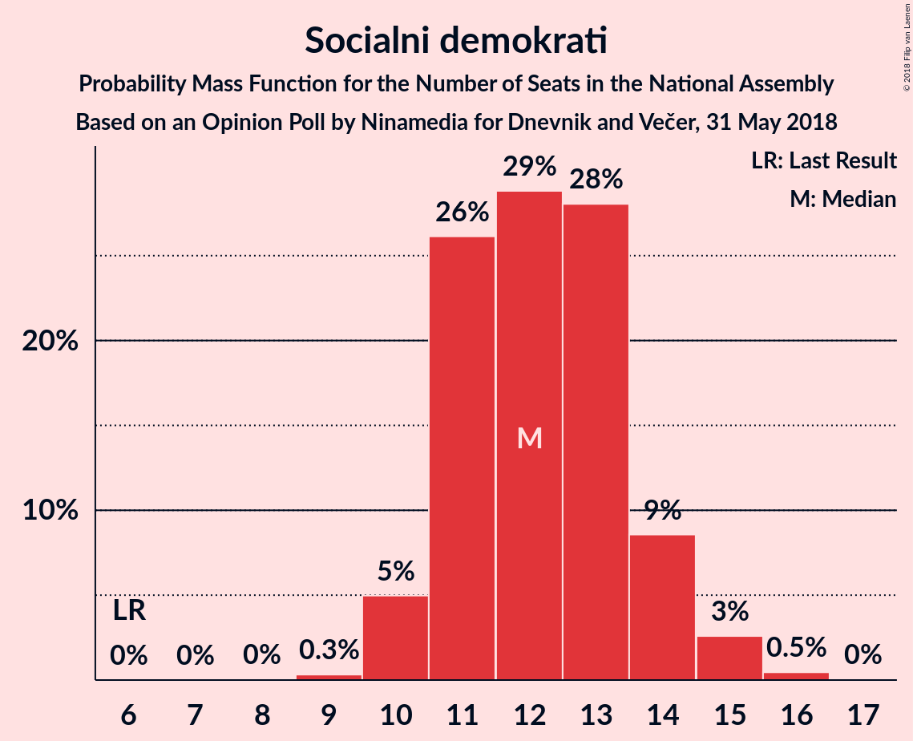

# Opinion Poll by Ninamedia for Dnevnik and Večer, 31 May 2018

<a href="#voting-intentions">Voting Intentions</a> | <a href="#seats">Seats</a> | <a href="#coalitions">Coalitions</a> | <a href="#technical-information">Technical Information</a>

## Voting Intentions

### Confidence Intervals

| Party | Last Result | Poll Result | 80% Confidence Interval | 90% Confidence Interval | 95% Confidence Interval | 99% Confidence Interval |
|:-----:|:-----------:|:-----------:|:-----------------------:|:-----------------------:|:-----------------------:|:-----------------------:|
| Slovenska demokratska stranka | 20.7% | 26.1% | 24.3–28.1% |23.8–28.6% |23.3–29.1% |22.5–30.0% |
| Socialni demokrati | 6.0% | 12.8% | 11.4–14.3% |11.1–14.7% |10.7–15.1% |10.1–15.9% |
| Lista Marjana Šarca | 0.0% | 11.4% | 10.2–12.9% |9.8–13.3% |9.5–13.7% |8.9–14.4% |
| Stranka modernega centra | 34.5% | 9.8% | 8.6–11.2% |8.3–11.6% |8.0–11.9% |7.5–12.6% |
| Levica | 6.0% | 8.3% | 7.3–9.6% |7.0–10.0% |6.7–10.3% |6.2–11.0% |
| Demokratična stranka upokojencev Slovenije | 10.2% | 7.9% | 6.8–9.2% |6.6–9.5% |6.3–9.8% |5.8–10.5% |
| Nova Slovenija–Krščanski demokrati | 5.6% | 7.3% | 6.3–8.6% |6.0–8.9% |5.8–9.2% |5.3–9.9% |
| Slovenska ljudska stranka | 4.0% | 3.8% | 3.1–4.7% |2.9–5.0% |2.7–5.2% |2.4–5.7% |
| Slovenska nacionalna stranka | 2.2% | 3.4% | 2.8–4.4% |2.6–4.6% |2.4–4.9% |2.1–5.3% |
| Stranka Alenke Bratušek | 4.4% | 3.2% | 2.6–4.1% |2.4–4.4% |2.3–4.6% |2.0–5.1% |

*Note:* The poll result column reflects the actual value used in the calculations. Published results may vary slightly, and in addition be rounded to fewer digits.

## Seats

### Confidence Intervals

| Party | Last Result | Median | 80% Confidence Interval | 90% Confidence Interval | 95% Confidence Interval | 99% Confidence Interval |
|:-----:|:-----------:|:------:|:-----------------------:|:-----------------------:|:-----------------------:|:-----------------------:|
| <a href="#slovenska-demokratska-stranka">Slovenska demokratska stranka</a> | 21 | 25 | 23–28 |22–28 |22–28 |22–29 |
| <a href="#socialni-demokrati">Socialni demokrati</a> | 6 | 11 | 11–13 |11–14 |10–14 |10–15 |
| <a href="#lista-marjana-šarca">Lista Marjana Šarca</a> | 0 | 11 | 9–12 |9–13 |9–13 |8–14 |
| <a href="#stranka-modernega-centra">Stranka modernega centra</a> | 36 | 10 | 8–10 |7–11 |7–11 |7–11 |
| <a href="#levica">Levica</a> | 6 | 8 | 7–9 |7–9 |6–10 |6–10 |
| <a href="#demokratična-stranka-upokojencev-slovenije">Demokratična stranka upokojencev Slovenije</a> | 10 | 7 | 6–8 |6–9 |6–9 |6–9 |
| <a href="#nova-slovenija–krščanski-demokrati">Nova Slovenija–Krščanski demokrati</a> | 5 | 7 | 6–8 |5–8 |5–9 |5–9 |
| <a href="#slovenska-ljudska-stranka">Slovenska ljudska stranka</a> | 0 | 4 | 0–4 |0–4 |0–5 |0–5 |
| <a href="#slovenska-nacionalna-stranka">Slovenska nacionalna stranka</a> | 0 | 0 | 0–4 |0–4 |0–4 |0–5 |
| <a href="#stranka-alenke-bratušek">Stranka Alenke Bratušek</a> | 4 | 0 | 0 |0 |0 |0–4 |

### Slovenska demokratska stranka

*For a full overview of the results for this party, see the [Slovenska demokratska stranka](party-slovenskademokratskastranka.html) page.*

| Number of Seats | Probability | Accumulated | Special Marks |
|:---------------:|:-----------:|:-----------:|:-------------:|
| 21 | 0.3% | 100% | Last Result |
| 22 | 6% | 99.7% |  |
| 23 | 10% | 94% |  |
| 24 | 14% | 84% |  |
| 25 | 48% | 70% | Median |
| 26 | 6% | 22% |  |
| 27 | 1.0% | 16% |  |
| 28 | 14% | 15% |  |
| 29 | 1.3% | 2% |  |
| 30 | 0.2% | 0.2% |  |
| 31 | 0% | 0% |  |

### Socialni demokrati

*For a full overview of the results for this party, see the [Socialni demokrati](party-socialnidemokrati.html) page.*

| Number of Seats | Probability | Accumulated | Special Marks |
|:---------------:|:-----------:|:-----------:|:-------------:|
| 6 | 0% | 100% | Last Result |
| 7 | 0% | 100% |  |
| 8 | 0% | 100% |  |
| 9 | 0.1% | 100% |  |
| 10 | 5% | 99.9% |  |
| 11 | 47% | 95% | Median |
| 12 | 21% | 49% |  |
| 13 | 21% | 28% |  |
| 14 | 5% | 7% |  |
| 15 | 2% | 2% |  |
| 16 | 0.1% | 0.2% |  |
| 17 | 0% | 0% |  |

### Lista Marjana Šarca

*For a full overview of the results for this party, see the [Lista Marjana Šarca](party-listamarjanašarca.html) page.*

| Number of Seats | Probability | Accumulated | Special Marks |
|:---------------:|:-----------:|:-----------:|:-------------:|
| 0 | 0% | 100% | Last Result |
| 1 | 0% | 100% |  |
| 2 | 0% | 100% |  |
| 3 | 0% | 100% |  |
| 4 | 0% | 100% |  |
| 5 | 0% | 100% |  |
| 6 | 0% | 100% |  |
| 7 | 0.1% | 100% |  |
| 8 | 2% | 99.9% |  |
| 9 | 13% | 98% |  |
| 10 | 23% | 85% |  |
| 11 | 48% | 62% | Median |
| 12 | 7% | 14% |  |
| 13 | 7% | 7% |  |
| 14 | 0.7% | 0.7% |  |
| 15 | 0% | 0% |  |

### Stranka modernega centra

*For a full overview of the results for this party, see the [Stranka modernega centra](party-strankamodernegacentra.html) page.*

| Number of Seats | Probability | Accumulated | Special Marks |
|:---------------:|:-----------:|:-----------:|:-------------:|
| 6 | 0.3% | 100% |  |
| 7 | 6% | 99.7% |  |
| 8 | 8% | 93% |  |
| 9 | 27% | 85% |  |
| 10 | 51% | 58% | Median |
| 11 | 7% | 8% |  |
| 12 | 0.3% | 0.3% |  |
| 13 | 0% | 0% |  |
| 14 | 0% | 0% |  |
| 15 | 0% | 0% |  |
| 16 | 0% | 0% |  |
| 17 | 0% | 0% |  |
| 18 | 0% | 0% |  |
| 19 | 0% | 0% |  |
| 20 | 0% | 0% |  |
| 21 | 0% | 0% |  |
| 22 | 0% | 0% |  |
| 23 | 0% | 0% |  |
| 24 | 0% | 0% |  |
| 25 | 0% | 0% |  |
| 26 | 0% | 0% |  |
| 27 | 0% | 0% |  |
| 28 | 0% | 0% |  |
| 29 | 0% | 0% |  |
| 30 | 0% | 0% |  |
| 31 | 0% | 0% |  |
| 32 | 0% | 0% |  |
| 33 | 0% | 0% |  |
| 34 | 0% | 0% |  |
| 35 | 0% | 0% |  |
| 36 | 0% | 0% | Last Result |

### Levica

*For a full overview of the results for this party, see the [Levica](party-levica.html) page.*

| Number of Seats | Probability | Accumulated | Special Marks |
|:---------------:|:-----------:|:-----------:|:-------------:|
| 5 | 0.2% | 100% |  |
| 6 | 4% | 99.8% | Last Result |
| 7 | 16% | 96% |  |
| 8 | 52% | 80% | Median |
| 9 | 25% | 28% |  |
| 10 | 3% | 3% |  |
| 11 | 0.2% | 0.2% |  |
| 12 | 0% | 0% |  |

### Demokratična stranka upokojencev Slovenije

*For a full overview of the results for this party, see the [Demokratična stranka upokojencev Slovenije](party-demokratičnastrankaupokojencevslovenije.html) page.*

| Number of Seats | Probability | Accumulated | Special Marks |
|:---------------:|:-----------:|:-----------:|:-------------:|
| 5 | 0.4% | 100% |  |
| 6 | 10% | 99.5% |  |
| 7 | 44% | 90% | Median |
| 8 | 41% | 46% |  |
| 9 | 5% | 5% |  |
| 10 | 0.2% | 0.2% | Last Result |
| 11 | 0% | 0% |  |

### Nova Slovenija–Krščanski demokrati

*For a full overview of the results for this party, see the [Nova Slovenija–Krščanski demokrati](party-novaslovenija–krščanskidemokrati.html) page.*

| Number of Seats | Probability | Accumulated | Special Marks |
|:---------------:|:-----------:|:-----------:|:-------------:|
| 4 | 0.1% | 100% |  |
| 5 | 5% | 99.9% | Last Result |
| 6 | 43% | 95% |  |
| 7 | 29% | 51% | Median |
| 8 | 18% | 23% |  |
| 9 | 4% | 4% |  |
| 10 | 0.2% | 0.2% |  |
| 11 | 0% | 0% |  |

### Slovenska ljudska stranka

*For a full overview of the results for this party, see the [Slovenska ljudska stranka](party-slovenskaljudskastranka.html) page.*

| Number of Seats | Probability | Accumulated | Special Marks |
|:---------------:|:-----------:|:-----------:|:-------------:|
| 0 | 38% | 100% | Last Result |
| 1 | 0% | 62% |  |
| 2 | 0% | 62% |  |
| 3 | 5% | 62% |  |
| 4 | 52% | 57% | Median |
| 5 | 4% | 4% |  |
| 6 | 0.2% | 0.2% |  |
| 7 | 0% | 0% |  |

### Slovenska nacionalna stranka

*For a full overview of the results for this party, see the [Slovenska nacionalna stranka](party-slovenskanacionalnastranka.html) page.*

| Number of Seats | Probability | Accumulated | Special Marks |
|:---------------:|:-----------:|:-----------:|:-------------:|
| 0 | 77% | 100% | Last Result, Median |
| 1 | 0% | 23% |  |
| 2 | 0% | 23% |  |
| 3 | 0.1% | 23% |  |
| 4 | 22% | 23% |  |
| 5 | 1.0% | 1.0% |  |
| 6 | 0% | 0% |  |

### Stranka Alenke Bratušek

*For a full overview of the results for this party, see the [Stranka Alenke Bratušek](party-strankaalenkebratušek.html) page.*

| Number of Seats | Probability | Accumulated | Special Marks |
|:---------------:|:-----------:|:-----------:|:-------------:|
| 0 | 98% | 100% | Median |
| 1 | 0% | 2% |  |
| 2 | 0% | 2% |  |
| 3 | 0.5% | 2% |  |
| 4 | 2% | 2% | Last Result |
| 5 | 0.4% | 0.4% |  |
| 6 | 0% | 0% |  |

## Coalitions

### Confidence Intervals

| Coalition | Last Result | Median | Majority? | 80% Confidence Interval | 90% Confidence Interval | 95% Confidence Interval | 99% Confidence Interval |
|:---------:|:-----------:|:------:|:---------:|:-----------------------:|:-----------------------:|:-----------------------:|:-----------------------:|
| Socialni demokrati – Lista Marjana Šarca – Stranka modernega centra – Demokratična stranka upokojencev Slovenije – Nova Slovenija–Krščanski demokrati – Stranka Alenke Bratušek | 61 | 46 | 74% | 44–49 | 44–49 | 43–50 | 42–53 |
| Socialni demokrati – Lista Marjana Šarca – Stranka modernega centra – Demokratična stranka upokojencev Slovenije – Nova Slovenija–Krščanski demokrati | 57 | 46 | 73% | 44–49 | 44–49 | 43–50 | 42–51 |
| Slovenska demokratska stranka – Lista Marjana Šarca – Demokratična stranka upokojencev Slovenije | 31 | 44 | 11% | 40–46 | 39–46 | 39–48 | 38–48 |
| Socialni demokrati – Lista Marjana Šarca – Stranka modernega centra – Demokratična stranka upokojencev Slovenije – Stranka Alenke Bratušek | 56 | 40 | 0.8% | 37–41 | 37–43 | 36–43 | 36–47 |
| Socialni demokrati – Lista Marjana Šarca – Stranka modernega centra – Demokratična stranka upokojencev Slovenije | 52 | 40 | 0% | 37–41 | 37–43 | 36–43 | 36–44 |
| Socialni demokrati – Lista Marjana Šarca – Stranka modernega centra – Nova Slovenija–Krščanski demokrati | 47 | 38 | 0% | 37–41 | 37–42 | 35–42 | 35–45 |
| Socialni demokrati – Lista Marjana Šarca – Demokratična stranka upokojencev Slovenije – Nova Slovenija–Krščanski demokrati | 21 | 36 | 0% | 36–39 | 35–40 | 34–40 | 33–42 |
| Slovenska demokratska stranka – Lista Marjana Šarca | 21 | 36 | 0% | 33–38 | 33–39 | 33–39 | 31–40 |
| Socialni demokrati – Lista Marjana Šarca – Stranka modernega centra | 42 | 32 | 0% | 30–34 | 30–36 | 29–36 | 28–36 |
| Socialni demokrati – Lista Marjana Šarca – Demokratična stranka upokojencev Slovenije | 16 | 30 | 0% | 28–32 | 28–32 | 28–33 | 26–35 |
| Socialni demokrati – Lista Marjana Šarca – Nova Slovenija–Krščanski demokrati | 11 | 29 | 0% | 28–31 | 27–32 | 27–33 | 26–35 |
| Socialni demokrati – Stranka modernega centra – Demokratična stranka upokojencev Slovenije | 52 | 29 | 0% | 27–30 | 27–31 | 26–31 | 25–33 |
| Socialni demokrati – Lista Marjana Šarca | 6 | 22 | 0% | 21–25 | 21–25 | 20–26 | 20–27 |

### Socialni demokrati – Lista Marjana Šarca – Stranka modernega centra – Demokratična stranka upokojencev Slovenije – Nova Slovenija–Krščanski demokrati – Stranka Alenke Bratušek

| Number of Seats | Probability | Accumulated | Special Marks |
|:---------------:|:-----------:|:-----------:|:-------------:|
| 41 | 0.2% | 100% |  |
| 42 | 1.4% | 99.7% |  |
| 43 | 2% | 98% |  |
| 44 | 6% | 96% |  |
| 45 | 16% | 90% |  |
| 46 | 55% | 74% | Median, Majority |
| 47 | 2% | 19% |  |
| 48 | 6% | 18% |  |
| 49 | 7% | 11% |  |
| 50 | 2% | 4% |  |
| 51 | 1.4% | 2% |  |
| 52 | 0.1% | 0.9% |  |
| 53 | 0.8% | 0.9% |  |
| 54 | 0% | 0% |  |
| 55 | 0% | 0% |  |
| 56 | 0% | 0% |  |
| 57 | 0% | 0% |  |
| 58 | 0% | 0% |  |
| 59 | 0% | 0% |  |
| 60 | 0% | 0% |  |
| 61 | 0% | 0% | Last Result |

### Socialni demokrati – Lista Marjana Šarca – Stranka modernega centra – Demokratična stranka upokojencev Slovenije – Nova Slovenija–Krščanski demokrati

| Number of Seats | Probability | Accumulated | Special Marks |
|:---------------:|:-----------:|:-----------:|:-------------:|
| 40 | 0% | 100% |  |
| 41 | 0.4% | 99.9% |  |
| 42 | 2% | 99.6% |  |
| 43 | 3% | 98% |  |
| 44 | 7% | 95% |  |
| 45 | 16% | 89% |  |
| 46 | 55% | 73% | Median, Majority |
| 47 | 2% | 18% |  |
| 48 | 6% | 16% |  |
| 49 | 7% | 10% |  |
| 50 | 1.3% | 3% |  |
| 51 | 1.3% | 1.4% |  |
| 52 | 0% | 0.1% |  |
| 53 | 0.1% | 0.1% |  |
| 54 | 0% | 0% |  |
| 55 | 0% | 0% |  |
| 56 | 0% | 0% |  |
| 57 | 0% | 0% | Last Result |

### Slovenska demokratska stranka – Lista Marjana Šarca – Demokratična stranka upokojencev Slovenije

| Number of Seats | Probability | Accumulated | Special Marks |
|:---------------:|:-----------:|:-----------:|:-------------:|
| 31 | 0% | 100% | Last Result |
| 32 | 0% | 100% |  |
| 33 | 0% | 100% |  |
| 34 | 0% | 100% |  |
| 35 | 0% | 100% |  |
| 36 | 0% | 100% |  |
| 37 | 0.4% | 100% |  |
| 38 | 2% | 99.6% |  |
| 39 | 5% | 98% |  |
| 40 | 8% | 93% |  |
| 41 | 6% | 85% |  |
| 42 | 11% | 78% |  |
| 43 | 7% | 67% | Median |
| 44 | 47% | 60% |  |
| 45 | 2% | 13% |  |
| 46 | 7% | 11% | Majority |
| 47 | 1.1% | 4% |  |
| 48 | 3% | 3% |  |
| 49 | 0% | 0% |  |

### Socialni demokrati – Lista Marjana Šarca – Stranka modernega centra – Demokratična stranka upokojencev Slovenije – Stranka Alenke Bratušek

| Number of Seats | Probability | Accumulated | Special Marks |
|:---------------:|:-----------:|:-----------:|:-------------:|
| 34 | 0% | 100% |  |
| 35 | 0.2% | 99.9% |  |
| 36 | 4% | 99.8% |  |
| 37 | 14% | 95% |  |
| 38 | 12% | 82% |  |
| 39 | 14% | 70% | Median |
| 40 | 37% | 55% |  |
| 41 | 9% | 19% |  |
| 42 | 4% | 10% |  |
| 43 | 5% | 6% |  |
| 44 | 0.9% | 2% |  |
| 45 | 0.1% | 0.9% |  |
| 46 | 0.1% | 0.8% | Majority |
| 47 | 0.7% | 0.7% |  |
| 48 | 0% | 0% |  |
| 49 | 0% | 0% |  |
| 50 | 0% | 0% |  |
| 51 | 0% | 0% |  |
| 52 | 0% | 0% |  |
| 53 | 0% | 0% |  |
| 54 | 0% | 0% |  |
| 55 | 0% | 0% |  |
| 56 | 0% | 0% | Last Result |

### Socialni demokrati – Lista Marjana Šarca – Stranka modernega centra – Demokratična stranka upokojencev Slovenije

| Number of Seats | Probability | Accumulated | Special Marks |
|:---------------:|:-----------:|:-----------:|:-------------:|
| 34 | 0.1% | 100% |  |
| 35 | 0.2% | 99.9% |  |
| 36 | 5% | 99.7% |  |
| 37 | 14% | 95% |  |
| 38 | 12% | 81% |  |
| 39 | 14% | 69% | Median |
| 40 | 37% | 54% |  |
| 41 | 9% | 18% |  |
| 42 | 3% | 9% |  |
| 43 | 5% | 6% |  |
| 44 | 0.5% | 0.6% |  |
| 45 | 0.1% | 0.1% |  |
| 46 | 0% | 0% | Majority |
| 47 | 0% | 0% |  |
| 48 | 0% | 0% |  |
| 49 | 0% | 0% |  |
| 50 | 0% | 0% |  |
| 51 | 0% | 0% |  |
| 52 | 0% | 0% | Last Result |

### Socialni demokrati – Lista Marjana Šarca – Stranka modernega centra – Nova Slovenija–Krščanski demokrati

| Number of Seats | Probability | Accumulated | Special Marks |
|:---------------:|:-----------:|:-----------:|:-------------:|
| 33 | 0.2% | 100% |  |
| 34 | 0.2% | 99.8% |  |
| 35 | 2% | 99.6% |  |
| 36 | 1.0% | 97% |  |
| 37 | 9% | 96% |  |
| 38 | 46% | 88% |  |
| 39 | 26% | 41% | Median |
| 40 | 3% | 15% |  |
| 41 | 2% | 12% |  |
| 42 | 7% | 9% |  |
| 43 | 1.2% | 2% |  |
| 44 | 0.5% | 1.2% |  |
| 45 | 0.7% | 0.8% |  |
| 46 | 0% | 0% | Majority |
| 47 | 0% | 0% | Last Result |

### Socialni demokrati – Lista Marjana Šarca – Demokratična stranka upokojencev Slovenije – Nova Slovenija–Krščanski demokrati

| Number of Seats | Probability | Accumulated | Special Marks |
|:---------------:|:-----------:|:-----------:|:-------------:|
| 21 | 0% | 100% | Last Result |
| 22 | 0% | 100% |  |
| 23 | 0% | 100% |  |
| 24 | 0% | 100% |  |
| 25 | 0% | 100% |  |
| 26 | 0% | 100% |  |
| 27 | 0% | 100% |  |
| 28 | 0% | 100% |  |
| 29 | 0% | 100% |  |
| 30 | 0% | 100% |  |
| 31 | 0.1% | 100% |  |
| 32 | 0.1% | 99.9% |  |
| 33 | 2% | 99.8% |  |
| 34 | 2% | 98% |  |
| 35 | 4% | 95% |  |
| 36 | 57% | 91% | Median |
| 37 | 12% | 34% |  |
| 38 | 9% | 21% |  |
| 39 | 7% | 13% |  |
| 40 | 3% | 5% |  |
| 41 | 1.3% | 2% |  |
| 42 | 0.2% | 0.6% |  |
| 43 | 0.4% | 0.4% |  |
| 44 | 0% | 0% |  |

### Slovenska demokratska stranka – Lista Marjana Šarca

| Number of Seats | Probability | Accumulated | Special Marks |
|:---------------:|:-----------:|:-----------:|:-------------:|
| 21 | 0% | 100% | Last Result |
| 22 | 0% | 100% |  |
| 23 | 0% | 100% |  |
| 24 | 0% | 100% |  |
| 25 | 0% | 100% |  |
| 26 | 0% | 100% |  |
| 27 | 0% | 100% |  |
| 28 | 0% | 100% |  |
| 29 | 0% | 100% |  |
| 30 | 0% | 100% |  |
| 31 | 0.7% | 100% |  |
| 32 | 2% | 99.3% |  |
| 33 | 13% | 98% |  |
| 34 | 6% | 85% |  |
| 35 | 13% | 78% |  |
| 36 | 40% | 65% | Median |
| 37 | 13% | 25% |  |
| 38 | 3% | 12% |  |
| 39 | 8% | 8% |  |
| 40 | 0.7% | 0.9% |  |
| 41 | 0.1% | 0.2% |  |
| 42 | 0% | 0% |  |

### Socialni demokrati – Lista Marjana Šarca – Stranka modernega centra

| Number of Seats | Probability | Accumulated | Special Marks |
|:---------------:|:-----------:|:-----------:|:-------------:|
| 27 | 0.1% | 100% |  |
| 28 | 1.0% | 99.8% |  |
| 29 | 2% | 98.8% |  |
| 30 | 16% | 97% |  |
| 31 | 9% | 81% |  |
| 32 | 55% | 72% | Median |
| 33 | 5% | 17% |  |
| 34 | 6% | 13% |  |
| 35 | 2% | 7% |  |
| 36 | 5% | 5% |  |
| 37 | 0.2% | 0.2% |  |
| 38 | 0% | 0% |  |
| 39 | 0% | 0% |  |
| 40 | 0% | 0% |  |
| 41 | 0% | 0% |  |
| 42 | 0% | 0% | Last Result |

### Socialni demokrati – Lista Marjana Šarca – Demokratična stranka upokojencev Slovenije

| Number of Seats | Probability | Accumulated | Special Marks |
|:---------------:|:-----------:|:-----------:|:-------------:|
| 16 | 0% | 100% | Last Result |
| 17 | 0% | 100% |  |
| 18 | 0% | 100% |  |
| 19 | 0% | 100% |  |
| 20 | 0% | 100% |  |
| 21 | 0% | 100% |  |
| 22 | 0% | 100% |  |
| 23 | 0% | 100% |  |
| 24 | 0% | 100% |  |
| 25 | 0% | 100% |  |
| 26 | 2% | 99.9% |  |
| 27 | 0.6% | 98% |  |
| 28 | 12% | 98% |  |
| 29 | 20% | 86% | Median |
| 30 | 48% | 66% |  |
| 31 | 2% | 18% |  |
| 32 | 12% | 16% |  |
| 33 | 2% | 4% |  |
| 34 | 0.9% | 2% |  |
| 35 | 0.6% | 0.7% |  |
| 36 | 0.1% | 0.1% |  |
| 37 | 0% | 0% |  |

### Socialni demokrati – Lista Marjana Šarca – Nova Slovenija–Krščanski demokrati

| Number of Seats | Probability | Accumulated | Special Marks |
|:---------------:|:-----------:|:-----------:|:-------------:|
| 11 | 0% | 100% | Last Result |
| 12 | 0% | 100% |  |
| 13 | 0% | 100% |  |
| 14 | 0% | 100% |  |
| 15 | 0% | 100% |  |
| 16 | 0% | 100% |  |
| 17 | 0% | 100% |  |
| 18 | 0% | 100% |  |
| 19 | 0% | 100% |  |
| 20 | 0% | 100% |  |
| 21 | 0% | 100% |  |
| 22 | 0% | 100% |  |
| 23 | 0% | 100% |  |
| 24 | 0% | 100% |  |
| 25 | 0.3% | 99.9% |  |
| 26 | 0.6% | 99.6% |  |
| 27 | 6% | 99.0% |  |
| 28 | 37% | 93% |  |
| 29 | 18% | 56% | Median |
| 30 | 20% | 38% |  |
| 31 | 7% | 17% |  |
| 32 | 6% | 10% |  |
| 33 | 3% | 4% |  |
| 34 | 0.3% | 2% |  |
| 35 | 1.2% | 1.2% |  |
| 36 | 0% | 0% |  |

### Socialni demokrati – Stranka modernega centra – Demokratična stranka upokojencev Slovenije

| Number of Seats | Probability | Accumulated | Special Marks |
|:---------------:|:-----------:|:-----------:|:-------------:|
| 24 | 0.2% | 100% |  |
| 25 | 0.5% | 99.8% |  |
| 26 | 3% | 99.3% |  |
| 27 | 23% | 97% |  |
| 28 | 11% | 73% | Median |
| 29 | 40% | 63% |  |
| 30 | 16% | 23% |  |
| 31 | 5% | 7% |  |
| 32 | 1.2% | 2% |  |
| 33 | 0.8% | 0.9% |  |
| 34 | 0.1% | 0.1% |  |
| 35 | 0% | 0% |  |
| 36 | 0% | 0% |  |
| 37 | 0% | 0% |  |
| 38 | 0% | 0% |  |
| 39 | 0% | 0% |  |
| 40 | 0% | 0% |  |
| 41 | 0% | 0% |  |
| 42 | 0% | 0% |  |
| 43 | 0% | 0% |  |
| 44 | 0% | 0% |  |
| 45 | 0% | 0% |  |
| 46 | 0% | 0% | Majority |
| 47 | 0% | 0% |  |
| 48 | 0% | 0% |  |
| 49 | 0% | 0% |  |
| 50 | 0% | 0% |  |
| 51 | 0% | 0% |  |
| 52 | 0% | 0% | Last Result |

### Socialni demokrati – Lista Marjana Šarca

| Number of Seats | Probability | Accumulated | Special Marks |
|:---------------:|:-----------:|:-----------:|:-------------:|
| 6 | 0% | 100% | Last Result |
| 7 | 0% | 100% |  |
| 8 | 0% | 100% |  |
| 9 | 0% | 100% |  |
| 10 | 0% | 100% |  |
| 11 | 0% | 100% |  |
| 12 | 0% | 100% |  |
| 13 | 0% | 100% |  |
| 14 | 0% | 100% |  |
| 15 | 0% | 100% |  |
| 16 | 0% | 100% |  |
| 17 | 0% | 100% |  |
| 18 | 0% | 100% |  |
| 19 | 0.3% | 99.9% |  |
| 20 | 3% | 99.7% |  |
| 21 | 11% | 96% |  |
| 22 | 50% | 85% | Median |
| 23 | 20% | 35% |  |
| 24 | 3% | 15% |  |
| 25 | 8% | 12% |  |
| 26 | 3% | 3% |  |
| 27 | 0.5% | 0.6% |  |
| 28 | 0.1% | 0.1% |  |
| 29 | 0% | 0% |  |

## Technical Information

### Opinion Poll

+ **Polling firm:** Ninamedia
+ **Commissioner(s):** Dnevnik and Večer
+ **Fieldwork period:** 31 May 2018

### Calculations

+ **Sample size:** 900
+ **Simulations done:** 131,072
+ **Error estimate:** 2.68%

