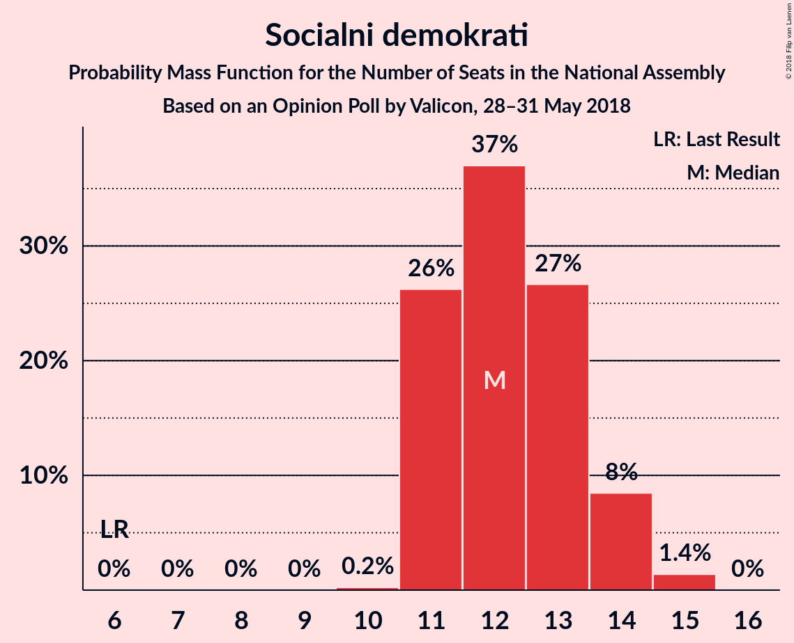
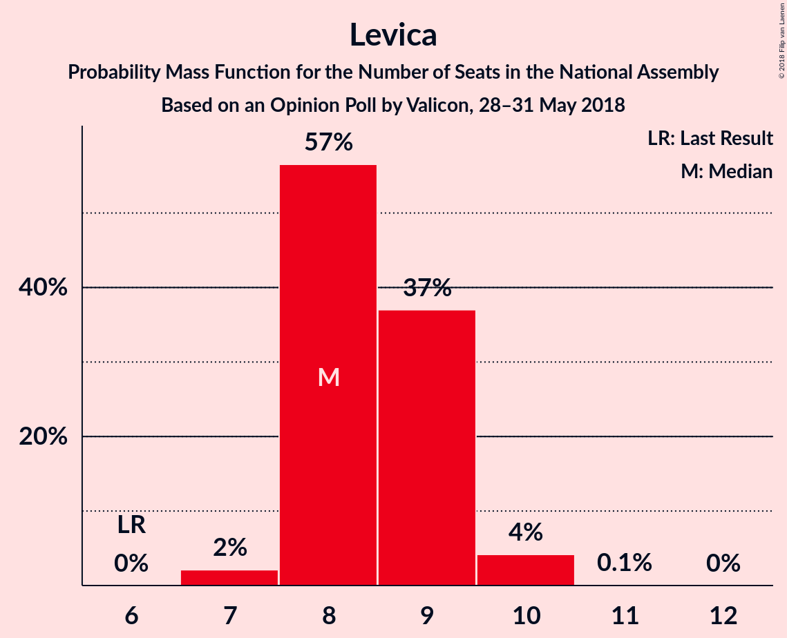
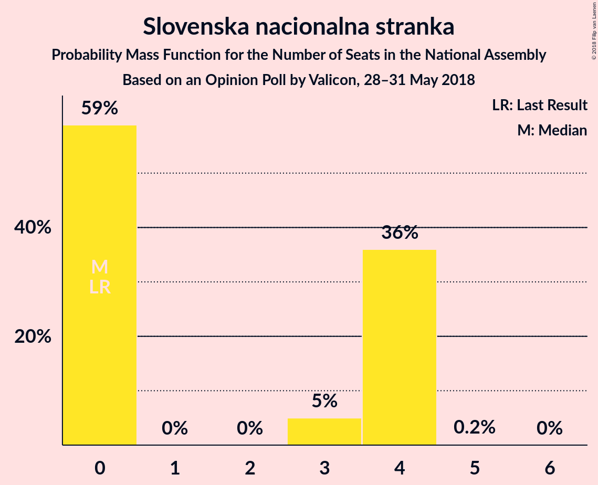

# Opinion Poll by Valicon, 28–31 May 2018

<a href="#voting-intentions">Voting Intentions</a> | <a href="#seats">Seats</a> | <a href="#coalitions">Coalitions</a> | <a href="#technical-information">Technical Information</a>

## Voting Intentions

### Confidence Intervals

| Party | Last Result | Poll Result | 80% Confidence Interval | 90% Confidence Interval | 95% Confidence Interval | 99% Confidence Interval |
|:-----:|:-----------:|:-----------:|:-----------------------:|:-----------------------:|:-----------------------:|:-----------------------:|
| Slovenska demokratska stranka | 20.7% | 17.3% | 16.2–18.5% |16.0–18.8% |15.7–19.1% |15.2–19.6% |
| Socialni demokrati | 6.0% | 13.2% | 12.3–14.2% |12.0–14.5% |11.8–14.8% |11.3–15.3% |
| Lista Marjana Šarca | 0.0% | 12.3% | 11.4–13.3% |11.1–13.5% |10.9–13.8% |10.5–14.3% |
| Levica | 6.0% | 9.1% | 8.3–10.0% |8.1–10.2% |7.9–10.4% |7.5–10.9% |
| Stranka modernega centra | 34.5% | 8.1% | 7.4–9.0% |7.2–9.2% |7.0–9.4% |6.7–9.9% |
| Nova Slovenija–Krščanski demokrati | 5.6% | 7.1% | 6.4–7.9% |6.2–8.2% |6.1–8.4% |5.7–8.8% |
| Demokratična stranka upokojencev Slovenije | 10.2% | 4.8% | 4.3–5.5% |4.1–5.7% |4.0–5.9% |3.7–6.2% |
| Stranka Alenke Bratušek | 4.4% | 4.4% | 3.8–5.0% |3.7–5.2% |3.6–5.4% |3.3–5.7% |
| Slovenska nacionalna stranka | 2.2% | 3.8% | 3.3–4.4% |3.1–4.6% |3.0–4.7% |2.8–5.0% |
| Slovenska ljudska stranka | 4.0% | 2.9% | 2.4–3.4% |2.3–3.6% |2.2–3.7% |2.0–4.0% |
| Glas za otroke in družine–Nova ljudska stranka Slovenije | 0.0% | 0.5% | 0.3–0.7% |0.3–0.8% |0.2–0.9% |0.2–1.0% |

*Note:* The poll result column reflects the actual value used in the calculations. Published results may vary slightly, and in addition be rounded to fewer digits.

## Seats

### Confidence Intervals

| Party | Last Result | Median | 80% Confidence Interval | 90% Confidence Interval | 95% Confidence Interval | 99% Confidence Interval |
|:-----:|:-----------:|:------:|:-----------------------:|:-----------------------:|:-----------------------:|:-----------------------:|
| <a href="#slovenska-demokratska-stranka">Slovenska demokratska stranka</a> | 21 | 16 | 15–18 |15–18 |15–19 |15–20 |
| <a href="#socialni-demokrati">Socialni demokrati</a> | 6 | 12 | 11–13 |11–14 |11–14 |11–15 |
| <a href="#lista-marjana-šarca">Lista Marjana Šarca</a> | 0 | 12 | 11–13 |11–13 |10–13 |10–14 |
| <a href="#levica">Levica</a> | 6 | 8 | 8–9 |8–9 |8–10 |7–10 |
| <a href="#stranka-modernega-centra">Stranka modernega centra</a> | 36 | 8 | 7–8 |7–8 |6–9 |6–9 |
| <a href="#nova-slovenija–krščanski-demokrati">Nova Slovenija–Krščanski demokrati</a> | 5 | 6 | 6–7 |6–8 |6–8 |5–8 |
| <a href="#demokratična-stranka-upokojencev-slovenije">Demokratična stranka upokojencev Slovenije</a> | 10 | 4 | 3–5 |0–5 |0–5 |0–5 |
| <a href="#stranka-alenke-bratušek">Stranka Alenke Bratušek</a> | 4 | 4 | 3–4 |0–5 |0–5 |0–5 |
| <a href="#slovenska-nacionalna-stranka">Slovenska nacionalna stranka</a> | 0 | 0 | 0–4 |0–4 |0–4 |0–4 |
| <a href="#slovenska-ljudska-stranka">Slovenska ljudska stranka</a> | 0 | 0 | 0 |0 |0 |0–3 |
| <a href="#glas-za-otroke-in-družine–nova-ljudska-stranka-slovenije">Glas za otroke in družine–Nova ljudska stranka Slovenije</a> | 0 | 0 | 0 |0 |0 |0 |

### Slovenska demokratska stranka

*For a full overview of the results for this party, see the [Slovenska demokratska stranka](party-slovenskademokratskastranka.html) page.*

| Number of Seats | Probability | Accumulated | Special Marks |
|:---------------:|:-----------:|:-----------:|:-------------:|
| 14 | 0.4% | 100% |  |
| 15 | 13% | 99.6% |  |
| 16 | 51% | 86% | Median |
| 17 | 17% | 35% |  |
| 18 | 15% | 18% |  |
| 19 | 2% | 3% |  |
| 20 | 0.6% | 0.6% |  |
| 21 | 0% | 0% | Last Result |

### Socialni demokrati

*For a full overview of the results for this party, see the [Socialni demokrati](party-socialnidemokrati.html) page.*

| Number of Seats | Probability | Accumulated | Special Marks |
|:---------------:|:-----------:|:-----------:|:-------------:|
| 6 | 0% | 100% | Last Result |
| 7 | 0% | 100% |  |
| 8 | 0% | 100% |  |
| 9 | 0% | 100% |  |
| 10 | 0.2% | 100% |  |
| 11 | 26% | 99.8% |  |
| 12 | 37% | 74% | Median |
| 13 | 27% | 37% |  |
| 14 | 8% | 10% |  |
| 15 | 1.4% | 1.4% |  |
| 16 | 0% | 0% |  |

### Lista Marjana Šarca

*For a full overview of the results for this party, see the [Lista Marjana Šarca](party-listamarjanašarca.html) page.*

| Number of Seats | Probability | Accumulated | Special Marks |
|:---------------:|:-----------:|:-----------:|:-------------:|
| 0 | 0% | 100% | Last Result |
| 1 | 0% | 100% |  |
| 2 | 0% | 100% |  |
| 3 | 0% | 100% |  |
| 4 | 0% | 100% |  |
| 5 | 0% | 100% |  |
| 6 | 0% | 100% |  |
| 7 | 0% | 100% |  |
| 8 | 0% | 100% |  |
| 9 | 0.1% | 100% |  |
| 10 | 3% | 99.9% |  |
| 11 | 38% | 96% |  |
| 12 | 29% | 59% | Median |
| 13 | 29% | 30% |  |
| 14 | 0.9% | 0.9% |  |
| 15 | 0% | 0% |  |

### Levica

*For a full overview of the results for this party, see the [Levica](party-levica.html) page.*

| Number of Seats | Probability | Accumulated | Special Marks |
|:---------------:|:-----------:|:-----------:|:-------------:|
| 6 | 0% | 100% | Last Result |
| 7 | 2% | 100% |  |
| 8 | 57% | 98% | Median |
| 9 | 37% | 41% |  |
| 10 | 4% | 4% |  |
| 11 | 0.1% | 0.1% |  |
| 12 | 0% | 0% |  |

### Stranka modernega centra

*For a full overview of the results for this party, see the [Stranka modernega centra](party-strankamodernegacentra.html) page.*

| Number of Seats | Probability | Accumulated | Special Marks |
|:---------------:|:-----------:|:-----------:|:-------------:|
| 6 | 4% | 100% |  |
| 7 | 22% | 96% |  |
| 8 | 70% | 74% | Median |
| 9 | 4% | 4% |  |
| 10 | 0.1% | 0.1% |  |
| 11 | 0% | 0% |  |
| 12 | 0% | 0% |  |
| 13 | 0% | 0% |  |
| 14 | 0% | 0% |  |
| 15 | 0% | 0% |  |
| 16 | 0% | 0% |  |
| 17 | 0% | 0% |  |
| 18 | 0% | 0% |  |
| 19 | 0% | 0% |  |
| 20 | 0% | 0% |  |
| 21 | 0% | 0% |  |
| 22 | 0% | 0% |  |
| 23 | 0% | 0% |  |
| 24 | 0% | 0% |  |
| 25 | 0% | 0% |  |
| 26 | 0% | 0% |  |
| 27 | 0% | 0% |  |
| 28 | 0% | 0% |  |
| 29 | 0% | 0% |  |
| 30 | 0% | 0% |  |
| 31 | 0% | 0% |  |
| 32 | 0% | 0% |  |
| 33 | 0% | 0% |  |
| 34 | 0% | 0% |  |
| 35 | 0% | 0% |  |
| 36 | 0% | 0% | Last Result |

### Nova Slovenija–Krščanski demokrati

*For a full overview of the results for this party, see the [Nova Slovenija–Krščanski demokrati](party-novaslovenija–krščanskidemokrati.html) page.*

| Number of Seats | Probability | Accumulated | Special Marks |
|:---------------:|:-----------:|:-----------:|:-------------:|
| 5 | 2% | 100% | Last Result |
| 6 | 62% | 98% | Median |
| 7 | 30% | 36% |  |
| 8 | 6% | 6% |  |
| 9 | 0.1% | 0.1% |  |
| 10 | 0% | 0% |  |

### Demokratična stranka upokojencev Slovenije

*For a full overview of the results for this party, see the [Demokratična stranka upokojencev Slovenije](party-demokratičnastrankaupokojencevslovenije.html) page.*

| Number of Seats | Probability | Accumulated | Special Marks |
|:---------------:|:-----------:|:-----------:|:-------------:|
| 0 | 9% | 100% |  |
| 1 | 0% | 91% |  |
| 2 | 0% | 91% |  |
| 3 | 1.0% | 91% |  |
| 4 | 63% | 90% | Median |
| 5 | 26% | 27% |  |
| 6 | 0.5% | 0.5% |  |
| 7 | 0% | 0% |  |
| 8 | 0% | 0% |  |
| 9 | 0% | 0% |  |
| 10 | 0% | 0% | Last Result |

### Stranka Alenke Bratušek

*For a full overview of the results for this party, see the [Stranka Alenke Bratušek](party-strankaalenkebratušek.html) page.*

| Number of Seats | Probability | Accumulated | Special Marks |
|:---------------:|:-----------:|:-----------:|:-------------:|
| 0 | 9% | 100% |  |
| 1 | 0% | 91% |  |
| 2 | 0% | 91% |  |
| 3 | 22% | 91% |  |
| 4 | 61% | 68% | Last Result, Median |
| 5 | 8% | 8% |  |
| 6 | 0% | 0% |  |

### Slovenska nacionalna stranka

*For a full overview of the results for this party, see the [Slovenska nacionalna stranka](party-slovenskanacionalnastranka.html) page.*

| Number of Seats | Probability | Accumulated | Special Marks |
|:---------------:|:-----------:|:-----------:|:-------------:|
| 0 | 59% | 100% | Last Result, Median |
| 1 | 0% | 41% |  |
| 2 | 0% | 41% |  |
| 3 | 5% | 41% |  |
| 4 | 36% | 36% |  |
| 5 | 0.2% | 0.2% |  |
| 6 | 0% | 0% |  |

### Slovenska ljudska stranka

*For a full overview of the results for this party, see the [Slovenska ljudska stranka](party-slovenskaljudskastranka.html) page.*

| Number of Seats | Probability | Accumulated | Special Marks |
|:---------------:|:-----------:|:-----------:|:-------------:|
| 0 | 99.4% | 100% | Last Result, Median |
| 1 | 0% | 0.6% |  |
| 2 | 0% | 0.6% |  |
| 3 | 0.5% | 0.6% |  |
| 4 | 0.1% | 0.1% |  |
| 5 | 0% | 0% |  |

### Glas za otroke in družine–Nova ljudska stranka Slovenije

*For a full overview of the results for this party, see the [Glas za otroke in družine–Nova ljudska stranka Slovenije](party-glaszaotrokeindružine–novaljudskastrankaslovenije.html) page.*

| Number of Seats | Probability | Accumulated | Special Marks |
|:---------------:|:-----------:|:-----------:|:-------------:|
| 0 | 100% | 100% | Last Result, Median |

## Coalitions

### Confidence Intervals

| Coalition | Last Result | Median | Majority? | 80% Confidence Interval | 90% Confidence Interval | 95% Confidence Interval | 99% Confidence Interval |
|:---------:|:-----------:|:------:|:---------:|:-----------------------:|:-----------------------:|:-----------------------:|:-----------------------:|
| Socialni demokrati – Lista Marjana Šarca – Stranka modernega centra – Nova Slovenija–Krščanski demokrati – Demokratična stranka upokojencev Slovenije – Stranka Alenke Bratušek | 61 | 46 | 52% | 43–49 | 43–49 | 43–49 | 40–49 |
| Socialni demokrati – Lista Marjana Šarca – Stranka modernega centra – Nova Slovenija–Krščanski demokrati – Demokratična stranka upokojencev Slovenije | 57 | 42 | 5% | 40–45 | 39–45 | 39–46 | 39–47 |
| Socialni demokrati – Lista Marjana Šarca – Stranka modernega centra – Demokratična stranka upokojencev Slovenije – Stranka Alenke Bratušek | 56 | 39 | 0% | 37–42 | 37–42 | 37–42 | 33–43 |
| Socialni demokrati – Lista Marjana Šarca – Stranka modernega centra – Nova Slovenija–Krščanski demokrati | 47 | 39 | 0% | 36–40 | 36–41 | 36–42 | 35–42 |
| Socialni demokrati – Lista Marjana Šarca – Stranka modernega centra – Demokratična stranka upokojencev Slovenije | 52 | 36 | 0% | 33–38 | 33–38 | 32–39 | 32–41 |
| Socialni demokrati – Lista Marjana Šarca – Nova Slovenija–Krščanski demokrati – Demokratična stranka upokojencev Slovenije | 21 | 34 | 0% | 32–37 | 31–38 | 31–38 | 31–39 |
| Slovenska demokratska stranka – Lista Marjana Šarca – Demokratična stranka upokojencev Slovenije | 31 | 32 | 0% | 30–34 | 29–35 | 29–35 | 28–36 |
| Socialni demokrati – Lista Marjana Šarca – Stranka modernega centra | 42 | 32 | 0% | 30–33 | 30–34 | 30–34 | 28–35 |
| Socialni demokrati – Lista Marjana Šarca – Nova Slovenija–Krščanski demokrati | 11 | 31 | 0% | 28–32 | 28–33 | 28–34 | 28–34 |
| Slovenska demokratska stranka – Lista Marjana Šarca | 21 | 29 | 0% | 27–30 | 26–31 | 26–31 | 26–32 |
| Socialni demokrati – Lista Marjana Šarca – Demokratična stranka upokojencev Slovenije | 16 | 28 | 0% | 26–30 | 25–30 | 25–31 | 24–32 |
| Socialni demokrati – Lista Marjana Šarca | 6 | 25 | 0% | 22–26 | 22–26 | 22–27 | 21–27 |
| Socialni demokrati – Stranka modernega centra – Demokratična stranka upokojencev Slovenije | 52 | 24 | 0% | 22–25 | 21–26 | 21–27 | 20–29 |

### Socialni demokrati – Lista Marjana Šarca – Stranka modernega centra – Nova Slovenija–Krščanski demokrati – Demokratična stranka upokojencev Slovenije – Stranka Alenke Bratušek

| Number of Seats | Probability | Accumulated | Special Marks |
|:---------------:|:-----------:|:-----------:|:-------------:|
| 40 | 0.5% | 100% |  |
| 41 | 0.2% | 99.5% |  |
| 42 | 0.3% | 99.2% |  |
| 43 | 29% | 98.9% |  |
| 44 | 6% | 70% |  |
| 45 | 12% | 64% |  |
| 46 | 15% | 52% | Median, Majority |
| 47 | 14% | 37% |  |
| 48 | 5% | 23% |  |
| 49 | 18% | 18% |  |
| 50 | 0.1% | 0.1% |  |
| 51 | 0% | 0% |  |
| 52 | 0% | 0% |  |
| 53 | 0% | 0% |  |
| 54 | 0% | 0% |  |
| 55 | 0% | 0% |  |
| 56 | 0% | 0% |  |
| 57 | 0% | 0% |  |
| 58 | 0% | 0% |  |
| 59 | 0% | 0% |  |
| 60 | 0% | 0% |  |
| 61 | 0% | 0% | Last Result |

### Socialni demokrati – Lista Marjana Šarca – Stranka modernega centra – Nova Slovenija–Krščanski demokrati – Demokratična stranka upokojencev Slovenije

| Number of Seats | Probability | Accumulated | Special Marks |
|:---------------:|:-----------:|:-----------:|:-------------:|
| 37 | 0.1% | 100% |  |
| 38 | 0.1% | 99.9% |  |
| 39 | 9% | 99.7% |  |
| 40 | 27% | 91% |  |
| 41 | 9% | 64% |  |
| 42 | 11% | 55% | Median |
| 43 | 16% | 44% |  |
| 44 | 5% | 29% |  |
| 45 | 19% | 24% |  |
| 46 | 4% | 5% | Majority |
| 47 | 0.6% | 0.7% |  |
| 48 | 0% | 0.1% |  |
| 49 | 0.1% | 0.1% |  |
| 50 | 0% | 0% |  |
| 51 | 0% | 0% |  |
| 52 | 0% | 0% |  |
| 53 | 0% | 0% |  |
| 54 | 0% | 0% |  |
| 55 | 0% | 0% |  |
| 56 | 0% | 0% |  |
| 57 | 0% | 0% | Last Result |

### Socialni demokrati – Lista Marjana Šarca – Stranka modernega centra – Demokratična stranka upokojencev Slovenije – Stranka Alenke Bratušek

| Number of Seats | Probability | Accumulated | Special Marks |
|:---------------:|:-----------:|:-----------:|:-------------:|
| 33 | 0.5% | 100% |  |
| 34 | 0.1% | 99.5% |  |
| 35 | 0.3% | 99.4% |  |
| 36 | 2% | 99.1% |  |
| 37 | 32% | 98% |  |
| 38 | 7% | 66% |  |
| 39 | 13% | 58% |  |
| 40 | 9% | 46% | Median |
| 41 | 17% | 36% |  |
| 42 | 18% | 19% |  |
| 43 | 1.3% | 1.3% |  |
| 44 | 0% | 0% |  |
| 45 | 0% | 0% |  |
| 46 | 0% | 0% | Majority |
| 47 | 0% | 0% |  |
| 48 | 0% | 0% |  |
| 49 | 0% | 0% |  |
| 50 | 0% | 0% |  |
| 51 | 0% | 0% |  |
| 52 | 0% | 0% |  |
| 53 | 0% | 0% |  |
| 54 | 0% | 0% |  |
| 55 | 0% | 0% |  |
| 56 | 0% | 0% | Last Result |

### Socialni demokrati – Lista Marjana Šarca – Stranka modernega centra – Nova Slovenija–Krščanski demokrati

| Number of Seats | Probability | Accumulated | Special Marks |
|:---------------:|:-----------:|:-----------:|:-------------:|
| 34 | 0.1% | 100% |  |
| 35 | 1.3% | 99.9% |  |
| 36 | 27% | 98.6% |  |
| 37 | 10% | 71% |  |
| 38 | 9% | 61% | Median |
| 39 | 23% | 52% |  |
| 40 | 21% | 29% |  |
| 41 | 4% | 7% |  |
| 42 | 4% | 4% |  |
| 43 | 0.1% | 0.2% |  |
| 44 | 0.1% | 0.1% |  |
| 45 | 0% | 0% |  |
| 46 | 0% | 0% | Majority |
| 47 | 0% | 0% | Last Result |

### Socialni demokrati – Lista Marjana Šarca – Stranka modernega centra – Demokratična stranka upokojencev Slovenije

| Number of Seats | Probability | Accumulated | Special Marks |
|:---------------:|:-----------:|:-----------:|:-------------:|
| 31 | 0.2% | 100% |  |
| 32 | 3% | 99.8% |  |
| 33 | 8% | 97% |  |
| 34 | 27% | 90% |  |
| 35 | 10% | 62% |  |
| 36 | 11% | 53% | Median |
| 37 | 17% | 42% |  |
| 38 | 21% | 24% |  |
| 39 | 3% | 3% |  |
| 40 | 0.2% | 0.7% |  |
| 41 | 0.5% | 0.5% |  |
| 42 | 0.1% | 0.1% |  |
| 43 | 0% | 0% |  |
| 44 | 0% | 0% |  |
| 45 | 0% | 0% |  |
| 46 | 0% | 0% | Majority |
| 47 | 0% | 0% |  |
| 48 | 0% | 0% |  |
| 49 | 0% | 0% |  |
| 50 | 0% | 0% |  |
| 51 | 0% | 0% |  |
| 52 | 0% | 0% | Last Result |

### Socialni demokrati – Lista Marjana Šarca – Nova Slovenija–Krščanski demokrati – Demokratična stranka upokojencev Slovenije

| Number of Seats | Probability | Accumulated | Special Marks |
|:---------------:|:-----------:|:-----------:|:-------------:|
| 21 | 0% | 100% | Last Result |
| 22 | 0% | 100% |  |
| 23 | 0% | 100% |  |
| 24 | 0% | 100% |  |
| 25 | 0% | 100% |  |
| 26 | 0% | 100% |  |
| 27 | 0% | 100% |  |
| 28 | 0% | 100% |  |
| 29 | 0% | 100% |  |
| 30 | 0.2% | 100% |  |
| 31 | 7% | 99.8% |  |
| 32 | 25% | 93% |  |
| 33 | 5% | 68% |  |
| 34 | 16% | 64% | Median |
| 35 | 14% | 48% |  |
| 36 | 9% | 34% |  |
| 37 | 19% | 25% |  |
| 38 | 4% | 5% |  |
| 39 | 0.8% | 0.8% |  |
| 40 | 0% | 0.1% |  |
| 41 | 0% | 0% |  |

### Slovenska demokratska stranka – Lista Marjana Šarca – Demokratična stranka upokojencev Slovenije

| Number of Seats | Probability | Accumulated | Special Marks |
|:---------------:|:-----------:|:-----------:|:-------------:|
| 27 | 0% | 100% |  |
| 28 | 0.4% | 99.9% |  |
| 29 | 7% | 99.5% |  |
| 30 | 4% | 93% |  |
| 31 | 35% | 89% | Last Result |
| 32 | 6% | 54% | Median |
| 33 | 20% | 48% |  |
| 34 | 21% | 28% |  |
| 35 | 6% | 7% |  |
| 36 | 0.9% | 1.0% |  |
| 37 | 0.1% | 0.1% |  |
| 38 | 0% | 0% |  |

### Socialni demokrati – Lista Marjana Šarca – Stranka modernega centra

| Number of Seats | Probability | Accumulated | Special Marks |
|:---------------:|:-----------:|:-----------:|:-------------:|
| 28 | 0.7% | 100% |  |
| 29 | 1.0% | 99.3% |  |
| 30 | 29% | 98% |  |
| 31 | 11% | 69% |  |
| 32 | 11% | 58% | Median |
| 33 | 38% | 47% |  |
| 34 | 6% | 8% |  |
| 35 | 2% | 2% |  |
| 36 | 0.2% | 0.3% |  |
| 37 | 0.1% | 0.1% |  |
| 38 | 0% | 0% |  |
| 39 | 0% | 0% |  |
| 40 | 0% | 0% |  |
| 41 | 0% | 0% |  |
| 42 | 0% | 0% | Last Result |

### Socialni demokrati – Lista Marjana Šarca – Nova Slovenija–Krščanski demokrati

| Number of Seats | Probability | Accumulated | Special Marks |
|:---------------:|:-----------:|:-----------:|:-------------:|
| 11 | 0% | 100% | Last Result |
| 12 | 0% | 100% |  |
| 13 | 0% | 100% |  |
| 14 | 0% | 100% |  |
| 15 | 0% | 100% |  |
| 16 | 0% | 100% |  |
| 17 | 0% | 100% |  |
| 18 | 0% | 100% |  |
| 19 | 0% | 100% |  |
| 20 | 0% | 100% |  |
| 21 | 0% | 100% |  |
| 22 | 0% | 100% |  |
| 23 | 0% | 100% |  |
| 24 | 0% | 100% |  |
| 25 | 0% | 100% |  |
| 26 | 0% | 100% |  |
| 27 | 0.3% | 100% |  |
| 28 | 24% | 99.7% |  |
| 29 | 4% | 75% |  |
| 30 | 18% | 71% | Median |
| 31 | 18% | 54% |  |
| 32 | 28% | 36% |  |
| 33 | 2% | 7% |  |
| 34 | 5% | 5% |  |
| 35 | 0.1% | 0.1% |  |
| 36 | 0% | 0% |  |

### Slovenska demokratska stranka – Lista Marjana Šarca

| Number of Seats | Probability | Accumulated | Special Marks |
|:---------------:|:-----------:|:-----------:|:-------------:|
| 21 | 0% | 100% | Last Result |
| 22 | 0% | 100% |  |
| 23 | 0% | 100% |  |
| 24 | 0% | 100% |  |
| 25 | 0.4% | 100% |  |
| 26 | 6% | 99.5% |  |
| 27 | 32% | 94% |  |
| 28 | 7% | 62% | Median |
| 29 | 43% | 55% |  |
| 30 | 7% | 12% |  |
| 31 | 4% | 5% |  |
| 32 | 0.8% | 0.8% |  |
| 33 | 0% | 0% |  |

### Socialni demokrati – Lista Marjana Šarca – Demokratična stranka upokojencev Slovenije

| Number of Seats | Probability | Accumulated | Special Marks |
|:---------------:|:-----------:|:-----------:|:-------------:|
| 16 | 0% | 100% | Last Result |
| 17 | 0% | 100% |  |
| 18 | 0% | 100% |  |
| 19 | 0% | 100% |  |
| 20 | 0% | 100% |  |
| 21 | 0% | 100% |  |
| 22 | 0% | 100% |  |
| 23 | 0.1% | 100% |  |
| 24 | 0.8% | 99.9% |  |
| 25 | 9% | 99.1% |  |
| 26 | 23% | 90% |  |
| 27 | 6% | 67% |  |
| 28 | 15% | 61% | Median |
| 29 | 18% | 46% |  |
| 30 | 24% | 28% |  |
| 31 | 3% | 4% |  |
| 32 | 1.2% | 1.3% |  |
| 33 | 0% | 0.1% |  |
| 34 | 0% | 0% |  |

### Socialni demokrati – Lista Marjana Šarca

| Number of Seats | Probability | Accumulated | Special Marks |
|:---------------:|:-----------:|:-----------:|:-------------:|
| 6 | 0% | 100% | Last Result |
| 7 | 0% | 100% |  |
| 8 | 0% | 100% |  |
| 9 | 0% | 100% |  |
| 10 | 0% | 100% |  |
| 11 | 0% | 100% |  |
| 12 | 0% | 100% |  |
| 13 | 0% | 100% |  |
| 14 | 0% | 100% |  |
| 15 | 0% | 100% |  |
| 16 | 0% | 100% |  |
| 17 | 0% | 100% |  |
| 18 | 0% | 100% |  |
| 19 | 0% | 100% |  |
| 20 | 0.1% | 100% |  |
| 21 | 0.7% | 99.9% |  |
| 22 | 25% | 99.2% |  |
| 23 | 6% | 74% |  |
| 24 | 18% | 69% | Median |
| 25 | 38% | 50% |  |
| 26 | 9% | 12% |  |
| 27 | 3% | 3% |  |
| 28 | 0.1% | 0.1% |  |
| 29 | 0% | 0% |  |

### Socialni demokrati – Stranka modernega centra – Demokratična stranka upokojencev Slovenije

| Number of Seats | Probability | Accumulated | Special Marks |
|:---------------:|:-----------:|:-----------:|:-------------:|
| 19 | 0.1% | 100% |  |
| 20 | 2% | 99.9% |  |
| 21 | 7% | 98% |  |
| 22 | 5% | 91% |  |
| 23 | 28% | 87% |  |
| 24 | 16% | 58% | Median |
| 25 | 35% | 42% |  |
| 26 | 4% | 7% |  |
| 27 | 2% | 3% |  |
| 28 | 0.2% | 0.7% |  |
| 29 | 0.5% | 0.5% |  |
| 30 | 0% | 0% |  |
| 31 | 0% | 0% |  |
| 32 | 0% | 0% |  |
| 33 | 0% | 0% |  |
| 34 | 0% | 0% |  |
| 35 | 0% | 0% |  |
| 36 | 0% | 0% |  |
| 37 | 0% | 0% |  |
| 38 | 0% | 0% |  |
| 39 | 0% | 0% |  |
| 40 | 0% | 0% |  |
| 41 | 0% | 0% |  |
| 42 | 0% | 0% |  |
| 43 | 0% | 0% |  |
| 44 | 0% | 0% |  |
| 45 | 0% | 0% |  |
| 46 | 0% | 0% | Majority |
| 47 | 0% | 0% |  |
| 48 | 0% | 0% |  |
| 49 | 0% | 0% |  |
| 50 | 0% | 0% |  |
| 51 | 0% | 0% |  |
| 52 | 0% | 0% | Last Result |

## Technical Information

### Opinion Poll

+ **Polling firm:** Valicon
+ **Commissioner(s):** —
+ **Fieldwork period:** 28–31 May 2018

### Calculations

+ **Sample size:** 1964
+ **Simulations done:** 1,048,576
+ **Error estimate:** 1.84%

