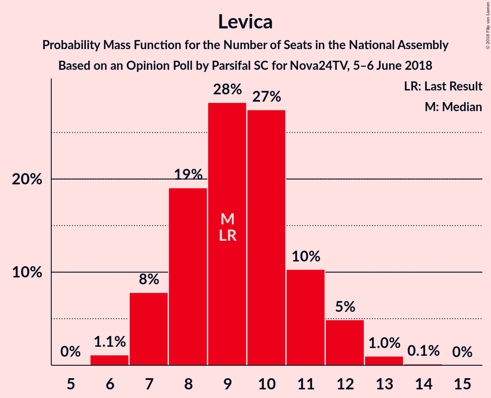
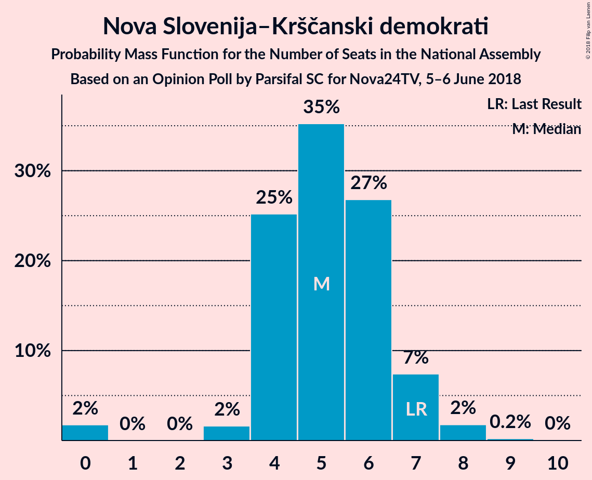
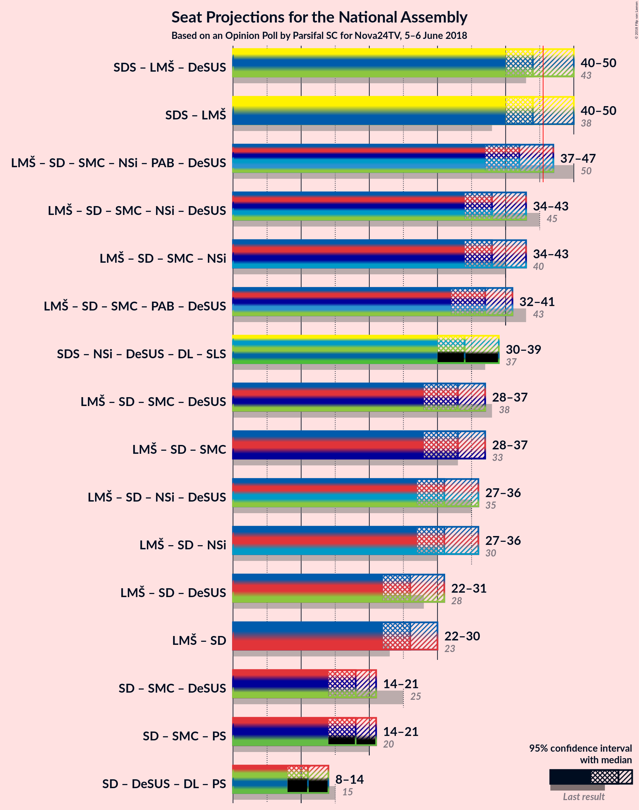

# Opinion Poll by Parsifal SC for Nova24TV, 5–6 June 2018

<a href="#voting-intentions">Voting Intentions</a> | <a href="#seats">Seats</a> | <a href="#coalitions">Coalitions</a> | <a href="#technical-information">Technical Information</a>

## Voting Intentions

### Confidence Intervals

| Party | Last Result | Poll Result | 80% Confidence Interval | 90% Confidence Interval | 95% Confidence Interval | 99% Confidence Interval |
|:-----:|:-----------:|:-----------:|:-----------------------:|:-----------------------:|:-----------------------:|:-----------------------:|
| Slovenska demokratska stranka | 24.9% | 31.2% | 28.6–33.9% |27.9–34.7% |27.3–35.3% |26.1–36.7% |
| Lista Marjana Šarca | 12.6% | 16.6% | 14.6–18.9% |14.1–19.5% |13.6–20.1% |12.7–21.2% |
| Socialni demokrati | 9.9% | 12.0% | 10.3–14.1% |9.9–14.6% |9.5–15.2% |8.7–16.2% |
| Levica | 9.3% | 10.3% | 8.7–12.2% |8.3–12.7% |7.9–13.2% |7.2–14.2% |
| Stranka modernega centra | 9.7% | 7.5% | 6.2–9.2% |5.8–9.7% |5.5–10.1% |4.9–11.0% |
| Nova Slovenija–Krščanski demokrati | 7.2% | 5.9% | 4.8–7.5% |4.5–7.9% |4.2–8.3% |3.7–9.1% |
| Stranka Alenke Bratušek | 5.1% | 4.7% | 3.7–6.2% |3.4–6.6% |3.2–7.0% |2.8–7.7% |
| Slovenska nacionalna stranka | 4.2% | 4.5% | 3.6–6.0% |3.3–6.4% |3.0–6.7% |2.6–7.5% |
| Demokratična stranka upokojencev Slovenije | 4.9% | 1.6% | 1.1–2.5% |0.9–2.8% |0.8–3.1% |0.6–3.6% |

*Note:* The poll result column reflects the actual value used in the calculations. Published results may vary slightly, and in addition be rounded to fewer digits.

## Seats

### Confidence Intervals

| Party | Last Result | Median | 80% Confidence Interval | 90% Confidence Interval | 95% Confidence Interval | 99% Confidence Interval |
|:-----:|:-----------:|:------:|:-----------------------:|:-----------------------:|:-----------------------:|:-----------------------:|
| <a href="#slovenska-demokratska-stranka">Slovenska demokratska stranka</a> | 25 | 28 | 26–32 |26–33 |26–33 |24–35 |
| <a href="#lista-marjana-šarca">Lista Marjana Šarca</a> | 13 | 15 | 13–18 |12–18 |12–18 |11–20 |
| <a href="#socialni-demokrati">Socialni demokrati</a> | 10 | 11 | 9–13 |9–14 |9–14 |8–15 |
| <a href="#levica">Levica</a> | 9 | 10 | 8–11 |7–12 |7–12 |7–13 |
| <a href="#stranka-modernega-centra">Stranka modernega centra</a> | 10 | 7 | 6–8 |5–9 |5–9 |4–10 |
| <a href="#nova-slovenija–krščanski-demokrati">Nova Slovenija–Krščanski demokrati</a> | 7 | 5 | 4–7 |4–7 |4–7 |0–8 |
| <a href="#stranka-alenke-bratušek">Stranka Alenke Bratušek</a> | 5 | 4 | 0–5 |0–5 |0–6 |0–7 |
| <a href="#slovenska-nacionalna-stranka">Slovenska nacionalna stranka</a> | 4 | 4 | 0–5 |0–5 |0–6 |0–7 |
| <a href="#demokratična-stranka-upokojencev-slovenije">Demokratična stranka upokojencev Slovenije</a> | 5 | 0 | 0 |0 |0 |0 |

### Slovenska demokratska stranka

*For a full overview of the results for this party, see the [Slovenska demokratska stranka](party-slovenskademokratskastranka.html) page.*

| Number of Seats | Probability | Accumulated | Special Marks |
|:---------------:|:-----------:|:-----------:|:-------------:|
| 22 | 0.1% | 100% |  |
| 23 | 0.2% | 99.9% |  |
| 24 | 0.4% | 99.7% |  |
| 25 | 2% | 99.3% | Last Result |
| 26 | 18% | 98% |  |
| 27 | 17% | 79% |  |
| 28 | 22% | 62% | Median |
| 29 | 11% | 41% |  |
| 30 | 6% | 30% |  |
| 31 | 5% | 25% |  |
| 32 | 11% | 19% |  |
| 33 | 7% | 8% |  |
| 34 | 0.6% | 1.3% |  |
| 35 | 0.6% | 0.8% |  |
| 36 | 0.1% | 0.1% |  |
| 37 | 0% | 0% |  |

### Lista Marjana Šarca

*For a full overview of the results for this party, see the [Lista Marjana Šarca](party-listamarjanašarca.html) page.*

| Number of Seats | Probability | Accumulated | Special Marks |
|:---------------:|:-----------:|:-----------:|:-------------:|
| 11 | 0.8% | 100% |  |
| 12 | 5% | 99.1% |  |
| 13 | 5% | 94% | Last Result |
| 14 | 21% | 89% |  |
| 15 | 20% | 68% | Median |
| 16 | 21% | 48% |  |
| 17 | 10% | 28% |  |
| 18 | 17% | 18% |  |
| 19 | 0.6% | 1.1% |  |
| 20 | 0.3% | 0.5% |  |
| 21 | 0.3% | 0.3% |  |
| 22 | 0% | 0% |  |

### Socialni demokrati

*For a full overview of the results for this party, see the [Socialni demokrati](party-socialnidemokrati.html) page.*

| Number of Seats | Probability | Accumulated | Special Marks |
|:---------------:|:-----------:|:-----------:|:-------------:|
| 7 | 0.1% | 100% |  |
| 8 | 2% | 99.9% |  |
| 9 | 15% | 98% |  |
| 10 | 32% | 82% | Last Result |
| 11 | 26% | 51% | Median |
| 12 | 14% | 25% |  |
| 13 | 4% | 10% |  |
| 14 | 6% | 6% |  |
| 15 | 0.5% | 0.6% |  |
| 16 | 0.1% | 0.1% |  |
| 17 | 0% | 0% |  |

### Levica

*For a full overview of the results for this party, see the [Levica](party-levica.html) page.*

| Number of Seats | Probability | Accumulated | Special Marks |
|:---------------:|:-----------:|:-----------:|:-------------:|
| 6 | 0.5% | 100% |  |
| 7 | 6% | 99.5% |  |
| 8 | 18% | 94% |  |
| 9 | 18% | 75% | Last Result |
| 10 | 47% | 58% | Median |
| 11 | 5% | 11% |  |
| 12 | 5% | 6% |  |
| 13 | 1.3% | 1.3% |  |
| 14 | 0.1% | 0.1% |  |
| 15 | 0% | 0% |  |

### Stranka modernega centra

*For a full overview of the results for this party, see the [Stranka modernega centra](party-strankamodernegacentra.html) page.*

| Number of Seats | Probability | Accumulated | Special Marks |
|:---------------:|:-----------:|:-----------:|:-------------:|
| 4 | 0.8% | 100% |  |
| 5 | 9% | 99.2% |  |
| 6 | 39% | 90% |  |
| 7 | 31% | 51% | Median |
| 8 | 14% | 20% |  |
| 9 | 5% | 6% |  |
| 10 | 0.6% | 0.7% | Last Result |
| 11 | 0.1% | 0.1% |  |
| 12 | 0% | 0% |  |

### Nova Slovenija–Krščanski demokrati

*For a full overview of the results for this party, see the [Nova Slovenija–Krščanski demokrati](party-novaslovenija–krščanskidemokrati.html) page.*

| Number of Seats | Probability | Accumulated | Special Marks |
|:---------------:|:-----------:|:-----------:|:-------------:|
| 0 | 1.5% | 100% |  |
| 1 | 0% | 98.5% |  |
| 2 | 0% | 98.5% |  |
| 3 | 0.5% | 98.5% |  |
| 4 | 22% | 98% |  |
| 5 | 42% | 76% | Median |
| 6 | 22% | 34% |  |
| 7 | 11% | 11% | Last Result |
| 8 | 0.7% | 0.9% |  |
| 9 | 0.2% | 0.2% |  |
| 10 | 0% | 0% |  |

### Stranka Alenke Bratušek

*For a full overview of the results for this party, see the [Stranka Alenke Bratušek](party-strankaalenkebratušek.html) page.*

| Number of Seats | Probability | Accumulated | Special Marks |
|:---------------:|:-----------:|:-----------:|:-------------:|
| 0 | 19% | 100% |  |
| 1 | 0% | 81% |  |
| 2 | 0% | 81% |  |
| 3 | 6% | 81% |  |
| 4 | 37% | 74% | Median |
| 5 | 33% | 37% | Last Result |
| 6 | 3% | 4% |  |
| 7 | 1.3% | 1.3% |  |
| 8 | 0% | 0.1% |  |
| 9 | 0% | 0% |  |

### Slovenska nacionalna stranka

*For a full overview of the results for this party, see the [Slovenska nacionalna stranka](party-slovenskanacionalnastranka.html) page.*

| Number of Seats | Probability | Accumulated | Special Marks |
|:---------------:|:-----------:|:-----------:|:-------------:|
| 0 | 18% | 100% |  |
| 1 | 0% | 82% |  |
| 2 | 0% | 82% |  |
| 3 | 6% | 82% |  |
| 4 | 50% | 76% | Last Result, Median |
| 5 | 21% | 26% |  |
| 6 | 4% | 5% |  |
| 7 | 0.5% | 0.6% |  |
| 8 | 0% | 0% |  |

### Demokratična stranka upokojencev Slovenije

*For a full overview of the results for this party, see the [Demokratična stranka upokojencev Slovenije](party-demokratičnastrankaupokojencevslovenije.html) page.*

| Number of Seats | Probability | Accumulated | Special Marks |
|:---------------:|:-----------:|:-----------:|:-------------:|
| 0 | 99.9% | 100% | Median |
| 1 | 0% | 0.1% |  |
| 2 | 0% | 0.1% |  |
| 3 | 0.1% | 0.1% |  |
| 4 | 0% | 0% |  |
| 5 | 0% | 0% | Last Result |

## Coalitions

### Confidence Intervals

| Coalition | Last Result | Median | Majority? | 80% Confidence Interval | 90% Confidence Interval | 95% Confidence Interval | 99% Confidence Interval |
|:---------:|:-----------:|:------:|:---------:|:-----------------------:|:-----------------------:|:-----------------------:|:-----------------------:|
| Slovenska demokratska stranka – Lista Marjana Šarca – Demokratična stranka upokojencev Slovenije | 43 | 43 | 29% | 41–47 | 41–50 | 40–50 | 38–50 |
| Slovenska demokratska stranka – Lista Marjana Šarca | 38 | 43 | 29% | 41–47 | 41–50 | 40–50 | 38–50 |
| Lista Marjana Šarca – Socialni demokrati – Stranka modernega centra – Nova Slovenija–Krščanski demokrati – Stranka Alenke Bratušek – Demokratična stranka upokojencev Slovenije | 50 | 42 | 3% | 38–45 | 38–45 | 38–46 | 36–48 |
| Lista Marjana Šarca – Socialni demokrati – Stranka modernega centra – Nova Slovenija–Krščanski demokrati – Demokratična stranka upokojencev Slovenije | 45 | 38 | 0.1% | 35–41 | 34–41 | 34–42 | 32–45 |
| Lista Marjana Šarca – Socialni demokrati – Stranka modernega centra – Nova Slovenija–Krščanski demokrati | 40 | 38 | 0.1% | 35–41 | 34–41 | 34–42 | 32–45 |
| Lista Marjana Šarca – Socialni demokrati – Stranka modernega centra – Stranka Alenke Bratušek – Demokratična stranka upokojencev Slovenije | 43 | 37 | 0% | 33–39 | 33–40 | 32–41 | 31–42 |
| Lista Marjana Šarca – Socialni demokrati – Stranka modernega centra – Demokratična stranka upokojencev Slovenije | 38 | 33 | 0% | 30–35 | 29–36 | 29–38 | 28–39 |
| Lista Marjana Šarca – Socialni demokrati – Stranka modernega centra | 33 | 33 | 0% | 30–35 | 29–36 | 29–38 | 28–39 |
| Lista Marjana Šarca – Socialni demokrati – Nova Slovenija–Krščanski demokrati – Demokratična stranka upokojencev Slovenije | 35 | 31 | 0% | 28–34 | 27–35 | 27–36 | 25–37 |
| Lista Marjana Šarca – Socialni demokrati – Nova Slovenija–Krščanski demokrati | 30 | 31 | 0% | 28–34 | 27–35 | 27–36 | 25–37 |
| Lista Marjana Šarca – Socialni demokrati – Demokratična stranka upokojencev Slovenije | 28 | 26 | 0% | 23–28 | 23–30 | 23–30 | 21–32 |
| Lista Marjana Šarca – Socialni demokrati | 23 | 26 | 0% | 23–28 | 23–30 | 23–30 | 21–32 |
| Socialni demokrati – Stranka modernega centra – Demokratična stranka upokojencev Slovenije | 25 | 17 | 0% | 16–20 | 15–20 | 15–21 | 14–23 |

### Slovenska demokratska stranka – Lista Marjana Šarca – Demokratična stranka upokojencev Slovenije

| Number of Seats | Probability | Accumulated | Special Marks |
|:---------------:|:-----------:|:-----------:|:-------------:|
| 36 | 0.1% | 100% |  |
| 37 | 0.1% | 99.9% |  |
| 38 | 0.8% | 99.8% |  |
| 39 | 0.8% | 99.0% |  |
| 40 | 3% | 98% |  |
| 41 | 7% | 95% |  |
| 42 | 8% | 88% |  |
| 43 | 31% | 80% | Last Result, Median |
| 44 | 15% | 49% |  |
| 45 | 5% | 34% |  |
| 46 | 15% | 29% | Majority |
| 47 | 6% | 14% |  |
| 48 | 1.0% | 8% |  |
| 49 | 0.8% | 7% |  |
| 50 | 6% | 6% |  |
| 51 | 0.2% | 0.5% |  |
| 52 | 0% | 0.2% |  |
| 53 | 0.1% | 0.2% |  |
| 54 | 0% | 0.1% |  |
| 55 | 0% | 0.1% |  |
| 56 | 0.1% | 0.1% |  |
| 57 | 0% | 0% |  |

### Slovenska demokratska stranka – Lista Marjana Šarca

| Number of Seats | Probability | Accumulated | Special Marks |
|:---------------:|:-----------:|:-----------:|:-------------:|
| 36 | 0.1% | 100% |  |
| 37 | 0.1% | 99.9% |  |
| 38 | 0.8% | 99.8% | Last Result |
| 39 | 0.8% | 99.0% |  |
| 40 | 3% | 98% |  |
| 41 | 7% | 95% |  |
| 42 | 8% | 88% |  |
| 43 | 31% | 80% | Median |
| 44 | 15% | 49% |  |
| 45 | 5% | 34% |  |
| 46 | 15% | 29% | Majority |
| 47 | 6% | 14% |  |
| 48 | 1.0% | 8% |  |
| 49 | 0.8% | 7% |  |
| 50 | 6% | 6% |  |
| 51 | 0.2% | 0.5% |  |
| 52 | 0% | 0.2% |  |
| 53 | 0.1% | 0.2% |  |
| 54 | 0% | 0.1% |  |
| 55 | 0% | 0.1% |  |
| 56 | 0.1% | 0.1% |  |
| 57 | 0% | 0% |  |

### Lista Marjana Šarca – Socialni demokrati – Stranka modernega centra – Nova Slovenija–Krščanski demokrati – Stranka Alenke Bratušek – Demokratična stranka upokojencev Slovenije

| Number of Seats | Probability | Accumulated | Special Marks |
|:---------------:|:-----------:|:-----------:|:-------------:|
| 33 | 0.1% | 100% |  |
| 34 | 0% | 99.9% |  |
| 35 | 0.2% | 99.9% |  |
| 36 | 2% | 99.7% |  |
| 37 | 0.5% | 98% |  |
| 38 | 10% | 98% |  |
| 39 | 14% | 87% |  |
| 40 | 6% | 73% |  |
| 41 | 4% | 68% |  |
| 42 | 29% | 64% | Median |
| 43 | 16% | 36% |  |
| 44 | 8% | 20% |  |
| 45 | 8% | 11% |  |
| 46 | 1.5% | 3% | Majority |
| 47 | 0.5% | 2% |  |
| 48 | 1.0% | 1.2% |  |
| 49 | 0.1% | 0.2% |  |
| 50 | 0% | 0.1% | Last Result |
| 51 | 0% | 0% |  |

### Lista Marjana Šarca – Socialni demokrati – Stranka modernega centra – Nova Slovenija–Krščanski demokrati – Demokratična stranka upokojencev Slovenije

| Number of Seats | Probability | Accumulated | Special Marks |
|:---------------:|:-----------:|:-----------:|:-------------:|
| 31 | 0.4% | 100% |  |
| 32 | 0.2% | 99.5% |  |
| 33 | 1.5% | 99.4% |  |
| 34 | 7% | 98% |  |
| 35 | 6% | 91% |  |
| 36 | 3% | 85% |  |
| 37 | 24% | 82% |  |
| 38 | 9% | 57% | Median |
| 39 | 28% | 49% |  |
| 40 | 9% | 21% |  |
| 41 | 8% | 12% |  |
| 42 | 2% | 4% |  |
| 43 | 0.4% | 2% |  |
| 44 | 1.0% | 2% |  |
| 45 | 0.5% | 0.7% | Last Result |
| 46 | 0.1% | 0.1% | Majority |
| 47 | 0% | 0% |  |

### Lista Marjana Šarca – Socialni demokrati – Stranka modernega centra – Nova Slovenija–Krščanski demokrati

| Number of Seats | Probability | Accumulated | Special Marks |
|:---------------:|:-----------:|:-----------:|:-------------:|
| 31 | 0.4% | 100% |  |
| 32 | 0.2% | 99.5% |  |
| 33 | 1.5% | 99.4% |  |
| 34 | 7% | 98% |  |
| 35 | 6% | 91% |  |
| 36 | 3% | 85% |  |
| 37 | 24% | 81% |  |
| 38 | 9% | 57% | Median |
| 39 | 28% | 49% |  |
| 40 | 9% | 21% | Last Result |
| 41 | 8% | 12% |  |
| 42 | 2% | 4% |  |
| 43 | 0.4% | 2% |  |
| 44 | 1.0% | 2% |  |
| 45 | 0.5% | 0.7% |  |
| 46 | 0.1% | 0.1% | Majority |
| 47 | 0% | 0% |  |

### Lista Marjana Šarca – Socialni demokrati – Stranka modernega centra – Stranka Alenke Bratušek – Demokratična stranka upokojencev Slovenije

| Number of Seats | Probability | Accumulated | Special Marks |
|:---------------:|:-----------:|:-----------:|:-------------:|
| 28 | 0.1% | 100% |  |
| 29 | 0.1% | 99.9% |  |
| 30 | 0.2% | 99.9% |  |
| 31 | 0.3% | 99.7% |  |
| 32 | 3% | 99.4% |  |
| 33 | 10% | 97% |  |
| 34 | 11% | 87% |  |
| 35 | 9% | 76% |  |
| 36 | 7% | 67% |  |
| 37 | 25% | 60% | Median |
| 38 | 21% | 35% |  |
| 39 | 7% | 13% |  |
| 40 | 3% | 6% |  |
| 41 | 1.4% | 3% |  |
| 42 | 2% | 2% |  |
| 43 | 0.2% | 0.3% | Last Result |
| 44 | 0.1% | 0.2% |  |
| 45 | 0.1% | 0.1% |  |
| 46 | 0% | 0% | Majority |

### Lista Marjana Šarca – Socialni demokrati – Stranka modernega centra – Demokratična stranka upokojencev Slovenije

| Number of Seats | Probability | Accumulated | Special Marks |
|:---------------:|:-----------:|:-----------:|:-------------:|
| 26 | 0.1% | 100% |  |
| 27 | 0.2% | 99.9% |  |
| 28 | 2% | 99.7% |  |
| 29 | 4% | 98% |  |
| 30 | 8% | 94% |  |
| 31 | 5% | 86% |  |
| 32 | 24% | 82% |  |
| 33 | 19% | 58% | Median |
| 34 | 22% | 39% |  |
| 35 | 10% | 17% |  |
| 36 | 3% | 7% |  |
| 37 | 0.5% | 3% |  |
| 38 | 1.4% | 3% | Last Result |
| 39 | 1.0% | 1.3% |  |
| 40 | 0.2% | 0.3% |  |
| 41 | 0.1% | 0.1% |  |
| 42 | 0% | 0% |  |

### Lista Marjana Šarca – Socialni demokrati – Stranka modernega centra

| Number of Seats | Probability | Accumulated | Special Marks |
|:---------------:|:-----------:|:-----------:|:-------------:|
| 26 | 0.1% | 100% |  |
| 27 | 0.2% | 99.9% |  |
| 28 | 2% | 99.7% |  |
| 29 | 4% | 98% |  |
| 30 | 8% | 94% |  |
| 31 | 4% | 86% |  |
| 32 | 24% | 82% |  |
| 33 | 19% | 58% | Last Result, Median |
| 34 | 22% | 39% |  |
| 35 | 10% | 17% |  |
| 36 | 3% | 6% |  |
| 37 | 0.5% | 3% |  |
| 38 | 1.3% | 3% |  |
| 39 | 1.0% | 1.3% |  |
| 40 | 0.2% | 0.3% |  |
| 41 | 0.1% | 0.1% |  |
| 42 | 0% | 0% |  |

### Lista Marjana Šarca – Socialni demokrati – Nova Slovenija–Krščanski demokrati – Demokratična stranka upokojencev Slovenije

| Number of Seats | Probability | Accumulated | Special Marks |
|:---------------:|:-----------:|:-----------:|:-------------:|
| 23 | 0.3% | 100% |  |
| 24 | 0.1% | 99.7% |  |
| 25 | 0.1% | 99.6% |  |
| 26 | 0.7% | 99.5% |  |
| 27 | 8% | 98.8% |  |
| 28 | 2% | 91% |  |
| 29 | 9% | 89% |  |
| 30 | 13% | 80% |  |
| 31 | 20% | 67% | Median |
| 32 | 13% | 47% |  |
| 33 | 19% | 34% |  |
| 34 | 9% | 15% |  |
| 35 | 1.4% | 6% | Last Result |
| 36 | 4% | 5% |  |
| 37 | 0.3% | 0.6% |  |
| 38 | 0.2% | 0.3% |  |
| 39 | 0.1% | 0.1% |  |
| 40 | 0% | 0% |  |

### Lista Marjana Šarca – Socialni demokrati – Nova Slovenija–Krščanski demokrati

| Number of Seats | Probability | Accumulated | Special Marks |
|:---------------:|:-----------:|:-----------:|:-------------:|
| 23 | 0.3% | 100% |  |
| 24 | 0.1% | 99.7% |  |
| 25 | 0.1% | 99.6% |  |
| 26 | 0.7% | 99.5% |  |
| 27 | 8% | 98.8% |  |
| 28 | 2% | 91% |  |
| 29 | 9% | 89% |  |
| 30 | 13% | 80% | Last Result |
| 31 | 20% | 67% | Median |
| 32 | 13% | 47% |  |
| 33 | 19% | 34% |  |
| 34 | 9% | 15% |  |
| 35 | 1.4% | 6% |  |
| 36 | 4% | 5% |  |
| 37 | 0.3% | 0.6% |  |
| 38 | 0.2% | 0.3% |  |
| 39 | 0.1% | 0.1% |  |
| 40 | 0% | 0% |  |

### Lista Marjana Šarca – Socialni demokrati – Demokratična stranka upokojencev Slovenije

| Number of Seats | Probability | Accumulated | Special Marks |
|:---------------:|:-----------:|:-----------:|:-------------:|
| 20 | 0.1% | 100% |  |
| 21 | 0.7% | 99.9% |  |
| 22 | 2% | 99.1% |  |
| 23 | 13% | 98% |  |
| 24 | 3% | 84% |  |
| 25 | 14% | 81% |  |
| 26 | 27% | 67% | Median |
| 27 | 8% | 41% |  |
| 28 | 24% | 33% | Last Result |
| 29 | 2% | 8% |  |
| 30 | 5% | 6% |  |
| 31 | 0.7% | 1.2% |  |
| 32 | 0.3% | 0.5% |  |
| 33 | 0.2% | 0.2% |  |
| 34 | 0% | 0% |  |

### Lista Marjana Šarca – Socialni demokrati

| Number of Seats | Probability | Accumulated | Special Marks |
|:---------------:|:-----------:|:-----------:|:-------------:|
| 20 | 0.1% | 100% |  |
| 21 | 0.7% | 99.9% |  |
| 22 | 2% | 99.1% |  |
| 23 | 13% | 98% | Last Result |
| 24 | 3% | 84% |  |
| 25 | 14% | 81% |  |
| 26 | 27% | 67% | Median |
| 27 | 8% | 41% |  |
| 28 | 24% | 33% |  |
| 29 | 2% | 8% |  |
| 30 | 5% | 6% |  |
| 31 | 0.7% | 1.2% |  |
| 32 | 0.3% | 0.5% |  |
| 33 | 0.2% | 0.2% |  |
| 34 | 0% | 0% |  |

### Socialni demokrati – Stranka modernega centra – Demokratična stranka upokojencev Slovenije

| Number of Seats | Probability | Accumulated | Special Marks |
|:---------------:|:-----------:|:-----------:|:-------------:|
| 12 | 0.1% | 100% |  |
| 13 | 0.4% | 99.9% |  |
| 14 | 1.3% | 99.6% |  |
| 15 | 7% | 98% |  |
| 16 | 19% | 91% |  |
| 17 | 34% | 72% |  |
| 18 | 11% | 38% | Median |
| 19 | 16% | 27% |  |
| 20 | 8% | 10% |  |
| 21 | 1.1% | 3% |  |
| 22 | 0.4% | 2% |  |
| 23 | 1.0% | 1.1% |  |
| 24 | 0% | 0.1% |  |
| 25 | 0% | 0% | Last Result |

## Technical Information

### Opinion Poll

+ **Polling firm:** Parsifal SC
+ **Commissioner(s):** Nova24TV
+ **Fieldwork period:** 5–6 June 2018

### Calculations

+ **Sample size:** 507
+ **Simulations done:** 131,072
+ **Error estimate:** 2.65%

