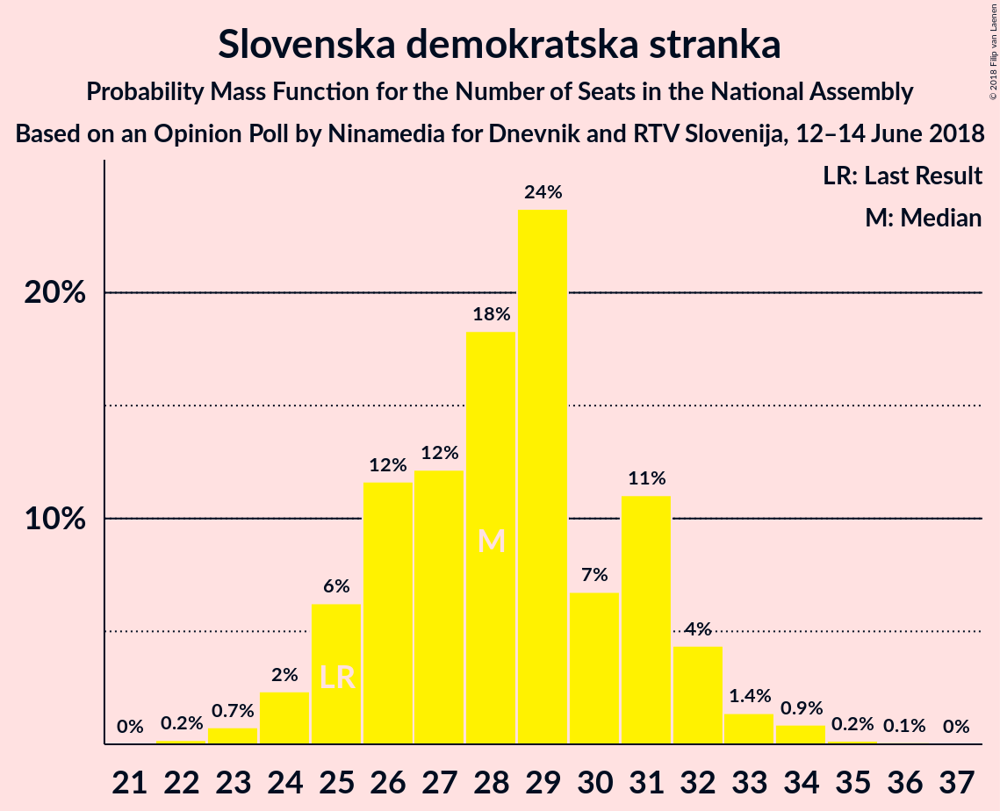
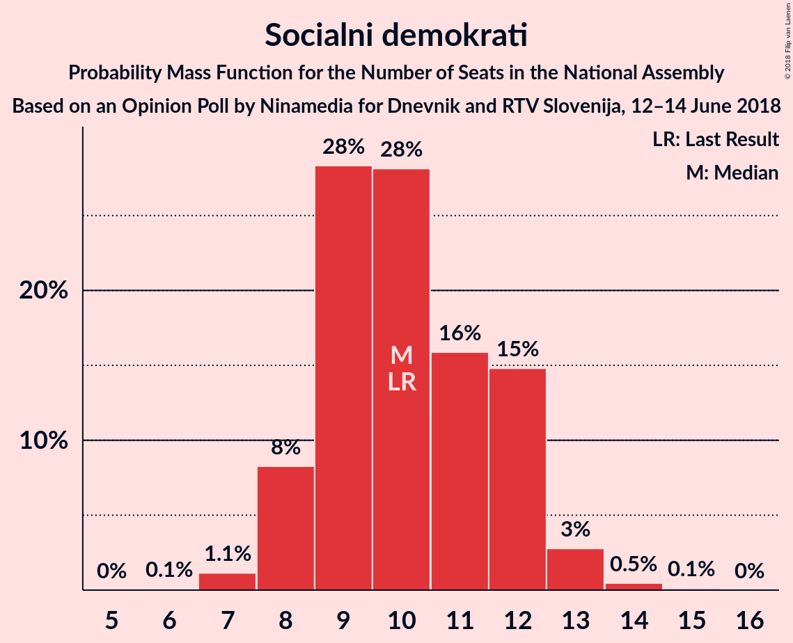
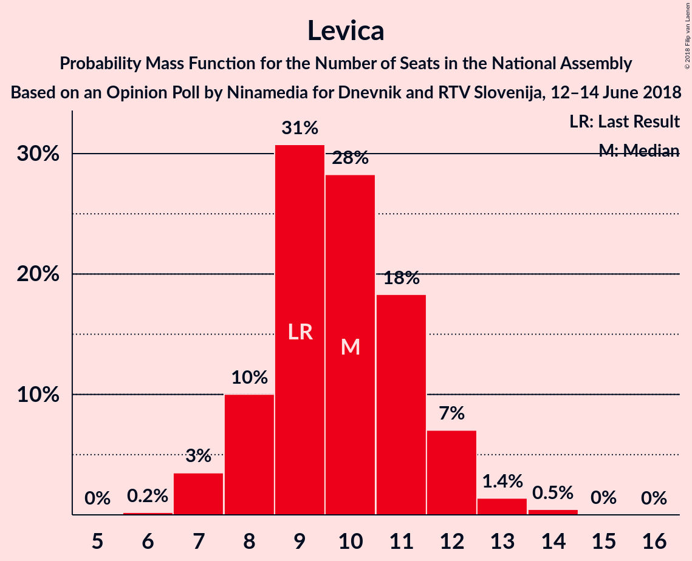
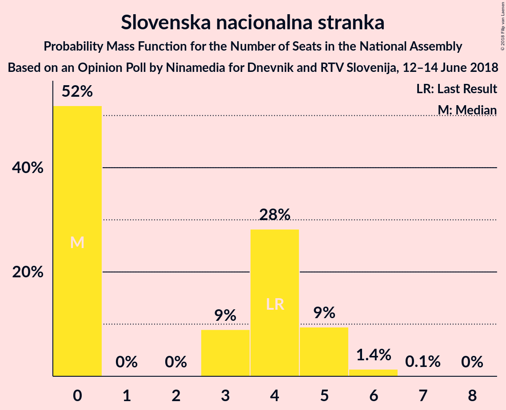

# Opinion Poll by Ninamedia for Dnevnik and RTV Slovenija, 12–14 June 2018

<a href="#voting-intentions">Voting Intentions</a> | <a href="#seats">Seats</a> | <a href="#coalitions">Coalitions</a> | <a href="#technical-information">Technical Information</a>

## Voting Intentions

### Confidence Intervals

| Party | Last Result | Poll Result | 80% Confidence Interval | 90% Confidence Interval | 95% Confidence Interval | 99% Confidence Interval |
|:-----:|:-----------:|:-----------:|:-----------------------:|:-----------------------:|:-----------------------:|:-----------------------:|
| Slovenska demokratska stranka | 24.9% | 29.3% | 27.0–31.8% |26.4–32.5% |25.8–33.1% |24.8–34.3% |
| Lista Marjana Šarca | 12.6% | 13.5% | 11.9–15.4% |11.4–16.0% |11.0–16.5% |10.2–17.5% |
| Socialni demokrati | 9.9% | 10.7% | 9.2–12.5% |8.8–13.0% |8.4–13.4% |7.8–14.3% |
| Stranka modernega centra | 9.7% | 10.7% | 9.2–12.5% |8.8–13.0% |8.4–13.4% |7.8–14.3% |
| Levica | 9.3% | 10.3% | 8.9–12.1% |8.5–12.6% |8.1–13.0% |7.5–13.9% |
| Stranka Alenke Bratušek | 5.1% | 4.5% | 3.6–5.8% |3.3–6.1% |3.1–6.5% |2.7–7.1% |
| Slovenska nacionalna stranka | 4.2% | 4.0% | 3.1–5.2% |2.9–5.6% |2.7–5.9% |2.3–6.5% |
| Nova Slovenija–Krščanski demokrati | 7.2% | 3.7% | 2.9–4.9% |2.6–5.2% |2.4–5.5% |2.1–6.1% |
| Demokratična stranka upokojencev Slovenije | 4.9% | 3.7% | 2.9–4.9% |2.6–5.2% |2.4–5.5% |2.1–6.1% |

*Note:* The poll result column reflects the actual value used in the calculations. Published results may vary slightly, and in addition be rounded to fewer digits.

## Seats

### Confidence Intervals

| Party | Last Result | Median | 80% Confidence Interval | 90% Confidence Interval | 95% Confidence Interval | 99% Confidence Interval |
|:-----:|:-----------:|:------:|:-----------------------:|:-----------------------:|:-----------------------:|:-----------------------:|
| <a href="#slovenska-demokratska-stranka">Slovenska demokratska stranka</a> | 25 | 28 | 26–31 |25–32 |24–33 |23–34 |
| <a href="#lista-marjana-šarca">Lista Marjana Šarca</a> | 13 | 13 | 11–15 |10–15 |10–16 |9–17 |
| <a href="#socialni-demokrati">Socialni demokrati</a> | 10 | 10 | 9–12 |8–12 |8–13 |7–14 |
| <a href="#stranka-modernega-centra">Stranka modernega centra</a> | 10 | 10 | 8–12 |8–12 |8–13 |7–14 |
| <a href="#levica">Levica</a> | 9 | 10 | 8–11 |8–12 |7–12 |7–14 |
| <a href="#stranka-alenke-bratušek">Stranka Alenke Bratušek</a> | 5 | 4 | 0–5 |0–5 |0–6 |0–6 |
| <a href="#slovenska-nacionalna-stranka">Slovenska nacionalna stranka</a> | 4 | 0 | 0–5 |0–5 |0–5 |0–6 |
| <a href="#nova-slovenija–krščanski-demokrati">Nova Slovenija–Krščanski demokrati</a> | 7 | 0 | 0–4 |0–4 |0–4 |0–5 |
| <a href="#demokratična-stranka-upokojencev-slovenije">Demokratična stranka upokojencev Slovenije</a> | 5 | 0 | 0–4 |0–5 |0–5 |0–5 |

### Slovenska demokratska stranka

*For a full overview of the results for this party, see the [Slovenska demokratska stranka](party-slovenskademokratskastranka.html) page.*

| Number of Seats | Probability | Accumulated | Special Marks |
|:---------------:|:-----------:|:-----------:|:-------------:|
| 22 | 0.2% | 100% |  |
| 23 | 0.7% | 99.8% |  |
| 24 | 2% | 99.0% |  |
| 25 | 6% | 97% | Last Result |
| 26 | 12% | 90% |  |
| 27 | 12% | 79% |  |
| 28 | 18% | 67% | Median |
| 29 | 24% | 48% |  |
| 30 | 7% | 25% |  |
| 31 | 11% | 18% |  |
| 32 | 4% | 7% |  |
| 33 | 1.4% | 3% |  |
| 34 | 0.9% | 1.1% |  |
| 35 | 0.2% | 0.3% |  |
| 36 | 0.1% | 0.1% |  |
| 37 | 0% | 0% |  |

### Lista Marjana Šarca

*For a full overview of the results for this party, see the [Lista Marjana Šarca](party-listamarjanašarca.html) page.*

| Number of Seats | Probability | Accumulated | Special Marks |
|:---------------:|:-----------:|:-----------:|:-------------:|
| 9 | 0.7% | 100% |  |
| 10 | 4% | 99.3% |  |
| 11 | 13% | 95% |  |
| 12 | 22% | 82% |  |
| 13 | 27% | 60% | Last Result, Median |
| 14 | 16% | 33% |  |
| 15 | 13% | 17% |  |
| 16 | 3% | 4% |  |
| 17 | 0.7% | 0.9% |  |
| 18 | 0.1% | 0.2% |  |
| 19 | 0% | 0% |  |

### Socialni demokrati

*For a full overview of the results for this party, see the [Socialni demokrati](party-socialnidemokrati.html) page.*

| Number of Seats | Probability | Accumulated | Special Marks |
|:---------------:|:-----------:|:-----------:|:-------------:|
| 6 | 0.1% | 100% |  |
| 7 | 1.1% | 99.9% |  |
| 8 | 8% | 98.8% |  |
| 9 | 28% | 90% |  |
| 10 | 28% | 62% | Last Result, Median |
| 11 | 16% | 34% |  |
| 12 | 15% | 18% |  |
| 13 | 3% | 3% |  |
| 14 | 0.5% | 0.6% |  |
| 15 | 0.1% | 0.1% |  |
| 16 | 0% | 0% |  |

### Stranka modernega centra

*For a full overview of the results for this party, see the [Stranka modernega centra](party-strankamodernegacentra.html) page.*

| Number of Seats | Probability | Accumulated | Special Marks |
|:---------------:|:-----------:|:-----------:|:-------------:|
| 6 | 0.1% | 100% |  |
| 7 | 1.0% | 99.9% |  |
| 8 | 10% | 99.0% |  |
| 9 | 25% | 89% |  |
| 10 | 30% | 64% | Last Result, Median |
| 11 | 21% | 34% |  |
| 12 | 10% | 13% |  |
| 13 | 3% | 3% |  |
| 14 | 0.7% | 0.8% |  |
| 15 | 0.1% | 0.1% |  |
| 16 | 0% | 0% |  |

### Levica

*For a full overview of the results for this party, see the [Levica](party-levica.html) page.*

| Number of Seats | Probability | Accumulated | Special Marks |
|:---------------:|:-----------:|:-----------:|:-------------:|
| 6 | 0.2% | 100% |  |
| 7 | 3% | 99.8% |  |
| 8 | 10% | 96% |  |
| 9 | 31% | 86% | Last Result |
| 10 | 28% | 56% | Median |
| 11 | 18% | 27% |  |
| 12 | 7% | 9% |  |
| 13 | 1.4% | 2% |  |
| 14 | 0.5% | 0.5% |  |
| 15 | 0% | 0.1% |  |
| 16 | 0% | 0% |  |

### Stranka Alenke Bratušek

*For a full overview of the results for this party, see the [Stranka Alenke Bratušek](party-strankaalenkebratušek.html) page.*

| Number of Seats | Probability | Accumulated | Special Marks |
|:---------------:|:-----------:|:-----------:|:-------------:|
| 0 | 25% | 100% |  |
| 1 | 0% | 75% |  |
| 2 | 0% | 75% |  |
| 3 | 4% | 75% |  |
| 4 | 41% | 71% | Median |
| 5 | 26% | 30% | Last Result |
| 6 | 4% | 4% |  |
| 7 | 0.4% | 0.4% |  |
| 8 | 0% | 0% |  |

### Slovenska nacionalna stranka

*For a full overview of the results for this party, see the [Slovenska nacionalna stranka](party-slovenskanacionalnastranka.html) page.*

| Number of Seats | Probability | Accumulated | Special Marks |
|:---------------:|:-----------:|:-----------:|:-------------:|
| 0 | 52% | 100% | Median |
| 1 | 0% | 48% |  |
| 2 | 0% | 48% |  |
| 3 | 9% | 48% |  |
| 4 | 28% | 39% | Last Result |
| 5 | 9% | 11% |  |
| 6 | 1.4% | 1.5% |  |
| 7 | 0.1% | 0.1% |  |
| 8 | 0% | 0% |  |

### Nova Slovenija–Krščanski demokrati

*For a full overview of the results for this party, see the [Nova Slovenija–Krščanski demokrati](party-novaslovenija–krščanskidemokrati.html) page.*

| Number of Seats | Probability | Accumulated | Special Marks |
|:---------------:|:-----------:|:-----------:|:-------------:|
| 0 | 77% | 100% | Median |
| 1 | 0% | 23% |  |
| 2 | 0% | 23% |  |
| 3 | 0.4% | 23% |  |
| 4 | 20% | 22% |  |
| 5 | 2% | 2% |  |
| 6 | 0.2% | 0.2% |  |
| 7 | 0% | 0% | Last Result |

### Demokratična stranka upokojencev Slovenije

*For a full overview of the results for this party, see the [Demokratična stranka upokojencev Slovenije](party-demokratičnastrankaupokojencevslovenije.html) page.*

| Number of Seats | Probability | Accumulated | Special Marks |
|:---------------:|:-----------:|:-----------:|:-------------:|
| 0 | 59% | 100% | Median |
| 1 | 0% | 41% |  |
| 2 | 0% | 41% |  |
| 3 | 5% | 41% |  |
| 4 | 30% | 36% |  |
| 5 | 6% | 6% | Last Result |
| 6 | 0.3% | 0.4% |  |
| 7 | 0% | 0% |  |

## Coalitions

### Confidence Intervals

| Coalition | Last Result | Median | Majority? | 80% Confidence Interval | 90% Confidence Interval | 95% Confidence Interval | 99% Confidence Interval |
|:---------:|:-----------:|:------:|:---------:|:-----------------------:|:-----------------------:|:-----------------------:|:-----------------------:|
| Slovenska demokratska stranka – Lista Marjana Šarca – Demokratična stranka upokojencev Slovenije | 43 | 43 | 14% | 39–46 | 38–47 | 38–48 | 36–51 |
| Slovenska demokratska stranka – Lista Marjana Šarca | 38 | 41 | 5% | 38–45 | 37–45 | 36–46 | 35–48 |
| Lista Marjana Šarca – Socialni demokrati – Stranka modernega centra – Stranka Alenke Bratušek – Demokratična stranka upokojencev Slovenije – Nova Slovenija–Krščanski demokrati | 50 | 39 | 0.5% | 35–42 | 34–43 | 33–44 | 32–45 |
| Lista Marjana Šarca – Socialni demokrati – Stranka modernega centra – Stranka Alenke Bratušek – Demokratična stranka upokojencev Slovenije | 43 | 38 | 0.1% | 35–41 | 33–42 | 33–43 | 31–45 |
| Lista Marjana Šarca – Socialni demokrati – Stranka modernega centra – Demokratična stranka upokojencev Slovenije – Nova Slovenija–Krščanski demokrati | 45 | 36 | 0% | 32–39 | 31–40 | 31–41 | 29–43 |
| Lista Marjana Šarca – Socialni demokrati – Stranka modernega centra – Demokratična stranka upokojencev Slovenije | 38 | 35 | 0% | 31–38 | 31–39 | 30–40 | 28–41 |
| Lista Marjana Šarca – Socialni demokrati – Stranka modernega centra – Nova Slovenija–Krščanski demokrati | 40 | 34 | 0% | 31–37 | 30–38 | 29–39 | 28–40 |
| Lista Marjana Šarca – Socialni demokrati – Stranka modernega centra | 33 | 33 | 0% | 30–36 | 29–37 | 28–38 | 28–40 |
| Lista Marjana Šarca – Socialni demokrati – Demokratična stranka upokojencev Slovenije – Nova Slovenija–Krščanski demokrati | 35 | 26 | 0% | 22–29 | 21–30 | 21–31 | 20–32 |
| Lista Marjana Šarca – Socialni demokrati – Demokratična stranka upokojencev Slovenije | 28 | 24 | 0% | 22–27 | 21–29 | 20–30 | 19–30 |
| Lista Marjana Šarca – Socialni demokrati – Nova Slovenija–Krščanski demokrati | 30 | 24 | 0% | 21–27 | 20–28 | 20–28 | 19–30 |
| Lista Marjana Šarca – Socialni demokrati | 23 | 23 | 0% | 20–26 | 20–27 | 19–27 | 18–28 |
| Socialni demokrati – Stranka modernega centra – Demokratična stranka upokojencev Slovenije | 25 | 22 | 0% | 19–25 | 18–26 | 17–27 | 17–28 |

### Slovenska demokratska stranka – Lista Marjana Šarca – Demokratična stranka upokojencev Slovenije

| Number of Seats | Probability | Accumulated | Special Marks |
|:---------------:|:-----------:|:-----------:|:-------------:|
| 34 | 0.1% | 100% |  |
| 35 | 0.2% | 99.9% |  |
| 36 | 0.6% | 99.7% |  |
| 37 | 1.3% | 99.1% |  |
| 38 | 4% | 98% |  |
| 39 | 5% | 93% |  |
| 40 | 10% | 88% |  |
| 41 | 10% | 78% | Median |
| 42 | 8% | 68% |  |
| 43 | 13% | 61% | Last Result |
| 44 | 21% | 48% |  |
| 45 | 13% | 27% |  |
| 46 | 8% | 14% | Majority |
| 47 | 2% | 6% |  |
| 48 | 1.3% | 3% |  |
| 49 | 0.5% | 2% |  |
| 50 | 0.6% | 1.4% |  |
| 51 | 0.5% | 0.8% |  |
| 52 | 0.4% | 0.4% |  |
| 53 | 0% | 0% |  |

### Slovenska demokratska stranka – Lista Marjana Šarca

| Number of Seats | Probability | Accumulated | Special Marks |
|:---------------:|:-----------:|:-----------:|:-------------:|
| 33 | 0.1% | 100% |  |
| 34 | 0.2% | 99.9% |  |
| 35 | 0.6% | 99.7% |  |
| 36 | 2% | 99.1% |  |
| 37 | 4% | 97% |  |
| 38 | 7% | 93% | Last Result |
| 39 | 11% | 86% |  |
| 40 | 16% | 75% |  |
| 41 | 17% | 59% | Median |
| 42 | 11% | 42% |  |
| 43 | 7% | 31% |  |
| 44 | 13% | 23% |  |
| 45 | 5% | 10% |  |
| 46 | 3% | 5% | Majority |
| 47 | 1.1% | 2% |  |
| 48 | 0.9% | 1.1% |  |
| 49 | 0.2% | 0.2% |  |
| 50 | 0% | 0% |  |

### Lista Marjana Šarca – Socialni demokrati – Stranka modernega centra – Stranka Alenke Bratušek – Demokratična stranka upokojencev Slovenije – Nova Slovenija–Krščanski demokrati

| Number of Seats | Probability | Accumulated | Special Marks |
|:---------------:|:-----------:|:-----------:|:-------------:|
| 30 | 0% | 100% |  |
| 31 | 0.2% | 99.9% |  |
| 32 | 0.7% | 99.7% |  |
| 33 | 3% | 99.1% |  |
| 34 | 1.5% | 96% |  |
| 35 | 7% | 94% |  |
| 36 | 4% | 87% |  |
| 37 | 10% | 83% | Median |
| 38 | 14% | 73% |  |
| 39 | 19% | 60% |  |
| 40 | 15% | 41% |  |
| 41 | 9% | 26% |  |
| 42 | 9% | 16% |  |
| 43 | 4% | 7% |  |
| 44 | 1.4% | 3% |  |
| 45 | 1.1% | 2% |  |
| 46 | 0.3% | 0.5% | Majority |
| 47 | 0.2% | 0.2% |  |
| 48 | 0% | 0% |  |
| 49 | 0% | 0% |  |
| 50 | 0% | 0% | Last Result |

### Lista Marjana Šarca – Socialni demokrati – Stranka modernega centra – Stranka Alenke Bratušek – Demokratična stranka upokojencev Slovenije

| Number of Seats | Probability | Accumulated | Special Marks |
|:---------------:|:-----------:|:-----------:|:-------------:|
| 29 | 0.1% | 100% |  |
| 30 | 0.2% | 99.9% |  |
| 31 | 0.7% | 99.7% |  |
| 32 | 1.3% | 99.0% |  |
| 33 | 4% | 98% |  |
| 34 | 3% | 94% |  |
| 35 | 8% | 90% |  |
| 36 | 10% | 82% |  |
| 37 | 11% | 72% | Median |
| 38 | 16% | 61% |  |
| 39 | 20% | 45% |  |
| 40 | 10% | 26% |  |
| 41 | 8% | 16% |  |
| 42 | 5% | 8% |  |
| 43 | 2% | 3% | Last Result |
| 44 | 0.7% | 1.4% |  |
| 45 | 0.7% | 0.8% |  |
| 46 | 0% | 0.1% | Majority |
| 47 | 0% | 0% |  |

### Lista Marjana Šarca – Socialni demokrati – Stranka modernega centra – Demokratična stranka upokojencev Slovenije – Nova Slovenija–Krščanski demokrati

| Number of Seats | Probability | Accumulated | Special Marks |
|:---------------:|:-----------:|:-----------:|:-------------:|
| 28 | 0.2% | 100% |  |
| 29 | 0.4% | 99.8% |  |
| 30 | 2% | 99.4% |  |
| 31 | 4% | 98% |  |
| 32 | 5% | 94% |  |
| 33 | 11% | 89% | Median |
| 34 | 11% | 78% |  |
| 35 | 16% | 66% |  |
| 36 | 17% | 50% |  |
| 37 | 11% | 33% |  |
| 38 | 7% | 22% |  |
| 39 | 8% | 15% |  |
| 40 | 4% | 8% |  |
| 41 | 2% | 3% |  |
| 42 | 0.5% | 1.0% |  |
| 43 | 0.4% | 0.5% |  |
| 44 | 0.1% | 0.2% |  |
| 45 | 0% | 0% | Last Result |

### Lista Marjana Šarca – Socialni demokrati – Stranka modernega centra – Demokratična stranka upokojencev Slovenije

| Number of Seats | Probability | Accumulated | Special Marks |
|:---------------:|:-----------:|:-----------:|:-------------:|
| 27 | 0.1% | 100% |  |
| 28 | 0.6% | 99.8% |  |
| 29 | 1.0% | 99.3% |  |
| 30 | 3% | 98% |  |
| 31 | 6% | 95% |  |
| 32 | 8% | 90% |  |
| 33 | 16% | 81% | Median |
| 34 | 13% | 65% |  |
| 35 | 17% | 53% |  |
| 36 | 16% | 36% |  |
| 37 | 6% | 20% |  |
| 38 | 5% | 13% | Last Result |
| 39 | 5% | 9% |  |
| 40 | 2% | 4% |  |
| 41 | 2% | 2% |  |
| 42 | 0.1% | 0.3% |  |
| 43 | 0.1% | 0.1% |  |
| 44 | 0% | 0% |  |

### Lista Marjana Šarca – Socialni demokrati – Stranka modernega centra – Nova Slovenija–Krščanski demokrati

| Number of Seats | Probability | Accumulated | Special Marks |
|:---------------:|:-----------:|:-----------:|:-------------:|
| 26 | 0.1% | 100% |  |
| 27 | 0.1% | 99.9% |  |
| 28 | 0.8% | 99.8% |  |
| 29 | 2% | 99.1% |  |
| 30 | 7% | 97% |  |
| 31 | 10% | 90% |  |
| 32 | 11% | 80% |  |
| 33 | 14% | 69% | Median |
| 34 | 13% | 56% |  |
| 35 | 14% | 43% |  |
| 36 | 13% | 29% |  |
| 37 | 8% | 16% |  |
| 38 | 4% | 8% |  |
| 39 | 2% | 4% |  |
| 40 | 1.5% | 2% | Last Result |
| 41 | 0.3% | 0.4% |  |
| 42 | 0.1% | 0.2% |  |
| 43 | 0.1% | 0.1% |  |
| 44 | 0% | 0% |  |

### Lista Marjana Šarca – Socialni demokrati – Stranka modernega centra

| Number of Seats | Probability | Accumulated | Special Marks |
|:---------------:|:-----------:|:-----------:|:-------------:|
| 26 | 0.1% | 100% |  |
| 27 | 0.3% | 99.9% |  |
| 28 | 2% | 99.6% |  |
| 29 | 3% | 97% |  |
| 30 | 9% | 94% |  |
| 31 | 12% | 85% |  |
| 32 | 15% | 73% |  |
| 33 | 18% | 58% | Last Result, Median |
| 34 | 13% | 40% |  |
| 35 | 12% | 27% |  |
| 36 | 9% | 15% |  |
| 37 | 3% | 6% |  |
| 38 | 2% | 3% |  |
| 39 | 0.4% | 1.2% |  |
| 40 | 0.8% | 0.8% |  |
| 41 | 0% | 0% |  |

### Lista Marjana Šarca – Socialni demokrati – Demokratična stranka upokojencev Slovenije – Nova Slovenija–Krščanski demokrati

| Number of Seats | Probability | Accumulated | Special Marks |
|:---------------:|:-----------:|:-----------:|:-------------:|
| 18 | 0.1% | 100% |  |
| 19 | 0.4% | 99.9% |  |
| 20 | 2% | 99.5% |  |
| 21 | 4% | 98% |  |
| 22 | 5% | 94% |  |
| 23 | 11% | 89% | Median |
| 24 | 15% | 78% |  |
| 25 | 10% | 63% |  |
| 26 | 17% | 53% |  |
| 27 | 18% | 37% |  |
| 28 | 7% | 18% |  |
| 29 | 3% | 12% |  |
| 30 | 6% | 9% |  |
| 31 | 2% | 3% |  |
| 32 | 0.6% | 0.9% |  |
| 33 | 0.2% | 0.3% |  |
| 34 | 0.1% | 0.1% |  |
| 35 | 0% | 0% | Last Result |

### Lista Marjana Šarca – Socialni demokrati – Demokratična stranka upokojencev Slovenije

| Number of Seats | Probability | Accumulated | Special Marks |
|:---------------:|:-----------:|:-----------:|:-------------:|
| 18 | 0.3% | 100% |  |
| 19 | 0.6% | 99.7% |  |
| 20 | 3% | 99.0% |  |
| 21 | 6% | 96% |  |
| 22 | 9% | 90% |  |
| 23 | 17% | 82% | Median |
| 24 | 17% | 65% |  |
| 25 | 10% | 49% |  |
| 26 | 15% | 39% |  |
| 27 | 13% | 23% |  |
| 28 | 4% | 10% | Last Result |
| 29 | 2% | 6% |  |
| 30 | 3% | 4% |  |
| 31 | 0.3% | 0.5% |  |
| 32 | 0.1% | 0.2% |  |
| 33 | 0% | 0.1% |  |
| 34 | 0% | 0% |  |

### Lista Marjana Šarca – Socialni demokrati – Nova Slovenija–Krščanski demokrati

| Number of Seats | Probability | Accumulated | Special Marks |
|:---------------:|:-----------:|:-----------:|:-------------:|
| 17 | 0% | 100% |  |
| 18 | 0.4% | 99.9% |  |
| 19 | 2% | 99.6% |  |
| 20 | 4% | 98% |  |
| 21 | 10% | 93% |  |
| 22 | 14% | 84% |  |
| 23 | 17% | 70% | Median |
| 24 | 16% | 53% |  |
| 25 | 9% | 37% |  |
| 26 | 10% | 27% |  |
| 27 | 11% | 18% |  |
| 28 | 4% | 6% |  |
| 29 | 1.4% | 2% |  |
| 30 | 0.5% | 0.9% | Last Result |
| 31 | 0.3% | 0.4% |  |
| 32 | 0.1% | 0.1% |  |
| 33 | 0% | 0% |  |

### Lista Marjana Šarca – Socialni demokrati

| Number of Seats | Probability | Accumulated | Special Marks |
|:---------------:|:-----------:|:-----------:|:-------------:|
| 17 | 0.1% | 100% |  |
| 18 | 0.7% | 99.9% |  |
| 19 | 3% | 99.2% |  |
| 20 | 7% | 97% |  |
| 21 | 12% | 90% |  |
| 22 | 19% | 78% |  |
| 23 | 22% | 59% | Last Result, Median |
| 24 | 17% | 36% |  |
| 25 | 8% | 19% |  |
| 26 | 5% | 11% |  |
| 27 | 5% | 7% |  |
| 28 | 1.2% | 1.4% |  |
| 29 | 0.2% | 0.2% |  |
| 30 | 0% | 0.1% |  |
| 31 | 0% | 0% |  |

### Socialni demokrati – Stranka modernega centra – Demokratična stranka upokojencev Slovenije

| Number of Seats | Probability | Accumulated | Special Marks |
|:---------------:|:-----------:|:-----------:|:-------------:|
| 15 | 0.1% | 100% |  |
| 16 | 0.4% | 99.9% |  |
| 17 | 3% | 99.5% |  |
| 18 | 3% | 96% |  |
| 19 | 10% | 93% |  |
| 20 | 17% | 83% | Median |
| 21 | 16% | 66% |  |
| 22 | 10% | 50% |  |
| 23 | 21% | 40% |  |
| 24 | 5% | 19% |  |
| 25 | 6% | 14% | Last Result |
| 26 | 3% | 8% |  |
| 27 | 3% | 5% |  |
| 28 | 1.3% | 2% |  |
| 29 | 0.2% | 0.2% |  |
| 30 | 0% | 0% |  |

## Technical Information

### Opinion Poll

+ **Polling firm:** Ninamedia
+ **Commissioner(s):** Dnevnik and RTV Slovenija
+ **Fieldwork period:** 12–14 June 2018

### Calculations

+ **Sample size:** 600
+ **Simulations done:** 1,048,576
+ **Error estimate:** 2.58%

