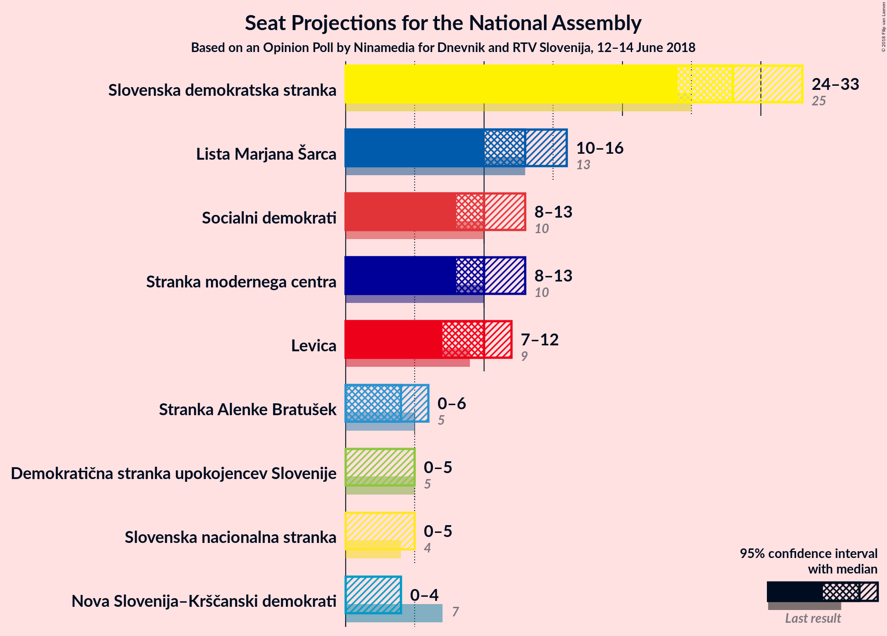
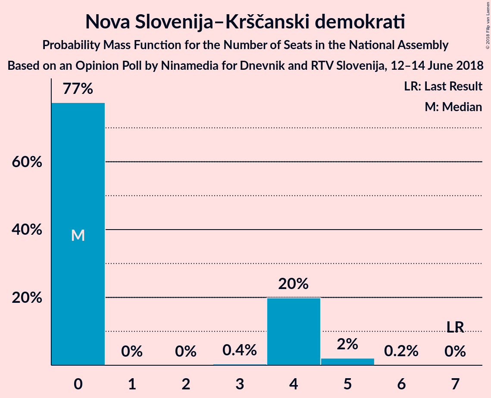

# Opinion Poll by Ninamedia for Dnevnik and RTV Slovenija, 12–14 June 2018

<a href="#voting-intentions">Voting Intentions</a> | <a href="#seats">Seats</a> | <a href="#coalitions">Coalitions</a> | <a href="#technical-information">Technical Information</a>

## Voting Intentions

### Confidence Intervals

| Party | Last Result | Poll Result | 80% Confidence Interval | 90% Confidence Interval | 95% Confidence Interval | 99% Confidence Interval |
|:-----:|:-----------:|:-----------:|:-----------------------:|:-----------------------:|:-----------------------:|:-----------------------:|
| Slovenska demokratska stranka | 24.9% | 29.3% | 27.0–31.8% |26.4–32.5% |25.8–33.1% |24.8–34.3% |
| Lista Marjana Šarca | 12.6% | 13.5% | 11.9–15.4% |11.4–16.0% |11.0–16.5% |10.2–17.5% |
| Socialni demokrati | 9.9% | 10.7% | 9.2–12.5% |8.8–13.0% |8.4–13.4% |7.8–14.3% |
| Stranka modernega centra | 9.7% | 10.7% | 9.2–12.5% |8.8–13.0% |8.4–13.4% |7.8–14.3% |
| Levica | 9.3% | 10.3% | 8.9–12.1% |8.5–12.6% |8.1–13.0% |7.5–13.9% |
| Stranka Alenke Bratušek | 5.1% | 4.5% | 3.6–5.8% |3.3–6.1% |3.1–6.5% |2.7–7.1% |
| Slovenska nacionalna stranka | 4.2% | 4.0% | 3.1–5.2% |2.9–5.6% |2.7–5.9% |2.3–6.5% |
| Nova Slovenija–Krščanski demokrati | 7.2% | 3.7% | 2.9–4.9% |2.6–5.2% |2.4–5.5% |2.1–6.1% |
| Demokratična stranka upokojencev Slovenije | 4.9% | 3.7% | 2.9–4.9% |2.6–5.2% |2.4–5.5% |2.1–6.1% |

*Note:* The poll result column reflects the actual value used in the calculations. Published results may vary slightly, and in addition be rounded to fewer digits.

## Seats

### Confidence Intervals

| Party | Last Result | Median | 80% Confidence Interval | 90% Confidence Interval | 95% Confidence Interval | 99% Confidence Interval |
|:-----:|:-----------:|:------:|:-----------------------:|:-----------------------:|:-----------------------:|:-----------------------:|
| <a href="#slovenska-demokratska-stranka">Slovenska demokratska stranka</a> | 25 | 29 | 25–31 |24–31 |24–33 |23–36 |
| <a href="#lista-marjana-šarca">Lista Marjana Šarca</a> | 13 | 12 | 11–14 |10–15 |10–16 |9–17 |
| <a href="#socialni-demokrati">Socialni demokrati</a> | 10 | 10 | 8–12 |8–12 |8–12 |7–14 |
| <a href="#stranka-modernega-centra">Stranka modernega centra</a> | 10 | 10 | 9–12 |8–13 |8–13 |7–14 |
| <a href="#levica">Levica</a> | 9 | 10 | 8–11 |8–12 |7–12 |7–13 |
| <a href="#stranka-alenke-bratušek">Stranka Alenke Bratušek</a> | 5 | 4 | 0–5 |0–6 |0–6 |0–6 |
| <a href="#slovenska-nacionalna-stranka">Slovenska nacionalna stranka</a> | 4 | 0 | 0–5 |0–6 |0–6 |0–6 |
| <a href="#nova-slovenija–krščanski-demokrati">Nova Slovenija–Krščanski demokrati</a> | 7 | 0 | 0–4 |0–4 |0–5 |0–5 |
| <a href="#demokratična-stranka-upokojencev-slovenije">Demokratična stranka upokojencev Slovenije</a> | 5 | 0 | 0–4 |0–5 |0–5 |0–5 |

### Slovenska demokratska stranka

*For a full overview of the results for this party, see the [Slovenska demokratska stranka](party-slovenskademokratskastranka.html) page.*

| Number of Seats | Probability | Accumulated | Special Marks |
|:---------------:|:-----------:|:-----------:|:-------------:|
| 21 | 0.1% | 100% |  |
| 22 | 0.4% | 99.9% |  |
| 23 | 1.1% | 99.5% |  |
| 24 | 5% | 98% |  |
| 25 | 7% | 93% | Last Result |
| 26 | 9% | 86% |  |
| 27 | 14% | 77% |  |
| 28 | 11% | 63% |  |
| 29 | 15% | 52% | Median |
| 30 | 11% | 37% |  |
| 31 | 22% | 26% |  |
| 32 | 1.5% | 4% |  |
| 33 | 0.7% | 3% |  |
| 34 | 0.3% | 2% |  |
| 35 | 1.1% | 2% |  |
| 36 | 0.7% | 0.7% |  |
| 37 | 0% | 0% |  |

### Lista Marjana Šarca

*For a full overview of the results for this party, see the [Lista Marjana Šarca](party-listamarjanašarca.html) page.*

| Number of Seats | Probability | Accumulated | Special Marks |
|:---------------:|:-----------:|:-----------:|:-------------:|
| 9 | 1.2% | 100% |  |
| 10 | 5% | 98.7% |  |
| 11 | 27% | 94% |  |
| 12 | 18% | 67% | Median |
| 13 | 22% | 49% | Last Result |
| 14 | 20% | 27% |  |
| 15 | 4% | 7% |  |
| 16 | 2% | 3% |  |
| 17 | 0.8% | 1.1% |  |
| 18 | 0.1% | 0.3% |  |
| 19 | 0.2% | 0.2% |  |
| 20 | 0% | 0% |  |

### Socialni demokrati

*For a full overview of the results for this party, see the [Socialni demokrati](party-socialnidemokrati.html) page.*

| Number of Seats | Probability | Accumulated | Special Marks |
|:---------------:|:-----------:|:-----------:|:-------------:|
| 6 | 0.1% | 100% |  |
| 7 | 0.8% | 99.9% |  |
| 8 | 10% | 99.0% |  |
| 9 | 24% | 89% |  |
| 10 | 29% | 66% | Last Result, Median |
| 11 | 14% | 37% |  |
| 12 | 20% | 23% |  |
| 13 | 2% | 2% |  |
| 14 | 0.6% | 0.7% |  |
| 15 | 0.1% | 0.1% |  |
| 16 | 0% | 0% |  |

### Stranka modernega centra

*For a full overview of the results for this party, see the [Stranka modernega centra](party-strankamodernegacentra.html) page.*

| Number of Seats | Probability | Accumulated | Special Marks |
|:---------------:|:-----------:|:-----------:|:-------------:|
| 6 | 0.1% | 100% |  |
| 7 | 1.2% | 99.9% |  |
| 8 | 8% | 98.8% |  |
| 9 | 20% | 91% |  |
| 10 | 24% | 71% | Last Result, Median |
| 11 | 35% | 48% |  |
| 12 | 8% | 13% |  |
| 13 | 4% | 5% |  |
| 14 | 0.4% | 0.7% |  |
| 15 | 0.2% | 0.2% |  |
| 16 | 0% | 0% |  |

### Levica

*For a full overview of the results for this party, see the [Levica](party-levica.html) page.*

| Number of Seats | Probability | Accumulated | Special Marks |
|:---------------:|:-----------:|:-----------:|:-------------:|
| 6 | 0.2% | 100% |  |
| 7 | 3% | 99.8% |  |
| 8 | 13% | 97% |  |
| 9 | 21% | 85% | Last Result |
| 10 | 31% | 64% | Median |
| 11 | 24% | 32% |  |
| 12 | 7% | 8% |  |
| 13 | 1.4% | 2% |  |
| 14 | 0.2% | 0.3% |  |
| 15 | 0.1% | 0.1% |  |
| 16 | 0% | 0% |  |

### Stranka Alenke Bratušek

*For a full overview of the results for this party, see the [Stranka Alenke Bratušek](party-strankaalenkebratušek.html) page.*

| Number of Seats | Probability | Accumulated | Special Marks |
|:---------------:|:-----------:|:-----------:|:-------------:|
| 0 | 26% | 100% |  |
| 1 | 0% | 74% |  |
| 2 | 0% | 74% |  |
| 3 | 3% | 74% |  |
| 4 | 35% | 71% | Median |
| 5 | 27% | 36% | Last Result |
| 6 | 9% | 9% |  |
| 7 | 0.3% | 0.3% |  |
| 8 | 0% | 0% |  |

### Slovenska nacionalna stranka

*For a full overview of the results for this party, see the [Slovenska nacionalna stranka](party-slovenskanacionalnastranka.html) page.*

| Number of Seats | Probability | Accumulated | Special Marks |
|:---------------:|:-----------:|:-----------:|:-------------:|
| 0 | 57% | 100% | Median |
| 1 | 0% | 43% |  |
| 2 | 0% | 43% |  |
| 3 | 5% | 43% |  |
| 4 | 20% | 38% | Last Result |
| 5 | 13% | 19% |  |
| 6 | 5% | 5% |  |
| 7 | 0.1% | 0.1% |  |
| 8 | 0% | 0% |  |

### Nova Slovenija–Krščanski demokrati

*For a full overview of the results for this party, see the [Nova Slovenija–Krščanski demokrati](party-novaslovenija–krščanskidemokrati.html) page.*

| Number of Seats | Probability | Accumulated | Special Marks |
|:---------------:|:-----------:|:-----------:|:-------------:|
| 0 | 80% | 100% | Median |
| 1 | 0% | 20% |  |
| 2 | 0% | 20% |  |
| 3 | 0.7% | 20% |  |
| 4 | 16% | 19% |  |
| 5 | 4% | 4% |  |
| 6 | 0.1% | 0.2% |  |
| 7 | 0% | 0% | Last Result |

### Demokratična stranka upokojencev Slovenije

*For a full overview of the results for this party, see the [Demokratična stranka upokojencev Slovenije](party-demokratičnastrankaupokojencevslovenije.html) page.*

| Number of Seats | Probability | Accumulated | Special Marks |
|:---------------:|:-----------:|:-----------:|:-------------:|
| 0 | 60% | 100% | Median |
| 1 | 0% | 40% |  |
| 2 | 0% | 40% |  |
| 3 | 4% | 40% |  |
| 4 | 29% | 37% |  |
| 5 | 7% | 7% | Last Result |
| 6 | 0.2% | 0.3% |  |
| 7 | 0% | 0% |  |

## Coalitions

### Confidence Intervals

| Coalition | Last Result | Median | Majority? | 80% Confidence Interval | 90% Confidence Interval | 95% Confidence Interval | 99% Confidence Interval |
|:---------:|:-----------:|:------:|:---------:|:-----------------------:|:-----------------------:|:-----------------------:|:-----------------------:|
| Slovenska demokratska stranka – Lista Marjana Šarca – Demokratična stranka upokojencev Slovenije | 43 | 43 | 19% | 39–46 | 38–46 | 38–47 | 36–49 |
| Slovenska demokratska stranka – Lista Marjana Šarca | 38 | 41 | 3% | 38–43 | 38–44 | 37–47 | 35–48 |
| Lista Marjana Šarca – Socialni demokrati – Stranka modernega centra – Stranka Alenke Bratušek – Demokratična stranka upokojencev Slovenije – Nova Slovenija–Krščanski demokrati | 50 | 38 | 0.2% | 35–42 | 34–43 | 32–44 | 31–45 |
| Lista Marjana Šarca – Socialni demokrati – Stranka modernega centra – Stranka Alenke Bratušek – Demokratična stranka upokojencev Slovenije | 43 | 38 | 0.1% | 34–42 | 32–42 | 32–42 | 30–44 |
| Lista Marjana Šarca – Socialni demokrati – Stranka modernega centra – Demokratična stranka upokojencev Slovenije – Nova Slovenija–Krščanski demokrati | 45 | 36 | 0% | 32–39 | 31–40 | 30–40 | 29–42 |
| Lista Marjana Šarca – Socialni demokrati – Stranka modernega centra – Nova Slovenija–Krščanski demokrati | 40 | 34 | 0% | 30–37 | 30–38 | 30–39 | 28–40 |
| Lista Marjana Šarca – Socialni demokrati – Stranka modernega centra – Demokratična stranka upokojencev Slovenije | 38 | 34 | 0% | 31–38 | 30–39 | 28–39 | 27–41 |
| Lista Marjana Šarca – Socialni demokrati – Stranka modernega centra | 33 | 33 | 0% | 30–36 | 28–36 | 28–37 | 27–38 |
| Lista Marjana Šarca – Socialni demokrati – Demokratična stranka upokojencev Slovenije – Nova Slovenija–Krščanski demokrati | 35 | 25 | 0% | 22–29 | 20–30 | 20–30 | 19–32 |
| Lista Marjana Šarca – Socialni demokrati – Demokratična stranka upokojencev Slovenije | 28 | 24 | 0% | 21–27 | 20–29 | 20–30 | 18–30 |
| Lista Marjana Šarca – Socialni demokrati – Nova Slovenija–Krščanski demokrati | 30 | 24 | 0% | 20–27 | 20–27 | 20–29 | 19–30 |
| Socialni demokrati – Stranka modernega centra – Demokratična stranka upokojencev Slovenije | 25 | 22 | 0% | 19–26 | 18–27 | 17–27 | 16–28 |
| Lista Marjana Šarca – Socialni demokrati | 23 | 23 | 0% | 20–25 | 20–26 | 19–26 | 18–28 |

### Slovenska demokratska stranka – Lista Marjana Šarca – Demokratična stranka upokojencev Slovenije

| Number of Seats | Probability | Accumulated | Special Marks |
|:---------------:|:-----------:|:-----------:|:-------------:|
| 35 | 0.3% | 100% |  |
| 36 | 0.2% | 99.6% |  |
| 37 | 0.8% | 99.4% |  |
| 38 | 6% | 98.6% |  |
| 39 | 5% | 93% |  |
| 40 | 14% | 88% |  |
| 41 | 11% | 73% | Median |
| 42 | 12% | 63% |  |
| 43 | 16% | 51% | Last Result |
| 44 | 4% | 34% |  |
| 45 | 11% | 30% |  |
| 46 | 15% | 19% | Majority |
| 47 | 3% | 4% |  |
| 48 | 0.7% | 2% |  |
| 49 | 0.9% | 1.2% |  |
| 50 | 0.2% | 0.3% |  |
| 51 | 0.1% | 0.1% |  |
| 52 | 0% | 0% |  |

### Slovenska demokratska stranka – Lista Marjana Šarca

| Number of Seats | Probability | Accumulated | Special Marks |
|:---------------:|:-----------:|:-----------:|:-------------:|
| 33 | 0.1% | 100% |  |
| 34 | 0.2% | 99.9% |  |
| 35 | 0.7% | 99.7% |  |
| 36 | 0.9% | 98.9% |  |
| 37 | 3% | 98% |  |
| 38 | 7% | 95% | Last Result |
| 39 | 9% | 88% |  |
| 40 | 21% | 79% |  |
| 41 | 17% | 58% | Median |
| 42 | 23% | 41% |  |
| 43 | 11% | 17% |  |
| 44 | 1.0% | 6% |  |
| 45 | 2% | 5% |  |
| 46 | 0.2% | 3% | Majority |
| 47 | 2% | 3% |  |
| 48 | 0.4% | 0.6% |  |
| 49 | 0% | 0.3% |  |
| 50 | 0.2% | 0.2% |  |
| 51 | 0% | 0% |  |

### Lista Marjana Šarca – Socialni demokrati – Stranka modernega centra – Stranka Alenke Bratušek – Demokratična stranka upokojencev Slovenije – Nova Slovenija–Krščanski demokrati

| Number of Seats | Probability | Accumulated | Special Marks |
|:---------------:|:-----------:|:-----------:|:-------------:|
| 30 | 0.1% | 100% |  |
| 31 | 0.5% | 99.9% |  |
| 32 | 3% | 99.4% |  |
| 33 | 0.8% | 96% |  |
| 34 | 2% | 96% |  |
| 35 | 8% | 94% |  |
| 36 | 3% | 86% | Median |
| 37 | 11% | 83% |  |
| 38 | 23% | 72% |  |
| 39 | 10% | 49% |  |
| 40 | 8% | 39% |  |
| 41 | 8% | 31% |  |
| 42 | 18% | 23% |  |
| 43 | 2% | 5% |  |
| 44 | 2% | 3% |  |
| 45 | 1.0% | 1.2% |  |
| 46 | 0.1% | 0.2% | Majority |
| 47 | 0.1% | 0.1% |  |
| 48 | 0% | 0% |  |
| 49 | 0% | 0% |  |
| 50 | 0% | 0% | Last Result |

### Lista Marjana Šarca – Socialni demokrati – Stranka modernega centra – Stranka Alenke Bratušek – Demokratična stranka upokojencev Slovenije

| Number of Seats | Probability | Accumulated | Special Marks |
|:---------------:|:-----------:|:-----------:|:-------------:|
| 29 | 0.3% | 100% |  |
| 30 | 0.3% | 99.7% |  |
| 31 | 1.5% | 99.4% |  |
| 32 | 4% | 98% |  |
| 33 | 4% | 94% |  |
| 34 | 2% | 90% |  |
| 35 | 9% | 88% |  |
| 36 | 7% | 79% | Median |
| 37 | 10% | 72% |  |
| 38 | 23% | 61% |  |
| 39 | 9% | 38% |  |
| 40 | 5% | 29% |  |
| 41 | 6% | 24% |  |
| 42 | 16% | 18% |  |
| 43 | 1.2% | 2% | Last Result |
| 44 | 1.1% | 1.2% |  |
| 45 | 0.1% | 0.1% |  |
| 46 | 0.1% | 0.1% | Majority |
| 47 | 0% | 0% |  |

### Lista Marjana Šarca – Socialni demokrati – Stranka modernega centra – Demokratična stranka upokojencev Slovenije – Nova Slovenija–Krščanski demokrati

| Number of Seats | Probability | Accumulated | Special Marks |
|:---------------:|:-----------:|:-----------:|:-------------:|
| 28 | 0.3% | 100% |  |
| 29 | 0.7% | 99.7% |  |
| 30 | 3% | 98.9% |  |
| 31 | 3% | 96% |  |
| 32 | 6% | 93% | Median |
| 33 | 16% | 87% |  |
| 34 | 13% | 71% |  |
| 35 | 7% | 58% |  |
| 36 | 17% | 51% |  |
| 37 | 6% | 34% |  |
| 38 | 13% | 28% |  |
| 39 | 8% | 15% |  |
| 40 | 5% | 6% |  |
| 41 | 0.4% | 2% |  |
| 42 | 0.9% | 1.3% |  |
| 43 | 0.3% | 0.4% |  |
| 44 | 0.1% | 0.1% |  |
| 45 | 0% | 0% | Last Result |

### Lista Marjana Šarca – Socialni demokrati – Stranka modernega centra – Nova Slovenija–Krščanski demokrati

| Number of Seats | Probability | Accumulated | Special Marks |
|:---------------:|:-----------:|:-----------:|:-------------:|
| 27 | 0% | 100% |  |
| 28 | 1.0% | 99.9% |  |
| 29 | 1.3% | 98.9% |  |
| 30 | 16% | 98% |  |
| 31 | 4% | 82% |  |
| 32 | 8% | 78% | Median |
| 33 | 14% | 69% |  |
| 34 | 15% | 55% |  |
| 35 | 12% | 40% |  |
| 36 | 16% | 28% |  |
| 37 | 6% | 13% |  |
| 38 | 4% | 7% |  |
| 39 | 1.1% | 3% |  |
| 40 | 2% | 2% | Last Result |
| 41 | 0.2% | 0.4% |  |
| 42 | 0.1% | 0.1% |  |
| 43 | 0% | 0% |  |

### Lista Marjana Šarca – Socialni demokrati – Stranka modernega centra – Demokratična stranka upokojencev Slovenije

| Number of Seats | Probability | Accumulated | Special Marks |
|:---------------:|:-----------:|:-----------:|:-------------:|
| 26 | 0% | 100% |  |
| 27 | 0.7% | 99.9% |  |
| 28 | 2% | 99.2% |  |
| 29 | 1.3% | 97% |  |
| 30 | 4% | 96% |  |
| 31 | 4% | 92% |  |
| 32 | 7% | 88% | Median |
| 33 | 18% | 81% |  |
| 34 | 14% | 63% |  |
| 35 | 8% | 49% |  |
| 36 | 18% | 41% |  |
| 37 | 4% | 22% |  |
| 38 | 10% | 18% | Last Result |
| 39 | 6% | 8% |  |
| 40 | 1.3% | 2% |  |
| 41 | 0.1% | 0.6% |  |
| 42 | 0.4% | 0.5% |  |
| 43 | 0.1% | 0.1% |  |
| 44 | 0% | 0% |  |

### Lista Marjana Šarca – Socialni demokrati – Stranka modernega centra

| Number of Seats | Probability | Accumulated | Special Marks |
|:---------------:|:-----------:|:-----------:|:-------------:|
| 26 | 0.1% | 100% |  |
| 27 | 1.0% | 99.9% |  |
| 28 | 4% | 98.8% |  |
| 29 | 2% | 95% |  |
| 30 | 17% | 93% |  |
| 31 | 7% | 76% |  |
| 32 | 9% | 69% | Median |
| 33 | 17% | 61% | Last Result |
| 34 | 15% | 44% |  |
| 35 | 9% | 29% |  |
| 36 | 16% | 20% |  |
| 37 | 3% | 4% |  |
| 38 | 0.9% | 1.3% |  |
| 39 | 0.3% | 0.4% |  |
| 40 | 0.1% | 0.1% |  |
| 41 | 0% | 0% |  |

### Lista Marjana Šarca – Socialni demokrati – Demokratična stranka upokojencev Slovenije – Nova Slovenija–Krščanski demokrati

| Number of Seats | Probability | Accumulated | Special Marks |
|:---------------:|:-----------:|:-----------:|:-------------:|
| 18 | 0.1% | 100% |  |
| 19 | 1.0% | 99.9% |  |
| 20 | 6% | 98.9% |  |
| 21 | 1.0% | 93% |  |
| 22 | 11% | 92% | Median |
| 23 | 3% | 81% |  |
| 24 | 23% | 78% |  |
| 25 | 16% | 54% |  |
| 26 | 4% | 39% |  |
| 27 | 18% | 34% |  |
| 28 | 4% | 16% |  |
| 29 | 3% | 13% |  |
| 30 | 8% | 10% |  |
| 31 | 1.0% | 2% |  |
| 32 | 0.8% | 1.0% |  |
| 33 | 0.1% | 0.2% |  |
| 34 | 0% | 0.1% |  |
| 35 | 0% | 0.1% | Last Result |
| 36 | 0% | 0% |  |

### Lista Marjana Šarca – Socialni demokrati – Demokratična stranka upokojencev Slovenije

| Number of Seats | Probability | Accumulated | Special Marks |
|:---------------:|:-----------:|:-----------:|:-------------:|
| 18 | 0.9% | 100% |  |
| 19 | 1.2% | 99.1% |  |
| 20 | 8% | 98% |  |
| 21 | 2% | 90% |  |
| 22 | 12% | 88% | Median |
| 23 | 9% | 76% |  |
| 24 | 24% | 67% |  |
| 25 | 15% | 43% |  |
| 26 | 7% | 28% |  |
| 27 | 12% | 21% |  |
| 28 | 3% | 9% | Last Result |
| 29 | 0.8% | 6% |  |
| 30 | 5% | 5% |  |
| 31 | 0.1% | 0.3% |  |
| 32 | 0.1% | 0.1% |  |
| 33 | 0% | 0.1% |  |
| 34 | 0% | 0% |  |

### Lista Marjana Šarca – Socialni demokrati – Nova Slovenija–Krščanski demokrati

| Number of Seats | Probability | Accumulated | Special Marks |
|:---------------:|:-----------:|:-----------:|:-------------:|
| 17 | 0.1% | 100% |  |
| 18 | 0.2% | 99.9% |  |
| 19 | 2% | 99.8% |  |
| 20 | 16% | 98% |  |
| 21 | 4% | 82% |  |
| 22 | 13% | 78% | Median |
| 23 | 15% | 65% |  |
| 24 | 13% | 50% |  |
| 25 | 18% | 37% |  |
| 26 | 7% | 19% |  |
| 27 | 7% | 11% |  |
| 28 | 2% | 4% |  |
| 29 | 2% | 3% |  |
| 30 | 0.4% | 0.8% | Last Result |
| 31 | 0.2% | 0.4% |  |
| 32 | 0.2% | 0.2% |  |
| 33 | 0% | 0% |  |

### Socialni demokrati – Stranka modernega centra – Demokratična stranka upokojencev Slovenije

| Number of Seats | Probability | Accumulated | Special Marks |
|:---------------:|:-----------:|:-----------:|:-------------:|
| 15 | 0.1% | 100% |  |
| 16 | 0.6% | 99.9% |  |
| 17 | 3% | 99.3% |  |
| 18 | 3% | 96% |  |
| 19 | 11% | 93% |  |
| 20 | 9% | 82% | Median |
| 21 | 16% | 73% |  |
| 22 | 8% | 57% |  |
| 23 | 28% | 49% |  |
| 24 | 3% | 20% |  |
| 25 | 6% | 17% | Last Result |
| 26 | 3% | 11% |  |
| 27 | 7% | 8% |  |
| 28 | 0.8% | 1.0% |  |
| 29 | 0.1% | 0.2% |  |
| 30 | 0.1% | 0.1% |  |
| 31 | 0% | 0% |  |

### Lista Marjana Šarca – Socialni demokrati

| Number of Seats | Probability | Accumulated | Special Marks |
|:---------------:|:-----------:|:-----------:|:-------------:|
| 17 | 0.1% | 100% |  |
| 18 | 1.1% | 99.9% |  |
| 19 | 4% | 98.8% |  |
| 20 | 18% | 95% |  |
| 21 | 6% | 77% |  |
| 22 | 16% | 71% | Median |
| 23 | 19% | 55% | Last Result |
| 24 | 13% | 36% |  |
| 25 | 17% | 23% |  |
| 26 | 4% | 6% |  |
| 27 | 0.4% | 1.3% |  |
| 28 | 0.8% | 0.9% |  |
| 29 | 0.1% | 0.1% |  |
| 30 | 0% | 0% |  |

## Technical Information

### Opinion Poll

+ **Polling firm:** Ninamedia
+ **Commissioner(s):** Dnevnik and RTV Slovenija
+ **Fieldwork period:** 12–14 June 2018

### Calculations

+ **Sample size:** 600
+ **Simulations done:** 131,072
+ **Error estimate:** 2.39%

