# Opinion Poll by Mediana for POP TV, 1–23 June 2018

<a href="#voting-intentions">Voting Intentions</a> | <a href="#seats">Seats</a> | <a href="#coalitions">Coalitions</a> | <a href="#technical-information">Technical Information</a>

## Voting Intentions

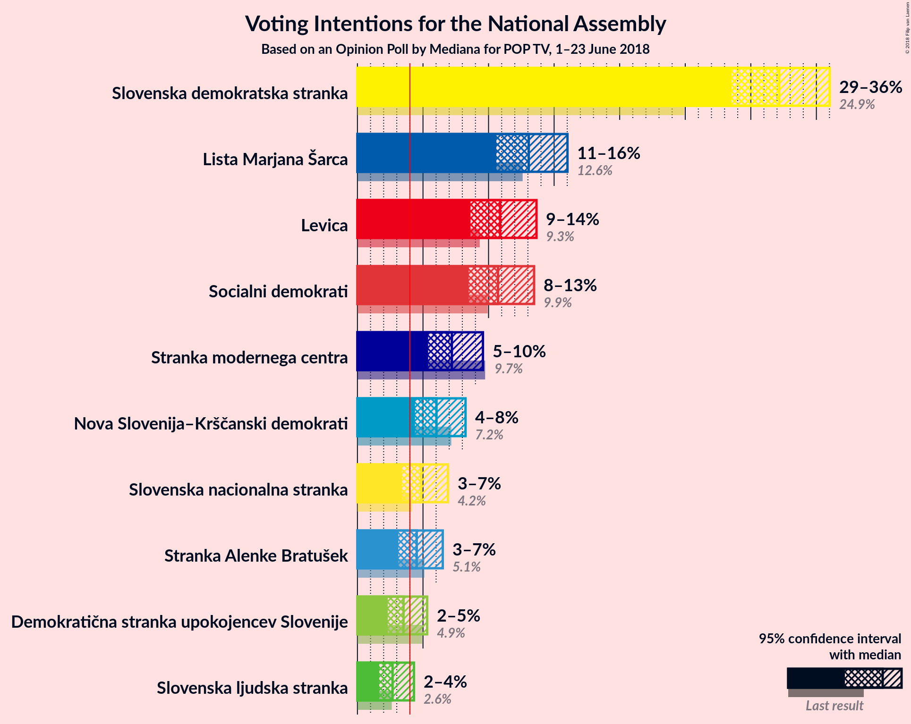

### Confidence Intervals

| Party | Last Result | Poll Result | 80% Confidence Interval | 90% Confidence Interval | 95% Confidence Interval | 99% Confidence Interval |
|:-----:|:-----------:|:-----------:|:-----------------------:|:-----------------------:|:-----------------------:|:-----------------------:|
| Slovenska demokratska stranka | 24.9% | 32.2% | 29.8–34.7% |29.1–35.4% |28.5–36.0% |27.4–37.3% |
| Lista Marjana Šarca | 12.6% | 13.1% | 11.4–15.0% |11.0–15.5% |10.6–16.0% |9.9–17.0% |
| Levica | 9.3% | 10.9% | 9.4–12.7% |9.0–13.2% |8.6–13.7% |8.0–14.6% |
| Socialni demokrati | 9.9% | 10.7% | 9.3–12.5% |8.8–13.0% |8.5–13.5% |7.8–14.4% |
| Stranka modernega centra | 9.7% | 7.2% | 6.0–8.7% |5.7–9.2% |5.4–9.6% |4.9–10.4% |
| Nova Slovenija–Krščanski demokrati | 7.2% | 6.0% | 4.9–7.5% |4.6–7.9% |4.4–8.2% |3.9–9.0% |
| Slovenska nacionalna stranka | 4.2% | 4.9% | 3.9–6.2% |3.6–6.6% |3.4–6.9% |3.0–7.6% |
| Stranka Alenke Bratušek | 5.1% | 4.5% | 3.6–5.8% |3.3–6.2% |3.1–6.5% |2.7–7.2% |
| Demokratična stranka upokojencev Slovenije | 4.9% | 3.5% | 2.7–4.7% |2.5–5.0% |2.3–5.3% |2.0–5.9% |
| Slovenska ljudska stranka | 2.6% | 2.7% | 2.0–3.7% |1.8–4.0% |1.7–4.3% |1.4–4.9% |

*Note:* The poll result column reflects the actual value used in the calculations. Published results may vary slightly, and in addition be rounded to fewer digits.

## Seats

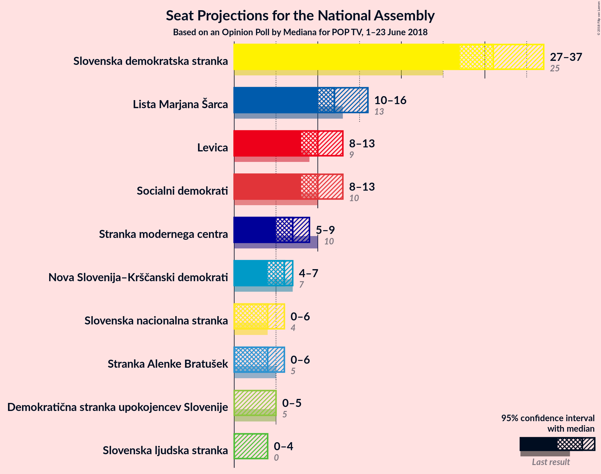

### Confidence Intervals

| Party | Last Result | Median | 80% Confidence Interval | 90% Confidence Interval | 95% Confidence Interval | 99% Confidence Interval |
|:-----:|:-----------:|:------:|:-----------------------:|:-----------------------:|:-----------------------:|:-----------------------:|
| <a href="#slovenska-demokratska-stranka">Slovenska demokratska stranka</a> | 25 | 31 | 28–34 |28–35 |27–37 |26–38 |
| <a href="#lista-marjana-šarca">Lista Marjana Šarca</a> | 13 | 12 | 11–14 |10–15 |10–16 |9–17 |
| <a href="#levica">Levica</a> | 9 | 10 | 9–12 |8–12 |8–13 |7–14 |
| <a href="#socialni-demokrati">Socialni demokrati</a> | 10 | 10 | 9–12 |8–12 |8–13 |7–14 |
| <a href="#stranka-modernega-centra">Stranka modernega centra</a> | 10 | 7 | 5–8 |5–9 |5–9 |4–10 |
| <a href="#nova-slovenija–krščanski-demokrati">Nova Slovenija–Krščanski demokrati</a> | 7 | 6 | 5–7 |4–7 |4–7 |0–9 |
| <a href="#slovenska-nacionalna-stranka">Slovenska nacionalna stranka</a> | 4 | 4 | 0–6 |0–6 |0–6 |0–7 |
| <a href="#stranka-alenke-bratušek">Stranka Alenke Bratušek</a> | 5 | 4 | 0–5 |0–6 |0–6 |0–6 |
| <a href="#demokratična-stranka-upokojencev-slovenije">Demokratična stranka upokojencev Slovenije</a> | 5 | 0 | 0–4 |0–4 |0–5 |0–5 |
| <a href="#slovenska-ljudska-stranka">Slovenska ljudska stranka</a> | 0 | 0 | 0 |0–3 |0–4 |0–4 |

### Slovenska demokratska stranka

*For a full overview of the results for this party, see the [Slovenska demokratska stranka](party-slovenskademokratskastranka.html) page.*

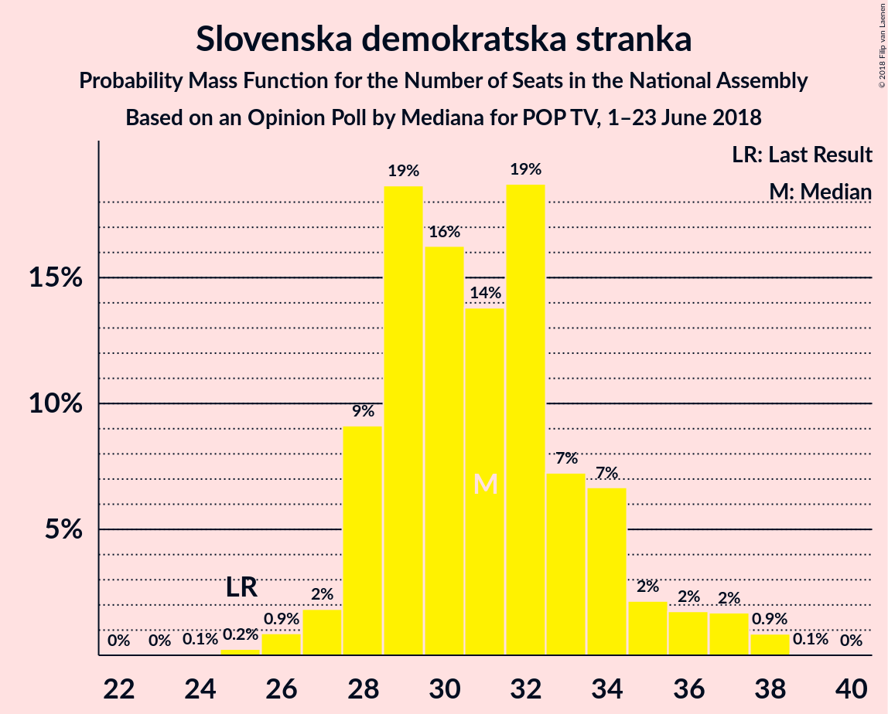

| Number of Seats | Probability | Accumulated | Special Marks |
|:---------------:|:-----------:|:-----------:|:-------------:|
| 24 | 0.1% | 100% |  |
| 25 | 0.2% | 99.9% | Last Result |
| 26 | 0.9% | 99.7% |  |
| 27 | 2% | 98.8% |  |
| 28 | 9% | 97% |  |
| 29 | 19% | 88% |  |
| 30 | 16% | 69% |  |
| 31 | 14% | 53% | Median |
| 32 | 19% | 39% |  |
| 33 | 7% | 20% |  |
| 34 | 7% | 13% |  |
| 35 | 2% | 7% |  |
| 36 | 2% | 4% |  |
| 37 | 2% | 3% |  |
| 38 | 0.9% | 0.9% |  |
| 39 | 0.1% | 0.1% |  |
| 40 | 0% | 0% |  |

### Lista Marjana Šarca

*For a full overview of the results for this party, see the [Lista Marjana Šarca](party-listamarjanašarca.html) page.*

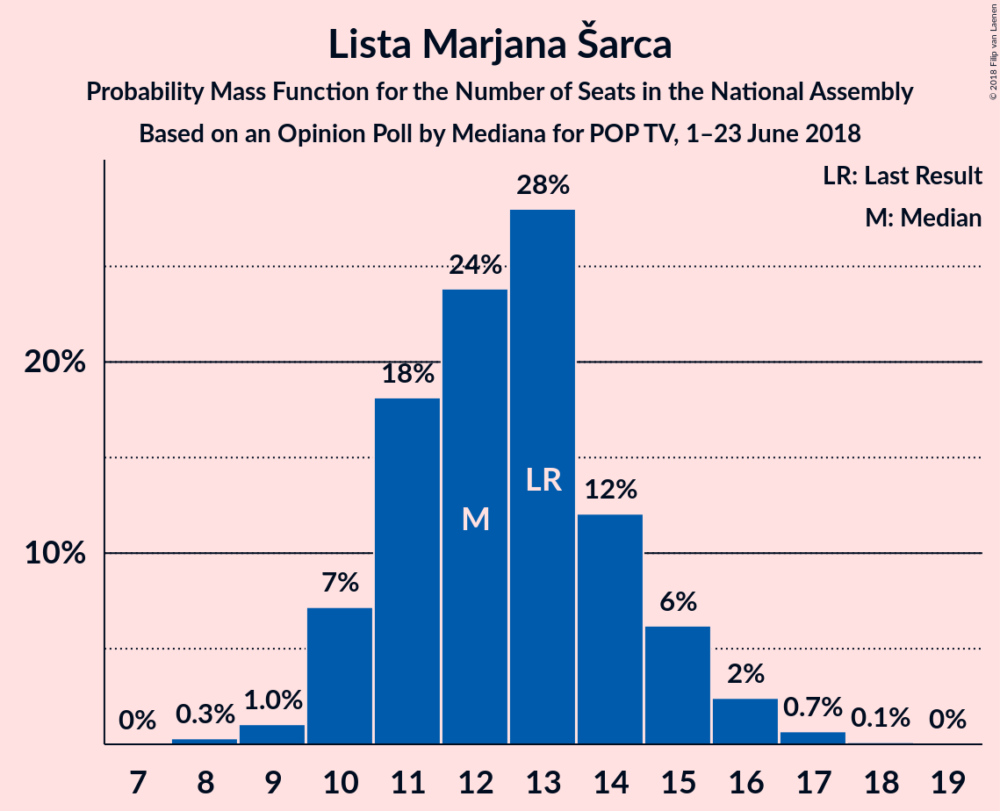

| Number of Seats | Probability | Accumulated | Special Marks |
|:---------------:|:-----------:|:-----------:|:-------------:|
| 8 | 0.3% | 100% |  |
| 9 | 1.0% | 99.7% |  |
| 10 | 7% | 98.6% |  |
| 11 | 18% | 91% |  |
| 12 | 24% | 73% | Median |
| 13 | 28% | 49% | Last Result |
| 14 | 12% | 21% |  |
| 15 | 6% | 9% |  |
| 16 | 2% | 3% |  |
| 17 | 0.7% | 0.8% |  |
| 18 | 0.1% | 0.1% |  |
| 19 | 0% | 0% |  |

### Levica

*For a full overview of the results for this party, see the [Levica](party-levica.html) page.*

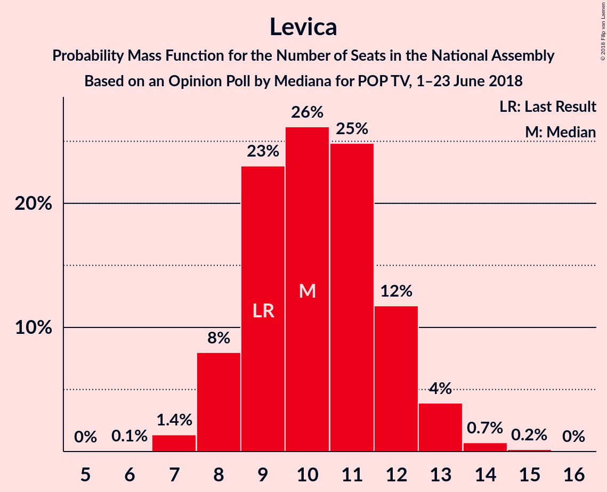

| Number of Seats | Probability | Accumulated | Special Marks |
|:---------------:|:-----------:|:-----------:|:-------------:|
| 6 | 0.1% | 100% |  |
| 7 | 1.4% | 99.9% |  |
| 8 | 8% | 98.6% |  |
| 9 | 23% | 91% | Last Result |
| 10 | 26% | 68% | Median |
| 11 | 25% | 41% |  |
| 12 | 12% | 17% |  |
| 13 | 4% | 5% |  |
| 14 | 0.7% | 0.9% |  |
| 15 | 0.2% | 0.2% |  |
| 16 | 0% | 0% |  |

### Socialni demokrati

*For a full overview of the results for this party, see the [Socialni demokrati](party-socialnidemokrati.html) page.*

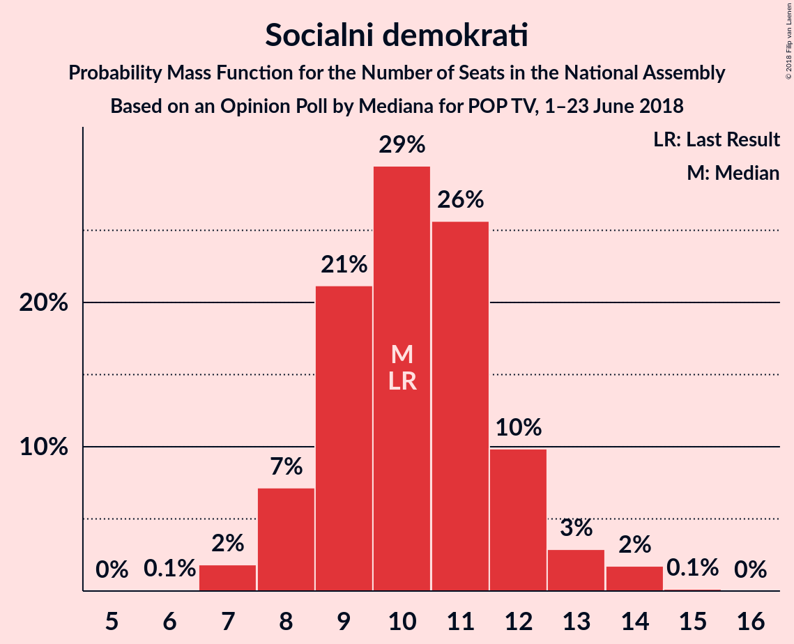

| Number of Seats | Probability | Accumulated | Special Marks |
|:---------------:|:-----------:|:-----------:|:-------------:|
| 6 | 0.1% | 100% |  |
| 7 | 2% | 99.9% |  |
| 8 | 7% | 98% |  |
| 9 | 21% | 91% |  |
| 10 | 29% | 70% | Last Result, Median |
| 11 | 26% | 40% |  |
| 12 | 10% | 15% |  |
| 13 | 3% | 5% |  |
| 14 | 2% | 2% |  |
| 15 | 0.1% | 0.2% |  |
| 16 | 0% | 0% |  |

### Stranka modernega centra

*For a full overview of the results for this party, see the [Stranka modernega centra](party-strankamodernegacentra.html) page.*

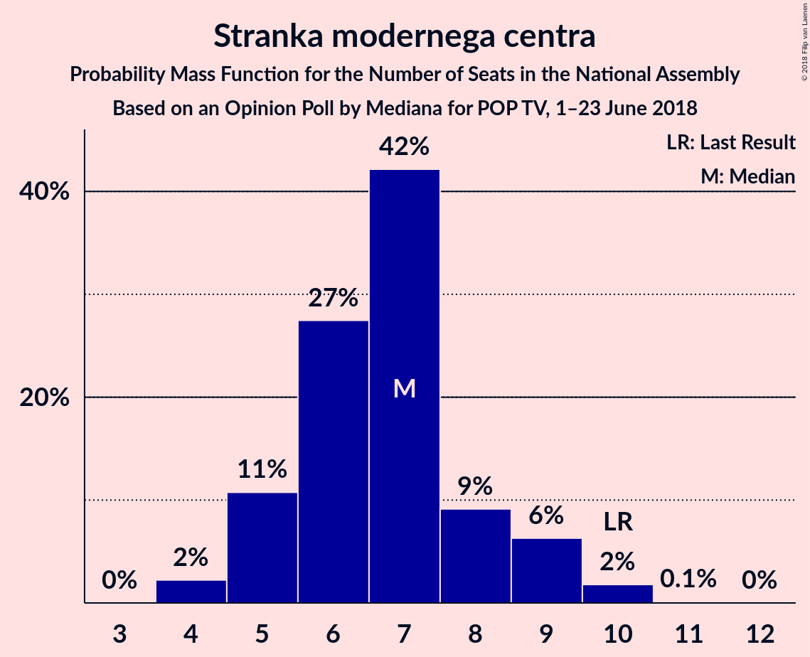

| Number of Seats | Probability | Accumulated | Special Marks |
|:---------------:|:-----------:|:-----------:|:-------------:|
| 4 | 2% | 100% |  |
| 5 | 11% | 98% |  |
| 6 | 27% | 87% |  |
| 7 | 42% | 60% | Median |
| 8 | 9% | 17% |  |
| 9 | 6% | 8% |  |
| 10 | 2% | 2% | Last Result |
| 11 | 0.1% | 0.1% |  |
| 12 | 0% | 0% |  |

### Nova Slovenija–Krščanski demokrati

*For a full overview of the results for this party, see the [Nova Slovenija–Krščanski demokrati](party-novaslovenija–krščanskidemokrati.html) page.*

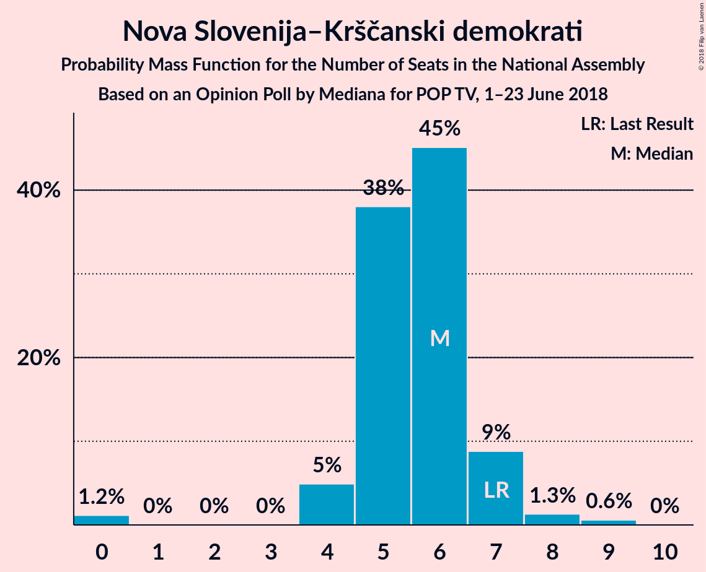

| Number of Seats | Probability | Accumulated | Special Marks |
|:---------------:|:-----------:|:-----------:|:-------------:|
| 0 | 1.2% | 100% |  |
| 1 | 0% | 98.8% |  |
| 2 | 0% | 98.8% |  |
| 3 | 0% | 98.8% |  |
| 4 | 5% | 98.8% |  |
| 5 | 38% | 94% |  |
| 6 | 45% | 56% | Median |
| 7 | 9% | 11% | Last Result |
| 8 | 1.3% | 2% |  |
| 9 | 0.6% | 0.6% |  |
| 10 | 0% | 0% |  |

### Slovenska nacionalna stranka

*For a full overview of the results for this party, see the [Slovenska nacionalna stranka](party-slovenskanacionalnastranka.html) page.*

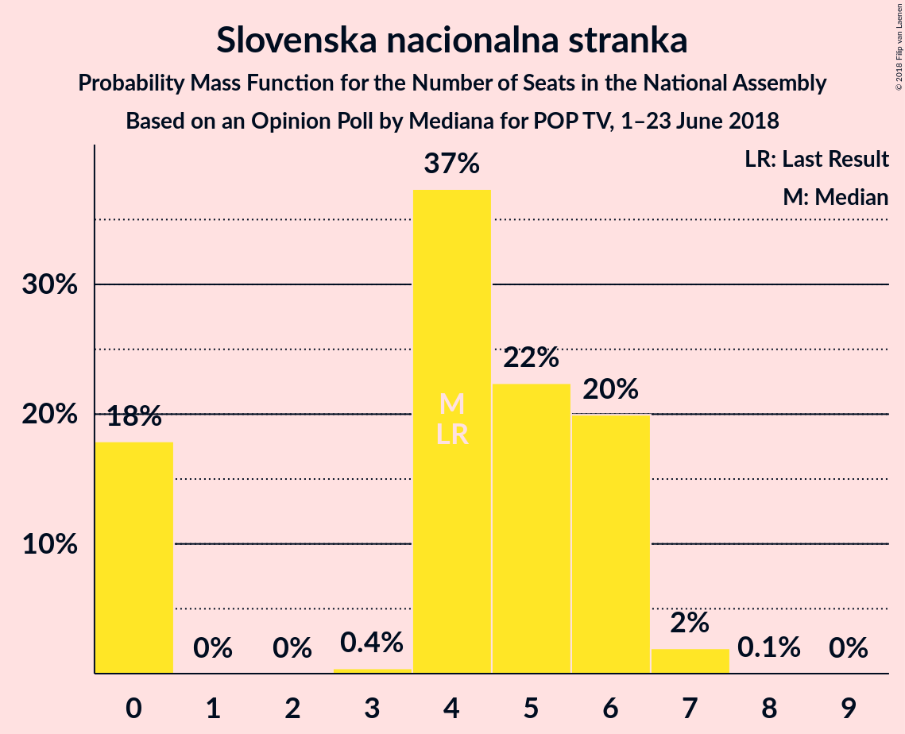

| Number of Seats | Probability | Accumulated | Special Marks |
|:---------------:|:-----------:|:-----------:|:-------------:|
| 0 | 18% | 100% |  |
| 1 | 0% | 82% |  |
| 2 | 0% | 82% |  |
| 3 | 0.4% | 82% |  |
| 4 | 37% | 82% | Last Result, Median |
| 5 | 22% | 44% |  |
| 6 | 20% | 22% |  |
| 7 | 2% | 2% |  |
| 8 | 0.1% | 0.1% |  |
| 9 | 0% | 0% |  |

### Stranka Alenke Bratušek

*For a full overview of the results for this party, see the [Stranka Alenke Bratušek](party-strankaalenkebratušek.html) page.*

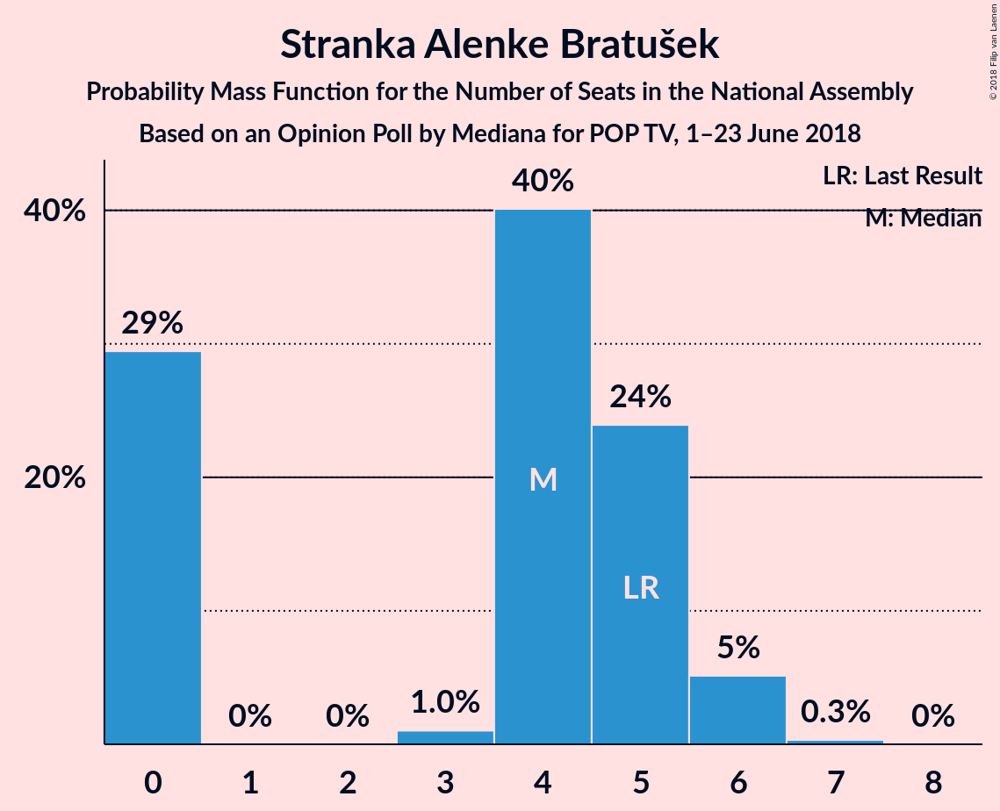

| Number of Seats | Probability | Accumulated | Special Marks |
|:---------------:|:-----------:|:-----------:|:-------------:|
| 0 | 29% | 100% |  |
| 1 | 0% | 71% |  |
| 2 | 0% | 71% |  |
| 3 | 1.0% | 71% |  |
| 4 | 40% | 70% | Median |
| 5 | 24% | 29% | Last Result |
| 6 | 5% | 5% |  |
| 7 | 0.3% | 0.4% |  |
| 8 | 0% | 0% |  |

### Demokratična stranka upokojencev Slovenije

*For a full overview of the results for this party, see the [Demokratična stranka upokojencev Slovenije](party-demokratičnastrankaupokojencevslovenije.html) page.*

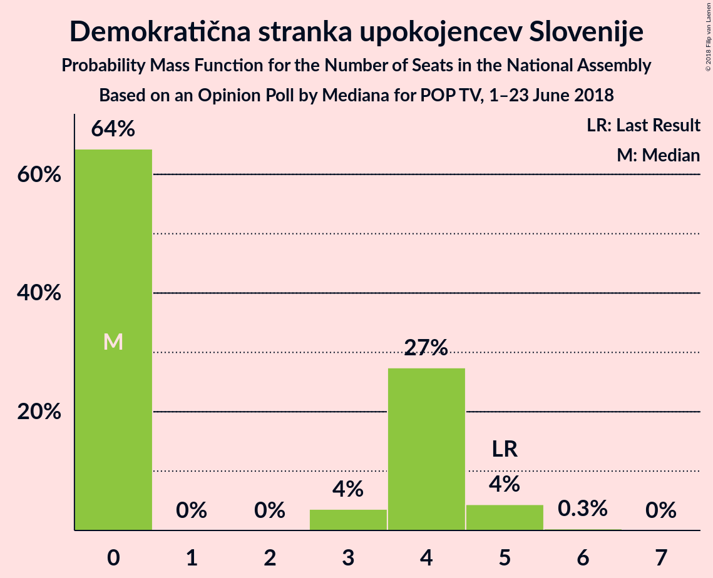

| Number of Seats | Probability | Accumulated | Special Marks |
|:---------------:|:-----------:|:-----------:|:-------------:|
| 0 | 64% | 100% | Median |
| 1 | 0% | 36% |  |
| 2 | 0% | 36% |  |
| 3 | 4% | 36% |  |
| 4 | 27% | 32% |  |
| 5 | 4% | 5% | Last Result |
| 6 | 0.3% | 0.3% |  |
| 7 | 0% | 0% |  |

### Slovenska ljudska stranka

*For a full overview of the results for this party, see the [Slovenska ljudska stranka](party-slovenskaljudskastranka.html) page.*

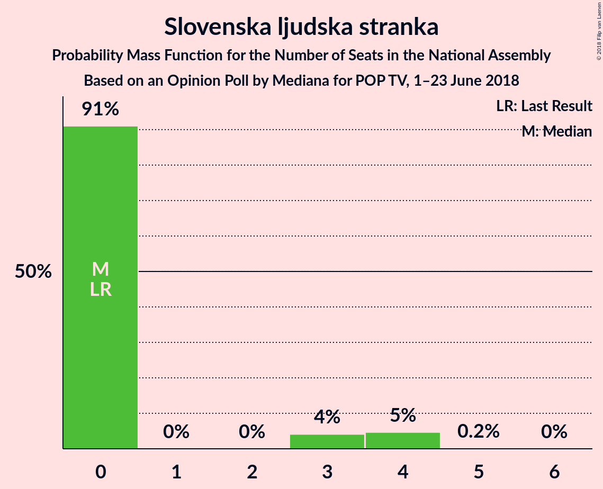

| Number of Seats | Probability | Accumulated | Special Marks |
|:---------------:|:-----------:|:-----------:|:-------------:|
| 0 | 91% | 100% | Last Result, Median |
| 1 | 0% | 9% |  |
| 2 | 0% | 9% |  |
| 3 | 4% | 9% |  |
| 4 | 5% | 5% |  |
| 5 | 0.2% | 0.2% |  |
| 6 | 0% | 0% |  |

## Coalitions

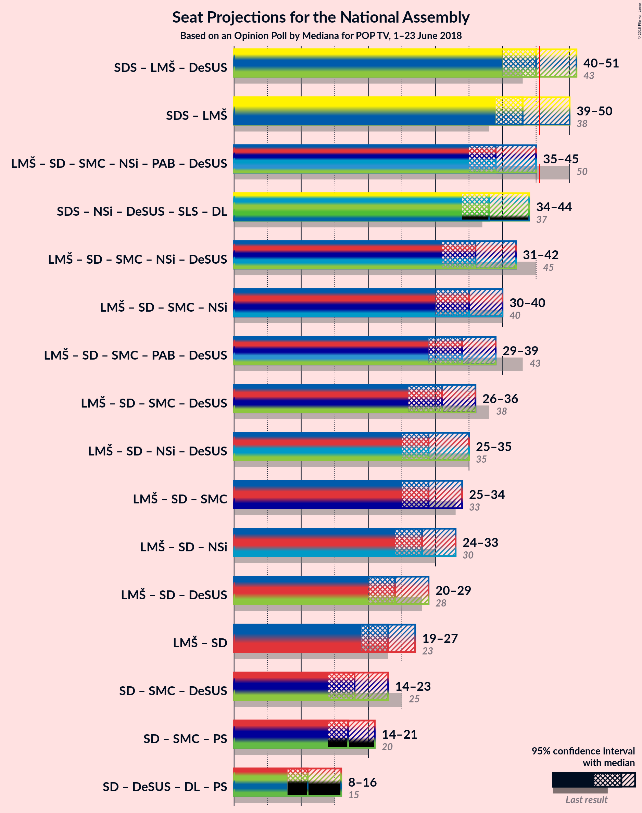

### Confidence Intervals

| Coalition | Last Result | Median | Majority? | 80% Confidence Interval | 90% Confidence Interval | 95% Confidence Interval | 99% Confidence Interval |
|:---------:|:-----------:|:------:|:---------:|:-----------------------:|:-----------------------:|:-----------------------:|:-----------------------:|
| Slovenska demokratska stranka – Lista Marjana Šarca – Demokratična stranka upokojencev Slovenije | 43 | 45 | 37% | 41–49 | 40–50 | 40–51 | 38–54 |
| Slovenska demokratska stranka – Lista Marjana Šarca | 38 | 43 | 19% | 40–47 | 40–49 | 39–50 | 37–51 |
| Lista Marjana Šarca – Socialni demokrati – Stranka modernega centra – Nova Slovenija–Krščanski demokrati – Stranka Alenke Bratušek – Demokratična stranka upokojencev Slovenije | 50 | 39 | 1.5% | 36–43 | 35–44 | 35–45 | 32–46 |
| Lista Marjana Šarca – Socialni demokrati – Stranka modernega centra – Nova Slovenija–Krščanski demokrati – Demokratična stranka upokojencev Slovenije | 45 | 36 | 0% | 34–40 | 32–41 | 31–42 | 29–44 |
| Lista Marjana Šarca – Socialni demokrati – Stranka modernega centra – Nova Slovenija–Krščanski demokrati | 40 | 35 | 0% | 32–38 | 31–39 | 30–40 | 29–43 |
| Lista Marjana Šarca – Socialni demokrati – Stranka modernega centra – Stranka Alenke Bratušek – Demokratična stranka upokojencev Slovenije | 43 | 34 | 0% | 30–37 | 30–38 | 29–39 | 27–41 |
| Lista Marjana Šarca – Socialni demokrati – Stranka modernega centra – Demokratična stranka upokojencev Slovenije | 38 | 31 | 0% | 28–34 | 27–35 | 26–36 | 25–38 |
| Lista Marjana Šarca – Socialni demokrati – Nova Slovenija–Krščanski demokrati – Demokratična stranka upokojencev Slovenije | 35 | 29 | 0% | 27–33 | 26–33 | 25–35 | 23–37 |
| Lista Marjana Šarca – Socialni demokrati – Stranka modernega centra | 33 | 29 | 0% | 27–32 | 26–33 | 25–34 | 24–36 |
| Lista Marjana Šarca – Socialni demokrati – Nova Slovenija–Krščanski demokrati | 30 | 28 | 0% | 25–31 | 25–32 | 24–33 | 23–36 |
| Lista Marjana Šarca – Socialni demokrati – Demokratična stranka upokojencev Slovenije | 28 | 24 | 0% | 21–27 | 20–28 | 20–29 | 18–31 |
| Lista Marjana Šarca – Socialni demokrati | 23 | 23 | 0% | 20–25 | 20–26 | 19–27 | 18–30 |
| Socialni demokrati – Stranka modernega centra – Demokratična stranka upokojencev Slovenije | 25 | 18 | 0% | 16–22 | 15–22 | 14–23 | 13–24 |

### Slovenska demokratska stranka – Lista Marjana Šarca – Demokratična stranka upokojencev Slovenije

| Number of Seats | Probability | Accumulated | Special Marks |
|:---------------:|:-----------:|:-----------:|:-------------:|
| 37 | 0.1% | 100% |  |
| 38 | 0.4% | 99.9% |  |
| 39 | 0.7% | 99.5% |  |
| 40 | 4% | 98.8% |  |
| 41 | 12% | 94% |  |
| 42 | 6% | 82% |  |
| 43 | 12% | 77% | Last Result, Median |
| 44 | 10% | 65% |  |
| 45 | 18% | 54% |  |
| 46 | 9% | 37% | Majority |
| 47 | 8% | 28% |  |
| 48 | 4% | 20% |  |
| 49 | 9% | 16% |  |
| 50 | 3% | 7% |  |
| 51 | 2% | 4% |  |
| 52 | 0.4% | 1.4% |  |
| 53 | 0.2% | 1.0% |  |
| 54 | 0.8% | 0.8% |  |
| 55 | 0% | 0% |  |

### Slovenska demokratska stranka – Lista Marjana Šarca

| Number of Seats | Probability | Accumulated | Special Marks |
|:---------------:|:-----------:|:-----------:|:-------------:|
| 36 | 0.1% | 100% |  |
| 37 | 0.4% | 99.9% |  |
| 38 | 1.3% | 99.5% | Last Result |
| 39 | 2% | 98% |  |
| 40 | 9% | 96% |  |
| 41 | 20% | 87% |  |
| 42 | 8% | 67% |  |
| 43 | 14% | 58% | Median |
| 44 | 8% | 45% |  |
| 45 | 17% | 36% |  |
| 46 | 6% | 19% | Majority |
| 47 | 5% | 13% |  |
| 48 | 2% | 8% |  |
| 49 | 3% | 7% |  |
| 50 | 3% | 4% |  |
| 51 | 0.3% | 0.8% |  |
| 52 | 0.3% | 0.4% |  |
| 53 | 0.1% | 0.2% |  |
| 54 | 0% | 0% |  |

### Lista Marjana Šarca – Socialni demokrati – Stranka modernega centra – Nova Slovenija–Krščanski demokrati – Stranka Alenke Bratušek – Demokratična stranka upokojencev Slovenije

| Number of Seats | Probability | Accumulated | Special Marks |
|:---------------:|:-----------:|:-----------:|:-------------:|
| 30 | 0.1% | 100% |  |
| 31 | 0.1% | 99.9% |  |
| 32 | 0.3% | 99.8% |  |
| 33 | 0.9% | 99.5% |  |
| 34 | 0.8% | 98.6% |  |
| 35 | 4% | 98% |  |
| 36 | 10% | 94% |  |
| 37 | 4% | 84% |  |
| 38 | 15% | 80% |  |
| 39 | 15% | 65% | Median |
| 40 | 12% | 50% |  |
| 41 | 16% | 38% |  |
| 42 | 5% | 22% |  |
| 43 | 10% | 17% |  |
| 44 | 4% | 8% |  |
| 45 | 2% | 3% |  |
| 46 | 1.2% | 1.5% | Majority |
| 47 | 0.2% | 0.3% |  |
| 48 | 0% | 0.1% |  |
| 49 | 0% | 0% |  |
| 50 | 0% | 0% | Last Result |

### Lista Marjana Šarca – Socialni demokrati – Stranka modernega centra – Nova Slovenija–Krščanski demokrati – Demokratična stranka upokojencev Slovenije

| Number of Seats | Probability | Accumulated | Special Marks |
|:---------------:|:-----------:|:-----------:|:-------------:|
| 28 | 0.1% | 100% |  |
| 29 | 0.4% | 99.9% |  |
| 30 | 0.7% | 99.5% |  |
| 31 | 2% | 98.7% |  |
| 32 | 2% | 97% |  |
| 33 | 4% | 95% |  |
| 34 | 13% | 90% |  |
| 35 | 14% | 78% | Median |
| 36 | 17% | 64% |  |
| 37 | 15% | 47% |  |
| 38 | 15% | 33% |  |
| 39 | 7% | 18% |  |
| 40 | 5% | 11% |  |
| 41 | 2% | 6% |  |
| 42 | 1.3% | 4% |  |
| 43 | 1.4% | 2% |  |
| 44 | 0.9% | 1.1% |  |
| 45 | 0.1% | 0.1% | Last Result |
| 46 | 0% | 0% | Majority |

### Lista Marjana Šarca – Socialni demokrati – Stranka modernega centra – Nova Slovenija–Krščanski demokrati

| Number of Seats | Probability | Accumulated | Special Marks |
|:---------------:|:-----------:|:-----------:|:-------------:|
| 27 | 0.1% | 100% |  |
| 28 | 0.2% | 99.9% |  |
| 29 | 0.9% | 99.7% |  |
| 30 | 2% | 98.8% |  |
| 31 | 5% | 97% |  |
| 32 | 8% | 92% |  |
| 33 | 12% | 84% |  |
| 34 | 18% | 72% |  |
| 35 | 14% | 54% | Median |
| 36 | 15% | 40% |  |
| 37 | 9% | 26% |  |
| 38 | 8% | 17% |  |
| 39 | 4% | 9% |  |
| 40 | 2% | 4% | Last Result |
| 41 | 0.7% | 2% |  |
| 42 | 0.4% | 1.4% |  |
| 43 | 1.0% | 1.1% |  |
| 44 | 0.1% | 0.1% |  |
| 45 | 0% | 0% |  |

### Lista Marjana Šarca – Socialni demokrati – Stranka modernega centra – Stranka Alenke Bratušek – Demokratična stranka upokojencev Slovenije

| Number of Seats | Probability | Accumulated | Special Marks |
|:---------------:|:-----------:|:-----------:|:-------------:|
| 25 | 0.1% | 100% |  |
| 26 | 0.1% | 99.9% |  |
| 27 | 0.8% | 99.8% |  |
| 28 | 1.3% | 98.9% |  |
| 29 | 3% | 98% |  |
| 30 | 8% | 95% |  |
| 31 | 4% | 87% |  |
| 32 | 7% | 83% |  |
| 33 | 20% | 76% | Median |
| 34 | 13% | 56% |  |
| 35 | 11% | 43% |  |
| 36 | 15% | 32% |  |
| 37 | 7% | 17% |  |
| 38 | 6% | 10% |  |
| 39 | 2% | 4% |  |
| 40 | 0.7% | 2% |  |
| 41 | 0.7% | 0.9% |  |
| 42 | 0.1% | 0.2% |  |
| 43 | 0% | 0.1% | Last Result |
| 44 | 0% | 0% |  |

### Lista Marjana Šarca – Socialni demokrati – Stranka modernega centra – Demokratična stranka upokojencev Slovenije

| Number of Seats | Probability | Accumulated | Special Marks |
|:---------------:|:-----------:|:-----------:|:-------------:|
| 23 | 0.1% | 100% |  |
| 24 | 0.3% | 99.9% |  |
| 25 | 1.2% | 99.6% |  |
| 26 | 2% | 98% |  |
| 27 | 3% | 96% |  |
| 28 | 8% | 93% |  |
| 29 | 15% | 85% | Median |
| 30 | 16% | 70% |  |
| 31 | 14% | 53% |  |
| 32 | 14% | 39% |  |
| 33 | 13% | 25% |  |
| 34 | 7% | 12% |  |
| 35 | 1.4% | 6% |  |
| 36 | 2% | 4% |  |
| 37 | 0.5% | 2% |  |
| 38 | 1.0% | 1.2% | Last Result |
| 39 | 0.1% | 0.2% |  |
| 40 | 0% | 0.1% |  |
| 41 | 0% | 0% |  |

### Lista Marjana Šarca – Socialni demokrati – Nova Slovenija–Krščanski demokrati – Demokratična stranka upokojencev Slovenije

| Number of Seats | Probability | Accumulated | Special Marks |
|:---------------:|:-----------:|:-----------:|:-------------:|
| 22 | 0.1% | 100% |  |
| 23 | 0.7% | 99.8% |  |
| 24 | 1.0% | 99.2% |  |
| 25 | 2% | 98% |  |
| 26 | 3% | 96% |  |
| 27 | 9% | 93% |  |
| 28 | 19% | 84% | Median |
| 29 | 16% | 65% |  |
| 30 | 9% | 49% |  |
| 31 | 15% | 40% |  |
| 32 | 13% | 24% |  |
| 33 | 7% | 12% |  |
| 34 | 1.2% | 5% |  |
| 35 | 2% | 4% | Last Result |
| 36 | 0.5% | 2% |  |
| 37 | 1.2% | 1.4% |  |
| 38 | 0.1% | 0.2% |  |
| 39 | 0% | 0% |  |

### Lista Marjana Šarca – Socialni demokrati – Stranka modernega centra

| Number of Seats | Probability | Accumulated | Special Marks |
|:---------------:|:-----------:|:-----------:|:-------------:|
| 23 | 0.2% | 100% |  |
| 24 | 0.9% | 99.8% |  |
| 25 | 3% | 98.9% |  |
| 26 | 4% | 96% |  |
| 27 | 10% | 92% |  |
| 28 | 16% | 82% |  |
| 29 | 22% | 66% | Median |
| 30 | 16% | 44% |  |
| 31 | 11% | 28% |  |
| 32 | 8% | 17% |  |
| 33 | 5% | 9% | Last Result |
| 34 | 2% | 4% |  |
| 35 | 0.5% | 2% |  |
| 36 | 1.3% | 1.4% |  |
| 37 | 0.1% | 0.1% |  |
| 38 | 0% | 0% |  |

### Lista Marjana Šarca – Socialni demokrati – Nova Slovenija–Krščanski demokrati

| Number of Seats | Probability | Accumulated | Special Marks |
|:---------------:|:-----------:|:-----------:|:-------------:|
| 21 | 0.1% | 100% |  |
| 22 | 0.3% | 99.9% |  |
| 23 | 1.2% | 99.6% |  |
| 24 | 3% | 98% |  |
| 25 | 8% | 95% |  |
| 26 | 6% | 88% |  |
| 27 | 16% | 81% |  |
| 28 | 25% | 65% | Median |
| 29 | 16% | 40% |  |
| 30 | 8% | 25% | Last Result |
| 31 | 8% | 17% |  |
| 32 | 5% | 9% |  |
| 33 | 3% | 4% |  |
| 34 | 0.3% | 2% |  |
| 35 | 0.6% | 1.3% |  |
| 36 | 0.2% | 0.7% |  |
| 37 | 0.4% | 0.5% |  |
| 38 | 0% | 0% |  |

### Lista Marjana Šarca – Socialni demokrati – Demokratična stranka upokojencev Slovenije

| Number of Seats | Probability | Accumulated | Special Marks |
|:---------------:|:-----------:|:-----------:|:-------------:|
| 17 | 0.1% | 100% |  |
| 18 | 0.4% | 99.9% |  |
| 19 | 2% | 99.5% |  |
| 20 | 3% | 98% |  |
| 21 | 6% | 95% |  |
| 22 | 15% | 89% | Median |
| 23 | 20% | 74% |  |
| 24 | 13% | 54% |  |
| 25 | 9% | 41% |  |
| 26 | 14% | 32% |  |
| 27 | 13% | 18% |  |
| 28 | 2% | 5% | Last Result |
| 29 | 1.2% | 3% |  |
| 30 | 1.0% | 2% |  |
| 31 | 0.9% | 1.1% |  |
| 32 | 0.1% | 0.2% |  |
| 33 | 0% | 0.1% |  |
| 34 | 0% | 0% |  |

### Lista Marjana Šarca – Socialni demokrati

| Number of Seats | Probability | Accumulated | Special Marks |
|:---------------:|:-----------:|:-----------:|:-------------:|
| 17 | 0.2% | 100% |  |
| 18 | 2% | 99.8% |  |
| 19 | 3% | 98% |  |
| 20 | 9% | 96% |  |
| 21 | 10% | 86% |  |
| 22 | 23% | 77% | Median |
| 23 | 28% | 54% | Last Result |
| 24 | 10% | 26% |  |
| 25 | 7% | 16% |  |
| 26 | 5% | 9% |  |
| 27 | 2% | 4% |  |
| 28 | 0.8% | 2% |  |
| 29 | 0.3% | 0.8% |  |
| 30 | 0.5% | 0.5% |  |
| 31 | 0% | 0% |  |

### Socialni demokrati – Stranka modernega centra – Demokratična stranka upokojencev Slovenije

| Number of Seats | Probability | Accumulated | Special Marks |
|:---------------:|:-----------:|:-----------:|:-------------:|
| 12 | 0.2% | 100% |  |
| 13 | 0.5% | 99.8% |  |
| 14 | 2% | 99.3% |  |
| 15 | 6% | 97% |  |
| 16 | 13% | 91% |  |
| 17 | 17% | 78% | Median |
| 18 | 20% | 61% |  |
| 19 | 11% | 40% |  |
| 20 | 10% | 30% |  |
| 21 | 5% | 20% |  |
| 22 | 10% | 14% |  |
| 23 | 3% | 4% |  |
| 24 | 0.7% | 1.1% |  |
| 25 | 0.4% | 0.4% | Last Result |
| 26 | 0% | 0.1% |  |
| 27 | 0% | 0% |  |

## Technical Information

### Opinion Poll

+ **Polling firm:** Mediana
+ **Commissioner(s):** POP TV
+ **Fieldwork period:** 1–23 June 2018

### Calculations

+ **Sample size:** 597
+ **Simulations done:** 1,048,576
+ **Error estimate:** 1.68%

