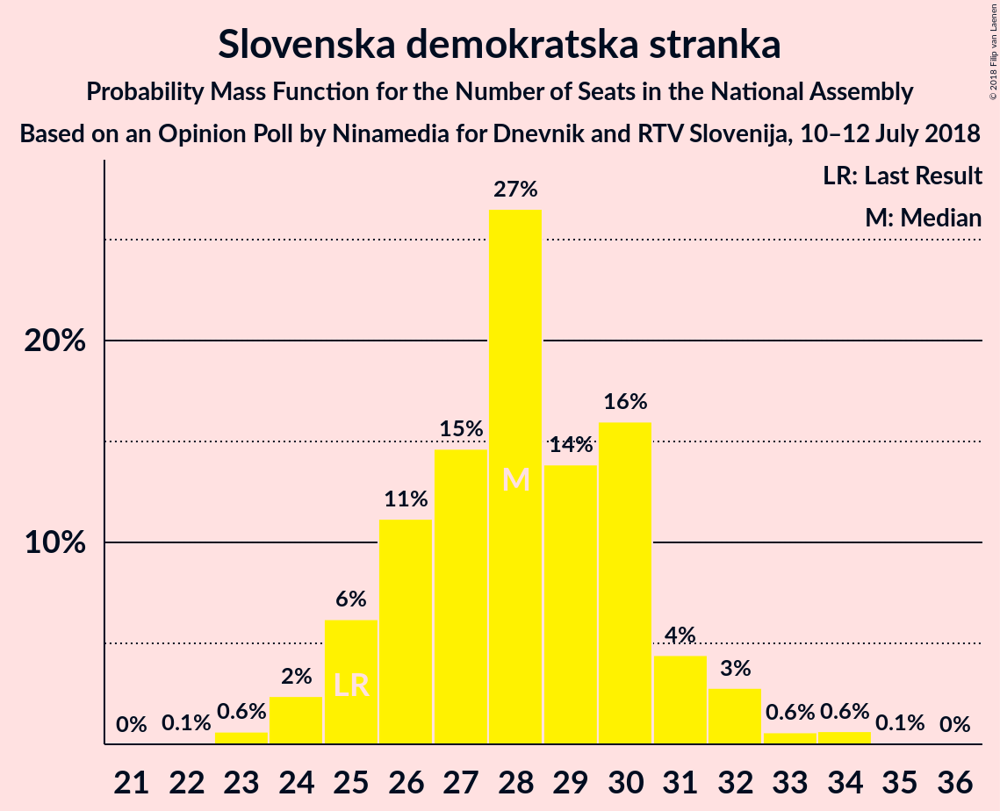
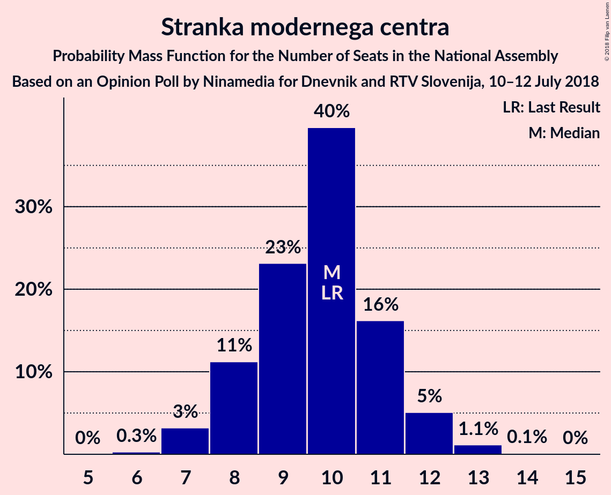

# Opinion Poll by Ninamedia for Dnevnik and RTV Slovenija, 10–12 July 2018

<a href="#voting-intentions">Voting Intentions</a> | <a href="#seats">Seats</a> | <a href="#coalitions">Coalitions</a> | <a href="#technical-information">Technical Information</a>

## Voting Intentions

### Confidence Intervals

| Party | Last Result | Poll Result | 80% Confidence Interval | 90% Confidence Interval | 95% Confidence Interval | 99% Confidence Interval |
|:-----:|:-----------:|:-----------:|:-----------------------:|:-----------------------:|:-----------------------:|:-----------------------:|
| Slovenska demokratska stranka | 24.9% | 29.3% | 27.0–31.7% |26.3–32.4% |25.8–33.0% |24.7–34.2% |
| Lista Marjana Šarca | 12.6% | 12.4% | 10.8–14.3% |10.4–14.8% |10.0–15.3% |9.3–16.2% |
| Socialni demokrati | 9.9% | 10.2% | 8.8–12.0% |8.4–12.5% |8.1–12.9% |7.4–13.8% |
| Stranka modernega centra | 9.7% | 10.2% | 8.8–12.0% |8.4–12.5% |8.1–12.9% |7.4–13.8% |
| Levica | 9.3% | 8.8% | 7.4–10.4% |7.1–10.9% |6.8–11.3% |6.2–12.1% |
| Nova Slovenija–Krščanski demokrati | 7.2% | 5.6% | 4.6–7.0% |4.3–7.4% |4.1–7.8% |3.6–8.5% |
| Demokratična stranka upokojencev Slovenije | 4.9% | 3.6% | 2.8–4.8% |2.6–5.2% |2.4–5.5% |2.1–6.1% |
| Stranka Alenke Bratušek | 5.1% | 3.5% | 2.7–4.6% |2.5–5.0% |2.3–5.3% |2.0–5.9% |
| Slovenska nacionalna stranka | 4.2% | 2.5% | 1.8–3.5% |1.7–3.8% |1.5–4.1% |1.2–4.6% |

*Note:* The poll result column reflects the actual value used in the calculations. Published results may vary slightly, and in addition be rounded to fewer digits.

## Seats

### Confidence Intervals

| Party | Last Result | Median | 80% Confidence Interval | 90% Confidence Interval | 95% Confidence Interval | 99% Confidence Interval |
|:-----:|:-----------:|:------:|:-----------------------:|:-----------------------:|:-----------------------:|:-----------------------:|
| <a href="#slovenska-demokratska-stranka">Slovenska demokratska stranka</a> | 25 | 28 | 26–30 |25–31 |24–32 |23–34 |
| <a href="#lista-marjana-šarca">Lista Marjana Šarca</a> | 13 | 12 | 10–13 |10–14 |9–14 |8–15 |
| <a href="#socialni-demokrati">Socialni demokrati</a> | 10 | 10 | 8–11 |8–11 |7–12 |7–13 |
| <a href="#stranka-modernega-centra">Stranka modernega centra</a> | 10 | 10 | 8–11 |8–12 |7–12 |7–13 |
| <a href="#levica">Levica</a> | 9 | 8 | 7–9 |6–10 |6–11 |6–11 |
| <a href="#nova-slovenija–krščanski-demokrati">Nova Slovenija–Krščanski demokrati</a> | 7 | 5 | 4–6 |4–7 |4–7 |0–8 |
| <a href="#demokratična-stranka-upokojencev-slovenije">Demokratična stranka upokojencev Slovenije</a> | 5 | 0 | 0–4 |0–4 |0–5 |0–5 |
| <a href="#stranka-alenke-bratušek">Stranka Alenke Bratušek</a> | 5 | 0 | 0–4 |0–4 |0–5 |0–5 |
| <a href="#slovenska-nacionalna-stranka">Slovenska nacionalna stranka</a> | 4 | 0 | 0 |0 |0 |0–4 |

### Slovenska demokratska stranka

*For a full overview of the results for this party, see the [Slovenska demokratska stranka](party-slovenskademokratskastranka.html) page.*

| Number of Seats | Probability | Accumulated | Special Marks |
|:---------------:|:-----------:|:-----------:|:-------------:|
| 22 | 0.1% | 100% |  |
| 23 | 0.6% | 99.9% |  |
| 24 | 2% | 99.3% |  |
| 25 | 6% | 97% | Last Result |
| 26 | 11% | 91% |  |
| 27 | 15% | 80% |  |
| 28 | 27% | 65% | Median |
| 29 | 14% | 38% |  |
| 30 | 16% | 25% |  |
| 31 | 4% | 9% |  |
| 32 | 3% | 4% |  |
| 33 | 0.6% | 1.3% |  |
| 34 | 0.6% | 0.7% |  |
| 35 | 0.1% | 0.1% |  |
| 36 | 0% | 0% |  |

### Lista Marjana Šarca

*For a full overview of the results for this party, see the [Lista Marjana Šarca](party-listamarjanašarca.html) page.*

| Number of Seats | Probability | Accumulated | Special Marks |
|:---------------:|:-----------:|:-----------:|:-------------:|
| 8 | 0.5% | 100% |  |
| 9 | 4% | 99.5% |  |
| 10 | 11% | 96% |  |
| 11 | 25% | 85% |  |
| 12 | 18% | 60% | Median |
| 13 | 36% | 42% | Last Result |
| 14 | 5% | 6% |  |
| 15 | 1.0% | 1.4% |  |
| 16 | 0.3% | 0.4% |  |
| 17 | 0.1% | 0.1% |  |
| 18 | 0% | 0% |  |

### Socialni demokrati

*For a full overview of the results for this party, see the [Socialni demokrati](party-socialnidemokrati.html) page.*

| Number of Seats | Probability | Accumulated | Special Marks |
|:---------------:|:-----------:|:-----------:|:-------------:|
| 6 | 0.3% | 100% |  |
| 7 | 2% | 99.7% |  |
| 8 | 17% | 97% |  |
| 9 | 19% | 81% |  |
| 10 | 45% | 62% | Last Result, Median |
| 11 | 12% | 17% |  |
| 12 | 4% | 5% |  |
| 13 | 0.7% | 1.0% |  |
| 14 | 0.2% | 0.2% |  |
| 15 | 0% | 0% |  |

### Stranka modernega centra

*For a full overview of the results for this party, see the [Stranka modernega centra](party-strankamodernegacentra.html) page.*

| Number of Seats | Probability | Accumulated | Special Marks |
|:---------------:|:-----------:|:-----------:|:-------------:|
| 6 | 0.3% | 100% |  |
| 7 | 3% | 99.7% |  |
| 8 | 11% | 97% |  |
| 9 | 23% | 85% |  |
| 10 | 40% | 62% | Last Result, Median |
| 11 | 16% | 23% |  |
| 12 | 5% | 6% |  |
| 13 | 1.1% | 1.3% |  |
| 14 | 0.1% | 0.1% |  |
| 15 | 0% | 0% |  |

### Levica

*For a full overview of the results for this party, see the [Levica](party-levica.html) page.*

| Number of Seats | Probability | Accumulated | Special Marks |
|:---------------:|:-----------:|:-----------:|:-------------:|
| 5 | 0.3% | 100% |  |
| 6 | 5% | 99.7% |  |
| 7 | 22% | 95% |  |
| 8 | 27% | 73% | Median |
| 9 | 37% | 46% | Last Result |
| 10 | 6% | 9% |  |
| 11 | 3% | 3% |  |
| 12 | 0.2% | 0.2% |  |
| 13 | 0% | 0% |  |

### Nova Slovenija–Krščanski demokrati

*For a full overview of the results for this party, see the [Nova Slovenija–Krščanski demokrati](party-novaslovenija–krščanskidemokrati.html) page.*

| Number of Seats | Probability | Accumulated | Special Marks |
|:---------------:|:-----------:|:-----------:|:-------------:|
| 0 | 2% | 100% |  |
| 1 | 0% | 98% |  |
| 2 | 0% | 98% |  |
| 3 | 0.3% | 98% |  |
| 4 | 20% | 98% |  |
| 5 | 50% | 78% | Median |
| 6 | 21% | 28% |  |
| 7 | 5% | 6% | Last Result |
| 8 | 1.0% | 1.1% |  |
| 9 | 0% | 0.1% |  |
| 10 | 0% | 0% |  |

### Demokratična stranka upokojencev Slovenije

*For a full overview of the results for this party, see the [Demokratična stranka upokojencev Slovenije](party-demokratičnastrankaupokojencevslovenije.html) page.*

| Number of Seats | Probability | Accumulated | Special Marks |
|:---------------:|:-----------:|:-----------:|:-------------:|
| 0 | 71% | 100% | Median |
| 1 | 0% | 29% |  |
| 2 | 0% | 29% |  |
| 3 | 2% | 29% |  |
| 4 | 22% | 26% |  |
| 5 | 4% | 4% | Last Result |
| 6 | 0.2% | 0.2% |  |
| 7 | 0% | 0% |  |

### Stranka Alenke Bratušek

*For a full overview of the results for this party, see the [Stranka Alenke Bratušek](party-strankaalenkebratušek.html) page.*

| Number of Seats | Probability | Accumulated | Special Marks |
|:---------------:|:-----------:|:-----------:|:-------------:|
| 0 | 74% | 100% | Median |
| 1 | 0% | 26% |  |
| 2 | 0% | 26% |  |
| 3 | 3% | 26% |  |
| 4 | 21% | 23% |  |
| 5 | 3% | 3% | Last Result |
| 6 | 0.1% | 0.1% |  |
| 7 | 0% | 0% |  |

### Slovenska nacionalna stranka

*For a full overview of the results for this party, see the [Slovenska nacionalna stranka](party-slovenskanacionalnastranka.html) page.*

| Number of Seats | Probability | Accumulated | Special Marks |
|:---------------:|:-----------:|:-----------:|:-------------:|
| 0 | 98% | 100% | Median |
| 1 | 0% | 2% |  |
| 2 | 0% | 2% |  |
| 3 | 0.7% | 2% |  |
| 4 | 1.3% | 1.3% | Last Result |
| 5 | 0% | 0% |  |

## Coalitions

### Confidence Intervals

| Coalition | Last Result | Median | Majority? | 80% Confidence Interval | 90% Confidence Interval | 95% Confidence Interval | 99% Confidence Interval |
|:---------:|:-----------:|:------:|:---------:|:-----------------------:|:-----------------------:|:-----------------------:|:-----------------------:|
| Slovenska demokratska stranka – Lista Marjana Šarca – Demokratična stranka upokojencev Slovenije | 43 | 41 | 3% | 38–44 | 37–45 | 36–46 | 36–48 |
| Slovenska demokratska stranka – Lista Marjana Šarca | 38 | 40 | 0.4% | 37–43 | 36–43 | 36–44 | 34–45 |
| Lista Marjana Šarca – Socialni demokrati – Stranka modernega centra – Nova Slovenija–Krščanski demokrati – Demokratična stranka upokojencev Slovenije – Stranka Alenke Bratušek | 50 | 38 | 0.1% | 36–41 | 35–42 | 34–43 | 33–44 |
| Lista Marjana Šarca – Socialni demokrati – Stranka modernega centra – Nova Slovenija–Krščanski demokrati – Demokratična stranka upokojencev Slovenije | 45 | 37 | 0% | 35–41 | 34–41 | 33–42 | 32–43 |
| Lista Marjana Šarca – Socialni demokrati – Stranka modernega centra – Nova Slovenija–Krščanski demokrati | 40 | 37 | 0% | 33–39 | 32–39 | 32–40 | 30–42 |
| Lista Marjana Šarca – Socialni demokrati – Stranka modernega centra – Demokratična stranka upokojencev Slovenije – Stranka Alenke Bratušek | 43 | 33 | 0% | 31–36 | 29–38 | 29–38 | 28–40 |
| Lista Marjana Šarca – Socialni demokrati – Stranka modernega centra – Demokratična stranka upokojencev Slovenije | 38 | 32 | 0% | 29–36 | 29–36 | 28–37 | 27–38 |
| Lista Marjana Šarca – Socialni demokrati – Stranka modernega centra | 33 | 31 | 0% | 28–34 | 28–34 | 27–35 | 26–36 |
| Lista Marjana Šarca – Socialni demokrati – Nova Slovenija–Krščanski demokrati – Demokratična stranka upokojencev Slovenije | 35 | 28 | 0% | 25–31 | 24–31 | 24–32 | 22–34 |
| Lista Marjana Šarca – Socialni demokrati – Nova Slovenija–Krščanski demokrati | 30 | 27 | 0% | 24–28 | 23–29 | 23–30 | 21–31 |
| Lista Marjana Šarca – Socialni demokrati – Demokratična stranka upokojencev Slovenije | 28 | 23 | 0% | 20–26 | 19–27 | 18–27 | 17–28 |
| Socialni demokrati – Stranka modernega centra – Demokratična stranka upokojencev Slovenije | 25 | 20 | 0% | 18–24 | 17–24 | 17–25 | 16–26 |
| Lista Marjana Šarca – Socialni demokrati | 23 | 22 | 0% | 19–23 | 18–24 | 18–24 | 17–26 |

### Slovenska demokratska stranka – Lista Marjana Šarca – Demokratična stranka upokojencev Slovenije

| Number of Seats | Probability | Accumulated | Special Marks |
|:---------------:|:-----------:|:-----------:|:-------------:|
| 34 | 0.2% | 100% |  |
| 35 | 0.3% | 99.8% |  |
| 36 | 3% | 99.5% |  |
| 37 | 3% | 96% |  |
| 38 | 8% | 93% |  |
| 39 | 9% | 85% |  |
| 40 | 10% | 76% | Median |
| 41 | 22% | 67% |  |
| 42 | 16% | 44% |  |
| 43 | 16% | 29% | Last Result |
| 44 | 6% | 13% |  |
| 45 | 4% | 7% |  |
| 46 | 2% | 3% | Majority |
| 47 | 0.8% | 1.3% |  |
| 48 | 0.5% | 0.5% |  |
| 49 | 0% | 0.1% |  |
| 50 | 0% | 0% |  |

### Slovenska demokratska stranka – Lista Marjana Šarca

| Number of Seats | Probability | Accumulated | Special Marks |
|:---------------:|:-----------:|:-----------:|:-------------:|
| 33 | 0.3% | 100% |  |
| 34 | 0.6% | 99.7% |  |
| 35 | 1.4% | 99.1% |  |
| 36 | 6% | 98% |  |
| 37 | 5% | 92% |  |
| 38 | 15% | 87% | Last Result |
| 39 | 13% | 71% |  |
| 40 | 11% | 58% | Median |
| 41 | 22% | 47% |  |
| 42 | 9% | 24% |  |
| 43 | 12% | 16% |  |
| 44 | 2% | 4% |  |
| 45 | 2% | 2% |  |
| 46 | 0.3% | 0.4% | Majority |
| 47 | 0.1% | 0.1% |  |
| 48 | 0% | 0% |  |

### Lista Marjana Šarca – Socialni demokrati – Stranka modernega centra – Nova Slovenija–Krščanski demokrati – Demokratična stranka upokojencev Slovenije – Stranka Alenke Bratušek

| Number of Seats | Probability | Accumulated | Special Marks |
|:---------------:|:-----------:|:-----------:|:-------------:|
| 31 | 0.1% | 100% |  |
| 32 | 0.2% | 99.9% |  |
| 33 | 1.2% | 99.6% |  |
| 34 | 3% | 98% |  |
| 35 | 3% | 96% |  |
| 36 | 9% | 92% |  |
| 37 | 16% | 84% | Median |
| 38 | 21% | 68% |  |
| 39 | 17% | 47% |  |
| 40 | 7% | 30% |  |
| 41 | 14% | 23% |  |
| 42 | 4% | 9% |  |
| 43 | 3% | 4% |  |
| 44 | 1.0% | 1.4% |  |
| 45 | 0.2% | 0.3% |  |
| 46 | 0.1% | 0.1% | Majority |
| 47 | 0% | 0% |  |
| 48 | 0% | 0% |  |
| 49 | 0% | 0% |  |
| 50 | 0% | 0% | Last Result |

### Lista Marjana Šarca – Socialni demokrati – Stranka modernega centra – Nova Slovenija–Krščanski demokrati – Demokratična stranka upokojencev Slovenije

| Number of Seats | Probability | Accumulated | Special Marks |
|:---------------:|:-----------:|:-----------:|:-------------:|
| 30 | 0.1% | 100% |  |
| 31 | 0.3% | 99.8% |  |
| 32 | 0.9% | 99.6% |  |
| 33 | 3% | 98.6% |  |
| 34 | 5% | 96% |  |
| 35 | 10% | 91% |  |
| 36 | 10% | 81% |  |
| 37 | 22% | 71% | Median |
| 38 | 22% | 49% |  |
| 39 | 12% | 28% |  |
| 40 | 5% | 16% |  |
| 41 | 7% | 10% |  |
| 42 | 2% | 4% |  |
| 43 | 2% | 2% |  |
| 44 | 0.3% | 0.3% |  |
| 45 | 0% | 0.1% | Last Result |
| 46 | 0% | 0% | Majority |

### Lista Marjana Šarca – Socialni demokrati – Stranka modernega centra – Nova Slovenija–Krščanski demokrati

| Number of Seats | Probability | Accumulated | Special Marks |
|:---------------:|:-----------:|:-----------:|:-------------:|
| 28 | 0% | 100% |  |
| 29 | 0.2% | 99.9% |  |
| 30 | 0.7% | 99.8% |  |
| 31 | 1.2% | 99.0% |  |
| 32 | 3% | 98% |  |
| 33 | 6% | 95% |  |
| 34 | 9% | 89% |  |
| 35 | 14% | 80% |  |
| 36 | 11% | 66% |  |
| 37 | 24% | 55% | Median |
| 38 | 17% | 30% |  |
| 39 | 9% | 13% |  |
| 40 | 2% | 4% | Last Result |
| 41 | 1.1% | 2% |  |
| 42 | 0.5% | 0.6% |  |
| 43 | 0.1% | 0.1% |  |
| 44 | 0% | 0% |  |

### Lista Marjana Šarca – Socialni demokrati – Stranka modernega centra – Demokratična stranka upokojencev Slovenije – Stranka Alenke Bratušek

| Number of Seats | Probability | Accumulated | Special Marks |
|:---------------:|:-----------:|:-----------:|:-------------:|
| 26 | 0.1% | 100% |  |
| 27 | 0.2% | 99.9% |  |
| 28 | 2% | 99.7% |  |
| 29 | 4% | 98% |  |
| 30 | 4% | 94% |  |
| 31 | 7% | 91% |  |
| 32 | 15% | 84% | Median |
| 33 | 24% | 69% |  |
| 34 | 12% | 45% |  |
| 35 | 15% | 33% |  |
| 36 | 8% | 17% |  |
| 37 | 4% | 9% |  |
| 38 | 3% | 5% |  |
| 39 | 1.1% | 2% |  |
| 40 | 0.5% | 0.7% |  |
| 41 | 0.1% | 0.2% |  |
| 42 | 0% | 0% |  |
| 43 | 0% | 0% | Last Result |

### Lista Marjana Šarca – Socialni demokrati – Stranka modernega centra – Demokratična stranka upokojencev Slovenije

| Number of Seats | Probability | Accumulated | Special Marks |
|:---------------:|:-----------:|:-----------:|:-------------:|
| 26 | 0.2% | 100% |  |
| 27 | 0.9% | 99.7% |  |
| 28 | 3% | 98.8% |  |
| 29 | 6% | 96% |  |
| 30 | 6% | 90% |  |
| 31 | 17% | 83% |  |
| 32 | 17% | 66% | Median |
| 33 | 23% | 49% |  |
| 34 | 11% | 26% |  |
| 35 | 5% | 15% |  |
| 36 | 6% | 10% |  |
| 37 | 2% | 4% |  |
| 38 | 2% | 2% | Last Result |
| 39 | 0.3% | 0.4% |  |
| 40 | 0.1% | 0.1% |  |
| 41 | 0% | 0% |  |

### Lista Marjana Šarca – Socialni demokrati – Stranka modernega centra

| Number of Seats | Probability | Accumulated | Special Marks |
|:---------------:|:-----------:|:-----------:|:-------------:|
| 24 | 0.1% | 100% |  |
| 25 | 0.3% | 99.9% |  |
| 26 | 2% | 99.7% |  |
| 27 | 2% | 98% |  |
| 28 | 6% | 96% |  |
| 29 | 12% | 90% |  |
| 30 | 10% | 78% |  |
| 31 | 19% | 69% |  |
| 32 | 19% | 49% | Median |
| 33 | 19% | 30% | Last Result |
| 34 | 8% | 11% |  |
| 35 | 1.3% | 3% |  |
| 36 | 1.0% | 1.4% |  |
| 37 | 0.4% | 0.5% |  |
| 38 | 0.1% | 0.1% |  |
| 39 | 0% | 0% |  |

### Lista Marjana Šarca – Socialni demokrati – Nova Slovenija–Krščanski demokrati – Demokratična stranka upokojencev Slovenije

| Number of Seats | Probability | Accumulated | Special Marks |
|:---------------:|:-----------:|:-----------:|:-------------:|
| 20 | 0% | 100% |  |
| 21 | 0.2% | 99.9% |  |
| 22 | 0.5% | 99.7% |  |
| 23 | 2% | 99.2% |  |
| 24 | 4% | 98% |  |
| 25 | 8% | 93% |  |
| 26 | 8% | 85% |  |
| 27 | 20% | 77% | Median |
| 28 | 31% | 56% |  |
| 29 | 7% | 26% |  |
| 30 | 6% | 19% |  |
| 31 | 9% | 13% |  |
| 32 | 3% | 4% |  |
| 33 | 1.0% | 2% |  |
| 34 | 0.5% | 0.7% |  |
| 35 | 0.1% | 0.1% | Last Result |
| 36 | 0% | 0% |  |

### Lista Marjana Šarca – Socialni demokrati – Nova Slovenija–Krščanski demokrati

| Number of Seats | Probability | Accumulated | Special Marks |
|:---------------:|:-----------:|:-----------:|:-------------:|
| 19 | 0.1% | 100% |  |
| 20 | 0.1% | 99.9% |  |
| 21 | 0.8% | 99.8% |  |
| 22 | 1.2% | 99.0% |  |
| 23 | 5% | 98% |  |
| 24 | 9% | 93% |  |
| 25 | 12% | 84% |  |
| 26 | 11% | 71% |  |
| 27 | 23% | 61% | Median |
| 28 | 30% | 37% |  |
| 29 | 4% | 8% |  |
| 30 | 3% | 4% | Last Result |
| 31 | 1.1% | 1.5% |  |
| 32 | 0.3% | 0.4% |  |
| 33 | 0.1% | 0.1% |  |
| 34 | 0% | 0% |  |

### Lista Marjana Šarca – Socialni demokrati – Demokratična stranka upokojencev Slovenije

| Number of Seats | Probability | Accumulated | Special Marks |
|:---------------:|:-----------:|:-----------:|:-------------:|
| 17 | 0.6% | 100% |  |
| 18 | 2% | 99.3% |  |
| 19 | 4% | 97% |  |
| 20 | 6% | 94% |  |
| 21 | 18% | 88% |  |
| 22 | 12% | 70% | Median |
| 23 | 35% | 59% |  |
| 24 | 7% | 24% |  |
| 25 | 5% | 17% |  |
| 26 | 7% | 13% |  |
| 27 | 4% | 5% |  |
| 28 | 0.9% | 1.3% | Last Result |
| 29 | 0.3% | 0.5% |  |
| 30 | 0.1% | 0.1% |  |
| 31 | 0% | 0% |  |

### Socialni demokrati – Stranka modernega centra – Demokratična stranka upokojencev Slovenije

| Number of Seats | Probability | Accumulated | Special Marks |
|:---------------:|:-----------:|:-----------:|:-------------:|
| 15 | 0.2% | 100% |  |
| 16 | 1.0% | 99.8% |  |
| 17 | 4% | 98.8% |  |
| 18 | 11% | 95% |  |
| 19 | 17% | 84% |  |
| 20 | 25% | 67% | Median |
| 21 | 13% | 42% |  |
| 22 | 11% | 29% |  |
| 23 | 5% | 18% |  |
| 24 | 9% | 13% |  |
| 25 | 3% | 4% | Last Result |
| 26 | 0.7% | 1.1% |  |
| 27 | 0.3% | 0.3% |  |
| 28 | 0% | 0.1% |  |
| 29 | 0% | 0% |  |

### Lista Marjana Šarca – Socialni demokrati

| Number of Seats | Probability | Accumulated | Special Marks |
|:---------------:|:-----------:|:-----------:|:-------------:|
| 16 | 0.2% | 100% |  |
| 17 | 1.1% | 99.8% |  |
| 18 | 4% | 98.7% |  |
| 19 | 11% | 95% |  |
| 20 | 10% | 84% |  |
| 21 | 21% | 74% |  |
| 22 | 16% | 54% | Median |
| 23 | 32% | 38% | Last Result |
| 24 | 3% | 5% |  |
| 25 | 1.5% | 2% |  |
| 26 | 0.5% | 0.9% |  |
| 27 | 0.3% | 0.4% |  |
| 28 | 0.1% | 0.1% |  |
| 29 | 0% | 0% |  |

## Technical Information

### Opinion Poll

+ **Polling firm:** Ninamedia
+ **Commissioner(s):** Dnevnik and RTV Slovenija
+ **Fieldwork period:** 10–12 July 2018

### Calculations

+ **Sample size:** 605
+ **Simulations done:** 1,048,576
+ **Error estimate:** 1.94%

