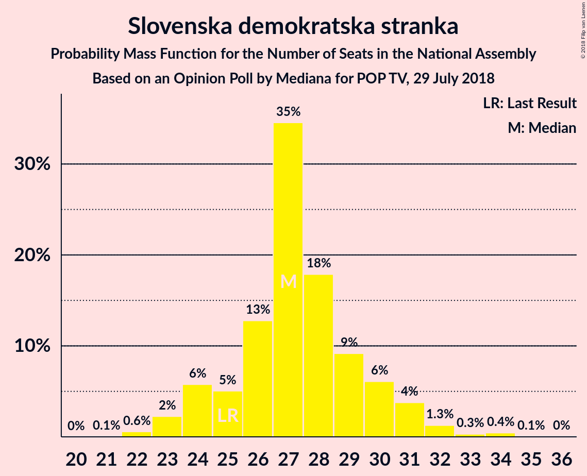
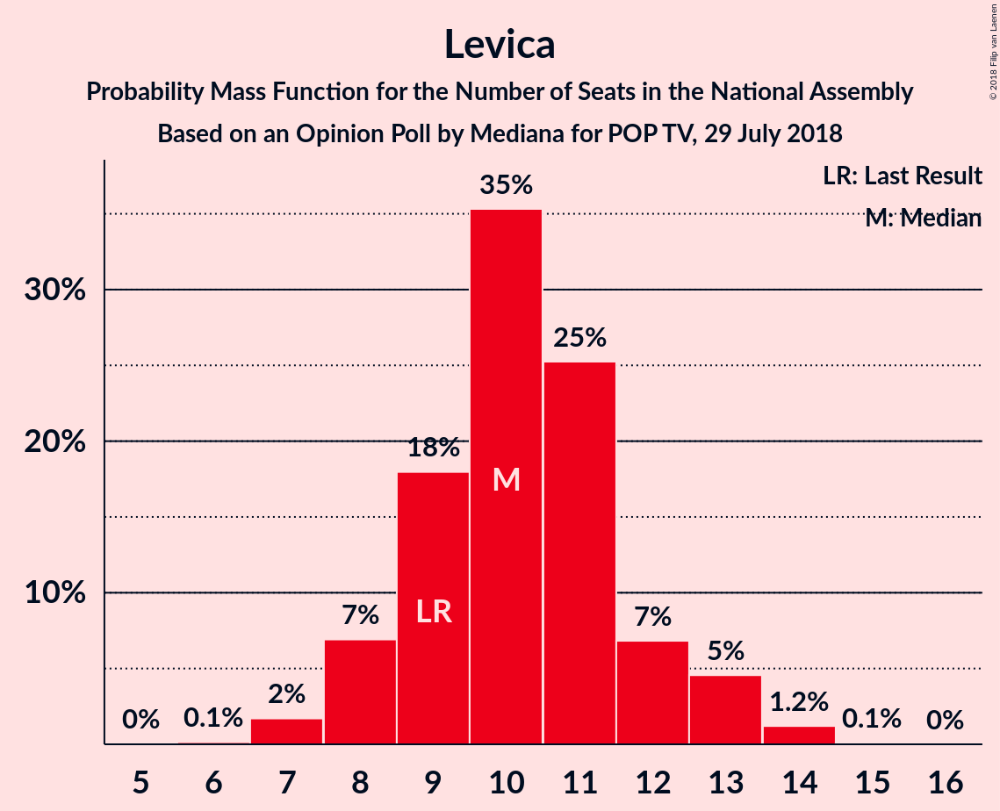

# Opinion Poll by Mediana for POP TV, 29 July 2018

<a href="#voting-intentions">Voting Intentions</a> | <a href="#seats">Seats</a> | <a href="#coalitions">Coalitions</a> | <a href="#technical-information">Technical Information</a>

## Voting Intentions

### Confidence Intervals

| Party | Last Result | Poll Result | 80% Confidence Interval | 90% Confidence Interval | 95% Confidence Interval | 99% Confidence Interval |
|:-----:|:-----------:|:-----------:|:-----------------------:|:-----------------------:|:-----------------------:|:-----------------------:|
| Slovenska demokratska stranka | 24.9% | 29.1% | 26.7–31.7% |26.0–32.5% |25.4–33.1% |24.3–34.4% |
| Lista Marjana Šarca | 12.6% | 15.1% | 13.3–17.3% |12.8–17.9% |12.3–18.4% |11.5–19.5% |
| Levica | 9.3% | 10.8% | 9.2–12.7% |8.8–13.2% |8.4–13.7% |7.7–14.7% |
| Socialni demokrati | 9.9% | 10.2% | 8.7–12.1% |8.3–12.6% |7.9–13.1% |7.2–14.0% |
| Nova Slovenija–Krščanski demokrati | 7.2% | 7.4% | 6.1–9.0% |5.7–9.5% |5.4–9.9% |4.9–10.8% |
| Stranka modernega centra | 9.7% | 7.0% | 5.8–8.6% |5.4–9.1% |5.1–9.5% |4.6–10.3% |
| Slovenska nacionalna stranka | 4.2% | 5.9% | 4.7–7.4% |4.4–7.8% |4.2–8.2% |3.7–9.0% |
| Stranka Alenke Bratušek | 5.1% | 5.5% | 4.4–7.0% |4.1–7.4% |3.8–7.8% |3.4–8.5% |
| Demokratična stranka upokojencev Slovenije | 4.9% | 2.5% | 1.8–3.6% |1.6–3.9% |1.4–4.2% |1.2–4.8% |
| Slovenska ljudska stranka | 2.6% | 1.5% | 1.0–2.5% |0.9–2.7% |0.8–3.0% |0.6–3.5% |

*Note:* The poll result column reflects the actual value used in the calculations. Published results may vary slightly, and in addition be rounded to fewer digits.

## Seats

### Confidence Intervals

| Party | Last Result | Median | 80% Confidence Interval | 90% Confidence Interval | 95% Confidence Interval | 99% Confidence Interval |
|:-----:|:-----------:|:------:|:-----------------------:|:-----------------------:|:-----------------------:|:-----------------------:|
| <a href="#slovenska-demokratska-stranka">Slovenska demokratska stranka</a> | 25 | 27 | 25–29 |24–30 |24–32 |23–34 |
| <a href="#lista-marjana-šarca">Lista Marjana Šarca</a> | 13 | 16 | 12–18 |12–18 |11–18 |10–19 |
| <a href="#levica">Levica</a> | 9 | 10 | 9–11 |8–12 |8–12 |7–13 |
| <a href="#socialni-demokrati">Socialni demokrati</a> | 10 | 10 | 8–11 |8–11 |7–11 |6–12 |
| <a href="#nova-slovenija–krščanski-demokrati">Nova Slovenija–Krščanski demokrati</a> | 7 | 6 | 5–8 |5–8 |5–9 |4–10 |
| <a href="#stranka-modernega-centra">Stranka modernega centra</a> | 10 | 6 | 5–7 |5–8 |5–9 |4–9 |
| <a href="#slovenska-nacionalna-stranka">Slovenska nacionalna stranka</a> | 4 | 6 | 4–6 |0–7 |0–7 |0–8 |
| <a href="#stranka-alenke-bratušek">Stranka Alenke Bratušek</a> | 5 | 5 | 4–6 |4–6 |0–7 |0–8 |
| <a href="#demokratična-stranka-upokojencev-slovenije">Demokratična stranka upokojencev Slovenije</a> | 5 | 0 | 0 |0 |0 |0–4 |
| <a href="#slovenska-ljudska-stranka">Slovenska ljudska stranka</a> | 0 | 0 | 0 |0 |0 |0 |

### Slovenska demokratska stranka

*For a full overview of the results for this party, see the [Slovenska demokratska stranka](party-slovenskademokratskastranka.html) page.*

| Number of Seats | Probability | Accumulated | Special Marks |
|:---------------:|:-----------:|:-----------:|:-------------:|
| 21 | 0.1% | 100% |  |
| 22 | 0.1% | 99.9% |  |
| 23 | 2% | 99.8% |  |
| 24 | 3% | 98% |  |
| 25 | 6% | 95% | Last Result |
| 26 | 10% | 89% |  |
| 27 | 56% | 79% | Median |
| 28 | 5% | 23% |  |
| 29 | 9% | 18% |  |
| 30 | 5% | 9% |  |
| 31 | 1.1% | 4% |  |
| 32 | 2% | 3% |  |
| 33 | 0.9% | 2% |  |
| 34 | 0.6% | 0.6% |  |
| 35 | 0% | 0% |  |

### Lista Marjana Šarca

*For a full overview of the results for this party, see the [Lista Marjana Šarca](party-listamarjanašarca.html) page.*

| Number of Seats | Probability | Accumulated | Special Marks |
|:---------------:|:-----------:|:-----------:|:-------------:|
| 10 | 1.0% | 100% |  |
| 11 | 3% | 99.0% |  |
| 12 | 10% | 96% |  |
| 13 | 7% | 87% | Last Result |
| 14 | 4% | 79% |  |
| 15 | 9% | 75% |  |
| 16 | 45% | 66% | Median |
| 17 | 3% | 21% |  |
| 18 | 17% | 17% |  |
| 19 | 0.5% | 0.5% |  |
| 20 | 0% | 0% |  |

### Levica

*For a full overview of the results for this party, see the [Levica](party-levica.html) page.*

| Number of Seats | Probability | Accumulated | Special Marks |
|:---------------:|:-----------:|:-----------:|:-------------:|
| 6 | 0.1% | 100% |  |
| 7 | 1.3% | 99.9% |  |
| 8 | 5% | 98.6% |  |
| 9 | 7% | 93% | Last Result |
| 10 | 68% | 86% | Median |
| 11 | 11% | 19% |  |
| 12 | 6% | 7% |  |
| 13 | 0.5% | 0.8% |  |
| 14 | 0.3% | 0.3% |  |
| 15 | 0.1% | 0.1% |  |
| 16 | 0% | 0% |  |

### Socialni demokrati

*For a full overview of the results for this party, see the [Socialni demokrati](party-socialnidemokrati.html) page.*

| Number of Seats | Probability | Accumulated | Special Marks |
|:---------------:|:-----------:|:-----------:|:-------------:|
| 6 | 1.4% | 100% |  |
| 7 | 2% | 98.6% |  |
| 8 | 27% | 96% |  |
| 9 | 14% | 69% |  |
| 10 | 41% | 55% | Last Result, Median |
| 11 | 12% | 14% |  |
| 12 | 2% | 2% |  |
| 13 | 0.4% | 0.5% |  |
| 14 | 0.1% | 0.1% |  |
| 15 | 0% | 0% |  |

### Nova Slovenija–Krščanski demokrati

*For a full overview of the results for this party, see the [Nova Slovenija–Krščanski demokrati](party-novaslovenija–krščanskidemokrati.html) page.*

| Number of Seats | Probability | Accumulated | Special Marks |
|:---------------:|:-----------:|:-----------:|:-------------:|
| 4 | 0.5% | 100% |  |
| 5 | 44% | 99.4% |  |
| 6 | 33% | 56% | Median |
| 7 | 11% | 22% | Last Result |
| 8 | 9% | 12% |  |
| 9 | 2% | 3% |  |
| 10 | 0.7% | 0.9% |  |
| 11 | 0.2% | 0.2% |  |
| 12 | 0% | 0% |  |

### Stranka modernega centra

*For a full overview of the results for this party, see the [Stranka modernega centra](party-strankamodernegacentra.html) page.*

| Number of Seats | Probability | Accumulated | Special Marks |
|:---------------:|:-----------:|:-----------:|:-------------:|
| 3 | 0% | 100% |  |
| 4 | 1.5% | 99.9% |  |
| 5 | 47% | 98% |  |
| 6 | 34% | 52% | Median |
| 7 | 10% | 18% |  |
| 8 | 4% | 8% |  |
| 9 | 4% | 5% |  |
| 10 | 0.2% | 0.3% | Last Result |
| 11 | 0.1% | 0.1% |  |
| 12 | 0% | 0% |  |

### Slovenska nacionalna stranka

*For a full overview of the results for this party, see the [Slovenska nacionalna stranka](party-slovenskanacionalnastranka.html) page.*

| Number of Seats | Probability | Accumulated | Special Marks |
|:---------------:|:-----------:|:-----------:|:-------------:|
| 0 | 6% | 100% |  |
| 1 | 0% | 94% |  |
| 2 | 0% | 94% |  |
| 3 | 1.0% | 94% |  |
| 4 | 24% | 94% | Last Result |
| 5 | 17% | 70% |  |
| 6 | 48% | 53% | Median |
| 7 | 3% | 5% |  |
| 8 | 2% | 2% |  |
| 9 | 0.2% | 0.2% |  |
| 10 | 0% | 0% |  |

### Stranka Alenke Bratušek

*For a full overview of the results for this party, see the [Stranka Alenke Bratušek](party-strankaalenkebratušek.html) page.*

| Number of Seats | Probability | Accumulated | Special Marks |
|:---------------:|:-----------:|:-----------:|:-------------:|
| 0 | 4% | 100% |  |
| 1 | 0% | 96% |  |
| 2 | 0% | 96% |  |
| 3 | 0.9% | 96% |  |
| 4 | 14% | 95% |  |
| 5 | 68% | 81% | Last Result, Median |
| 6 | 10% | 13% |  |
| 7 | 3% | 3% |  |
| 8 | 0.5% | 0.6% |  |
| 9 | 0% | 0% |  |

### Demokratična stranka upokojencev Slovenije

*For a full overview of the results for this party, see the [Demokratična stranka upokojencev Slovenije](party-demokratičnastrankaupokojencevslovenije.html) page.*

| Number of Seats | Probability | Accumulated | Special Marks |
|:---------------:|:-----------:|:-----------:|:-------------:|
| 0 | 98.6% | 100% | Median |
| 1 | 0% | 1.4% |  |
| 2 | 0% | 1.4% |  |
| 3 | 0.4% | 1.4% |  |
| 4 | 0.9% | 1.0% |  |
| 5 | 0.1% | 0.1% | Last Result |
| 6 | 0% | 0% |  |

### Slovenska ljudska stranka

*For a full overview of the results for this party, see the [Slovenska ljudska stranka](party-slovenskaljudskastranka.html) page.*

| Number of Seats | Probability | Accumulated | Special Marks |
|:---------------:|:-----------:|:-----------:|:-------------:|
| 0 | 100% | 100% | Last Result, Median |

## Coalitions

### Confidence Intervals

| Coalition | Last Result | Median | Majority? | 80% Confidence Interval | 90% Confidence Interval | 95% Confidence Interval | 99% Confidence Interval |
|:---------:|:-----------:|:------:|:---------:|:-----------------------:|:-----------------------:|:-----------------------:|:-----------------------:|
| Lista Marjana Šarca – Socialni demokrati – Nova Slovenija–Krščanski demokrati – Stranka modernega centra – Stranka Alenke Bratušek – Demokratična stranka upokojencev Slovenije | 50 | 41 | 3% | 39–43 | 38–44 | 37–46 | 35–47 |
| Slovenska demokratska stranka – Lista Marjana Šarca – Demokratična stranka upokojencev Slovenije | 43 | 43 | 2% | 40–45 | 38–45 | 38–45 | 36–51 |
| Slovenska demokratska stranka – Lista Marjana Šarca | 38 | 43 | 2% | 39–45 | 38–45 | 38–45 | 36–51 |
| Lista Marjana Šarca – Socialni demokrati – Nova Slovenija–Krščanski demokrati – Stranka modernega centra – Demokratična stranka upokojencev Slovenije | 45 | 36 | 0% | 34–39 | 33–40 | 31–40 | 30–42 |
| Lista Marjana Šarca – Socialni demokrati – Nova Slovenija–Krščanski demokrati – Stranka modernega centra | 40 | 36 | 0% | 34–39 | 32–40 | 31–40 | 30–42 |
| Lista Marjana Šarca – Socialni demokrati – Stranka modernega centra – Stranka Alenke Bratušek – Demokratična stranka upokojencev Slovenije | 43 | 36 | 0% | 33–37 | 31–37 | 30–39 | 28–40 |
| Lista Marjana Šarca – Socialni demokrati – Nova Slovenija–Krščanski demokrati – Demokratična stranka upokojencev Slovenije | 35 | 31 | 0% | 28–32 | 26–33 | 25–34 | 25–35 |
| Lista Marjana Šarca – Socialni demokrati – Stranka modernega centra – Demokratična stranka upokojencev Slovenije | 38 | 31 | 0% | 28–32 | 26–33 | 25–34 | 23–36 |
| Lista Marjana Šarca – Socialni demokrati – Nova Slovenija–Krščanski demokrati | 30 | 31 | 0% | 27–32 | 26–33 | 25–34 | 25–35 |
| Lista Marjana Šarca – Socialni demokrati – Stranka modernega centra | 33 | 31 | 0% | 28–32 | 26–33 | 25–33 | 23–35 |
| Lista Marjana Šarca – Socialni demokrati – Demokratična stranka upokojencev Slovenije | 28 | 26 | 0% | 21–26 | 20–26 | 19–27 | 18–29 |
| Lista Marjana Šarca – Socialni demokrati | 23 | 26 | 0% | 21–26 | 20–26 | 19–27 | 18–28 |
| Socialni demokrati – Stranka modernega centra – Demokratična stranka upokojencev Slovenije | 25 | 15 | 0% | 14–17 | 13–18 | 13–19 | 12–21 |

### Lista Marjana Šarca – Socialni demokrati – Nova Slovenija–Krščanski demokrati – Stranka modernega centra – Stranka Alenke Bratušek – Demokratična stranka upokojencev Slovenije

| Number of Seats | Probability | Accumulated | Special Marks |
|:---------------:|:-----------:|:-----------:|:-------------:|
| 33 | 0% | 100% |  |
| 34 | 0% | 99.9% |  |
| 35 | 2% | 99.9% |  |
| 36 | 0.2% | 98% |  |
| 37 | 2% | 98% |  |
| 38 | 2% | 96% |  |
| 39 | 8% | 94% |  |
| 40 | 4% | 86% |  |
| 41 | 41% | 82% |  |
| 42 | 12% | 42% |  |
| 43 | 23% | 30% | Median |
| 44 | 2% | 7% |  |
| 45 | 2% | 4% |  |
| 46 | 2% | 3% | Majority |
| 47 | 0.5% | 0.6% |  |
| 48 | 0.1% | 0.1% |  |
| 49 | 0% | 0.1% |  |
| 50 | 0% | 0% | Last Result |

### Slovenska demokratska stranka – Lista Marjana Šarca – Demokratična stranka upokojencev Slovenije

| Number of Seats | Probability | Accumulated | Special Marks |
|:---------------:|:-----------:|:-----------:|:-------------:|
| 35 | 0.1% | 100% |  |
| 36 | 0.5% | 99.8% |  |
| 37 | 1.1% | 99.4% |  |
| 38 | 3% | 98% |  |
| 39 | 4% | 95% |  |
| 40 | 5% | 91% |  |
| 41 | 15% | 85% |  |
| 42 | 4% | 70% |  |
| 43 | 38% | 67% | Last Result, Median |
| 44 | 2% | 28% |  |
| 45 | 24% | 26% |  |
| 46 | 0.4% | 2% | Majority |
| 47 | 0.7% | 2% |  |
| 48 | 0.4% | 1.3% |  |
| 49 | 0.1% | 1.0% |  |
| 50 | 0.2% | 0.9% |  |
| 51 | 0.7% | 0.7% |  |
| 52 | 0% | 0% |  |

### Slovenska demokratska stranka – Lista Marjana Šarca

| Number of Seats | Probability | Accumulated | Special Marks |
|:---------------:|:-----------:|:-----------:|:-------------:|
| 34 | 0% | 100% |  |
| 35 | 0.2% | 99.9% |  |
| 36 | 0.5% | 99.8% |  |
| 37 | 1.3% | 99.3% |  |
| 38 | 3% | 98% | Last Result |
| 39 | 5% | 95% |  |
| 40 | 6% | 90% |  |
| 41 | 15% | 84% |  |
| 42 | 4% | 70% |  |
| 43 | 38% | 66% | Median |
| 44 | 2% | 28% |  |
| 45 | 23% | 26% |  |
| 46 | 0.3% | 2% | Majority |
| 47 | 0.4% | 2% |  |
| 48 | 0.3% | 1.3% |  |
| 49 | 0.1% | 1.0% |  |
| 50 | 0.2% | 0.9% |  |
| 51 | 0.7% | 0.7% |  |
| 52 | 0% | 0% |  |

### Lista Marjana Šarca – Socialni demokrati – Nova Slovenija–Krščanski demokrati – Stranka modernega centra – Demokratična stranka upokojencev Slovenije

| Number of Seats | Probability | Accumulated | Special Marks |
|:---------------:|:-----------:|:-----------:|:-------------:|
| 28 | 0% | 100% |  |
| 29 | 0% | 99.9% |  |
| 30 | 0.8% | 99.9% |  |
| 31 | 2% | 99.2% |  |
| 32 | 1.5% | 97% |  |
| 33 | 4% | 95% |  |
| 34 | 2% | 91% |  |
| 35 | 4% | 89% |  |
| 36 | 36% | 84% |  |
| 37 | 15% | 49% |  |
| 38 | 22% | 33% | Median |
| 39 | 4% | 11% |  |
| 40 | 6% | 7% |  |
| 41 | 0.8% | 2% |  |
| 42 | 0.6% | 0.8% |  |
| 43 | 0.1% | 0.1% |  |
| 44 | 0% | 0.1% |  |
| 45 | 0% | 0.1% | Last Result |
| 46 | 0% | 0% | Majority |

### Lista Marjana Šarca – Socialni demokrati – Nova Slovenija–Krščanski demokrati – Stranka modernega centra

| Number of Seats | Probability | Accumulated | Special Marks |
|:---------------:|:-----------:|:-----------:|:-------------:|
| 28 | 0% | 100% |  |
| 29 | 0% | 99.9% |  |
| 30 | 0.8% | 99.9% |  |
| 31 | 3% | 99.2% |  |
| 32 | 2% | 97% |  |
| 33 | 4% | 95% |  |
| 34 | 2% | 91% |  |
| 35 | 4% | 88% |  |
| 36 | 36% | 84% |  |
| 37 | 15% | 48% |  |
| 38 | 22% | 33% | Median |
| 39 | 4% | 10% |  |
| 40 | 5% | 7% | Last Result |
| 41 | 0.6% | 1.2% |  |
| 42 | 0.5% | 0.6% |  |
| 43 | 0.1% | 0.1% |  |
| 44 | 0% | 0% |  |

### Lista Marjana Šarca – Socialni demokrati – Stranka modernega centra – Stranka Alenke Bratušek – Demokratična stranka upokojencev Slovenije

| Number of Seats | Probability | Accumulated | Special Marks |
|:---------------:|:-----------:|:-----------:|:-------------:|
| 27 | 0.1% | 100% |  |
| 28 | 0.5% | 99.9% |  |
| 29 | 0.5% | 99.4% |  |
| 30 | 3% | 98.9% |  |
| 31 | 2% | 96% |  |
| 32 | 2% | 94% |  |
| 33 | 4% | 92% |  |
| 34 | 9% | 88% |  |
| 35 | 14% | 79% |  |
| 36 | 42% | 65% |  |
| 37 | 18% | 23% | Median |
| 38 | 2% | 5% |  |
| 39 | 1.1% | 3% |  |
| 40 | 2% | 2% |  |
| 41 | 0.3% | 0.4% |  |
| 42 | 0% | 0% |  |
| 43 | 0% | 0% | Last Result |

### Lista Marjana Šarca – Socialni demokrati – Nova Slovenija–Krščanski demokrati – Demokratična stranka upokojencev Slovenije

| Number of Seats | Probability | Accumulated | Special Marks |
|:---------------:|:-----------:|:-----------:|:-------------:|
| 24 | 0.4% | 100% |  |
| 25 | 2% | 99.6% |  |
| 26 | 2% | 97% |  |
| 27 | 4% | 95% |  |
| 28 | 7% | 91% |  |
| 29 | 2% | 83% |  |
| 30 | 4% | 81% |  |
| 31 | 39% | 78% |  |
| 32 | 31% | 39% | Median |
| 33 | 4% | 8% |  |
| 34 | 4% | 4% |  |
| 35 | 0.4% | 0.6% | Last Result |
| 36 | 0.1% | 0.2% |  |
| 37 | 0% | 0.1% |  |
| 38 | 0% | 0.1% |  |
| 39 | 0% | 0% |  |

### Lista Marjana Šarca – Socialni demokrati – Stranka modernega centra – Demokratična stranka upokojencev Slovenije

| Number of Seats | Probability | Accumulated | Special Marks |
|:---------------:|:-----------:|:-----------:|:-------------:|
| 22 | 0% | 100% |  |
| 23 | 0.6% | 99.9% |  |
| 24 | 0.3% | 99.3% |  |
| 25 | 3% | 99.1% |  |
| 26 | 2% | 96% |  |
| 27 | 2% | 94% |  |
| 28 | 4% | 93% |  |
| 29 | 3% | 88% |  |
| 30 | 13% | 85% |  |
| 31 | 45% | 72% |  |
| 32 | 19% | 27% | Median |
| 33 | 5% | 7% |  |
| 34 | 1.5% | 3% |  |
| 35 | 0.4% | 1.0% |  |
| 36 | 0.5% | 0.6% |  |
| 37 | 0% | 0.1% |  |
| 38 | 0% | 0% | Last Result |

### Lista Marjana Šarca – Socialni demokrati – Nova Slovenija–Krščanski demokrati

| Number of Seats | Probability | Accumulated | Special Marks |
|:---------------:|:-----------:|:-----------:|:-------------:|
| 24 | 0.4% | 100% |  |
| 25 | 2% | 99.6% |  |
| 26 | 2% | 97% |  |
| 27 | 5% | 95% |  |
| 28 | 7% | 90% |  |
| 29 | 2% | 83% |  |
| 30 | 4% | 80% | Last Result |
| 31 | 39% | 77% |  |
| 32 | 30% | 38% | Median |
| 33 | 3% | 7% |  |
| 34 | 4% | 4% |  |
| 35 | 0.4% | 0.5% |  |
| 36 | 0.1% | 0.1% |  |
| 37 | 0% | 0.1% |  |
| 38 | 0% | 0% |  |

### Lista Marjana Šarca – Socialni demokrati – Stranka modernega centra

| Number of Seats | Probability | Accumulated | Special Marks |
|:---------------:|:-----------:|:-----------:|:-------------:|
| 22 | 0% | 100% |  |
| 23 | 0.6% | 99.9% |  |
| 24 | 0.3% | 99.3% |  |
| 25 | 3% | 99.1% |  |
| 26 | 2% | 96% |  |
| 27 | 2% | 94% |  |
| 28 | 5% | 92% |  |
| 29 | 3% | 87% |  |
| 30 | 13% | 84% |  |
| 31 | 45% | 71% |  |
| 32 | 19% | 26% | Median |
| 33 | 5% | 7% | Last Result |
| 34 | 1.4% | 2% |  |
| 35 | 0.2% | 0.6% |  |
| 36 | 0.4% | 0.4% |  |
| 37 | 0% | 0% |  |

### Lista Marjana Šarca – Socialni demokrati – Demokratična stranka upokojencev Slovenije

| Number of Seats | Probability | Accumulated | Special Marks |
|:---------------:|:-----------:|:-----------:|:-------------:|
| 18 | 0.9% | 100% |  |
| 19 | 2% | 99.1% |  |
| 20 | 2% | 97% |  |
| 21 | 7% | 95% |  |
| 22 | 3% | 88% |  |
| 23 | 5% | 85% |  |
| 24 | 9% | 80% |  |
| 25 | 9% | 71% |  |
| 26 | 58% | 63% | Median |
| 27 | 4% | 5% |  |
| 28 | 0.2% | 0.7% | Last Result |
| 29 | 0.4% | 0.5% |  |
| 30 | 0.1% | 0.1% |  |
| 31 | 0% | 0% |  |

### Lista Marjana Šarca – Socialni demokrati

| Number of Seats | Probability | Accumulated | Special Marks |
|:---------------:|:-----------:|:-----------:|:-------------:|
| 18 | 0.9% | 100% |  |
| 19 | 3% | 99.0% |  |
| 20 | 2% | 97% |  |
| 21 | 7% | 94% |  |
| 22 | 3% | 87% |  |
| 23 | 5% | 84% | Last Result |
| 24 | 8% | 79% |  |
| 25 | 9% | 70% |  |
| 26 | 57% | 62% | Median |
| 27 | 4% | 4% |  |
| 28 | 0.1% | 0.6% |  |
| 29 | 0.4% | 0.5% |  |
| 30 | 0.1% | 0.1% |  |
| 31 | 0% | 0% |  |

### Socialni demokrati – Stranka modernega centra – Demokratična stranka upokojencev Slovenije

| Number of Seats | Probability | Accumulated | Special Marks |
|:---------------:|:-----------:|:-----------:|:-------------:|
| 11 | 0.3% | 100% |  |
| 12 | 2% | 99.6% |  |
| 13 | 3% | 98% |  |
| 14 | 24% | 95% |  |
| 15 | 43% | 71% |  |
| 16 | 12% | 28% | Median |
| 17 | 7% | 16% |  |
| 18 | 5% | 9% |  |
| 19 | 2% | 4% |  |
| 20 | 0.5% | 2% |  |
| 21 | 0.9% | 1.1% |  |
| 22 | 0.2% | 0.3% |  |
| 23 | 0% | 0% |  |
| 24 | 0% | 0% |  |
| 25 | 0% | 0% | Last Result |

## Technical Information

### Opinion Poll

+ **Polling firm:** Mediana
+ **Commissioner(s):** POP TV
+ **Fieldwork period:** 29 July 2018

### Calculations

+ **Sample size:** 529
+ **Simulations done:** 131,072
+ **Error estimate:** 1.69%

