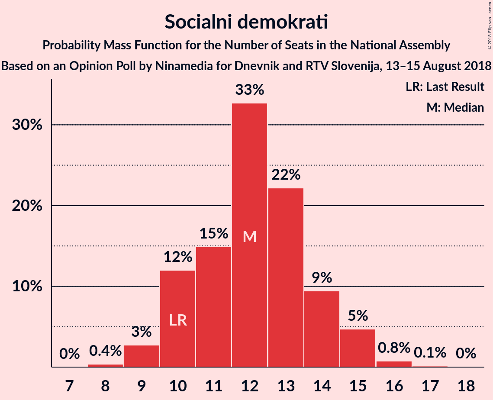

# Opinion Poll by Ninamedia for Dnevnik and RTV Slovenija, 13–15 August 2018

<a href="#voting-intentions">Voting Intentions</a> | <a href="#seats">Seats</a> | <a href="#coalitions">Coalitions</a> | <a href="#technical-information">Technical Information</a>

## Voting Intentions

### Confidence Intervals

| Party | Last Result | Poll Result | 80% Confidence Interval | 90% Confidence Interval | 95% Confidence Interval | 99% Confidence Interval |
|:-----:|:-----------:|:-----------:|:-----------------------:|:-----------------------:|:-----------------------:|:-----------------------:|
| Slovenska demokratska stranka | 24.9% | 29.9% | 27.5–32.5% |26.8–33.2% |26.2–33.8% |25.1–35.1% |
| Lista Marjana Šarca | 12.6% | 12.6% | 11.0–14.6% |10.5–15.1% |10.1–15.7% |9.4–16.6% |
| Socialni demokrati | 9.9% | 12.6% | 11.0–14.6% |10.5–15.1% |10.1–15.7% |9.4–16.6% |
| Levica | 9.3% | 8.5% | 7.2–10.2% |6.8–10.7% |6.5–11.2% |5.9–12.0% |
| Nova Slovenija–Krščanski demokrati | 7.2% | 6.0% | 4.9–7.5% |4.6–8.0% |4.4–8.3% |3.9–9.1% |
| Stranka modernega centra | 9.7% | 3.9% | 3.0–5.2% |2.8–5.5% |2.6–5.9% |2.2–6.5% |
| Demokratična stranka upokojencev Slovenije | 4.9% | 3.9% | 3.0–5.2% |2.8–5.5% |2.6–5.9% |2.2–6.5% |
| Slovenska nacionalna stranka | 4.2% | 2.8% | 2.1–4.0% |1.9–4.3% |1.8–4.6% |1.5–5.2% |
| Stranka Alenke Bratušek | 5.1% | 2.1% | 1.5–3.2% |1.4–3.4% |1.2–3.7% |1.0–4.3% |

*Note:* The poll result column reflects the actual value used in the calculations. Published results may vary slightly, and in addition be rounded to fewer digits.

## Seats

### Confidence Intervals

| Party | Last Result | Median | 80% Confidence Interval | 90% Confidence Interval | 95% Confidence Interval | 99% Confidence Interval |
|:-----:|:-----------:|:------:|:-----------------------:|:-----------------------:|:-----------------------:|:-----------------------:|
| <a href="#slovenska-demokratska-stranka">Slovenska demokratska stranka</a> | 25 | 29 | 26–32 |25–33 |25–33 |23–35 |
| <a href="#lista-marjana-šarca">Lista Marjana Šarca</a> | 13 | 12 | 10–14 |10–14 |10–15 |9–16 |
| <a href="#socialni-demokrati">Socialni demokrati</a> | 10 | 12 | 10–14 |10–14 |9–15 |9–16 |
| <a href="#levica">Levica</a> | 9 | 9 | 7–10 |6–10 |6–11 |5–12 |
| <a href="#nova-slovenija–krščanski-demokrati">Nova Slovenija–Krščanski demokrati</a> | 7 | 6 | 4–7 |4–7 |4–8 |0–8 |
| <a href="#stranka-modernega-centra">Stranka modernega centra</a> | 10 | 0 | 0–4 |0–5 |0–5 |0–6 |
| <a href="#demokratična-stranka-upokojencev-slovenije">Demokratična stranka upokojencev Slovenije</a> | 5 | 0 | 0–4 |0–5 |0–5 |0–6 |
| <a href="#slovenska-nacionalna-stranka">Slovenska nacionalna stranka</a> | 4 | 0 | 0–3 |0–4 |0–4 |0–5 |
| <a href="#stranka-alenke-bratušek">Stranka Alenke Bratušek</a> | 5 | 0 | 0 |0 |0 |0–4 |

### Slovenska demokratska stranka

*For a full overview of the results for this party, see the [Slovenska demokratska stranka](party-slovenskademokratskastranka.html) page.*

| Number of Seats | Probability | Accumulated | Special Marks |
|:---------------:|:-----------:|:-----------:|:-------------:|
| 23 | 0.6% | 100% |  |
| 24 | 1.0% | 99.3% |  |
| 25 | 4% | 98% | Last Result |
| 26 | 6% | 94% |  |
| 27 | 14% | 88% |  |
| 28 | 10% | 74% |  |
| 29 | 14% | 64% | Median |
| 30 | 19% | 50% |  |
| 31 | 19% | 31% |  |
| 32 | 7% | 12% |  |
| 33 | 4% | 5% |  |
| 34 | 1.1% | 2% |  |
| 35 | 0.4% | 0.7% |  |
| 36 | 0.3% | 0.3% |  |
| 37 | 0% | 0% |  |

### Lista Marjana Šarca

*For a full overview of the results for this party, see the [Lista Marjana Šarca](party-listamarjanašarca.html) page.*

| Number of Seats | Probability | Accumulated | Special Marks |
|:---------------:|:-----------:|:-----------:|:-------------:|
| 8 | 0.4% | 100% |  |
| 9 | 2% | 99.6% |  |
| 10 | 10% | 98% |  |
| 11 | 31% | 88% |  |
| 12 | 21% | 56% | Median |
| 13 | 17% | 36% | Last Result |
| 14 | 14% | 19% |  |
| 15 | 3% | 5% |  |
| 16 | 1.1% | 1.3% |  |
| 17 | 0.2% | 0.3% |  |
| 18 | 0.1% | 0.1% |  |
| 19 | 0% | 0% |  |

### Socialni demokrati

*For a full overview of the results for this party, see the [Socialni demokrati](party-socialnidemokrati.html) page.*

| Number of Seats | Probability | Accumulated | Special Marks |
|:---------------:|:-----------:|:-----------:|:-------------:|
| 8 | 0.3% | 100% |  |
| 9 | 4% | 99.7% |  |
| 10 | 10% | 95% | Last Result |
| 11 | 19% | 85% |  |
| 12 | 35% | 67% | Median |
| 13 | 20% | 32% |  |
| 14 | 8% | 12% |  |
| 15 | 4% | 5% |  |
| 16 | 0.5% | 0.7% |  |
| 17 | 0.1% | 0.2% |  |
| 18 | 0% | 0% |  |

### Levica

*For a full overview of the results for this party, see the [Levica](party-levica.html) page.*

| Number of Seats | Probability | Accumulated | Special Marks |
|:---------------:|:-----------:|:-----------:|:-------------:|
| 5 | 1.4% | 100% |  |
| 6 | 8% | 98.6% |  |
| 7 | 18% | 90% |  |
| 8 | 21% | 72% |  |
| 9 | 34% | 52% | Last Result, Median |
| 10 | 14% | 18% |  |
| 11 | 4% | 5% |  |
| 12 | 0.6% | 0.6% |  |
| 13 | 0% | 0% |  |

### Nova Slovenija–Krščanski demokrati

*For a full overview of the results for this party, see the [Nova Slovenija–Krščanski demokrati](party-novaslovenija–krščanskidemokrati.html) page.*

| Number of Seats | Probability | Accumulated | Special Marks |
|:---------------:|:-----------:|:-----------:|:-------------:|
| 0 | 0.6% | 100% |  |
| 1 | 0% | 99.4% |  |
| 2 | 0% | 99.4% |  |
| 3 | 0.2% | 99.4% |  |
| 4 | 11% | 99.1% |  |
| 5 | 27% | 88% |  |
| 6 | 27% | 61% | Median |
| 7 | 29% | 34% | Last Result |
| 8 | 4% | 5% |  |
| 9 | 0.4% | 0.4% |  |
| 10 | 0% | 0% |  |

### Stranka modernega centra

*For a full overview of the results for this party, see the [Stranka modernega centra](party-strankamodernegacentra.html) page.*

| Number of Seats | Probability | Accumulated | Special Marks |
|:---------------:|:-----------:|:-----------:|:-------------:|
| 0 | 67% | 100% | Median |
| 1 | 0% | 33% |  |
| 2 | 0% | 33% |  |
| 3 | 3% | 33% |  |
| 4 | 22% | 30% |  |
| 5 | 7% | 8% |  |
| 6 | 1.0% | 1.0% |  |
| 7 | 0% | 0% |  |
| 8 | 0% | 0% |  |
| 9 | 0% | 0% |  |
| 10 | 0% | 0% | Last Result |

### Demokratična stranka upokojencev Slovenije

*For a full overview of the results for this party, see the [Demokratična stranka upokojencev Slovenije](party-demokratičnastrankaupokojencevslovenije.html) page.*

| Number of Seats | Probability | Accumulated | Special Marks |
|:---------------:|:-----------:|:-----------:|:-------------:|
| 0 | 59% | 100% | Median |
| 1 | 0% | 41% |  |
| 2 | 0% | 41% |  |
| 3 | 3% | 41% |  |
| 4 | 29% | 37% |  |
| 5 | 8% | 8% | Last Result |
| 6 | 0.7% | 0.7% |  |
| 7 | 0% | 0.1% |  |
| 8 | 0% | 0% |  |

### Slovenska nacionalna stranka

*For a full overview of the results for this party, see the [Slovenska nacionalna stranka](party-slovenskanacionalnastranka.html) page.*

| Number of Seats | Probability | Accumulated | Special Marks |
|:---------------:|:-----------:|:-----------:|:-------------:|
| 0 | 89% | 100% | Median |
| 1 | 0% | 11% |  |
| 2 | 0% | 11% |  |
| 3 | 2% | 11% |  |
| 4 | 9% | 10% | Last Result |
| 5 | 0.6% | 0.6% |  |
| 6 | 0% | 0% |  |

### Stranka Alenke Bratušek

*For a full overview of the results for this party, see the [Stranka Alenke Bratušek](party-strankaalenkebratušek.html) page.*

| Number of Seats | Probability | Accumulated | Special Marks |
|:---------------:|:-----------:|:-----------:|:-------------:|
| 0 | 99.0% | 100% | Median |
| 1 | 0% | 1.0% |  |
| 2 | 0% | 1.0% |  |
| 3 | 0.1% | 1.0% |  |
| 4 | 0.9% | 0.9% |  |
| 5 | 0% | 0% | Last Result |

## Coalitions

### Confidence Intervals

| Coalition | Last Result | Median | Majority? | 80% Confidence Interval | 90% Confidence Interval | 95% Confidence Interval | 99% Confidence Interval |
|:---------:|:-----------:|:------:|:---------:|:-----------------------:|:-----------------------:|:-----------------------:|:-----------------------:|
| Slovenska demokratska stranka – Lista Marjana Šarca – Demokratična stranka upokojencev Slovenije | 43 | 42 | 23% | 40–46 | 39–47 | 38–48 | 37–49 |
| Slovenska demokratska stranka – Lista Marjana Šarca | 38 | 42 | 10% | 38–46 | 37–46 | 36–47 | 35–48 |
| Lista Marjana Šarca – Socialni demokrati – Nova Slovenija–Krščanski demokrati – Demokratična stranka upokojencev Slovenije – Stranka modernega centra – Stranka Alenke Bratušek | 50 | 32 | 0% | 30–37 | 29–38 | 28–39 | 26–40 |
| Lista Marjana Šarca – Socialni demokrati – Nova Slovenija–Krščanski demokrati – Demokratična stranka upokojencev Slovenije – Stranka modernega centra | 45 | 32 | 0% | 30–37 | 29–38 | 28–39 | 26–40 |
| Lista Marjana Šarca – Socialni demokrati – Nova Slovenija–Krščanski demokrati – Demokratična stranka upokojencev Slovenije | 35 | 31 | 0% | 29–35 | 28–36 | 27–37 | 26–38 |
| Lista Marjana Šarca – Socialni demokrati – Nova Slovenija–Krščanski demokrati – Stranka modernega centra | 40 | 31 | 0% | 29–34 | 28–35 | 27–36 | 25–38 |
| Lista Marjana Šarca – Socialni demokrati – Nova Slovenija–Krščanski demokrati | 30 | 30 | 0% | 27–32 | 27–33 | 26–34 | 24–35 |
| Lista Marjana Šarca – Socialni demokrati – Demokratična stranka upokojencev Slovenije – Stranka modernega centra – Stranka Alenke Bratušek | 43 | 27 | 0% | 23–31 | 23–32 | 23–34 | 22–35 |
| Lista Marjana Šarca – Socialni demokrati – Demokratična stranka upokojencev Slovenije – Stranka modernega centra | 38 | 27 | 0% | 23–31 | 23–32 | 23–33 | 22–35 |
| Lista Marjana Šarca – Socialni demokrati – Demokratična stranka upokojencev Slovenije | 28 | 25 | 0% | 23–30 | 23–30 | 22–31 | 20–32 |
| Lista Marjana Šarca – Socialni demokrati – Stranka modernega centra | 33 | 25 | 0% | 23–29 | 23–30 | 22–31 | 21–32 |
| Lista Marjana Šarca – Socialni demokrati | 23 | 24 | 0% | 21–27 | 21–27 | 21–27 | 19–29 |
| Socialni demokrati – Demokratična stranka upokojencev Slovenije – Stranka modernega centra | 25 | 15 | 0% | 11–19 | 11–21 | 11–22 | 10–23 |

### Slovenska demokratska stranka – Lista Marjana Šarca – Demokratična stranka upokojencev Slovenije

| Number of Seats | Probability | Accumulated | Special Marks |
|:---------------:|:-----------:|:-----------:|:-------------:|
| 35 | 0.1% | 100% |  |
| 36 | 0.2% | 99.9% |  |
| 37 | 1.0% | 99.7% |  |
| 38 | 2% | 98.7% |  |
| 39 | 5% | 97% |  |
| 40 | 9% | 92% |  |
| 41 | 13% | 83% | Median |
| 42 | 24% | 70% |  |
| 43 | 9% | 46% | Last Result |
| 44 | 8% | 37% |  |
| 45 | 6% | 28% |  |
| 46 | 13% | 23% | Majority |
| 47 | 6% | 10% |  |
| 48 | 3% | 4% |  |
| 49 | 0.9% | 1.3% |  |
| 50 | 0.2% | 0.4% |  |
| 51 | 0.3% | 0.3% |  |
| 52 | 0% | 0% |  |

### Slovenska demokratska stranka – Lista Marjana Šarca

| Number of Seats | Probability | Accumulated | Special Marks |
|:---------------:|:-----------:|:-----------:|:-------------:|
| 34 | 0.1% | 100% |  |
| 35 | 0.9% | 99.8% |  |
| 36 | 3% | 99.0% |  |
| 37 | 6% | 96% |  |
| 38 | 10% | 90% | Last Result |
| 39 | 9% | 80% |  |
| 40 | 9% | 71% |  |
| 41 | 12% | 62% | Median |
| 42 | 23% | 50% |  |
| 43 | 8% | 27% |  |
| 44 | 5% | 18% |  |
| 45 | 3% | 13% |  |
| 46 | 7% | 10% | Majority |
| 47 | 0.9% | 3% |  |
| 48 | 2% | 2% |  |
| 49 | 0.3% | 0.4% |  |
| 50 | 0% | 0% |  |

### Lista Marjana Šarca – Socialni demokrati – Nova Slovenija–Krščanski demokrati – Demokratična stranka upokojencev Slovenije – Stranka modernega centra – Stranka Alenke Bratušek

| Number of Seats | Probability | Accumulated | Special Marks |
|:---------------:|:-----------:|:-----------:|:-------------:|
| 24 | 0.1% | 100% |  |
| 25 | 0.1% | 99.9% |  |
| 26 | 0.7% | 99.9% |  |
| 27 | 0.7% | 99.2% |  |
| 28 | 3% | 98% |  |
| 29 | 4% | 96% |  |
| 30 | 14% | 92% | Median |
| 31 | 14% | 78% |  |
| 32 | 15% | 64% |  |
| 33 | 6% | 49% |  |
| 34 | 10% | 44% |  |
| 35 | 15% | 34% |  |
| 36 | 5% | 19% |  |
| 37 | 7% | 13% |  |
| 38 | 3% | 6% |  |
| 39 | 3% | 4% |  |
| 40 | 0.8% | 1.1% |  |
| 41 | 0.2% | 0.3% |  |
| 42 | 0% | 0.1% |  |
| 43 | 0% | 0% |  |
| 44 | 0% | 0% |  |
| 45 | 0% | 0% |  |
| 46 | 0% | 0% | Majority |
| 47 | 0% | 0% |  |
| 48 | 0% | 0% |  |
| 49 | 0% | 0% |  |
| 50 | 0% | 0% | Last Result |

### Lista Marjana Šarca – Socialni demokrati – Nova Slovenija–Krščanski demokrati – Demokratična stranka upokojencev Slovenije – Stranka modernega centra

| Number of Seats | Probability | Accumulated | Special Marks |
|:---------------:|:-----------:|:-----------:|:-------------:|
| 24 | 0.1% | 100% |  |
| 25 | 0.1% | 99.9% |  |
| 26 | 0.7% | 99.9% |  |
| 27 | 0.7% | 99.1% |  |
| 28 | 3% | 98% |  |
| 29 | 4% | 96% |  |
| 30 | 14% | 92% | Median |
| 31 | 14% | 78% |  |
| 32 | 15% | 64% |  |
| 33 | 6% | 49% |  |
| 34 | 10% | 43% |  |
| 35 | 15% | 33% |  |
| 36 | 5% | 18% |  |
| 37 | 6% | 13% |  |
| 38 | 3% | 6% |  |
| 39 | 3% | 4% |  |
| 40 | 0.8% | 1.0% |  |
| 41 | 0.2% | 0.2% |  |
| 42 | 0% | 0% |  |
| 43 | 0% | 0% |  |
| 44 | 0% | 0% |  |
| 45 | 0% | 0% | Last Result |

### Lista Marjana Šarca – Socialni demokrati – Nova Slovenija–Krščanski demokrati – Demokratična stranka upokojencev Slovenije

| Number of Seats | Probability | Accumulated | Special Marks |
|:---------------:|:-----------:|:-----------:|:-------------:|
| 24 | 0.2% | 100% |  |
| 25 | 0.2% | 99.8% |  |
| 26 | 1.2% | 99.6% |  |
| 27 | 2% | 98% |  |
| 28 | 5% | 97% |  |
| 29 | 7% | 92% |  |
| 30 | 18% | 85% | Median |
| 31 | 22% | 67% |  |
| 32 | 17% | 45% |  |
| 33 | 7% | 27% |  |
| 34 | 6% | 20% |  |
| 35 | 9% | 14% | Last Result |
| 36 | 2% | 5% |  |
| 37 | 2% | 3% |  |
| 38 | 0.5% | 0.9% |  |
| 39 | 0.3% | 0.4% |  |
| 40 | 0.1% | 0.1% |  |
| 41 | 0% | 0% |  |

### Lista Marjana Šarca – Socialni demokrati – Nova Slovenija–Krščanski demokrati – Stranka modernega centra

| Number of Seats | Probability | Accumulated | Special Marks |
|:---------------:|:-----------:|:-----------:|:-------------:|
| 24 | 0.2% | 100% |  |
| 25 | 0.3% | 99.8% |  |
| 26 | 1.3% | 99.5% |  |
| 27 | 2% | 98% |  |
| 28 | 5% | 96% |  |
| 29 | 8% | 90% |  |
| 30 | 17% | 83% | Median |
| 31 | 27% | 66% |  |
| 32 | 17% | 39% |  |
| 33 | 6% | 23% |  |
| 34 | 9% | 17% |  |
| 35 | 4% | 8% |  |
| 36 | 1.3% | 3% |  |
| 37 | 2% | 2% |  |
| 38 | 0.5% | 0.6% |  |
| 39 | 0.1% | 0.1% |  |
| 40 | 0% | 0% | Last Result |

### Lista Marjana Šarca – Socialni demokrati – Nova Slovenija–Krščanski demokrati

| Number of Seats | Probability | Accumulated | Special Marks |
|:---------------:|:-----------:|:-----------:|:-------------:|
| 22 | 0.1% | 100% |  |
| 23 | 0.1% | 99.9% |  |
| 24 | 0.8% | 99.9% |  |
| 25 | 2% | 99.1% |  |
| 26 | 2% | 98% |  |
| 27 | 12% | 95% |  |
| 28 | 9% | 83% |  |
| 29 | 12% | 74% |  |
| 30 | 20% | 62% | Last Result, Median |
| 31 | 21% | 42% |  |
| 32 | 14% | 21% |  |
| 33 | 4% | 7% |  |
| 34 | 2% | 3% |  |
| 35 | 0.5% | 0.7% |  |
| 36 | 0.2% | 0.2% |  |
| 37 | 0% | 0% |  |

### Lista Marjana Šarca – Socialni demokrati – Demokratična stranka upokojencev Slovenije – Stranka modernega centra – Stranka Alenke Bratušek

| Number of Seats | Probability | Accumulated | Special Marks |
|:---------------:|:-----------:|:-----------:|:-------------:|
| 20 | 0.1% | 100% |  |
| 21 | 0.3% | 99.9% |  |
| 22 | 1.4% | 99.6% |  |
| 23 | 18% | 98% |  |
| 24 | 3% | 80% | Median |
| 25 | 16% | 77% |  |
| 26 | 5% | 61% |  |
| 27 | 13% | 56% |  |
| 28 | 6% | 43% |  |
| 29 | 9% | 37% |  |
| 30 | 14% | 28% |  |
| 31 | 6% | 15% |  |
| 32 | 4% | 9% |  |
| 33 | 2% | 4% |  |
| 34 | 2% | 3% |  |
| 35 | 0.5% | 0.6% |  |
| 36 | 0.1% | 0.1% |  |
| 37 | 0% | 0.1% |  |
| 38 | 0% | 0% |  |
| 39 | 0% | 0% |  |
| 40 | 0% | 0% |  |
| 41 | 0% | 0% |  |
| 42 | 0% | 0% |  |
| 43 | 0% | 0% | Last Result |

### Lista Marjana Šarca – Socialni demokrati – Demokratična stranka upokojencev Slovenije – Stranka modernega centra

| Number of Seats | Probability | Accumulated | Special Marks |
|:---------------:|:-----------:|:-----------:|:-------------:|
| 20 | 0.1% | 100% |  |
| 21 | 0.3% | 99.9% |  |
| 22 | 1.4% | 99.6% |  |
| 23 | 18% | 98% |  |
| 24 | 3% | 80% | Median |
| 25 | 16% | 77% |  |
| 26 | 5% | 61% |  |
| 27 | 13% | 56% |  |
| 28 | 6% | 43% |  |
| 29 | 9% | 37% |  |
| 30 | 14% | 28% |  |
| 31 | 6% | 14% |  |
| 32 | 4% | 8% |  |
| 33 | 2% | 4% |  |
| 34 | 2% | 2% |  |
| 35 | 0.4% | 0.5% |  |
| 36 | 0.1% | 0.1% |  |
| 37 | 0% | 0% |  |
| 38 | 0% | 0% | Last Result |

### Lista Marjana Šarca – Socialni demokrati – Demokratična stranka upokojencev Slovenije

| Number of Seats | Probability | Accumulated | Special Marks |
|:---------------:|:-----------:|:-----------:|:-------------:|
| 18 | 0.1% | 100% |  |
| 19 | 0.1% | 99.9% |  |
| 20 | 0.4% | 99.9% |  |
| 21 | 0.7% | 99.5% |  |
| 22 | 3% | 98.8% |  |
| 23 | 24% | 96% |  |
| 24 | 5% | 72% | Median |
| 25 | 23% | 67% |  |
| 26 | 9% | 44% |  |
| 27 | 13% | 35% |  |
| 28 | 5% | 22% | Last Result |
| 29 | 4% | 17% |  |
| 30 | 9% | 12% |  |
| 31 | 3% | 4% |  |
| 32 | 0.6% | 0.9% |  |
| 33 | 0.2% | 0.3% |  |
| 34 | 0.1% | 0.1% |  |
| 35 | 0% | 0% |  |

### Lista Marjana Šarca – Socialni demokrati – Stranka modernega centra

| Number of Seats | Probability | Accumulated | Special Marks |
|:---------------:|:-----------:|:-----------:|:-------------:|
| 20 | 0.4% | 100% |  |
| 21 | 1.2% | 99.6% |  |
| 22 | 2% | 98% |  |
| 23 | 22% | 96% |  |
| 24 | 6% | 74% | Median |
| 25 | 25% | 68% |  |
| 26 | 16% | 43% |  |
| 27 | 13% | 27% |  |
| 28 | 4% | 14% |  |
| 29 | 5% | 10% |  |
| 30 | 2% | 5% |  |
| 31 | 2% | 3% |  |
| 32 | 0.8% | 1.1% |  |
| 33 | 0.3% | 0.3% | Last Result |
| 34 | 0% | 0.1% |  |
| 35 | 0% | 0% |  |

### Lista Marjana Šarca – Socialni demokrati

| Number of Seats | Probability | Accumulated | Special Marks |
|:---------------:|:-----------:|:-----------:|:-------------:|
| 18 | 0.1% | 100% |  |
| 19 | 0.5% | 99.8% |  |
| 20 | 2% | 99.3% |  |
| 21 | 9% | 98% |  |
| 22 | 8% | 89% |  |
| 23 | 29% | 81% | Last Result |
| 24 | 9% | 52% | Median |
| 25 | 21% | 44% |  |
| 26 | 12% | 23% |  |
| 27 | 9% | 11% |  |
| 28 | 2% | 2% |  |
| 29 | 0.4% | 0.6% |  |
| 30 | 0.2% | 0.2% |  |
| 31 | 0% | 0% |  |

### Socialni demokrati – Demokratična stranka upokojencev Slovenije – Stranka modernega centra

| Number of Seats | Probability | Accumulated | Special Marks |
|:---------------:|:-----------:|:-----------:|:-------------:|
| 9 | 0.2% | 100% |  |
| 10 | 0.6% | 99.8% |  |
| 11 | 14% | 99.2% |  |
| 12 | 22% | 86% | Median |
| 13 | 8% | 64% |  |
| 14 | 3% | 56% |  |
| 15 | 4% | 53% |  |
| 16 | 9% | 48% |  |
| 17 | 14% | 39% |  |
| 18 | 12% | 25% |  |
| 19 | 4% | 13% |  |
| 20 | 3% | 9% |  |
| 21 | 2% | 6% |  |
| 22 | 3% | 4% |  |
| 23 | 1.1% | 1.2% |  |
| 24 | 0.1% | 0.1% |  |
| 25 | 0% | 0% | Last Result |

## Technical Information

### Opinion Poll

+ **Polling firm:** Ninamedia
+ **Commissioner(s):** Dnevnik and RTV Slovenija
+ **Fieldwork period:** 13–15 August 2018

### Calculations

+ **Sample size:** 562
+ **Simulations done:** 524,288
+ **Error estimate:** 3.25%

