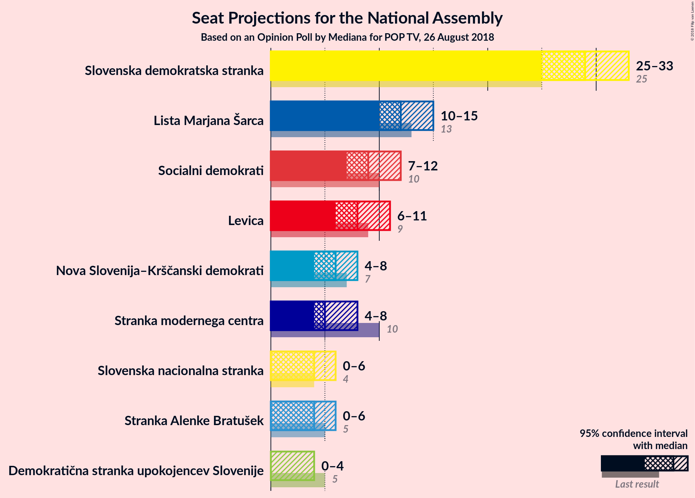
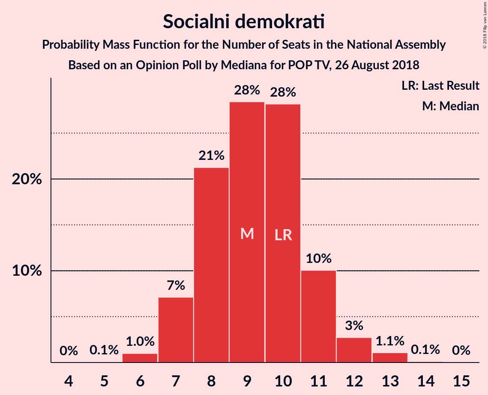

# Opinion Poll by Mediana for POP TV, 26 August 2018

<a href="#voting-intentions">Voting Intentions</a> | <a href="#seats">Seats</a> | <a href="#coalitions">Coalitions</a> | <a href="#technical-information">Technical Information</a>

## Voting Intentions

### Confidence Intervals

| Party | Last Result | Poll Result | 80% Confidence Interval | 90% Confidence Interval | 95% Confidence Interval | 99% Confidence Interval |
|:-----:|:-----------:|:-----------:|:-----------------------:|:-----------------------:|:-----------------------:|:-----------------------:|
| Slovenska demokratska stranka | 24.9% | 30.9% | 28.3–33.7% |27.6–34.4% |27.0–35.1% |25.8–36.5% |
| Lista Marjana Šarca | 12.6% | 13.3% | 11.5–15.5% |11.1–16.1% |10.6–16.6% |9.8–17.7% |
| Socialni demokrati | 9.9% | 10.1% | 8.6–12.0% |8.1–12.6% |7.7–13.1% |7.1–14.1% |
| Levica | 9.3% | 9.5% | 8.0–11.4% |7.6–11.9% |7.2–12.4% |6.6–13.4% |
| Nova Slovenija–Krščanski demokrati | 7.2% | 6.5% | 5.2–8.1% |4.9–8.6% |4.6–9.0% |4.1–9.8% |
| Stranka modernega centra | 9.7% | 6.3% | 5.1–7.9% |4.7–8.4% |4.5–8.8% |3.9–9.6% |
| Stranka Alenke Bratušek | 5.1% | 4.6% | 3.6–6.1% |3.4–6.5% |3.1–6.9% |2.7–7.7% |
| Slovenska nacionalna stranka | 4.2% | 4.6% | 3.6–6.1% |3.4–6.5% |3.1–6.9% |2.7–7.7% |
| Demokratična stranka upokojencev Slovenije | 4.9% | 2.8% | 2.1–4.0% |1.9–4.4% |1.7–4.7% |1.4–5.3% |

*Note:* The poll result column reflects the actual value used in the calculations. Published results may vary slightly, and in addition be rounded to fewer digits.

## Seats

### Confidence Intervals

| Party | Last Result | Median | 80% Confidence Interval | 90% Confidence Interval | 95% Confidence Interval | 99% Confidence Interval |
|:-----:|:-----------:|:------:|:-----------------------:|:-----------------------:|:-----------------------:|:-----------------------:|
| <a href="#slovenska-demokratska-stranka">Slovenska demokratska stranka</a> | 25 | 28 | 25–31 |24–32 |24–33 |23–33 |
| <a href="#lista-marjana-šarca">Lista Marjana Šarca</a> | 13 | 12 | 11–14 |10–16 |10–16 |9–16 |
| <a href="#socialni-demokrati">Socialni demokrati</a> | 10 | 10 | 8–12 |7–12 |7–13 |6–13 |
| <a href="#levica">Levica</a> | 9 | 9 | 7–10 |7–11 |6–12 |6–13 |
| <a href="#nova-slovenija–krščanski-demokrati">Nova Slovenija–Krščanski demokrati</a> | 7 | 5 | 4–7 |4–8 |4–8 |3–9 |
| <a href="#stranka-modernega-centra">Stranka modernega centra</a> | 10 | 6 | 4–8 |4–8 |4–8 |0–9 |
| <a href="#stranka-alenke-bratušek">Stranka Alenke Bratušek</a> | 5 | 4 | 0–6 |0–6 |0–7 |0–7 |
| <a href="#slovenska-nacionalna-stranka">Slovenska nacionalna stranka</a> | 4 | 4 | 0–6 |0–6 |0–6 |0–7 |
| <a href="#demokratična-stranka-upokojencev-slovenije">Demokratična stranka upokojencev Slovenije</a> | 5 | 0 | 0 |0–4 |0–4 |0–4 |

### Slovenska demokratska stranka

*For a full overview of the results for this party, see the [Slovenska demokratska stranka](party-slovenskademokratskastranka.html) page.*

| Number of Seats | Probability | Accumulated | Special Marks |
|:---------------:|:-----------:|:-----------:|:-------------:|
| 22 | 0.2% | 100% |  |
| 23 | 0.4% | 99.8% |  |
| 24 | 4% | 99.4% |  |
| 25 | 7% | 95% | Last Result |
| 26 | 7% | 88% |  |
| 27 | 18% | 80% |  |
| 28 | 19% | 63% | Median |
| 29 | 14% | 44% |  |
| 30 | 7% | 30% |  |
| 31 | 15% | 22% |  |
| 32 | 5% | 8% |  |
| 33 | 2% | 3% |  |
| 34 | 0.1% | 0.4% |  |
| 35 | 0.1% | 0.3% |  |
| 36 | 0.1% | 0.1% |  |
| 37 | 0% | 0% |  |

### Lista Marjana Šarca

*For a full overview of the results for this party, see the [Lista Marjana Šarca](party-listamarjanašarca.html) page.*

| Number of Seats | Probability | Accumulated | Special Marks |
|:---------------:|:-----------:|:-----------:|:-------------:|
| 8 | 0.2% | 100% |  |
| 9 | 2% | 99.8% |  |
| 10 | 7% | 98% |  |
| 11 | 24% | 91% |  |
| 12 | 22% | 67% | Median |
| 13 | 20% | 45% | Last Result |
| 14 | 16% | 25% |  |
| 15 | 4% | 9% |  |
| 16 | 5% | 5% |  |
| 17 | 0.2% | 0.2% |  |
| 18 | 0% | 0% |  |

### Socialni demokrati

*For a full overview of the results for this party, see the [Socialni demokrati](party-socialnidemokrati.html) page.*

| Number of Seats | Probability | Accumulated | Special Marks |
|:---------------:|:-----------:|:-----------:|:-------------:|
| 5 | 0.1% | 100% |  |
| 6 | 1.4% | 99.9% |  |
| 7 | 7% | 98% |  |
| 8 | 14% | 92% |  |
| 9 | 22% | 78% |  |
| 10 | 25% | 56% | Last Result, Median |
| 11 | 21% | 31% |  |
| 12 | 6% | 10% |  |
| 13 | 4% | 5% |  |
| 14 | 0.2% | 0.2% |  |
| 15 | 0% | 0% |  |

### Levica

*For a full overview of the results for this party, see the [Levica](party-levica.html) page.*

| Number of Seats | Probability | Accumulated | Special Marks |
|:---------------:|:-----------:|:-----------:|:-------------:|
| 5 | 0% | 100% |  |
| 6 | 3% | 99.9% |  |
| 7 | 15% | 97% |  |
| 8 | 9% | 82% |  |
| 9 | 27% | 73% | Last Result, Median |
| 10 | 41% | 46% |  |
| 11 | 1.4% | 5% |  |
| 12 | 3% | 4% |  |
| 13 | 0.6% | 0.6% |  |
| 14 | 0% | 0% |  |

### Nova Slovenija–Krščanski demokrati

*For a full overview of the results for this party, see the [Nova Slovenija–Krščanski demokrati](party-novaslovenija–krščanskidemokrati.html) page.*

| Number of Seats | Probability | Accumulated | Special Marks |
|:---------------:|:-----------:|:-----------:|:-------------:|
| 0 | 0.4% | 100% |  |
| 1 | 0% | 99.6% |  |
| 2 | 0% | 99.6% |  |
| 3 | 0.2% | 99.6% |  |
| 4 | 11% | 99.4% |  |
| 5 | 43% | 89% | Median |
| 6 | 28% | 45% |  |
| 7 | 10% | 17% | Last Result |
| 8 | 5% | 7% |  |
| 9 | 2% | 2% |  |
| 10 | 0.1% | 0.1% |  |
| 11 | 0% | 0% |  |

### Stranka modernega centra

*For a full overview of the results for this party, see the [Stranka modernega centra](party-strankamodernegacentra.html) page.*

| Number of Seats | Probability | Accumulated | Special Marks |
|:---------------:|:-----------:|:-----------:|:-------------:|
| 0 | 0.5% | 100% |  |
| 1 | 0% | 99.5% |  |
| 2 | 0% | 99.5% |  |
| 3 | 1.0% | 99.5% |  |
| 4 | 20% | 98.5% |  |
| 5 | 23% | 78% |  |
| 6 | 35% | 55% | Median |
| 7 | 9% | 20% |  |
| 8 | 9% | 11% |  |
| 9 | 2% | 2% |  |
| 10 | 0% | 0% | Last Result |

### Stranka Alenke Bratušek

*For a full overview of the results for this party, see the [Stranka Alenke Bratušek](party-strankaalenkebratušek.html) page.*

| Number of Seats | Probability | Accumulated | Special Marks |
|:---------------:|:-----------:|:-----------:|:-------------:|
| 0 | 31% | 100% |  |
| 1 | 0% | 69% |  |
| 2 | 0% | 69% |  |
| 3 | 15% | 69% |  |
| 4 | 26% | 54% | Median |
| 5 | 16% | 27% | Last Result |
| 6 | 8% | 12% |  |
| 7 | 4% | 4% |  |
| 8 | 0% | 0% |  |

### Slovenska nacionalna stranka

*For a full overview of the results for this party, see the [Slovenska nacionalna stranka](party-slovenskanacionalnastranka.html) page.*

| Number of Seats | Probability | Accumulated | Special Marks |
|:---------------:|:-----------:|:-----------:|:-------------:|
| 0 | 25% | 100% |  |
| 1 | 0% | 75% |  |
| 2 | 0% | 75% |  |
| 3 | 5% | 75% |  |
| 4 | 32% | 71% | Last Result, Median |
| 5 | 27% | 39% |  |
| 6 | 11% | 12% |  |
| 7 | 0.4% | 0.5% |  |
| 8 | 0.1% | 0.1% |  |
| 9 | 0% | 0% |  |

### Demokratična stranka upokojencev Slovenije

*For a full overview of the results for this party, see the [Demokratična stranka upokojencev Slovenije](party-demokratičnastrankaupokojencevslovenije.html) page.*

| Number of Seats | Probability | Accumulated | Special Marks |
|:---------------:|:-----------:|:-----------:|:-------------:|
| 0 | 92% | 100% | Median |
| 1 | 0% | 8% |  |
| 2 | 0% | 8% |  |
| 3 | 3% | 8% |  |
| 4 | 5% | 5% |  |
| 5 | 0.4% | 0.4% | Last Result |
| 6 | 0% | 0% |  |

## Coalitions

### Confidence Intervals

| Coalition | Last Result | Median | Majority? | 80% Confidence Interval | 90% Confidence Interval | 95% Confidence Interval | 99% Confidence Interval |
|:---------:|:-----------:|:------:|:---------:|:-----------------------:|:-----------------------:|:-----------------------:|:-----------------------:|
| Slovenska demokratska stranka – Lista Marjana Šarca – Demokratična stranka upokojencev Slovenije | 43 | 41 | 4% | 37–45 | 37–45 | 36–46 | 35–48 |
| Slovenska demokratska stranka – Lista Marjana Šarca | 38 | 40 | 2% | 37–45 | 37–45 | 36–45 | 35–48 |
| Lista Marjana Šarca – Socialni demokrati – Nova Slovenija–Krščanski demokrati – Stranka modernega centra – Stranka Alenke Bratušek – Demokratična stranka upokojencev Slovenije | 50 | 37 | 0% | 33–40 | 33–41 | 32–41 | 30–43 |
| Lista Marjana Šarca – Socialni demokrati – Nova Slovenija–Krščanski demokrati – Stranka modernega centra – Demokratična stranka upokojencev Slovenije | 45 | 34 | 0% | 30–37 | 30–38 | 29–39 | 28–40 |
| Lista Marjana Šarca – Socialni demokrati – Nova Slovenija–Krščanski demokrati – Stranka modernega centra | 40 | 34 | 0% | 30–36 | 30–37 | 29–38 | 27–38 |
| Lista Marjana Šarca – Socialni demokrati – Stranka modernega centra – Stranka Alenke Bratušek – Demokratična stranka upokojencev Slovenije | 43 | 32 | 0% | 28–34 | 27–35 | 26–35 | 25–37 |
| Lista Marjana Šarca – Socialni demokrati – Nova Slovenija–Krščanski demokrati – Demokratična stranka upokojencev Slovenije | 35 | 28 | 0% | 26–31 | 25–32 | 24–33 | 23–34 |
| Lista Marjana Šarca – Socialni demokrati – Stranka modernega centra – Demokratična stranka upokojencev Slovenije | 38 | 28 | 0% | 25–31 | 25–32 | 24–32 | 22–34 |
| Lista Marjana Šarca – Socialni demokrati – Stranka modernega centra | 33 | 28 | 0% | 25–31 | 24–31 | 24–32 | 22–32 |
| Lista Marjana Šarca – Socialni demokrati – Nova Slovenija–Krščanski demokrati | 30 | 28 | 0% | 25–31 | 24–31 | 23–32 | 22–33 |
| Lista Marjana Šarca – Socialni demokrati – Demokratična stranka upokojencev Slovenije | 28 | 22 | 0% | 20–25 | 19–26 | 19–27 | 17–28 |
| Lista Marjana Šarca – Socialni demokrati | 23 | 22 | 0% | 20–24 | 19–26 | 18–26 | 17–27 |
| Socialni demokrati – Stranka modernega centra – Demokratična stranka upokojencev Slovenije | 25 | 16 | 0% | 13–18 | 13–19 | 12–20 | 11–21 |

### Slovenska demokratska stranka – Lista Marjana Šarca – Demokratična stranka upokojencev Slovenije

| Number of Seats | Probability | Accumulated | Special Marks |
|:---------------:|:-----------:|:-----------:|:-------------:|
| 34 | 0.2% | 100% |  |
| 35 | 0.8% | 99.7% |  |
| 36 | 4% | 99.0% |  |
| 37 | 6% | 95% |  |
| 38 | 6% | 90% |  |
| 39 | 16% | 84% |  |
| 40 | 15% | 68% | Median |
| 41 | 10% | 53% |  |
| 42 | 11% | 43% |  |
| 43 | 13% | 32% | Last Result |
| 44 | 5% | 18% |  |
| 45 | 9% | 13% |  |
| 46 | 2% | 4% | Majority |
| 47 | 1.0% | 2% |  |
| 48 | 1.0% | 1.2% |  |
| 49 | 0.2% | 0.2% |  |
| 50 | 0% | 0.1% |  |
| 51 | 0% | 0% |  |

### Slovenska demokratska stranka – Lista Marjana Šarca

| Number of Seats | Probability | Accumulated | Special Marks |
|:---------------:|:-----------:|:-----------:|:-------------:|
| 34 | 0.3% | 100% |  |
| 35 | 0.9% | 99.7% |  |
| 36 | 4% | 98.8% |  |
| 37 | 6% | 95% |  |
| 38 | 7% | 89% | Last Result |
| 39 | 18% | 82% |  |
| 40 | 15% | 64% | Median |
| 41 | 11% | 48% |  |
| 42 | 10% | 38% |  |
| 43 | 13% | 28% |  |
| 44 | 5% | 15% |  |
| 45 | 8% | 10% |  |
| 46 | 0.9% | 2% | Majority |
| 47 | 0.3% | 1.2% |  |
| 48 | 0.8% | 0.9% |  |
| 49 | 0.1% | 0.2% |  |
| 50 | 0% | 0% |  |

### Lista Marjana Šarca – Socialni demokrati – Nova Slovenija–Krščanski demokrati – Stranka modernega centra – Stranka Alenke Bratušek – Demokratična stranka upokojencev Slovenije

| Number of Seats | Probability | Accumulated | Special Marks |
|:---------------:|:-----------:|:-----------:|:-------------:|
| 29 | 0.1% | 100% |  |
| 30 | 0.4% | 99.8% |  |
| 31 | 2% | 99.4% |  |
| 32 | 2% | 98% |  |
| 33 | 6% | 96% |  |
| 34 | 16% | 90% |  |
| 35 | 13% | 74% |  |
| 36 | 5% | 61% |  |
| 37 | 20% | 56% | Median |
| 38 | 10% | 36% |  |
| 39 | 8% | 26% |  |
| 40 | 10% | 18% |  |
| 41 | 6% | 8% |  |
| 42 | 1.1% | 2% |  |
| 43 | 1.0% | 1.2% |  |
| 44 | 0.1% | 0.2% |  |
| 45 | 0% | 0% |  |
| 46 | 0% | 0% | Majority |
| 47 | 0% | 0% |  |
| 48 | 0% | 0% |  |
| 49 | 0% | 0% |  |
| 50 | 0% | 0% | Last Result |

### Lista Marjana Šarca – Socialni demokrati – Nova Slovenija–Krščanski demokrati – Stranka modernega centra – Demokratična stranka upokojencev Slovenije

| Number of Seats | Probability | Accumulated | Special Marks |
|:---------------:|:-----------:|:-----------:|:-------------:|
| 26 | 0.1% | 100% |  |
| 27 | 0.2% | 99.8% |  |
| 28 | 0.8% | 99.6% |  |
| 29 | 2% | 98.8% |  |
| 30 | 10% | 97% |  |
| 31 | 6% | 87% |  |
| 32 | 14% | 81% |  |
| 33 | 11% | 67% | Median |
| 34 | 24% | 56% |  |
| 35 | 11% | 32% |  |
| 36 | 9% | 21% |  |
| 37 | 5% | 11% |  |
| 38 | 3% | 6% |  |
| 39 | 2% | 3% |  |
| 40 | 1.2% | 1.4% |  |
| 41 | 0.1% | 0.2% |  |
| 42 | 0.1% | 0.1% |  |
| 43 | 0% | 0% |  |
| 44 | 0% | 0% |  |
| 45 | 0% | 0% | Last Result |

### Lista Marjana Šarca – Socialni demokrati – Nova Slovenija–Krščanski demokrati – Stranka modernega centra

| Number of Seats | Probability | Accumulated | Special Marks |
|:---------------:|:-----------:|:-----------:|:-------------:|
| 25 | 0% | 100% |  |
| 26 | 0.2% | 99.9% |  |
| 27 | 0.6% | 99.8% |  |
| 28 | 0.9% | 99.2% |  |
| 29 | 2% | 98% |  |
| 30 | 10% | 97% |  |
| 31 | 8% | 87% |  |
| 32 | 15% | 79% |  |
| 33 | 12% | 64% | Median |
| 34 | 23% | 52% |  |
| 35 | 12% | 29% |  |
| 36 | 9% | 17% |  |
| 37 | 5% | 8% |  |
| 38 | 3% | 3% |  |
| 39 | 0.2% | 0.3% |  |
| 40 | 0.1% | 0.1% | Last Result |
| 41 | 0% | 0% |  |

### Lista Marjana Šarca – Socialni demokrati – Stranka modernega centra – Stranka Alenke Bratušek – Demokratična stranka upokojencev Slovenije

| Number of Seats | Probability | Accumulated | Special Marks |
|:---------------:|:-----------:|:-----------:|:-------------:|
| 23 | 0.2% | 100% |  |
| 24 | 0.2% | 99.8% |  |
| 25 | 0.9% | 99.6% |  |
| 26 | 2% | 98.7% |  |
| 27 | 6% | 97% |  |
| 28 | 7% | 91% |  |
| 29 | 14% | 84% |  |
| 30 | 12% | 70% |  |
| 31 | 7% | 58% |  |
| 32 | 23% | 51% | Median |
| 33 | 8% | 27% |  |
| 34 | 10% | 20% |  |
| 35 | 7% | 10% |  |
| 36 | 1.0% | 2% |  |
| 37 | 0.8% | 1.1% |  |
| 38 | 0.2% | 0.3% |  |
| 39 | 0% | 0.1% |  |
| 40 | 0% | 0% |  |
| 41 | 0% | 0% |  |
| 42 | 0% | 0% |  |
| 43 | 0% | 0% | Last Result |

### Lista Marjana Šarca – Socialni demokrati – Nova Slovenija–Krščanski demokrati – Demokratična stranka upokojencev Slovenije

| Number of Seats | Probability | Accumulated | Special Marks |
|:---------------:|:-----------:|:-----------:|:-------------:|
| 21 | 0.1% | 100% |  |
| 22 | 0.2% | 99.8% |  |
| 23 | 2% | 99.6% |  |
| 24 | 2% | 98% |  |
| 25 | 5% | 95% |  |
| 26 | 23% | 91% |  |
| 27 | 11% | 68% | Median |
| 28 | 14% | 57% |  |
| 29 | 24% | 43% |  |
| 30 | 4% | 19% |  |
| 31 | 6% | 14% |  |
| 32 | 4% | 8% |  |
| 33 | 3% | 4% |  |
| 34 | 1.4% | 2% |  |
| 35 | 0.1% | 0.3% | Last Result |
| 36 | 0.1% | 0.1% |  |
| 37 | 0% | 0% |  |

### Lista Marjana Šarca – Socialni demokrati – Stranka modernega centra – Demokratična stranka upokojencev Slovenije

| Number of Seats | Probability | Accumulated | Special Marks |
|:---------------:|:-----------:|:-----------:|:-------------:|
| 19 | 0.1% | 100% |  |
| 20 | 0.1% | 99.9% |  |
| 21 | 0.1% | 99.8% |  |
| 22 | 0.6% | 99.7% |  |
| 23 | 0.9% | 99.1% |  |
| 24 | 2% | 98% |  |
| 25 | 12% | 96% |  |
| 26 | 7% | 84% |  |
| 27 | 23% | 77% |  |
| 28 | 13% | 54% | Median |
| 29 | 12% | 41% |  |
| 30 | 11% | 29% |  |
| 31 | 11% | 17% |  |
| 32 | 5% | 7% |  |
| 33 | 0.5% | 2% |  |
| 34 | 1.2% | 1.4% |  |
| 35 | 0.1% | 0.2% |  |
| 36 | 0.1% | 0.1% |  |
| 37 | 0% | 0% |  |
| 38 | 0% | 0% | Last Result |

### Lista Marjana Šarca – Socialni demokrati – Stranka modernega centra

| Number of Seats | Probability | Accumulated | Special Marks |
|:---------------:|:-----------:|:-----------:|:-------------:|
| 19 | 0.1% | 100% |  |
| 20 | 0.1% | 99.9% |  |
| 21 | 0.1% | 99.8% |  |
| 22 | 0.8% | 99.7% |  |
| 23 | 1.4% | 98.9% |  |
| 24 | 4% | 98% |  |
| 25 | 12% | 94% |  |
| 26 | 7% | 82% |  |
| 27 | 24% | 75% |  |
| 28 | 15% | 51% | Median |
| 29 | 12% | 36% |  |
| 30 | 11% | 24% |  |
| 31 | 10% | 13% |  |
| 32 | 3% | 4% |  |
| 33 | 0.2% | 0.3% | Last Result |
| 34 | 0.1% | 0.1% |  |
| 35 | 0% | 0% |  |

### Lista Marjana Šarca – Socialni demokrati – Nova Slovenija–Krščanski demokrati

| Number of Seats | Probability | Accumulated | Special Marks |
|:---------------:|:-----------:|:-----------:|:-------------:|
| 20 | 0.1% | 100% |  |
| 21 | 0.1% | 99.9% |  |
| 22 | 0.4% | 99.8% |  |
| 23 | 2% | 99.4% |  |
| 24 | 2% | 97% |  |
| 25 | 7% | 95% |  |
| 26 | 23% | 88% |  |
| 27 | 12% | 65% | Median |
| 28 | 14% | 54% |  |
| 29 | 24% | 39% |  |
| 30 | 4% | 15% | Last Result |
| 31 | 6% | 11% |  |
| 32 | 3% | 4% |  |
| 33 | 0.9% | 1.1% |  |
| 34 | 0.1% | 0.2% |  |
| 35 | 0.1% | 0.1% |  |
| 36 | 0% | 0% |  |

### Lista Marjana Šarca – Socialni demokrati – Demokratična stranka upokojencev Slovenije

| Number of Seats | Probability | Accumulated | Special Marks |
|:---------------:|:-----------:|:-----------:|:-------------:|
| 15 | 0.1% | 100% |  |
| 16 | 0.2% | 99.9% |  |
| 17 | 0.4% | 99.8% |  |
| 18 | 2% | 99.4% |  |
| 19 | 5% | 98% |  |
| 20 | 10% | 93% |  |
| 21 | 25% | 83% |  |
| 22 | 11% | 58% | Median |
| 23 | 13% | 47% |  |
| 24 | 20% | 34% |  |
| 25 | 4% | 14% |  |
| 26 | 6% | 10% |  |
| 27 | 3% | 4% |  |
| 28 | 1.0% | 1.3% | Last Result |
| 29 | 0.2% | 0.3% |  |
| 30 | 0% | 0.1% |  |
| 31 | 0% | 0% |  |

### Lista Marjana Šarca – Socialni demokrati

| Number of Seats | Probability | Accumulated | Special Marks |
|:---------------:|:-----------:|:-----------:|:-------------:|
| 15 | 0.1% | 100% |  |
| 16 | 0.2% | 99.9% |  |
| 17 | 0.5% | 99.7% |  |
| 18 | 3% | 99.2% |  |
| 19 | 6% | 97% |  |
| 20 | 11% | 91% |  |
| 21 | 25% | 80% |  |
| 22 | 13% | 55% | Median |
| 23 | 12% | 42% | Last Result |
| 24 | 20% | 30% |  |
| 25 | 4% | 10% |  |
| 26 | 4% | 6% |  |
| 27 | 2% | 2% |  |
| 28 | 0.1% | 0.1% |  |
| 29 | 0% | 0% |  |

### Socialni demokrati – Stranka modernega centra – Demokratična stranka upokojencev Slovenije

| Number of Seats | Probability | Accumulated | Special Marks |
|:---------------:|:-----------:|:-----------:|:-------------:|
| 7 | 0.1% | 100% |  |
| 8 | 0.1% | 99.9% |  |
| 9 | 0.1% | 99.8% |  |
| 10 | 0.2% | 99.7% |  |
| 11 | 2% | 99.6% |  |
| 12 | 3% | 98% |  |
| 13 | 12% | 95% |  |
| 14 | 13% | 83% |  |
| 15 | 15% | 70% |  |
| 16 | 19% | 54% | Median |
| 17 | 17% | 35% |  |
| 18 | 10% | 18% |  |
| 19 | 4% | 8% |  |
| 20 | 3% | 4% |  |
| 21 | 0.4% | 0.7% |  |
| 22 | 0.2% | 0.3% |  |
| 23 | 0% | 0.1% |  |
| 24 | 0.1% | 0.1% |  |
| 25 | 0% | 0% | Last Result |

## Technical Information

### Opinion Poll

+ **Polling firm:** Mediana
+ **Commissioner(s):** POP TV
+ **Fieldwork period:** 26 August 2018

### Calculations

+ **Sample size:** 495
+ **Simulations done:** 131,072
+ **Error estimate:** 3.25%

