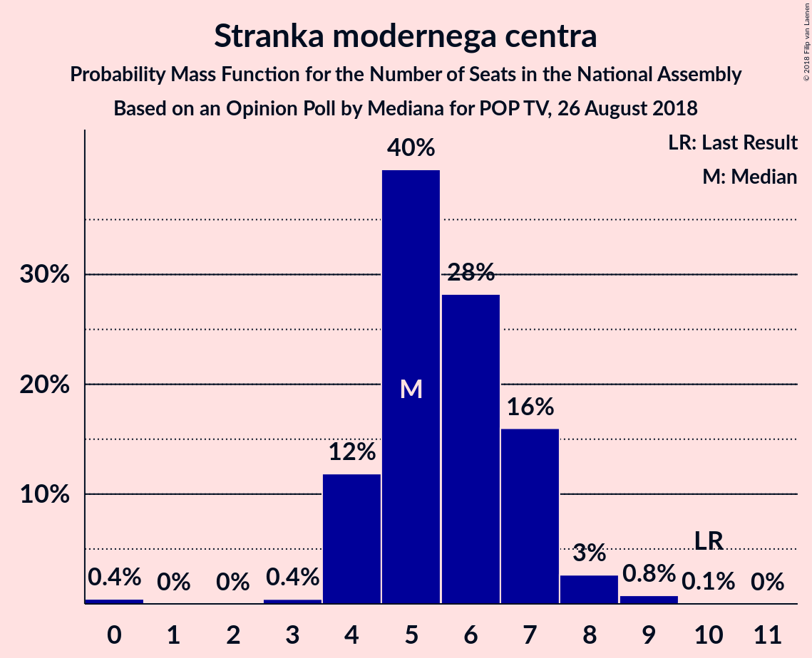
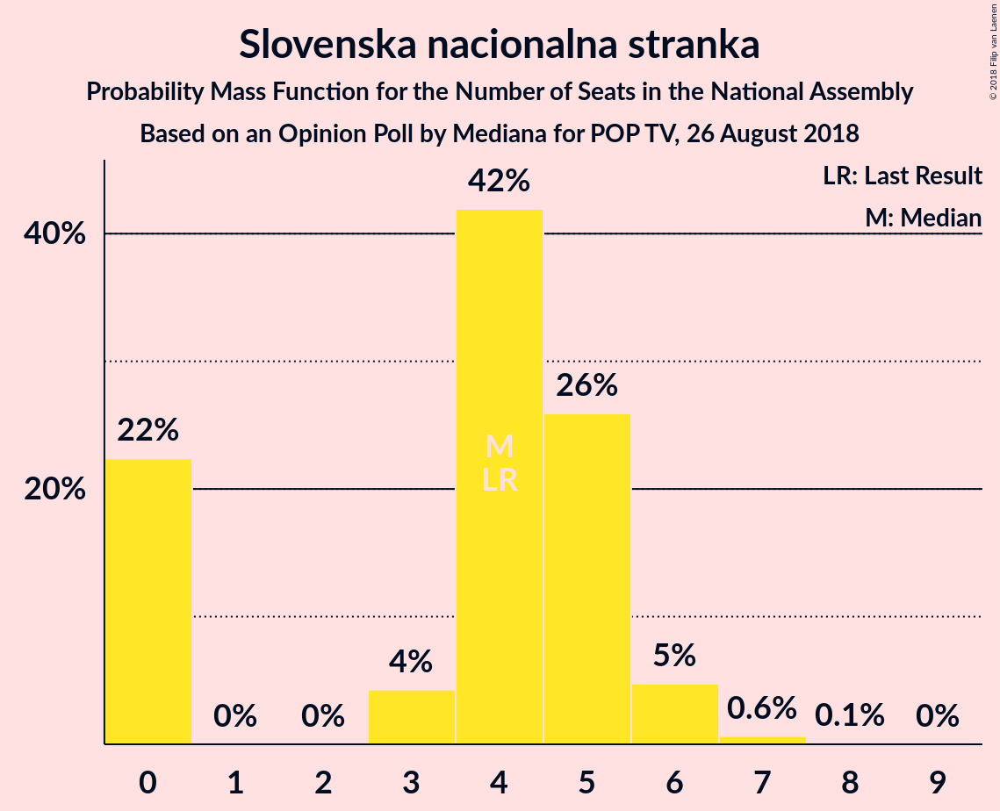

# Opinion Poll by Mediana for POP TV, 26 August 2018

<a href="#voting-intentions">Voting Intentions</a> | <a href="#seats">Seats</a> | <a href="#coalitions">Coalitions</a> | <a href="#technical-information">Technical Information</a>

## Voting Intentions

### Confidence Intervals

| Party | Last Result | Poll Result | 80% Confidence Interval | 90% Confidence Interval | 95% Confidence Interval | 99% Confidence Interval |
|:-----:|:-----------:|:-----------:|:-----------------------:|:-----------------------:|:-----------------------:|:-----------------------:|
| Slovenska demokratska stranka | 24.9% | 30.9% | 28.3–33.7% |27.6–34.4% |27.0–35.1% |25.8–36.5% |
| Lista Marjana Šarca | 12.6% | 13.3% | 11.5–15.5% |11.1–16.1% |10.6–16.6% |9.8–17.7% |
| Socialni demokrati | 9.9% | 10.1% | 8.6–12.0% |8.1–12.6% |7.7–13.1% |7.1–14.1% |
| Levica | 9.3% | 9.5% | 8.0–11.4% |7.6–11.9% |7.2–12.4% |6.6–13.4% |
| Nova Slovenija–Krščanski demokrati | 7.2% | 6.5% | 5.2–8.1% |4.9–8.6% |4.6–9.0% |4.1–9.8% |
| Stranka modernega centra | 9.7% | 6.3% | 5.1–7.9% |4.7–8.4% |4.5–8.8% |3.9–9.6% |
| Stranka Alenke Bratušek | 5.1% | 4.6% | 3.6–6.1% |3.4–6.5% |3.1–6.9% |2.7–7.7% |
| Slovenska nacionalna stranka | 4.2% | 4.6% | 3.6–6.1% |3.4–6.5% |3.1–6.9% |2.7–7.7% |
| Demokratična stranka upokojencev Slovenije | 4.9% | 2.8% | 2.1–4.0% |1.9–4.4% |1.7–4.7% |1.4–5.3% |

*Note:* The poll result column reflects the actual value used in the calculations. Published results may vary slightly, and in addition be rounded to fewer digits.

## Seats

### Confidence Intervals

| Party | Last Result | Median | 80% Confidence Interval | 90% Confidence Interval | 95% Confidence Interval | 99% Confidence Interval |
|:-----:|:-----------:|:------:|:-----------------------:|:-----------------------:|:-----------------------:|:-----------------------:|
| <a href="#slovenska-demokratska-stranka">Slovenska demokratska stranka</a> | 25 | 31 | 29–32 |29–32 |29–32 |28–32 |
| <a href="#lista-marjana-šarca">Lista Marjana Šarca</a> | 13 | 12 | 12–14 |12–14 |12–14 |10–14 |
| <a href="#socialni-demokrati">Socialni demokrati</a> | 10 | 10 | 10–11 |10–11 |10–11 |8–11 |
| <a href="#levica">Levica</a> | 9 | 7 | 7–8 |7–8 |7–8 |6–8 |
| <a href="#nova-slovenija–krščanski-demokrati">Nova Slovenija–Krščanski demokrati</a> | 7 | 6 | 6 |6 |6 |6 |
| <a href="#stranka-modernega-centra">Stranka modernega centra</a> | 10 | 5 | 5–6 |5–6 |5–6 |5–8 |
| <a href="#stranka-alenke-bratušek">Stranka Alenke Bratušek</a> | 5 | 0 | 0 |0 |0 |0–6 |
| <a href="#slovenska-nacionalna-stranka">Slovenska nacionalna stranka</a> | 4 | 5 | 0–5 |0–5 |0–5 |0–5 |
| <a href="#demokratična-stranka-upokojencev-slovenije">Demokratična stranka upokojencev Slovenije</a> | 5 | 0 | 0–3 |0–3 |0–3 |0–3 |

### Slovenska demokratska stranka

*For a full overview of the results for this party, see the [Slovenska demokratska stranka](party-slovenskademokratskastranka.html) page.*

| Number of Seats | Probability | Accumulated | Special Marks |
|:---------------:|:-----------:|:-----------:|:-------------:|
| 25 | 0% | 100% | Last Result |
| 26 | 0% | 100% |  |
| 27 | 0% | 100% |  |
| 28 | 0.5% | 100% |  |
| 29 | 16% | 99.4% |  |
| 30 | 0% | 84% |  |
| 31 | 57% | 84% | Median |
| 32 | 27% | 27% |  |
| 33 | 0% | 0% |  |

### Lista Marjana Šarca

*For a full overview of the results for this party, see the [Lista Marjana Šarca](party-listamarjanašarca.html) page.*

| Number of Seats | Probability | Accumulated | Special Marks |
|:---------------:|:-----------:|:-----------:|:-------------:|
| 10 | 0.7% | 100% |  |
| 11 | 0.6% | 99.3% |  |
| 12 | 84% | 98.7% | Median |
| 13 | 0.2% | 15% | Last Result |
| 14 | 15% | 15% |  |
| 15 | 0% | 0% |  |

### Socialni demokrati

*For a full overview of the results for this party, see the [Socialni demokrati](party-socialnidemokrati.html) page.*

| Number of Seats | Probability | Accumulated | Special Marks |
|:---------------:|:-----------:|:-----------:|:-------------:|
| 7 | 0.2% | 100% |  |
| 8 | 0.5% | 99.8% |  |
| 9 | 0% | 99.3% |  |
| 10 | 58% | 99.3% | Last Result, Median |
| 11 | 42% | 42% |  |
| 12 | 0% | 0% |  |

### Levica

*For a full overview of the results for this party, see the [Levica](party-levica.html) page.*

| Number of Seats | Probability | Accumulated | Special Marks |
|:---------------:|:-----------:|:-----------:|:-------------:|
| 6 | 0.7% | 100% |  |
| 7 | 58% | 99.3% | Median |
| 8 | 41% | 41% |  |
| 9 | 0.3% | 0.3% | Last Result |
| 10 | 0% | 0% |  |

### Nova Slovenija–Krščanski demokrati

*For a full overview of the results for this party, see the [Nova Slovenija–Krščanski demokrati](party-novaslovenija–krščanskidemokrati.html) page.*

| Number of Seats | Probability | Accumulated | Special Marks |
|:---------------:|:-----------:|:-----------:|:-------------:|
| 6 | 99.5% | 100% | Median |
| 7 | 0.5% | 0.5% | Last Result |
| 8 | 0% | 0% |  |

### Stranka modernega centra

*For a full overview of the results for this party, see the [Stranka modernega centra](party-strankamodernegacentra.html) page.*

| Number of Seats | Probability | Accumulated | Special Marks |
|:---------------:|:-----------:|:-----------:|:-------------:|
| 5 | 58% | 100% | Median |
| 6 | 41% | 42% |  |
| 7 | 0% | 0.7% |  |
| 8 | 0.7% | 0.7% |  |
| 9 | 0% | 0% |  |
| 10 | 0% | 0% | Last Result |

### Stranka Alenke Bratušek

*For a full overview of the results for this party, see the [Stranka Alenke Bratušek](party-strankaalenkebratušek.html) page.*

| Number of Seats | Probability | Accumulated | Special Marks |
|:---------------:|:-----------:|:-----------:|:-------------:|
| 0 | 99.3% | 100% | Median |
| 1 | 0% | 0.7% |  |
| 2 | 0% | 0.7% |  |
| 3 | 0.1% | 0.7% |  |
| 4 | 0% | 0.7% |  |
| 5 | 0% | 0.7% | Last Result |
| 6 | 0.7% | 0.7% |  |
| 7 | 0% | 0% |  |

### Slovenska nacionalna stranka

*For a full overview of the results for this party, see the [Slovenska nacionalna stranka](party-slovenskanacionalnastranka.html) page.*

| Number of Seats | Probability | Accumulated | Special Marks |
|:---------------:|:-----------:|:-----------:|:-------------:|
| 0 | 13% | 100% |  |
| 1 | 0% | 87% |  |
| 2 | 0% | 87% |  |
| 3 | 2% | 87% |  |
| 4 | 0.3% | 85% | Last Result |
| 5 | 85% | 85% | Median |
| 6 | 0% | 0% |  |

### Demokratična stranka upokojencev Slovenije

*For a full overview of the results for this party, see the [Demokratična stranka upokojencev Slovenije](party-demokratičnastrankaupokojencevslovenije.html) page.*

| Number of Seats | Probability | Accumulated | Special Marks |
|:---------------:|:-----------:|:-----------:|:-------------:|
| 0 | 85% | 100% | Median |
| 1 | 0% | 15% |  |
| 2 | 0% | 15% |  |
| 3 | 15% | 15% |  |
| 4 | 0% | 0% |  |
| 5 | 0% | 0% | Last Result |

## Coalitions

### Confidence Intervals

| Coalition | Last Result | Median | Majority? | 80% Confidence Interval | 90% Confidence Interval | 95% Confidence Interval | 99% Confidence Interval |
|:---------:|:-----------:|:------:|:---------:|:-----------------------:|:-----------------------:|:-----------------------:|:-----------------------:|
| Slovenska demokratska stranka – Lista Marjana Šarca – Demokratična stranka upokojencev Slovenije | 43 | 43 | 15% | 43–46 | 43–46 | 43–46 | 39–46 |
| Slovenska demokratska stranka – Lista Marjana Šarca | 38 | 43 | 0% | 43–44 | 43–44 | 43–44 | 39–44 |
| Lista Marjana Šarca – Socialni demokrati – Nova Slovenija–Krščanski demokrati – Stranka modernega centra – Stranka Alenke Bratušek – Demokratična stranka upokojencev Slovenije | 50 | 33 | 0% | 33–40 | 33–40 | 33–40 | 32–40 |
| Lista Marjana Šarca – Socialni demokrati – Nova Slovenija–Krščanski demokrati – Stranka modernega centra – Demokratična stranka upokojencev Slovenije | 45 | 33 | 0% | 33–40 | 33–40 | 33–40 | 32–40 |
| Lista Marjana Šarca – Socialni demokrati – Nova Slovenija–Krščanski demokrati – Stranka modernega centra | 40 | 33 | 0% | 33–37 | 33–37 | 33–37 | 32–37 |
| Lista Marjana Šarca – Socialni demokrati – Nova Slovenija–Krščanski demokrati – Demokratična stranka upokojencev Slovenije | 35 | 28 | 0% | 28–34 | 28–34 | 28–34 | 25–34 |
| Lista Marjana Šarca – Socialni demokrati – Stranka modernega centra – Stranka Alenke Bratušek – Demokratična stranka upokojencev Slovenije | 43 | 27 | 0% | 27–34 | 27–34 | 27–34 | 26–34 |
| Lista Marjana Šarca – Socialni demokrati – Stranka modernega centra – Demokratična stranka upokojencev Slovenije | 38 | 27 | 0% | 27–34 | 27–34 | 27–34 | 26–34 |
| Lista Marjana Šarca – Socialni demokrati – Nova Slovenija–Krščanski demokrati | 30 | 28 | 0% | 28–31 | 28–31 | 28–31 | 25–31 |
| Lista Marjana Šarca – Socialni demokrati – Stranka modernega centra | 33 | 27 | 0% | 27–31 | 27–31 | 27–31 | 26–31 |
| Lista Marjana Šarca – Socialni demokrati – Demokratična stranka upokojencev Slovenije | 28 | 22 | 0% | 22–28 | 22–28 | 22–28 | 18–28 |
| Lista Marjana Šarca – Socialni demokrati | 23 | 22 | 0% | 22–25 | 22–25 | 22–25 | 18–25 |
| Socialni demokrati – Stranka modernega centra – Demokratična stranka upokojencev Slovenije | 25 | 15 | 0% | 15–20 | 15–20 | 15–20 | 15–20 |

### Slovenska demokratska stranka – Lista Marjana Šarca – Demokratična stranka upokojencev Slovenije

| Number of Seats | Probability | Accumulated | Special Marks |
|:---------------:|:-----------:|:-----------:|:-------------:|
| 38 | 0.2% | 100% |  |
| 39 | 0.5% | 99.8% |  |
| 40 | 0.6% | 99.3% |  |
| 41 | 0.2% | 98.7% |  |
| 42 | 0.1% | 98% |  |
| 43 | 57% | 98% | Last Result, Median |
| 44 | 27% | 41% |  |
| 45 | 0% | 15% |  |
| 46 | 15% | 15% | Majority |
| 47 | 0% | 0% |  |

### Slovenska demokratska stranka – Lista Marjana Šarca

| Number of Seats | Probability | Accumulated | Special Marks |
|:---------------:|:-----------:|:-----------:|:-------------:|
| 38 | 0.2% | 100% | Last Result |
| 39 | 0.5% | 99.8% |  |
| 40 | 0.6% | 99.3% |  |
| 41 | 0.2% | 98.7% |  |
| 42 | 0.1% | 98% |  |
| 43 | 72% | 98% | Median |
| 44 | 27% | 27% |  |
| 45 | 0% | 0% |  |

### Lista Marjana Šarca – Socialni demokrati – Nova Slovenija–Krščanski demokrati – Stranka modernega centra – Stranka Alenke Bratušek – Demokratična stranka upokojencev Slovenije

| Number of Seats | Probability | Accumulated | Special Marks |
|:---------------:|:-----------:|:-----------:|:-------------:|
| 32 | 0.6% | 100% |  |
| 33 | 57% | 99.4% | Median |
| 34 | 0% | 42% |  |
| 35 | 27% | 42% |  |
| 36 | 0% | 16% |  |
| 37 | 0.5% | 16% |  |
| 38 | 0% | 15% |  |
| 39 | 0.5% | 15% |  |
| 40 | 15% | 15% |  |
| 41 | 0% | 0% |  |
| 42 | 0% | 0% |  |
| 43 | 0% | 0% |  |
| 44 | 0% | 0% |  |
| 45 | 0% | 0% |  |
| 46 | 0% | 0% | Majority |
| 47 | 0% | 0% |  |
| 48 | 0% | 0% |  |
| 49 | 0% | 0% |  |
| 50 | 0% | 0% | Last Result |

### Lista Marjana Šarca – Socialni demokrati – Nova Slovenija–Krščanski demokrati – Stranka modernega centra – Demokratična stranka upokojencev Slovenije

| Number of Seats | Probability | Accumulated | Special Marks |
|:---------------:|:-----------:|:-----------:|:-------------:|
| 31 | 0.2% | 100% |  |
| 32 | 0.6% | 99.8% |  |
| 33 | 58% | 99.2% | Median |
| 34 | 0% | 42% |  |
| 35 | 27% | 42% |  |
| 36 | 0.1% | 15% |  |
| 37 | 0.2% | 15% |  |
| 38 | 0% | 15% |  |
| 39 | 0% | 15% |  |
| 40 | 15% | 15% |  |
| 41 | 0% | 0% |  |
| 42 | 0% | 0% |  |
| 43 | 0% | 0% |  |
| 44 | 0% | 0% |  |
| 45 | 0% | 0% | Last Result |

### Lista Marjana Šarca – Socialni demokrati – Nova Slovenija–Krščanski demokrati – Stranka modernega centra

| Number of Seats | Probability | Accumulated | Special Marks |
|:---------------:|:-----------:|:-----------:|:-------------:|
| 31 | 0.2% | 100% |  |
| 32 | 0.6% | 99.8% |  |
| 33 | 58% | 99.2% | Median |
| 34 | 0% | 42% |  |
| 35 | 27% | 42% |  |
| 36 | 0.1% | 15% |  |
| 37 | 15% | 15% |  |
| 38 | 0% | 0% |  |
| 39 | 0% | 0% |  |
| 40 | 0% | 0% | Last Result |

### Lista Marjana Šarca – Socialni demokrati – Nova Slovenija–Krščanski demokrati – Demokratična stranka upokojencev Slovenije

| Number of Seats | Probability | Accumulated | Special Marks |
|:---------------:|:-----------:|:-----------:|:-------------:|
| 23 | 0.2% | 100% |  |
| 24 | 0% | 99.8% |  |
| 25 | 0.5% | 99.8% |  |
| 26 | 0% | 99.3% |  |
| 27 | 0.6% | 99.3% |  |
| 28 | 57% | 98.7% | Median |
| 29 | 27% | 42% |  |
| 30 | 0.2% | 15% |  |
| 31 | 0.3% | 15% |  |
| 32 | 0% | 15% |  |
| 33 | 0% | 15% |  |
| 34 | 15% | 15% |  |
| 35 | 0% | 0% | Last Result |

### Lista Marjana Šarca – Socialni demokrati – Stranka modernega centra – Stranka Alenke Bratušek – Demokratična stranka upokojencev Slovenije

| Number of Seats | Probability | Accumulated | Special Marks |
|:---------------:|:-----------:|:-----------:|:-------------:|
| 26 | 0.6% | 100% |  |
| 27 | 57% | 99.4% | Median |
| 28 | 0% | 42% |  |
| 29 | 27% | 42% |  |
| 30 | 0% | 16% |  |
| 31 | 0.5% | 16% |  |
| 32 | 0.5% | 15% |  |
| 33 | 0.1% | 15% |  |
| 34 | 15% | 15% |  |
| 35 | 0% | 0% |  |
| 36 | 0% | 0% |  |
| 37 | 0% | 0% |  |
| 38 | 0% | 0% |  |
| 39 | 0% | 0% |  |
| 40 | 0% | 0% |  |
| 41 | 0% | 0% |  |
| 42 | 0% | 0% |  |
| 43 | 0% | 0% | Last Result |

### Lista Marjana Šarca – Socialni demokrati – Stranka modernega centra – Demokratična stranka upokojencev Slovenije

| Number of Seats | Probability | Accumulated | Special Marks |
|:---------------:|:-----------:|:-----------:|:-------------:|
| 25 | 0.2% | 100% |  |
| 26 | 1.1% | 99.8% |  |
| 27 | 57% | 98.7% | Median |
| 28 | 0% | 42% |  |
| 29 | 27% | 42% |  |
| 30 | 0.1% | 15% |  |
| 31 | 0.2% | 15% |  |
| 32 | 0% | 15% |  |
| 33 | 0% | 15% |  |
| 34 | 15% | 15% |  |
| 35 | 0% | 0% |  |
| 36 | 0% | 0% |  |
| 37 | 0% | 0% |  |
| 38 | 0% | 0% | Last Result |

### Lista Marjana Šarca – Socialni demokrati – Nova Slovenija–Krščanski demokrati

| Number of Seats | Probability | Accumulated | Special Marks |
|:---------------:|:-----------:|:-----------:|:-------------:|
| 23 | 0.2% | 100% |  |
| 24 | 0% | 99.8% |  |
| 25 | 0.5% | 99.8% |  |
| 26 | 0% | 99.3% |  |
| 27 | 0.6% | 99.3% |  |
| 28 | 57% | 98.7% | Median |
| 29 | 27% | 42% |  |
| 30 | 0.2% | 15% | Last Result |
| 31 | 15% | 15% |  |
| 32 | 0% | 0% |  |

### Lista Marjana Šarca – Socialni demokrati – Stranka modernega centra

| Number of Seats | Probability | Accumulated | Special Marks |
|:---------------:|:-----------:|:-----------:|:-------------:|
| 25 | 0.2% | 100% |  |
| 26 | 1.1% | 99.8% |  |
| 27 | 57% | 98.7% | Median |
| 28 | 0% | 42% |  |
| 29 | 27% | 42% |  |
| 30 | 0.1% | 15% |  |
| 31 | 15% | 15% |  |
| 32 | 0% | 0% |  |
| 33 | 0% | 0% | Last Result |

### Lista Marjana Šarca – Socialni demokrati – Demokratična stranka upokojencev Slovenije

| Number of Seats | Probability | Accumulated | Special Marks |
|:---------------:|:-----------:|:-----------:|:-------------:|
| 17 | 0.2% | 100% |  |
| 18 | 0.5% | 99.8% |  |
| 19 | 0% | 99.3% |  |
| 20 | 0% | 99.3% |  |
| 21 | 0.6% | 99.3% |  |
| 22 | 57% | 98.7% | Median |
| 23 | 27% | 42% |  |
| 24 | 0.2% | 15% |  |
| 25 | 0.3% | 15% |  |
| 26 | 0% | 15% |  |
| 27 | 0% | 15% |  |
| 28 | 15% | 15% | Last Result |
| 29 | 0% | 0% |  |

### Lista Marjana Šarca – Socialni demokrati

| Number of Seats | Probability | Accumulated | Special Marks |
|:---------------:|:-----------:|:-----------:|:-------------:|
| 17 | 0.2% | 100% |  |
| 18 | 0.5% | 99.8% |  |
| 19 | 0% | 99.3% |  |
| 20 | 0% | 99.3% |  |
| 21 | 0.6% | 99.3% |  |
| 22 | 57% | 98.7% | Median |
| 23 | 27% | 42% | Last Result |
| 24 | 0.2% | 15% |  |
| 25 | 15% | 15% |  |
| 26 | 0% | 0% |  |

### Socialni demokrati – Stranka modernega centra – Demokratična stranka upokojencev Slovenije

| Number of Seats | Probability | Accumulated | Special Marks |
|:---------------:|:-----------:|:-----------:|:-------------:|
| 15 | 58% | 100% | Median |
| 16 | 0.7% | 42% |  |
| 17 | 27% | 41% |  |
| 18 | 0% | 15% |  |
| 19 | 0% | 15% |  |
| 20 | 15% | 15% |  |
| 21 | 0% | 0% |  |
| 22 | 0% | 0% |  |
| 23 | 0% | 0% |  |
| 24 | 0% | 0% |  |
| 25 | 0% | 0% | Last Result |

## Technical Information

### Opinion Poll

+ **Polling firm:** Mediana
+ **Commissioner(s):** POP TV
+ **Fieldwork period:** 26 August 2018

### Calculations

+ **Sample size:** 495
+ **Simulations done:** 1,024
+ **Error estimate:** 2.10%

