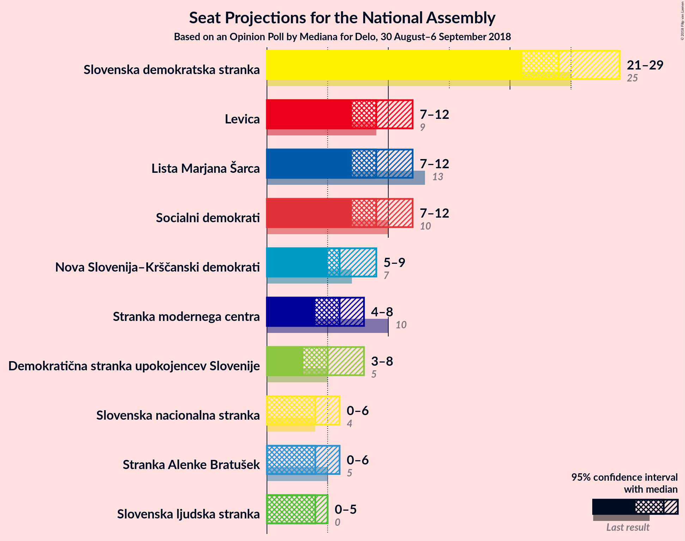
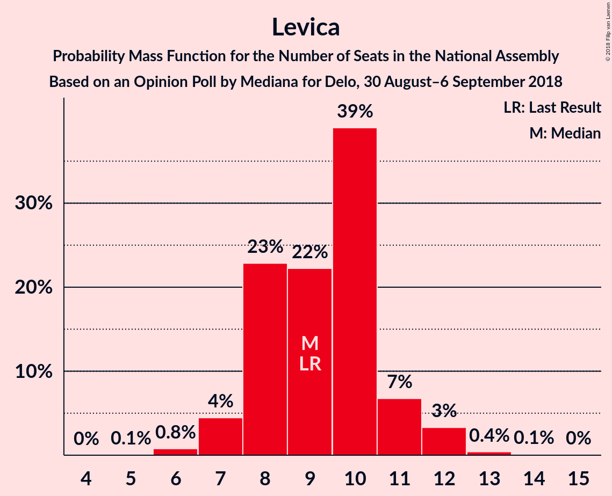
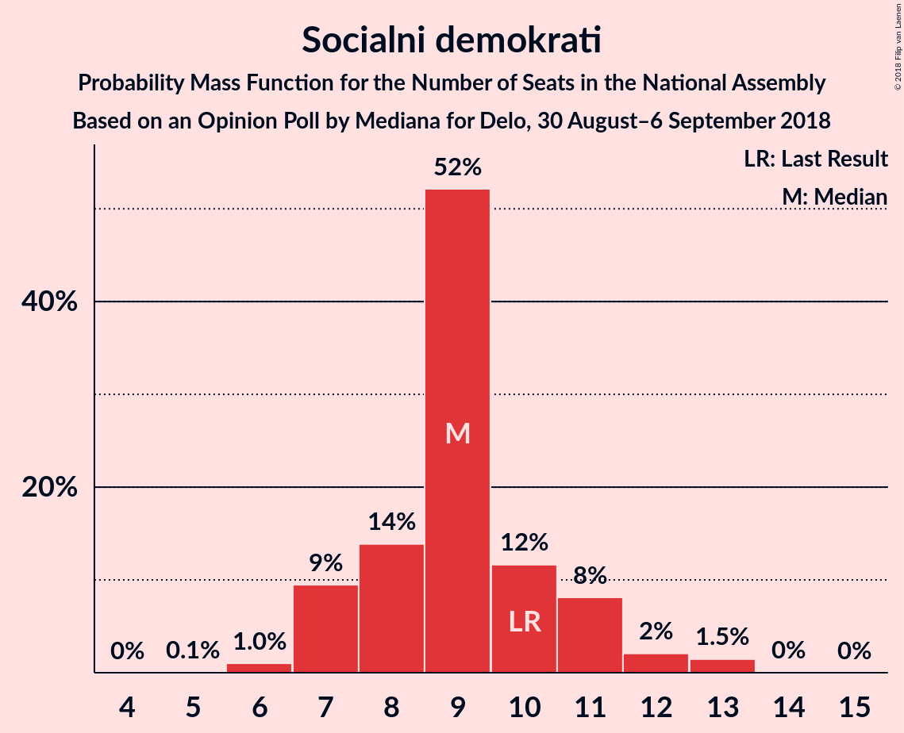
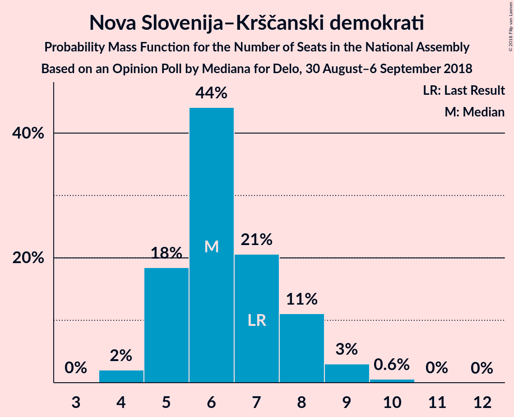
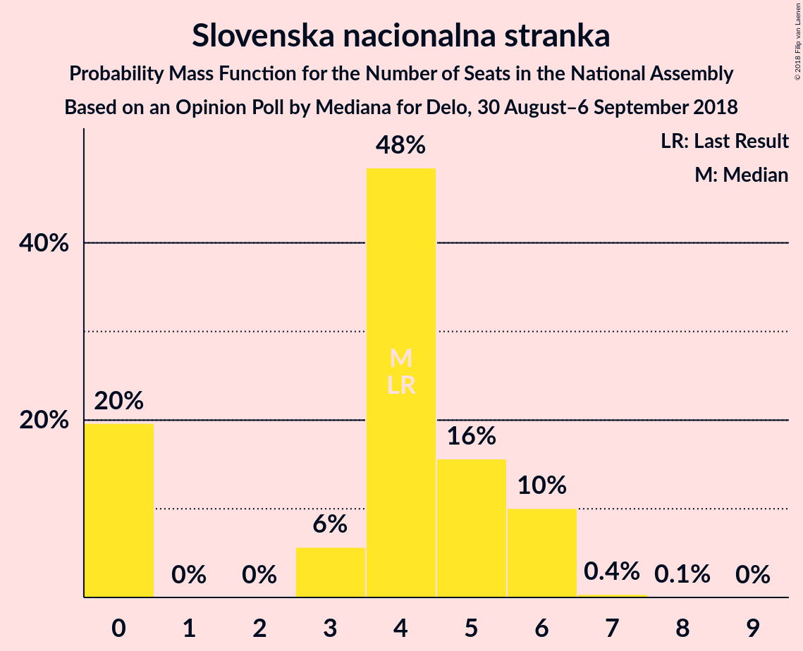

# Opinion Poll by Mediana for Delo, 30 August–6 September 2018

<a href="#voting-intentions">Voting Intentions</a> | <a href="#seats">Seats</a> | <a href="#coalitions">Coalitions</a> | <a href="#technical-information">Technical Information</a>

## Voting Intentions

### Confidence Intervals

| Party | Last Result | Poll Result | 80% Confidence Interval | 90% Confidence Interval | 95% Confidence Interval | 99% Confidence Interval |
|:-----:|:-----------:|:-----------:|:-----------------------:|:-----------------------:|:-----------------------:|:-----------------------:|
| Slovenska demokratska stranka | 24.9% | 26.8% | 24.3–29.5% |23.6–30.3% |23.0–30.9% |21.9–32.3% |
| Lista Marjana Šarca | 12.6% | 10.7% | 9.1–12.7% |8.6–13.3% |8.2–13.8% |7.5–14.8% |
| Levica | 9.3% | 10.3% | 8.7–12.2% |8.2–12.8% |7.8–13.3% |7.1–14.3% |
| Socialni demokrati | 9.9% | 9.8% | 8.3–11.8% |7.8–12.3% |7.5–12.8% |6.8–13.8% |
| Nova Slovenija–Krščanski demokrati | 7.2% | 7.1% | 5.8–8.9% |5.4–9.3% |5.1–9.8% |4.6–10.7% |
| Stranka modernega centra | 9.7% | 6.5% | 5.2–8.2% |4.9–8.6% |4.6–9.1% |4.1–9.9% |
| Demokratična stranka upokojencev Slovenije | 4.9% | 6.1% | 4.9–7.7% |4.5–8.2% |4.3–8.6% |3.7–9.4% |
| Stranka Alenke Bratušek | 5.1% | 4.8% | 3.8–6.3% |3.5–6.7% |3.2–7.1% |2.8–7.9% |
| Slovenska nacionalna stranka | 4.2% | 4.8% | 3.8–6.3% |3.5–6.7% |3.2–7.1% |2.8–7.9% |
| Slovenska ljudska stranka | 2.6% | 4.4% | 3.4–5.9% |3.1–6.3% |2.9–6.6% |2.5–7.4% |

*Note:* The poll result column reflects the actual value used in the calculations. Published results may vary slightly, and in addition be rounded to fewer digits.

## Seats

### Confidence Intervals

| Party | Last Result | Median | 80% Confidence Interval | 90% Confidence Interval | 95% Confidence Interval | 99% Confidence Interval |
|:-----:|:-----------:|:------:|:-----------------------:|:-----------------------:|:-----------------------:|:-----------------------:|
| <a href="#slovenska-demokratska-stranka">Slovenska demokratska stranka</a> | 25 | 24 | 23–27 |22–28 |21–29 |19–30 |
| <a href="#lista-marjana-šarca">Lista Marjana Šarca</a> | 13 | 9 | 8–11 |7–12 |7–12 |7–13 |
| <a href="#levica">Levica</a> | 9 | 9 | 8–11 |7–11 |7–12 |6–13 |
| <a href="#socialni-demokrati">Socialni demokrati</a> | 10 | 9 | 7–11 |7–11 |7–12 |6–13 |
| <a href="#nova-slovenija–krščanski-demokrati">Nova Slovenija–Krščanski demokrati</a> | 7 | 6 | 5–8 |5–8 |5–9 |4–10 |
| <a href="#stranka-modernega-centra">Stranka modernega centra</a> | 10 | 6 | 5–7 |4–8 |4–8 |4–9 |
| <a href="#demokratična-stranka-upokojencev-slovenije">Demokratična stranka upokojencev Slovenije</a> | 5 | 5 | 4–7 |4–7 |3–8 |0–8 |
| <a href="#stranka-alenke-bratušek">Stranka Alenke Bratušek</a> | 5 | 4 | 0–5 |0–6 |0–6 |0–7 |
| <a href="#slovenska-nacionalna-stranka">Slovenska nacionalna stranka</a> | 4 | 4 | 0–6 |0–6 |0–6 |0–6 |
| <a href="#slovenska-ljudska-stranka">Slovenska ljudska stranka</a> | 0 | 4 | 0–5 |0–5 |0–5 |0–6 |

### Slovenska demokratska stranka

*For a full overview of the results for this party, see the [Slovenska demokratska stranka](party-slovenskademokratskastranka.html) page.*

| Number of Seats | Probability | Accumulated | Special Marks |
|:---------------:|:-----------:|:-----------:|:-------------:|
| 18 | 0.1% | 100% |  |
| 19 | 0.4% | 99.9% |  |
| 20 | 0.9% | 99.5% |  |
| 21 | 2% | 98.6% |  |
| 22 | 7% | 97% |  |
| 23 | 29% | 90% |  |
| 24 | 15% | 61% | Median |
| 25 | 11% | 46% | Last Result |
| 26 | 21% | 35% |  |
| 27 | 5% | 13% |  |
| 28 | 3% | 8% |  |
| 29 | 4% | 5% |  |
| 30 | 0.8% | 1.0% |  |
| 31 | 0.1% | 0.2% |  |
| 32 | 0% | 0% |  |

### Lista Marjana Šarca

*For a full overview of the results for this party, see the [Lista Marjana Šarca](party-listamarjanašarca.html) page.*

| Number of Seats | Probability | Accumulated | Special Marks |
|:---------------:|:-----------:|:-----------:|:-------------:|
| 6 | 0.1% | 100% |  |
| 7 | 6% | 99.8% |  |
| 8 | 6% | 94% |  |
| 9 | 48% | 88% | Median |
| 10 | 14% | 40% |  |
| 11 | 20% | 26% |  |
| 12 | 4% | 6% |  |
| 13 | 1.4% | 2% | Last Result |
| 14 | 0.1% | 0.2% |  |
| 15 | 0% | 0.1% |  |
| 16 | 0% | 0% |  |

### Levica

*For a full overview of the results for this party, see the [Levica](party-levica.html) page.*

| Number of Seats | Probability | Accumulated | Special Marks |
|:---------------:|:-----------:|:-----------:|:-------------:|
| 5 | 0.1% | 100% |  |
| 6 | 0.8% | 99.9% |  |
| 7 | 4% | 99.1% |  |
| 8 | 23% | 95% |  |
| 9 | 22% | 72% | Last Result, Median |
| 10 | 39% | 50% |  |
| 11 | 7% | 11% |  |
| 12 | 3% | 4% |  |
| 13 | 0.4% | 0.6% |  |
| 14 | 0.1% | 0.1% |  |
| 15 | 0% | 0% |  |

### Socialni demokrati

*For a full overview of the results for this party, see the [Socialni demokrati](party-socialnidemokrati.html) page.*

| Number of Seats | Probability | Accumulated | Special Marks |
|:---------------:|:-----------:|:-----------:|:-------------:|
| 5 | 0.1% | 100% |  |
| 6 | 1.0% | 99.9% |  |
| 7 | 9% | 98.9% |  |
| 8 | 14% | 89% |  |
| 9 | 52% | 76% | Median |
| 10 | 12% | 23% | Last Result |
| 11 | 8% | 12% |  |
| 12 | 2% | 4% |  |
| 13 | 1.5% | 2% |  |
| 14 | 0% | 0.1% |  |
| 15 | 0% | 0% |  |

### Nova Slovenija–Krščanski demokrati

*For a full overview of the results for this party, see the [Nova Slovenija–Krščanski demokrati](party-novaslovenija–krščanskidemokrati.html) page.*

| Number of Seats | Probability | Accumulated | Special Marks |
|:---------------:|:-----------:|:-----------:|:-------------:|
| 3 | 0% | 100% |  |
| 4 | 2% | 99.9% |  |
| 5 | 18% | 98% |  |
| 6 | 44% | 79% | Median |
| 7 | 21% | 35% | Last Result |
| 8 | 11% | 15% |  |
| 9 | 3% | 4% |  |
| 10 | 0.6% | 0.6% |  |
| 11 | 0% | 0.1% |  |
| 12 | 0% | 0% |  |

### Stranka modernega centra

*For a full overview of the results for this party, see the [Stranka modernega centra](party-strankamodernegacentra.html) page.*

| Number of Seats | Probability | Accumulated | Special Marks |
|:---------------:|:-----------:|:-----------:|:-------------:|
| 0 | 0.2% | 100% |  |
| 1 | 0% | 99.8% |  |
| 2 | 0% | 99.8% |  |
| 3 | 0.2% | 99.8% |  |
| 4 | 7% | 99.6% |  |
| 5 | 24% | 92% |  |
| 6 | 45% | 68% | Median |
| 7 | 16% | 23% |  |
| 8 | 6% | 7% |  |
| 9 | 0.5% | 0.7% |  |
| 10 | 0.1% | 0.1% | Last Result |
| 11 | 0% | 0% |  |

### Demokratična stranka upokojencev Slovenije

*For a full overview of the results for this party, see the [Demokratična stranka upokojencev Slovenije](party-demokratičnastrankaupokojencevslovenije.html) page.*

| Number of Seats | Probability | Accumulated | Special Marks |
|:---------------:|:-----------:|:-----------:|:-------------:|
| 0 | 2% | 100% |  |
| 1 | 0% | 98% |  |
| 2 | 0% | 98% |  |
| 3 | 0.9% | 98% |  |
| 4 | 14% | 97% |  |
| 5 | 43% | 84% | Last Result, Median |
| 6 | 24% | 41% |  |
| 7 | 14% | 17% |  |
| 8 | 3% | 3% |  |
| 9 | 0.2% | 0.3% |  |
| 10 | 0% | 0% |  |

### Stranka Alenke Bratušek

*For a full overview of the results for this party, see the [Stranka Alenke Bratušek](party-strankaalenkebratušek.html) page.*

| Number of Seats | Probability | Accumulated | Special Marks |
|:---------------:|:-----------:|:-----------:|:-------------:|
| 0 | 20% | 100% |  |
| 1 | 0% | 80% |  |
| 2 | 0% | 80% |  |
| 3 | 10% | 80% |  |
| 4 | 22% | 70% | Median |
| 5 | 41% | 48% | Last Result |
| 6 | 6% | 7% |  |
| 7 | 1.0% | 1.1% |  |
| 8 | 0.1% | 0.1% |  |
| 9 | 0% | 0% |  |

### Slovenska nacionalna stranka

*For a full overview of the results for this party, see the [Slovenska nacionalna stranka](party-slovenskanacionalnastranka.html) page.*

| Number of Seats | Probability | Accumulated | Special Marks |
|:---------------:|:-----------:|:-----------:|:-------------:|
| 0 | 20% | 100% |  |
| 1 | 0% | 80% |  |
| 2 | 0% | 80% |  |
| 3 | 6% | 80% |  |
| 4 | 48% | 75% | Last Result, Median |
| 5 | 16% | 26% |  |
| 6 | 10% | 11% |  |
| 7 | 0.4% | 0.5% |  |
| 8 | 0.1% | 0.1% |  |
| 9 | 0% | 0% |  |

### Slovenska ljudska stranka

*For a full overview of the results for this party, see the [Slovenska ljudska stranka](party-slovenskaljudskastranka.html) page.*

| Number of Seats | Probability | Accumulated | Special Marks |
|:---------------:|:-----------:|:-----------:|:-------------:|
| 0 | 31% | 100% | Last Result |
| 1 | 0% | 69% |  |
| 2 | 0% | 69% |  |
| 3 | 7% | 69% |  |
| 4 | 52% | 63% | Median |
| 5 | 8% | 11% |  |
| 6 | 2% | 2% |  |
| 7 | 0.1% | 0.2% |  |
| 8 | 0% | 0% |  |

## Coalitions

### Confidence Intervals

| Coalition | Last Result | Median | Majority? | 80% Confidence Interval | 90% Confidence Interval | 95% Confidence Interval | 99% Confidence Interval |
|:---------:|:-----------:|:------:|:---------:|:-----------------------:|:-----------------------:|:-----------------------:|:-----------------------:|
| Lista Marjana Šarca – Socialni demokrati – Nova Slovenija–Krščanski demokrati – Stranka modernega centra – Demokratična stranka upokojencev Slovenije – Stranka Alenke Bratušek | 50 | 40 | 4% | 37–44 | 36–45 | 35–46 | 33–46 |
| Slovenska demokratska stranka – Lista Marjana Šarca – Demokratična stranka upokojencev Slovenije | 43 | 39 | 0.4% | 37–43 | 36–44 | 35–44 | 33–45 |
| Lista Marjana Šarca – Socialni demokrati – Nova Slovenija–Krščanski demokrati – Stranka modernega centra – Demokratična stranka upokojencev Slovenije | 45 | 36 | 0% | 33–40 | 32–41 | 31–41 | 29–42 |
| Lista Marjana Šarca – Socialni demokrati – Stranka modernega centra – Demokratična stranka upokojencev Slovenije – Stranka Alenke Bratušek | 43 | 34 | 0% | 31–37 | 29–38 | 28–39 | 26–40 |
| Slovenska demokratska stranka – Lista Marjana Šarca | 38 | 34 | 0% | 32–37 | 31–38 | 30–38 | 29–40 |
| Lista Marjana Šarca – Socialni demokrati – Nova Slovenija–Krščanski demokrati – Stranka modernega centra | 40 | 30 | 0% | 28–34 | 27–35 | 27–36 | 25–37 |
| Lista Marjana Šarca – Socialni demokrati – Nova Slovenija–Krščanski demokrati – Demokratična stranka upokojencev Slovenije | 35 | 30 | 0% | 28–34 | 27–34 | 26–35 | 24–36 |
| Lista Marjana Šarca – Socialni demokrati – Stranka modernega centra – Demokratična stranka upokojencev Slovenije | 38 | 29 | 0% | 27–33 | 26–34 | 25–35 | 22–35 |
| Lista Marjana Šarca – Socialni demokrati – Nova Slovenija–Krščanski demokrati | 30 | 24 | 0% | 22–28 | 22–29 | 21–30 | 20–30 |
| Lista Marjana Šarca – Socialni demokrati – Stranka modernega centra | 33 | 24 | 0% | 22–27 | 21–28 | 20–29 | 19–30 |
| Lista Marjana Šarca – Socialni demokrati – Demokratična stranka upokojencev Slovenije | 28 | 23 | 0% | 21–27 | 21–27 | 19–28 | 17–29 |
| Socialni demokrati – Stranka modernega centra – Demokratična stranka upokojencev Slovenije | 25 | 20 | 0% | 18–23 | 17–23 | 16–24 | 13–25 |
| Lista Marjana Šarca – Socialni demokrati | 23 | 18 | 0% | 16–21 | 16–22 | 15–23 | 14–24 |

### Lista Marjana Šarca – Socialni demokrati – Nova Slovenija–Krščanski demokrati – Stranka modernega centra – Demokratična stranka upokojencev Slovenije – Stranka Alenke Bratušek

| Number of Seats | Probability | Accumulated | Special Marks |
|:---------------:|:-----------:|:-----------:|:-------------:|
| 31 | 0% | 100% |  |
| 32 | 0.1% | 99.9% |  |
| 33 | 1.1% | 99.8% |  |
| 34 | 0.7% | 98.7% |  |
| 35 | 2% | 98% |  |
| 36 | 4% | 96% |  |
| 37 | 8% | 92% |  |
| 38 | 17% | 84% |  |
| 39 | 7% | 66% | Median |
| 40 | 24% | 60% |  |
| 41 | 17% | 36% |  |
| 42 | 4% | 19% |  |
| 43 | 3% | 15% |  |
| 44 | 7% | 12% |  |
| 45 | 1.1% | 5% |  |
| 46 | 4% | 4% | Majority |
| 47 | 0.3% | 0.4% |  |
| 48 | 0.1% | 0.1% |  |
| 49 | 0% | 0% |  |
| 50 | 0% | 0% | Last Result |

### Slovenska demokratska stranka – Lista Marjana Šarca – Demokratična stranka upokojencev Slovenije

| Number of Seats | Probability | Accumulated | Special Marks |
|:---------------:|:-----------:|:-----------:|:-------------:|
| 32 | 0.2% | 100% |  |
| 33 | 0.3% | 99.8% |  |
| 34 | 0.6% | 99.4% |  |
| 35 | 2% | 98.9% |  |
| 36 | 4% | 97% |  |
| 37 | 29% | 93% |  |
| 38 | 8% | 63% | Median |
| 39 | 8% | 55% |  |
| 40 | 10% | 48% |  |
| 41 | 10% | 38% |  |
| 42 | 8% | 28% |  |
| 43 | 15% | 20% | Last Result |
| 44 | 4% | 5% |  |
| 45 | 0.9% | 1.2% |  |
| 46 | 0.2% | 0.4% | Majority |
| 47 | 0.1% | 0.1% |  |
| 48 | 0% | 0.1% |  |
| 49 | 0% | 0% |  |

### Lista Marjana Šarca – Socialni demokrati – Nova Slovenija–Krščanski demokrati – Stranka modernega centra – Demokratična stranka upokojencev Slovenije

| Number of Seats | Probability | Accumulated | Special Marks |
|:---------------:|:-----------:|:-----------:|:-------------:|
| 28 | 0.1% | 100% |  |
| 29 | 1.0% | 99.9% |  |
| 30 | 0.7% | 98.9% |  |
| 31 | 0.9% | 98% |  |
| 32 | 2% | 97% |  |
| 33 | 11% | 95% |  |
| 34 | 9% | 84% |  |
| 35 | 22% | 75% | Median |
| 36 | 10% | 53% |  |
| 37 | 10% | 43% |  |
| 38 | 14% | 33% |  |
| 39 | 9% | 20% |  |
| 40 | 2% | 11% |  |
| 41 | 7% | 9% |  |
| 42 | 0.7% | 1.0% |  |
| 43 | 0.2% | 0.3% |  |
| 44 | 0.1% | 0.1% |  |
| 45 | 0% | 0% | Last Result |

### Lista Marjana Šarca – Socialni demokrati – Stranka modernega centra – Demokratična stranka upokojencev Slovenije – Stranka Alenke Bratušek

| Number of Seats | Probability | Accumulated | Special Marks |
|:---------------:|:-----------:|:-----------:|:-------------:|
| 25 | 0.1% | 100% |  |
| 26 | 1.0% | 99.9% |  |
| 27 | 0.4% | 99.0% |  |
| 28 | 2% | 98.6% |  |
| 29 | 2% | 97% |  |
| 30 | 5% | 95% |  |
| 31 | 13% | 90% |  |
| 32 | 11% | 77% |  |
| 33 | 13% | 66% | Median |
| 34 | 24% | 54% |  |
| 35 | 10% | 30% |  |
| 36 | 6% | 20% |  |
| 37 | 6% | 14% |  |
| 38 | 3% | 7% |  |
| 39 | 3% | 5% |  |
| 40 | 2% | 2% |  |
| 41 | 0.1% | 0.2% |  |
| 42 | 0% | 0% |  |
| 43 | 0% | 0% | Last Result |

### Slovenska demokratska stranka – Lista Marjana Šarca

| Number of Seats | Probability | Accumulated | Special Marks |
|:---------------:|:-----------:|:-----------:|:-------------:|
| 27 | 0.1% | 100% |  |
| 28 | 0.3% | 99.9% |  |
| 29 | 1.3% | 99.7% |  |
| 30 | 3% | 98% |  |
| 31 | 4% | 96% |  |
| 32 | 27% | 92% |  |
| 33 | 12% | 65% | Median |
| 34 | 12% | 53% |  |
| 35 | 10% | 40% |  |
| 36 | 8% | 31% |  |
| 37 | 15% | 23% |  |
| 38 | 6% | 8% | Last Result |
| 39 | 1.5% | 2% |  |
| 40 | 0.3% | 0.6% |  |
| 41 | 0.2% | 0.3% |  |
| 42 | 0.1% | 0.1% |  |
| 43 | 0% | 0% |  |

### Lista Marjana Šarca – Socialni demokrati – Nova Slovenija–Krščanski demokrati – Stranka modernega centra

| Number of Seats | Probability | Accumulated | Special Marks |
|:---------------:|:-----------:|:-----------:|:-------------:|
| 23 | 0.1% | 100% |  |
| 24 | 0.1% | 99.9% |  |
| 25 | 0.6% | 99.8% |  |
| 26 | 1.1% | 99.3% |  |
| 27 | 3% | 98% |  |
| 28 | 15% | 95% |  |
| 29 | 7% | 80% |  |
| 30 | 26% | 73% | Median |
| 31 | 8% | 47% |  |
| 32 | 17% | 39% |  |
| 33 | 7% | 22% |  |
| 34 | 7% | 15% |  |
| 35 | 3% | 8% |  |
| 36 | 3% | 4% |  |
| 37 | 1.1% | 1.3% |  |
| 38 | 0.1% | 0.2% |  |
| 39 | 0% | 0% |  |
| 40 | 0% | 0% | Last Result |

### Lista Marjana Šarca – Socialni demokrati – Nova Slovenija–Krščanski demokrati – Demokratična stranka upokojencev Slovenije

| Number of Seats | Probability | Accumulated | Special Marks |
|:---------------:|:-----------:|:-----------:|:-------------:|
| 23 | 0.1% | 100% |  |
| 24 | 1.1% | 99.9% |  |
| 25 | 1.2% | 98.8% |  |
| 26 | 2% | 98% |  |
| 27 | 5% | 95% |  |
| 28 | 13% | 90% |  |
| 29 | 22% | 77% | Median |
| 30 | 11% | 55% |  |
| 31 | 9% | 44% |  |
| 32 | 16% | 35% |  |
| 33 | 8% | 20% |  |
| 34 | 8% | 11% |  |
| 35 | 3% | 4% | Last Result |
| 36 | 0.5% | 0.8% |  |
| 37 | 0.2% | 0.3% |  |
| 38 | 0.1% | 0.1% |  |
| 39 | 0% | 0% |  |

### Lista Marjana Šarca – Socialni demokrati – Stranka modernega centra – Demokratična stranka upokojencev Slovenije

| Number of Seats | Probability | Accumulated | Special Marks |
|:---------------:|:-----------:|:-----------:|:-------------:|
| 21 | 0% | 100% |  |
| 22 | 0.9% | 99.9% |  |
| 23 | 0.2% | 99.0% |  |
| 24 | 0.7% | 98.8% |  |
| 25 | 2% | 98% |  |
| 26 | 2% | 96% |  |
| 27 | 6% | 94% |  |
| 28 | 17% | 88% |  |
| 29 | 23% | 72% | Median |
| 30 | 6% | 48% |  |
| 31 | 15% | 43% |  |
| 32 | 15% | 28% |  |
| 33 | 8% | 13% |  |
| 34 | 2% | 5% |  |
| 35 | 3% | 3% |  |
| 36 | 0.2% | 0.3% |  |
| 37 | 0.1% | 0.1% |  |
| 38 | 0% | 0% | Last Result |

### Lista Marjana Šarca – Socialni demokrati – Nova Slovenija–Krščanski demokrati

| Number of Seats | Probability | Accumulated | Special Marks |
|:---------------:|:-----------:|:-----------:|:-------------:|
| 18 | 0.1% | 100% |  |
| 19 | 0.1% | 99.9% |  |
| 20 | 0.8% | 99.8% |  |
| 21 | 4% | 99.0% |  |
| 22 | 7% | 95% |  |
| 23 | 13% | 88% |  |
| 24 | 27% | 75% | Median |
| 25 | 8% | 48% |  |
| 26 | 18% | 40% |  |
| 27 | 10% | 22% |  |
| 28 | 5% | 12% |  |
| 29 | 4% | 7% |  |
| 30 | 2% | 3% | Last Result |
| 31 | 0.2% | 0.5% |  |
| 32 | 0.3% | 0.3% |  |
| 33 | 0% | 0.1% |  |
| 34 | 0% | 0% |  |

### Lista Marjana Šarca – Socialni demokrati – Stranka modernega centra

| Number of Seats | Probability | Accumulated | Special Marks |
|:---------------:|:-----------:|:-----------:|:-------------:|
| 17 | 0% | 100% |  |
| 18 | 0.1% | 99.9% |  |
| 19 | 0.6% | 99.9% |  |
| 20 | 2% | 99.3% |  |
| 21 | 4% | 97% |  |
| 22 | 8% | 93% |  |
| 23 | 16% | 86% |  |
| 24 | 30% | 70% | Median |
| 25 | 7% | 40% |  |
| 26 | 16% | 32% |  |
| 27 | 8% | 17% |  |
| 28 | 4% | 8% |  |
| 29 | 2% | 4% |  |
| 30 | 2% | 2% |  |
| 31 | 0.1% | 0.1% |  |
| 32 | 0.1% | 0.1% |  |
| 33 | 0% | 0% | Last Result |

### Lista Marjana Šarca – Socialni demokrati – Demokratična stranka upokojencev Slovenije

| Number of Seats | Probability | Accumulated | Special Marks |
|:---------------:|:-----------:|:-----------:|:-------------:|
| 16 | 0% | 100% |  |
| 17 | 1.0% | 99.9% |  |
| 18 | 0.3% | 99.0% |  |
| 19 | 1.2% | 98.7% |  |
| 20 | 2% | 97% |  |
| 21 | 6% | 96% |  |
| 22 | 10% | 90% |  |
| 23 | 31% | 80% | Median |
| 24 | 7% | 49% |  |
| 25 | 13% | 42% |  |
| 26 | 19% | 29% |  |
| 27 | 5% | 10% |  |
| 28 | 4% | 5% | Last Result |
| 29 | 0.6% | 1.0% |  |
| 30 | 0.3% | 0.3% |  |
| 31 | 0% | 0.1% |  |
| 32 | 0% | 0% |  |

### Socialni demokrati – Stranka modernega centra – Demokratična stranka upokojencev Slovenije

| Number of Seats | Probability | Accumulated | Special Marks |
|:---------------:|:-----------:|:-----------:|:-------------:|
| 13 | 1.1% | 100% |  |
| 14 | 0.2% | 98.9% |  |
| 15 | 0.2% | 98.7% |  |
| 16 | 1.2% | 98% |  |
| 17 | 5% | 97% |  |
| 18 | 6% | 92% |  |
| 19 | 17% | 87% |  |
| 20 | 25% | 69% | Median |
| 21 | 16% | 44% |  |
| 22 | 16% | 28% |  |
| 23 | 8% | 12% |  |
| 24 | 4% | 4% |  |
| 25 | 0.6% | 0.9% | Last Result |
| 26 | 0.2% | 0.3% |  |
| 27 | 0% | 0.1% |  |
| 28 | 0% | 0% |  |

### Lista Marjana Šarca – Socialni demokrati

| Number of Seats | Probability | Accumulated | Special Marks |
|:---------------:|:-----------:|:-----------:|:-------------:|
| 13 | 0.2% | 100% |  |
| 14 | 0.6% | 99.8% |  |
| 15 | 3% | 99.1% |  |
| 16 | 8% | 96% |  |
| 17 | 10% | 88% |  |
| 18 | 35% | 79% | Median |
| 19 | 15% | 43% |  |
| 20 | 14% | 28% |  |
| 21 | 6% | 14% |  |
| 22 | 5% | 8% |  |
| 23 | 2% | 3% | Last Result |
| 24 | 0.7% | 0.8% |  |
| 25 | 0.1% | 0.1% |  |
| 26 | 0% | 0% |  |

## Technical Information

### Opinion Poll

+ **Polling firm:** Mediana
+ **Commissioner(s):** Delo
+ **Fieldwork period:** 30 August–6 September 2018

### Calculations

+ **Sample size:** 478
+ **Simulations done:** 1,048,576
+ **Error estimate:** 1.66%

