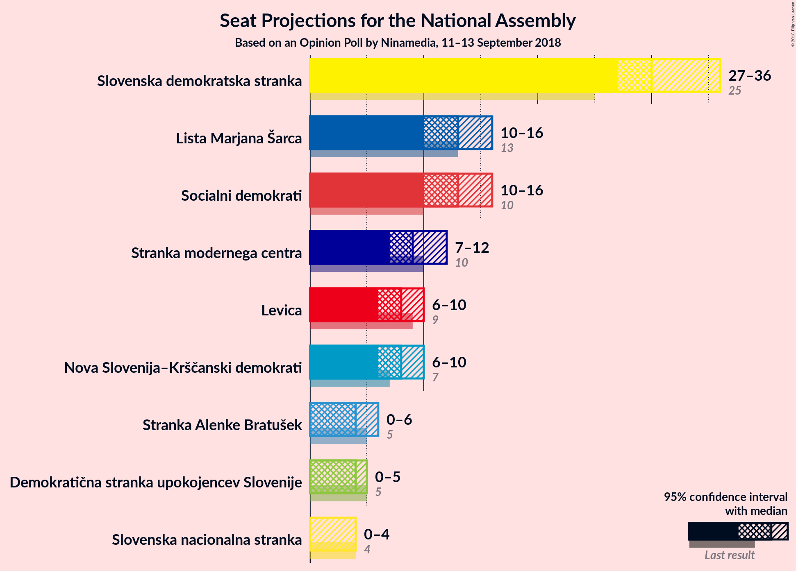
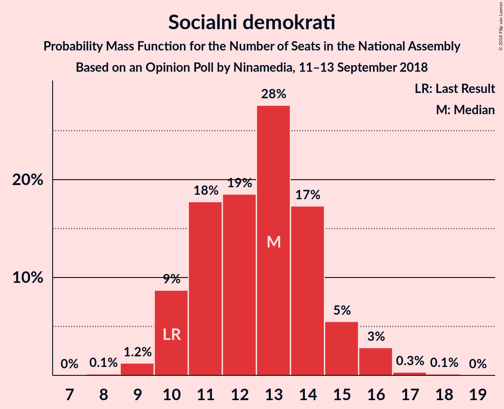
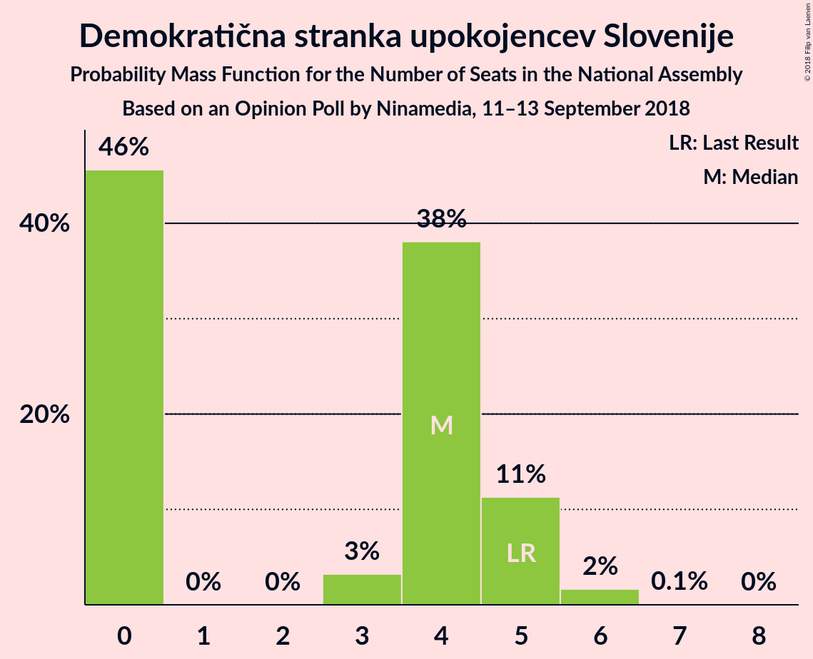
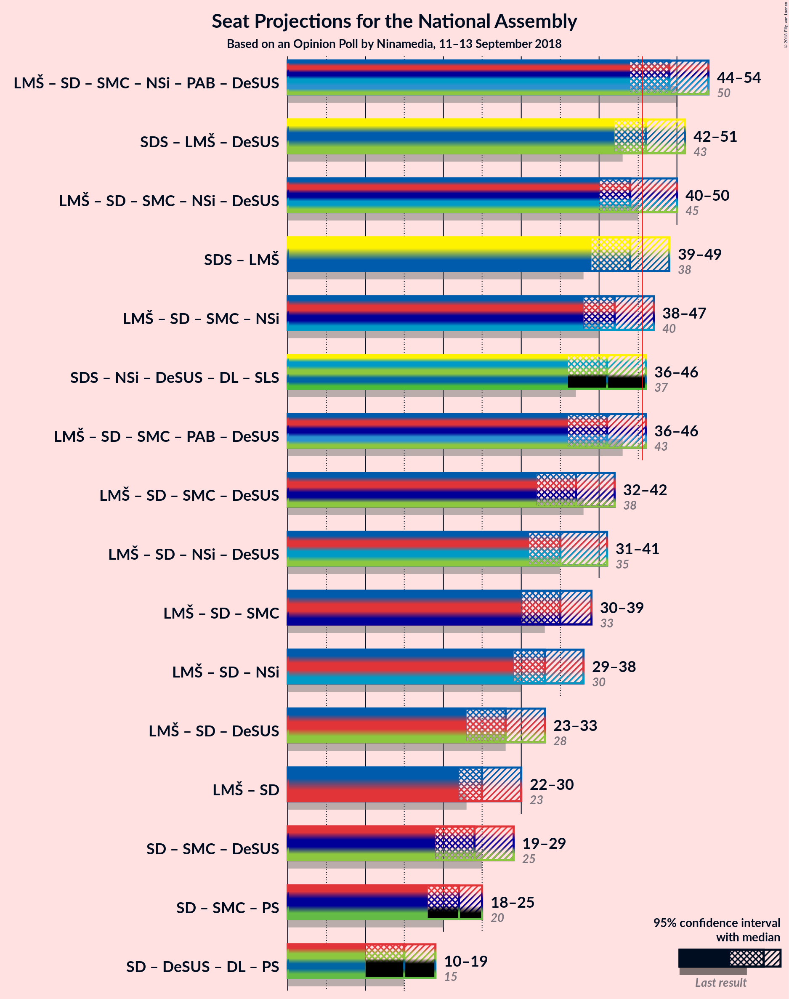

# Opinion Poll by Ninamedia, 11–13 September 2018

<a href="#voting-intentions">Voting Intentions</a> | <a href="#seats">Seats</a> | <a href="#coalitions">Coalitions</a> | <a href="#technical-information">Technical Information</a>

## Voting Intentions

### Confidence Intervals

| Party | Last Result | Poll Result | 80% Confidence Interval | 90% Confidence Interval | 95% Confidence Interval | 99% Confidence Interval |
|:-----:|:-----------:|:-----------:|:-----------------------:|:-----------------------:|:-----------------------:|:-----------------------:|
| Slovenska demokratska stranka | 24.9% | 32.3% | 29.8–34.9% |29.1–35.6% |28.5–36.2% |27.4–37.5% |
| Lista Marjana Šarca | 12.6% | 13.9% | 12.2–15.9% |11.7–16.5% |11.3–17.0% |10.5–18.0% |
| Socialni demokrati | 9.9% | 13.4% | 11.7–15.4% |11.2–15.9% |10.8–16.4% |10.0–17.5% |
| Stranka modernega centra | 9.7% | 9.6% | 8.2–11.4% |7.8–11.9% |7.5–12.4% |6.8–13.3% |
| Levica | 9.3% | 8.4% | 7.0–10.1% |6.7–10.5% |6.4–11.0% |5.8–11.8% |
| Nova Slovenija–Krščanski demokrati | 7.2% | 8.4% | 7.0–10.1% |6.7–10.5% |6.4–11.0% |5.8–11.8% |
| Stranka Alenke Bratušek | 5.1% | 5.0% | 4.0–6.4% |3.7–6.8% |3.5–7.1% |3.0–7.8% |
| Demokratična stranka upokojencev Slovenije | 4.9% | 4.1% | 3.2–5.4% |3.0–5.8% |2.7–6.1% |2.4–6.8% |
| Slovenska nacionalna stranka | 4.2% | 3.2% | 2.4–4.4% |2.2–4.7% |2.0–5.0% |1.7–5.6% |

*Note:* The poll result column reflects the actual value used in the calculations. Published results may vary slightly, and in addition be rounded to fewer digits.

## Seats

### Confidence Intervals

| Party | Last Result | Median | 80% Confidence Interval | 90% Confidence Interval | 95% Confidence Interval | 99% Confidence Interval |
|:-----:|:-----------:|:------:|:-----------------------:|:-----------------------:|:-----------------------:|:-----------------------:|
| <a href="#slovenska-demokratska-stranka">Slovenska demokratska stranka</a> | 25 | 30 | 28–33 |28–34 |27–35 |26–36 |
| <a href="#lista-marjana-šarca">Lista Marjana Šarca</a> | 13 | 13 | 11–15 |11–15 |10–17 |10–17 |
| <a href="#socialni-demokrati">Socialni demokrati</a> | 10 | 13 | 11–14 |10–15 |10–15 |9–17 |
| <a href="#stranka-modernega-centra">Stranka modernega centra</a> | 10 | 9 | 7–11 |7–11 |7–12 |6–12 |
| <a href="#levica">Levica</a> | 9 | 7 | 6–9 |6–10 |6–10 |5–11 |
| <a href="#nova-slovenija–krščanski-demokrati">Nova Slovenija–Krščanski demokrati</a> | 7 | 8 | 6–9 |6–10 |6–10 |5–11 |
| <a href="#stranka-alenke-bratušek">Stranka Alenke Bratušek</a> | 5 | 4 | 4–6 |0–6 |0–6 |0–7 |
| <a href="#demokratična-stranka-upokojencev-slovenije">Demokratična stranka upokojencev Slovenije</a> | 5 | 0 | 0–5 |0–5 |0–5 |0–6 |
| <a href="#slovenska-nacionalna-stranka">Slovenska nacionalna stranka</a> | 4 | 0 | 0–4 |0–4 |0–4 |0–5 |

### Slovenska demokratska stranka

*For a full overview of the results for this party, see the [Slovenska demokratska stranka](party-slovenskademokratskastranka.html) page.*

| Number of Seats | Probability | Accumulated | Special Marks |
|:---------------:|:-----------:|:-----------:|:-------------:|
| 24 | 0.1% | 100% |  |
| 25 | 0.3% | 99.9% | Last Result |
| 26 | 0.7% | 99.6% |  |
| 27 | 2% | 98.9% |  |
| 28 | 11% | 97% |  |
| 29 | 18% | 85% |  |
| 30 | 21% | 68% | Median |
| 31 | 18% | 47% |  |
| 32 | 8% | 29% |  |
| 33 | 16% | 21% |  |
| 34 | 2% | 5% |  |
| 35 | 3% | 3% |  |
| 36 | 0.4% | 0.5% |  |
| 37 | 0.1% | 0.1% |  |
| 38 | 0% | 0% |  |

### Lista Marjana Šarca

*For a full overview of the results for this party, see the [Lista Marjana Šarca](party-listamarjanašarca.html) page.*

| Number of Seats | Probability | Accumulated | Special Marks |
|:---------------:|:-----------:|:-----------:|:-------------:|
| 9 | 0.1% | 100% |  |
| 10 | 4% | 99.8% |  |
| 11 | 10% | 96% |  |
| 12 | 13% | 86% |  |
| 13 | 43% | 73% | Last Result, Median |
| 14 | 6% | 30% |  |
| 15 | 20% | 23% |  |
| 16 | 0.6% | 3% |  |
| 17 | 3% | 3% |  |
| 18 | 0.1% | 0.1% |  |
| 19 | 0% | 0% |  |

### Socialni demokrati

*For a full overview of the results for this party, see the [Socialni demokrati](party-socialnidemokrati.html) page.*

| Number of Seats | Probability | Accumulated | Special Marks |
|:---------------:|:-----------:|:-----------:|:-------------:|
| 8 | 0.1% | 100% |  |
| 9 | 1.1% | 99.9% |  |
| 10 | 7% | 98.7% | Last Result |
| 11 | 7% | 91% |  |
| 12 | 27% | 84% |  |
| 13 | 29% | 57% | Median |
| 14 | 19% | 29% |  |
| 15 | 7% | 9% |  |
| 16 | 0.8% | 2% |  |
| 17 | 0.5% | 0.9% |  |
| 18 | 0.4% | 0.4% |  |
| 19 | 0% | 0% |  |

### Stranka modernega centra

*For a full overview of the results for this party, see the [Stranka modernega centra](party-strankamodernegacentra.html) page.*

| Number of Seats | Probability | Accumulated | Special Marks |
|:---------------:|:-----------:|:-----------:|:-------------:|
| 5 | 0.1% | 100% |  |
| 6 | 1.0% | 99.9% |  |
| 7 | 12% | 99.0% |  |
| 8 | 23% | 87% |  |
| 9 | 24% | 64% | Median |
| 10 | 19% | 40% | Last Result |
| 11 | 18% | 21% |  |
| 12 | 3% | 3% |  |
| 13 | 0.1% | 0.2% |  |
| 14 | 0% | 0% |  |

### Levica

*For a full overview of the results for this party, see the [Levica](party-levica.html) page.*

| Number of Seats | Probability | Accumulated | Special Marks |
|:---------------:|:-----------:|:-----------:|:-------------:|
| 4 | 0.1% | 100% |  |
| 5 | 0.8% | 99.9% |  |
| 6 | 19% | 99.0% |  |
| 7 | 37% | 80% | Median |
| 8 | 19% | 43% |  |
| 9 | 18% | 24% | Last Result |
| 10 | 4% | 5% |  |
| 11 | 0.6% | 0.7% |  |
| 12 | 0.1% | 0.1% |  |
| 13 | 0% | 0% |  |

### Nova Slovenija–Krščanski demokrati

*For a full overview of the results for this party, see the [Nova Slovenija–Krščanski demokrati](party-novaslovenija–krščanskidemokrati.html) page.*

| Number of Seats | Probability | Accumulated | Special Marks |
|:---------------:|:-----------:|:-----------:|:-------------:|
| 4 | 0.2% | 100% |  |
| 5 | 2% | 99.8% |  |
| 6 | 12% | 98% |  |
| 7 | 24% | 86% | Last Result |
| 8 | 41% | 62% | Median |
| 9 | 12% | 21% |  |
| 10 | 7% | 9% |  |
| 11 | 2% | 2% |  |
| 12 | 0.2% | 0.2% |  |
| 13 | 0% | 0% |  |

### Stranka Alenke Bratušek

*For a full overview of the results for this party, see the [Stranka Alenke Bratušek](party-strankaalenkebratušek.html) page.*

| Number of Seats | Probability | Accumulated | Special Marks |
|:---------------:|:-----------:|:-----------:|:-------------:|
| 0 | 8% | 100% |  |
| 1 | 0% | 92% |  |
| 2 | 0% | 92% |  |
| 3 | 1.1% | 92% |  |
| 4 | 44% | 91% | Median |
| 5 | 27% | 48% | Last Result |
| 6 | 19% | 20% |  |
| 7 | 0.7% | 0.8% |  |
| 8 | 0.1% | 0.1% |  |
| 9 | 0% | 0% |  |

### Demokratična stranka upokojencev Slovenije

*For a full overview of the results for this party, see the [Demokratična stranka upokojencev Slovenije](party-demokratičnastrankaupokojencevslovenije.html) page.*

| Number of Seats | Probability | Accumulated | Special Marks |
|:---------------:|:-----------:|:-----------:|:-------------:|
| 0 | 52% | 100% | Median |
| 1 | 0% | 48% |  |
| 2 | 0% | 48% |  |
| 3 | 7% | 48% |  |
| 4 | 24% | 42% |  |
| 5 | 17% | 18% | Last Result |
| 6 | 1.0% | 1.1% |  |
| 7 | 0% | 0.1% |  |
| 8 | 0% | 0% |  |

### Slovenska nacionalna stranka

*For a full overview of the results for this party, see the [Slovenska nacionalna stranka](party-slovenskanacionalnastranka.html) page.*

| Number of Seats | Probability | Accumulated | Special Marks |
|:---------------:|:-----------:|:-----------:|:-------------:|
| 0 | 80% | 100% | Median |
| 1 | 0% | 20% |  |
| 2 | 0% | 20% |  |
| 3 | 9% | 20% |  |
| 4 | 10% | 11% | Last Result |
| 5 | 1.1% | 1.2% |  |
| 6 | 0.1% | 0.1% |  |
| 7 | 0% | 0% |  |

## Coalitions

### Confidence Intervals

| Coalition | Last Result | Median | Majority? | 80% Confidence Interval | 90% Confidence Interval | 95% Confidence Interval | 99% Confidence Interval |
|:---------:|:-----------:|:------:|:---------:|:-----------------------:|:-----------------------:|:-----------------------:|:-----------------------:|
| Lista Marjana Šarca – Socialni demokrati – Stranka modernega centra – Nova Slovenija–Krščanski demokrati – Stranka Alenke Bratušek – Demokratična stranka upokojencev Slovenije | 50 | 49 | 93% | 46–52 | 45–53 | 44–53 | 43–54 |
| Slovenska demokratska stranka – Lista Marjana Šarca – Demokratična stranka upokojencev Slovenije | 43 | 46 | 56% | 43–49 | 43–50 | 41–51 | 40–52 |
| Lista Marjana Šarca – Socialni demokrati – Stranka modernega centra – Nova Slovenija–Krščanski demokrati – Demokratična stranka upokojencev Slovenije | 45 | 45 | 36% | 41–48 | 40–49 | 40–49 | 39–51 |
| Slovenska demokratska stranka – Lista Marjana Šarca | 38 | 44 | 30% | 41–46 | 40–47 | 40–48 | 38–50 |
| Lista Marjana Šarca – Socialni demokrati – Stranka modernega centra – Nova Slovenija–Krščanski demokrati | 40 | 43 | 14% | 39–46 | 39–47 | 38–47 | 36–48 |
| Lista Marjana Šarca – Socialni demokrati – Stranka modernega centra – Stranka Alenke Bratušek – Demokratična stranka upokojencev Slovenije | 43 | 42 | 2% | 38–45 | 36–45 | 36–45 | 35–47 |
| Lista Marjana Šarca – Socialni demokrati – Stranka modernega centra – Demokratična stranka upokojencev Slovenije | 38 | 37 | 0% | 34–40 | 33–41 | 32–41 | 30–43 |
| Lista Marjana Šarca – Socialni demokrati – Nova Slovenija–Krščanski demokrati – Demokratična stranka upokojencev Slovenije | 35 | 35 | 0% | 33–39 | 32–40 | 32–40 | 30–42 |
| Lista Marjana Šarca – Socialni demokrati – Stranka modernega centra | 33 | 35 | 0% | 32–38 | 31–39 | 30–39 | 29–41 |
| Lista Marjana Šarca – Socialni demokrati – Nova Slovenija–Krščanski demokrati | 30 | 34 | 0% | 30–37 | 30–38 | 29–38 | 27–39 |
| Lista Marjana Šarca – Socialni demokrati – Demokratična stranka upokojencev Slovenije | 28 | 28 | 0% | 25–31 | 25–32 | 24–33 | 22–34 |
| Lista Marjana Šarca – Socialni demokrati | 23 | 26 | 0% | 23–29 | 22–30 | 22–30 | 21–31 |
| Socialni demokrati – Stranka modernega centra – Demokratična stranka upokojencev Slovenije | 25 | 24 | 0% | 21–27 | 20–28 | 19–28 | 18–30 |

### Lista Marjana Šarca – Socialni demokrati – Stranka modernega centra – Nova Slovenija–Krščanski demokrati – Stranka Alenke Bratušek – Demokratična stranka upokojencev Slovenije

| Number of Seats | Probability | Accumulated | Special Marks |
|:---------------:|:-----------:|:-----------:|:-------------:|
| 40 | 0% | 100% |  |
| 41 | 0.2% | 99.9% |  |
| 42 | 0.2% | 99.8% |  |
| 43 | 0.1% | 99.6% |  |
| 44 | 4% | 99.5% |  |
| 45 | 2% | 95% |  |
| 46 | 5% | 93% | Majority |
| 47 | 11% | 88% | Median |
| 48 | 15% | 76% |  |
| 49 | 12% | 61% |  |
| 50 | 17% | 49% | Last Result |
| 51 | 20% | 33% |  |
| 52 | 3% | 13% |  |
| 53 | 8% | 10% |  |
| 54 | 1.4% | 2% |  |
| 55 | 0.2% | 0.2% |  |
| 56 | 0% | 0.1% |  |
| 57 | 0% | 0% |  |

### Slovenska demokratska stranka – Lista Marjana Šarca – Demokratična stranka upokojencev Slovenije

| Number of Seats | Probability | Accumulated | Special Marks |
|:---------------:|:-----------:|:-----------:|:-------------:|
| 38 | 0.1% | 100% |  |
| 39 | 0.1% | 99.9% |  |
| 40 | 0.3% | 99.7% |  |
| 41 | 2% | 99.4% |  |
| 42 | 2% | 97% |  |
| 43 | 9% | 95% | Last Result, Median |
| 44 | 20% | 87% |  |
| 45 | 11% | 67% |  |
| 46 | 24% | 56% | Majority |
| 47 | 15% | 32% |  |
| 48 | 5% | 17% |  |
| 49 | 5% | 12% |  |
| 50 | 2% | 7% |  |
| 51 | 3% | 5% |  |
| 52 | 2% | 2% |  |
| 53 | 0.1% | 0.2% |  |
| 54 | 0% | 0.1% |  |
| 55 | 0% | 0% |  |

### Lista Marjana Šarca – Socialni demokrati – Stranka modernega centra – Nova Slovenija–Krščanski demokrati – Demokratična stranka upokojencev Slovenije

| Number of Seats | Probability | Accumulated | Special Marks |
|:---------------:|:-----------:|:-----------:|:-------------:|
| 37 | 0.2% | 100% |  |
| 38 | 0.2% | 99.8% |  |
| 39 | 1.3% | 99.6% |  |
| 40 | 4% | 98% |  |
| 41 | 9% | 95% |  |
| 42 | 4% | 86% |  |
| 43 | 5% | 82% | Median |
| 44 | 16% | 77% |  |
| 45 | 25% | 61% | Last Result |
| 46 | 9% | 36% | Majority |
| 47 | 14% | 27% |  |
| 48 | 8% | 13% |  |
| 49 | 3% | 5% |  |
| 50 | 2% | 2% |  |
| 51 | 0.3% | 0.6% |  |
| 52 | 0.3% | 0.4% |  |
| 53 | 0.1% | 0.1% |  |
| 54 | 0% | 0% |  |

### Slovenska demokratska stranka – Lista Marjana Šarca

| Number of Seats | Probability | Accumulated | Special Marks |
|:---------------:|:-----------:|:-----------:|:-------------:|
| 36 | 0% | 100% |  |
| 37 | 0.1% | 99.9% |  |
| 38 | 0.6% | 99.8% | Last Result |
| 39 | 1.4% | 99.2% |  |
| 40 | 7% | 98% |  |
| 41 | 8% | 91% |  |
| 42 | 19% | 83% |  |
| 43 | 11% | 64% | Median |
| 44 | 16% | 52% |  |
| 45 | 6% | 36% |  |
| 46 | 21% | 30% | Majority |
| 47 | 6% | 9% |  |
| 48 | 1.2% | 4% |  |
| 49 | 1.4% | 2% |  |
| 50 | 0.8% | 1.1% |  |
| 51 | 0.2% | 0.3% |  |
| 52 | 0% | 0% |  |

### Lista Marjana Šarca – Socialni demokrati – Stranka modernega centra – Nova Slovenija–Krščanski demokrati

| Number of Seats | Probability | Accumulated | Special Marks |
|:---------------:|:-----------:|:-----------:|:-------------:|
| 35 | 0% | 100% |  |
| 36 | 0.6% | 99.9% |  |
| 37 | 2% | 99.3% |  |
| 38 | 2% | 98% |  |
| 39 | 6% | 95% |  |
| 40 | 12% | 89% | Last Result |
| 41 | 11% | 78% |  |
| 42 | 10% | 66% |  |
| 43 | 13% | 56% | Median |
| 44 | 15% | 43% |  |
| 45 | 14% | 29% |  |
| 46 | 7% | 14% | Majority |
| 47 | 6% | 7% |  |
| 48 | 1.2% | 2% |  |
| 49 | 0.4% | 0.5% |  |
| 50 | 0% | 0% |  |

### Lista Marjana Šarca – Socialni demokrati – Stranka modernega centra – Stranka Alenke Bratušek – Demokratična stranka upokojencev Slovenije

| Number of Seats | Probability | Accumulated | Special Marks |
|:---------------:|:-----------:|:-----------:|:-------------:|
| 32 | 0.1% | 100% |  |
| 33 | 0% | 99.9% |  |
| 34 | 0.4% | 99.9% |  |
| 35 | 0.1% | 99.5% |  |
| 36 | 5% | 99.4% |  |
| 37 | 2% | 94% |  |
| 38 | 3% | 93% |  |
| 39 | 5% | 90% | Median |
| 40 | 22% | 85% |  |
| 41 | 11% | 63% |  |
| 42 | 15% | 52% |  |
| 43 | 22% | 37% | Last Result |
| 44 | 4% | 15% |  |
| 45 | 10% | 12% |  |
| 46 | 0.8% | 2% | Majority |
| 47 | 0.5% | 0.8% |  |
| 48 | 0.3% | 0.3% |  |
| 49 | 0% | 0% |  |

### Lista Marjana Šarca – Socialni demokrati – Stranka modernega centra – Demokratična stranka upokojencev Slovenije

| Number of Seats | Probability | Accumulated | Special Marks |
|:---------------:|:-----------:|:-----------:|:-------------:|
| 30 | 1.0% | 100% |  |
| 31 | 0.5% | 98.9% |  |
| 32 | 3% | 98% |  |
| 33 | 0.8% | 95% |  |
| 34 | 8% | 94% |  |
| 35 | 5% | 87% | Median |
| 36 | 20% | 81% |  |
| 37 | 18% | 61% |  |
| 38 | 19% | 43% | Last Result |
| 39 | 8% | 23% |  |
| 40 | 7% | 15% |  |
| 41 | 6% | 8% |  |
| 42 | 0.7% | 2% |  |
| 43 | 0.6% | 1.1% |  |
| 44 | 0.2% | 0.5% |  |
| 45 | 0.3% | 0.3% |  |
| 46 | 0% | 0% | Majority |

### Lista Marjana Šarca – Socialni demokrati – Nova Slovenija–Krščanski demokrati – Demokratična stranka upokojencev Slovenije

| Number of Seats | Probability | Accumulated | Special Marks |
|:---------------:|:-----------:|:-----------:|:-------------:|
| 27 | 0.1% | 100% |  |
| 28 | 0.1% | 99.9% |  |
| 29 | 0.2% | 99.9% |  |
| 30 | 0.8% | 99.6% |  |
| 31 | 1.2% | 98.8% |  |
| 32 | 5% | 98% |  |
| 33 | 18% | 93% |  |
| 34 | 9% | 74% | Median |
| 35 | 18% | 65% | Last Result |
| 36 | 9% | 47% |  |
| 37 | 9% | 38% |  |
| 38 | 16% | 30% |  |
| 39 | 4% | 14% |  |
| 40 | 8% | 10% |  |
| 41 | 1.3% | 2% |  |
| 42 | 0.4% | 0.7% |  |
| 43 | 0.3% | 0.3% |  |
| 44 | 0.1% | 0.1% |  |
| 45 | 0% | 0% |  |

### Lista Marjana Šarca – Socialni demokrati – Stranka modernega centra

| Number of Seats | Probability | Accumulated | Special Marks |
|:---------------:|:-----------:|:-----------:|:-------------:|
| 28 | 0.1% | 100% |  |
| 29 | 0.6% | 99.8% |  |
| 30 | 2% | 99.3% |  |
| 31 | 3% | 97% |  |
| 32 | 10% | 94% |  |
| 33 | 14% | 84% | Last Result |
| 34 | 10% | 69% |  |
| 35 | 13% | 59% | Median |
| 36 | 18% | 46% |  |
| 37 | 13% | 28% |  |
| 38 | 9% | 16% |  |
| 39 | 6% | 7% |  |
| 40 | 0.4% | 1.2% |  |
| 41 | 0.7% | 0.8% |  |
| 42 | 0% | 0% |  |

### Lista Marjana Šarca – Socialni demokrati – Nova Slovenija–Krščanski demokrati

| Number of Seats | Probability | Accumulated | Special Marks |
|:---------------:|:-----------:|:-----------:|:-------------:|
| 27 | 0.5% | 100% |  |
| 28 | 2% | 99.4% |  |
| 29 | 2% | 98% |  |
| 30 | 8% | 96% | Last Result |
| 31 | 5% | 88% |  |
| 32 | 8% | 83% |  |
| 33 | 23% | 75% |  |
| 34 | 17% | 52% | Median |
| 35 | 18% | 35% |  |
| 36 | 6% | 17% |  |
| 37 | 2% | 10% |  |
| 38 | 8% | 9% |  |
| 39 | 0.4% | 0.7% |  |
| 40 | 0.3% | 0.3% |  |
| 41 | 0.1% | 0.1% |  |
| 42 | 0% | 0% |  |

### Lista Marjana Šarca – Socialni demokrati – Demokratična stranka upokojencev Slovenije

| Number of Seats | Probability | Accumulated | Special Marks |
|:---------------:|:-----------:|:-----------:|:-------------:|
| 20 | 0.1% | 100% |  |
| 21 | 0.1% | 99.9% |  |
| 22 | 1.2% | 99.8% |  |
| 23 | 0.4% | 98.6% |  |
| 24 | 1.3% | 98% |  |
| 25 | 13% | 97% |  |
| 26 | 21% | 84% | Median |
| 27 | 10% | 63% |  |
| 28 | 13% | 53% | Last Result |
| 29 | 10% | 40% |  |
| 30 | 14% | 31% |  |
| 31 | 7% | 16% |  |
| 32 | 7% | 9% |  |
| 33 | 2% | 3% |  |
| 34 | 0.3% | 0.7% |  |
| 35 | 0.3% | 0.4% |  |
| 36 | 0.1% | 0.1% |  |
| 37 | 0% | 0% |  |

### Lista Marjana Šarca – Socialni demokrati

| Number of Seats | Probability | Accumulated | Special Marks |
|:---------------:|:-----------:|:-----------:|:-------------:|
| 20 | 0.4% | 100% |  |
| 21 | 0.9% | 99.5% |  |
| 22 | 5% | 98.6% |  |
| 23 | 8% | 94% | Last Result |
| 24 | 10% | 86% |  |
| 25 | 18% | 76% |  |
| 26 | 22% | 58% | Median |
| 27 | 20% | 37% |  |
| 28 | 3% | 17% |  |
| 29 | 6% | 13% |  |
| 30 | 7% | 8% |  |
| 31 | 0.9% | 0.9% |  |
| 32 | 0% | 0.1% |  |
| 33 | 0% | 0% |  |

### Socialni demokrati – Stranka modernega centra – Demokratična stranka upokojencev Slovenije

| Number of Seats | Probability | Accumulated | Special Marks |
|:---------------:|:-----------:|:-----------:|:-------------:|
| 17 | 0% | 100% |  |
| 18 | 2% | 99.9% |  |
| 19 | 0.6% | 98% |  |
| 20 | 3% | 97% |  |
| 21 | 11% | 94% |  |
| 22 | 7% | 83% | Median |
| 23 | 23% | 76% |  |
| 24 | 15% | 53% |  |
| 25 | 10% | 37% | Last Result |
| 26 | 9% | 27% |  |
| 27 | 12% | 18% |  |
| 28 | 5% | 7% |  |
| 29 | 0.6% | 2% |  |
| 30 | 1.0% | 1.2% |  |
| 31 | 0.2% | 0.3% |  |
| 32 | 0.1% | 0.1% |  |
| 33 | 0% | 0% |  |

## Technical Information

### Opinion Poll

+ **Polling firm:** Ninamedia
+ **Commissioner(s):** —
+ **Fieldwork period:** 11–13 September 2018

### Calculations

+ **Sample size:** 561
+ **Simulations done:** 131,072
+ **Error estimate:** 2.21%

