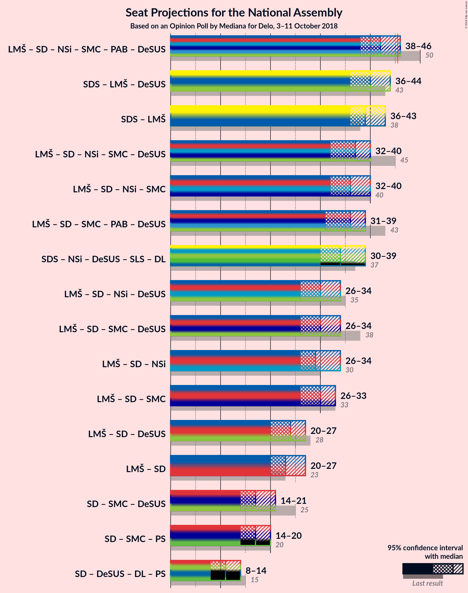

# Opinion Poll by Mediana for Delo, 3–11 October 2018

<a href="#voting-intentions">Voting Intentions</a> | <a href="#seats">Seats</a> | <a href="#coalitions">Coalitions</a> | <a href="#technical-information">Technical Information</a>

## Voting Intentions

### Confidence Intervals

| Party | Last Result | Poll Result | 80% Confidence Interval | 90% Confidence Interval | 95% Confidence Interval | 99% Confidence Interval |
|:-----:|:-----------:|:-----------:|:-----------------------:|:-----------------------:|:-----------------------:|:-----------------------:|
| Slovenska demokratska stranka | 24.9% | 28.0% | 25.9–30.2% |25.3–30.8% |24.8–31.4% |23.9–32.5% |
| Lista Marjana Šarca | 12.6% | 14.1% | 12.5–15.9% |12.1–16.4% |11.7–16.8% |11.0–17.7% |
| Socialni demokrati | 9.9% | 11.0% | 9.7–12.7% |9.3–13.1% |8.9–13.5% |8.3–14.3% |
| Levica | 9.3% | 9.0% | 7.7–10.5% |7.4–10.9% |7.1–11.3% |6.5–12.0% |
| Stranka modernega centra | 9.7% | 7.0% | 5.9–8.4% |5.6–8.8% |5.4–9.1% |4.9–9.8% |
| Nova Slovenija–Krščanski demokrati | 7.2% | 7.0% | 5.9–8.4% |5.6–8.8% |5.4–9.1% |4.9–9.8% |
| Stranka Alenke Bratušek | 5.1% | 6.1% | 5.1–7.4% |4.8–7.7% |4.6–8.1% |4.1–8.7% |
| Demokratična stranka upokojencev Slovenije | 4.9% | 3.0% | 2.4–4.0% |2.2–4.3% |2.0–4.6% |1.7–5.1% |
| Slovenska ljudska stranka | 2.6% | 3.0% | 2.4–4.0% |2.2–4.3% |2.0–4.6% |1.7–5.1% |

*Note:* The poll result column reflects the actual value used in the calculations. Published results may vary slightly, and in addition be rounded to fewer digits.

## Seats

### Confidence Intervals

| Party | Last Result | Median | 80% Confidence Interval | 90% Confidence Interval | 95% Confidence Interval | 99% Confidence Interval |
|:-----:|:-----------:|:------:|:-----------------------:|:-----------------------:|:-----------------------:|:-----------------------:|
| <a href="#slovenska-demokratska-stranka">Slovenska demokratska stranka</a> | 25 | 26 | 25–29 |24–29 |24–30 |23–31 |
| <a href="#lista-marjana-šarca">Lista Marjana Šarca</a> | 13 | 12 | 11–16 |11–16 |10–16 |10–17 |
| <a href="#socialni-demokrati">Socialni demokrati</a> | 10 | 10 | 9–12 |9–12 |8–13 |7–13 |
| <a href="#levica">Levica</a> | 9 | 8 | 7–9 |7–10 |6–10 |6–11 |
| <a href="#stranka-modernega-centra">Stranka modernega centra</a> | 10 | 7 | 5–8 |5–8 |5–9 |4–9 |
| <a href="#nova-slovenija–krščanski-demokrati">Nova Slovenija–Krščanski demokrati</a> | 7 | 6 | 5–8 |5–8 |5–8 |4–9 |
| <a href="#stranka-alenke-bratušek">Stranka Alenke Bratušek</a> | 5 | 5 | 4–7 |4–7 |4–7 |4–8 |
| <a href="#demokratična-stranka-upokojencev-slovenije">Demokratična stranka upokojencev Slovenije</a> | 5 | 0 | 0–3 |0–3 |0–3 |0–4 |
| <a href="#slovenska-ljudska-stranka">Slovenska ljudska stranka</a> | 0 | 0 | 0–3 |0–4 |0–4 |0–4 |

### Slovenska demokratska stranka

*For a full overview of the results for this party, see the [Slovenska demokratska stranka](party-slovenskademokratskastranka.html) page.*

| Number of Seats | Probability | Accumulated | Special Marks |
|:---------------:|:-----------:|:-----------:|:-------------:|
| 21 | 0.1% | 100% |  |
| 22 | 0.3% | 99.9% |  |
| 23 | 1.4% | 99.6% |  |
| 24 | 6% | 98% |  |
| 25 | 16% | 92% | Last Result |
| 26 | 28% | 76% | Median |
| 27 | 24% | 48% |  |
| 28 | 12% | 23% |  |
| 29 | 9% | 12% |  |
| 30 | 2% | 3% |  |
| 31 | 0.5% | 0.8% |  |
| 32 | 0.2% | 0.3% |  |
| 33 | 0% | 0.1% |  |
| 34 | 0% | 0% |  |

### Lista Marjana Šarca

*For a full overview of the results for this party, see the [Lista Marjana Šarca](party-listamarjanašarca.html) page.*

| Number of Seats | Probability | Accumulated | Special Marks |
|:---------------:|:-----------:|:-----------:|:-------------:|
| 10 | 3% | 100% |  |
| 11 | 19% | 97% |  |
| 12 | 36% | 78% | Median |
| 13 | 8% | 43% | Last Result |
| 14 | 8% | 35% |  |
| 15 | 15% | 26% |  |
| 16 | 10% | 11% |  |
| 17 | 1.2% | 1.2% |  |
| 18 | 0% | 0% |  |

### Socialni demokrati

*For a full overview of the results for this party, see the [Socialni demokrati](party-socialnidemokrati.html) page.*

| Number of Seats | Probability | Accumulated | Special Marks |
|:---------------:|:-----------:|:-----------:|:-------------:|
| 7 | 0.5% | 100% |  |
| 8 | 4% | 99.5% |  |
| 9 | 19% | 95% |  |
| 10 | 38% | 76% | Last Result, Median |
| 11 | 28% | 38% |  |
| 12 | 7% | 10% |  |
| 13 | 2% | 3% |  |
| 14 | 0.2% | 0.3% |  |
| 15 | 0% | 0% |  |

### Levica

*For a full overview of the results for this party, see the [Levica](party-levica.html) page.*

| Number of Seats | Probability | Accumulated | Special Marks |
|:---------------:|:-----------:|:-----------:|:-------------:|
| 5 | 0.2% | 100% |  |
| 6 | 5% | 99.8% |  |
| 7 | 20% | 95% |  |
| 8 | 41% | 76% | Median |
| 9 | 26% | 35% | Last Result |
| 10 | 8% | 9% |  |
| 11 | 1.4% | 2% |  |
| 12 | 0.2% | 0.2% |  |
| 13 | 0% | 0% |  |

### Stranka modernega centra

*For a full overview of the results for this party, see the [Stranka modernega centra](party-strankamodernegacentra.html) page.*

| Number of Seats | Probability | Accumulated | Special Marks |
|:---------------:|:-----------:|:-----------:|:-------------:|
| 4 | 1.5% | 100% |  |
| 5 | 16% | 98% |  |
| 6 | 31% | 82% |  |
| 7 | 37% | 52% | Median |
| 8 | 11% | 15% |  |
| 9 | 4% | 4% |  |
| 10 | 0.2% | 0.3% | Last Result |
| 11 | 0% | 0% |  |

### Nova Slovenija–Krščanski demokrati

*For a full overview of the results for this party, see the [Nova Slovenija–Krščanski demokrati](party-novaslovenija–krščanskidemokrati.html) page.*

| Number of Seats | Probability | Accumulated | Special Marks |
|:---------------:|:-----------:|:-----------:|:-------------:|
| 4 | 1.5% | 100% |  |
| 5 | 17% | 98.5% |  |
| 6 | 35% | 82% | Median |
| 7 | 36% | 47% | Last Result |
| 8 | 9% | 10% |  |
| 9 | 2% | 2% |  |
| 10 | 0.1% | 0.1% |  |
| 11 | 0% | 0% |  |

### Stranka Alenke Bratušek

*For a full overview of the results for this party, see the [Stranka Alenke Bratušek](party-strankaalenkebratušek.html) page.*

| Number of Seats | Probability | Accumulated | Special Marks |
|:---------------:|:-----------:|:-----------:|:-------------:|
| 0 | 0.3% | 100% |  |
| 1 | 0% | 99.7% |  |
| 2 | 0% | 99.7% |  |
| 3 | 0.1% | 99.7% |  |
| 4 | 17% | 99.6% |  |
| 5 | 37% | 82% | Last Result, Median |
| 6 | 32% | 46% |  |
| 7 | 13% | 14% |  |
| 8 | 1.1% | 1.1% |  |
| 9 | 0.1% | 0.1% |  |
| 10 | 0% | 0% |  |

### Demokratična stranka upokojencev Slovenije

*For a full overview of the results for this party, see the [Demokratična stranka upokojencev Slovenije](party-demokratičnastrankaupokojencevslovenije.html) page.*

| Number of Seats | Probability | Accumulated | Special Marks |
|:---------------:|:-----------:|:-----------:|:-------------:|
| 0 | 80% | 100% | Median |
| 1 | 0% | 20% |  |
| 2 | 0% | 20% |  |
| 3 | 17% | 20% |  |
| 4 | 2% | 2% |  |
| 5 | 0.1% | 0.1% | Last Result |
| 6 | 0% | 0% |  |

### Slovenska ljudska stranka

*For a full overview of the results for this party, see the [Slovenska ljudska stranka](party-slovenskaljudskastranka.html) page.*

| Number of Seats | Probability | Accumulated | Special Marks |
|:---------------:|:-----------:|:-----------:|:-------------:|
| 0 | 90% | 100% | Last Result, Median |
| 1 | 0% | 10% |  |
| 2 | 0% | 10% |  |
| 3 | 5% | 10% |  |
| 4 | 5% | 6% |  |
| 5 | 0.4% | 0.4% |  |
| 6 | 0% | 0% |  |

## Coalitions

### Confidence Intervals

| Coalition | Last Result | Median | Majority? | 80% Confidence Interval | 90% Confidence Interval | 95% Confidence Interval | 99% Confidence Interval |
|:---------:|:-----------:|:------:|:---------:|:-----------------------:|:-----------------------:|:-----------------------:|:-----------------------:|
| Lista Marjana Šarca – Socialni demokrati – Nova Slovenija–Krščanski demokrati – Stranka modernega centra – Stranka Alenke Bratušek – Demokratična stranka upokojencev Slovenije | 50 | 42 | 3% | 39–45 | 38–45 | 38–46 | 36–47 |
| Slovenska demokratska stranka – Lista Marjana Šarca – Demokratična stranka upokojencev Slovenije | 43 | 40 | 0.2% | 38–42 | 37–43 | 36–44 | 35–45 |
| Slovenska demokratska stranka – Lista Marjana Šarca | 38 | 39 | 0.1% | 37–42 | 36–43 | 36–43 | 35–44 |
| Lista Marjana Šarca – Socialni demokrati – Nova Slovenija–Krščanski demokrati – Stranka modernega centra – Demokratična stranka upokojencev Slovenije | 45 | 37 | 0% | 34–39 | 33–40 | 32–40 | 31–41 |
| Lista Marjana Šarca – Socialni demokrati – Nova Slovenija–Krščanski demokrati – Stranka modernega centra | 40 | 36 | 0% | 33–39 | 33–39 | 32–40 | 31–41 |
| Lista Marjana Šarca – Socialni demokrati – Stranka modernega centra – Stranka Alenke Bratušek – Demokratična stranka upokojencev Slovenije | 43 | 36 | 0% | 33–38 | 32–39 | 31–39 | 30–40 |
| Lista Marjana Šarca – Socialni demokrati – Nova Slovenija–Krščanski demokrati – Demokratična stranka upokojencev Slovenije | 35 | 30 | 0% | 27–33 | 27–33 | 26–34 | 25–35 |
| Lista Marjana Šarca – Socialni demokrati – Stranka modernega centra – Demokratična stranka upokojencev Slovenije | 38 | 30 | 0% | 28–33 | 27–33 | 26–34 | 25–35 |
| Lista Marjana Šarca – Socialni demokrati – Nova Slovenija–Krščanski demokrati | 30 | 29 | 0% | 27–33 | 26–33 | 26–34 | 25–35 |
| Lista Marjana Šarca – Socialni demokrati – Stranka modernega centra | 33 | 30 | 0% | 27–32 | 26–33 | 26–33 | 25–34 |
| Lista Marjana Šarca – Socialni demokrati – Demokratična stranka upokojencev Slovenije | 28 | 24 | 0% | 21–26 | 21–27 | 20–27 | 19–29 |
| Lista Marjana Šarca – Socialni demokrati | 23 | 23 | 0% | 21–26 | 20–26 | 20–27 | 19–28 |
| Socialni demokrati – Stranka modernega centra – Demokratična stranka upokojencev Slovenije | 25 | 17 | 0% | 15–20 | 15–20 | 14–21 | 13–22 |

### Lista Marjana Šarca – Socialni demokrati – Nova Slovenija–Krščanski demokrati – Stranka modernega centra – Stranka Alenke Bratušek – Demokratična stranka upokojencev Slovenije

| Number of Seats | Probability | Accumulated | Special Marks |
|:---------------:|:-----------:|:-----------:|:-------------:|
| 35 | 0.1% | 100% |  |
| 36 | 1.0% | 99.9% |  |
| 37 | 1.2% | 99.0% |  |
| 38 | 3% | 98% |  |
| 39 | 5% | 95% |  |
| 40 | 9% | 89% | Median |
| 41 | 13% | 80% |  |
| 42 | 24% | 67% |  |
| 43 | 21% | 43% |  |
| 44 | 10% | 21% |  |
| 45 | 8% | 11% |  |
| 46 | 2% | 3% | Majority |
| 47 | 0.7% | 0.8% |  |
| 48 | 0.1% | 0.1% |  |
| 49 | 0% | 0% |  |
| 50 | 0% | 0% | Last Result |

### Slovenska demokratska stranka – Lista Marjana Šarca – Demokratična stranka upokojencev Slovenije

| Number of Seats | Probability | Accumulated | Special Marks |
|:---------------:|:-----------:|:-----------:|:-------------:|
| 33 | 0% | 100% |  |
| 34 | 0.1% | 99.9% |  |
| 35 | 0.5% | 99.8% |  |
| 36 | 2% | 99.3% |  |
| 37 | 5% | 97% |  |
| 38 | 11% | 92% | Median |
| 39 | 21% | 82% |  |
| 40 | 18% | 61% |  |
| 41 | 21% | 43% |  |
| 42 | 13% | 21% |  |
| 43 | 5% | 8% | Last Result |
| 44 | 2% | 3% |  |
| 45 | 0.7% | 0.9% |  |
| 46 | 0.1% | 0.2% | Majority |
| 47 | 0% | 0.1% |  |
| 48 | 0% | 0% |  |

### Slovenska demokratska stranka – Lista Marjana Šarca

| Number of Seats | Probability | Accumulated | Special Marks |
|:---------------:|:-----------:|:-----------:|:-------------:|
| 33 | 0.1% | 100% |  |
| 34 | 0.2% | 99.9% |  |
| 35 | 0.9% | 99.7% |  |
| 36 | 5% | 98.8% |  |
| 37 | 7% | 94% |  |
| 38 | 17% | 87% | Last Result, Median |
| 39 | 24% | 69% |  |
| 40 | 16% | 45% |  |
| 41 | 15% | 29% |  |
| 42 | 8% | 14% |  |
| 43 | 4% | 6% |  |
| 44 | 2% | 2% |  |
| 45 | 0.4% | 0.5% |  |
| 46 | 0.1% | 0.1% | Majority |
| 47 | 0% | 0% |  |

### Lista Marjana Šarca – Socialni demokrati – Nova Slovenija–Krščanski demokrati – Stranka modernega centra – Demokratična stranka upokojencev Slovenije

| Number of Seats | Probability | Accumulated | Special Marks |
|:---------------:|:-----------:|:-----------:|:-------------:|
| 30 | 0.1% | 100% |  |
| 31 | 1.0% | 99.9% |  |
| 32 | 2% | 98.9% |  |
| 33 | 6% | 97% |  |
| 34 | 6% | 92% |  |
| 35 | 9% | 86% | Median |
| 36 | 20% | 76% |  |
| 37 | 24% | 56% |  |
| 38 | 13% | 32% |  |
| 39 | 13% | 19% |  |
| 40 | 4% | 6% |  |
| 41 | 2% | 2% |  |
| 42 | 0.2% | 0.3% |  |
| 43 | 0.1% | 0.1% |  |
| 44 | 0% | 0% |  |
| 45 | 0% | 0% | Last Result |

### Lista Marjana Šarca – Socialni demokrati – Nova Slovenija–Krščanski demokrati – Stranka modernega centra

| Number of Seats | Probability | Accumulated | Special Marks |
|:---------------:|:-----------:|:-----------:|:-------------:|
| 30 | 0.2% | 100% |  |
| 31 | 1.3% | 99.8% |  |
| 32 | 2% | 98% |  |
| 33 | 9% | 96% |  |
| 34 | 11% | 87% |  |
| 35 | 12% | 76% | Median |
| 36 | 21% | 64% |  |
| 37 | 19% | 42% |  |
| 38 | 10% | 23% |  |
| 39 | 8% | 12% |  |
| 40 | 3% | 4% | Last Result |
| 41 | 0.8% | 1.0% |  |
| 42 | 0.1% | 0.1% |  |
| 43 | 0% | 0% |  |

### Lista Marjana Šarca – Socialni demokrati – Stranka modernega centra – Stranka Alenke Bratušek – Demokratična stranka upokojencev Slovenije

| Number of Seats | Probability | Accumulated | Special Marks |
|:---------------:|:-----------:|:-----------:|:-------------:|
| 29 | 0.1% | 100% |  |
| 30 | 0.9% | 99.9% |  |
| 31 | 2% | 99.0% |  |
| 32 | 4% | 97% |  |
| 33 | 6% | 93% |  |
| 34 | 11% | 87% | Median |
| 35 | 19% | 76% |  |
| 36 | 25% | 56% |  |
| 37 | 15% | 32% |  |
| 38 | 9% | 17% |  |
| 39 | 6% | 8% |  |
| 40 | 1.4% | 2% |  |
| 41 | 0.3% | 0.4% |  |
| 42 | 0.1% | 0.1% |  |
| 43 | 0% | 0% | Last Result |

### Lista Marjana Šarca – Socialni demokrati – Nova Slovenija–Krščanski demokrati – Demokratična stranka upokojencev Slovenije

| Number of Seats | Probability | Accumulated | Special Marks |
|:---------------:|:-----------:|:-----------:|:-------------:|
| 24 | 0.1% | 100% |  |
| 25 | 0.6% | 99.9% |  |
| 26 | 4% | 99.3% |  |
| 27 | 8% | 96% |  |
| 28 | 11% | 87% | Median |
| 29 | 11% | 76% |  |
| 30 | 24% | 65% |  |
| 31 | 10% | 41% |  |
| 32 | 17% | 31% |  |
| 33 | 9% | 14% |  |
| 34 | 3% | 4% |  |
| 35 | 0.7% | 1.1% | Last Result |
| 36 | 0.3% | 0.4% |  |
| 37 | 0% | 0.1% |  |
| 38 | 0% | 0% |  |

### Lista Marjana Šarca – Socialni demokrati – Stranka modernega centra – Demokratična stranka upokojencev Slovenije

| Number of Seats | Probability | Accumulated | Special Marks |
|:---------------:|:-----------:|:-----------:|:-------------:|
| 24 | 0.1% | 100% |  |
| 25 | 0.9% | 99.9% |  |
| 26 | 2% | 99.0% |  |
| 27 | 5% | 97% |  |
| 28 | 9% | 91% |  |
| 29 | 14% | 82% | Median |
| 30 | 21% | 68% |  |
| 31 | 23% | 47% |  |
| 32 | 11% | 24% |  |
| 33 | 9% | 13% |  |
| 34 | 3% | 4% |  |
| 35 | 0.7% | 0.9% |  |
| 36 | 0.2% | 0.2% |  |
| 37 | 0% | 0% |  |
| 38 | 0% | 0% | Last Result |

### Lista Marjana Šarca – Socialni demokrati – Nova Slovenija–Krščanski demokrati

| Number of Seats | Probability | Accumulated | Special Marks |
|:---------------:|:-----------:|:-----------:|:-------------:|
| 24 | 0.1% | 100% |  |
| 25 | 0.9% | 99.9% |  |
| 26 | 5% | 99.0% |  |
| 27 | 13% | 94% |  |
| 28 | 14% | 81% | Median |
| 29 | 18% | 67% |  |
| 30 | 21% | 49% | Last Result |
| 31 | 8% | 28% |  |
| 32 | 9% | 19% |  |
| 33 | 8% | 11% |  |
| 34 | 3% | 3% |  |
| 35 | 0.4% | 0.5% |  |
| 36 | 0.1% | 0.1% |  |
| 37 | 0% | 0% |  |

### Lista Marjana Šarca – Socialni demokrati – Stranka modernega centra

| Number of Seats | Probability | Accumulated | Special Marks |
|:---------------:|:-----------:|:-----------:|:-------------:|
| 24 | 0.2% | 100% |  |
| 25 | 1.3% | 99.8% |  |
| 26 | 4% | 98.6% |  |
| 27 | 8% | 95% |  |
| 28 | 16% | 87% |  |
| 29 | 15% | 71% | Median |
| 30 | 22% | 55% |  |
| 31 | 17% | 33% |  |
| 32 | 9% | 16% |  |
| 33 | 6% | 7% | Last Result |
| 34 | 1.2% | 2% |  |
| 35 | 0.3% | 0.4% |  |
| 36 | 0.1% | 0.1% |  |
| 37 | 0% | 0% |  |

### Lista Marjana Šarca – Socialni demokrati – Demokratična stranka upokojencev Slovenije

| Number of Seats | Probability | Accumulated | Special Marks |
|:---------------:|:-----------:|:-----------:|:-------------:|
| 19 | 0.9% | 100% |  |
| 20 | 4% | 99.1% |  |
| 21 | 10% | 95% |  |
| 22 | 15% | 86% | Median |
| 23 | 17% | 70% |  |
| 24 | 15% | 53% |  |
| 25 | 16% | 39% |  |
| 26 | 16% | 23% |  |
| 27 | 5% | 7% |  |
| 28 | 1.4% | 2% | Last Result |
| 29 | 0.3% | 0.5% |  |
| 30 | 0.2% | 0.2% |  |
| 31 | 0% | 0% |  |

### Lista Marjana Šarca – Socialni demokrati

| Number of Seats | Probability | Accumulated | Special Marks |
|:---------------:|:-----------:|:-----------:|:-------------:|
| 19 | 1.1% | 100% |  |
| 20 | 6% | 98.8% |  |
| 21 | 14% | 93% |  |
| 22 | 21% | 79% | Median |
| 23 | 20% | 58% | Last Result |
| 24 | 12% | 37% |  |
| 25 | 10% | 25% |  |
| 26 | 11% | 15% |  |
| 27 | 3% | 5% |  |
| 28 | 1.0% | 1.1% |  |
| 29 | 0.1% | 0.1% |  |
| 30 | 0% | 0% |  |

### Socialni demokrati – Stranka modernega centra – Demokratična stranka upokojencev Slovenije

| Number of Seats | Probability | Accumulated | Special Marks |
|:---------------:|:-----------:|:-----------:|:-------------:|
| 12 | 0.1% | 100% |  |
| 13 | 0.7% | 99.9% |  |
| 14 | 4% | 99.2% |  |
| 15 | 10% | 95% |  |
| 16 | 19% | 85% |  |
| 17 | 19% | 66% | Median |
| 18 | 20% | 47% |  |
| 19 | 14% | 26% |  |
| 20 | 8% | 12% |  |
| 21 | 3% | 4% |  |
| 22 | 0.5% | 0.9% |  |
| 23 | 0.3% | 0.4% |  |
| 24 | 0% | 0% |  |
| 25 | 0% | 0% | Last Result |

## Technical Information

### Opinion Poll

+ **Polling firm:** Mediana
+ **Commissioner(s):** Delo
+ **Fieldwork period:** 3–11 October 2018

### Calculations

+ **Sample size:** 725
+ **Simulations done:** 1,048,576
+ **Error estimate:** 3.29%

