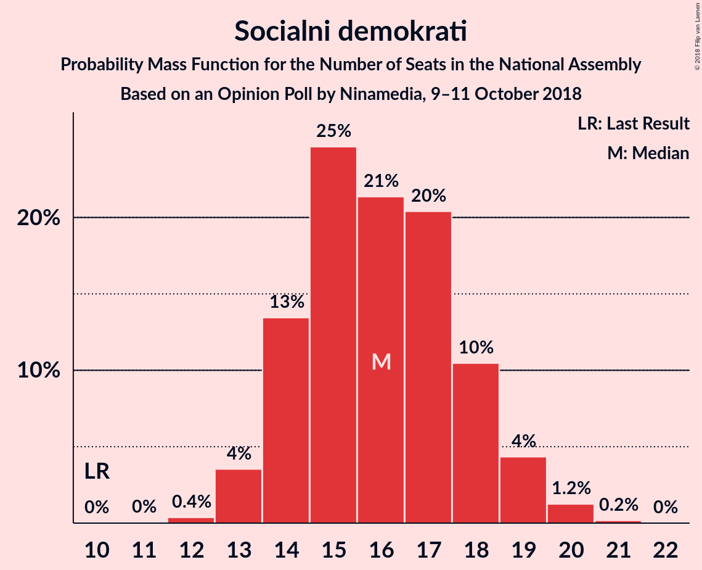
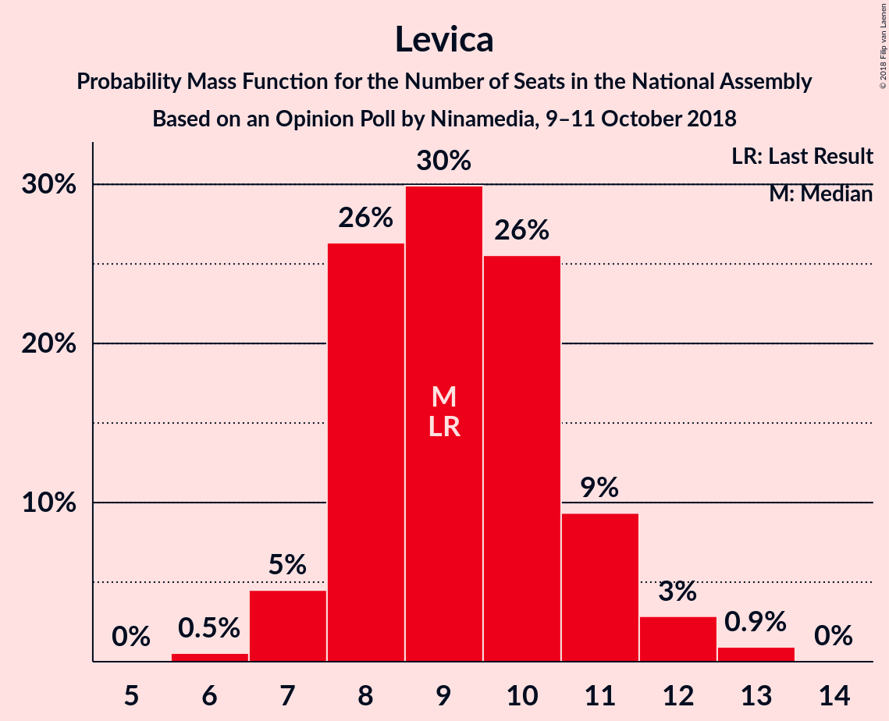
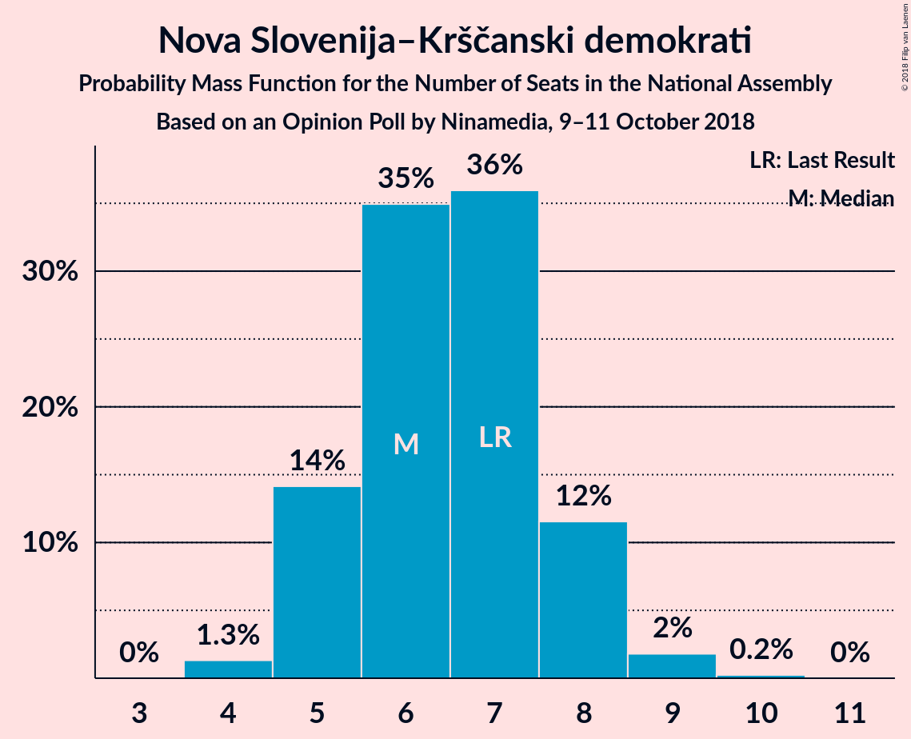
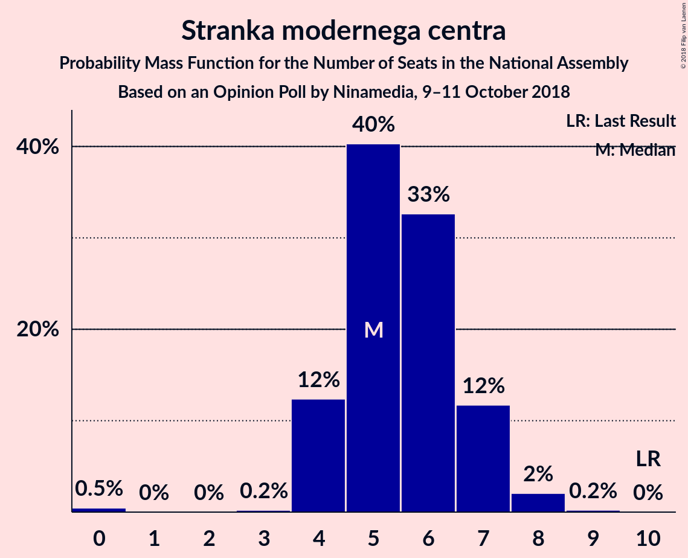
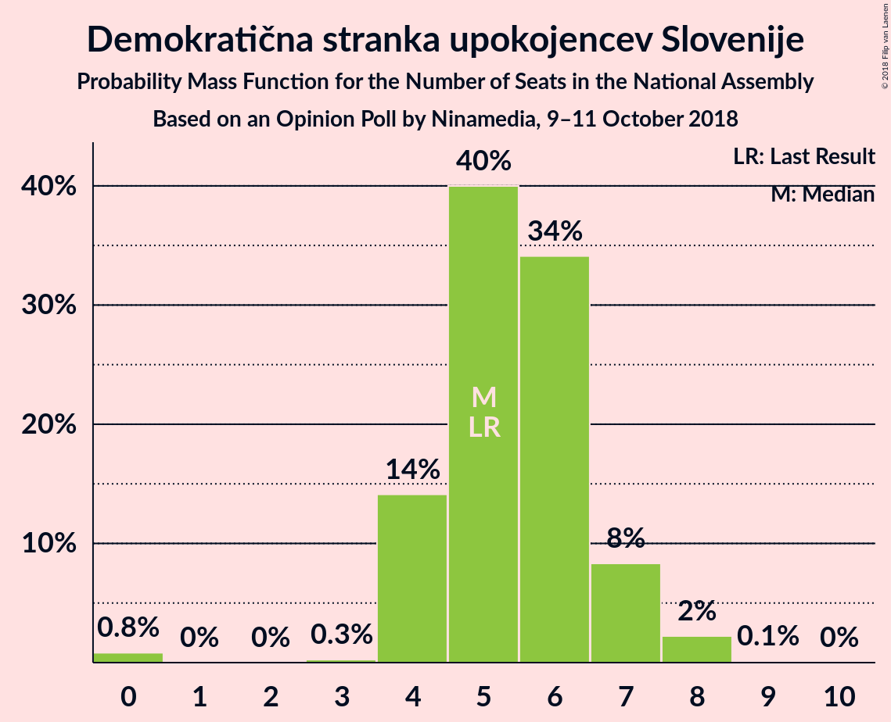
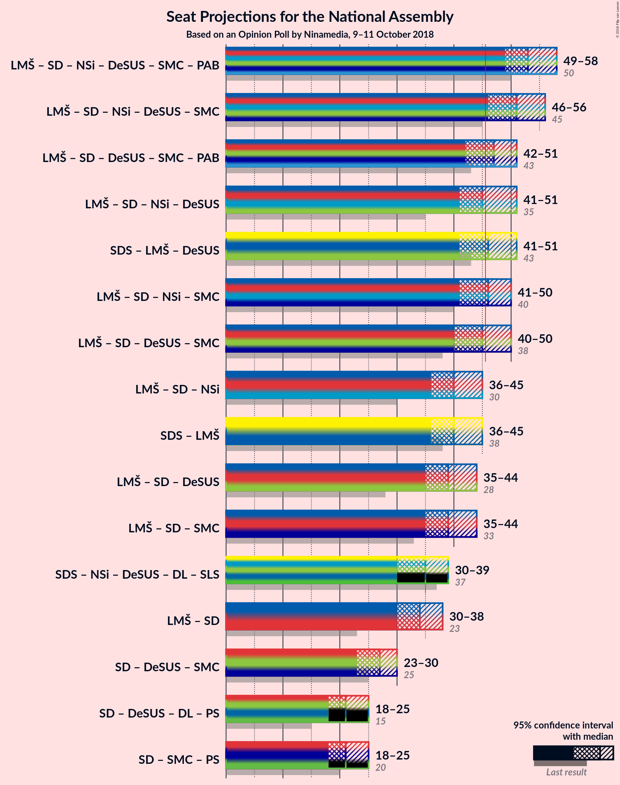

# Opinion Poll by Ninamedia, 9–11 October 2018

<a href="#voting-intentions">Voting Intentions</a> | <a href="#seats">Seats</a> | <a href="#coalitions">Coalitions</a> | <a href="#technical-information">Technical Information</a>

## Voting Intentions

### Confidence Intervals

| Party | Last Result | Poll Result | 80% Confidence Interval | 90% Confidence Interval | 95% Confidence Interval | 99% Confidence Interval |
|:-----:|:-----------:|:-----------:|:-----------------------:|:-----------------------:|:-----------------------:|:-----------------------:|
| Slovenska demokratska stranka | 24.9% | 24.0% | 22.0–26.2% |21.5–26.8% |21.0–27.3% |20.1–28.4% |
| Lista Marjana Šarca | 12.6% | 19.0% | 17.2–21.0% |16.7–21.6% |16.3–22.1% |15.4–23.1% |
| Socialni demokrati | 9.9% | 17.0% | 15.3–18.9% |14.8–19.5% |14.4–20.0% |13.6–20.9% |
| Levica | 9.3% | 10.0% | 8.7–11.6% |8.3–12.1% |8.0–12.5% |7.4–13.3% |
| Nova Slovenija–Krščanski demokrati | 7.2% | 7.0% | 5.9–8.4% |5.6–8.8% |5.3–9.1% |4.8–9.8% |
| Stranka modernega centra | 9.7% | 6.0% | 5.0–7.3% |4.7–7.7% |4.5–8.0% |4.0–8.7% |
| Demokratična stranka upokojencev Slovenije | 4.9% | 6.0% | 5.0–7.3% |4.7–7.7% |4.5–8.0% |4.0–8.7% |
| Stranka Alenke Bratušek | 5.1% | 4.0% | 3.2–5.1% |3.0–5.4% |2.8–5.7% |2.4–6.3% |
| Slovenska nacionalna stranka | 4.2% | 3.0% | 2.3–4.0% |2.1–4.3% |2.0–4.6% |1.7–5.1% |

*Note:* The poll result column reflects the actual value used in the calculations. Published results may vary slightly, and in addition be rounded to fewer digits.

## Seats

### Confidence Intervals

| Party | Last Result | Median | 80% Confidence Interval | 90% Confidence Interval | 95% Confidence Interval | 99% Confidence Interval |
|:-----:|:-----------:|:------:|:-----------------------:|:-----------------------:|:-----------------------:|:-----------------------:|
| <a href="#slovenska-demokratska-stranka">Slovenska demokratska stranka</a> | 25 | 23 | 21–25 |20–26 |19–27 |18–28 |
| <a href="#lista-marjana-šarca">Lista Marjana Šarca</a> | 13 | 18 | 16–20 |15–21 |15–22 |14–22 |
| <a href="#socialni-demokrati">Socialni demokrati</a> | 10 | 16 | 14–18 |14–19 |13–19 |13–20 |
| <a href="#levica">Levica</a> | 9 | 9 | 8–11 |7–11 |7–12 |6–13 |
| <a href="#nova-slovenija–krščanski-demokrati">Nova Slovenija–Krščanski demokrati</a> | 7 | 6 | 5–8 |5–8 |5–8 |4–9 |
| <a href="#stranka-modernega-centra">Stranka modernega centra</a> | 10 | 5 | 4–7 |4–7 |4–7 |3–8 |
| <a href="#demokratična-stranka-upokojencev-slovenije">Demokratična stranka upokojencev Slovenije</a> | 5 | 5 | 4–7 |4–7 |4–7 |0–8 |
| <a href="#stranka-alenke-bratušek">Stranka Alenke Bratušek</a> | 5 | 3 | 0–5 |0–5 |0–5 |0–6 |
| <a href="#slovenska-nacionalna-stranka">Slovenska nacionalna stranka</a> | 4 | 0 | 0–3 |0–4 |0–4 |0–4 |

### Slovenska demokratska stranka

*For a full overview of the results for this party, see the [Slovenska demokratska stranka](party-slovenskademokratskastranka.html) page.*

| Number of Seats | Probability | Accumulated | Special Marks |
|:---------------:|:-----------:|:-----------:|:-------------:|
| 17 | 0% | 100% |  |
| 18 | 0.6% | 99.9% |  |
| 19 | 2% | 99.4% |  |
| 20 | 7% | 97% |  |
| 21 | 13% | 91% |  |
| 22 | 25% | 78% |  |
| 23 | 19% | 52% | Median |
| 24 | 14% | 34% |  |
| 25 | 11% | 19% | Last Result |
| 26 | 5% | 9% |  |
| 27 | 3% | 4% |  |
| 28 | 0.4% | 0.5% |  |
| 29 | 0.1% | 0.1% |  |
| 30 | 0% | 0% |  |

### Lista Marjana Šarca

*For a full overview of the results for this party, see the [Lista Marjana Šarca](party-listamarjanašarca.html) page.*

| Number of Seats | Probability | Accumulated | Special Marks |
|:---------------:|:-----------:|:-----------:|:-------------:|
| 13 | 0.1% | 100% | Last Result |
| 14 | 1.0% | 99.9% |  |
| 15 | 8% | 98.9% |  |
| 16 | 16% | 91% |  |
| 17 | 20% | 75% |  |
| 18 | 25% | 56% | Median |
| 19 | 16% | 31% |  |
| 20 | 8% | 15% |  |
| 21 | 4% | 7% |  |
| 22 | 3% | 3% |  |
| 23 | 0.3% | 0.4% |  |
| 24 | 0% | 0.1% |  |
| 25 | 0% | 0% |  |

### Socialni demokrati

*For a full overview of the results for this party, see the [Socialni demokrati](party-socialnidemokrati.html) page.*

| Number of Seats | Probability | Accumulated | Special Marks |
|:---------------:|:-----------:|:-----------:|:-------------:|
| 10 | 0% | 100% | Last Result |
| 11 | 0% | 100% |  |
| 12 | 0.4% | 100% |  |
| 13 | 4% | 99.6% |  |
| 14 | 13% | 96% |  |
| 15 | 25% | 83% |  |
| 16 | 21% | 58% | Median |
| 17 | 20% | 37% |  |
| 18 | 10% | 16% |  |
| 19 | 4% | 6% |  |
| 20 | 1.2% | 1.4% |  |
| 21 | 0.2% | 0.2% |  |
| 22 | 0% | 0% |  |

### Levica

*For a full overview of the results for this party, see the [Levica](party-levica.html) page.*

| Number of Seats | Probability | Accumulated | Special Marks |
|:---------------:|:-----------:|:-----------:|:-------------:|
| 6 | 0.5% | 100% |  |
| 7 | 5% | 99.5% |  |
| 8 | 26% | 95% |  |
| 9 | 30% | 69% | Last Result, Median |
| 10 | 26% | 39% |  |
| 11 | 9% | 13% |  |
| 12 | 3% | 4% |  |
| 13 | 0.9% | 1.0% |  |
| 14 | 0% | 0% |  |

### Nova Slovenija–Krščanski demokrati

*For a full overview of the results for this party, see the [Nova Slovenija–Krščanski demokrati](party-novaslovenija–krščanskidemokrati.html) page.*

| Number of Seats | Probability | Accumulated | Special Marks |
|:---------------:|:-----------:|:-----------:|:-------------:|
| 4 | 1.3% | 100% |  |
| 5 | 14% | 98.7% |  |
| 6 | 35% | 85% | Median |
| 7 | 36% | 50% | Last Result |
| 8 | 12% | 14% |  |
| 9 | 2% | 2% |  |
| 10 | 0.2% | 0.3% |  |
| 11 | 0% | 0% |  |

### Stranka modernega centra

*For a full overview of the results for this party, see the [Stranka modernega centra](party-strankamodernegacentra.html) page.*

| Number of Seats | Probability | Accumulated | Special Marks |
|:---------------:|:-----------:|:-----------:|:-------------:|
| 0 | 0.5% | 100% |  |
| 1 | 0% | 99.5% |  |
| 2 | 0% | 99.5% |  |
| 3 | 0.2% | 99.5% |  |
| 4 | 12% | 99.3% |  |
| 5 | 40% | 87% | Median |
| 6 | 33% | 47% |  |
| 7 | 12% | 14% |  |
| 8 | 2% | 2% |  |
| 9 | 0.2% | 0.2% |  |
| 10 | 0% | 0% | Last Result |

### Demokratična stranka upokojencev Slovenije

*For a full overview of the results for this party, see the [Demokratična stranka upokojencev Slovenije](party-demokratičnastrankaupokojencevslovenije.html) page.*

| Number of Seats | Probability | Accumulated | Special Marks |
|:---------------:|:-----------:|:-----------:|:-------------:|
| 0 | 0.8% | 100% |  |
| 1 | 0% | 99.2% |  |
| 2 | 0% | 99.2% |  |
| 3 | 0.3% | 99.2% |  |
| 4 | 14% | 98.9% |  |
| 5 | 40% | 85% | Last Result, Median |
| 6 | 34% | 45% |  |
| 7 | 8% | 11% |  |
| 8 | 2% | 2% |  |
| 9 | 0.1% | 0.1% |  |
| 10 | 0% | 0% |  |

### Stranka Alenke Bratušek

*For a full overview of the results for this party, see the [Stranka Alenke Bratušek](party-strankaalenkebratušek.html) page.*

| Number of Seats | Probability | Accumulated | Special Marks |
|:---------------:|:-----------:|:-----------:|:-------------:|
| 0 | 47% | 100% |  |
| 1 | 0% | 53% |  |
| 2 | 0% | 53% |  |
| 3 | 7% | 53% | Median |
| 4 | 36% | 46% |  |
| 5 | 9% | 10% | Last Result |
| 6 | 0.8% | 0.8% |  |
| 7 | 0% | 0% |  |

### Slovenska nacionalna stranka

*For a full overview of the results for this party, see the [Slovenska nacionalna stranka](party-slovenskanacionalnastranka.html) page.*

| Number of Seats | Probability | Accumulated | Special Marks |
|:---------------:|:-----------:|:-----------:|:-------------:|
| 0 | 85% | 100% | Median |
| 1 | 0% | 15% |  |
| 2 | 0% | 15% |  |
| 3 | 6% | 15% |  |
| 4 | 8% | 9% | Last Result |
| 5 | 0.3% | 0.3% |  |
| 6 | 0% | 0% |  |

## Coalitions

### Confidence Intervals

| Coalition | Last Result | Median | Majority? | 80% Confidence Interval | 90% Confidence Interval | 95% Confidence Interval | 99% Confidence Interval |
|:---------:|:-----------:|:------:|:---------:|:-----------------------:|:-----------------------:|:-----------------------:|:-----------------------:|
| Lista Marjana Šarca – Socialni demokrati – Nova Slovenija–Krščanski demokrati – Demokratična stranka upokojencev Slovenije – Stranka modernega centra – Stranka Alenke Bratušek | 50 | 53 | 100% | 50–56 | 49–58 | 49–58 | 47–59 |
| Lista Marjana Šarca – Socialni demokrati – Nova Slovenija–Krščanski demokrati – Demokratična stranka upokojencev Slovenije – Stranka modernega centra | 45 | 51 | 99.1% | 48–55 | 47–56 | 46–56 | 45–58 |
| Lista Marjana Šarca – Socialni demokrati – Demokratična stranka upokojencev Slovenije – Stranka modernega centra – Stranka Alenke Bratušek | 43 | 47 | 73% | 43–50 | 43–51 | 42–51 | 41–53 |
| Lista Marjana Šarca – Socialni demokrati – Nova Slovenija–Krščanski demokrati – Demokratična stranka upokojencev Slovenije | 35 | 45 | 47% | 43–49 | 42–50 | 41–51 | 40–52 |
| Slovenska demokratska stranka – Lista Marjana Šarca – Demokratična stranka upokojencev Slovenije | 43 | 46 | 59% | 43–49 | 42–50 | 41–51 | 40–53 |
| Lista Marjana Šarca – Socialni demokrati – Nova Slovenija–Krščanski demokrati – Stranka modernega centra | 40 | 46 | 52% | 43–49 | 42–50 | 41–50 | 40–52 |
| Lista Marjana Šarca – Socialni demokrati – Demokratična stranka upokojencev Slovenije – Stranka modernega centra | 38 | 45 | 36% | 42–48 | 41–49 | 40–50 | 39–51 |
| Lista Marjana Šarca – Socialni demokrati – Nova Slovenija–Krščanski demokrati | 30 | 40 | 1.1% | 37–43 | 37–44 | 36–45 | 35–46 |
| Slovenska demokratska stranka – Lista Marjana Šarca | 38 | 40 | 2% | 38–44 | 37–45 | 36–45 | 35–47 |
| Lista Marjana Šarca – Socialni demokrati – Demokratična stranka upokojencev Slovenije | 28 | 39 | 0.6% | 36–42 | 36–44 | 35–44 | 34–46 |
| Lista Marjana Šarca – Socialni demokrati – Stranka modernega centra | 33 | 39 | 0.2% | 36–42 | 36–43 | 35–44 | 34–45 |
| Lista Marjana Šarca – Socialni demokrati | 23 | 34 | 0% | 31–37 | 31–38 | 30–38 | 29–39 |
| Socialni demokrati – Demokratična stranka upokojencev Slovenije – Stranka modernega centra | 25 | 27 | 0% | 24–30 | 23–30 | 23–30 | 22–32 |

### Lista Marjana Šarca – Socialni demokrati – Nova Slovenija–Krščanski demokrati – Demokratična stranka upokojencev Slovenije – Stranka modernega centra – Stranka Alenke Bratušek

| Number of Seats | Probability | Accumulated | Special Marks |
|:---------------:|:-----------:|:-----------:|:-------------:|
| 46 | 0.2% | 100% | Majority |
| 47 | 0.6% | 99.8% |  |
| 48 | 1.5% | 99.2% |  |
| 49 | 4% | 98% |  |
| 50 | 9% | 93% | Last Result |
| 51 | 8% | 84% |  |
| 52 | 10% | 76% |  |
| 53 | 23% | 66% | Median |
| 54 | 15% | 44% |  |
| 55 | 9% | 29% |  |
| 56 | 10% | 20% |  |
| 57 | 4% | 10% |  |
| 58 | 4% | 5% |  |
| 59 | 1.0% | 1.3% |  |
| 60 | 0.3% | 0.4% |  |
| 61 | 0.1% | 0.1% |  |
| 62 | 0% | 0% |  |

### Lista Marjana Šarca – Socialni demokrati – Nova Slovenija–Krščanski demokrati – Demokratična stranka upokojencev Slovenije – Stranka modernega centra

| Number of Seats | Probability | Accumulated | Special Marks |
|:---------------:|:-----------:|:-----------:|:-------------:|
| 43 | 0.1% | 100% |  |
| 44 | 0.1% | 99.9% |  |
| 45 | 0.7% | 99.8% | Last Result |
| 46 | 2% | 99.1% | Majority |
| 47 | 4% | 97% |  |
| 48 | 6% | 92% |  |
| 49 | 15% | 86% |  |
| 50 | 16% | 71% | Median |
| 51 | 12% | 55% |  |
| 52 | 12% | 43% |  |
| 53 | 12% | 31% |  |
| 54 | 8% | 19% |  |
| 55 | 6% | 11% |  |
| 56 | 3% | 5% |  |
| 57 | 1.3% | 2% |  |
| 58 | 0.5% | 0.6% |  |
| 59 | 0.1% | 0.1% |  |
| 60 | 0% | 0% |  |

### Lista Marjana Šarca – Socialni demokrati – Demokratična stranka upokojencev Slovenije – Stranka modernega centra – Stranka Alenke Bratušek

| Number of Seats | Probability | Accumulated | Special Marks |
|:---------------:|:-----------:|:-----------:|:-------------:|
| 39 | 0.1% | 100% |  |
| 40 | 0.3% | 99.9% |  |
| 41 | 0.9% | 99.7% |  |
| 42 | 2% | 98.8% |  |
| 43 | 8% | 97% | Last Result |
| 44 | 6% | 89% |  |
| 45 | 10% | 83% |  |
| 46 | 18% | 73% | Majority |
| 47 | 19% | 55% | Median |
| 48 | 12% | 36% |  |
| 49 | 11% | 24% |  |
| 50 | 7% | 13% |  |
| 51 | 4% | 6% |  |
| 52 | 1.4% | 2% |  |
| 53 | 0.4% | 0.5% |  |
| 54 | 0.1% | 0.2% |  |
| 55 | 0.1% | 0.1% |  |
| 56 | 0% | 0% |  |

### Lista Marjana Šarca – Socialni demokrati – Nova Slovenija–Krščanski demokrati – Demokratična stranka upokojencev Slovenije

| Number of Seats | Probability | Accumulated | Special Marks |
|:---------------:|:-----------:|:-----------:|:-------------:|
| 35 | 0% | 100% | Last Result |
| 36 | 0% | 100% |  |
| 37 | 0% | 100% |  |
| 38 | 0.1% | 100% |  |
| 39 | 0.3% | 99.9% |  |
| 40 | 0.7% | 99.6% |  |
| 41 | 2% | 98.9% |  |
| 42 | 5% | 97% |  |
| 43 | 10% | 91% |  |
| 44 | 16% | 81% |  |
| 45 | 17% | 64% | Median |
| 46 | 15% | 47% | Majority |
| 47 | 8% | 33% |  |
| 48 | 11% | 24% |  |
| 49 | 5% | 13% |  |
| 50 | 4% | 8% |  |
| 51 | 2% | 3% |  |
| 52 | 1.0% | 1.3% |  |
| 53 | 0.3% | 0.4% |  |
| 54 | 0% | 0.1% |  |
| 55 | 0% | 0% |  |

### Slovenska demokratska stranka – Lista Marjana Šarca – Demokratična stranka upokojencev Slovenije

| Number of Seats | Probability | Accumulated | Special Marks |
|:---------------:|:-----------:|:-----------:|:-------------:|
| 39 | 0.2% | 100% |  |
| 40 | 0.8% | 99.8% |  |
| 41 | 2% | 99.0% |  |
| 42 | 4% | 97% |  |
| 43 | 9% | 94% | Last Result |
| 44 | 10% | 84% |  |
| 45 | 16% | 74% |  |
| 46 | 24% | 59% | Median, Majority |
| 47 | 9% | 35% |  |
| 48 | 10% | 26% |  |
| 49 | 7% | 16% |  |
| 50 | 5% | 9% |  |
| 51 | 2% | 4% |  |
| 52 | 2% | 2% |  |
| 53 | 0.5% | 0.6% |  |
| 54 | 0.1% | 0.1% |  |
| 55 | 0% | 0% |  |

### Lista Marjana Šarca – Socialni demokrati – Nova Slovenija–Krščanski demokrati – Stranka modernega centra

| Number of Seats | Probability | Accumulated | Special Marks |
|:---------------:|:-----------:|:-----------:|:-------------:|
| 38 | 0.1% | 100% |  |
| 39 | 0.2% | 99.9% |  |
| 40 | 1.0% | 99.7% | Last Result |
| 41 | 3% | 98.7% |  |
| 42 | 4% | 96% |  |
| 43 | 13% | 92% |  |
| 44 | 13% | 79% |  |
| 45 | 14% | 66% | Median |
| 46 | 18% | 52% | Majority |
| 47 | 7% | 34% |  |
| 48 | 12% | 27% |  |
| 49 | 7% | 15% |  |
| 50 | 5% | 7% |  |
| 51 | 2% | 2% |  |
| 52 | 0.6% | 0.7% |  |
| 53 | 0.1% | 0.2% |  |
| 54 | 0.1% | 0.1% |  |
| 55 | 0% | 0% |  |

### Lista Marjana Šarca – Socialni demokrati – Demokratična stranka upokojencev Slovenije – Stranka modernega centra

| Number of Seats | Probability | Accumulated | Special Marks |
|:---------------:|:-----------:|:-----------:|:-------------:|
| 37 | 0.1% | 100% |  |
| 38 | 0.1% | 99.9% | Last Result |
| 39 | 1.0% | 99.8% |  |
| 40 | 3% | 98.8% |  |
| 41 | 6% | 96% |  |
| 42 | 12% | 90% |  |
| 43 | 18% | 79% |  |
| 44 | 10% | 61% | Median |
| 45 | 14% | 51% |  |
| 46 | 10% | 36% | Majority |
| 47 | 14% | 26% |  |
| 48 | 6% | 12% |  |
| 49 | 3% | 6% |  |
| 50 | 2% | 3% |  |
| 51 | 0.7% | 1.0% |  |
| 52 | 0.2% | 0.3% |  |
| 53 | 0% | 0% |  |

### Lista Marjana Šarca – Socialni demokrati – Nova Slovenija–Krščanski demokrati

| Number of Seats | Probability | Accumulated | Special Marks |
|:---------------:|:-----------:|:-----------:|:-------------:|
| 30 | 0% | 100% | Last Result |
| 31 | 0% | 100% |  |
| 32 | 0% | 100% |  |
| 33 | 0.1% | 100% |  |
| 34 | 0.3% | 99.9% |  |
| 35 | 1.1% | 99.6% |  |
| 36 | 2% | 98.6% |  |
| 37 | 7% | 96% |  |
| 38 | 15% | 89% |  |
| 39 | 14% | 74% |  |
| 40 | 16% | 59% | Median |
| 41 | 17% | 44% |  |
| 42 | 8% | 27% |  |
| 43 | 9% | 19% |  |
| 44 | 5% | 10% |  |
| 45 | 4% | 5% |  |
| 46 | 0.6% | 1.1% | Majority |
| 47 | 0.3% | 0.4% |  |
| 48 | 0% | 0.1% |  |
| 49 | 0% | 0.1% |  |
| 50 | 0% | 0% |  |

### Slovenska demokratska stranka – Lista Marjana Šarca

| Number of Seats | Probability | Accumulated | Special Marks |
|:---------------:|:-----------:|:-----------:|:-------------:|
| 34 | 0.2% | 100% |  |
| 35 | 0.6% | 99.8% |  |
| 36 | 2% | 99.2% |  |
| 37 | 5% | 97% |  |
| 38 | 9% | 92% | Last Result |
| 39 | 14% | 83% |  |
| 40 | 21% | 69% |  |
| 41 | 17% | 48% | Median |
| 42 | 10% | 31% |  |
| 43 | 9% | 21% |  |
| 44 | 6% | 12% |  |
| 45 | 4% | 6% |  |
| 46 | 0.7% | 2% | Majority |
| 47 | 1.1% | 1.2% |  |
| 48 | 0.1% | 0.1% |  |
| 49 | 0% | 0% |  |

### Lista Marjana Šarca – Socialni demokrati – Demokratična stranka upokojencev Slovenije

| Number of Seats | Probability | Accumulated | Special Marks |
|:---------------:|:-----------:|:-----------:|:-------------:|
| 28 | 0% | 100% | Last Result |
| 29 | 0% | 100% |  |
| 30 | 0% | 100% |  |
| 31 | 0% | 100% |  |
| 32 | 0.1% | 100% |  |
| 33 | 0.2% | 99.9% |  |
| 34 | 1.0% | 99.7% |  |
| 35 | 3% | 98.7% |  |
| 36 | 8% | 96% |  |
| 37 | 15% | 88% |  |
| 38 | 18% | 72% |  |
| 39 | 12% | 55% | Median |
| 40 | 17% | 43% |  |
| 41 | 9% | 26% |  |
| 42 | 8% | 18% |  |
| 43 | 4% | 9% |  |
| 44 | 3% | 5% |  |
| 45 | 2% | 2% |  |
| 46 | 0.4% | 0.6% | Majority |
| 47 | 0.1% | 0.2% |  |
| 48 | 0% | 0% |  |

### Lista Marjana Šarca – Socialni demokrati – Stranka modernega centra

| Number of Seats | Probability | Accumulated | Special Marks |
|:---------------:|:-----------:|:-----------:|:-------------:|
| 33 | 0.2% | 100% | Last Result |
| 34 | 1.0% | 99.8% |  |
| 35 | 2% | 98.8% |  |
| 36 | 10% | 96% |  |
| 37 | 13% | 87% |  |
| 38 | 15% | 73% |  |
| 39 | 14% | 58% | Median |
| 40 | 15% | 44% |  |
| 41 | 8% | 29% |  |
| 42 | 12% | 21% |  |
| 43 | 6% | 9% |  |
| 44 | 2% | 3% |  |
| 45 | 0.6% | 0.8% |  |
| 46 | 0.2% | 0.2% | Majority |
| 47 | 0% | 0.1% |  |
| 48 | 0% | 0% |  |

### Lista Marjana Šarca – Socialni demokrati

| Number of Seats | Probability | Accumulated | Special Marks |
|:---------------:|:-----------:|:-----------:|:-------------:|
| 23 | 0% | 100% | Last Result |
| 24 | 0% | 100% |  |
| 25 | 0% | 100% |  |
| 26 | 0% | 100% |  |
| 27 | 0% | 100% |  |
| 28 | 0.2% | 100% |  |
| 29 | 0.9% | 99.7% |  |
| 30 | 3% | 98.8% |  |
| 31 | 14% | 96% |  |
| 32 | 14% | 82% |  |
| 33 | 17% | 68% |  |
| 34 | 15% | 51% | Median |
| 35 | 14% | 36% |  |
| 36 | 9% | 21% |  |
| 37 | 6% | 12% |  |
| 38 | 5% | 7% |  |
| 39 | 0.9% | 1.4% |  |
| 40 | 0.3% | 0.5% |  |
| 41 | 0.1% | 0.2% |  |
| 42 | 0% | 0% |  |

### Socialni demokrati – Demokratična stranka upokojencev Slovenije – Stranka modernega centra

| Number of Seats | Probability | Accumulated | Special Marks |
|:---------------:|:-----------:|:-----------:|:-------------:|
| 20 | 0.1% | 100% |  |
| 21 | 0.3% | 99.9% |  |
| 22 | 1.2% | 99.6% |  |
| 23 | 4% | 98% |  |
| 24 | 10% | 95% |  |
| 25 | 10% | 85% | Last Result |
| 26 | 18% | 75% | Median |
| 27 | 19% | 56% |  |
| 28 | 12% | 37% |  |
| 29 | 15% | 25% |  |
| 30 | 8% | 10% |  |
| 31 | 2% | 2% |  |
| 32 | 0.6% | 0.7% |  |
| 33 | 0.1% | 0.2% |  |
| 34 | 0% | 0% |  |

## Technical Information

### Opinion Poll

+ **Polling firm:** Ninamedia
+ **Commissioner(s):** —
+ **Fieldwork period:** 9–11 October 2018

### Calculations

+ **Sample size:** 700
+ **Simulations done:** 1,048,576
+ **Error estimate:** 2.13%

