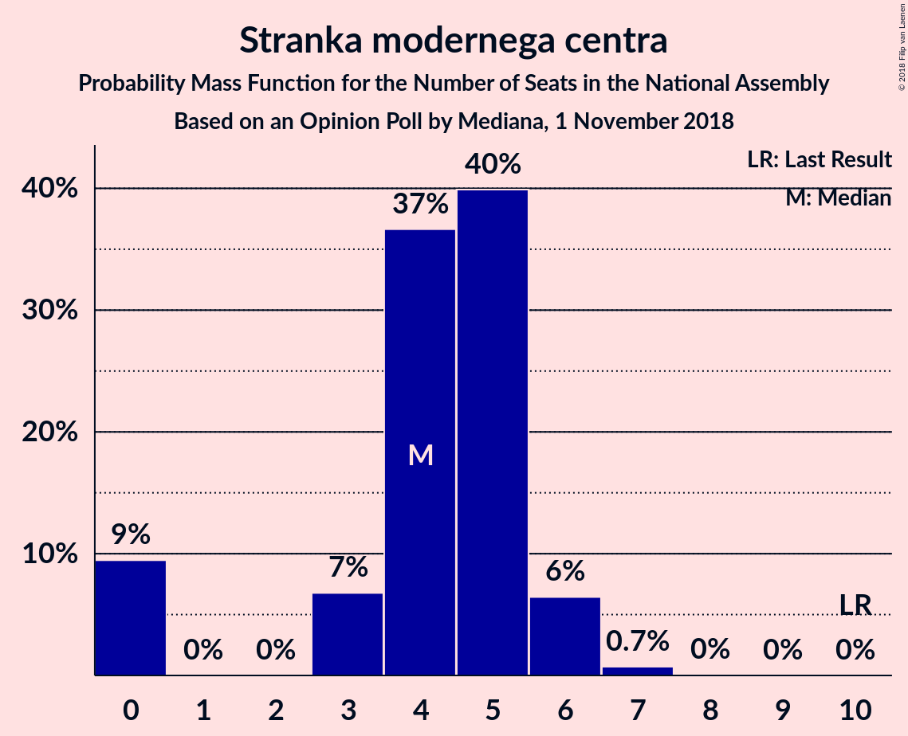
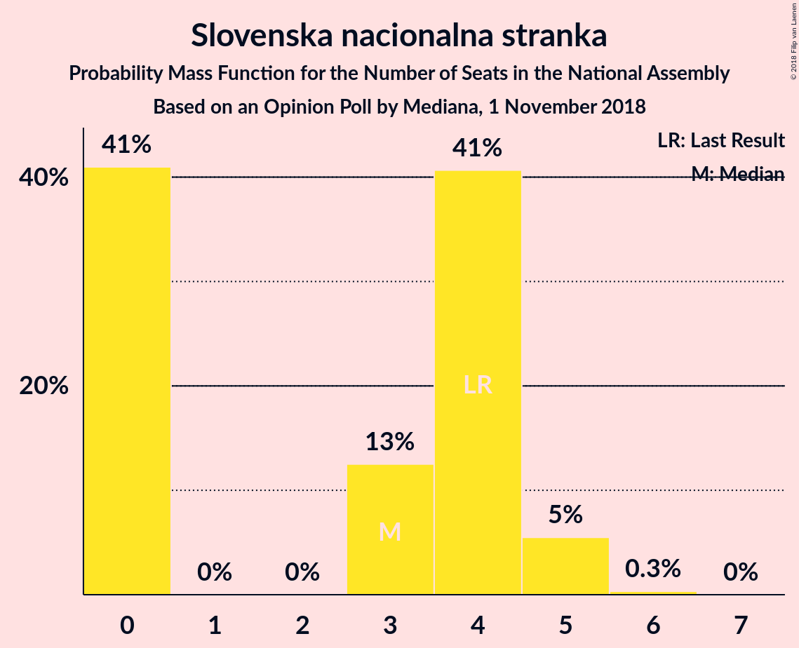
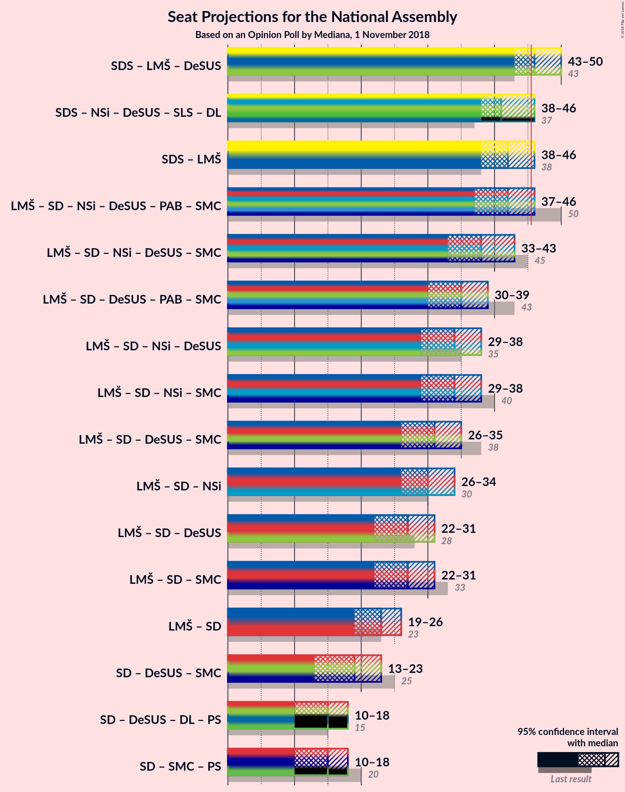

# Opinion Poll by Mediana, 1 November 2018

<a href="#voting-intentions">Voting Intentions</a> | <a href="#seats">Seats</a> | <a href="#coalitions">Coalitions</a> | <a href="#technical-information">Technical Information</a>

## Voting Intentions

### Confidence Intervals

| Party | Last Result | Poll Result | 80% Confidence Interval | 90% Confidence Interval | 95% Confidence Interval | 99% Confidence Interval |
|:-----:|:-----------:|:-----------:|:-----------------------:|:-----------------------:|:-----------------------:|:-----------------------:|
| Slovenska demokratska stranka | 24.9% | 31.0% | 28.9–33.3% |28.3–33.9% |27.8–34.5% |26.8–35.6% |
| Lista Marjana Šarca | 12.6% | 13.0% | 11.5–14.7% |11.1–15.2% |10.7–15.6% |10.0–16.5% |
| Socialni demokrati | 9.9% | 11.0% | 9.7–12.7% |9.3–13.1% |8.9–13.5% |8.3–14.3% |
| Levica | 9.3% | 10.1% | 8.8–11.6% |8.4–12.1% |8.1–12.5% |7.5–13.3% |
| Nova Slovenija–Krščanski demokrati | 7.2% | 8.0% | 6.8–9.4% |6.5–9.8% |6.2–10.2% |5.7–10.9% |
| Stranka modernega centra | 9.7% | 5.0% | 4.1–6.2% |3.8–6.5% |3.6–6.8% |3.2–7.4% |
| Stranka Alenke Bratušek | 5.1% | 5.0% | 4.1–6.2% |3.8–6.5% |3.6–6.8% |3.2–7.4% |
| Demokratična stranka upokojencev Slovenije | 4.9% | 5.0% | 4.1–6.2% |3.8–6.5% |3.6–6.8% |3.2–7.4% |
| Slovenska nacionalna stranka | 4.2% | 4.0% | 3.2–5.1% |3.0–5.4% |2.8–5.7% |2.5–6.3% |
| Slovenska ljudska stranka | 2.6% | 3.0% | 2.4–4.0% |2.2–4.3% |2.0–4.6% |1.7–5.1% |

*Note:* The poll result column reflects the actual value used in the calculations. Published results may vary slightly, and in addition be rounded to fewer digits.

## Seats

### Confidence Intervals

| Party | Last Result | Median | 80% Confidence Interval | 90% Confidence Interval | 95% Confidence Interval | 99% Confidence Interval |
|:-----:|:-----------:|:------:|:-----------------------:|:-----------------------:|:-----------------------:|:-----------------------:|
| <a href="#slovenska-demokratska-stranka">Slovenska demokratska stranka</a> | 25 | 29 | 28–33 |27–33 |27–33 |25–36 |
| <a href="#lista-marjana-šarca">Lista Marjana Šarca</a> | 13 | 11 | 10–14 |10–14 |10–15 |9–16 |
| <a href="#socialni-demokrati">Socialni demokrati</a> | 10 | 10 | 9–12 |9–12 |8–13 |8–13 |
| <a href="#levica">Levica</a> | 9 | 10 | 8–11 |8–11 |7–11 |7–12 |
| <a href="#nova-slovenija–krščanski-demokrati">Nova Slovenija–Krščanski demokrati</a> | 7 | 8 | 7–8 |6–9 |6–9 |6–10 |
| <a href="#stranka-modernega-centra">Stranka modernega centra</a> | 10 | 5 | 0–5 |0–6 |0–6 |0–7 |
| <a href="#stranka-alenke-bratušek">Stranka Alenke Bratušek</a> | 5 | 4 | 4–5 |0–6 |0–6 |0–6 |
| <a href="#demokratična-stranka-upokojencev-slovenije">Demokratična stranka upokojencev Slovenije</a> | 5 | 4 | 0–5 |0–6 |0–6 |0–7 |
| <a href="#slovenska-nacionalna-stranka">Slovenska nacionalna stranka</a> | 4 | 4 | 0–4 |0–5 |0–5 |0–5 |
| <a href="#slovenska-ljudska-stranka">Slovenska ljudska stranka</a> | 0 | 0 | 0–4 |0–4 |0–4 |0–5 |

### Slovenska demokratska stranka

*For a full overview of the results for this party, see the [Slovenska demokratska stranka](party-slovenskademokratskastranka.html) page.*

| Number of Seats | Probability | Accumulated | Special Marks |
|:---------------:|:-----------:|:-----------:|:-------------:|
| 24 | 0.1% | 100% |  |
| 25 | 0.5% | 99.9% | Last Result |
| 26 | 2% | 99.4% |  |
| 27 | 4% | 98% |  |
| 28 | 29% | 94% |  |
| 29 | 22% | 64% | Median |
| 30 | 6% | 42% |  |
| 31 | 18% | 36% |  |
| 32 | 6% | 17% |  |
| 33 | 9% | 11% |  |
| 34 | 1.3% | 2% |  |
| 35 | 0.1% | 0.6% |  |
| 36 | 0.6% | 0.6% |  |
| 37 | 0% | 0% |  |

### Lista Marjana Šarca

*For a full overview of the results for this party, see the [Lista Marjana Šarca](party-listamarjanašarca.html) page.*

| Number of Seats | Probability | Accumulated | Special Marks |
|:---------------:|:-----------:|:-----------:|:-------------:|
| 9 | 1.2% | 100% |  |
| 10 | 16% | 98.7% |  |
| 11 | 34% | 82% | Median |
| 12 | 27% | 49% |  |
| 13 | 10% | 22% | Last Result |
| 14 | 8% | 12% |  |
| 15 | 4% | 4% |  |
| 16 | 0.5% | 0.6% |  |
| 17 | 0.1% | 0.1% |  |
| 18 | 0% | 0% |  |

### Socialni demokrati

*For a full overview of the results for this party, see the [Socialni demokrati](party-socialnidemokrati.html) page.*

| Number of Seats | Probability | Accumulated | Special Marks |
|:---------------:|:-----------:|:-----------:|:-------------:|
| 7 | 0.2% | 100% |  |
| 8 | 4% | 99.8% |  |
| 9 | 17% | 96% |  |
| 10 | 46% | 79% | Last Result, Median |
| 11 | 14% | 33% |  |
| 12 | 15% | 19% |  |
| 13 | 4% | 4% |  |
| 14 | 0.2% | 0.2% |  |
| 15 | 0% | 0% |  |

### Levica

*For a full overview of the results for this party, see the [Levica](party-levica.html) page.*

| Number of Seats | Probability | Accumulated | Special Marks |
|:---------------:|:-----------:|:-----------:|:-------------:|
| 6 | 0.1% | 100% |  |
| 7 | 4% | 99.9% |  |
| 8 | 16% | 96% |  |
| 9 | 24% | 80% | Last Result |
| 10 | 41% | 56% | Median |
| 11 | 14% | 15% |  |
| 12 | 1.4% | 2% |  |
| 13 | 0.2% | 0.2% |  |
| 14 | 0% | 0% |  |

### Nova Slovenija–Krščanski demokrati

*For a full overview of the results for this party, see the [Nova Slovenija–Krščanski demokrati](party-novaslovenija–krščanskidemokrati.html) page.*

| Number of Seats | Probability | Accumulated | Special Marks |
|:---------------:|:-----------:|:-----------:|:-------------:|
| 5 | 0.5% | 100% |  |
| 6 | 5% | 99.5% |  |
| 7 | 44% | 94% | Last Result |
| 8 | 44% | 50% | Median |
| 9 | 5% | 6% |  |
| 10 | 0.6% | 0.7% |  |
| 11 | 0.1% | 0.1% |  |
| 12 | 0% | 0% |  |

### Stranka modernega centra

*For a full overview of the results for this party, see the [Stranka modernega centra](party-strankamodernegacentra.html) page.*

| Number of Seats | Probability | Accumulated | Special Marks |
|:---------------:|:-----------:|:-----------:|:-------------:|
| 0 | 16% | 100% |  |
| 1 | 0% | 84% |  |
| 2 | 0% | 84% |  |
| 3 | 3% | 84% |  |
| 4 | 25% | 81% |  |
| 5 | 49% | 56% | Median |
| 6 | 5% | 7% |  |
| 7 | 2% | 2% |  |
| 8 | 0% | 0% |  |
| 9 | 0% | 0% |  |
| 10 | 0% | 0% | Last Result |

### Stranka Alenke Bratušek

*For a full overview of the results for this party, see the [Stranka Alenke Bratušek](party-strankaalenkebratušek.html) page.*

| Number of Seats | Probability | Accumulated | Special Marks |
|:---------------:|:-----------:|:-----------:|:-------------:|
| 0 | 6% | 100% |  |
| 1 | 0% | 94% |  |
| 2 | 0% | 94% |  |
| 3 | 2% | 94% |  |
| 4 | 63% | 91% | Median |
| 5 | 22% | 28% | Last Result |
| 6 | 6% | 6% |  |
| 7 | 0.2% | 0.2% |  |
| 8 | 0% | 0% |  |

### Demokratična stranka upokojencev Slovenije

*For a full overview of the results for this party, see the [Demokratična stranka upokojencev Slovenije](party-demokratičnastrankaupokojencevslovenije.html) page.*

| Number of Seats | Probability | Accumulated | Special Marks |
|:---------------:|:-----------:|:-----------:|:-------------:|
| 0 | 21% | 100% |  |
| 1 | 0% | 79% |  |
| 2 | 0% | 79% |  |
| 3 | 0% | 79% |  |
| 4 | 40% | 79% | Median |
| 5 | 33% | 39% | Last Result |
| 6 | 4% | 6% |  |
| 7 | 2% | 2% |  |
| 8 | 0% | 0% |  |

### Slovenska nacionalna stranka

*For a full overview of the results for this party, see the [Slovenska nacionalna stranka](party-slovenskanacionalnastranka.html) page.*

| Number of Seats | Probability | Accumulated | Special Marks |
|:---------------:|:-----------:|:-----------:|:-------------:|
| 0 | 26% | 100% |  |
| 1 | 0% | 74% |  |
| 2 | 0% | 74% |  |
| 3 | 7% | 74% |  |
| 4 | 62% | 67% | Last Result, Median |
| 5 | 5% | 6% |  |
| 6 | 0.2% | 0.3% |  |
| 7 | 0% | 0% |  |

### Slovenska ljudska stranka

*For a full overview of the results for this party, see the [Slovenska ljudska stranka](party-slovenskaljudskastranka.html) page.*

| Number of Seats | Probability | Accumulated | Special Marks |
|:---------------:|:-----------:|:-----------:|:-------------:|
| 0 | 88% | 100% | Last Result, Median |
| 1 | 0% | 12% |  |
| 2 | 0% | 12% |  |
| 3 | 1.3% | 12% |  |
| 4 | 10% | 11% |  |
| 5 | 1.0% | 1.0% |  |
| 6 | 0% | 0% |  |

## Coalitions

### Confidence Intervals

| Coalition | Last Result | Median | Majority? | 80% Confidence Interval | 90% Confidence Interval | 95% Confidence Interval | 99% Confidence Interval |
|:---------:|:-----------:|:------:|:---------:|:-----------------------:|:-----------------------:|:-----------------------:|:-----------------------:|
| Slovenska demokratska stranka – Lista Marjana Šarca – Demokratična stranka upokojencev Slovenije | 43 | 44 | 35% | 43–47 | 42–49 | 42–50 | 41–51 |
| Lista Marjana Šarca – Socialni demokrati – Nova Slovenija–Krščanski demokrati – Demokratična stranka upokojencev Slovenije – Stranka Alenke Bratušek – Stranka modernega centra | 50 | 42 | 7% | 38–45 | 36–46 | 36–47 | 35–48 |
| Slovenska demokratska stranka – Lista Marjana Šarca | 38 | 42 | 4% | 39–44 | 39–45 | 38–46 | 37–48 |
| Lista Marjana Šarca – Socialni demokrati – Nova Slovenija–Krščanski demokrati – Demokratična stranka upokojencev Slovenije – Stranka modernega centra | 45 | 38 | 0.1% | 33–41 | 32–42 | 32–42 | 30–43 |
| Lista Marjana Šarca – Socialni demokrati – Demokratična stranka upokojencev Slovenije – Stranka Alenke Bratušek – Stranka modernega centra | 43 | 35 | 0% | 30–36 | 29–38 | 28–39 | 28–40 |
| Lista Marjana Šarca – Socialni demokrati – Nova Slovenija–Krščanski demokrati – Stranka modernega centra | 40 | 33 | 0% | 30–37 | 30–38 | 29–38 | 28–39 |
| Lista Marjana Šarca – Socialni demokrati – Nova Slovenija–Krščanski demokrati – Demokratična stranka upokojencev Slovenije | 35 | 33 | 0% | 29–36 | 29–37 | 28–38 | 28–39 |
| Lista Marjana Šarca – Socialni demokrati – Nova Slovenija–Krščanski demokrati | 30 | 29 | 0% | 28–32 | 28–34 | 27–34 | 26–35 |
| Lista Marjana Šarca – Socialni demokrati – Demokratična stranka upokojencev Slovenije – Stranka modernega centra | 38 | 31 | 0% | 25–33 | 25–34 | 24–34 | 23–35 |
| Lista Marjana Šarca – Socialni demokrati – Stranka modernega centra | 33 | 26 | 0% | 22–30 | 22–30 | 22–30 | 22–31 |
| Lista Marjana Šarca – Socialni demokrati – Demokratična stranka upokojencev Slovenije | 28 | 26 | 0% | 21–28 | 21–30 | 20–30 | 20–32 |
| Lista Marjana Šarca – Socialni demokrati | 23 | 21 | 0% | 20–25 | 20–26 | 19–26 | 19–28 |
| Socialni demokrati – Demokratična stranka upokojencev Slovenije – Stranka modernega centra | 25 | 20 | 0% | 13–21 | 13–22 | 13–22 | 12–22 |

### Slovenska demokratska stranka – Lista Marjana Šarca – Demokratična stranka upokojencev Slovenije

| Number of Seats | Probability | Accumulated | Special Marks |
|:---------------:|:-----------:|:-----------:|:-------------:|
| 37 | 0.1% | 100% |  |
| 38 | 0.1% | 99.9% |  |
| 39 | 0.1% | 99.8% |  |
| 40 | 0.1% | 99.7% |  |
| 41 | 0.2% | 99.6% |  |
| 42 | 6% | 99.5% |  |
| 43 | 15% | 93% | Last Result |
| 44 | 34% | 78% | Median |
| 45 | 9% | 44% |  |
| 46 | 7% | 35% | Majority |
| 47 | 19% | 27% |  |
| 48 | 3% | 8% |  |
| 49 | 3% | 6% |  |
| 50 | 0.6% | 3% |  |
| 51 | 2% | 2% |  |
| 52 | 0.1% | 0.3% |  |
| 53 | 0.1% | 0.2% |  |
| 54 | 0.1% | 0.1% |  |
| 55 | 0% | 0% |  |

### Lista Marjana Šarca – Socialni demokrati – Nova Slovenija–Krščanski demokrati – Demokratična stranka upokojencev Slovenije – Stranka Alenke Bratušek – Stranka modernega centra

| Number of Seats | Probability | Accumulated | Special Marks |
|:---------------:|:-----------:|:-----------:|:-------------:|
| 34 | 0.1% | 100% |  |
| 35 | 0.9% | 99.9% |  |
| 36 | 5% | 99.0% |  |
| 37 | 1.2% | 94% |  |
| 38 | 17% | 93% |  |
| 39 | 4% | 76% |  |
| 40 | 6% | 72% |  |
| 41 | 5% | 66% |  |
| 42 | 36% | 61% | Median |
| 43 | 12% | 25% |  |
| 44 | 2% | 13% |  |
| 45 | 4% | 11% |  |
| 46 | 4% | 7% | Majority |
| 47 | 2% | 3% |  |
| 48 | 0.8% | 0.9% |  |
| 49 | 0.1% | 0.2% |  |
| 50 | 0.1% | 0.1% | Last Result |
| 51 | 0% | 0.1% |  |
| 52 | 0% | 0% |  |

### Slovenska demokratska stranka – Lista Marjana Šarca

| Number of Seats | Probability | Accumulated | Special Marks |
|:---------------:|:-----------:|:-----------:|:-------------:|
| 35 | 0% | 100% |  |
| 36 | 0.1% | 99.9% |  |
| 37 | 2% | 99.9% |  |
| 38 | 1.2% | 98% | Last Result |
| 39 | 30% | 97% |  |
| 40 | 9% | 67% | Median |
| 41 | 8% | 58% |  |
| 42 | 11% | 50% |  |
| 43 | 28% | 39% |  |
| 44 | 4% | 11% |  |
| 45 | 3% | 7% |  |
| 46 | 2% | 4% | Majority |
| 47 | 0.9% | 2% |  |
| 48 | 0.6% | 0.8% |  |
| 49 | 0% | 0.2% |  |
| 50 | 0.2% | 0.2% |  |
| 51 | 0% | 0% |  |

### Lista Marjana Šarca – Socialni demokrati – Nova Slovenija–Krščanski demokrati – Demokratična stranka upokojencev Slovenije – Stranka modernega centra

| Number of Seats | Probability | Accumulated | Special Marks |
|:---------------:|:-----------:|:-----------:|:-------------:|
| 30 | 0.5% | 100% |  |
| 31 | 0.4% | 99.4% |  |
| 32 | 5% | 99.0% |  |
| 33 | 10% | 94% |  |
| 34 | 11% | 84% |  |
| 35 | 2% | 73% |  |
| 36 | 3% | 70% |  |
| 37 | 7% | 67% |  |
| 38 | 31% | 60% | Median |
| 39 | 13% | 29% |  |
| 40 | 3% | 15% |  |
| 41 | 4% | 12% |  |
| 42 | 7% | 8% |  |
| 43 | 0.8% | 1.3% |  |
| 44 | 0.2% | 0.4% |  |
| 45 | 0.1% | 0.2% | Last Result |
| 46 | 0.1% | 0.1% | Majority |
| 47 | 0% | 0% |  |

### Lista Marjana Šarca – Socialni demokrati – Demokratična stranka upokojencev Slovenije – Stranka Alenke Bratušek – Stranka modernega centra

| Number of Seats | Probability | Accumulated | Special Marks |
|:---------------:|:-----------:|:-----------:|:-------------:|
| 27 | 0.1% | 100% |  |
| 28 | 4% | 99.9% |  |
| 29 | 0.7% | 96% |  |
| 30 | 15% | 95% |  |
| 31 | 4% | 79% |  |
| 32 | 7% | 76% |  |
| 33 | 3% | 69% |  |
| 34 | 12% | 66% | Median |
| 35 | 39% | 54% |  |
| 36 | 6% | 15% |  |
| 37 | 2% | 9% |  |
| 38 | 4% | 7% |  |
| 39 | 2% | 3% |  |
| 40 | 0.9% | 1.1% |  |
| 41 | 0.2% | 0.2% |  |
| 42 | 0.1% | 0.1% |  |
| 43 | 0% | 0% | Last Result |

### Lista Marjana Šarca – Socialni demokrati – Nova Slovenija–Krščanski demokrati – Stranka modernega centra

| Number of Seats | Probability | Accumulated | Special Marks |
|:---------------:|:-----------:|:-----------:|:-------------:|
| 25 | 0.1% | 100% |  |
| 26 | 0% | 99.9% |  |
| 27 | 0% | 99.9% |  |
| 28 | 1.1% | 99.9% |  |
| 29 | 3% | 98.7% |  |
| 30 | 11% | 96% |  |
| 31 | 2% | 85% |  |
| 32 | 8% | 82% |  |
| 33 | 39% | 74% |  |
| 34 | 3% | 35% | Median |
| 35 | 12% | 32% |  |
| 36 | 5% | 21% |  |
| 37 | 6% | 15% |  |
| 38 | 7% | 9% |  |
| 39 | 2% | 2% |  |
| 40 | 0.3% | 0.4% | Last Result |
| 41 | 0.1% | 0.2% |  |
| 42 | 0.1% | 0.1% |  |
| 43 | 0% | 0% |  |

### Lista Marjana Šarca – Socialni demokrati – Nova Slovenija–Krščanski demokrati – Demokratična stranka upokojencev Slovenije

| Number of Seats | Probability | Accumulated | Special Marks |
|:---------------:|:-----------:|:-----------:|:-------------:|
| 27 | 0.4% | 100% |  |
| 28 | 4% | 99.5% |  |
| 29 | 8% | 96% |  |
| 30 | 1.1% | 88% |  |
| 31 | 3% | 86% |  |
| 32 | 10% | 83% |  |
| 33 | 31% | 73% | Median |
| 34 | 22% | 42% |  |
| 35 | 6% | 20% | Last Result |
| 36 | 8% | 13% |  |
| 37 | 1.0% | 6% |  |
| 38 | 3% | 5% |  |
| 39 | 2% | 2% |  |
| 40 | 0.1% | 0.2% |  |
| 41 | 0.1% | 0.1% |  |
| 42 | 0% | 0% |  |

### Lista Marjana Šarca – Socialni demokrati – Nova Slovenija–Krščanski demokrati

| Number of Seats | Probability | Accumulated | Special Marks |
|:---------------:|:-----------:|:-----------:|:-------------:|
| 24 | 0% | 100% |  |
| 25 | 0.3% | 99.9% |  |
| 26 | 0.9% | 99.6% |  |
| 27 | 3% | 98.7% |  |
| 28 | 37% | 96% |  |
| 29 | 17% | 59% | Median |
| 30 | 19% | 42% | Last Result |
| 31 | 3% | 23% |  |
| 32 | 12% | 19% |  |
| 33 | 1.0% | 7% |  |
| 34 | 5% | 6% |  |
| 35 | 1.0% | 1.3% |  |
| 36 | 0.1% | 0.2% |  |
| 37 | 0.1% | 0.1% |  |
| 38 | 0% | 0% |  |

### Lista Marjana Šarca – Socialni demokrati – Demokratična stranka upokojencev Slovenije – Stranka modernega centra

| Number of Seats | Probability | Accumulated | Special Marks |
|:---------------:|:-----------:|:-----------:|:-------------:|
| 23 | 0.5% | 100% |  |
| 24 | 4% | 99.5% |  |
| 25 | 8% | 95% |  |
| 26 | 11% | 87% |  |
| 27 | 6% | 77% |  |
| 28 | 1.3% | 71% |  |
| 29 | 3% | 70% |  |
| 30 | 11% | 66% | Median |
| 31 | 37% | 56% |  |
| 32 | 7% | 18% |  |
| 33 | 2% | 11% |  |
| 34 | 7% | 9% |  |
| 35 | 2% | 2% |  |
| 36 | 0.3% | 0.4% |  |
| 37 | 0.1% | 0.1% |  |
| 38 | 0% | 0% | Last Result |

### Lista Marjana Šarca – Socialni demokrati – Stranka modernega centra

| Number of Seats | Probability | Accumulated | Special Marks |
|:---------------:|:-----------:|:-----------:|:-------------:|
| 19 | 0.1% | 100% |  |
| 20 | 0.1% | 99.9% |  |
| 21 | 0.1% | 99.8% |  |
| 22 | 11% | 99.8% |  |
| 23 | 5% | 88% |  |
| 24 | 7% | 83% |  |
| 25 | 11% | 76% |  |
| 26 | 31% | 65% | Median |
| 27 | 13% | 34% |  |
| 28 | 5% | 21% |  |
| 29 | 4% | 17% |  |
| 30 | 10% | 13% |  |
| 31 | 2% | 2% |  |
| 32 | 0.2% | 0.2% |  |
| 33 | 0% | 0.1% | Last Result |
| 34 | 0% | 0% |  |

### Lista Marjana Šarca – Socialni demokrati – Demokratična stranka upokojencev Slovenije

| Number of Seats | Probability | Accumulated | Special Marks |
|:---------------:|:-----------:|:-----------:|:-------------:|
| 20 | 4% | 100% |  |
| 21 | 8% | 96% |  |
| 22 | 0.6% | 88% |  |
| 23 | 3% | 87% |  |
| 24 | 2% | 85% |  |
| 25 | 13% | 82% | Median |
| 26 | 44% | 69% |  |
| 27 | 12% | 26% |  |
| 28 | 6% | 14% | Last Result |
| 29 | 2% | 8% |  |
| 30 | 4% | 6% |  |
| 31 | 1.5% | 2% |  |
| 32 | 0.7% | 0.8% |  |
| 33 | 0.1% | 0.1% |  |
| 34 | 0% | 0% |  |

### Lista Marjana Šarca – Socialni demokrati

| Number of Seats | Probability | Accumulated | Special Marks |
|:---------------:|:-----------:|:-----------:|:-------------:|
| 18 | 0.2% | 100% |  |
| 19 | 3% | 99.7% |  |
| 20 | 9% | 97% |  |
| 21 | 41% | 88% | Median |
| 22 | 20% | 47% |  |
| 23 | 8% | 28% | Last Result |
| 24 | 6% | 19% |  |
| 25 | 7% | 14% |  |
| 26 | 5% | 7% |  |
| 27 | 0.6% | 1.4% |  |
| 28 | 0.8% | 0.8% |  |
| 29 | 0% | 0% |  |

### Socialni demokrati – Demokratična stranka upokojencev Slovenije – Stranka modernega centra

| Number of Seats | Probability | Accumulated | Special Marks |
|:---------------:|:-----------:|:-----------:|:-------------:|
| 10 | 0.4% | 100% |  |
| 11 | 0% | 99.5% |  |
| 12 | 0.2% | 99.5% |  |
| 13 | 10% | 99.3% |  |
| 14 | 15% | 89% |  |
| 15 | 4% | 74% |  |
| 16 | 5% | 71% |  |
| 17 | 4% | 65% |  |
| 18 | 2% | 61% |  |
| 19 | 8% | 59% | Median |
| 20 | 35% | 51% |  |
| 21 | 11% | 17% |  |
| 22 | 5% | 6% |  |
| 23 | 0.2% | 0.4% |  |
| 24 | 0.1% | 0.1% |  |
| 25 | 0% | 0% | Last Result |

## Technical Information

### Opinion Poll

+ **Polling firm:** Mediana
+ **Commissioner(s):** —
+ **Fieldwork period:** 1 November 2018

### Calculations

+ **Sample size:** 725
+ **Simulations done:** 131,072
+ **Error estimate:** 2.26%

